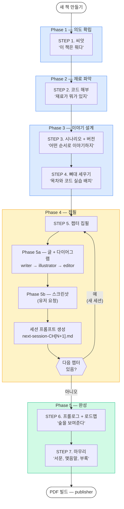
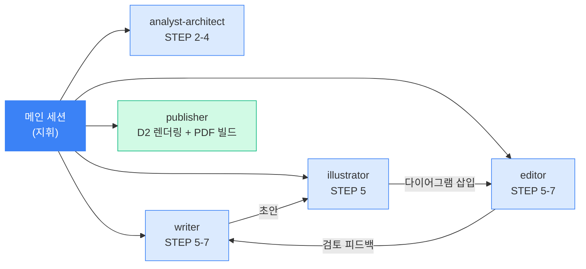

# 집필에이전트 v5

기술 서적(100페이지 권장)을 이야기처럼 쓰는 워크플로우 시스템.

저자(도메인 전문가)와 하나의 AI(Claude)가 대화하며 책을 완성한다.

## 빠른 시작

1. Claude Code에서 이 프로젝트 폴더를 연다
2. `새 책 만들기` 입력
3. STEP 순서대로 진행

## 상황별 사용 가이드

### 처음 시작할 때

| 명령어 | 하는 일 |
|--------|---------|
| `새 책 만들기` | 프로젝트 생성 + 완성 코드 준비 |
| `씨앗 심기` | 6개 질문으로 책의 의도 확립 |
| `코드 분석` | 완성 코드를 의도 필터로 분석 |

완성 코드가 먼저 준비되어 있어야 한다. `code/` 폴더에 직접 넣거나 GitHub URL을 알려주면 된다.

### 구조를 잡을 때

| 명령어 | 하는 일 |
|--------|---------|
| `시나리오 설계` | 시나리오 + 버전 분해 + 버전별 예제 코드 |
| `뼈대 세우기` | 코드 실습 분류 + 목차 + 갭 분석 |

### 챕터를 쓸 때

| 명령어 | 하는 일 |
|--------|---------|
| `챕터 작성 [번호]` | 이야기 파트 + 기술 파트 집필 (writer → editor) |
| `검토 [챕터]` | 3인 편집위원회 재검토 |

- writer가 `[CAPTURE NEEDED]`, `[GEMINI PROMPT]` 플레이스홀더를 삽입해둔다
- 이미지 생성은 자동이 아니라 유저가 별도 요청한다 (아래 참조)

### 코드가 완성되어 스크린샷/이미지를 만들 때

코드 실행 결과가 확정된 후, 유저가 직접 요청한다.

| 대상 | 방법 |
|------|------|
| 터미널 캡처 | screenshot 스킬 → `scripts/terminal_screenshot.py` |
| 브라우저 캡처 | screenshot 스킬 → Playwright MCP |
| 개념도 | `[GEMINI PROMPT]`의 프롬프트를 유저가 Gemini에 직접 입력 |
| 다이어그램 | publisher(인쇄소)가 D2/Mermaid → 이미지 렌더링 |

이미지 생성 후 해당 이미지의 파일명을 교체한다.

### 챕터 완료 후 세션 선택 (가장 중요)

챕터 완료 시 `prompts/next-session-CH[N+1].md`가 자동 생성된다. 유저에게 선택지를 제시한다.

```
CH[N] 완료!

다음 작업을 선택하세요:
1. 다음 챕터를 새 세션에서 시작 (프롬프트 생성 완료)
2. 이 세션에서 바로 다음 챕터 이어서 작성
3. 이미지 작업 먼저 진행
```

세션이 끊겼을 때는 `이어하기` → `prompts/next-session-*.md`를 읽어 컨텍스트를 복구한다.

| 완료 시점 | 생성되는 프롬프트 |
|----------|-----------------|
| STEP 4 완료 | `next-session-CH01.md` |
| CH[N] 완료 | `next-session-CH[N+1].md` |
| 마지막 챕터 완료 | `next-session-마무리.md` |
| STEP 7 완료 | `next-session-인쇄소.md` |

### 마무리할 때

| 명령어 | 하는 일 |
|--------|---------|
| `프롤로그 생성` | 코드 없이 전체 개념을 이야기로 |
| `마무리` | 서문, 맺음말, 부록, 최종 제목 |

### PDF 빌드 (인쇄소)

STEP 7 완료 후 publisher 에이전트가 PDF를 생성한다. 두 가지 방법이 있다.

#### 인쇄소 시작

Claude Code에서 아래 중 하나로 시작한다.

```
인쇄소 시작           # publisher 에이전트가 프리뷰 에디터 제안
PDF 빌드              # 위와 동일
```

publisher가 프리뷰 에디터 사용 여부를 물어본다.

```
프리뷰 에디터를 사용하면 브라우저에서 실시간으로 디자인을 확인할 수 있습니다.

1. 네, 프리뷰 에디터로 작업합니다 (Recommended)
2. 아니요, CLI에서 바로 PDF를 빌드합니다
```

#### .pdf-build/ 스테이징 구조

프리뷰 서버가 시작되면 소스 MD 파일을 `.pdf-build/`로 복사한다. 모든 빌드 중간 산출물도 이 폴더에 저장된다.

```
projects/사내AI비서_v2/.pdf-build/
├── md/                         ← 소스에서 복사한 원본 MD
│   ├── front/
│   │   ├── prologue.md         ← book/front/에서 복사
│   │   ├── prologue-v1.md      ← 이전 버전도 함께 복사
│   │   ├── preface.md
│   │   └── toc.md
│   ├── chapters/
│   │   ├── 00-들어가며.md       ← chapters/에서 복사
│   │   ├── 01-환각과-RAG의-첫-만남.md
│   │   └── ...
│   └── back/
│       ├── epilogue.md          ← book/back/에서 복사
│       └── appendix.md
├── integrated.md               ← Stage 1: 통합 MD
├── final.typ                   ← Stage 2: 디자인 조립 결과
├── preview_svg/                ← SVG 프리뷰 페이지
├── preview.pdf                 ← 검증용 PDF
└── _mermaid_images/            ← Mermaid 렌더링
```

버전 파일(`-v1`, `-v2`)이 있으면 전부 복사하되, 버전 없는 파일(최신)만 기본 선택된다. 이전 버전으로 빌드하고 싶으면 체크박스에서 전환한다.

소스 파일이 변경되면 "Restage" 버튼으로 다시 복사한다.

#### 방법 A: 프리뷰 에디터 (권장)

브라우저에서 실시간으로 디자인을 확인하며 PDF를 만드는 방법이다.

**사전 준비**

```bash
typst --version    # Typst 컴파일러
pandoc --version   # Pandoc 변환기
python3 --version  # Python 3.10+
```

**실행**

```bash
python3 .claude/skills/pub-studio/references/preview.py                    # 프로젝트 자동 감지
python3 .claude/skills/pub-studio/references/preview.py 사내AI비서_v2       # 프로젝트 지정
python3 .claude/skills/pub-studio/references/preview.py --port 8080        # 포트 지정
python3 .claude/skills/pub-studio/references/preview.py --file book/통합본.typ  # 파일 모드
```

서버가 시작되면 `http://localhost:3333`이 자동으로 열린다.

**작업 순서**

| 순서 | 할 일 | 조작 |
|------|-------|------|
| 1 | 파일 확인 | 사이드바 파일 목록에서 빌드할 챕터 확인 (버전 파일은 기본 해제) |
| 2 | 디자인 프리셋 선택 | 사이드바 → 프리셋 (d1 클래식 블루 / d2 컴팩트 모노) |
| 3 | 첫 빌드 | "Build" 클릭 → SVG 프리뷰 생성 (5-10초) |
| 4 | 디자인 미세 조정 | 폰트/여백/색상 슬라이더 → 즉시 프리뷰 갱신 (~200ms) |
| 5 | 커스텀 디자인 저장 | "저장된 디자인" → 이름 입력 → 저장 (다음에 불러오기 가능) |
| 6 | 이미지 크기 조절 | 이미지 패널 → 개별 이미지 width 슬라이더 |
| 7 | 레이아웃 자동 검수 | "Verified Build" → 빈 페이지, 고아줄 자동 수정 (최대 3라운드) |
| 8 | 수동 이슈 확인 | Layout Issues 탭 → 페이지별 사용률 + 이슈 목록 |
| 9 | PDF 내보내기 | "Export PDF" → `book/output/`에 최종 PDF 생성 |

**빌드 속도가 다른 이유 (2단계 캐시)**

| 변경 내용 | 재빌드 범위 | 소요 시간 |
|-----------|------------|----------|
| 디자인만 변경 (폰트, 여백, 색상) | Stage 2만 재실행 | ~200ms |
| MD 글 내용 변경 | Stage 1 + Stage 2 전체 | ~5-10초 |

**Verified Build가 자동으로 고치는 것**

| 이슈 유형 | 자동 수정 | 방법 |
|-----------|----------|------|
| 빈 페이지 (`blank_page`) | O | pagebreak 제거 |
| 고아 콘텐츠 (`orphan_content`) | O | 이전 페이지 이미지 5% 축소 |
| 큰 이미지 (`large_image`) | O | 이미지 width 10% 단계 축소 |
| 낮은 페이지 사용률 (`low_usage`) | X | Layout 탭에서 직접 확인 |
| 밀림 패턴 (`push_pattern`) | X | Layout 탭에서 직접 확인 |

#### 방법 B: CLI 빌드

프리뷰 없이 터미널에서 바로 PDF를 빌드하는 방법이다.

**1단계: 디자인 선택** (첫 빌드 시 1회)

`component-catalog.pdf`를 보고 컴포넌트별 디자인 번호를 선택한다. 프리셋(전체 동일) 또는 믹스매치(컴포넌트별 선택) 가능.

```bash
python3 book/build_pdf_typst.py --design 1                              # 프리셋
python3 book/build_pdf_typst.py --design "body=2,heading=1,code=2"      # 믹스매치
```

**2단계: D2 다이어그램 변환**

Mermaid 다이어그램을 D2로 변환하고 PNG로 렌더링한다.

```bash
# Mermaid → D2 자동 변환
python3 mermaid_to_d2.py --extract chapters/01-시작.md --outdir assets/CH01/diagram/

# D2 → PNG (꺾인선 라우팅)
d2 --layout elk --pad 40 input.d2 output.svg
rsvg-convert -d 144 -p 144 output.svg -o output.png
```

**3단계: PDF 빌드 파이프라인** (6단계)

```
[1/6] 마크다운 통합 + 전처리 (주석 제거, 이미지 경로, <br> 변환)
[2/6] 이미지 공백 자동 제거 (autocrop)
[3/6] Pandoc 변환 (MD → Typst)
[4/6] 후처리 + 템플릿 병합 (design_assembler → book_base 조립)
[5/6] Typst 컴파일 → PDF
[6/6] 레이아웃 분석
```

**4단계: 레이아웃 검수 루프**

build → layout-check → image-optimize/page-fit → rebuild (최대 3회)

### 언제든

`현재 상태` → progress.json 기반 진행률 확인

---

## 워크플로우 (7 STEP)



### 에이전트 디스패치



---

## 시스템 구조

```
CLAUDE.md                  ← 핵심 정책 + 명령어 라우팅
│
├── .claude/
│   ├── rules/             ← 글로벌 규칙 (style, code, structure)
│   ├── agents/            ← 에이전트 5개
│   │   ├── analyst-architect/  ← 코드 분석 + 구조 설계
│   │   ├── writer/             ← 이야기 + 기술 파트 집필
│   │   ├── editor/             ← 품질 검증 (3인 편집위원회)
│   │   ├── illustrator/        ← 다이어그램 렌더링
│   │   └── publisher/          ← PDF 빌드
│   ├── skills/            ← 스킬 카테고리 (on-demand 로딩)
│   │   ├── CATALOG.md     ← 22개 + 인쇄소 6개 스킬 전체 목록
│   │   ├── writing/       ← 스토리텔링, 문체
│   │   ├── code/          ← 코드 분석, 설명
│   │   ├── planning/      ← 갭 분석, 분량 관리
│   │   ├── visual/        ← Mermaid, 이미지 플레이스홀더
│   │   ├── screenshot/    ← 터미널/브라우저 캡처
│   │   ├── review/        ← 검토 판정, 체크리스트
│   │   ├── pub-studio/    ← 프리뷰 에디터 + 검증 빌드 (통합)
│   │   ├── pub-build/     ← MD→Typst→PDF 빌드 파이프라인
│   │   ├── pub-typst-design/ ← Typst 템플릿 + 컴포넌트
│   │   ├── pub-layout-check/ ← PDF 레이아웃 분석
│   │   ├── pub-page-fit/  ← 레이아웃 자동수정 전략
│   │   └── pub-image-optimize/ ← 이미지 공백제거 + 크기조절
│   └── workflow/          ← 7 STEP 실행 가이드
│       ├── step1~7.md     ← 각 STEP 절차 상세
│       └── review-guide.md
│
├── design/                ← 설계 문서 (v1~v3)
├── docs/                  ← 분석/검토 문서
└── projects/              ← 프로젝트별 산출물
```

### 지침 로딩 방식

| 계층 | 파일 | 로딩 시점 | 역할 |
|------|------|----------|------|
| 핵심 정책 | `CLAUDE.md` | 매 턴 자동 | 아이덴티티, 라우팅, 스타일 가드레일 |
| 룰 | `.claude/rules/*.md` | 매 턴 자동 | 글로벌 스타일/코드/구조 규칙 |
| 스킬 | `.claude/skills/*/SKILL.md` | 명령어 실행 시 on-demand | 상세 규칙, 예시, 상수 |
| 워크플로우 | `.claude/workflow/step*.md` | 명령어 실행 시 Read | STEP별 절차 가이드 |

---

## 설계 원칙

- **메인 세션이 지휘한다.** STEP을 따라가며 전문 에이전트를 디스패치하고, 각 에이전트가 스킬로 산출물을 만든다.
- **CLAUDE.md는 슬림하게.** 핵심 정책 + 라우팅만. 상세 규칙은 스킬에서 on-demand 로딩.
- **스킬은 22개.** 각각 하나의 작업만 수행하는 원자적 도구. 필요할 때만 로드.
- **검토 모드는 3개.** 인사이트(놓친 질문) + 의도감시(seed.md 대조) + 감수(3인 편집장).
