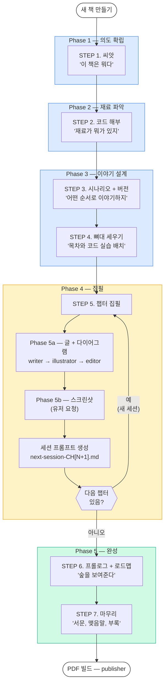
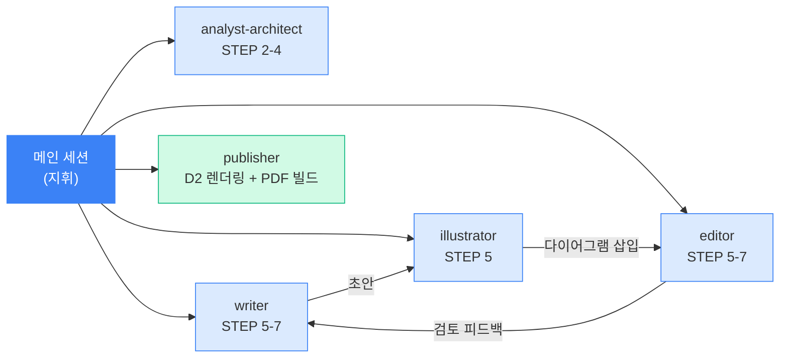

# 집필에이전트 v5

기술 서적(100페이지 권장)을 이야기처럼 쓰는 워크플로우 시스템.

저자(도메인 전문가)와 하나의 AI(Claude)가 대화하며 책을 완성한다.

## 빠른 시작

1. Claude Code에서 이 프로젝트 폴더를 연다
2. `새 책 만들기` 입력
3. STEP 순서대로 진행

---

## 새 책을 시작하는 방법 (HTML 미리보기 워크플로우)

마크다운을 편집하면서 브라우저에서 실시간으로 결과를 보는 **HTML → PDF 파이프라인** 사용법. 스킬: [`pub-html-build`](.claude/skills/pub-html-build/SKILL.md)

### 시작하기 전: 어떤 상황인가요?

네 가지 진입 경로가 있습니다. 자기 상황에 맞는 걸 고르세요.

| 상황 | 시작 방법 | 링크 |
|------|----------|------|
| **완전히 새 책** (0부터 기획·집필까지) | `새 책 만들기` 명령 → 7 STEP 워크플로우 | [워크플로우 (7 STEP)](#워크플로우-7-step) |
| **이미 md가 있음** (빌드/디자인만 필요) | `init_book.sh` → 아래 1단계부터 | 이 섹션 계속 |
| **기존 디자인 재사용** (브랜드 컬러만 바꾸기) | `init_book.sh` → `.build/tokens.css` 오버라이드 | [`modes/reuse.md`](.claude/skills/pub-html-build/modes/reuse.md) |
| **새 디자인 탐색** (새 컴포넌트·새 톤) | 내장 7 질문 → 강제 4축 변형(Editorial/Playful/Technical/Bold) → 카탈로그 등록 | [`modes/design-explore.md`](.claude/skills/pub-html-build/modes/design-explore.md) |

**카탈로그 우선 원칙**: 챕터를 쓸 때 [`components-catalog/`](.claude/skills/pub-html-build/components-catalog/) 6 카테고리(boxes / fullmap / cards / comparisons / pipelines / captions)에서 컴포넌트를 먼저 조립하세요. 재사용률 80% 이상이면 `reuse.md`로, 미만이면 `design-explore.md`로 갑니다.

**superpowers 없이도 동작**: `pub-html-build`는 자기완결형 스킬입니다. superpowers 플러그인이 있으면 `brainstorming`·`writing-plans`·`verification` 연계 가능하지만, 없어도 내장 절차로 완주할 수 있습니다.

### 1단계. 프로젝트 골격 생성

```bash
# 레포 루트에서 실행
bash .claude/skills/pub-html-build/scripts/init_book.sh projects/새책이름
```

생기는 구조:
```
projects/새책이름/
├── chapters/                # 마크다운 챕터 (NN-제목.md)
├── assets/                  # 이미지·다이어그램
└── book/
    ├── tokens.css           # 브랜드 오버라이드 (선택, 비워 두면 기본값)
    ├── front/               # 프롤로그·머릿말
    ├── back/                # 에필로그·부록
    ├── build/               # HTML 산출물 (빌드 시 자동 생성)
    └── output/              # 최종 PDF
```

### 2단계. 의존성 설치 (프로젝트별 1회)

```bash
cd projects/새책이름
python3.12 -m venv .venv
source .venv/bin/activate
pip install markdown-it-py mdit-py-plugins jinja2 playwright pygments
python -m playwright install chromium   # PDF 생성용 (HTML만 볼 거면 생략 가능)
cd ../..
```

### 3단계. 첫 챕터 작성

```bash
# chapters/01-시작하기.md 같은 파일을 에디터로 작성
# 커스텀 블록(:::goal, :::tip, :::remember), 코드 배지([실습 N], [터미널], [설명], [참고]),
# HTML 컴포넌트(.lcel-pipeline, .wrapper-arch, ...)를 자유롭게 사용 가능.
```

### 4단계. 첫 빌드

```bash
# 레포 루트에서
projects/새책이름/.venv/bin/python3 \
  .claude/skills/pub-html-build/build_html.py \
  --project-root projects/새책이름 --chapter 1
```

성공 시:
- `projects/새책이름/.build/01-*.html` 생성
- 레포 루트에 `새책이름` alias 심링크 자동 생성 (progress.json의 `alias` 또는 폴더명에서 `_vNN` 제거)
- 빌드 로그 끝에 `🔗 열기: file://…` URL 출력

### 5단계. 브라우저로 미리보기

빌드 로그에 나온 `file://…` URL을 브라우저 주소창에 붙여 넣거나, 터미널에서:

```bash
open "projects/새책이름/.build/01-*.html"
```

혹은 레포 루트 alias 심링크 경유(짧은 경로):

```bash
open "새책이름/.build/01-*.html"
```

`file://` 단일 경로이므로 로컬 서버 필요 없음. 파일을 수정하면 브라우저만 새로고침하면 된다.

### 6단계. 편집 ↔ 자동 재빌드 루프

Claude Code 안에서 챕터 md를 Edit/Write로 수정하면 **자동으로 백그라운드 빌드**가 돌아갑니다 (2~3초). 브라우저만 새로고침하면 반영됨.

훅 위치: `.claude/hooks/auto-rebuild-chapter.sh`
설정: `.claude/settings.local.json` → `hooks.PostToolUse`

파일 조건:
- `projects/*/chapters/NN-*.md` 만 반응 (legacy 폴더 제외)
- 다른 파일(코드·스타일 등)은 훅이 조용히 넘어감

### 7단계. PDF 출력 (선택)

HTML 프리뷰 한 장을 PDF 파일로 공유할 필요가 있으면 별도 스킬 `pub-html-to-pdf`:

```bash
projects/새책이름/.venv/bin/python3 \
  .claude/skills/pub-html-to-pdf/build_pdf.py \
  --project-root projects/새책이름 --chapter 1
# → projects/새책이름/.build/pdf/01-*.pdf
```

정식 전자책 A4 PDF는 이 경로가 아니라 Typst 파이프라인(`pub-build`)이 담당한다. `pub-html-to-pdf`는 예비·공유용이다.

### 브랜드 색상 바꾸기

프로젝트의 `.build/tokens.css`만 편집하면 전체 디자인이 따라옵니다:

```css
:root {
  --color-accent: #2563eb;        /* 인디고 → 블루 */
  --color-accent-bg: #dbeafe;
  --color-accent-border: #93c5fd;
  --color-accent-text: #1e40af;
}
```

### 빌드 옵션 요약

| 플래그 | 효과 |
|--------|------|
| `--project-root PATH` | 필수. 책 프로젝트 루트 |
| `--chapter N` | 특정 챕터만 빌드 (생략 시 모든 챕터) |

PDF 변환 옵션(`--no-pagedjs` 등)은 별도 스킬 `pub-html-to-pdf`의 `build_pdf.py`에 있다.

### 스킬이 제공하는 자산

```
.claude/skills/pub-html-build/
├── SKILL.md                      # 스킬 문서
├── build_html.py                 # 파이프라인 진입점 (HTML 전용)
├── templates/
│   └── chapter-template.html     # Jinja2 템플릿
├── styles/
│   ├── tokens.css                # 디자인 토큰 (브랜드 오버라이드 가능)
│   ├── fonts.css                 # 폰트
│   ├── base.css                  # 타이포그래피·코드블록·Pygments
│   ├── components.css            # 커스텀 블록 (:::goal 등)
│   ├── diagrams.css              # 시각화 컴포넌트 (lcel-pipeline 등)
│   └── print.css                 # @page 규칙
└── scripts/
    └── init_book.sh              # 새 책 초기화
```

프로젝트는 콘텐츠만 소유, 인프라는 스킬이 담당.

---

## 상황별 사용 가이드

### 처음 시작할 때

| 명령어 | 하는 일 |
|--------|---------|
| `새 책 만들기` | 프로젝트 생성 + 완성 코드 준비 |
| `씨앗 심기` | 6개 질문으로 책의 의도 확립 |
| `코드 분석` | 완성 코드를 의도 필터로 분석 |

완성 코드가 먼저 준비되어 있어야 한다. `code/` 폴더에 직접 넣거나 GitHub URL을 알려주면 된다.

### 구조를 잡을 때

| 명령어 | 하는 일 |
|--------|---------|
| `시나리오 설계` | 시나리오 + 버전 분해 + 버전별 예제 코드 |
| `뼈대 세우기` | 코드 실습 분류 + 목차 + 갭 분석 |

### 챕터를 쓸 때

| 명령어 | 하는 일 |
|--------|---------|
| `챕터 작성 [번호]` | 이야기 파트 + 기술 파트 집필 (writer → editor) |
| `검토 [챕터]` | 3인 편집위원회 재검토 |

- writer가 `[CAPTURE NEEDED]`, `[IMAGE PROMPT]` 플레이스홀더를 삽입해둔다
- 이미지 생성은 자동이 아니라 유저가 별도 요청한다 (아래 참조)

### 코드가 완성되어 스크린샷/이미지를 만들 때

코드 실행 결과가 확정된 후, 유저가 직접 요청한다.

| 대상 | 방법 |
|------|------|
| 터미널 캡처 | screenshot 스킬 → `scripts/terminal_screenshot.py` |
| 브라우저 캡처 | screenshot 스킬 → Playwright MCP |
| 개념도 | `[IMAGE PROMPT]`의 프롬프트를 유저가 Gemini에 직접 입력 |
| 다이어그램 | publisher(인쇄소)가 D2/Mermaid → 이미지 렌더링 |

이미지 생성 후 해당 이미지의 파일명을 교체한다.

### 챕터 완료 후 세션 선택 (가장 중요)

챕터 완료 시 `prompts/next-session-CH[N+1].md`가 자동 생성된다. 유저에게 선택지를 제시한다.

```
CH[N] 완료!

다음 작업을 선택하세요:
1. 다음 챕터를 새 세션에서 시작 (프롬프트 생성 완료)
2. 이 세션에서 바로 다음 챕터 이어서 작성
3. 이미지 작업 먼저 진행
```

세션이 끊겼을 때는 `이어하기` → `prompts/next-session-*.md`를 읽어 컨텍스트를 복구한다.

| 완료 시점 | 생성되는 프롬프트 |
|----------|-----------------|
| STEP 4 완료 | `next-session-CH01.md` |
| CH[N] 완료 | `next-session-CH[N+1].md` |
| 마지막 챕터 완료 | `next-session-마무리.md` |
| STEP 7 완료 | `next-session-인쇄소.md` |

### 마무리할 때

| 명령어 | 하는 일 |
|--------|---------|
| `프롤로그 생성` | 코드 없이 전체 개념을 이야기로 |
| `마무리` | 서문, 맺음말, 부록, 최종 제목 |

### PDF 빌드 (인쇄소)

STEP 7 완료 후 `인쇄소` 명령으로 시작한다. Phase A(메인 세션) → Phase B(서브에이전트) 순서로 진행.

#### 전체 흐름

```
[메인 세션] Phase A: 출판정보 + 표지
  ┌─ 1. 출판정보 확인 ─────────────────────────────────┐
  │  publish-info-pod.md 확인 (없으면 자동 생성)        │
  │  seed에서 제목/부제 추출 → 목차/페이지수/판권지     │
  └────────────────────────────────────────────────────┘
  ┌─ 2. 표지 디자인 위자드 (4단계) ────────────────────┐
  │  Step 1. 레이아웃    --cover-preview --ebook        │
  │  Step 2. 그림자      --cover-shadow --ebook         │
  │  Step 3. 폰트 색상   --cover-color --ebook          │
  │  Step 4. 최종 확인   --cover-confirm --ebook        │
  │                                                     │
  │  각 단계: 4변형 생성 → HTML UI → 유저 선택          │
  │  전자책: 750x1110px, 72ppi, JPG, 2MB 이하           │
  └────────────────────────────────────────────────────┘

[서브에이전트] Phase B: Publisher 디스패치
  1. 온보딩      → 디자인 방식 선택 (CLI / 프리뷰)
  2. 디자인 선택  → 본문/제목/코드블록 프리셋
  3. D2 변환     → Mermaid → D2 → PNG (모노톤)
  4. PDF 빌드    → MD → Typst → PDF (6단계 파이프라인)
  5. 레이아웃 검수 → 자동수정 최대 3회
```

> 표지 위자드는 서브에이전트가 이미지를 유저에게 표시할 수 없으므로 메인 세션이 직접 처리한다.

#### 인쇄소 시작

```
인쇄소                # Phase A부터 시작
```

publisher가 프리뷰 에디터 사용 여부를 물어본다.

```
프리뷰 에디터를 사용하면 브라우저에서 실시간으로 디자인을 확인할 수 있습니다.

1. 네, 프리뷰 에디터로 작업합니다 (Recommended)
2. 아니요, CLI에서 바로 PDF를 빌드합니다
```

#### .pdf-build/ 스테이징 구조

프리뷰 서버가 시작되면 소스 MD 파일을 `.pdf-build/`로 복사한다. 모든 빌드 중간 산출물도 이 폴더에 저장된다.

```
projects/사내AI비서_v2/.pdf-build/
├── md/                         ← 소스에서 복사한 원본 MD
│   ├── front/
│   │   ├── prologue.md         ← book/front/에서 복사
│   │   ├── prologue-v1.md      ← 이전 버전도 함께 복사
│   │   ├── preface.md
│   │   └── toc.md
│   ├── chapters/
│   │   ├── 00-들어가며.md       ← chapters/에서 복사
│   │   ├── 01-환각과-RAG의-첫-만남.md
│   │   └── ...
│   └── back/
│       ├── epilogue.md          ← book/back/에서 복사
│       └── appendix.md
├── integrated.md               ← Stage 1: 통합 MD
├── final.typ                   ← Stage 2: 디자인 조립 결과
├── preview_svg/                ← SVG 프리뷰 페이지
├── preview.pdf                 ← 검증용 PDF
└── _mermaid_images/            ← Mermaid 렌더링
```

버전 파일(`-v1`, `-v2`)이 있으면 전부 복사하되, 버전 없는 파일(최신)만 기본 선택된다. 이전 버전으로 빌드하고 싶으면 체크박스에서 전환한다.

소스 파일이 변경되면 "Restage" 버튼으로 다시 복사한다.

#### 방법 A: 프리뷰 에디터 (권장)

브라우저에서 실시간으로 디자인을 확인하며 PDF를 만드는 방법이다.

**사전 준비**

```bash
typst --version    # Typst 컴파일러
pandoc --version   # Pandoc 변환기
python3 --version  # Python 3.10+
```

**실행**

```bash
python3 .claude/skills/pub-studio/references/preview.py                    # 프로젝트 자동 감지
python3 .claude/skills/pub-studio/references/preview.py 사내AI비서_v2       # 프로젝트 지정
python3 .claude/skills/pub-studio/references/preview.py --port 8080        # 포트 지정
python3 .claude/skills/pub-studio/references/preview.py --file book/통합본.typ  # 파일 모드
```

서버가 시작되면 `http://localhost:3333`이 자동으로 열린다.

**작업 순서**

| 순서 | 할 일 | 조작 |
|------|-------|------|
| 1 | 파일 확인 | 사이드바 파일 목록에서 빌드할 챕터 확인 (버전 파일은 기본 해제) |
| 2 | 디자인 프리셋 선택 | 사이드바 → 프리셋 (d1 클래식 블루 / d2 컴팩트 모노) |
| 3 | 첫 빌드 | "Build" 클릭 → SVG 프리뷰 생성 (5-10초) |
| 4 | 디자인 미세 조정 | 폰트/여백/색상 슬라이더 → 즉시 프리뷰 갱신 (~200ms) |
| 5 | 커스텀 디자인 저장 | "저장된 디자인" → 이름 입력 → 저장 (다음에 불러오기 가능) |
| 6 | 이미지 크기 조절 | 이미지 패널 → 개별 이미지 width 슬라이더 |
| 7 | 레이아웃 자동 검수 | "Verified Build" → 빈 페이지, 고아줄 자동 수정 (최대 3라운드) |
| 8 | 수동 이슈 확인 | Layout Issues 탭 → 페이지별 사용률 + 이슈 목록 |
| 9 | PDF 내보내기 | "Export PDF" → `book/output/`에 최종 PDF 생성 |

**빌드 속도가 다른 이유 (2단계 캐시)**

| 변경 내용 | 재빌드 범위 | 소요 시간 |
|-----------|------------|----------|
| 디자인만 변경 (폰트, 여백, 색상) | Stage 2만 재실행 | ~200ms |
| MD 글 내용 변경 | Stage 1 + Stage 2 전체 | ~5-10초 |

**Verified Build가 자동으로 고치는 것**

| 이슈 유형 | 자동 수정 | 방법 |
|-----------|----------|------|
| 빈 페이지 (`blank_page`) | O | pagebreak 제거 |
| 고아 콘텐츠 (`orphan_content`) | O | 이전 페이지 이미지 5% 축소 |
| 큰 이미지 (`large_image`) | O | 이미지 width 10% 단계 축소 |
| 낮은 페이지 사용률 (`low_usage`) | X | Layout 탭에서 직접 확인 |
| 밀림 패턴 (`push_pattern`) | X | Layout 탭에서 직접 확인 |

#### 방법 B: CLI 빌드

프리뷰 없이 터미널에서 바로 PDF를 빌드하는 방법이다.

**1단계: 디자인 선택** (첫 빌드 시 1회)

`component-catalog.pdf`를 보고 컴포넌트별 디자인 번호를 선택한다. 프리셋(전체 동일) 또는 믹스매치(컴포넌트별 선택) 가능.

```bash
python3 book/build_pdf_typst.py --design 1                              # 프리셋
python3 book/build_pdf_typst.py --design "body=2,heading=1,code=2"      # 믹스매치
```

**2단계: D2 다이어그램 변환**

Mermaid 다이어그램을 D2로 변환하고 PNG로 렌더링한다.

```bash
# Mermaid → D2 자동 변환
python3 mermaid_to_d2.py --extract chapters/01-시작.md --outdir assets/CH01/diagram/

# D2 → PNG (꺾인선 라우팅)
d2 --layout elk --pad 40 input.d2 output.svg
rsvg-convert -d 144 -p 144 output.svg -o output.png
```

**3단계: PDF 빌드 파이프라인** (6단계)

```
[1/6] 마크다운 통합 + 전처리 (주석 제거, 이미지 경로, <br> 변환)
[2/6] 이미지 공백 자동 제거 (autocrop)
[3/6] Pandoc 변환 (MD → Typst)
[4/6] 후처리 + 템플릿 병합 (design_assembler → book_base 조립)
[5/6] Typst 컴파일 → PDF
[6/6] 레이아웃 분석
```

**4단계: 레이아웃 검수 루프**

build → layout-check → image-optimize/page-fit → rebuild (최대 3회)

### 언제든

`현재 상태` → progress.json 기반 진행률 확인

---

## 워크플로우 (7 STEP)


```mermaid
flowchart TD
    START([새 책 만들기]) --> S1

    subgraph P1["Phase 1 — 의도 확립"]
        S1["STEP 1. 씨앗\n'이 책은 뭐다'"]
    end

    subgraph P2["Phase 2 — 재료 파악"]
        S2["STEP 2. 코드 해부\n'재료가 뭐가 있지'"]
    end

    subgraph P3["Phase 3 — 이야기 설계"]
        S3["STEP 3. 시나리오 + 버전\n'어떤 순서로 이야기하지'"]
        S4["STEP 4. 뼈대 세우기\n'목차와 코드 실습 배치'"]
        S3 --> S4
    end

    subgraph P4["Phase 4 — 집필"]
        S5["STEP 5. 챕터 집필"]
        S5a["Phase 5a — 글 + 다이어그램\nwriter → illustrator → editor"]
        S5b["Phase 5b — 스크린샷\n(유저 요청)"]
        S5d["세션 프롬프트 생성\nnext-session-CH[N+1].md"]
        S5c{{"다음 챕터\n있음?"}}
        S5 --> S5a --> S5b --> S5d --> S5c
        S5c -- "예\n(새 세션)" --> S5
    end

    subgraph P5["Phase 5 — 완성"]
        S6["STEP 6. 프롤로그 + 로드맵\n'숲을 보여준다'"]
        S7["STEP 7. 마무리\n'서문, 맺음말, 부록'"]
        S6 --> S7
    end

    S1 --> S2 --> S3
    S4 --> S5
    S5c -- "아니오" --> S6
    S7 --> PUB([PDF 빌드 — publisher])

    style P1 fill:#dbeafe,stroke:#3b82f6
    style P2 fill:#dbeafe,stroke:#3b82f6
    style P3 fill:#dbeafe,stroke:#3b82f6
    style P4 fill:#fef3c7,stroke:#f59e0b
    style P5 fill:#d1fae5,stroke:#10b981
    style START fill:#fff,stroke:#333
    style PUB fill:#fff,stroke:#333
```

### 에이전트 디스패치


```mermaid
flowchart LR
    MAIN["메인 세션\n(지휘)"] --> AA["analyst-architect\nSTEP 2-4"]
    MAIN --> W["writer\nSTEP 5-7"]
    MAIN --> I["illustrator\nSTEP 5"]
    MAIN --> E["editor\nSTEP 5-7"]
    MAIN --> PUB["publisher\nD2 렌더링 + PDF 빌드"]

    W -- "초안" --> I
    I -- "다이어그램 삽입" --> E
    E -- "검토 피드백" --> W

    style MAIN fill:#3b82f6,stroke:#3b82f6,color:#fff
    style AA fill:#dbeafe,stroke:#3b82f6
    style W fill:#dbeafe,stroke:#3b82f6
    style I fill:#dbeafe,stroke:#3b82f6
    style E fill:#dbeafe,stroke:#3b82f6
    style PUB fill:#d1fae5,stroke:#10b981
```

---

## 시스템 구조

```
CLAUDE.md                  ← 핵심 정책 + 명령어 라우팅
│
├── .claude/
│   ├── rules/             ← 규칙 Single Source of Truth (style, code, structure, writing-chapters)
│   ├── hooks/             ← PreToolUse 훅 (챕터 스타일 강제 차단)
│   ├── agents/            ← 에이전트 5개
│   │   ├── analyst-architect/  ← 코드 분석 + 구조 설계
│   │   ├── writer/             ← 이야기 + 기술 파트 집필
│   │   ├── editor/             ← 품질 검증 (3인 편집위원회)
│   │   ├── illustrator/        ← 다이어그램 렌더링
│   │   └── publisher/          ← PDF 빌드
│   ├── skills/            ← 스킬 카테고리 (on-demand 로딩)
│   │   ├── CATALOG.md     ← 22개 + 인쇄소 6개 스킬 전체 목록
│   │   ├── writing/       ← 스토리텔링, 문체
│   │   ├── code/          ← 코드 분석, 설명
│   │   ├── planning/      ← 갭 분석, 분량 관리
│   │   ├── visual/        ← Mermaid, 이미지 플레이스홀더
│   │   ├── screenshot/    ← 터미널/브라우저 캡처
│   │   ├── review/        ← 검토 판정, 체크리스트
│   │   ├── pub-studio/    ← 프리뷰 에디터 + 검증 빌드 (통합)
│   │   ├── pub-build/     ← MD→Typst→PDF 빌드 파이프라인
│   │   ├── pub-typst-design/ ← Typst 템플릿 + 컴포넌트
│   │   ├── pub-layout-check/ ← PDF 레이아웃 분석
│   │   ├── pub-page-fit/  ← 레이아웃 자동수정 전략
│   │   └── pub-image-optimize/ ← 이미지 공백제거 + 크기조절
│   └── workflow/          ← 7 STEP 실행 가이드
│       ├── step1~7.md     ← 각 STEP 절차 상세
│       └── review-guide.md
│
├── design/                ← 설계 문서 (v1~v3)
├── docs/                  ← 분석/검토 문서
└── projects/              ← 프로젝트별 산출물
```

### 지침 로딩 방식

| 계층 | 파일 | 로딩 시점 | 역할 |
|------|------|----------|------|
| 핵심 정책 | `CLAUDE.md` | 매 턴 자동 | 아이덴티티, 라우팅, 스타일 가드레일 |
| 룰 (전역) | `.claude/rules/style,code,structure.md` | 매 턴 자동 | 글로벌 스타일/코드/구조 규칙 |
| 룰 (스코핑) | `.claude/rules/writing-chapters.md` | chapters/book 파일 접근 시 | 비유 전략, 플레이스홀더, 스킬 트리거 |
| 훅 | `.claude/hooks/check-chapter-style.sh` | Edit/Write 시 PreToolUse | 금지 패턴 강제 차단 |
| 스킬 | `.claude/skills/*/SKILL.md` | 명령어 실행 시 on-demand | 상세 규칙, 예시, 상수 |
| 워크플로우 | `.claude/workflow/step*.md` | 명령어 실행 시 Read | STEP별 절차 가이드 |

---

## 글쓰기 규칙 — "교과서가 아니라 이야기"

이 시스템은 기술 서적을 소설처럼 쓴다. 규칙은 `.claude/rules/`에서 한 곳에서만 정의한다 (Single Source of Truth).

### 핵심 흐름

```
등장인물: 오픈이(주인공), 팀장/선배(역할명만, 실명 금지)
톤: 존댓말 + 캐릭터 대화만 구어체 + *내면 독백*

머릿말   → 독자의 현실 상황으로 훅 → 기술별 "왜 필요한가" → 읽는 방법
프롤로그 → 역순 훅(끝→처음) → 문제 체인 → 감정/공감 → 변화 약속
챕터     → 이야기(문제→비유→시행착오→해결) → --- → 기술(정의→실습→결과)
맺음말   → 프롤로그 이미지 회수 → 지금 달라진 점 → 다음 방향 → 닫기
```

### 10가지 글쓰기 원칙 (style.md)

1. **이야기 먼저** — 모든 챕터는 이야기 파트로 시작
2. **비유는 자유롭게** — 일상적인 것만, 페이지당 3개 이하
3. **기술은 뒤에** — 이야기 끝난 후 기술 파트에서만
4. **비유→정의 2단계** — 비유(이야기 파트) → 정식 정의(기술 파트)
5. **한 챕터 한 버전** — 챕터 끝나면 결과물 한 단계 성장
6. **점진적 깊이** — 쉬운 것 → 어려운 것
7. **코드 최소화** — 이야기 파트에 코드 없음
8. **챕터 닫기** — "이것만은 기억하자" + 다음 버전 예고
9. **실패 먼저** — 실수 → 에러 → 해결 순서
10. **실습 경계** — 실습 코드에 등장하는 것만 설명

### 소설 작법 체크리스트 (storytelling.md)

| 기법 | 규칙 |
|------|------|
| Show, Don't Tell | 감정을 직접 서술하지 않고 행동/장면으로 |
| Try/Fail 루프 | 성공 전 최소 2회 실패 |
| 문장 리듬 | 초단문(3~7글자) + 장문(35글자+) 교차 |
| 장면 전환 | `---` 전후 마지막/첫 문장 연결 |
| AI 선호어 금지 | "비로소", "드디어", "마침내", "진정한" |
| 감각 묘사 | 시각 + 청각/촉각 1개 이상 |

### 규칙 체계 (Single Source of Truth)

규칙은 `rules/`에서 한 곳에서만 정의한다. 에이전트/스킬 파일은 규칙을 복제하지 않고 `rules/`를 참조만 한다.

| 규칙 파일 | 적용 범위 | 내용 |
|----------|----------|------|
| `.claude/rules/style.md` | 전역 | 톤, 편집, 금지패턴, 글쓰기 원칙 |
| `.claude/rules/code.md` | 전역 | 코드블록, Git레포, 스크립트 규칙 |
| `.claude/rules/structure.md` | 전역 | 버전관리, 워크플로우, progress.json |
| `.claude/rules/storytelling.md` | 전역 | 소설 작법, 캐릭터, 비유, 대화체, 챕터 패턴 |
| `.claude/rules/writing-chapters.md` | `chapters/**` | 실습 규칙, 비유 전략, 플레이스홀더 |
| `.claude/rules/writing-preface.md` | `book/front/preface*` | 머릿말 패턴 |
| `.claude/rules/writing-epilogue.md` | `book/back/epilogue*` | 맺음말 패턴 |

전역 규칙은 항상 로드. paths 스코핑 규칙은 해당 경로 파일 접근 시에만 자동 로드. 서브에이전트는 AGENT.md의 `@import`로 규칙을 자동 주입받는다.

### Hooks 강제 차단

`.claude/hooks/check-chapter-style.sh`가 PreToolUse 훅으로 실행된다. chapters/book 파일 수정 시 금지 패턴(설교, 이모지, 라벨형 H2, 수평선, AI 선호어) 위반 시 Edit/Write를 차단한다.

### 파트별 작성 규칙 위치

| 파트 | 규칙 파일 | 핵심 |
|------|----------|------|
| **톤/편집** | `.claude/rules/style.md` | 존댓말, 볼드 띄어쓰기, 금지 패턴 |
| **챕터 전용** | `.claude/rules/writing-chapters.md` | 비유 전략, 플레이스홀더, 소설 작법 (paths 스코핑) |
| **스토리텔링** | `.claude/skills/writing/references/storytelling.md` | Show Don't Tell, 리듬, 비유 규칙 |
| **내러티브 작법** | `.claude/skills/writing/references/style.md` | 명사구 단문, 비유→왜→정의 |
| **프롤로그** | `.claude/workflow/step6-프롤로그.md` | 역순 훅, 문제 체인, 감정 밀도 |
| **머릿말/맺음말** | `.claude/workflow/step7-마무리.md` | 훅→기술별 필요성→마무리 |
| **챕터 구조** | `.claude/workflow/step5-챕터집필.md` | 이야기→기술 파트, 도입/닫기 |
| **챕터 형식** | `.claude/rules/structure.md` | 헤더, 코드블록, 이미지 플레이스홀더 |
| **코드 규칙** | `.claude/rules/code.md` | 이야기 파트 코드 금지, 파일 유형 |
| **버전별 성장** | `.claude/skills/writing/references/project-buildup.md` | 한 프로젝트 점진적 빌드업 |
| **박스 스타일** | `.claude/skills/writing/references/box-style.md` | 팁/주의/경고 박스 |
| **Writer** | `.claude/agents/writer/AGENT.md` | STEP별 절차 (규칙은 rules/ 참조) |
| **Editor** | `.claude/agents/editor/AGENT.md` | 검토 판정 (체크리스트는 review 스킬 참조) |

---

## 설계 원칙

- **메인 세션이 지휘한다.** STEP을 따라가며 전문 에이전트를 디스패치하고, 각 에이전트가 스킬로 산출물을 만든다.
- **CLAUDE.md는 슬림하게.** 핵심 정책 + 라우팅만. 상세 규칙은 스킬에서 on-demand 로딩.
- **스킬은 22개.** 각각 하나의 작업만 수행하는 원자적 도구. 필요할 때만 로드.
- **검토 모드는 3개.** 인사이트(놓친 질문) + 의도감시(seed.md 대조) + 감수(3인 편집장).
