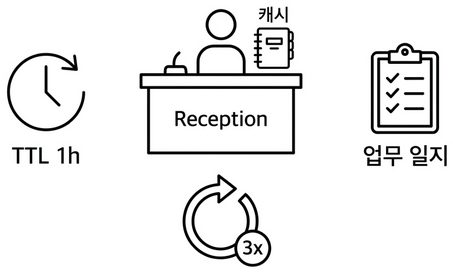
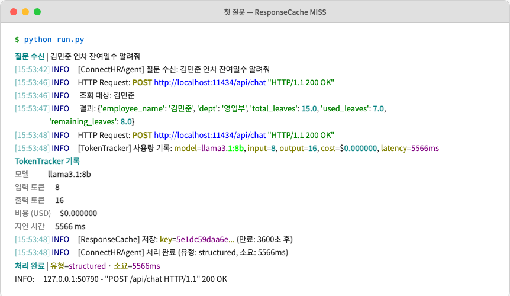
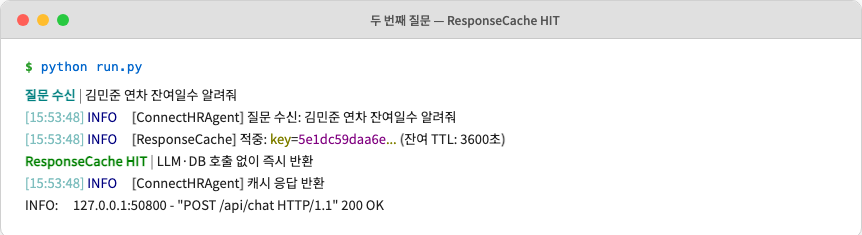
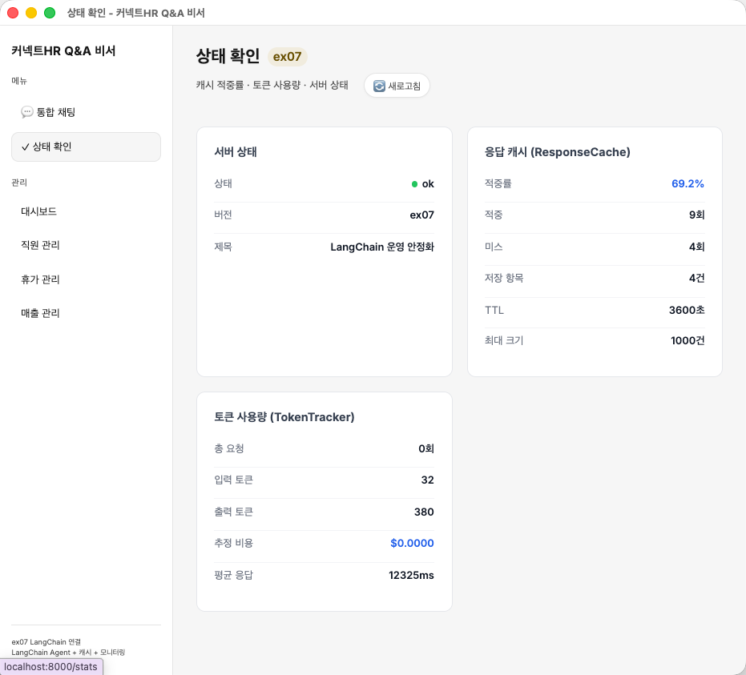

# 챕터 7. 실제로 써보니. 캐시와 모니터링

:::goal
**이번 챕터가 끝나면**

- **ResponseCache(TTL)** 로 같은 질문에 같은 답을 0.1초에 돌려줍니다
- **EmbeddingCache** 로 같은 텍스트의 임베딩 재계산을 줄입니다
- **TokenTracker** 로 LLM 호출별 토큰·비용·응답 시간을 집계합니다
- **Retry 루프**(최대 3회, 간격 2초)로 일시적 오류에서 자동 회복합니다
- 위 세 층을 챕터 6의 에이전트 바깥에 두른 운영용 래퍼 **ConnectHRAgent**를 완성합니다
:::

::::prep
**준비하기**. 실습 시작 전 한 번만 설정

### 1. 실습 폴더 이동

```bash [터미널] 폴더 이동
cd rag-start/ex07
```

파일 구조는 다음과 같습니다.

```text ex07 디렉토리
ex07/
├── run.py
├── src/
│   ├── agent_config.py         # [실습] ConnectHRAgent 운영 래퍼
│   ├── cache.py                # [실습] ResponseCache + EmbeddingCache
│   ├── monitoring.py           # [실습] TokenTracker + JSON 로깅
│   ├── llm_factory.py          # [참고] LLM 인스턴스 생성
│   ├── agent_helpers.py        # [참고] RAG 체인 + 라우팅 매핑
│   ├── router.py               # [참고] 사후 분류 로직 (챕터 6)
│   └── tools/                  # [참고] 도구 4개 (파일 분리)
│       ├── leave_balance.py
│       ├── sales_sum.py
│       ├── list_employees.py
│       └── search_documents.py
├── app/
│   ├── main.py                 # [참고] FastAPI 진입점
│   ├── chat_api.py             # [참고] Agent API 엔드포인트
│   └── database.py             # [참고] PostgreSQL 연결
├── templates/chat.html         # [참고] 채팅 UI (모드 토글 포함)
└── static/                     # [참고] UI 스타일
```

### 2. 실습 환경 구축

```bash [터미널] 환경 구성. macOS / Linux
cd ex07
cp .env.example .env
python3.12 -m venv .venv
source .venv/bin/activate
docker compose up -d
ollama pull llama3.1:8b
pip install -r requirements.txt
```

```bash [터미널] 환경 구성. Windows
cd ex07
copy .env.example .env
py -3.12 -m venv .venv
.venv\Scripts\activate
docker compose up -d
ollama pull llama3.1:8b
pip install -r requirements.txt
```

### 3. 사용할 라이브러리

| 패키지 | 역할 |
|-------|------|
| `langchain` · `langchain-ollama` | 에이전트 프레임워크 · LLM 연결 |
| `langchain-chroma` · `chromadb` | 벡터 DB |
| `sentence-transformers` | ko-sroberta 임베딩 |
| `psycopg2-binary` | PostgreSQL 드라이버 |
| `fastapi` · `uvicorn` | 웹 API 서버 |
| `rich` | 운영 로그 가독성 (컬러·테이블 출력) |

`.env` 핵심 상수입니다. 이번 챕터에서 캐시·로깅 관련 항목이 새로 등장합니다.

| 상수 | 기본값 | 역할 |
|------|-------|------|
| `CACHE_TTL` | `3600` | 응답 캐시 TTL (초) |
| `CACHE_MAX_SIZE` | `1000` | 응답 캐시 최대 항목 수 |
| `EMBEDDING_CACHE_DIR` | `./outputs/embedding_cache` | 임베딩 벡터 저장 경로 |
| `LOG_LEVEL` | `INFO` | 로그 레벨 |
| `USE_JSON_LOG` | `false` | JSON 구조화 로그 여부 |

### 4. 실습 순서

각 주제별로 이론을 짚고 바로 관련 파일 TODO를 채우는 구조입니다.

1. **7.2 캐시** ResponseCache·EmbeddingCache 이론과 `src/cache.py` 작성
2. **7.3 모니터링** TokenTracker 이론과 `src/monitoring.py` 작성
3. **7.4 Retry + ConnectHRAgent** 재시도·운영 래퍼 이론과 `src/agent_config.py` 작성
4. **7.5 서버 실행** 채팅 UI에서 같은 질문을 두 번 던져 캐시 적중 확인
::::

## 7.1 "같은 질문에 또 20초?"


*그림 7-1. 운영 안정화. 답변 메모장과 업무 일지, 재시도 매뉴얼까지 손에 쥔 사서*

챕터 6에서 통합 에이전트를 완성한 뒤 일주일이 흘렀습니다. 동료들 자리에 한 번씩 깔리던 웃음이 이제는 슬랙 채널에 모이고 있었습니다. 월요일 오전 9시 반. 오픈이는 커피잔을 책상에 내려놓고 슬랙을 열었습니다.

**동료**: "병가 증빙 필요한지 아까도 물어봤는데, 또 20초 기다려야 해요?"

20초. 커서만 깜빡이는 화면에서 20초는 깁니다. 오픈이가 터미널을 열어 같은 질문을 던져 봤습니다. 로딩 스피너가 또 20초 동안 돌아갔습니다.

*같은 질문인데 왜 매번 처음부터 찾는 거지.*

건너편 자리의 다른 동료가 의자를 돌리며 한마디 더 얹었습니다.

**동료**: "우리 팀에서 하루에 30번은 쓰는 것 같은데, 얼마나 쓰고 있는 건지 파악이 안 돼요."

얼마나 쓰는지. 호출 횟수, 응답 시간, 토큰 수. 어디에도 기록이 없었습니다. 슬랙 채널을 위로 끌어올려 보니 간간이 "에러가 났어요" 메시지도 섞여 있었습니다. 확인해 보면 네트워크 타임아웃이거나 LLM 파싱 실패. 잠시 뒤 다시 물어보면 정상인데 사용자 입장에선 "고장났다"였습니다.

*속도, 사용량, 실패. 세 가지가 한꺼번에 문제가 됐다.*

옆 자리 팀장이 지나가다 모니터를 흘끗 봤습니다.

**팀장**: "같은 질문에 매번 서가를 뒤지는 사서가 있으면 어떻겠어요?"

**오픈이**: "비효율적이죠."

**팀장**: "그럼 뭐가 필요해요?"

잠시 생각했습니다. 팀장은 답을 끌고 가는 스타일이 아니라 늘 질문을 던지는 쪽이었습니다.

*메모장. 한 번 찾은 답을 적어 두는 메모장이 있으면 되잖아.*

이번 챕터에서 챕터 6의 `IntegratedAgent`는 그대로 둡니다. 엔진을 재설계하는 게 아니라 바깥을 감싸는 작업이죠. 캐시·업무 일지·재시도 세 층을 차례로 얹고, 그 결과물을 `ConnectHRAgent`라고 부르겠습니다. 이름만 새 옷일 뿐 속은 챕터 6 그대로입니다.

<div class="sp-figure">
  <div class="sp-figure-title">그림 7-2. 챕터 6 에이전트는 그대로, 바깥에 운영 래퍼 3층을 씌웁니다</div>
  <div class="sp-compare">
    <div class="sp-compare-block">
      <div class="sp-compare-label">챕터 6. 지금까지</div>
      <div class="sp-compare-content">
        <div class="sp-row">
          <span class="sp-row-label">구성</span>
          <span class="sp-row-value">IntegratedAgent 단독</span>
        </div>
        <div class="sp-row">
          <span class="sp-row-label">코어</span>
          <span class="sp-row-value">
            <span class="sp-chip">AgentExecutor</span>
            <span class="sp-chip">MCP Tools</span>
            <span class="sp-chip">사후 분류</span>
          </span>
        </div>
        <div class="sp-row">
          <span class="sp-row-label">운영 기능</span>
          <span class="sp-row-value">없음</span>
        </div>
      </div>
    </div>
    <div class="sp-compare-block good">
      <div class="sp-compare-label">챕터 7. ConnectHRAgent</div>
      <div class="sp-compare-content">
        <div class="sp-row accent">
          <span class="sp-row-label">바깥 3층</span>
          <span class="sp-row-value">
            <span class="sp-chip accent">ResponseCache</span>
            <span class="sp-chip accent">TokenTracker</span>
            <span class="sp-chip accent">Retry 루프</span>
          </span>
        </div>
        <div class="sp-row accent">
          <span class="sp-row-label">안쪽 코어</span>
          <span class="sp-row-value">챕터 6 그대로 (수정 없음)</span>
        </div>
        <div class="sp-row accent">
          <span class="sp-row-label">호출 흐름</span>
          <span class="sp-row-value">캐시 → 재시도 → 코어 → 토큰 기록</span>
        </div>
      </div>
    </div>
  </div>
  <div class="sp-callout">같은 엔진(IntegratedAgent)이지만 바깥에 3층이 더 감싸져 있습니다. 각 층의 상세 파이프라인은 7.4절 그림 7-6에서 다룹니다.</div>
</div>

## 7.2 ResponseCache + EmbeddingCache

메모장 이야기는 팀장 자리로도 이어졌습니다. 오픈이가 화이트보드 앞에 서서 마커 뚜껑을 딸깍 열었습니다.

**팀장**: "메모장에 유통기한은 어떻게 할 건데요?"

**오픈이**: "1시간 정도요. 규정이 자주 바뀌는 건 아니지만, 하루를 넘기면 옛날 답을 줄 수도 있으니까요."

**팀장**: "그 감각이 맞아요. 메모장은 오래 들고 있을수록 독이 돼요."

챕터 5에서 사서에게 대화용 메모장(`WindowMemory`)을 줬던 기억이 떠올랐습니다. 이번에는 메모장을 두 권 더 얹습니다. 하나는 답변을 적는 메모장, 또 하나는 임베딩을 적는 메모장입니다.

### 7.2.1 답변 메모장 (ResponseCache)

같은 질문이 또 들어오면 서가까지 다시 갈 필요가 없습니다. 이전에 적어 둔 답을 바로 읽어 주면 됩니다. 단, 메모장에는 유통기한(TTL)이 있습니다. 1시간 지나면 지웁니다. 사내 규정이 바뀌었을 수도 있기 때문입니다.

<div class="timeline-spans">
  <div class="ts-head">
    <span class="ts-kind">ResponseCache</span>
    <span class="ts-sub">같은 질문을 시간 순서로 추적</span>
  </div>
  <div class="ts-axis">
    <div class="ts-time">09:00</div>
    <div class="ts-time">09:30</div>
    <div class="ts-time">10:01</div>
    <div class="ts-bar"></div>
  </div>
  <div class="ts-events">
    <div class="ts-event ts-miss">
      <div class="ts-q">"병가 증빙?"</div>
      <div class="ts-tag">MISS</div>
      <div class="ts-action">서가 가서 찾음<br>→ 메모장 기록<br><span class="ts-latency">20초</span></div>
      <div class="ts-ttl">TTL 시작</div>
    </div>
    <div class="ts-event ts-hit">
      <div class="ts-q">"병가 증빙?"</div>
      <div class="ts-tag">HIT</div>
      <div class="ts-action">메모장 확인<br>→ 즉시 반환<br><span class="ts-latency">0.1초</span></div>
      <div class="ts-ttl">잔여 30분</div>
    </div>
    <div class="ts-event ts-expired">
      <div class="ts-q">"병가 증빙?"</div>
      <div class="ts-tag">EXPIRED</div>
      <div class="ts-action">메모장 만료<br>→ 다시 서가로<br><span class="ts-latency">20초</span></div>
      <div class="ts-ttl">새 TTL 시작</div>
    </div>
  </div>
  <div class="ts-store">
    <code>self._store = {hash: (answer, expires_at)}</code>
  </div>
  <div class="cf-caption">그림 7-3. ResponseCache는 유통기한이 있는 메모장입니다. 같은 질문이 TTL 안에 다시 오면 서가(LLM)를 건너뜁니다</div>
</div>

### 7.2.2 임베딩 메모장 (EmbeddingCache)

질문을 벡터로 바꾸는 데에도 시간이 듭니다. 같은 문장을 여러 번 변환할 필요는 없습니다. 한 번 계산한 벡터를 파일로 저장해 두면 다음엔 바로 꺼내 씁니다. EmbeddingCache는 유통기한이 없습니다. 벡터 값은 텍스트만 같으면 언제든 같기 때문입니다.

<div class="cabinet-spans">
  <div class="cs-head">
    <span class="cs-kind">EmbeddingCache</span>
    <span class="cs-sub">outputs/embedding_cache/</span>
  </div>
  <div class="cs-shelf">
    <div class="cs-file ec-exists">
      <div class="ec-file-text">"연차 규정"</div>
      <div class="ec-file-arrow">→</div>
      <div class="ec-file-name">a1f3c7.pkl</div>
    </div>
    <div class="cs-file ec-exists">
      <div class="ec-file-text">"휴가 절차"</div>
      <div class="ec-file-arrow">→</div>
      <div class="ec-file-name">d9e2b5.pkl</div>
    </div>
    <div class="cs-file ec-exists">
      <div class="ec-file-text">"보안 정책"</div>
      <div class="ec-file-arrow">→</div>
      <div class="ec-file-name">7c4a8f.pkl</div>
    </div>
  </div>
  <div class="cs-lookup">
    <div class="ec-lookup-title">새 텍스트가 들어오면</div>
    <div class="ec-lookup-rows">
      <div class="ec-lookup-row ec-hit-row">
        <div class="ec-lookup-text">"연차 규정"</div>
        <div class="ec-lookup-tag">HIT</div>
        <div class="ec-lookup-action">파일 존재 → <code>pickle.load</code> → 벡터 반환 <span class="ec-latency">즉시</span></div>
      </div>
      <div class="ec-lookup-row ec-miss-row">
        <div class="ec-lookup-text">"근태 관리"</div>
        <div class="ec-lookup-tag">MISS</div>
        <div class="ec-lookup-action">파일 없음 → 임베딩 계산 → <b>새 파일 저장</b> <span class="ec-latency">약 0.5초</span></div>
      </div>
    </div>
  </div>
  <div class="cf-caption">그림 7-4. EmbeddingCache는 텍스트별 전용 서랍입니다. 서랍이 있으면 파일을 그대로 꺼내고, 없으면 계산 후 서랍 하나를 추가합니다</div>
</div>

### 7.2.3 실습 1. cache.py

`ex07/src/cache.py` 상단에는 캐시 동작을 조절하는 상수 세 개가 이미 선언돼 있습니다. `.env` 값이 없으면 이 기본값을 씁니다.

```python [설명] ex07/src/cache.py. 모듈 상수
DEFAULT_RESPONSE_TTL = 3600                  # 응답 캐시 TTL (초). 1시간
DEFAULT_RESPONSE_CACHE_MAX_SIZE = 1000       # 최대 저장 항목 수
DEFAULT_EMBEDDING_CACHE_DIR = "./outputs/embedding_cache"
```

이제 두 클래스의 `get`·`set` TODO의 `pass`를 지우고 아래 코드를 채워 보겠습니다. 키 생성(SHA-256 해시)과 파일 I/O는 `_cache_utils.py`에 헬퍼로 이미 준비돼 있어, 우리는 TTL 검사와 최대 크기 관리에만 집중합니다.

먼저 클래스 골격과 `__init__`입니다. 메모장의 용량 한도(`max_size`), 유통기한(`ttl`), 그리고 히트·미스 카운터를 준비합니다.

`ex07/src/cache.py`를 열고 TODO의 `pass`를 지우고 아래 코드를 작성합니다.

```python [실습 1] ex07/src/cache.py. ResponseCache — 초기화
class ResponseCache:
    """TTL 기반 인메모리 응답 캐시."""

    def __init__(self, ttl=DEFAULT_RESPONSE_TTL, max_size=DEFAULT_RESPONSE_CACHE_MAX_SIZE):
        # 1. TTL·max_size는 .env 또는 기본값에서 주입 (3600초, 1000개)
        self.ttl = ttl
        self.max_size = max_size
        # 2. 메모장 본체: key → (value, expires_at) 튜플
        self._store = {}
        # 3. 통계 카운터 — 운영 중 적중률을 보기 위한 값
        self._hits = 0
        self._misses = 0
        logger.info("[ResponseCache] 초기화 완료 (TTL: %d초, 최대 크기: %d)", ttl, max_size)
```

`self._store`가 메모장 본체입니다. 키 하나당 `(실제 답변, 만료 시각)` 튜플을 담습니다. 만료 시각을 같이 저장해 두는 것이 TTL 구현의 핵심입니다.

이제 조회 메서드 `get()`입니다. 세 가지 경로로 갈라집니다. 키 없음 → 만료됨 → 적중. 어느 쪽이든 카운터 갱신과 로깅을 잊지 않아야 합니다.

```python [실습 1] ex07/src/cache.py. ResponseCache.get
    def get(self, query, context=""):
        """캐시에서 응답을 조회합니다 (TTL 만료 체크)."""
        # TODO: get — TTL 검사 후 HIT/MISS 반환
        # 1. 질문(+문맥)을 SHA-256 해시로 변환해 고정 길이 키로
        key = make_response_key(query, context)

        # 2. 저장소에 키가 아예 없으면 MISS
        entry = self._store.get(key)
        if entry is None:
            self._misses += 1
            logger.debug("[ResponseCache] 미스: key=%s...", key[:12])
            return None

        # 3. 있더라도 만료 시각이 지났으면 삭제 후 MISS
        value, expires_at = entry
        if time.time() > expires_at:
            del self._store[key]
            self._misses += 1
            logger.debug("[ResponseCache] 만료: key=%s...", key[:12])
            return None

        # 4. 살아 있으면 HIT — 남은 TTL 로그로 남겨 디버깅 편하게
        self._hits += 1
        logger.info("[ResponseCache] 적중: key=%s... (잔여 TTL: %.0f초)", key[:12], expires_at - time.time())
        return value
```

핵심은 2·3·4 분기가 모두 카운터를 갱신한다는 점입니다. 만료된 항목은 그 자리에서 삭제하고 MISS로 처리합니다. 같은 질문이어도 유통기한이 지났으면 새 답을 받아 와야 하기 때문입니다.

저장할 때는 용량 관리가 함께 들어갑니다. 메모장 페이지가 `max_size`(기본 1000)를 넘으면 만료 시각이 가장 이른 항목부터 한 건 지우고 새 항목을 넣습니다.

```python [실습 1] ex07/src/cache.py. ResponseCache.set
    def set(self, query, value, context=""):
        """캐시에 응답을 저장합니다 (max_size 초과 시 오래된 항목 제거)."""
        # TODO: set — max_size 초과 시 가장 오래된 항목 제거
        # 1. 조회와 같은 방식으로 키 생성
        key = make_response_key(query, context)

        # 2. 용량 초과 시 만료 임박 항목 한 건 제거
        if len(self._store) >= self.max_size:
            oldest_key = min(self._store, key=lambda k: self._store[k][1])
            del self._store[oldest_key]
            logger.debug("[ResponseCache] 최대 크기 초과로 항목 제거: key=%s...", oldest_key[:12])

        # 3. 만료 시각 = 지금 + TTL. 튜플로 저장
        expires_at = time.time() + self.ttl
        self._store[key] = (value, expires_at)
        logger.info("[ResponseCache] 저장: key=%s... (만료: %.0f초 후)", key[:12], self.ttl)
```

`min(self._store, key=lambda k: self._store[k][1])`이 가장 먼저 만료될 항목을 찾는 부분입니다. 튜플의 두 번째 요소(`expires_at`)가 작을수록 만료가 가깝습니다. 용량을 딱 채우기 전에 한 건을 빼 주므로, 메모장은 항상 `max_size` 아래로 유지됩니다.

마지막으로 클래스 아래에는 운영용 편의 메서드 두 개가 이미 완성된 채로 들어 있습니다. 우리가 구현할 부분은 없고 작동만 기억하면 됩니다.

```python [설명] ex07/src/cache.py. ResponseCache.clear / stats
    def clear(self):
        """만료된 캐시 항목을 제거합니다."""
        return response_cache_clear(self)

    def stats(self):
        """캐시 통계를 반환합니다 (_hits / _misses / 현재 크기 등)."""
        return response_cache_stats(self)
```

`clear()`는 만료된 항목을 일괄 정리하고, `stats()`는 적중·미스 수와 현재 크기를 딕셔너리로 돌려줍니다. 실제 로직은 `_cache_utils.py` 헬퍼가 맡아 위임만 하고 있습니다. `stats()`가 반환하는 값은 이후 상태 확인 대시보드에서 "캐시 적중률 72%" 같은 숫자로 쓰입니다.

여기까지가 답변 메모장입니다. 두 번째 메모장인 임베딩 메모장으로 넘어갑니다. 같은 "캐시"라는 이름이지만 무엇을·얼마나·어디에 기록하느냐가 다릅니다.

<div class="cache-diff">
  <div class="cd-head">
    <div class="cd-col-title cd-response"><span class="cd-badge">ResponseCache</span>답변 메모장</div>
    <div class="cd-col-title cd-embedding"><span class="cd-badge">EmbeddingCache</span>임베딩 메모장</div>
  </div>
  <div class="cd-row">
    <div class="cd-label">기록하는 것</div>
    <div class="cd-cell">LLM이 만든 <b>완성된 답변</b> 문자열</div>
    <div class="cd-cell">"연차 규정"처럼 텍스트를 <b>숫자 벡터</b>로 변환한 결과</div>
  </div>
  <div class="cd-row">
    <div class="cd-label">유통기한</div>
    <div class="cd-cell">1시간(TTL). 규정이 바뀌면 답도 바뀌어야 하니까</div>
    <div class="cd-cell"><b>없음</b>. 텍스트가 같으면 벡터 값은 언제 계산해도 같음</div>
  </div>
  <div class="cd-row">
    <div class="cd-label">저장 위치</div>
    <div class="cd-cell">메모리 딕셔너리 (서버 재시작 시 소멸)</div>
    <div class="cd-cell">디스크 파일 <code>cache_dir/{sha256}.pkl</code></div>
  </div>
  <div class="cd-row">
    <div class="cd-label">메서드 구조</div>
    <div class="cd-cell"><code>get()</code> + <code>set()</code> 두 번 호출</div>
    <div class="cd-cell"><code>get_or_compute(text, compute_fn)</code> 한 번이면 끝</div>
  </div>
</div>

*그림 7-5. 답변 메모장과 임베딩 메모장의 네 가지 차이입니다*

마지막 행이 구현 차이를 만듭니다. 답변 메모장은 `get()`이 MISS를 반환하면 호출자가 "그럼 LLM을 돌리자"를 직접 결정해야 합니다. 임베딩 메모장은 MISS일 때 무엇을 계산할지(`compute_fn`)를 미리 받아 두기 때문에 호출자는 결과만 기다리면 됩니다.

:::term-box
**`compute_fn`이란?** 캐시 미스일 때 값을 계산할 함수입니다. `"연차 규정"` 같은 텍스트를 받으면 768차원 벡터를 돌려주는 임베딩 함수를 여기에 넘깁니다. `EmbeddingCache`가 미스 시 `compute_fn(text)`로 호출해 계산하고 결과를 파일에 저장합니다.
:::

파일 I/O의 귀찮은 부분(해시 파일명, `pickle` 직렬화, 히트·미스 카운팅)은 `_cache_utils.py`의 `embedding_get`·`embedding_set`이 맡습니다. 우리는 이 두 헬퍼를 어떤 순서로 호출할지만 결정합니다.

```python [실습 1] ex07/src/cache.py. EmbeddingCache
class EmbeddingCache:
    """로컬 파일 기반 임베딩 캐시."""

    def __init__(self, cache_dir=DEFAULT_EMBEDDING_CACHE_DIR):
        self.cache_dir = Path(cache_dir)
        self.cache_dir.mkdir(parents=True, exist_ok=True)
        self._hits = 0
        self._misses = 0
        logger.info("[EmbeddingCache] 초기화 완료 (캐시 디렉토리: %s)", self.cache_dir)

    def get_or_compute(self, text, compute_fn):
        """캐시 히트면 반환, 미스면 compute_fn으로 계산 후 저장합니다."""
        # TODO: get_or_compute — 캐시 히트면 반환, 미스면 계산 후 저장
        # 1. 헬퍼로 파일 조회 시도. 있으면 emb, 없으면 None
        emb, hits_delta, misses_delta = embedding_get(self.cache_dir, text, None)
        self._hits += hits_delta
        self._misses += misses_delta

        # 2. 히트면 그대로 반환
        if emb is not None:
            return emb

        # 3. 미스면 compute_fn으로 계산 후 헬퍼로 저장
        emb = compute_fn(text)
        embedding_set(self.cache_dir, text, emb)
        return emb

    def stats(self):
        """캐시 통계를 반환합니다."""
        return embedding_cache_stats(self)
```

`make_response_key`, `embedding_get`, `embedding_set`는 `_cache_utils.py`의 보조 함수입니다. 해시 계산, 파일 이름 규칙, `pickle` 직렬화 등 지루한 I/O는 헬퍼가 맡고, 우리는 TTL 검사와 용량 관리 로직만 다루는 구조입니다.

## 7.3 TokenTracker — 업무 일지를 쓴다

화이트보드의 두 번째 네모가 비어 있었습니다. 동료가 던졌던 두 번째 불만이 떠올랐습니다.

*얼마나 쓰고 있는 건지 파악이 안 돼요.*

**오픈이**: "사용량 추적이 안 되고 있어요. 하루에 몇 건 처리하는지, 응답 시간은 평균 얼마인지 전혀 모릅니다."

**팀장**: "사서한테 업무 일지를 쓰게 해요."

업무 일지. 매 호출마다 한 줄씩 기록을 남기는 것입니다.

- 오늘 총 몇 건 처리했는가
- 입력·출력 토큰을 얼마나 썼는가
- 평균 응답 시간은 얼마인가
- API 비용은 얼마가 나갔는가

실무에서는 **Langfuse**, **LangSmith** 같은 전문 모니터링 도구가 이 역할을 합니다. 호출별 토큰·비용·지연을 자동 수집해 대시보드로 보여 줍니다. 다만 도구를 붙이기 전에 무엇을 측정해야 하는지를 먼저 이해해야 합니다. 이 책에서는 `TokenTracker`라는 간단한 클래스를 직접 만들어 감을 잡아 봅니다.

:::term-box
**TokenTracker 왜 직접 만드나?** Langfuse를 바로 붙이면 대시보드는 예쁘게 나오지만 "무엇이 수집되는지, 왜 그 값이 필요한지"를 이해하지 못한 채 지나가기 쉽습니다. 이 책에서는 호출 단위로 남길 필드 4개(입력 토큰·출력 토큰·응답 시간·비용)를 직접 쌓아 보면서 모니터링의 기본기를 체감한 뒤, 실무에서 Langfuse로 교체하는 순서를 권합니다.
:::

### 7.3.1 실습 2. monitoring.py

`ex07/src/monitoring.py`의 `TokenTracker`는 세 부분으로 읽어 나갑니다. 단가 표 → `record()` 메서드 → 헬퍼 위임 메서드. 우리가 채울 TODO는 `record()` 한 곳입니다.

먼저 클래스 골격입니다. 모델별 단가 표는 이미 선언돼 있고, `__init__`에서는 기록 리스트·누적 합계 카운터·로거만 준비합니다.

```python [실습 2] ex07/src/monitoring.py. TokenTracker — 골격
class TokenTracker:
    """LLM API 호출별 토큰 사용량을 추적합니다."""

    # 1. 모델별 단가 표 (달러/1000토큰, 참고용)
    COST_PER_1K_TOKENS = {
        "gpt-4o-mini":    {"input": 0.00015, "output": 0.0006},
        "gpt-4o":         {"input": 0.005,   "output": 0.015},
        "deepseek-r1:8b": {"input": 0.0,     "output": 0.0},   # 로컬 모델: 무료
        "llama3.1:8b":    {"input": 0.0,     "output": 0.0},   # 로컬 모델: 무료
    }

    def __init__(self):
        # 2. 개별 호출 기록 리스트
        self._records = []
        # 3. 누적 토큰 합계 — summary()가 빠르게 읽기 위해 미리 계산
        self._total_input_tokens = 0
        self._total_output_tokens = 0
        self._logger = logging.getLogger(__name__)
```

로컬 모델(deepseek·llama)은 비용이 0이라 단가 표에 `0.0`으로 못 박혀 있습니다. OpenAI 모델은 공식 요금제에서 가져온 값입니다. `record()`에서 이 표를 보고 비용을 계산합니다.

다음은 TODO가 있는 `record()` 메서드입니다. 한 호출마다 세 가지를 처리합니다. 비용 계산 → 기록 딕셔너리 조립 → 누적 카운터 갱신.

`ex07/src/monitoring.py`를 열고 TODO의 `pass`를 지우고 아래 코드를 작성합니다.

```python [실습 2] ex07/src/monitoring.py. TokenTracker.record
    def record(self, model, input_tokens, output_tokens, operation="chat", latency_ms=0.0):
        """토큰 사용량을 기록합니다."""
        # TODO: record — 호출별 토큰·비용·지연 누적
        # 1. 모델별 단가로 비용 계산 (헬퍼 위임)
        cost_usd = calculate_cost(model, input_tokens, output_tokens, self.COST_PER_1K_TOKENS)

        # 2. 이번 호출의 메타데이터를 딕셔너리 한 건으로 조립
        record = {
            "timestamp": datetime.now(timezone.utc).isoformat(),
            "model": model,
            "operation": operation,
            "input_tokens": input_tokens,
            "output_tokens": output_tokens,
            "total_tokens": input_tokens + output_tokens,
            "cost_usd": cost_usd,
            "latency_ms": round(latency_ms, 2),
        }

        # 3. 기록 리스트에 추가하고 누적 카운터 갱신 + 로그 한 줄
        self._records.append(record)
        self._total_input_tokens += input_tokens
        self._total_output_tokens += output_tokens

        self._logger.info(
            "[TokenTracker] 사용량 기록: model=%s, input=%d, output=%d, cost=$%.6f, latency=%.0fms",
            model, input_tokens, output_tokens, cost_usd, latency_ms,
        )

        # 4. Rich Table로 호출 요약을 콘솔에 출력 — 라벨 12자 폭 고정으로 값 컬럼 정렬
        table = Table(
            title="TokenTracker 기록",
            title_style="bold cyan",
            title_justify="left",
            show_header=False,
            box=None,
            pad_edge=False,
            padding=(0, 1),
        )
        table.add_column(style="dim", width=12, no_wrap=True)
        table.add_column(style="bold")
        table.add_row("모델", model)
        table.add_row("입력 토큰", f"{input_tokens:,}")
        table.add_row("출력 토큰", f"{output_tokens:,}")
        table.add_row("비용 (USD)", f"${cost_usd:.6f}")
        table.add_row("지연 시간", f"{latency_ms:.0f} ms")
        console.print(table)
```

핵심은 3단계의 누적 갱신입니다. `_records`에 한 건씩 쌓는 건 "최근 호출 내역"을 보여 주기 위함이고, `_total_*`은 `summary()`가 매번 리스트를 합산하지 않고 바로 꺼내 쓰도록 미리 합쳐 두는 값입니다. 4단계의 Rich Table 출력은 운영 로그 가독성을 위해 얹은 한 단계입니다. `Table`과 `console`은 파일 상단에서 `from rich.table import Table`, `from ._rich_logging import console`로 이미 불러와 있어 그대로 쓰면 됩니다. 캡처 이미지에서 본 "TokenTracker 기록" 상자가 이 몇 줄에서 나옵니다.

마지막으로 조회 메서드 두 개는 이미 완성돼 있습니다. 우리가 구현할 부분은 없고 헬퍼로 위임만 합니다.

```python [설명] ex07/src/monitoring.py. TokenTracker.summary / recent
    def summary(self):
        """누적 토큰 사용량 요약을 반환합니다."""
        return token_summary(self)

    def recent(self, n=5):
        """최근 n개의 호출 기록을 반환합니다."""
        return token_recent(self, n)
```

`calculate_cost`, `token_summary`, `token_recent`는 `_monitoring_utils.py`의 헬퍼입니다. 비용 공식(`input_tokens × input_price / 1000 + output_tokens × output_price / 1000`)과 요약 계산은 헬퍼가 맡고, 우리는 기록을 쌓는 부분만 구현합니다.

## 7.4 Retry와 ConnectHRAgent — 운영용 래퍼

세 번째 네모에는 슬랙의 "에러가 났어요" 메시지가 떠올랐습니다. 팀장이 마커로 그 위에 작게 적었습니다. **재시도 매뉴얼.**

**팀장**: "사서한테 매뉴얼 한 장 쥐여 줘요. '한 번 실패하면 3번까지 다시 시도해. 시도 사이에 2초씩 쉬고.'"

**오픈이**: "그 정도면 일시적 오류는 대부분 흡수되겠네요."

네트워크가 잠깐 끊기거나 모델이 과부하에 걸리는 일시적 문제는 잠깐 뒤에 다시 시도하면 대부분 풀립니다. 점검 중이던 선반도 잠깐 뒤엔 열려 있을 수 있기 때문입니다.

이 재시도 규칙까지 합쳐 챕터 6의 `IntegratedAgent`에 캐시·모니터링·재시도를 얹은 버전이 **ConnectHRAgent**입니다. 새 기능을 추가하는 것이 아닙니다. 기존 에이전트를 안정적으로 운영할 수 있게 감싸는 것이 목표입니다.

| 기능 | 역할 | 파일 |
|-----|------|------|
| 응답 캐시 | 답변 메모장 (1시간 TTL) | `cache.py` |
| 임베딩 캐시 | 단어 → 벡터 변환 결과 저장 | `cache.py` |
| 토큰 추적 | 사서의 업무 일지 | `monitoring.py` |
| 재시도 로직 | "3번까지 다시 시도" | `agent_config.py` |

도구도 구조가 바뀝니다. 챕터 6에서 `mcp_tools.py` 하나에 몰아넣었던 도구 4개를 `tools/` 디렉토리 아래 파일별로 분리했습니다(`leave_balance.py`, `sales_sum.py`, `list_employees.py`, `search_documents.py`). 도구가 늘어도 파일 하나씩 추가하면 되는 구조라 관리하기 쉽습니다.

<div class="wrapper-arch">
  <div class="wa-title">ConnectHRAgent — 운영용 래퍼 구조</div>
  <div class="wa-outer">
    <div class="wa-outer-label">
      <span class="wa-tag">이번 챕터</span>
      ConnectHRAgent (운영 래퍼)
    </div>
    <div class="wa-middle">
      <div class="wa-feature wa-cache">
        <div class="wa-feature-title">ResponseCache</div>
        <div class="wa-feature-sub">TTL 메모장</div>
      </div>
      <div class="wa-feature wa-monitor">
        <div class="wa-feature-title">TokenTracker</div>
        <div class="wa-feature-sub">업무 일지</div>
      </div>
      <div class="wa-feature wa-retry">
        <div class="wa-feature-title">Retry 루프</div>
        <div class="wa-feature-sub">3회 재시도</div>
      </div>
    </div>
    <div class="wa-inner">
      <div class="wa-inner-label">
        <span class="wa-tag wa-tag-inner">챕터 6 그대로</span>
        IntegratedAgent
      </div>
      <div class="wa-inner-core">
        <div class="wa-core-item">AgentExecutor<br><span class="wa-core-hint">(ReAct)</span></div>
        <div class="wa-core-sep">→</div>
        <div class="wa-core-item">MCP Tools</div>
        <div class="wa-core-sep">→</div>
        <div class="wa-core-item">사후 분류</div>
      </div>
    </div>
  </div>
  <div class="wa-caption">그림 7-6. 챕터 6의 에이전트는 그대로 두고, 바깥을 운영 래퍼 3종(캐시·추적·재시도)으로 감쌉니다. 요청은 위에서 들어와 래퍼 3층을 거쳐 코어에 닿고, 응답은 반대 방향으로 나오면서 각 층이 추가 작업(저장·기록)을 수행합니다</div>
</div>

### 7.4.1 실습 3. agent_config.py

`ex07/src/agent_config.py`의 `ConnectHRAgent.run()` 메서드 TODO의 `pass`를 지우고 5단계 운영 파이프라인을 구현합니다. 챕터 6의 `IntegratedAgent` 엔진(AgentExecutor + ReAct 루프)은 그대로 쓰고, 바깥에 캐시·재시도·토큰 기록을 두르는 게 이 챕터의 핵심입니다. Router는 ex06에서 하던 것처럼 질문 유형 라벨을 붙이는 용도로만 호출합니다. 재시도 루프와 AgentExecutor 빌드는 `_agent_utils.py`의 `build_agent_executor()`·`run_with_retry()` 헬퍼가 맡고, 우리는 단계를 조립하는 데만 집중합니다.

`run_with_retry`는 상수 두 개로 동작을 조절합니다. `RETRY_MAX_ATTEMPTS`(기본값 3)가 최대 시도 횟수, `RETRY_DELAY_SECONDS`(기본값 2.0)가 시도 사이 대기 시간입니다. 두 값 모두 `_agent_utils.py` 상단에 선언돼 있고 챕터 6의 에이전트 실행 로직을 이 루프 안으로 옮겨 넣습니다.

```python [참고] ex07/src/_agent_utils.py. 재시도 루프 (완성 코드)
# 재시도 상수
RETRY_MAX_ATTEMPTS = 3      # 최대 시도 횟수
RETRY_DELAY_SECONDS = 2.0   # 시도 사이 대기 시간 (초)


def run_with_retry(agent_executor, query, chat_history=None):
    last_error = None
    # 1. 최대 3회까지 시도 루프
    for attempt in range(1, RETRY_MAX_ATTEMPTS + 1):
        try:
            # 2. Agent 실행 — 성공하면 결과를 그대로 반환
            result = agent_executor.invoke({
                "input": query,
                "chat_history": chat_history or [],
            })
            return result
        except Exception as exc:
            # 3. 실패 시 에러를 기억하고 경고 로그 남김
            last_error = exc
            logger.warning(
                "[ConnectHRAgent] 시도 %d/%d 실패: %s",
                attempt, RETRY_MAX_ATTEMPTS, exc,
            )
            # 4. 마지막 시도가 아니면 2초 쉬고 다시 도전
            if attempt < RETRY_MAX_ATTEMPTS:
                time.sleep(RETRY_DELAY_SECONDS)

    # 5. 3회 모두 실패 — 사용자에게 보여줄 안전한 에러 메시지를 반환
    return {"output": f"처리 중 오류가 발생했습니다: {last_error}"}
```

`run_with_retry`는 최대 3회까지 `agent_executor.invoke`를 재시도하고 시도 사이에 2초씩 쉽니다. 매 실패에 `logger.warning`으로 몇 번째 시도가 왜 실패했는지 남기고, 전부 실패하면 에러 메시지를 담은 결과를 반환합니다. 이제 `ConnectHRAgent.run()` 차례입니다.

`ex07/src/agent_config.py`를 열고 TODO의 `pass`를 지우고 아래 코드를 작성합니다.

```python [실습 3] ex07/src/agent_config.py. ConnectHRAgent.run
class ConnectHRAgent:
    def run(self, query, chat_history=None, use_cache=True):
        """사용자 질문을 처리하고 답변을 반환합니다."""
        # TODO: run — 캐시 → 분류 → 에이전트 실행(재시도) → 토큰 기록 → 캐시 저장 (5단계)
        start_time = time.time()
        logger.info("[ConnectHRAgent] 질문 수신: %s", query[:80])

        # 1. 캐시 조회 — 같은 질문이면 LLM·DB를 건너뛰고 즉시 반환
        if use_cache:
            cached = response_cache.get(query)
            if cached is not None:
                cached["from_cache"] = True
                logger.info("[ConnectHRAgent] 캐시 응답 반환")
                return cached

        # 2. Router로 질문 유형 분류 — 라벨(structured/unstructured/hybrid)만 붙임
        query_type = self._router.classify_query(query)

        # 3. Agent 실행 — ex06의 IntegratedAgent 엔진 그대로, run_with_retry가 최대 3회 재시도
        if self.agent_executor is not None:
            result = run_with_retry(self.agent_executor, query, chat_history)
        else:
            result = {
                "output": "죄송합니다. 에이전트 서비스를 사용할 수 없습니다.",
                "intermediate_steps": [],
            }
        result["query_type"] = query_type
        result["from_cache"] = False

        # 4. 토큰 사용량 기록 — 모델·입출력 토큰·지연 시간을 TokenTracker에 누적
        latency_ms = (time.time() - start_time) * 1000
        provider = os.getenv("LLM_PROVIDER", "ollama").lower()
        if provider == "openai":
            model = os.getenv("OPENAI_MODEL", "gpt-4o-mini")
        else:
            model = os.getenv("OLLAMA_MODEL", "deepseek-r1:8b")
        token_tracker.record(
            model=model,
            input_tokens=len(query.split()) * 2,
            output_tokens=len(result["output"].split()) * 2,
            operation="agent_run",
            latency_ms=latency_ms,
        )

        # 5. 캐시 저장 — 다음에 같은 질문이 오면 1단계에서 바로 꺼내 쓰도록
        if use_cache:
            response_cache.set(query, result)

        logger.info(
            "[ConnectHRAgent] 처리 완료 (유형: %s, 소요: %.0fms)",
            query_type,
            latency_ms,
        )
        return result
```

1단계와 5단계가 실습 1에서 만든 `response_cache`와 맞물리고, 4단계가 실습 2의 `token_tracker`에 기록을 쌓습니다. 챕터 6의 에이전트 실행 로직은 3단계의 `run_with_retry` 안으로 그대로 들어갔습니다. Router는 ex06에서처럼 질문 유형 라벨만 붙이고 실행 경로는 나누지 않으므로, 검색 도구(`search_documents`)가 반환한 문서는 AgentExecutor의 `intermediate_steps`에 고스란히 남아 응답 UI의 근거 패널로 흘러갑니다. 결국 `run()` 메서드 하나가 캐시·분류·재시도·모니터링을 순서대로 엮는 허브가 됩니다. 모델 이름은 `LLM_PROVIDER` 값에 따라 `OPENAI_MODEL` 또는 `OLLAMA_MODEL` 환경변수에서 가져오고, 토큰 수는 `단어 수 × 2`(한국어 근사)로 추정합니다. Ollama 응답에 토큰 메타가 없어서 쓰는 임시 계산입니다.

## 7.5 서버 실행과 캐시 적중 확인

챕터 6의 `ex06` 서버가 켜져 있다면 `Ctrl+C`로 먼저 종료합니다. `ex07`도 같은 8000 포트를 사용하기 때문에, 이전 서버를 내리지 않으면 새 서버가 뜨지 않습니다.

```bash [터미널] 서버 실행
python run.py
```

브라우저에서 `http://localhost:8000/chat`을 엽니다. 챕터 6에서 봤던 채팅 UI에 모드 토글이 그대로 살아 있습니다. **Agent 모드**에서 동료가 처음 했던 질문을 두 번 연달아 던져 보세요. 첫 호출은 LLM을 실제로 돌리므로 20초 근처, 두 번째 호출은 ResponseCache가 잡아 0.1초 안에 답이 옵니다.


*그림 7-7. 첫 질문 로그입니다. 입력·출력 토큰과 소요 시간이 TokenTracker에 기록됩니다*


*그림 7-8. 같은 질문에 캐시 HIT입니다. 0.1초 이내 응답을 반환합니다*

첫 호출과 캐시 적중을 나란히 비교하면 비용 차이가 한눈에 보입니다.

| | 첫 질문 | 캐시 적중 |
|---|---|---|
| LLM 호출 | 2회 (분류 + 답변) | 0회 |
| DB 조회 | 1회 | 0회 |
| 소요 시간 | 약 16초 | 즉시 반환 |
| 로그 | AgentExecutor 체인 전체 출력 | `[ResponseCache] 적중` 한 줄 |

`잔여 TTL: 3386초`. 메모장에 적힌 지 약 3분이 지났다는 뜻입니다(3600 − 3386 = 214초). TTL이 0이 되면 메모가 만료되고, 다음에 같은 질문이 들어오면 다시 서가에서 찾아옵니다.

`/stats` 엔드포인트를 열면 호출마다 쌓인 누적 통계가 나옵니다. 실제 운영 환경이라면 이 화면이 하루·일주일 단위로 의미 있어집니다.


*그림 7-9. 누적 호출 수, 토큰, 비용, 캐시 적중률 대시보드입니다*

같은 질문을 다시 던지자 로딩 스피너가 한 번도 뜨지 않고 답이 바로 나왔습니다. 20초가 0.1초로 줄었습니다. 오픈이는 의자 등받이에 기대며 모니터를 바라봤습니다.

*이제 동료한테 한 소리 덜 듣겠네.*

슬랙에 스크린샷을 하나 올렸습니다. 같은 질문을 두 번 연달아 던진 타임스탬프가 0.1초 간격으로 찍혀 있었습니다.

**동료**: "캐시 적중률 72%네요. 10번 중 7번은 LLM을 안 돌린 거잖아요."

**오픈이**: "실패한 것도 재시도로 자동 복구돼요. 이제 '고장났다'는 메시지가 줄어들 거예요."

:::tip
**캐시 실험에서 생각해 볼 것들**

- **TTL 길이**: 사내 문서가 자주 갱신되면 짧게(30분), 변동이 거의 없으면 길게(24시간) 잡습니다. 기본값 1시간은 대부분의 사내 환경에 무난합니다. `.env`의 `CACHE_TTL=3600`을 프로젝트마다 조정해 보세요.
- **재시작 후 캐시 소실**: 인메모리 딕셔너리라 프로세스 종료와 함께 사라집니다. 운영 환경에서는 **Redis** 같은 외부 캐시로 교체하는 것이 일반적입니다. `get()`·`set()` 안의 `self._store` 조작을 Redis 클라이언트 호출로 바꾸면 동일 인터페이스를 유지하면서 영속성을 얻습니다.
- **토큰 수 추정**: Ollama는 응답 메타데이터에 토큰 사용량을 포함하지 않습니다. 그래서 `단어 수 × 2`를 한국어 기준 대략적 추정치로 씁니다. 정확한 과금이 필요한 OpenAI API는 응답 객체의 `usage.prompt_tokens`·`usage.completion_tokens`를 읽어 실제 값으로 대체하면 됩니다.
- **Router 분기 유혹**: 비정형 질문은 문서 검색 체인으로, 정형 질문은 DB 도구로 경로를 나누면 ReAct 한 단계를 절약할 수 있습니다. 다만 그렇게 분기를 두면 답변은 체인에서 나오고 근거 문서는 파이프라인 안에 머물러 응답 UI의 근거 패널과 연결이 끊깁니다. 챕터 7은 ex06의 엔진을 그대로 쓰면서 캐시·재시도·토큰 기록만 덧씌우는 게 목표이므로, Router는 라벨 용도로만 남깁니다.
:::

## 7.6 전체 구성도에서 챕터 7의 자리

<div class="arch-fullmap">
  <div class="arch-fullmap-title">전체 구성도. 짙은 박스가 챕터 7 범위</div>

  <div class="afm-row afm-user">
    <div class="afm-box afm-built afm-round"><div class="afm-label">사내 직원 · 관리자</div></div>
  </div>

  <div class="afm-zone">
    <span class="afm-zone-ch">챕터 2</span>
    <span class="afm-zone-label">대시보드</span>
    <div class="afm-row">
      <div class="afm-box afm-built"><div class="afm-label">FastAPI</div><div class="afm-sub">REST API · 관리자 웹</div></div>
    </div>
  </div>

  <div class="afm-zone">
    <span class="afm-zone-ch">챕터 6 + 챕터 7</span>
    <span class="afm-zone-label">오케스트레이션 + 운영</span>
    <div class="afm-row afm-two">
      <div class="afm-box afm-on"><div class="afm-tag">+ 캐시 · 재시도</div><div class="afm-label">ConnectHRAgent</div><div class="afm-sub">ReAct · 사후 분류 + TokenTracker</div></div>
      <div class="afm-box afm-on"><div class="afm-tag">+ 임베딩 캐시</div><div class="afm-label">MCP Tools</div><div class="afm-sub">DB 조회 · 문서 검색</div></div>
    </div>
  </div>

  <div class="afm-zone">
    <span class="afm-zone-ch">챕터 5</span>
    <span class="afm-zone-label">검색 (실시간)</span>
    <div class="afm-row">
      <div class="afm-box afm-built"><div class="afm-label">LCEL Chain</div><div class="afm-sub">검색기 → 프롬프트 → LLM</div></div>
    </div>
  </div>

  <div class="afm-zone">
    <span class="afm-zone-ch">챕터 4</span>
    <span class="afm-zone-label">파싱·벡터화 (오프라인)</span>
    <div class="afm-row afm-three">
      <div class="afm-box afm-built afm-dashed"><div class="afm-label">챕터 3 문서 규칙</div><div class="afm-sub">PDF·Word·Excel·HWP</div></div>
      <div class="afm-box afm-built"><div class="afm-label">Doc Pipeline</div><div class="afm-sub">파싱·청킹·임베딩</div></div>
      <div class="afm-box afm-built"><div class="afm-label">ChromaDB</div><div class="afm-sub">벡터 저장소</div></div>
    </div>
  </div>

  <div class="afm-zone">
    <span class="afm-zone-ch">챕터 2</span>
    <span class="afm-zone-label">데이터</span>
    <div class="afm-row">
      <div class="afm-box afm-built"><div class="afm-label">PostgreSQL</div><div class="afm-sub">직원·연차·매출</div></div>
    </div>
  </div>

  <div class="afm-row afm-ext">
    <div class="afm-box afm-faint afm-dashed"><div class="afm-label">Ollama LLM (외부)</div></div>
  </div>

  <div class="afm-note">
    챕터 7은 새 박스를 얹지 않고 <b>챕터 6 오케스트레이션 두 박스를 운영 래퍼로 감싼 챕터</b>입니다. 같은 에이전트지만 이제는 캐시·토큰 추적·재시도가 붙어 실제 배포에 견딥니다. 챕터 8부터는 검색 품질 영역으로 넘어가, 청킹·하이브리드 검색·리랭커로 "엉뚱한 문서를 가져오는" 문제를 잡습니다.
  </div>
</div>

:::tip
**종료합니다**

`Ctrl + C`로 서버를 종료합니다. Docker 컨테이너는 챕터 8에서도 같은 PostgreSQL·ChromaDB를 쓰므로 그대로 두세요.
:::

## 용어 정리

| 본문 속 표현 | 진짜 용어 | 정식 정의 |
|-------------|---------|----------|
| "답변 메모장" | **ResponseCache** | TTL 기반 인메모리 응답 캐시. SHA-256 해시 키로 질문을 식별 |
| "임베딩 메모장" | **EmbeddingCache** | 파일 기반 임베딩 벡터 캐시. pickle로 저장·유지 |
| "업무 일지" | **TokenTracker** | LLM 호출별 입출력 토큰·비용·응답 시간을 누적 집계 |
| "3번까지 다시 시도" | **Retry 루프** | LLM 호출 실패 시 최대 N회까지 재시도. 시도 사이 간격 포함 |
| "운영 래퍼" | **ConnectHRAgent** | 챕터 6의 IntegratedAgent에 캐시·모니터링·재시도를 통합한 운영용 에이전트 |

:::remember
**이것만은 기억하자**

- **같은 질문은 같은 답이 빠르게.** ResponseCache(TTL)로 20초가 0.1초로 줄어듭니다. TTL 만료, 규정 개정 시엔 무효화가 필요하다는 점을 잊지 마세요.
- **측정이 개선의 시작입니다.** TokenTracker로 토큰·비용·응답 시간을 쌓아 두면 "느린 질문", "비싼 질문"이 눈에 보입니다. 실무에서는 Langfuse·LangSmith 같은 도구를 얹어 대시보드화합니다.
- **실패는 기본입니다.** 네트워크 오류·파싱 실패가 드물지 않습니다. Retry 루프(3회, 2초 간격)만 있어도 체감 장애 빈도가 크게 줄어듭니다. 챕터 8부터는 이 위에서 검색 품질 자체를 튜닝하며, 엉뚱한 문서를 가져오는 문제를 청킹·하이브리드 검색·리랭커로 잡아 갑니다.
:::
