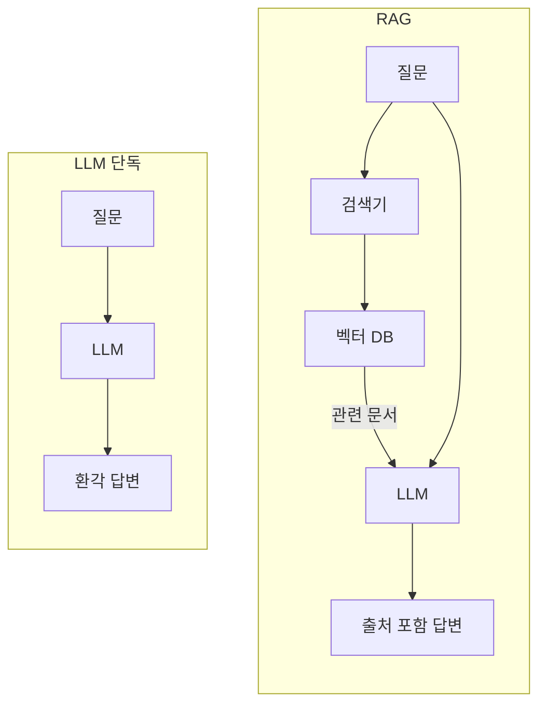

# Ch.1: "ChatGPT에 물어봤더니…" — 환각과 RAG의 첫 만남 (v0.0)

> 이번 버전: 없음 → v0.0
> 한 줄 요약: LLM은 우리 회사 문서를 읽은 적이 없다. 문서를 직접 넣어줘야 한다.
> 핵심 개념: LLM 환각, Context Injection, RAG

---

## 이야기 파트

### 입사 3일 차, 첫 번째 임무

<!-- [GEMINI PROMPT: 01_chapter-opening]
path: assets/CH01/01_chapter-opening.png
A minimalist black and white technical diagram with a strict 16:9 aspect ratio
on a solid white background. No shading, no 3D effects, only clean thin line art.
The entire assembly of icons, lines, and text is perfectly centered globally
within the 16:9 frame, leaving generous and equal white space on all sides.

A minimalist line-art person icon sitting at a desk with a laptop.
Above the laptop, a large speech bubble from an off-screen figure (team lead)
containing text 'AI 비서 만들어봐'. The person has a small thought bubble
with a question mark '?'. On the desk, a sticky note labeled 'Wi-Fi PW'.
To the right of the person, a minimalist line-art chat window icon with
a robot face inside, representing the AI assistant to be built.
Korean label at bottom: '입사 3일 차, 첫 번째 미션'.
Style: scene-opener
-->


입사 3일 차였다. 아직 사내 Wi-Fi 비밀번호를 포스트잇에 적어 모니터에 붙여놓던 시절이었다.

오전 10시, 팀장이 자리로 왔다.

"AI로 사내 문서 검색 시스템 만들어봐. 직원들이 규정이나 정책 찾는 게 너무 번거롭다고 해서. 채팅창에 물어보면 바로 답해주는 거."

머릿속으로 빠르게 계산해봤다. *AI 비서. 사내 문서. 대화식 검색. 나 혼자서?*

"언제까지요?"

"급하진 않아. 2주 내로 간단한 프로토타입만."

자리에 돌아와 노트북을 열었다. 가장 먼저 든 생각은 단순했다. *ChatGPT도 뭐든 대답하잖아. LLM에게 직접 물어보면 되는 거 아니야?*

일단 코드부터 짰다.

---

### "당연히 알고 있죠" — 자신감 넘치는 거짓말

연차 규정을 예시로 물어봤다.

> 질문: 우리 회사(커넥트)의 신입사원 연차 발생 규정이 어떻게 돼?

LLM이 답했다.

> 커넥트 사의 신입사원 연차 규정은 근로기준법에 따라, 입사 후 1년 미만 기간에는 1개월 개근 시 1일의 유급휴가가 발생합니다. 1년 이상 근무 시에는 15일의 연차가 발생하며, 3년 이상 근무한 경우 1년마다 1일씩 추가됩니다…

그럴듯했다. 뭔가 공식적인 느낌도 났다.

그런데 입사할 때 받은 규정집과 비교해보니 완전히 달랐다. 커넥트의 실제 규정은 이랬다.

*신입사원은 입사 후 3년 동안은 연차가 없다. 대신 매월 1회 '리프레시 데이'를 유급으로 제공한다. 3년 근속 시 30일의 연차가 일시에 발생한다.*

잠깐, 뭐라고? 다시 읽어봤다. 완전히 다른 내용이었다. LLM이 방금 그럴듯한 거짓말을 한 거였다.

---

### "입사 첫날부터 회사 내부를 아는 직원은 없다"

여기서 의문이 생긴다. LLM은 왜 자신 있게 틀린 대답을 했을까?

LLM을 이렇게 생각해보자. 입사 면접을 보러 온 외부인이다. 이 외부인은 세상에 공개된 거의 모든 자료를 읽었다. 인터넷, 뉴스, 책, 논문 — 공개된 텍스트라면 뭐든지. 그래서 근로기준법은 완벽하게 알고, 일반적인 회사 연차 제도도 줄줄 외운다.

그런데 커넥트의 내부 규정집은 공개된 적이 없다. 이 외부인이 읽을 방법이 없었다.

문제는 이 외부인이 "모른다"고 솔직히 말하지 못한다는 거다. 질문을 받으면 자기가 아는 것들 중에서 가장 비슷해 보이는 걸 자신감 있게 말한다. "아마 일반적인 회사라면 이렇겠지"라는 추측이지만, 마치 확실히 아는 것처럼 들린다.

이게 **LLM 환각(Hallucination)** 이다.

GPT든 Claude든 Gemini든 마찬가지다. 자기가 학습한 데이터에 없는 정보는 알 방법이 없다. 그런데 그걸 솔직히 "모른다"고 하지 않고, 그럴듯하게 지어낸다. 특히 일반적인 내용과 비슷한 맥락일수록 더 자연스럽게 지어낸다.

커넥트의 연차 규정은 공개된 인터넷 어디에도 없다. 그러니 LLM이 알 방법이 없다. 근로기준법 기반으로 그럴듯한 답을 만들어낸 것뿐이다.

<!-- [GEMINI PROMPT: 01_hallucination-outsider]
path: assets/CH01/01_hallucination-outsider.png
A minimalist black and white technical diagram with a strict 16:9 aspect ratio
on a solid white background. No shading, no 3D effects, only clean thin line art.
The entire assembly of icons, lines, and text is perfectly centered globally
within the 16:9 frame, leaving generous and equal white space on all sides.

Left side: a minimalist line-art person icon in a suit labeled 'LLM (외부인)',
with a large speech bubble containing a confident checkmark and text '근로기준법에
따르면...' — representing confident but wrong answers.
Right side: a minimalist line-art building icon labeled '회사 내부' with a locked
door icon. Behind the door, three stacked document icons labeled '사내 규정'.
A dashed arrow from the person toward the locked door with a large X mark on it,
indicating the person cannot access internal documents.
Below the person: small icons of books, newspapers, globe labeled '공개 데이터 (학습 완료)'.
Korean label at bottom: 'LLM은 공개 데이터는 알지만, 사내 문서는 읽은 적 없다'.
Style: metaphor-diagram
-->

*그림 1-1: LLM은 세상의 공개 데이터는 학습했지만, 우리 회사 내부 문서는 읽은 적이 없다.*

---

### 문서를 직접 넣어주면 되지 않을까?

그러면 해결책은 간단해 보인다. LLM이 모른다면, 직접 알려주면 되지 않을까?

프롬프트에 규정 내용을 직접 붙여서 다시 물어봤다.

> 아래 [커넥트 취업규칙]을 참고해서 신입사원 연차 규정을 알려줘.

규정 내용 전체를 그 뒤에 이어 붙였다.

이번에는 정확한 답변이 왔다. 커넥트의 실제 규정을 그대로 설명해줬다.

"오, 이거면 되는 거 아니야?" 잠깐 기뻤다.

그런데 사내 문서가 규정집 하나가 아니다. 복지 정책, 보안 지침, 업무 가이드, 회의록, 프로젝트 문서… 파일만 수십 개다. 그걸 매번 전부 복사해서 프롬프트에 붙이면 어떻게 될까?

LLM에는 한 번에 처리할 수 있는 텍스트 길이 한도가 있다. 문서가 쌓일수록 한도를 넘기기 쉽다. 그리고 무엇보다, 연차 규정을 물어보는데 보안 지침이나 복지 정책까지 다 넣어서 보내는 건 비효율적이다. 관련 없는 내용이 많을수록 LLM이 정작 필요한 내용을 찾기 어려워진다.

문서를 통째로 넣는 방식은 임시방편이었다.

<!-- [GEMINI PROMPT: 01_context-overflow]
path: assets/CH01/01_context-overflow.png
A minimalist black and white technical diagram with a strict 16:9 aspect ratio
on a solid white background. No shading, no 3D effects, only clean thin line art.
The entire assembly of icons, lines, and text is perfectly centered globally
within the 16:9 frame, leaving generous and equal white space on all sides.

Center: a minimalist line-art rectangle representing a prompt window labeled
'프롬프트 창'. Inside the window, three stacked document icons labeled '인사규정',
'보안지침', '복지정책'. Above the window, five more document icons are falling
toward the window but overflowing — some tilted and sticking out above the top edge.
A dashed horizontal line near the top of the window labeled '컨텍스트 한도'.
The documents above the line are drawn with lighter/thinner strokes to indicate
they cannot fit. A small warning triangle icon with '!' at the top right corner.
Korean labels below: '문서가 많아지면 프롬프트에 다 넣을 수 없다'.
Style: limitation-diagram
-->

*그림 1-2: 문서를 통째로 넣는 방식의 한계. 문서가 늘어나면 프롬프트 창이 넘친다.*

---

### RAG — "오픈북 시험"으로 바꾸기

더 나은 방법이 있다. 문제를 다시 생각해보자.

LLM이 모든 사내 문서를 외울 필요가 있을까? 사람도 비슷한 문제를 해결한 방식이 있다. 시험에서 모든 내용을 통째로 외우는 대신, 오픈북을 허용하면 된다. 시험지가 나오면 그 문제와 관련된 페이지를 찾아서 보면서 답하는 것이다.

LLM도 마찬가지다. 사내 문서 전체를 외울 필요가 없다. 질문이 들어왔을 때, **그 질문과 관련된 문서 조각만 찾아서 LLM에게 건네주면 된다.**

<!-- [GEMINI PROMPT: 01_openbook-exam]
path: assets/CH01/01_openbook-exam.png
A minimalist black and white technical diagram with a strict 16:9 aspect ratio
on a solid white background. No shading, no 3D effects, only clean thin line art.
The entire assembly of icons, lines, and text is perfectly centered globally
within the 16:9 frame, leaving generous and equal white space on all sides.

Left side: a minimalist line-art person icon sitting at a desk, stressed, with a
closed book labeled '전체 암기' and a thought bubble with '???' — representing a
closed-book exam. A large X mark over this scene.
Right side: the same person icon, relaxed, with an open book on the desk labeled
'관련 페이지만', a magnifying glass icon pointing at the open page, and a light
bulb above the head — representing an open-book exam. A large O mark over this scene.
An arrow from left to right labeled '오픈북 전환'.
Korean labels: left '클로즈드북 (전부 외우기)', right '오픈북 (필요한 것만 찾기)'.
Style: metaphor-comparison
-->

*그림 1-3: 클로즈드북 vs 오픈북. RAG는 LLM에게 오픈북 시험을 치르게 하는 것이다.*

이것이 **RAG** — Retrieval-Augmented Generation, 검색 증강 생성이다.

흐름을 보면 이렇다.


*그림 1-4: LLM 단독 호출과 RAG의 차이. RAG는 질문마다 관련 문서를 찾아서 LLM에 건네준다.*

1. 사내 문서들을 미리 **벡터 DB**에 조각으로 나눠 저장해 놓는다 (오픈북 준비)
2. 질문이 들어오면, 그 질문과 의미가 비슷한 문서 조각을 벡터 DB에서 찾는다 (관련 페이지 찾기)
3. 찾은 문서 조각 + 질문을 LLM에게 함께 넘긴다
4. LLM이 그 문서를 보면서 답한다 (오픈북으로 시험 보기)

이제 LLM이 우리 회사 규정을 외울 필요가 없다. 질문할 때마다 관련된 규정을 찾아서 보여주면 되니까. 그리고 어느 문서를 참고했는지도 함께 돌려줄 수 있다.

이번 챕터의 목표는 이 흐름을 직접 만들어보는 것이다. 지금은 더미 문서 3개짜리 간단한 버전으로 시작한다. 실제 PDF 파싱, 한국어 임베딩 모델 적용, DB 연동은 뒤 챕터에서 차례로 붙인다.

---

### 이것만은 기억하자

- **LLM은 우리 회사 문서를 읽은 적이 없다.** 아무리 자신감 있게 답해도, 사내 정보는 우리가 직접 넣어줘야 한다.
- **RAG는 오픈북 시험이다.** LLM이 모든 걸 외울 필요 없이, 질문마다 관련 문서를 찾아보면서 답한다.
- 다음 챕터에서는 AI 비서가 조회할 실제 사내 시스템(직원, 연차, 매출 DB)을 FastAPI로 만들어 본다.

---

## 기술 파트

### 용어 정리

| 이야기 속 표현 | 진짜 용어 | 정식 정의 |
|------------|----------|---------|
| "자신감 넘치는 거짓말" | LLM 환각 (Hallucination) | LLM이 학습 데이터에 없는 정보를 그럴듯하게 생성하는 현상 |
| "문서를 직접 붙여 넣기" | Context Injection | 관련 정보를 프롬프트에 직접 포함시켜 LLM에 제공하는 방법 |
| "오픈북 시험" | RAG (Retrieval-Augmented Generation) | 외부 지식 저장소에서 관련 문서를 검색하여 LLM 생성에 활용하는 방식 |
| "오픈북 준비" | 임베딩 + 벡터 DB 저장 | 문서를 수치 벡터로 변환하여 ChromaDB에 인덱싱하는 과정 |
| "관련 페이지 찾기" | 벡터 유사도 검색 | 질문 벡터와 문서 벡터 간 코사인 유사도를 계산해 가장 관련 있는 문서를 반환 |

---

### 이번 챕터 파일 구조

```
v0.0/
├── step1_fail.py            [실습] LLM 단독 호출 → 환각 체험
├── step2_context.py         [실습] 컨텍스트 직접 주입 → 임시 해결
├── step3_rag.py             [실습] RAG 기본 파이프라인 구성
├── step3_rag_no_chunking.py [설명] 청킹 유무 비교 (읽기만)
└── step4_rag.py             [참고] 추론 심화 (Chain-of-Thought)
```

> 이 챕터는 더미 문서(3개)로 동작을 확인하는 맛보기 버전이다.
> 실제 PDF/DOCX 파싱과 영속 저장은 CH04(VectorDB 구축)에서 다룬다.

---

### 실습 환경 구축

> Python, Ollama, Docker 설치가 아직 안 되어 있다면 **부록(환경 설정)** 을 먼저 참고하자.

```bash
# Ollama에 LLM과 임베딩 모델 다운로드
ollama pull deepseek-r1:8b
ollama pull nomic-embed-text

# 패키지 설치 (v0.0/requirements.txt)
pip install -r requirements.txt
```

| 패키지 | 용도 |
|--------|------|
| `langchain-ollama` | Ollama LLM/임베딩 연동 |
| `langchain-chroma` | ChromaDB 벡터 저장소 |
| `langchain-classic` | RetrievalQA 체인 (CH05에서 LCEL로 전환) |
| `chromadb` | 벡터 DB |

---

### 실습 1 — step1_fail.py: LLM에게 직접 물어보기

LLM 단독으로 사내 규정을 물어보는 가장 단순한 코드다. 환각이 어떻게 생기는지 직접 확인한다.

```python
from langchain_ollama import ChatOllama

llm = ChatOllama(model="deepseek-r1:8b", temperature=0)

question = "우리 회사(커넥트)의 신입사원 연차 발생 규정이 어떻게 돼?"
response = llm.invoke(question)
print(response.content)
```

`temperature=0`은 LLM이 창의적 변형 없이 가장 확률 높은 답변을 내놓도록 하는 설정이다. 실행하면 그럴듯하게 들리지만 커넥트의 실제 규정과 다른 답변이 나온다.

```bash
python step1_fail.py
```

<!-- [CAPTURE NEEDED: 01_step1-hallucination
  path: assets/CH01/01_step1-hallucination.png
  desc: step1_fail.py 실행 결과 — LLM이 존재하지 않는 커넥트 신입사원 연차 규정을 그럴듯하게 답하는 터미널 화면
] -->

*그림 1-5: step1_fail.py 실행 결과. 자신감 있게 답하지만 실제 커넥트 규정과 다르다.*

---

### 실습 2 — step2_context.py: 문서를 직접 넣어보기

프롬프트에 실제 규정 내용을 포함시킨다. Context Injection의 효과와 한계를 함께 확인한다.

```python
context_data = """
[커넥트 취업규칙]
1. 신입사원은 입사 후 3년 동안은 연차가 없다. (파격적인 규정)
2. 대신 매월 1회 '리프레시 데이'를 유급으로 제공한다.
3. 3년 근속 시 30일의 연차가 일시에 발생한다.
"""

prompt = f"""
아래 [참고 정보]를 보고 질문에 답해줘.
[참고 정보]
{context_data}

질문: {question}
"""
response = llm.invoke(prompt)
```

이제 정확한 답변이 나온다. 하지만 실제로 써보면 한계가 바로 느껴진다. 문서 하나면 괜찮지만, 수십 개 문서를 매번 통째로 붙이면 프롬프트가 엄청나게 길어진다. LLM이 처리할 수 있는 텍스트 길이에는 한도(컨텍스트 윈도우)가 있다.

```bash
python step2_context.py
```

<!-- [CAPTURE NEEDED: 01_step2-context
  path: assets/CH01/01_step2-context.png
  desc: step2_context.py 실행 결과 — 규정 내용을 프롬프트에 직접 주입했을 때 정확한 답변이 나오는 터미널 화면
] -->

*그림 1-6: step2_context.py 실행 결과. 문서를 직접 넣으니 정확하게 답한다.*

---

### 실습 3 — step3_rag.py: RAG 파이프라인 구성

RAG의 세 단계를 순서대로 만든다.

**1단계: 문서를 조각으로 나눠 벡터 DB에 저장**

```python
from langchain_chroma import Chroma
from langchain_ollama import OllamaEmbeddings
from langchain_core.documents import Document

docs = [
    Document(page_content="[인사규정] 신입사원 휴가: 신입사원은 입사 후 처음 3년 동안은 법정 연차가 발생하지 않습니다...",
             metadata={"source": "인사규정"}),
    Document(page_content="[보안규정] 업무 보안: 모든 임직원은 승인된 보안 USB만 사용해야 합니다...",
             metadata={"source": "보안규정"}),
    Document(page_content="[복지규정] 식대 지원: 점심은 무제한 법인카드, 저녁은 오후 9시 이후 야근 시에만...",
             metadata={"source": "복지규정"}),
]

embeddings = OllamaEmbeddings(model="nomic-embed-text")
vectorstore = Chroma.from_documents(documents=docs, embedding=embeddings)
```

`OllamaEmbeddings`가 각 문서를 수백 차원의 숫자 배열(벡터)로 변환한다. 이 벡터들이 ChromaDB에 저장된다.

> **이 챕터의 임베딩 모델**: `nomic-embed-text`를 사용한다. CH04에서 한국어에 최적화된 `ko-sroberta-multitask`로 교체할 것이다.

**2단계: 검색기와 LLM 체인 연결**

```python
from langchain_classic.chains import RetrievalQA
from langchain_core.prompts import PromptTemplate

retriever = vectorstore.as_retriever(search_kwargs={"k": 3})

template = """당신은 회사 규정을 설명하는 AI 비서입니다.
아래 참고 정보를 바탕으로 질문에 답하세요.

참고 정보: {context}
질문: {question}
답변:"""

qa_chain = RetrievalQA.from_chain_type(
    llm=ChatOllama(model="deepseek-r1:8b", temperature=0),
    retriever=retriever,
    return_source_documents=True,
    chain_type_kwargs={"prompt": PromptTemplate(template=template,
                                                input_variables=["context", "question"])}
)
```

`k=3`은 "질문과 가장 비슷한 문서 조각 3개를 가져오라"는 설정이다. `return_source_documents=True`를 주면 어떤 문서를 참고했는지도 함께 반환된다.

**3단계: 질문하고 출처 확인**

```python
result = qa_chain.invoke({"query": "신입사원 휴가 규정에 대해 알려줘."})

# 어떤 문서를 참고했는지 확인
for doc in result['source_documents']:
    print(f"[{doc.metadata['source']}]: {doc.page_content[:50]}...")

print(result['result'])
```

```bash
python step3_rag.py
```

<!-- [CAPTURE NEEDED: 01_step3-rag
  path: assets/CH01/01_step3-rag.png
  desc: step3_rag.py 실행 결과 — 벡터DB에서 검색된 문서 출처([인사규정]) 와 함께 정확한 답변이 나오는 터미널 화면
] -->

*그림 1-7: step3_rag.py 실행 결과. [인사규정] 문서를 찾아서 답변하고, 어디서 가져왔는지 출처까지 보여준다.*

이제 답변과 함께 어느 문서를 참고했는지가 나온다. 환각이 사라지고, 출처가 생겼다.

---

### 설명 — step3_rag_no_chunking.py: 청킹이 왜 필요한가

`step3_rag_no_chunking.py`는 모든 문서를 하나의 덩어리로 합쳐서 저장한다. `step3_rag.py`와 비교하면 무슨 차이가 있을까?

핵심 차이는 **검색 정확도**다. 문서를 조각내지 않으면, 질문과 관련 없는 규정(보안, 복지)까지 한꺼번에 들어와서 LLM이 정작 필요한 내용을 놓치기 쉽다. 직접 실행해서 두 결과를 비교해보자.

```bash
# 조각으로 나눈 경우 (step3_rag.py)
python step3_rag.py
# → [인사규정] 문서만 정확히 찾아서 답변

# 하나의 덩어리로 합친 경우 (step3_rag_no_chunking.py)
python step3_rag_no_chunking.py
# → 인사규정 + 보안규정 + 복지규정이 뒤섞여서 답변 정확도 하락
```

<!-- [CAPTURE NEEDED: 01_no-chunking-compare
  path: assets/CH01/01_no-chunking-compare.png
  desc: step3_rag.py와 step3_rag_no_chunking.py 실행 결과 비교 — 청킹 여부에 따른 검색 정확도 차이를 보여주는 터미널 화면
] -->

*그림 1-8: 청킹 여부에 따른 검색 결과 비교. 조각으로 나누면 관련 문서만 정확히 찾는다.*

왜 문서를 조각으로 나눠야 하는지 체감할 수 있다. 청킹 전략의 상세 비교는 CH08(검색 품질 튜닝)에서 다룬다.

---

### 더 알아보기

**step4_rag.py** — 추론(Reasoning)이 필요한 복잡한 질문을 다룬다. 예를 들어 *"입사 6개월차 신입인데 리프레시 데이 2번 썼어. 몇 번 남았는지 규정 기반으로 계산해줘."* 같은 질문이다. 규정을 찾아서 읽고, 거기서 계산까지 해야 한다. DeepSeek R1의 Chain-of-Thought 추론 능력을 확인할 수 있다.

**RetrievalQA vs LCEL** — 이 챕터에서는 LangChain의 `RetrievalQA` 체인을 사용했다. 구버전 API지만 구조가 직관적이라 처음 RAG를 이해하기 좋다. CH05에서 더 유연한 LCEL(LangChain Expression Language) 파이프라인으로 교체한다.

**ChromaDB** — 로컬에서 Python 패키지만으로 바로 쓸 수 있는 벡터 DB다. 이 챕터에서는 메모리 내에서만 동작하므로 프로그램을 재시작하면 저장된 내용이 사라진다. CH04에서 디스크에 영구 저장하는 방식으로 바꾼다.
