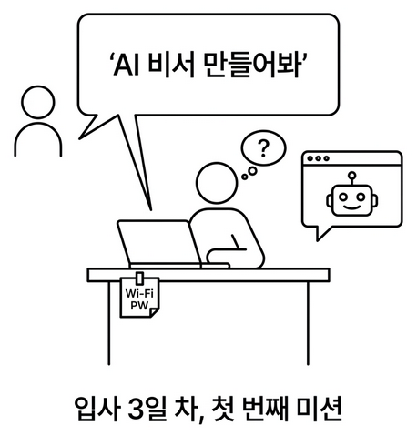
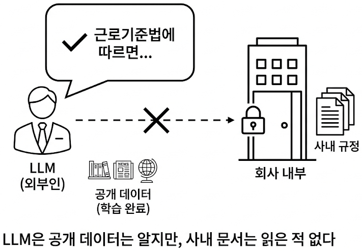
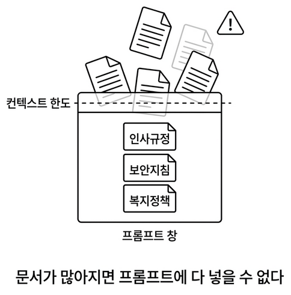
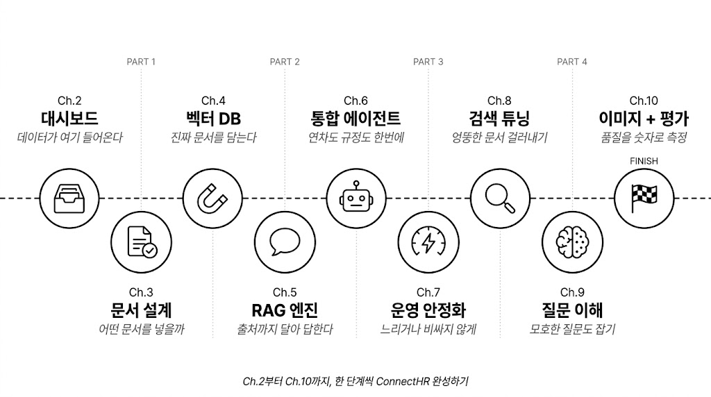

# 챕터 1. AI한테 물어봤더니 거짓말을 합니다. 환각과 RAG

:::goal
**이번 챕터가 끝나면**

- LLM이 모르는 것을 자신 있게 지어낸다는 걸 직접 확인합니다 *(환각)*
- 문서를 직접 건네주면 거짓말을 멈춘다는 걸 배웁니다 *(Context Injection)*
- 이걸 자동화한 RAG 파이프라인을 직접 만들어 보겠습니다 *(RAG)*
:::

:::preview
**챕터 1은 맛보기 챕터입니다**

이 챕터는 본격 여정에 들어가기 전 RAG의 원리만 빠르게 체험하는 시간입니다. 더미 데이터 3건으로 "환각 → 문서 주입 → RAG"가 어떤 흐름인지 몸으로 느끼는 것이 목적입니다. 실제 사내 AI 비서 **커넥트HR 에이전트**를 만드는 본격 여정은 챕터 2부터 시작됩니다. 지금은 가볍게 훑는다는 기분으로 따라오세요.
:::

::::prep
**준비하기**. 실습 시작 전 한 번만 설정

### 1. 소스 코드 준비

이 책의 실습은 GitHub 레포를 클론해서 진행합니다.

| 레포 | 용도 | 주소 |
|-----|------|------|
| **rag-start** | 실습용 (빈 파일) | `github.com/metacoding-18-ai-applied-v4/rag-start` |
| **rag-end** | 완성 코드 (참고) | `github.com/metacoding-18-ai-applied-v4/rag-end` |

아직 클론하지 않았다면 터미널에서 실행합니다.

```bash [터미널] 레포 클론
git clone https://github.com/metacoding-18-ai-applied-v4/rag-start.git
cd rag-start/ex01
```

파일 구조는 이렇습니다.

```text ex01 디렉토리
ex01/
├── step1_fail.py            # [실습] LLM 단독 호출 → 환각 체험
├── step2_context.py         # [실습] 컨텍스트 직접 주입 → 임시 해결
├── step3_rag.py             # [실습] RAG 기본 파이프라인 구성
├── step4_no_chunking.py     # [실습] 청킹 없이 비교 → 차이 체감
└── step5_rag.py             # [실습] 추론 심화 (Chain-of-Thought)
```

:::note
컨텍스트, 청킹, Chain-of-Thought 같은 단어가 낯설어도 괜찮습니다. 파일 이름에 미리 등장한 것이고, 각 실습에서 하나씩 풀어 설명합니다.
:::

`[실습]` 파일에는 import와 데이터가 미리 준비되어 있습니다. 챕터를 따라 하며 TODO 부분을 채워넣으세요. 막히면 rag-end의 완성 코드를 참고하세요.

### 2. 실습 환경 구축

```bash [터미널] Python 환경 구성. macOS / Linux
cd ex01
python3.12 -m venv .venv
source .venv/bin/activate
pip install -r requirements.txt
```

```bash [터미널] Python 환경 구성. Windows
cd ex01
py -3.12 -m venv .venv
.venv\Scripts\activate
pip install -r requirements.txt
```

Windows는 PowerShell이 아니라 명령 프롬프트(cmd)를 권장합니다. PowerShell 사용 시 `Set-ExecutionPolicy -ExecutionPolicy RemoteSigned -Scope CurrentUser` 로 스크립트 실행을 허용한 뒤 `.venv\Scripts\Activate.ps1`을 실행하세요.

Ollama 모델이 아직 없다면 다운로드합니다.

```bash [터미널] Ollama 모델 다운로드
ollama pull deepseek-r1:8b
ollama pull nomic-embed-text
```

:::tip
**LLM 선택**

기본값은 Ollama + `deepseek-r1:8b`입니다 (16GB RAM 이상 권장). RAM이 부족하거나 응답이 너무 느리면 `.env`에서 `LLM_PROVIDER=openai`로 바꿔서 GPT-4o-mini를 쓸 수도 있습니다. 단, API 비용이 발생합니다. `.env` 파일에 `OPENAI_API_KEY=sk-xxxxxx` 형태로 키를 등록하세요.
:::

### 3. 사용할 라이브러리

이번 챕터에서는 **LangChain**이라는 프레임워크를 사용합니다. LLM 호출, 벡터 검색, 체인 조립처럼 RAG에 필요한 부품을 제공하는 도구입니다. 여기서는 맛보기로만 쓰고 챕터 5에서 본격적으로 다룹니다.

| 패키지 | 역할 |
|-------|------|
| `langchain-ollama` | Ollama LLM/임베딩 연동 |
| `langchain-chroma` | ChromaDB 벡터 저장소 |
| `langchain-classic` | RetrievalQA 체인 |
| `chromadb` | 벡터 DB |

:::tip
**지금은 개념만 잡으세요**

LangChain, 임베딩, 벡터 DB 같은 용어가 한꺼번에 나와서 부담스러울 수 있습니다. 지금은 "문서를 넣어주면 LLM이 정확하게 답한다"는 RAG의 개념만 잡으면 충분합니다. 각 기술의 동작 원리는 챕터 4~챕터 5에서 차근차근 다룹니다.
:::

### 4. 실습 순서

이번 챕터의 실습 5개는 이 순서로 진행합니다.

1. `ex01/step1_fail.py`. LLM 단독 질문 (환각 체험)
2. `ex01/step2_context.py`. 문서 직접 전달
3. `ex01/step3_rag.py`. RAG 파이프라인
4. `ex01/step4_no_chunking.py`. 청킹 없이 비교
5. `ex01/step5_rag.py`. 추론 심화

환각을 직접 체험하고(step1), 문서를 넣으면 달라지는 걸 확인한 뒤(step2), RAG로 조립합니다(step3). 그다음 청킹 없이 돌려서 차이를 체감하고(step4), 추론이 필요한 질문까지 던져보겠습니다(step5). step1부터 순서대로 실행하세요.
::::

## 1.1 그럴듯한 거짓말. LLM 환각(Hallucination)


*그림 1-1. 입사 3일 차, 첫 번째 미션*

입사 3일 차.

키보드 두드리는 소리만 또록또록 울리는 사무실. 모니터에는 사내 Wi-Fi 비밀번호가 적힌 포스트잇이 하나 붙어 있습니다. 오전 10시, 팀장이 커피잔을 들고 자리로 다가왔습니다. 잔에서 김이 올라오고 있었습니다.

**팀장**: "AI로 사내 문서 검색 시스템 만들어봐요. 직원들이 규정이나 정책 찾는 게 번거롭다고 해서."

손이 멈췄습니다.

*AI 비서. 사내 문서. 대화식 검색. 나 혼자서?*

**오픈이**: "언제까지요?"
**팀장**: "급하진 않아요. 2주 내로 간단한 프로토타입만."

팀장이 자리로 돌아간 뒤에도 한참 모니터를 쳐다봤습니다. 옆자리에서 동료가 의자를 돌려 저를 보더니 한마디 던졌습니다.

**동료**: "그거 왜 만들어요? ChatGPT한테 그냥 물어보면 되지 않나요."

*…그러게. 직접 물어보면 되는 거 아니야?*

마침 로컬에 `deepseek-r1` 모델을 올려두었습니다. 연차 규정부터 물어보기로 했습니다. `ex01/step1_fail.py`를 열고 TODO의 `pass`를 지우고 아래 코드를 작성합니다.

```python [실습 1] ex01/step1_fail.py. LLM에게 직접 물어보기
# TODO: ChatOllama로 deepseek-r1:8b 모델 연결 (temperature=0)
# 1. Ollama에서 deepseek-r1:8b 모델을 로드 (temperature=0: 가장 확률 높은 답변)
llm = ChatOllama(model="deepseek-r1:8b", temperature=0)

question = "우리 회사(커넥트)의 신입사원 연차 발생 규정이 어떻게 돼?"

# TODO: 질문 출력 → llm.invoke로 답변 받기 → 답변 출력
# 2. 질문을 터미널에 출력
console.print(f"[bold]질문:[/bold] {question}\n")
# 3. LLM에 질문을 보내고 답변을 받음
response = llm.invoke(question)
# 4. 답변을 출력
console.print(f"[bold]답변:[/bold]\n{response.content}")
```

`ChatOllama`는 LangChain이 Ollama LLM을 호출할 때 쓰는 래퍼입니다. `temperature=0`은 LLM이 창의적 변형 없이 가장 확률 높은 답변을 내놓게 하는 설정입니다. 이제 실행합니다.

```bash [터미널] 실행
python step1_fail.py
```

<div class="terminal-log">
  <div class="tl-chrome">
    <div class="tl-traffic"><span></span><span></span><span></span></div>
    <div class="tl-title">ex01 — python step1_fail.py</div>
    <div class="tl-spacer"></div>
  </div>
  <div class="tl-body">
    <div><span class="tl-label">질문</span> <span class="tl-str">우리 회사(커넥트)의 신입사원 연차 발생 규정이 어떻게 돼?</span></div>
    <div class="tl-section"><span class="tl-label">답변</span></div>
    <div>우리 회사(커넥트)의 신입사원 연차 발생 규정은 <strong>회사의 정책 문서</strong>에 명시되어 있습니다. 일반적으로 신입사원의 연차는 근속 기간과 직무, 회사 정책에 따라 결정되며, 다음과 같은 일반적인 패턴을 따릅니다:</div>
    <div class="tl-kv-row">1. <strong>초기 근속 기간</strong>: 신입사원(예: 입사 1년 이내)은 연차가 적게 부여되거나, 월별로 일정 비율로 발생합니다.</div>
    <div class="tl-kv-row">2. <strong>연차 발생 방식</strong>: 1일당 0.1~0.2일 발생하거나, 연차가 매년 1일씩 증가하는 방식으로 시작됩니다.</div>
    <div class="tl-kv-row"><span class="tl-dim">예시:</span> 입사 1년차 연차 1일 · 입사 2년차 연차 2일 · 입사 3년차 연차 3일 ...</div>
  </div>
</div>

*그림 1-2. `step1_fail.py` 실행 결과. 자신감 있게 답하지만 실제 커넥트 규정과 다릅니다*

답변을 보면 "근로기준법에 따라 1년 미만은 매월 1일..." 같은 내용이 나옵니다. 공식적인 느낌도 나고 그럴듯합니다. 입사할 때 받은 규정집을 꺼내 비교해봤습니다. 커넥트의 실제 규정은 이랬습니다.

*신입사원은 입사 후 3년 동안은 연차가 없다. 대신 매월 1회 '리프레시 데이'를 유급으로 제공한다. 3년 근속 시 30일의 연차가 일시에 발생한다.*

*잠깐, 뭐라고?*

다시 읽었습니다. 완전히 다른 내용이었습니다. LLM이 방금 그럴듯한 거짓말을 한 것입니다.

<div class="annotated-compare">
  <div class="ac-block llm">
    <div class="ac-label">
      <span class="ac-name">LLM 응답</span>
      <span class="ac-tech">Hallucination</span>
    </div>
    <div class="ac-content">
      커넥트의 신입사원 연차 규정은 <span class="ac-strike">근로기준법에 따라 입사 후 1년 미만 기간에는 1개월 개근 시 1일의 유급휴가가 발생하며, 1년 이상 근무 시에는 15일의 연차가 발생합니다.</span>
    </div>
    <div class="ac-note">취소선 부분이 학습 데이터에서 가져와 지어낸 내용입니다.</div>
  </div>
  <div class="ac-block truth">
    <div class="ac-label">
      <span class="ac-name">사내 규정</span>
      <span class="ac-tech">Ground Truth</span>
    </div>
    <div class="ac-content">
      커넥트 취업규칙에 따르면, 신입사원은 입사 후 <b>3년간 연차가 발생하지 않으며</b>, 그 기간 동안 <b>매월 1회 유급 리프레시 데이</b>를 사용할 수 있습니다. 3년 근속 시점에 30일의 연차가 일시에 부여됩니다.
    </div>
  </div>
</div>

*그림 1-3. LLM 응답과 사내 규정을 나란히 비교한 모습입니다*

여기서 의문이 생깁니다. LLM은 왜 자신 있게 틀린 대답을 했을까요?

LLM을 이렇게 가정해보겠습니다. 입사 면접을 보러 온 외부인이라고요. 이 외부인은 세상에 공개된 거의 모든 자료를 읽었습니다. 인터넷, 뉴스, 책, 논문까지. 공개된 텍스트라면 뭐든 섭렵했습니다. 그래서 근로기준법은 완벽하게 알고 일반적인 회사 연차 제도도 줄줄 외웁니다. 그런데 커넥트의 내부 규정집은 공개된 적이 없습니다. 이 외부인이 읽을 방법이 없었습니다.

문제는 이 외부인이 "모른다"고 솔직히 말하지 못한다는 점입니다. 질문을 받으면 자기가 아는 것 중에서 가장 비슷해 보이는 걸 자신감 있게 말합니다. 마치 확실히 아는 것처럼 들립니다. 이게 **LLM 환각(Hallucination)** 입니다.


*그림 1-4. LLM은 세상의 공개 데이터는 학습했지만, 우리 회사 내부 문서는 읽은 적이 없습니다*

## 1.2 교재를 펼쳐놓으면. 컨텍스트 주입(Context Injection)

규정집을 덮고 잠시 생각했습니다. 모니터 옆 자리에서 팀장이 다시 지나가며 한 마디 던졌습니다.

**팀장**: "전부 외우게 하지 말고, 필요한 것만 찾아서 읽게 해요."

그 말이 귀에 남았습니다.

*…외우게 하지 말고, 읽게 한다.*

학창 시절 오픈북 시험이 떠올랐습니다. 시험 범위를 전부 외우는 대신, 책을 책상 위에 펼쳐놓고 필요한 페이지만 찾아서 답을 쓰는 방식. AI한테도 규정집을 그대로 건네주면 어떻게 될까요?

지금은 DB도 검색 시스템도 없으니, 우선은 단순하게 **프롬프트에 규정 내용을 그대로 붙여 넣는** 방법부터 시도합니다. `ex01/step2_context.py`를 열고 TODO의 `pass`를 지우고 아래 코드를 작성합니다.

```python [실습 2] ex01/step2_context.py. 문서를 직접 넣어보기
# 1. 규정 문서를 변수에 담습니다 (아직 DB 안 씀)
context_data = """
[커넥트 취업규칙]
1. 신입사원은 입사 후 3년 동안은 연차가 없다. (파격적인 규정)
2. 대신 매월 1회 '리프레시 데이'를 유급으로 제공한다.
3. 3년 근속 시 30일의 연차가 일시에 발생한다.
"""

question = "우리 회사(커넥트)의 신입사원 연차 발생 규정이 어떻게 돼?"

# TODO: f-string으로 context_data와 question을 포함한 프롬프트 작성
# 2. context_data를 프롬프트에 직접 넣어서 LLM에 전달
prompt = f"""
아래 [참고 정보]를 보고 질문에 답해줘.
[참고 정보]
{context_data}

질문: {question}
"""

# 3. LLM 호출 → 답변 출력
response = llm.invoke(prompt)
console.print(f"[bold]답변:[/bold]\n{response.content}")
```

step1과 달라진 부분은 `context_data`를 프롬프트에 직접 넣었다는 것뿐입니다.

```bash [터미널] 실행
python step2_context.py
```

<div class="terminal-log">
  <div class="tl-chrome">
    <div class="tl-traffic"><span></span><span></span><span></span></div>
    <div class="tl-title">ex01 — python step2_context.py</div>
    <div class="tl-spacer"></div>
  </div>
  <div class="tl-body">
    <div><span class="tl-label">질문</span> <span class="tl-str">우리 회사(커넥트)의 신입사원 연차 발생 규정이 어떻게 돼?</span></div>
    <div class="tl-section"><span class="tl-label">답변</span></div>
    <div>[커넥트 취업규칙]에 따르면, 신입사원의 연차 발생 규정은 다음과 같습니다:</div>
    <div class="tl-kv-row">1. <strong>신입사원은 입사 후 3년 동안 연차가 없다.</strong></div>
    <div class="tl-kv-row">2. <strong>대신 매월 1회 '리프레시 데이'를 유급으로 제공한다.</strong></div>
    <div class="tl-kv-row">3. <strong>3년 근속 시 30일의 연차가 일시에 발생한다.</strong></div>
    <div>이러한 규정은 신입사원에게 유연한 근무 환경을 제공하고, 장기적으로는 경력 초기부터 회사에 대한 충성도를 높이는 방식으로 설계된 것으로 보입니다.</div>
  </div>
</div>

*그림 1-5. `step2_context.py` 실행 결과. 문서를 직접 넣으니 정확하게 답합니다*

답변이 규정집과 한 글자도 다르지 않았습니다. 방금 전 거짓말하던 그 LLM이 맞나 싶을 정도였습니다. 코드가 바뀐 것도 아니고, 달라진 건 `context_data`를 프롬프트에 붙인 것 하나뿐. LLM에게 "정답지"를 건네준 셈입니다.

이걸 **Context Injection (컨텍스트 주입)** 이라고 합니다.

*됐다. 이거면 끝난 거 아니야?*

기쁨은 오래가지 않았습니다.

손으로 규정집 파일철을 들추다 보니 문서가 한두 개가 아니었습니다. 인사규정 옆에 복지 정책, 보안 지침, 업무 가이드, 출장 규정, 회의록, 프로젝트 문서…. 탭마다 제목이 달려 있고 어떤 건 수십 페이지짜리였습니다.

*이걸 매번 전부 복사해서 프롬프트에 붙인다고?*

LLM에는 한 번에 처리할 수 있는 텍스트 길이 한도(컨텍스트 윈도우)가 있습니다. 문서가 쌓일수록 한도를 넘깁니다. 무엇보다 연차 하나 물어보는데 보안 지침과 복지 정책까지 같이 보내면, LLM이 엉뚱한 조항을 들고 와서 답할 가능성이 커집니다.


*그림 1-6. 문서를 통째로 넣는 방식의 한계. 문서가 늘어나면 프롬프트 창이 넘칩니다*

## 1.3 사서가 필요합니다. RAG(Retrieval-Augmented Generation)

파일철을 다시 내려놓고 한숨을 쉬었습니다. 옆자리 동료가 노트북을 덮으며 말했습니다.

**동료**: "문서 찾아주는 사람이 있으면 좋겠네요. 도서관 사서처럼."

*사서…*

맞는 말이었습니다. 도서관에선 누군가 와서 질문하면 사서가 그 질문에 맞는 책을 서가에서 골라 건네줍니다. 방문자는 그 책만 읽으면 됩니다. 전부 외울 필요도, 서가를 통째로 옮길 필요도 없습니다.

<div class="scene-actors">
  <div class="scene-grid">
    <div class="scene-actor">
      <div class="scene-icon user"></div>
      <div class="scene-role">방문자</div>
      <div class="scene-note">규정이 궁금한<br>사내 직원</div>
    </div>
    <div class="scene-bridge">
      <div class="scene-line"><span class="scene-line-label">질문</span><span class="scene-ar">→</span></div>
      <div class="scene-line reverse"><span class="scene-ar">←</span><span class="scene-line-label">답변</span></div>
    </div>
    <div class="scene-actor center">
      <div class="scene-icon lib"></div>
      <div class="scene-role">사서<em>RAG</em></div>
      <div class="scene-note">질문에 맞는 책을<br>서가에서 골라 건네기</div>
    </div>
    <div class="scene-bridge">
      <div class="scene-line"><span class="scene-line-label">책 요청</span><span class="scene-ar">→</span></div>
      <div class="scene-line reverse"><span class="scene-ar">←</span><span class="scene-line-label">관련 페이지</span></div>
    </div>
    <div class="scene-actor">
      <div class="scene-icon shelf"><span></span><span></span><span></span></div>
      <div class="scene-role">서가</div>
      <div class="scene-note">사내 문서 저장소<br>(벡터 DB)</div>
    </div>
  </div>
</div>

*그림 1-7. 사서가 방문자의 질문을 듣고 서가에서 관련 책을 골라 건네줍니다. RAG는 이 '사서' 역할을 LLM 옆에 앉히는 것입니다*

LLM도 같은 방식이면 됩니다. 사내 문서 전체를 외우게 할 필요가 없습니다. 질문이 들어왔을 때 그 질문에 해당하는 문서 조각만 찾아서 LLM에게 건네주면 됩니다.

이것이 **RAG (Retrieval-Augmented Generation, 검색 증강 생성)** 입니다. 이름은 거창하지만 하는 일은 단순합니다. 사서를 하나 앉히는 겁니다.

<div class="fig-scale-75">
<div class="figure-group">
<div class="rag-pipeline-box">
  <div class="rag-pipeline-title">RAG 파이프라인. 사서가 일하는 순서</div>
  <div class="rag-pipeline">
    <div class="rag-step">
      <div class="s-meta">서가에 책 꽂기</div>
      <div class="s-num">STEP 01</div>
      <div class="s-title">문서 저장</div>
      <div class="s-desc">문서를 벡터로 변환해<br>ChromaDB에 저장</div>
    </div>
    <div class="rag-arrow">→</div>
    <div class="rag-step">
      <div class="s-meta">사서가 책 찾기</div>
      <div class="s-num">STEP 02</div>
      <div class="s-title">문서 검색</div>
      <div class="s-desc">질문과 가장 비슷한<br>문서를 자동으로 찾기</div>
    </div>
    <div class="rag-arrow">→</div>
    <div class="rag-step">
      <div class="s-meta">AI가 읽고 답하기</div>
      <div class="s-num">STEP 03</div>
      <div class="s-title">답변 생성</div>
      <div class="s-desc">찾은 문서를 LLM에<br>넘겨서 답변 생성</div>
    </div>
  </div>
</div>

<div class="dual-path-compare">
  <div class="dpc-common">
    <div class="dpc-q">질문</div>
    <div class="dpc-q-sub">"신입사원 연차 규정은?"</div>
  </div>
  <div class="dpc-paths">
    <div class="dpc-path bad">
      <div class="dpc-path-head">
        <span class="dpc-tag">LLM 단독</span>
        <span class="dpc-dim">근거 없음</span>
      </div>
      <div class="dpc-flow">
        <div class="dpc-arrow dashed"></div>
        <div class="dpc-node llm">LLM</div>
        <div class="dpc-arrow dashed"></div>
        <div class="dpc-node out bad">환각 답변</div>
      </div>
    </div>
    <div class="dpc-path good">
      <div class="dpc-path-head">
        <span class="dpc-tag">RAG</span>
        <span class="dpc-dim">근거 있음</span>
      </div>
      <div class="dpc-flow">
        <div class="dpc-arrow solid"></div>
        <div class="dpc-node">검색기</div>
        <div class="dpc-arrow solid"></div>
        <div class="dpc-node db">벡터 DB</div>
        <div class="dpc-arrow solid"></div>
        <div class="dpc-node llm">LLM</div>
        <div class="dpc-arrow solid"></div>
        <div class="dpc-node out good">출처 답변</div>
      </div>
    </div>
  </div>
</div>

</div>
</div>

*그림 1-8. 위는 RAG 내부 3단계(저장·검색·생성)의 사서 비유, 아래는 같은 질문에서 LLM 단독(점선·근거 없음)과 RAG(실선·출처 포함)의 경로 차이입니다*

### 1.3.1 서가에 책 꽂기. 임베딩 + ChromaDB 인덱싱

`ex01/step3_rag.py`에는 사내 규정 3개가 더미 데이터로 미리 준비되어 있습니다. 이 파일을 열고 TODO의 `pass`를 지우고 아래 코드를 작성합니다.

```python [실습 3] ex01/step3_rag.py. RAG 파이프라인 (1/2: 문서 저장)
# 1. 더미 데이터 준비
docs = [
    Document(page_content="[인사규정] 신입사원 휴가 및 연차...",
             metadata={"source": "인사규정"}),
    Document(page_content="[보안규정] 업무 보안: 모든 임직원은...",
             metadata={"source": "보안규정"}),
    Document(page_content="[복지규정] 식대 지원: 점심 식사는...",
             metadata={"source": "복지규정"}),
]

# TODO: OllamaEmbeddings(nomic-embed-text)로 임베딩 생성 → Chroma.from_documents로 벡터DB 저장
# 2. 문서를 숫자 벡터로 변환하는 임베딩 모델 로드
embeddings = OllamaEmbeddings(model="nomic-embed-text")
# 3. 문서 3개를 벡터로 변환해서 ChromaDB에 저장
vectorstore = Chroma.from_documents(documents=docs, embedding=embeddings)

# TODO: vectorstore.as_retriever로 검색기 생성 (search_kwargs={"k": 3})
# 4. 질문과 가장 비슷한 문서 3개를 가져오는 검색기 생성
retriever = vectorstore.as_retriever(search_kwargs={"k": 3})
```

:::term-box
**OllamaEmbeddings, ChromaDB란?** `OllamaEmbeddings`는 Ollama에 올려둔 임베딩 모델을 불러와 텍스트를 벡터로 변환해주는 래퍼입니다. `ChromaDB`는 이 벡터를 저장하고 유사도 검색을 해주는 오픈소스 벡터 데이터베이스입니다.
:::

`OllamaEmbeddings`는 각 문서를 수백 차원의 숫자 배열(벡터)로 변환합니다. 의미가 비슷한 문서일수록 벡터 공간에서 가까이 위치하게 됩니다. `Chroma.from_documents()`가 이 벡터를 ChromaDB에 저장합니다. `k=3`은 "질문과 가장 비슷한 문서 3개를 가져오라"는 설정입니다. `as_retriever()`는 벡터스토어에서 검색 기능만 떼어낸 **Retriever(검색기)** 를 만듭니다. 다음 코드에서 RetrievalQA가 이 검색기를 받아 문서 검색부터 답변 생성까지 한 번에 처리합니다.

:::tip
**이 챕터의 임베딩 모델**

`nomic-embed-text`를 사용합니다. 챕터 4에서 한국어에 최적화된 `ko-sroberta-multitask`로 교체합니다.
:::

### 1.3.2 사서에게 질문하기. RetrievalQA 체인 조립

이어서 같은 `ex01/step3_rag.py` 파일의 다음 TODO를 찾아 `pass`를 지우고 아래 코드를 작성합니다.

```python [실습 3] ex01/step3_rag.py. RAG 파이프라인 (2/2: 체인 연결)
# 5. 프롬프트 템플릿 (LLM에게 "참고 정보에서만 답해"라고 제약을 걺)
template = """당신은 회사의 규정에 대해 설명해주는 AI 비서입니다.
아래의 참고 정보를 바탕으로 질문에 답하세요. 반드시 한국어로 답변해야 합니다.

참고 정보: {context}

질문: {question}
답변:"""

PROMPT = PromptTemplate(template=template, input_variables=["context", "question"])

# TODO: ChatOllama(deepseek-r1:8b) → RetrievalQA.from_chain_type으로 체인 조립
# 6. LLM 로드
llm = ChatOllama(model="deepseek-r1:8b", temperature=0)
# 7. 검색기 + LLM을 체인으로 연결 (검색된 문서를 LLM에 자동 전달)
qa_chain = RetrievalQA.from_chain_type(
    llm=llm,
    retriever=retriever,
    return_source_documents=True,
    chain_type_kwargs={"prompt": PROMPT},
)

# TODO: qa_chain.invoke로 질문 실행 → 검색된 문서(근거) 출력 → AI 답변 출력
# 8. 질문 실행 (검색 + LLM 답변이 한 번에 동작)
result = qa_chain.invoke({"query": "신입사원 휴가 규정에 대해 알려줘."})
```

"참고 정보를 바탕으로 질문에 답하세요"라는 한 줄이 핵심입니다. LLM에게 제공된 문서 안에서만 답하도록 제약을 거는 것입니다.

:::term-box
**그라운딩(Grounding)**. LLM이 답변을 제공된 문서에만 근거하도록 강제하는 기법입니다. 프롬프트에 "참고 정보에서만 답하라"를 심는 가장 단순한 형태부터 "찾을 수 없으면 모른다고 답하라", "답변 끝에 출처 파일명 명시" 같은 규칙을 추가하는 강한 형태까지 스펙트럼이 있습니다. 챕터 5에서 **출처 강제(Source Grounding)** 라는 강한 버전을 규칙 4개짜리 프롬프트로 구현합니다.
:::

`chain_type_kwargs={"prompt": PROMPT}`는 위에서 만든 프롬프트 템플릿을 체인에 주입하는 옵션입니다. 이걸 넣지 않으면 LangChain 기본 프롬프트가 쓰이는데, 우리가 원하는 한국어 답변 규칙을 적용하려면 직접 넘겨줘야 합니다. `return_source_documents=True`는 LLM의 답변뿐 아니라 검색에 사용된 원본 문서도 결과에 포함시키는 옵션입니다. 이 옵션이 꺼져 있으면 `result["result"]`(답변)만 돌아오고, 켜면 `result["source_documents"]`에 어떤 문서를 참고했는지까지 함께 돌아옵니다.

:::term-box
**RetrievalQA란?** LangChain이 제공하는 RAG 전용 체인 클래스입니다. "질문 받기 → Retriever로 문서 검색 → LLM에 문서와 질문 함께 전달 → 답변 반환" 이 전 과정을 한 줄 호출로 돌려줍니다. 수동으로 이어붙여야 할 코드를 내장 추상화로 대체한 셈입니다.
:::

```bash [터미널] 실행
python step3_rag.py
```

<div class="terminal-log">
  <div class="tl-chrome">
    <div class="tl-traffic"><span></span><span></span><span></span></div>
    <div class="tl-title">ex01 — python step3_rag.py</div>
    <div class="tl-spacer"></div>
  </div>
  <div class="tl-body">
    <div><span class="tl-dim">문서를 학습(임베딩) 중입니다...</span></div>
    <div><span class="tl-label">질문</span> <span class="tl-str">신입사원 휴가 규정에 대해 알려줘.</span></div>
    <div class="tl-section"><span class="tl-label">검색된 문서(근거)</span></div>
    <div class="tl-kv-row"><span class="tl-key">[복지규정]</span> 점심 식사는 무제한 법인카드로 지원하며, 저녁 식사는 오후 9시 이후 야근 시에만 사용이 가능합니다.</div>
    <div class="tl-kv-row"><span class="tl-key">[보안규정]</span> 모든 임직원은 회사에서 지급한 승인된 보안 USB만 사용해야 하며, 개인 USB나 외부 저장 매체 사용은 엄격히 금지됩니다.</div>
    <div class="tl-kv-row"><span class="tl-key">[인사규정]</span> 신입사원은 입사 후 처음 3년 동안은 법정 연차가 발생하지 않습니다. 대신 매월 1회의 유급 '리프레시 데이'를 휴가로 사용할 수 있습니다.</div>
    <div class="tl-section"><span class="tl-label">AI 답변</span></div>
    <div>신입사원은 입사 후 처음 3년 동안 법정 연차가 발생하지 않습니다. 대신 매월 1회의 유급 '리프레시 데이'를 휴가로 사용할 수 있습니다. 이는 회사에서 제공하는 특별 휴가로, 사용 시에는 일반 연차와 마찬가지로 업무 일정 조정이 필요합니다.</div>
  </div>
</div>

*그림 1-9. `step3_rag.py` 실행 결과. [인사규정] 문서를 찾아서 답변하고 출처까지 보여줍니다*

이제 답변과 함께 어느 문서를 참고했는지가 나옵니다. step2에서는 문서를 수동으로 넣어줬지만 이번에는 질문에 맞는 문서를 자동으로 찾아왔습니다. 환각이 사라지고 출처가 생겼습니다.

## 1.4 청킹, 있을 때와 없을 때. 청킹(Chunking)

옆자리 동료가 화면을 힐끗 보고 물었습니다.

**동료**: "근데 왜 문서 3개를 따로따로 넣어요? 하나로 합쳐서 넣으면 더 간단하지 않아요?"

사실 그게 더 편해 보입니다. 인사규정, 보안규정, 복지규정을 한 개의 긴 문자열로 이어붙여 Document 하나로 저장하면 됩니다. `ex01/step4_no_chunking.py`를 열고 TODO의 `pass`를 지우고 아래 코드를 작성합니다. step3과 달라진 점은 두 가지뿐.

```python [실습 4] ex01/step4_no_chunking.py. 청킹 없이
# 1. docs_bad를 벡터DB에 저장 (세 규정을 하나로 이어붙인 거대한 Document)
vectorstore = Chroma.from_documents(documents=docs_bad, embedding=embeddings)

# 2. 검색기 생성 (통째로 하나뿐이므로 k=1로 검색해도 전체가 다 나옴)
retriever = vectorstore.as_retriever(search_kwargs={"k": 1})
```

나머지 흐름(임베딩 생성 → 체인 조립 → 질문 실행)은 step3과 동일합니다.

```bash [터미널] 실행
python step4_no_chunking.py
```

<div class="fig-scale-80">
<div class="terminal-log">
  <div class="tl-chrome">
    <div class="tl-traffic"><span></span><span></span><span></span></div>
    <div class="tl-title">ex01 — python step4_no_chunking.py</div>
    <div class="tl-spacer"></div>
  </div>
  <div class="tl-body">
    <div><span class="tl-dim">문서를 학습(임베딩) 중입니다... (청킹 미적용)</span></div>
    <div><span class="tl-label">질문</span> <span class="tl-str">신입사원 휴가 규정에 대해 알려줘.</span></div>
    <div class="tl-section"><span class="tl-label">검색된 문서(근거)</span></div>
    <div class="tl-kv-row"><span class="tl-key">[전체규정]</span> [인사규정] 신입사원 휴가 및 연차 ··· [보안규정] 업무 보안 ··· [복지규정] 식대 지원 ···</div>
    <div class="tl-kv-row"><span class="tl-dim">→ 세 규정이 한 덩어리로 섞여서 반환됨</span></div>
    <div class="tl-section"><span class="tl-label">AI 답변</span></div>
    <div class="tl-kv-row">1. 신입사원은 입사 후 3년 동안 법정 연차가 발생하지 않습니다.</div>
    <div class="tl-kv-row">2. 대신 매월 1회 유급 '리프레시 데이' 휴가를 사용할 수 있습니다.</div>
    <div class="tl-kv-row">3. 리프레시 데이는 유급 휴가로 제공됩니다.</div>
  </div>
</div>
</div>

*그림 1-10. 청킹 없이 한 덩어리로 넣으면 관련 없는 규정까지 뭉쳐 딸려옵니다*

보시는 것처럼, 합쳐서 넣으니 "신입사원 휴가 규정"을 물어봐도 인사규정, 보안규정, 복지규정이 한 덩어리로 딸려옵니다. 관련 없는 내용이 섞이면 LLM이 정작 필요한 부분을 놓치기 쉽습니다.

**동료**: "아, 그래서 따로따로 잘라서 넣는 거였네요."

문서를 의미 단위로 쪼개는 것을 **청킹(Chunking)** 이라고 합니다. 사서가 책 한 권을 통째로 건네지 않고, 필요한 페이지만 뜯어서 건네는 것과 같습니다. 지금은 "규정별로 하나씩" 정도로만 나눠 봤지만, 실제 사내 문서에서는 더 정교한 전략이 필요합니다. 청킹 전략 상세 비교는 챕터 8 (검색 품질 튜닝)에서 다룹니다.

## 1.5 복잡한 질문 던져보기. 사슬 추론(Chain-of-Thought)

동료가 커피를 가지러 가며 물었습니다.

**동료**: "이제 진짜 질문 한번 던져볼까요. 사람들이 실제로 할 만한 거."

좋은 도전입니다. step3까지는 "규정이 뭐야?" 수준의 단순 검색이었습니다. 이번엔 규정을 찾아서 읽고 계산까지 해야 하는 질문을 던져보겠습니다. `ex01/step5_rag.py`의 코드 구조는 step3과 동일하고, 달라진 건 파일에 준비된 질문뿐입니다. 이 파일을 열고 TODO의 `pass`를 지우고 아래 코드를 작성합니다.

```python [실습 5] ex01/step5_rag.py. 추론 심화
question = "입사 6개월차 신입인데 리프레시 데이 2번 썼어. 몇 번 남았는지 규정 기반으로 계산해줘."
```

"매월 1회 제공" → "6개월이면 6번" → "2번 썼으면 4번 남음"까지, 규정을 읽고 계산해야 하는 질문입니다.

```bash [터미널] 실행
python step5_rag.py
```

<div class="terminal-log">
  <div class="tl-chrome">
    <div class="tl-traffic"><span></span><span></span><span></span></div>
    <div class="tl-title">ex01 — python step5_rag.py</div>
    <div class="tl-spacer"></div>
  </div>
  <div class="tl-body">
    <div><span class="tl-dim">문서를 학습(임베딩) 중입니다...</span></div>
    <div><span class="tl-label">질문</span> <span class="tl-str">입사 6개월차 신입인데 리프레시 데이 2번 썼어. 몇 번 남았는지 규정 기반으로 계산해줘.</span></div>
    <div class="tl-section"><span class="tl-label">검색된 문서(근거)</span></div>
    <div class="tl-kv-row"><span class="tl-key">[보안규정]</span> 승인된 보안 USB만 사용해야 하며, 개인 USB나 외부 저장 매체 사용은 엄격히 금지됩니다.</div>
    <div class="tl-kv-row"><span class="tl-key">[복지규정]</span> 점심 식사는 무제한 법인카드로 지원하며, 저녁 식사는 야근 시에만 사용이 가능합니다.</div>
    <div class="tl-kv-row"><span class="tl-key">[인사규정]</span> 신입사원은 입사 후 처음 3년 동안은 법정 연차가 발생하지 않습니다. 대신 매월 1회의 유급 '리프레시 데이'를 휴가로 사용할 수 있습니다.</div>
    <div class="tl-section"><span class="tl-label">AI 답변</span></div>
    <div>입사 6개월차 신입사원으로서 총 6개월 동안 매월 1회씩 리프레시 데이를 사용할 수 있습니다.</div>
    <div>이미 2회 사용했으므로, 남은 리프레시 데이는 <strong>6 - 2 = 4회</strong>입니다.</div>
  </div>
</div>

*그림 1-11. `step5_rag.py` 실행 결과. 규정을 바탕으로 연차를 스스로 계산하고 추론한 모습*

:::term-box
**사슬 추론(Chain-of-Thought)** 이란? LLM이 최종 답을 곧바로 내놓지 않고, 먼저 문제를 작게 쪼개어 하나씩 따져본 뒤 답을 내놓게 하는 방식입니다. 생각의 고리가 사슬처럼 이어진다고 해서 "사슬 추론"이라 부릅니다. 연차 계산처럼 여러 단계가 필요한 질문에서 답의 정확도가 크게 올라갑니다.
:::

실행하면 검색된 문서(근거)와 함께 계산 과정이 담긴 답변이 돌아옵니다.

동료가 커피잔을 들고 돌아와 화면을 들여다봤습니다.

**동료**: "오, 이제 진짜 AI 비서 같은데요. 그럼 이거 우리 회사 실제 문서 다 넣으면 바로 되는 거예요?"

웃음이 나왔습니다.

*…아니, 여기부터가 시작이지.*

더미 데이터 3개로 원리만 보여준 상태입니다. 사내 문서는 PDF, DOCX, 엑셀로 존재하고, 파일 수도 수십 개, 분량도 천 페이지가 넘어갑니다. 이걸 수집하고, 파싱하고, 적절한 크기로 쪼개서 벡터 DB에 저장하는 과정이 필요합니다. 그리고 운영에 올리려면 캐시, 모니터링, 튜닝까지.

## 용어 정리

이야기에서 사용한 비유가 실제로 어떤 기술 용어에 해당하는지 정리합니다.

| 이야기 속 표현 | 진짜 용어 | 정식 정의 |
|---------------|---------|----------|
| "자신감 넘치는 거짓말" | **LLM 환각 (Hallucination)** | LLM이 학습 데이터에 없는 정보를 그럴듯하게 만들어내는 현상 |
| "문서를 직접 붙여 넣기" | **Context Injection** | 관련 정보를 프롬프트에 직접 넣어서 LLM에 제공하는 방법 |
| "오픈북 시험", "사서" | **RAG (Retrieval-Augmented Generation)** | 외부 지식 저장소에서 관련 문서를 검색해 LLM 생성에 활용하는 방식 |
| "서가에 책 꽂기" | **임베딩 + 벡터 DB 저장** | 문서를 수치 벡터로 변환해 ChromaDB에 인덱싱하는 과정 |
| "사서가 책 찾기" | **벡터 유사도 검색** | 질문 벡터와 문서 벡터 간 코사인 유사도를 계산해 가장 관련 있는 문서를 반환 |
| "관련 페이지만 건네기" | **청킹 (Chunking)** | 긴 문서를 의미 단위로 조각내어 검색 정확도를 높이는 기법 |

:::remember
**이것만은 기억하자**

- **LLM은 우리 회사 문서를 읽은 적이 없습니다.** 아무리 자신감 있게 답해도 사내 정보는 우리가 직접 넣어줘야 합니다.
- **RAG는 오픈북 시험입니다.** LLM이 모든 걸 외울 필요 없이 질문마다 관련 문서를 찾아보면서 답합니다.
- **청킹과 추론까지 얹어야 답이 단단해집니다.** 문서를 의미 단위로 쪼개고, 규정을 읽고 계산하는 추론을 시키면 그제야 "AI 비서 같다"는 말이 나옵니다.
:::

<div class="journey-forward">
  <h2>본격 여정은 여기서부터</h2>
  <p class="jf-sub">챕터 1에서 맛본 RAG 원리를 기반으로, 챕터 2부터 <b>커넥트HR 에이전트</b>를 한 단계씩 쌓아갑니다. 4개 파트가 본문의 전체 구조입니다.</p>

  <div class="chapter-image journey-map">
    
    <div class="caption">앞으로의 여정. 10개 챕터를 4파트로 묶은 전체 로드맵</div>
  </div>

  <div class="jf-group">
    <div class="jf-group-label">PART 1 · 사내 시스템 만들기</div>
    <p class="jf-part-desc">AI 비서가 조회할 데이터를 먼저 마련합니다. FastAPI로 직원, 연차, 매출 CRUD API를 만들고, 어떤 문서를 어떻게 정리해서 넣을지 설계합니다.</p>
    <div class="jf-items">
      <div class="jf-item">
        <div class="jf-ch">챕터 2</div>
        <div class="jf-desc"><span class="jf-title">사내 시스템 API</span><span class="jf-hint">FastAPI · PostgreSQL · 직원·연차·매출 CRUD</span></div>
      </div>
      <div class="jf-item">
        <div class="jf-ch">챕터 3</div>
        <div class="jf-desc"><span class="jf-title">문서 설계와 메타데이터</span><span class="jf-hint">어떤 문서를 어떤 형식으로 넣을지, 재인덱싱 전략까지</span></div>
      </div>
    </div>
  </div>

  <div class="jf-group">
    <div class="jf-group-label">PART 2 · RAG 엔진 만들기</div>
    <p class="jf-part-desc">챕터 1의 맛보기를 실전 수준으로 끌어올립니다. 진짜 사내 문서를 파싱, 청킹하고 영구 벡터 DB에 저장한 뒤, 출처가 함께 오는 RAG 엔진을 조립합니다.</p>
    <div class="jf-items">
      <div class="jf-item">
        <div class="jf-ch">챕터 4</div>
        <div class="jf-desc"><span class="jf-title">벡터 DB 구축</span><span class="jf-hint">PDF·DOCX 파싱, 한국어 임베딩, ChromaDB 영구 저장</span></div>
      </div>
      <div class="jf-item">
        <div class="jf-ch">챕터 5</div>
        <div class="jf-desc"><span class="jf-title">LCEL 파이프라인</span><span class="jf-hint">출처 강제, 멀티턴 대화, 정식 RAG 엔진</span></div>
      </div>
    </div>
  </div>

  <div class="jf-group">
    <div class="jf-group-label">PART 3 · 진짜 비서 만들기</div>
    <p class="jf-part-desc">문서 검색만으로는 부족합니다. "김대리 연차 며칠 남았어?" 같은 DB 조회 질문까지 자연스럽게 처리하는 에이전트를 만들고, 운영에 올립니다.</p>
    <div class="jf-items">
      <div class="jf-item">
        <div class="jf-ch">챕터 6</div>
        <div class="jf-desc"><span class="jf-title">통합 에이전트</span><span class="jf-hint">Tool Calling · ReAct Agent · 사후 분류</span></div>
      </div>
      <div class="jf-item">
        <div class="jf-ch">챕터 7</div>
        <div class="jf-desc"><span class="jf-title">운영 안정화</span><span class="jf-hint">응답 캐시 · 토큰 추적 · 모니터링</span></div>
      </div>
    </div>
  </div>

  <div class="jf-group">
    <div class="jf-group-label">PART 4 · 튜닝과 평가</div>
    <p class="jf-part-desc">기본 RAG는 출발점일 뿐입니다. 엉뚱한 문서를 가져오거나 질문 의도를 놓치는 문제를 하나씩 고쳐 품질을 끌어올리고, 마지막엔 정량 평가로 마무리합니다.</p>
    <div class="jf-items">
      <div class="jf-item">
        <div class="jf-ch">챕터 8</div>
        <div class="jf-desc"><span class="jf-title">검색 품질 튜닝</span><span class="jf-hint">Hybrid Search (BM25+Vector) · Cross-Encoder 리랭킹</span></div>
      </div>
      <div class="jf-item">
        <div class="jf-ch">챕터 9</div>
        <div class="jf-desc"><span class="jf-title">질문 이해 강화</span><span class="jf-hint">HyDE · Multi-Query · 답변 근거 시스템</span></div>
      </div>
      <div class="jf-item">
        <div class="jf-ch">챕터 10</div>
        <div class="jf-desc"><span class="jf-title">이미지 처리 + 평가</span><span class="jf-hint">Vision LLM · OCR · Precision@k · Hallucination Rate</span></div>
      </div>
    </div>
  </div>

  <p class="jf-closing">PART 1의 첫 챕터인 챕터 2에서는 AI 비서가 조회할 실제 사내 시스템(직원, 연차, 매출 DB)을 FastAPI로 만들어 보겠습니다.</p>
</div>
