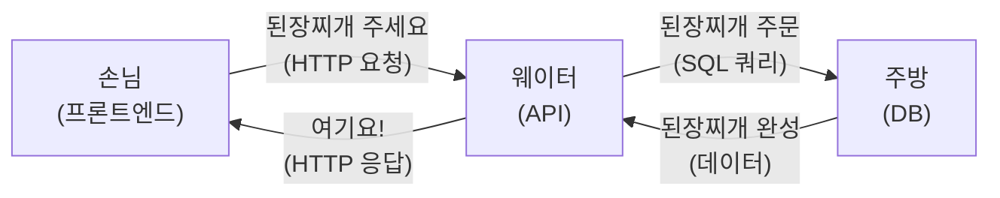
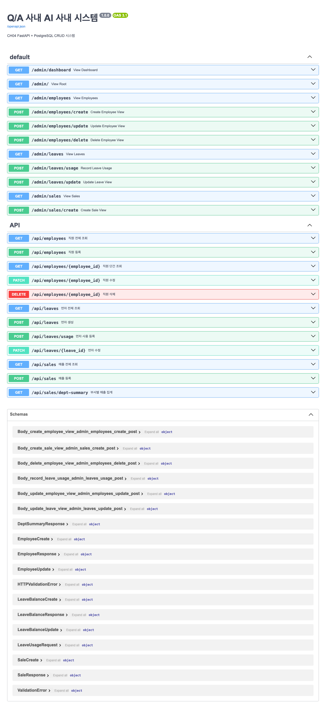
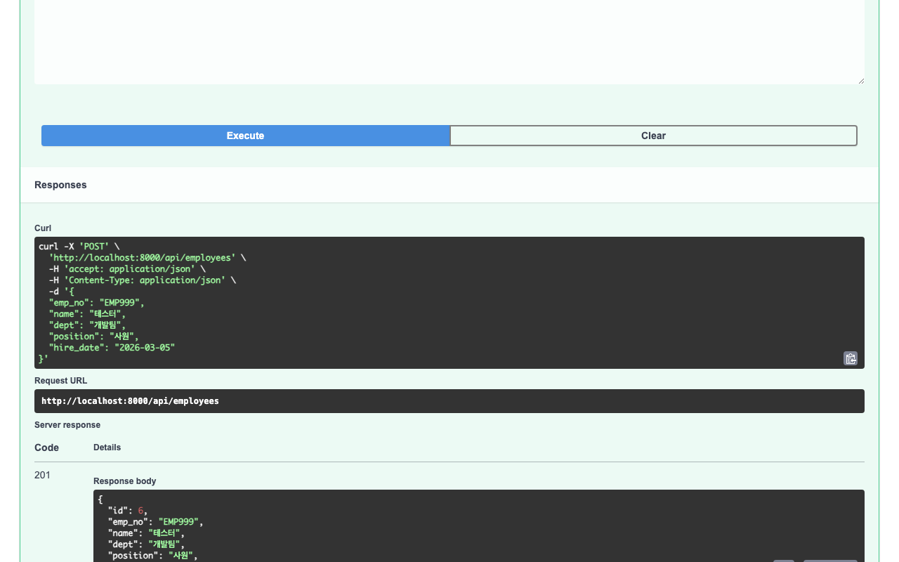

# Ch.2: "일단 사내 시스템부터" — FastAPI로 CRUD 만들기 (v0.1)

> 이번 버전: v0.0 → v0.1
> 한 줄 요약: AI 비서가 조회할 사내 시스템을 만들었다. API는 웨이터처럼 요청을 받아 DB에서 데이터를 가져다준다.
> 핵심 개념: REST API, Pydantic, psycopg2, CRUD 패턴

---

## 이야기 파트

### "연차 몇 개 남았어?" — AI가 대답 못 하는 질문

<!-- [GEMINI PROMPT: 02_chapter-opening]
path: assets/CH02/02_chapter-opening.png
A minimalist black and white technical diagram with a strict 16:9 aspect ratio
on a solid white background. No shading, no 3D effects, only clean thin line art.
The entire assembly of icons, lines, and text is perfectly centered globally
within the 16:9 frame, leaving generous and equal white space on all sides.

Left side: a minimalist line-art robot icon (AI assistant) with a speech bubble
containing '???' — confused, unable to answer.
Center: a minimalist line-art person icon (team lead) with a speech bubble
containing '연차 몇 개 남았어?'.
Right side: a minimalist line-art server rack icon labeled 'DB' with a lock icon,
and a dashed line from the robot toward the server with an X mark — indicating
the AI cannot access the database yet.
Korean label at bottom: 'AI 비서에게 물어봤지만, 조회할 시스템이 없다'.
Style: scene-opener
-->


지난 챕터에서 RAG의 기본 개념을 알았다. 사내 문서를 벡터 DB에 넣어두면, 질문할 때 관련 문서를 찾아서 답할 수 있다는 것.

좋다. 그런데 팀장이 새로운 요구를 던졌다.

"문서 검색만 되면 안 되지."
"'김대리 연차 몇 개 남았어?', '이번 달 개발팀 매출 얼마야?' 이런 것도 답해줘야지."

(잠깐. 연차 잔여일은 문서에 적혀있는 게 아닌데?)

직원 데이터베이스에서 실시간으로 조회해야 하는 데이터다.
매출도 마찬가지다.
문서 검색으로는 절대 답할 수 없다.

AI 비서가 진짜 업무를 도우려면, 사내 데이터를 조회할 수 있는 시스템이 먼저 있어야 한다.
AI가 "김대리 연차 잔여일을 알려줘"라고 부탁할 대상이 필요한 것이다.

그래서 이번 챕터에서는 AI 비서보다 먼저, AI 비서가 조회할 **사내 시스템**을 만든다.

---

### 식당에 비유해보자

API가 뭔지 어렵게 생각할 필요 없다.
식당을 떠올려보자.

손님(프론트엔드)이 식당에 들어와서 주문을 한다.
"된장찌개 하나요."
이 주문을 받는 사람이 **웨이터(API)** 다.
웨이터는 주문을 받아서 **주방(데이터베이스)** 에 전달한다.
주방에서 요리가 나오면 웨이터가 손님에게 가져다준다.

여기서 중요한 건, 손님이 직접 주방에 들어가지 않는다는 거다.
반드시 웨이터를 통해야 한다.
주방의 레시피도 모르고, 냉장고에 뭐가 있는지도 모른다.
"된장찌개 주세요"라고 말하면, 웨이터가 알아서 주방과 소통한다.


*그림 2-1: API는 식당의 웨이터다. 손님(프론트엔드)과 주방(DB)을 연결한다.*

우리가 만들 사내 시스템도 똑같다.
나중에 AI 비서가 손님 역할을 한다.
"김대리 연차 몇 개?"라고 물으면, API(웨이터)가 DB(주방)에서 찾아다 준다.

---

### 메뉴판이 필요하다 — CRUD 네 가지

식당에 메뉴판이 있듯이, API에도 할 수 있는 일의 목록이 있다. 사내 시스템에서 데이터를 다루는 기본 동작은 딱 네 가지다.

| 식당 비유 | 데이터 동작 | CRUD |
|----------|-----------|------|
| 새 메뉴 등록 | 직원 등록 | **C**reate |
| 메뉴판 보기 | 직원 목록 조회 | **R**ead |
| 메뉴 가격 변경 | 직원 정보 수정 | **U**pdate |
| 메뉴 삭제 | 직원 삭제 | **D**elete |

이 네 가지면 거의 모든 데이터를 관리할 수 있다.
직원 정보든, 연차 잔여량이든, 매출 기록이든 — 결국 등록하고, 조회하고, 수정하고, 삭제하는 거다.

<!-- [GEMINI PROMPT: 02_crud-menu]
path: assets/CH02/02_crud-menu.png
A minimalist black and white technical diagram with a strict 16:9 aspect ratio
on a solid white background. No shading, no 3D effects, only clean thin line art.
The entire assembly of icons, lines, and text is perfectly centered globally
within the 16:9 frame, leaving generous and equal white space on all sides.

A minimalist line-art menu board icon in the center, divided into four sections
arranged in a 2x2 grid. Each section contains a simple icon and Korean label:
Top-left: a plus icon labeled 'Create (등록)'.
Top-right: a magnifying glass icon labeled 'Read (조회)'.
Bottom-left: a pencil icon labeled 'Update (수정)'.
Bottom-right: a trash can icon labeled 'Delete (삭제)'.
Above the menu board: text 'API 메뉴판'.
Below the menu board: text '이 네 가지로 모든 데이터를 관리한다'.
Style: metaphor-diagram
-->

*그림 2-2: API의 메뉴판. 네 가지 동작이면 거의 모든 데이터를 다룰 수 있다.*

---

### 세 개의 테이블

우리 사내 시스템이 관리할 데이터는 세 종류다.

**직원(Employee)** — 사번, 이름, 부서, 직급, 입사일. "EMP001 김민수 개발팀 대리"

**연차(LeaveBalance)** — 누가, 몇 년도에, 총 연차가 며칠이고, 사용한 게 며칠인지. "김민수의 2025년: 총 15일, 사용 3일, 잔여 12일"

**매출(Sale)** — 어느 부서가, 언제, 얼마를, 뭘 팔았는지. "개발팀 2025-03-01 5,000,000원 SI프로젝트"

<!-- [GEMINI PROMPT: 02_erd-diagram]
path: assets/CH02/02_erd-diagram.png
A minimalist black and white technical diagram with a strict 16:9 aspect ratio
on a solid white background. No shading, no 3D effects, only clean thin line art.
The entire assembly of icons, lines, and text is perfectly centered globally
within the 16:9 frame, leaving generous and equal white space on all sides.

Three minimalist line-art table boxes arranged horizontally.
Left box labeled 'Employee (직원)' with fields: emp_no, name, dept, position, hire_date.
Center box labeled 'LeaveBalance (연차)' with fields: employee_id, year, total_days, used_days, remaining_days.
Right box labeled 'Sale (매출)' with fields: dept, sale_date, amount, item.
A solid arrow from Employee to LeaveBalance labeled '1:N'.
Sale box stands independently with no direct connection.
Korean label at bottom: '직원 중심으로 연차가 연결, 매출은 부서 단위 독립'.
Style: architecture-infographic
-->

*그림 2-3: 사내 시스템의 세 테이블. 직원을 중심으로 연차가 연결되고, 매출은 부서 단위로 독립 관리된다.*

이 세 테이블의 데이터를 API로 관리하는 시스템. 그게 이번 챕터에서 만들 것이다.

---

## 기술 파트

### 용어 정리

| 이야기 속 표현 | 진짜 용어 | 정식 정의 |
|------------|----------|---------|
| "식당 웨이터" | REST API | HTTP 메서드(GET/POST/PATCH/DELETE)로 자원을 조작하는 인터페이스 |
| "주문서 양식" | Pydantic 스키마 | 요청/응답 데이터의 구조와 검증 규칙을 정의하는 Python 모델 |
| "주방" | PostgreSQL | 관계형 데이터베이스. 테이블 형태로 데이터를 저장하고 SQL로 조회 |
| "주방과 소통하는 방법" | psycopg2 | Python에서 PostgreSQL에 연결하고 SQL을 실행하는 드라이버 |
| "메뉴판의 네 동작" | CRUD | Create, Read, Update, Delete — 데이터의 기본 4가지 조작 |
| "메뉴 등록" | dataclass | Python 데이터 클래스. DB 행(row)을 Python 객체로 표현 |

---

### 이번 챕터 파일 구조

```
v0.1/app/
├── models.py      [실습] 데이터 모델 (dataclass)
├── schemas.py     [실습] Pydantic 요청/응답 스키마
├── database.py    [실습] DB 연결 패턴 (Context Manager)
├── crud.py        [실습] CRUD 함수 + 매개변수화 쿼리
├── api.py         [설명] REST API 라우터
├── main.py        [참고] FastAPI 앱 진입점
└── views.py       (제외) Jinja2 Admin UI — 이 책에서는 다루지 않음
```

---

### 실습 환경 구축

> 기본 환경(Python, Docker)이 아직 안 되어 있다면 **부록(환경 설정)** 을 먼저 참고하자.

이 챕터부터 PostgreSQL이 필요하다.

```bash
# PostgreSQL 실행 (Docker)
docker compose up -d

# 패키지 설치 (v0.1/requirements.txt)
pip install -r requirements.txt
```

| 패키지 | 용도 |
|--------|------|
| `fastapi` | 웹 프레임워크 (API 서버) |
| `uvicorn` | ASGI 서버 (FastAPI 실행) |
| `psycopg2-binary` | PostgreSQL 드라이버 |
| `pydantic` | 요청/응답 데이터 검증 |
| `python-dotenv` | `.env` 환경 변수 로드 |

> `.env` 파일에 DB 접속 정보를 설정한다. `POSTGRES_HOST`, `POSTGRES_PORT`, `POSTGRES_DB`, `POSTGRES_USER`, `POSTGRES_PASSWORD` 다섯 가지.

---

### 실습 1 — models.py: 데이터의 모양 정하기

DB에서 꺼낸 데이터를 Python에서 어떤 형태로 들고 다닐지 정한다. `dataclass`를 사용하면 각 필드에 타입을 명시할 수 있어서, 데이터 구조가 한눈에 보인다.

```python
from dataclasses import dataclass
from datetime import date
from typing import Optional

@dataclass
class Employee:
    id: int
    emp_no: str       # 사번 (EMP001)
    name: str         # 이름
    dept: str         # 부서
    position: str     # 직급
    hire_date: date   # 입사일

@dataclass
class LeaveBalance:
    id: int
    employee_id: int
    year: int
    total_days: float
    used_days: float
    remaining_days: float
    name: Optional[str] = None  # JOIN 결과용

@dataclass
class Sale:
    id: int
    dept: str
    sale_date: date
    amount: int
    item: str
```

`Employee`, `LeaveBalance`, `Sale` — 세 개의 모델이 곧 세 개의 테이블에 대응한다.

---

### 실습 2 — schemas.py: 주문서 양식 만들기

Pydantic은 API로 들어오는 요청 데이터를 자동 검증한다. 주문서에 빈칸이 있거나 형식이 틀리면 바로 거부한다.

```python
from pydantic import BaseModel, Field

class EmployeeCreate(BaseModel):
    emp_no:    str  = Field(..., description="사번 (예: EMP006)")
    name:      str  = Field(..., description="직원 이름")
    dept:      str  = Field(..., description="소속 부서")
    position:  str  = Field(..., description="직급")
    hire_date: date = Field(..., description="입사일 (YYYY-MM-DD)")

class EmployeeResponse(BaseModel):
    id:        int
    emp_no:    str
    name:      str
    dept:      str
    position:  str
    hire_date: date
```

`EmployeeCreate`는 등록할 때 필요한 필드, `EmployeeResponse`는 응답으로 돌려줄 필드다. `Field(...)`의 `...`은 "이 값은 필수"라는 뜻이다. 연차, 매출도 같은 패턴으로 Create/Response 쌍을 만든다.

---

### 실습 3 — database.py: 주방 문 열기

psycopg2로 PostgreSQL에 연결한다. `contextmanager`를 사용하면 연결을 열고 → 사용하고 → 자동으로 닫는 흐름을 깔끔하게 관리할 수 있다.

```python
from contextlib import contextmanager
import psycopg2
import psycopg2.extras

@contextmanager
def get_connection():
    conn = None
    try:
        conn = psycopg2.connect(
            get_dsn(),
            cursor_factory=psycopg2.extras.RealDictCursor
        )
        yield conn
        conn.commit()
    except Exception:
        if conn:
            conn.rollback()
        raise
    finally:
        if conn:
            conn.close()
```

`RealDictCursor`는 쿼리 결과를 딕셔너리로 반환한다. `row["name"]`처럼 컬럼 이름으로 접근할 수 있어서 편하다. `yield`로 연결을 넘겨주고, 블록이 끝나면 자동으로 `commit`하거나 에러 시 `rollback`한다.

---

### 실습 4 — crud.py: 주문 처리하기

CRUD 함수의 핵심은 **매개변수화 쿼리**다. SQL에 값을 직접 넣지 않고, `%s` 플레이스홀더를 사용한다.

```python
def create_employee(conn, emp_no, name, dept, position, hire_date):
    sql = """
        INSERT INTO employee (emp_no, name, dept, position, hire_date)
        VALUES (%s, %s, %s, %s, %s)
        RETURNING id, emp_no, name, dept, position, hire_date
    """
    with conn.cursor() as cur:
        cur.execute(sql, (emp_no, name, dept, position, hire_date))
        row = cur.fetchone()
    return _row_to_employee(row)
```

왜 `f"... {name} ..."`이 아니라 `%s`를 쓸까? f-string으로 SQL을 만들면, 악의적인 입력이 SQL 구문을 바꿀 수 있다(SQL Injection). `%s`를 쓰면 psycopg2가 값을 안전하게 이스케이프해서 넣어준다.

조회 함수도 같은 패턴이다. 필터 조건을 동적으로 추가할 때도 `%s`와 파라미터 리스트를 사용한다.

```python
def get_all_employees(conn, name_filter=None, dept_filter=None):
    conditions, params = [], []
    if name_filter:
        conditions.append("name ILIKE %s")
        params.append(f"%{name_filter}%")

    where = ("WHERE " + " AND ".join(conditions)) if conditions else ""
    sql = f"SELECT * FROM employee {where} ORDER BY id"

    with conn.cursor() as cur:
        cur.execute(sql, params)
        return [_row_to_employee(r) for r in cur.fetchall()]
```

`ILIKE`는 대소문자를 무시하는 검색이다. `%김%`이면 "김"이 포함된 모든 이름을 찾는다.

---

### 설명 — api.py: 웨이터 배치하기

FastAPI 라우터가 HTTP 요청을 받아서 CRUD 함수를 호출한다. 데코레이터(`@router.get`, `@router.post` 등)가 URL과 HTTP 메서드를 연결한다.

```python
from fastapi import APIRouter, HTTPException
router = APIRouter(prefix="/api")

@router.get("/employees", response_model=list[EmployeeResponse])
def api_get_employees(name=None, dept=None):
    with get_connection() as conn:
        employees = crud.get_all_employees(conn, name, dept)
    return [EmployeeResponse(...) for e in employees]

@router.post("/employees", response_model=EmployeeResponse, status_code=201)
def api_create_employee(body: EmployeeCreate):
    with get_connection() as conn:
        emp = crud.create_employee(conn, body.emp_no, body.name, ...)
    return EmployeeResponse(...)
```

`response_model`이 응답 형식을 고정하고, Pydantic이 입력을 자동 검증한다. 직원 API 패턴을 연차, 매출에도 동일하게 적용하면 된다.

```bash
python run.py
```

서버가 뜨면 `http://localhost:8000/docs`에서 Swagger UI로 모든 API를 바로 테스트할 수 있다.

<!-- [CAPTURE NEEDED: 02_swagger-ui
  path: assets/CH02/02_swagger-ui.png
  desc: FastAPI Swagger UI 화면 — /api/employees, /api/leaves, /api/sales 엔드포인트 목록이 보이는 브라우저 화면
] -->

*그림 2-4: FastAPI가 자동 생성한 Swagger UI. 모든 API를 브라우저에서 바로 테스트할 수 있다.*

<!-- [CAPTURE NEEDED: 02_api-test-employee
  path: assets/CH02/02_api-test-employee.png
  desc: Swagger UI에서 POST /api/employees로 직원을 등록하고 GET으로 조회하는 터미널/브라우저 화면
] -->

*그림 2-5: 직원 등록(POST) 후 조회(GET) 결과. CRUD가 정상 동작한다.*

---

### 더 알아보기

**main.py** — FastAPI 앱의 진입점이다. 라우터를 등록하고 Uvicorn 서버를 시작한다. `app.include_router(api.router)`로 API 라우터를, `app.include_router(views.router)`로 Admin UI 라우터를 연결한다. 이 책에서는 Admin UI(views.py)는 다루지 않는다.

**Context Manager vs try/finally** — `get_connection()`이 `@contextmanager`를 사용하는 이유는 연결의 생명주기를 `with` 블록으로 보장하기 위해서다. `with` 블록을 빠져나가면 정상이든 에러든 반드시 `close()`가 호출된다.

**RealDictCursor** — 기본 커서는 결과를 튜플 `(1, "EMP001", "김민수")`로 반환한다. `RealDictCursor`는 딕셔너리 `{"id": 1, "emp_no": "EMP001", "name": "김민수"}`로 반환해서, 컬럼 순서에 의존하지 않고 이름으로 접근할 수 있다.

**DeptSummary** — 코드에는 부서별 매출 집계를 위한 `DeptSummary` 모델과 `GET /api/sales/dept-summary` 엔드포인트도 있다. 부서명으로 검색하면 해당 부서의 누적 매출 합계를 반환한다. CH06(에이전트 통합)에서 `sales_sum` 도구로 활용된다.

---

### 이것만은 기억하자

- **AI 비서가 조회할 사내 시스템을 만들었다.** API는 식당 웨이터처럼 요청을 받아 DB에서 데이터를 가져다준다.
- **CRUD 네 가지면 거의 모든 데이터를 관리할 수 있다.** 등록하고, 조회하고, 수정하고, 삭제하기.
- 다음 챕터에서는 AI 비서에게 먹일 사내 문서를 어떻게 수집하고 정리할지 설계한다.
