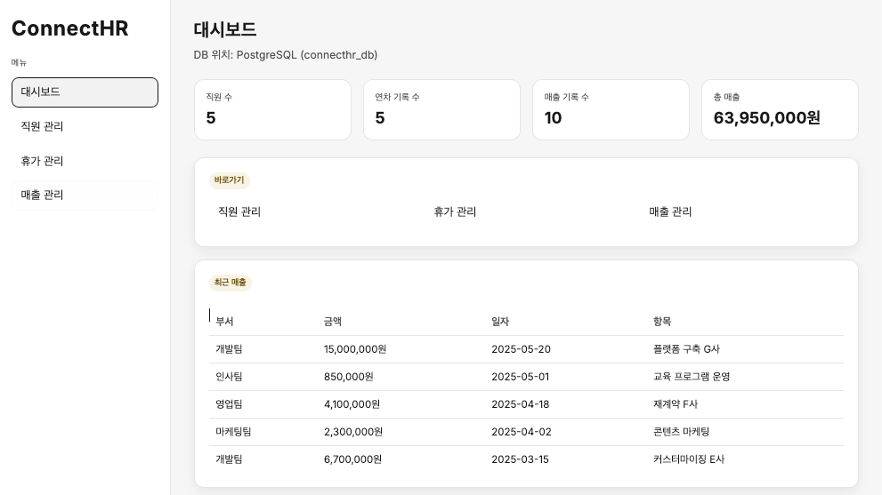
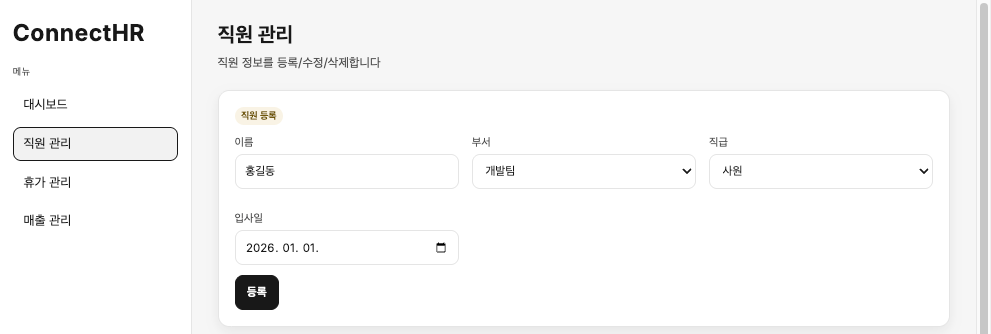

# Ch.2: FastAPI CRUD (ex02)

> 한 줄 요약: AI 비서가 조회할 사내 시스템을 실행해보고 구조를 파악한다. API는 웨이터처럼 요청을 받아 DB에서 데이터를 가져다준다.<br>
> 핵심 개념: REST API, CRUD 패턴

---

## 이야기 파트

### 1.1 AI가 대답 못 하는 질문

<!-- [GEMINI PROMPT: 02_chapter-opening]
path: assets/CH02/02_chapter-opening.png
A minimalist black and white technical diagram with a strict 16:9 aspect ratio
on a solid white background. No shading, no 3D effects, only clean thin line art.
The entire assembly of icons, lines, and text is perfectly centered globally
within the 16:9 frame, leaving generous and equal white space on all sides.

Left side: a minimalist line-art robot icon (AI assistant) with a speech bubble
containing '???' — confused, unable to answer.
Center: a minimalist line-art person icon (team lead) with a speech bubble
containing '연차 몇 개 남았어?'.
Right side: a minimalist line-art server rack icon labeled 'DB' with a lock icon,
and a dashed line from the robot toward the server with an X mark — indicating
the AI cannot access the database yet.
Korean label at bottom: 'AI 비서에게 물어봤지만, 조회할 시스템이 없다'.
Style: scene-opener
-->


지난 챕터에서 RAG의 기본 개념을 알았습니다. 사내 문서를 벡터 DB에 넣어두면 질문할 때 관련 문서를 찾아서 답할 수 있다는 것.

좋습니다. 그런데 팀장이 저를 바라보며 말을 꺼냅니다.

**팀장**: "문서 검색만 되면 안 되지."<br>
"'팀원 연차 몇 개 남았어?', '이번 달 개발팀 매출 얼마야?' 이런 것도 답해줘야지."

*잠깐. 연차 잔여일은 문서에 적혀있는 게 아닌데?*

직원 데이터베이스에서 실시간으로 조회해야 하는 데이터입니다. 매출도 마찬가지고요. 문서 검색으로는 절대 답할 수 없습니다.

AI 비서가 진짜 업무를 도우려면 사내 데이터를 조회할 수 있는 시스템이 먼저 있어야 합니다. AI가 "팀원 연차 잔여일을 알려줘"라고 부탁할 대상. 그게 없었던 겁니다.

그래서 이번 챕터에서는 AI 비서보다 먼저 **사내 시스템** 을 실행해봅니다. 코드를 하나하나 뜯어보진 않을 겁니다. 완성된 시스템을 띄워보고 "이런 데이터를 이렇게 조회할 수 있구나"를 확인하는 게 목표입니다.

---

### 1.2 API는 웨이터다

API가 뭔지 어렵게 생각할 필요 없습니다. 식당을 떠올려보세요.

손님(프론트엔드)이 식당 문을 열고 들어섭니다. "된장찌개 하나요." 이 주문을 받아 적는 사람이 **웨이터(API)** 입니다. 웨이터는 주문서를 들고 **주방(데이터베이스)** 으로 향합니다. 잠시 후 요리가 완성되면 웨이터가 손님 테이블로 가져다주죠.

여기서 중요한 건 하나입니다. 손님은 주방에 직접 들어가지 않습니다. 반드시 웨이터를 통해야 해요. 주방 레시피도, 냉장고에 뭐가 있는지도 모릅니다. "된장찌개 주세요." 그 한마디면 됩니다. 웨이터가 알아서 주방과 소통하니까요.


*그림 2-1: API는 식당의 웨이터다. 손님(프론트엔드)과 주방(DB)을 연결한다.*

우리가 실행해볼 사내 시스템도 똑같습니다. 나중에 AI 비서가 손님 역할을 맡게 돼요. "팀원 연차 몇 개?"라고 물으면 API(웨이터)가 DB(주방)에서 찾아다 줍니다.

> **참고: AI는 어떻게 API를 호출할까?**
> 사람이 UI에서 버튼을 누르듯 AI 비서도 API를 호출합니다. CH06에서 **MCP(Model Context Protocol)** 라는 도구를 통해 AI가 직접 API를 호출하는 법을 다룹니다. 지금은 "AI가 쓸 시스템을 먼저 확인해두는 것"에 집중하겠습니다.

---

### 1.3 CRUD 네 가지

식당에 메뉴판이 있듯 API에도 할 수 있는 일의 목록이 있습니다. 사내 시스템에서 데이터를 다루는 기본 동작은 딱 네 가지예요.

| 식당 비유 | 데이터 동작 | CRUD |
|----------|-----------|------|
| 새 메뉴 등록 | 직원 등록 | **C**reate |
| 메뉴판 보기 | 직원 목록 조회 | **R**ead |
| 메뉴 가격 변경 | 직원 정보 수정 | **U**pdate |
| 메뉴 삭제 | 직원 삭제 | **D**elete |

이 네 가지면 거의 모든 데이터를 관리할 수 있습니다. 직원 정보든 연차 잔여량이든 매출 기록이든. 결국 등록하고 조회하고 수정하고 삭제하는 겁니다.

<!-- [GEMINI PROMPT: 02_crud-menu]
path: assets/CH02/02_crud-menu.png
A minimalist black and white technical diagram with a strict 16:9 aspect ratio
on a solid white background. No shading, no 3D effects, only clean thin line art.
The entire assembly of icons, lines, and text is perfectly centered globally
within the 16:9 frame, leaving generous and equal white space on all sides.

A minimalist line-art menu board icon in the center, divided into four sections
arranged in a 2x2 grid. Each section contains a simple icon and Korean label:
Top-left: a plus icon labeled 'Create (등록)'.
Top-right: a magnifying glass icon labeled 'Read (조회)'.
Bottom-left: a pencil icon labeled 'Update (수정)'.
Bottom-right: a trash can icon labeled 'Delete (삭제)'.
Above the menu board: text 'API 메뉴판'.
Below the menu board: text '이 네 가지로 모든 데이터를 관리한다'.
Style: metaphor-diagram
-->

*그림 2-2: API의 메뉴판. 네 가지 동작이면 거의 모든 데이터를 다룰 수 있다.*

---

### 1.4 직원 · 연차 · 매출 테이블

우리 사내 시스템이 관리할 데이터는 세 종류예요.

**직원(Employee)** — 사번, 이름, 부서, 직급, 입사일. "EMP001 김민수 개발팀 대리."

**연차(LeaveBalance)** — 누가, 몇 년도에, 총 연차가 며칠이고, 사용한 게 며칠인지. "김민수의 2025년: 총 15일, 사용 3일, 잔여 12일."

**매출(Sale)** — 어느 부서가, 언제, 얼마를, 뭘 팔았는지. "개발팀 2025-03-01 5,000,000원 SI프로젝트."

<!-- [GEMINI PROMPT: 02_erd-diagram]
path: assets/CH02/02_erd-diagram.png
A minimalist black and white technical diagram with a strict 16:9 aspect ratio
on a solid white background. No shading, no 3D effects, only clean thin line art.
The entire assembly of icons, lines, and text is perfectly centered globally
within the 16:9 frame, leaving generous and equal white space on all sides.

Three minimalist line-art table boxes arranged horizontally.
Left box labeled 'Employee (직원)' with fields: emp_no, name, dept, position, hire_date.
Center box labeled 'LeaveBalance (연차)' with fields: employee_id, year, total_days, used_days, remaining_days.
Right box labeled 'Sale (매출)' with fields: dept, sale_date, amount, item.
A solid arrow from Employee to LeaveBalance labeled '1:N'.
Sale box stands independently with no direct connection.
Korean label at bottom: '직원 중심으로 연차가 연결, 매출은 부서 단위 독립'.
Style: architecture-infographic
-->

*그림 2-3: 사내 시스템의 세 테이블. 직원을 중심으로 연차가 연결되고, 매출은 부서 단위로 독립 관리된다.*

이 세 테이블의 데이터를 API로 관리하는 시스템. 그게 이번 챕터에서 확인할 내용이에요.

---

### 1.5 REST 엔드포인트 설계

시스템 구조를 정리하고 나니 팀장이 한마디 던집니다.

**팀장**: "이 AI 비서, 이름이 뭐야?"

*이름이요? 그냥 'AI 비서'라고 부르고 있었는데…*

**팀장**: "프로젝트에 이름이 없으면 회의할 때 불편해. 우리 회사가 **커넥트** 잖아. HR 데이터 다루는 AI 비서니까… **ConnectHR** 어때?"

커넥트의 HR 비서. 짧고 뭘 하는지 바로 알 수 있습니다.

**나**: "좋네요. ConnectHR."

이름이 붙으니 프로젝트가 진짜 시작된 느낌입니다. 지금은 사내 시스템만 있는 빈 껍데기지만 앞으로 챕터를 거듭하면서 **ConnectHR** 이 한 단계씩 성장해요. 문서를 읽고 질문에 답하고 DB도 조회하고, 결국 진짜 사내 비서가 되는 여정입니다.

---

이제 실습으로 사내 시스템을 직접 실행해보겠습니다.

---

### 2.1 용어 정리

| 이야기 속 표현 | 진짜 용어 | 정식 정의 |
|------------|----------|---------|
| "식당 웨이터" | **REST API** | HTTP 메서드(GET/POST/PATCH/DELETE)로 자원을 조작하는 인터페이스 |
| "메뉴판의 네 동작" | **CRUD** | Create, Read, Update, Delete — 데이터의 기본 4가지 조작 |
| "주방" | **PostgreSQL** | 관계형 데이터베이스. 테이블 형태로 데이터를 저장하고 SQL로 조회 |
| "주문서 양식" | **Pydantic** | 요청/응답 데이터의 구조와 검증 규칙을 정의하는 Python 라이브러리 |

---

### 2.2 파일 구조

```
ex02/
├── run.py                 [참고] 서버 플로우 실행
├── docker-compose.yml     [참고] PostgreSQL 컨테이너
├── requirements.txt       [참고] 의존성 목록
├── app/
│   ├── main.py            [참고] FastAPI 진입점
│   ├── api.py             [참고] REST API 엔드포인트
│   ├── crud.py            [참고] DB CRUD 로직
│   ├── database.py        [참고] PostgreSQL 연결
│   ├── schemas.py         [참고] Pydantic 데이터 검증
│   └── views.py           [참고] 관리자 웹 라우터
├── data/
│   └── schema.sql         [참고] 기본 테이블 및 샘플 데이터
├── templates/             [참고] 웹 UI HTML
└── static/                [참고] 웹 CSS/JS
```

---

### 2.3 실습 환경 준비

> 기본 환경(Python 3.12, Docker)이 없다면 **부록(환경 설정)** 을 먼저 참고하세요.

```bash
cd ex02
cp .env.example .env
python3.12 -m venv .venv
source .venv/bin/activate  # Windows: .venv\Scripts\activate
docker compose up -d
pip install -r requirements.txt
```

| 패키지 | 역할 |
|--------|------|
| `fastapi` | 웹 API 서버 |
| `uvicorn` | ASGI 서버 |
| `jinja2` | HTML 템플릿 엔진 |
| `psycopg2-binary` | PostgreSQL 드라이버 |
| `pydantic` | 요청/응답 데이터 검증 |
| `python-dotenv` | 환경 변수 관리 |

### 2.4 실습 순서

1. `python run.py` — 서버 시작
2. `/docs` — Swagger UI 확인
3. CRUD 테스트 — POST, GET, PATCH, DELETE
4. `/admin/` — 웹 UI 확인

서버를 실행하면 두 가지 인터페이스를 확인할 수 있습니다. **Swagger UI** (`/docs`)에서 API를 직접 호출해보고 **웹 UI** (`/admin/`)에서 일반 사용자 화면도 확인해 보세요.

```bash
# 실행
python run.py
```

브라우저에서 `http://localhost:8000/docs`를 열면 **Swagger UI** 가 뜹니다. FastAPI가 코드에서 자동으로 만들어주는 API 문서예요.

<!--
[CAPTURE NEEDED]
path: assets/CH02/02_swagger-ui.png
FastAPI Swagger UI 화면 — /api/employees, /api/leaves, /api/sales 엔드포인트 목록이 보이는 브라우저 화면
-->
<!-- [DUAL-IMAGE] -->


<!-- [/DUAL-IMAGE] -->

직원, 연차, 매출 — 세 영역의 API가 보입니다. 직접 눌러보세요.

POST로 직원을 등록하고 GET으로 조회하면 방금 등록한 데이터가 돌아옵니다. 수정(PATCH)이나 삭제(DELETE)도 됩니다. 이야기 파트에서 말한 CRUD 네 가지가 전부 동작하는 거예요.
Swagger UI는 개발자용입니다. 하지만 이 시스템에는 일반 사용자를 위한 웹 UI도 있어요. 브라우저에서 `http://localhost:8000/admin/`을 열어보세요.

<!-- [CAPTURE NEEDED: 02_admin-dashboard
  path: assets/CH02/02_admin-dashboard.png
  desc: /admin/dashboard 웹 UI 화면. 사이드바(대시보드/직원관리/휴가관리/매출관리 메뉴)와 통계 카드(직원 수, 연차 기록, 매출 기록, 총 매출액)가 보이는 브라우저 화면.
] -->

*그림 2-6: Jinja2 템플릿으로 만든 관리자 대시보드. 직원, 연차, 매출 현황을 한눈에 볼 수 있다.*

직원 관리 메뉴에서 사번과 이름, 부서, 직급, 입사일을 입력하고 등록하면 아래 목록에 바로 나타납니다. 기존 직원 5명에서 홍길동 사원이 추가된 걸 확인할 수 있어요.

<!-- [CAPTURE NEEDED: 02_admin-employee-create
  path: assets/CH02/02_admin-employee-create.png
  desc: /admin/employees 웹 UI 화면. 상단 등록 폼에 사번/이름/부서/직급/입사일을 입력한 상태 + 하단 직원 목록 테이블에 방금 등록한 직원이 표시된 화면. 폼 입력값과 목록 결과가 한 화면에 보여야 함.
] -->

*그림 2-7: 웹 UI에서 직원을 등록하면 목록에 바로 반영된다. API를 몰라도 CRUD가 된다.*

API는 뒷단의 배관이고 웹 UI는 수도꼭지입니다. 사용자는 수도꼭지만 틀면 되고 물이 어떤 배관을 타고 오는지 몰라도 돼요. 나중에 AI 비서도 같은 배관(API)을 사용합니다. 다만 수도꼭지 대신 코드로 틀 뿐이에요.

> `Ctrl + C`를 눌러 서버를 종료합니다. Docker 컨테이너도 `docker compose down`으로 정리합니다.

---

### 2.5 API 엔드포인트 목록

이 시스템이 제공하는 API 전체 목록입니다. CH06에서 AI 비서가 MCP로 이 API를 호출하게 됩니다.

| 메서드 | 경로 | 설명 |
|--------|------|------|
| GET | `/api/employees` | 직원 목록 조회 (이름/부서 필터) |
| POST | `/api/employees` | 직원 등록 |
| GET | `/api/employees/{id}` | 직원 상세 조회 |
| PATCH | `/api/employees/{id}` | 직원 정보 수정 |
| DELETE | `/api/employees/{id}` | 직원 삭제 |
| GET | `/api/leaves` | 연차 목록 조회 (직원/연도 필터) |
| POST | `/api/leaves` | 연차 등록 |
| GET | `/api/sales` | 매출 목록 조회 (부서/기간 필터) |
| POST | `/api/sales` | 매출 등록 |
| GET | `/api/sales/dept-summary` | 부서별 매출 합계 |

> **팁: 코드가 궁금하다면**
> `code/ex02/app/` 폴더에 전체 소스가 있습니다. FastAPI + psycopg2 + Pydantic 조합으로 만들어져 있어요. 이 책의 주제가 아니므로 코드 설명은 생략하지만 관심 있으면 직접 읽어봐도 좋습니다.

---

### 2.6 더 알아보기

**Swagger UI** — FastAPI는 코드에서 API 문서를 자동 생성합니다. Pydantic 스키마에 적어둔 필드 설명과 타입이 그대로 문서에 나와요. `/docs`는 Swagger UI, `/redoc`은 ReDoc 스타일로 볼 수 있습니다.

**DeptSummary** — `GET /api/sales/dept-summary`는 부서별 매출 합계를 반환합니다. CH06에서 AI 비서의 `sales_sum` 도구가 이 엔드포인트를 호출해서 "개발팀 매출 얼마야?"에 답하게 됩니다.

---

### 2.7 이것만은 기억하세요

- **AI 비서가 조회할 사내 시스템이 준비됐습니다.** API는 식당 웨이터처럼 요청을 받아 DB에서 데이터를 가져다줍니다.
- **CRUD 네 가지면 거의 모든 데이터를 관리할 수 있습니다.** 등록하고 조회하고 수정하고 삭제하기.
- 다음 챕터에서는 AI 비서에게 먹일 사내 문서를 어떻게 수집하고 정리할지 설계합니다.
