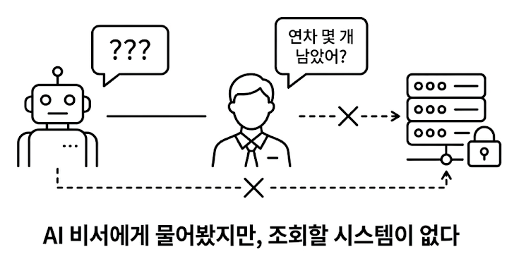
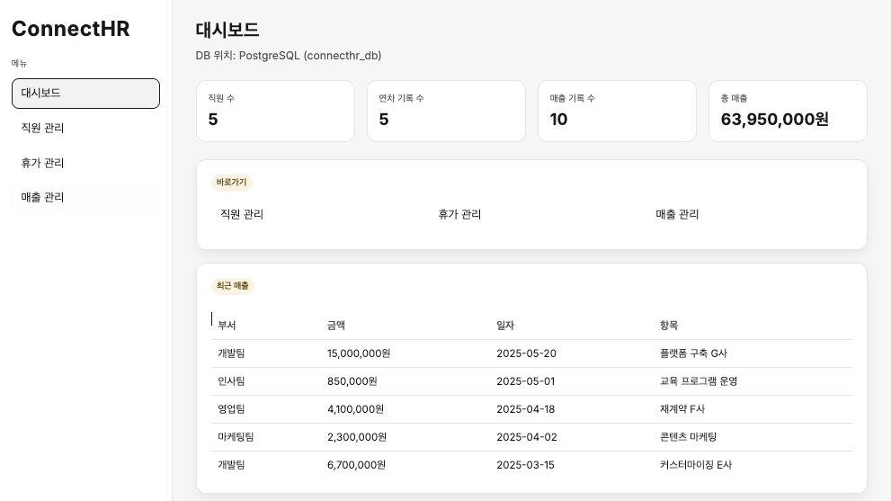

# 챕터 2. 일단 사내 시스템부터. 직원, 연차, 매출

:::goal
**이번 챕터가 끝나면**

- AI 비서가 조회할 **사내 시스템**(FastAPI + PostgreSQL)이 실제로 돌아가는 걸 눈으로 확인합니다
- **REST API**와 **CRUD** 네 동작(등록, 조회, 수정, 삭제)의 감을 잡습니다
- 앞으로 만들 AI 비서의 정식 이름 **커넥트HR 에이전트**를 갖게 됩니다
:::

::::prep
**준비하기**. 실습 시작 전 한 번만 설정

### 1. 실습 폴더 이동

챕터 1에서 클론한 레포의 `ex02` 폴더로 이동합니다.

```bash [터미널] 폴더 이동
cd rag-start/ex02
```

파일 구조는 다음과 같습니다.

```text ex02 디렉토리
ex02/
├── run.py                 # [참고] 서버 실행 진입점
├── docker-compose.yml     # [참고] PostgreSQL 컨테이너
├── requirements.txt       # [참고] 의존성 목록
├── .env.example           # [참고] 환경 변수 템플릿
├── app/
│   ├── main.py            # [참고] FastAPI 진입점
│   ├── api.py             # [참고] REST API 엔드포인트
│   ├── crud.py            # [참고] DB CRUD 로직
│   ├── database.py        # [참고] PostgreSQL 연결
│   ├── models.py          # [참고] SQLAlchemy 모델
│   ├── schemas.py         # [참고] Pydantic 데이터 검증
│   └── views.py           # [참고] 관리자 웹 라우터
├── data/schema.sql        # [참고] 기본 테이블 + 샘플 데이터
├── templates/             # [참고] 관리자 웹 UI HTML
└── static/                # [참고] 관리자 웹 CSS/JS
```

:::note
**이번 챕터의 모든 파일은 `[참고]`입니다.** 직접 작성하지 않고 실행해서 동작만 확인합니다. AI 비서가 조회할 "사내 시스템"이 어떻게 생겼는지 감을 잡는 것이 목적입니다. FastAPI, PostgreSQL 내부 구현에 집착할 필요가 없습니다.
:::

### 2. 실습 환경 구축

Docker로 PostgreSQL을 띄우고, Python 가상환경에 의존성을 설치합니다.

```bash [터미널] 환경 구성. macOS / Linux
cd ex02
cp .env.example .env
python3.12 -m venv .venv
source .venv/bin/activate
docker compose up -d
pip install -r requirements.txt
```

```bash [터미널] 환경 구성. Windows
cd ex02
copy .env.example .env
py -3.12 -m venv .venv
.venv\Scripts\activate
docker compose up -d
pip install -r requirements.txt
```

`docker compose up -d`를 실행하면 PostgreSQL 컨테이너가 시작되면서 `data/schema.sql`이 자동으로 실행됩니다. 직원 5명, 연차 기록, 매출 데이터가 미리 입력되어 있어 서버를 띄우자마자 바로 조회할 수 있습니다.

:::tip
**Apple Silicon(M1/M2/M3)에서 psycopg2 설치 실패 시**

`brew install libpq` 를 먼저 실행한 뒤 `pip install -r requirements.txt` 를 다시 시도하세요. libpq는 PostgreSQL 클라이언트 라이브러리로, psycopg2가 내부에서 사용합니다.
:::

### 3. 사용할 라이브러리

| 패키지 | 역할 |
|-------|------|
| `fastapi` | 웹 API 서버 프레임워크 |
| `uvicorn` | ASGI 서버 (FastAPI 구동) |
| `psycopg2-binary` | PostgreSQL 드라이버 |
| `pydantic` | 요청/응답 데이터 검증 |
| `jinja2` | 관리자 웹 UI HTML 템플릿 |
| `python-dotenv` | 환경 변수 관리 |

### 4. 실습 순서

이번 챕터는 **실행만** 해봅니다. 코드는 읽지 않아도 됩니다.

1. `python run.py`. 서버 시작
2. 브라우저 `http://localhost:8000/docs`. Swagger UI로 API 목록 훑어보기
3. 브라우저 `http://localhost:8000/admin/`. 관리자 웹 UI 확인
::::

## 2.1 AI가 대답 못 하는 질문: 정형 데이터의 필요


*그림 2-1. 문서 검색만으로는 답할 수 없는 질문이 있습니다*

월요일 아침 9시 반. 창밖에 비가 줄을 긋듯 내렸습니다.

어제 RAG 맛을 봤다는 흥분이 아직 가시지 않았는데, 팀장이 커피잔을 들고 자리로 다가왔습니다. 잔에서 김이 올라왔고, 키보드 위에 얹힌 손끝이 미지근했습니다.

**팀장**: "문서 검색만 되면 안 되죠."
**팀장**: "'김대리 연차 며칠 남았어?', '이번 달 개발팀 매출 얼마야?' 이런 것도 답해야죠."

손이 멈췄습니다.

*잠깐. 규정집 어딘가에 있을 법한데.*

책장에서 **인사규정 v2.3**을 꺼냈습니다. 페이지를 넘겼습니다. "연차는 입사 1년차에 15일…" 규정은 나옵니다. 그런데 **"김대리가 지금 며칠 남았는지"** 는 어디에도 없었습니다. 당연한 이야기였습니다. 규정집은 "어떻게 발생하는가"를 적는 곳이지, "누가 얼마 남았는가"를 적는 곳이 아닙니다.

*아, 이건 문서 문제가 아니구나.*

매출도 마찬가지입니다. 작년 매출 보고서 PDF는 있지만 "이번 달"은 DB에만 있죠. 실시간 숫자는 문서에 없었습니다. 규정집을 덮고 의자에 기댔습니다. 천장 형광등이 한 번 깜빡였습니다.

AI 비서가 진짜 업무를 도우려면 **사내 데이터를 꺼낼 수 있는 시스템**이 먼저 있어야 했습니다. AI에게 "연차 잔여일 알려줘"라고 시킬 대상. 지금까지 그게 없었던 것입니다.

그래서 이번 챕터는 AI 비서보다 **사내 시스템**을 먼저 실행해 봅니다. 코드를 한 줄씩 뜯지는 않습니다. 완성된 시스템을 띄워 "이런 데이터가 이런 모양으로 들어온다"를 눈으로 확인하는 것이 목적입니다.

## 2.2 직원, 연차, 매출 세 테이블

화이트보드 앞에 나란히 섰습니다. 팀장이 마커를 집어 들더니 왼쪽부터 박스 세 개를 그려 나갑니다. 마커 냄새가 한 번 훅 올라왔습니다.

**팀장**: "세 개면 충분해요. 직원, 연차, 매출."

**직원(Employee)**. 사번, 이름, 부서, 직급, 입사일. 예: `EMP001 김민준 개발팀 과장 2019-03-02`.

**연차(LeaveBalance)**. 누가, 몇 년도에, 총 며칠이고, 사용한 게 며칠인지. 예: `이서연(EMP002) 2025년 총 15일, 사용 3일, 잔여 12일`.

**매출(Sale)**. 어느 부서가, 언제, 얼마를, 뭘 팔았는지. 예: `개발팀 2025-02-10 12,000,000원 솔루션 개발 C사`.

팀장이 직원과 연차 박스 사이에 화살표를 그었습니다.

**팀장**: "직원 한 명에 연차 기록은 해마다 하나씩. 1대N."

매출은 혼자 떨어뜨려 그렸습니다. 부서 단위라 직원과 직접 연결되지 않는다는 뜻이었습니다.


*그림 2-2. 세 테이블의 관계. 직원을 중심으로 연차가 연결되고, 매출은 부서 단위로 독립 관리됩니다*

세 테이블 모두에 **CRUD**(등록, 조회, 수정, 삭제) API를 제공하는 것이 이번 챕터에서 띄울 시스템입니다. 챕터 6에서 커넥트HR 에이전트가 이 API를 직접 호출하게 되니, 지금은 **"AI가 나중에 쓸 시스템을 먼저 열어두는"** 단계입니다.

## 2.3 이름이 없으면 부를 수 없다: 커넥트HR 에이전트의 탄생

테이블 구조를 정리한 화이트보드를 들여다보던 팀장이 한마디 던졌습니다.

**팀장**: "이 AI 비서, 이름이 뭐예요?"

*이름이요? 그냥 'AI 비서'라고 부르고 있었는데….*

**팀장**: "프로젝트에 이름이 없으면 회의할 때 불편하잖아요. 우리 회사가 **커넥트**니까요. HR 데이터를 다루는 AI 에이전트니까… **커넥트HR 에이전트** 어때요?"

커넥트의 HR 에이전트. 짧고, 무엇을 하는지 바로 전달됩니다.

**오픈이**: "좋네요. 커넥트HR 에이전트."

이름이 붙으니 프로젝트가 진짜 시작된 느낌입니다. 지금은 사내 시스템 껍데기뿐이지만, 앞으로 챕터를 거듭하며 이 에이전트가 한 단계씩 자랍니다. 문서를 읽고, 질문에 답하고, DB를 조회하고, 결국 "진짜 비서"에 가까워지는 여정입니다.

이제 실제로 실행해 볼 차례입니다.

## 2.4 서버를 띄우고 Swagger UI에서 두드려보기

`python run.py`로 서버를 띄웁니다.

```bash [터미널] 서버 실행
python run.py
```

터미널에 `Uvicorn running on http://0.0.0.0:8000`이 찍히면 준비 완료입니다. 브라우저에서 `http://localhost:8000/docs`를 엽니다.


*그림 2-3. FastAPI가 자동 생성한 Swagger UI. 직원, 연차, 매출 세 영역의 API가 한눈에 보입니다*

:::term-box
**Swagger UI란?** FastAPI가 Pydantic 스키마에서 API 문서를 자동으로 뽑아 주는 웹 UI입니다. 각 엔드포인트를 브라우저에서 바로 호출할 수 있어, 별도의 테스트 도구 없이 개발 중 API 동작을 확인할 수 있습니다.
:::

이 책에서는 Swagger UI로 하나하나 호출해 보는 실습은 따로 하지 않습니다. "이 시스템엔 이런 API가 있구나" 정도만 눈으로 확인하고 넘어가세요. 챕터 6에서는 사람 대신 커넥트HR 에이전트가 이 API들을 두드리게 됩니다.

## 2.5 관리자 웹 UI로도 확인하기

Swagger UI는 개발자용입니다. 같은 시스템에 **일반 사용자용 관리자 화면**도 함께 제공됩니다. 브라우저에서 `http://localhost:8000/admin/`을 엽니다.


*그림 2-4. Jinja2 템플릿으로 만든 관리자 대시보드. 직원, 연차, 매출 현황을 한눈에 보여 줍니다*

좌측 **직원 관리** 메뉴에서 이름 "홍길동"과 부서, 직급, 입사일을 입력하고 저장을 누르면 아래 목록에 한 줄이 바로 추가됩니다. 사번은 시스템이 자동으로 부여합니다.


*그림 2-5. 직원 관리 목록. 맨 아래에 홍길동이 새 사번으로 추가된 모습입니다. API 호출법을 몰라도 CRUD가 됩니다*

지금까지 만든 부분이 전체 시스템에서 어디에 놓이는지 한번 보겠습니다. 아래는 이 책 전체에서 만들 **커넥트HR 에이전트**의 구성도입니다. 진하게 표시된 두 박스가 이번 챕터에서 실행한 부분입니다. 나머지는 다음 챕터들에서 하나씩 채워 갑니다.

<div class="arch11">
<div class="header">
<div class="sub">chapter 02</div>
<div class="title">시스템 아키텍처</div>
<div class="desc">대시보드 + SQL</div>
</div>
<div class="row-client">
<div class="col-c new">
<span class="new-badge">NEW · CH2</span>
<div class="user"><div class="ico">◉</div><div class="n">사용자</div><div class="s">채팅으로 질문</div></div>
<div class="flow"><span class="d">↓ 질문</span><span class="u">↑ 답변</span></div>
<div class="api"><div class="l">API 게이트웨이 (Gateway)</div><div class="n">FastAPI</div><div class="s">대시보드 · REST</div></div>
</div>
<div class="flow-arrows empty">
<div class="fa-pair"><div class="fa-label">요청</div><div class="fa-arrow call">→</div></div>
<div class="fa-pair"><div class="fa-arrow ret">←</div><div class="fa-label">응답</div></div>
</div>
<div class="gap gap-col-a"></div>
</div>
<div class="lvl-lbl muted"><span class="up">↑ 프롬프트 · 도구 호출</span> &nbsp;·&nbsp; <span class="down">↓ 응답 · 결과</span></div>
<div class="row-ext">
<div class="gap gap-llm"></div>
<div class="flow-arrows empty">
<div class="fa-pair"><div class="fa-arrow ret">←</div></div>
<div class="fa-pair"><div class="fa-arrow call">→</div></div>
</div>
<div class="gap gap-col-t"></div>
</div>
<div class="lvl-lbl muted"><span class="up">↑ 조회 · 도구 실행</span> &nbsp;·&nbsp; <span class="down">↓ 레코드 · 문서</span></div>
<div class="stores">
<div class="gap"></div>
<div class="st new">
<span class="new-badge">NEW · CH2</span>
<div class="l">관계형 DB (Relational)</div>
<div class="n">PostgreSQL</div>
<div class="s">직원 · 연차 · 매출</div>
</div>
</div>
</div>
<div class="caption">그림 2-6. 챕터 2가 만든 부분. 순서대로 학습합니다.</div>

:::tip
**종료합니다**

`Ctrl + C`로 서버를 종료하고 `docker compose down`으로 컨테이너를 내립니다.
:::

## 2.6 API 엔드포인트 목록

이 시스템이 제공하는 API 전체 목록입니다. 챕터 6에서 커넥트HR 에이전트가 MCP 도구로 이 중 몇 개를 호출하게 됩니다.

| 메서드 | 경로 | 설명 |
|-------|-----|-----|
| GET | `/api/employees` | 직원 목록 조회 (이름·부서 필터) |
| POST | `/api/employees` | 직원 등록 |
| GET | `/api/employees/{emp_no}` | 직원 상세 조회 |
| PATCH | `/api/employees/{emp_no}` | 직원 정보 수정 |
| DELETE | `/api/employees/{emp_no}` | 직원 삭제 |
| GET | `/api/leaves` | 연차 목록 조회 (직원·연도 필터) |
| POST | `/api/leaves` | 연차 등록 |
| POST | `/api/leaves/usage` | 연차 사용 등록 |
| PATCH | `/api/leaves/{emp_no}/{year}` | 연차 수정 |
| GET | `/api/sales` | 매출 목록 조회 (부서·기간 필터) |
| POST | `/api/sales` | 매출 등록 |
| GET | `/api/sales/dept-summary` | 부서별 매출 합계 |

`/api/sales/dept-summary`는 부서별 매출 합계를 반환하는 특수 엔드포인트입니다. 챕터 6에서 에이전트의 `sales_sum` 도구가 이 엔드포인트를 호출해 "개발팀 매출 얼마야?" 같은 질문에 답하게 됩니다.

Swagger UI를 마저 훑어보고 있는데 팀장이 모니터를 흘끗 보더니 한마디 던졌습니다.

**팀장**: "이제 AI 비서가 조회해볼 곳이 생겼네요."

오프닝에 "문서 검색만 되면 안 되지"라며 판을 뒤집었던 그 사람입니다. 이제 그 판에 올려둘 시스템이 준비됐습니다.

## 용어 정리

| 본문 속 표현 | 진짜 용어 | 정식 정의 |
|---------------|---------|----------|
| "사내 데이터를 꺼내는 시스템" | **REST API** | HTTP 메서드(GET/POST/PATCH/DELETE)로 자원을 조회·생성·수정·삭제하는 인터페이스 |
| "등록·조회·수정·삭제 네 동작" | **CRUD** | Create·Read·Update·Delete. 데이터 조작의 기본 네 가지 |
| "직원·연차·매출이 들어 있는 저장소" | **PostgreSQL** | 오픈소스 관계형 데이터베이스. 테이블 구조로 저장하고 SQL로 조회 |
| "요청·응답 JSON의 모양을 정한 양식" | **Pydantic** | Python에서 요청·응답 데이터의 구조와 검증 규칙을 선언하는 라이브러리 |
| "버튼 한 번으로 API를 테스트하는 웹 화면" | **Swagger UI** | FastAPI가 Pydantic 스키마에서 자동 생성하는 API 문서·테스트 UI |
| "API는 그대로, 호출자만 바뀐다" | **MCP Tools** | 챕터 6에서 붙일 "AI가 API를 직접 호출"할 수 있게 해 주는 도구 계층 |
:::remember
**이것만은 기억하자**

- **문서로는 답할 수 없는 질문이 있습니다.** "김대리 연차 며칠?" 같은 **실시간 정형 데이터**는 규정집이 아니라 DB에서 꺼내야 합니다. RAG만으로는 이 영역을 덮을 수 없습니다.
- **API는 그대로, 호출자만 바뀝니다.** 오늘 만든 FastAPI는 지금은 사람이 웹 UI로 호출하지만, 챕터 6부터는 커넥트HR 에이전트가 **같은 엔드포인트**를 대신 호출합니다.
- **커넥트HR 에이전트의 이름이 정해졌습니다.** 다음 챕터부터는 이 에이전트에게 먹일 사내 문서를 어떤 형식으로 수집하고 정리할지 설계합니다.
:::
