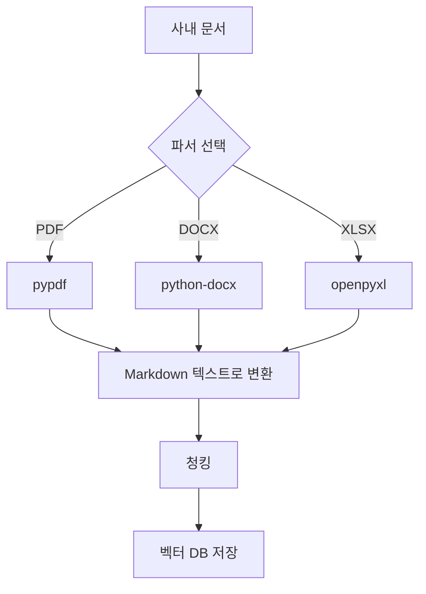

# Ch.3: "어떤 문서를 넣을까" — 사내 문서 수집 전략과 표준 (v0.3)

> 이번 버전: v0.2 → v0.3
> 한 줄 요약: AI에게 좋은 답을 원하면 좋은 문서를 넣어야 한다. 도서관처럼 분류하고 라벨을 붙이자.
> 핵심 개념: 문서 품질, 메타데이터, 청킹 전략 사전 설계, 재인덱싱 전략

---

## 이야기 파트

<!-- [GEMINI PROMPT: 03_chapter-opening]
path: assets/CH03/03_chapter-opening.png
A minimalist black and white technical diagram with a strict 16:9 aspect ratio
on a solid white background. No shading, no 3D effects, only clean thin line art.
The entire assembly of icons, lines, and text is perfectly centered globally
within the 16:9 frame, leaving generous and equal white space on all sides.

Center: a minimalist line-art person icon standing in front of a large open folder
labeled '공유 드라이브'. Around the person: scattered document icons in various formats —
a page labeled 'PDF', a page labeled 'DOCX', a page labeled 'XLSX',
a page labeled 'HWP' — floating in disarray at different angles.
A large question mark hovers above the person's head.
Style: scene-opener
-->


### "이걸 다 넣어야 해?"

사내 시스템(v0.2)은 만들었다. 직원, 연차, 매출 데이터는 API로 조회할 수 있다. 이제 AI 비서의 나머지 절반 — **문서 검색**을 본격적으로 준비할 차례다.

CH01에서 더미 문서 3개로 RAG를 돌려봤다. 잘 됐다. 이제 실제 사내 문서를 넣어보자.

공유 드라이브를 열었다.

취업규칙.pdf, 보안지침_v3_최종_진짜최종.docx, 2024년_복지정책.xlsx, 회의록_0301.hwp, 프로젝트_보고서.pptx, README.md…

한숨이 나왔다. 형식이 제각각이다. PDF도 있고, 워드도 있고, 엑셀도 있고, 심지어 한글 파일도 있다. 어떤 건 최신인데 어떤 건 2년 전 문서다. 이걸 통째로 다 벡터 DB에 밀어 넣으면 될까?

---

### 도서관에서 배우는 문서 정리

도서관을 생각해보자. 새 책이 기증되면 사서가 바로 서가에 꽂지 않는다.

1. **먼저 분류한다** — 이 책이 어느 분야인지, 대출 가능한지, 최신판인지 확인한다.
2. **라벨을 붙인다** — 청구기호(위치), 저자, 출판년도, 키워드를 기록한다.
3. **서가에 꽂는다** — 분류에 맞는 위치에 넣는다.

라벨 없이 책을 마구잡이로 꽂아놓으면? 나중에 찾을 수 없다. "경영학 개론이 어딨지?" 하면서 서가 전체를 뒤져야 한다.

사내 문서도 마찬가지다. 벡터 DB에 넣기 전에 **분류하고, 라벨을 붙이고, 정리하는 단계**가 필요하다. 이 단계를 건너뛰면 나중에 검색 품질이 엉망이 된다.

<!-- [GEMINI PROMPT: 03_document-pipeline]
path: assets/CH03/03_document-pipeline.png
A minimalist black and white technical diagram with a strict 16:9 aspect ratio
on a solid white background. No shading, no 3D effects, only clean thin line art.
The entire assembly of icons, lines, and text is perfectly centered globally
within the 16:9 frame, leaving generous and equal white space on all sides.

Left section: a messy stack of minimalist line-art document icons
(labeled 'PDF', 'DOCX', 'XLSX') piled haphazardly with small question marks.
Center section: three processing step boxes connected by arrows —
'필터링' → '메타데이터 태깅' → '청킹 설계'.
A minimalist line-art librarian icon stands beside the center section.
Right section: a clean minimalist line-art cylinder database icon labeled '벡터 DB'
with neatly arranged small document pieces inside, each with tiny tags.
Style: architecture-infographic
-->

*그림 3-1: 사내 문서를 벡터 DB에 넣기까지. 정리 없이 넣으면 검색 품질이 떨어진다.*

---

### 첫 번째 원칙: 넣을 문서와 뺄 문서

모든 문서를 넣을 필요는 없다. 오히려 필요 없는 문서가 들어가면 검색 품질이 떨어진다. 연차 규정을 물어봤는데 2년 전 폐기된 규정이 나오면 곤란하다.

**넣어야 할 것**: 현재 유효한 규정, 정책, 가이드. 자주 질문하는 내용이 담긴 문서.

**빼야 할 것**: 폐기된 문서, 개인 메모, 초안, 중복 문서(같은 내용의 v1/v2/v3).

간단한 기준이 있다. "이 문서를 신입사원에게 줘도 되나?" 된다면 넣고, 아니라면 뺀다.

---

### 두 번째 원칙: 먼저 같은 말로 번역해야 한다

PDF, DOCX, XLSX — 형식이 제각각이다. 이걸 그대로 벡터 DB에 넣을 수는 없다. 벡터 DB는 **텍스트**만 이해한다.

외국 도서관을 생각해보자. 영어 책, 일본어 책, 프랑스어 책이 섞여 들어온다. 서가에 꽂기 전에 먼저 **한국어로 번역**해야 찾을 수 있다. 마찬가지로, PDF/DOCX/XLSX를 먼저 **하나의 텍스트 형태**로 바꿔야 한다.

이 책에서는 **Markdown**으로 통일한다. 왜 Markdown일까?

- LLM이 가장 잘 이해하는 포맷이다. LLM의 훈련 데이터에 Markdown이 대량 포함되어 있어서, `# 제목`이나 `- 목록` 같은 구조를 자연스럽게 인식한다.
- 제목이 보존된다. PDF의 큰 글씨, DOCX의 "제목 1" 스타일이 `# 제목`으로 변환된다.
- 표가 보존된다. 엑셀 시트가 `| 열1 | 열2 |` 형태로 변환된다.
- 사람도 읽을 수 있다. 변환 결과가 제대로인지 눈으로 확인할 수 있다.


*그림 3-2: 파서가 다양한 형식을 Markdown 텍스트로 통일한다. 그래야 청킹하고 검색할 수 있다.*

---

### 세 번째 원칙: 라벨이 없으면 검색할 수 없다

도서관에서 책에 붙이는 정보 — 청구기호, 저자, 분야, 출판년도. 이것이 문서의 세계에서는 **메타데이터**다.

메타데이터가 왜 중요할까? AI 비서에게 "보안 관련 규정 알려줘"라고 물었을 때, 메타데이터에 `file_name: SEC_보안규정`이 있으면 보안 문서를 바로 식별할 수 있다. 메타데이터가 없으면 모든 문서를 다 뒤져야 한다.

좋은 소식은, 메타데이터를 직접 하나하나 적을 필요가 없다는 거다. **파서가 파일명과 경로에서 자동으로 추출**한다.

| 메타데이터 | 추출 방식 | 예시 |
|-----------|----------|------|
| 파일명 (file_name) | 파일에서 자동 | `HR_취업규칙_v1.0.pdf` |
| 파일 형식 (file_type) | 확장자에서 자동 | `pdf` |
| 원본 경로 (source_path) | 폴더 구조에서 자동 | `docs/hr/HR_취업규칙_v1.0.pdf` |
| 문서 ID (doc_id) | 파일명에서 자동 생성 | `hr_취업규칙_v1_0` |
| 페이지 (page) | 파싱 시 자동 | `1` |

그래서 **파일명에 정보를 담는 것**이 중요하다. `HR_취업규칙_v1.0.pdf`처럼 분류(HR)와 버전(v1.0)을 파일명에 넣으면, 파서가 알아서 메타데이터로 만들어준다.

---

### 네 번째 원칙: 잘라야 찾는다 — 청킹 전략

CH01에서 이미 경험했다. 문서를 통째로 넣으면 검색 정확도가 떨어진다. 문서를 적절한 크기로 **조각(chunk)** 내야 한다.

그런데 조각의 크기를 어떻게 정할까?

너무 작으면 — 문맥이 잘린다. "신입사원은 3년 동안 연차가 없다" 다음 줄에 "대신 리프레시 데이를 제공한다"가 있는데, 잘못 자르면 "연차가 없다"만 나온다.

너무 크면 — CH01의 노청킹 실험처럼, 관련 없는 내용까지 딸려온다.

지금 단계에서는 설계만 해둔다. 실제 구현은 CH04(VectorDB 구축)에서 한다.

| 전략 | 크기 | 오버랩 | 적합한 경우 |
|------|------|--------|-----------|
| 고정 크기 | 500자 | 100자 | 규정, 매뉴얼 (구조화된 문서) |
| 문단 기준 | 문단 단위 | — | 보고서, 회의록 (자연스러운 구분) |
| 의미 기준 | 가변 | — | 긴 문서, 주제 전환이 잦은 문서 |

> 이 책에서는 CH04에서 **고정 크기(500자 + 100자 오버랩)** 으로 시작하고, CH08(검색 품질 튜닝)에서 의미 기준 청킹과 비교 실험을 한다.

---

### 다섯 번째 원칙: 문서는 계속 바뀐다 — 재인덱싱 전략

사내 문서는 살아있다. 취업규칙이 개정되고, 새 보안지침이 나오고, 복지정책이 바뀐다. 벡터 DB에 한 번 넣어놓고 끝이 아니다.

재인덱싱을 안 하면 어떻게 될까? AI 비서가 폐기된 규정을 근거로 답변한다. "연차 15일입니다"라고 답하는데, 실제로는 규정이 바뀌어서 20일인 상황. 환각보다 더 위험하다 — 출처까지 달려있으니까 신뢰하게 된다.

재인덱싱에는 두 가지 방식이 있다.

**전체 재인덱싱** — 모든 문서를 지우고 처음부터 다시 넣는다. 간단하지만 시간이 오래 걸린다.

**증분 재인덱싱** — 변경된 문서만 업데이트한다. 빠르지만 "어떤 문서가 변경됐는지" 추적해야 한다.

> 이 책에서는 문서 수가 적으므로 **전체 재인덱싱**으로 충분하다. 문서가 수천 개 이상이면 증분 방식을 고려한다.

---

### 우리 프로젝트의 문서 구조

정리하면, 우리 사내 AI 비서에 넣을 문서는 이런 구조로 관리한다.

```
data/docs/
├── hr/                              ← 분류가 폴더명
│   ├── HR_취업규칙_v1.0.pdf          ← 분류_제목_버전이 파일명
│   └── HR_정보보안서약서.pdf
├── security/
│   └── SEC_보안규정_v1.0.docx
├── finance/
│   ├── FIN_2025_상반기_매출현황.xlsx
│   └── FIN_부서별_예산기안서.xlsx
└── ops/
    └── OPS_신규서비스_런칭전략.pdf
```

별도의 메타데이터 파일을 만들 필요 없다. **폴더 구조와 파일명이 곧 메타데이터**다. CH04에서 파서가 이 정보를 자동으로 추출해서 벡터 DB에 저장한다.

---

## 기술 파트

### 용어 정리

| 이야기 속 표현 | 진짜 용어 | 정식 정의 |
|------------|----------|---------|
| "같은 말로 번역" | 파싱 (Parsing) | 다양한 형식(PDF/DOCX/XLSX)에서 텍스트를 추출하여 통일된 형태로 변환하는 과정 |
| "도서관 분류 라벨" | 메타데이터 (Metadata) | 문서 자체 내용이 아닌, 문서에 대한 정보 (파일명, 형식, 경로 등) |
| "문서 조각내기" | 청킹 (Chunking) | 긴 문서를 벡터 DB에 저장할 수 있는 크기로 분할하는 과정 |
| "조각이 겹치는 부분" | 오버랩 (Overlap) | 청크 간 경계에서 문맥이 잘리지 않도록 앞뒤를 겹치게 자르는 기법 |
| "문서 다시 넣기" | 재인덱싱 (Re-indexing) | 변경/추가된 문서를 벡터 DB에 반영하는 과정 |
| "쓰레기 넣으면 쓰레기" | GIGO (Garbage In, Garbage Out) | 입력 데이터 품질이 출력 품질을 결정한다는 원칙 |

---

### 문서 표준 규칙 (템플릿)

실제 프로젝트에서 사내 문서를 관리할 때 참고할 규칙이다.

**1. 파일 형식 제한**

| 허용 형식 | 파서 | 비고 |
|----------|------|------|
| PDF | pypdf | 텍스트 기반. 이미지 PDF는 CH10에서 OCR 처리 |
| DOCX | python-docx | 표, 목록 포함 가능 |
| XLSX | openpyxl | 표 형태 데이터 (규정 비교표 등) |
| TXT/MD | 기본 읽기 | 가장 깔끔 |

> HWP, PPT는 이 책에서 다루지 않는다. 가능하면 PDF로 변환 후 사용.

**2. 메타데이터 — 파일명 규칙**

별도의 JSON 파일은 만들지 않는다. 파서가 파일명과 경로에서 자동 추출한다. 그래서 **파일명 규칙**이 중요하다.

```
[분류]_[제목]_[버전].확장자

예시:
HR_취업규칙_v1.0.pdf    → file_name: HR_취업규칙_v1.0.pdf
SEC_보안규정_v1.0.docx  → file_type: docx
FIN_2025_상반기_매출현황.xlsx → source_path: data/docs/finance/...
```

**3. 청킹 설계 가이드**

| 항목 | 권장값 | 이유 |
|------|--------|------|
| 기본 크기 | 500자 | 한국어 기준 2~3문단. 의미 단위와 대략 일치 |
| 오버랩 | 100자 | 청크 경계에서 문맥 유지 |
| 최소 크기 | 100자 | 너무 짧은 청크는 의미 없음 → 이전 청크에 병합 |

**4. 재인덱싱 운영 가이드**

| 시점 | 방식 | 실행 |
|------|------|------|
| 규정 개정 시 | 전체 재인덱싱 | 수동 트리거 |
| 주기적 | 전체 재인덱싱 | 월 1회 (문서 수 적을 때) |
| 문서 추가 시 | 해당 문서만 추가 | 기존 인덱스 유지 |

---

### 더 알아보기

**문서 품질 체크리스트** — 벡터 DB에 넣기 전에 확인할 항목들이다. (1) 현재 유효한 문서인가? (2) 중복 문서가 없는가? (3) 텍스트 추출이 가능한가(이미지만 있는 PDF 아닌가)? (4) 메타데이터가 기록되어 있는가?

**한국어 청킹의 특수성** — 영어는 단어 사이에 공백이 있어서 토큰 수 기반 청킹이 자연스럽다. 한국어는 띄어쓰기 단위가 영어보다 크고, 조사가 붙어서 같은 500자라도 정보 밀도가 다를 수 있다. CH08에서 의미 기반 청킹(Semantic Chunking)과 비교 실험을 해본다.

**메타데이터 필터링** — 이 프로젝트에서 사용하는 ChromaDB는 저장 시 메타데이터를 함께 넣을 수 있고, 검색 시 `where={"file_type": "pdf"}`처럼 필터를 걸 수 있다. 지금은 메타데이터를 검색 결과의 출처 표시용으로 활용하지만, 문서가 많아지면 필터링으로 검색 범위를 좁히는 것도 가능하다.

---

### 이것만은 기억하자

- **AI에게 좋은 답을 원하면 좋은 문서를 넣어야 한다.** 쓰레기를 넣으면 쓰레기가 나온다(Garbage In, Garbage Out).
- **PDF/DOCX/XLSX는 먼저 Markdown 텍스트로 통일해야 한다.** 형식이 다르면 청킹도 검색도 안 된다.
- **폴더 구조와 파일명이 곧 메타데이터다.** 파서가 자동으로 추출하므로 파일명 규칙을 지키자.
- 다음 챕터에서는 이 문서들을 실제로 파싱하고, 청킹하고, 벡터 DB에 저장한다.
