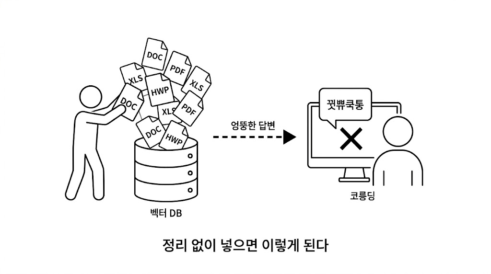

# Ch.3: 문서 표준과 메타데이터 (ex03)

> 한 줄 요약: AI에게 좋은 답을 원하면 좋은 문서를 넣어야 한다. 도서관처럼 분류하고 라벨을 붙이자.  
> 핵심 개념: 문서 품질, 메타데이터, 청킹 전략 사전 설계, 재인덱싱 전략

---

<!-- [GEMINI PROMPT: 03_chapter-opening]
path: assets/CH03/03_chapter-opening.png
A minimalist black and white technical diagram with a strict 16:9 aspect ratio
on a solid white background. No shading, no 3D effects, only clean thin line art.
The entire assembly of icons, lines, and text is perfectly centered globally
within the 16:9 frame, leaving generous and equal white space on all sides.

Center: a minimalist line-art person icon standing in front of a large open folder
labeled '공유 드라이브'. Around the person: scattered document icons in various formats —
a page labeled 'PDF', a page labeled 'DOCX', a page labeled 'XLSX',
a page labeled 'HWP' — floating in disarray at different angles.
A large question mark hovers above the person's head.
Style: scene-opener
-->


### 1.1 "이걸 다 넣어야 해?"

CH02에서 사내 시스템은 만들었습니다. 직원, 연차, 매출 데이터는 API로 조회할 수 있고요. 이제 AI 비서의 나머지 절반인 **문서 검색**을 본격적으로 준비할 차례입니다.

CH01에서 더미 문서 3개로 RAG를 돌려봤습니다. 잘 됐죠. 그래서 이번에는 사내 공유 드라이브에 있는 문서를 전부 긁어서 벡터 DB에 밀어 넣어봤습니다.

*이건 금방이겠지.*

결과는 참담했습니다. "병가 규정 알려줘"라고 물었더니 2년 전 폐기된 규정을 근거로 답변합니다. "연차 15일입니다"라고 자신 있게 답하는데, 실제로는 규정이 바뀌어서 20일이에요. 환각보다 나쁩니다. 출처까지 달려 있으니까 그걸 믿게 되거든요.

**동료**: "야, 연차 15일이라고 했는데 인사팀에서 20일이래. 비서한테 물어봤다고 했다가 혼났어."

*...아.* 그제야 공유 드라이브를 다시 열었습니다. 마우스 휠을 굴리는데 파일 목록이 끝없이 내려갑니다. 취업규칙.pdf, 보안지침_v3_최종_진짜최종.docx, 2024년_복지정책.xlsx, 회의록_0301.hwp, 프로젝트_보고서.pptx...

*300개... 이걸 하나하나 다 열어봐야 하나?*

의자를 뒤로 밀고 천장을 올려다봤습니다. 형식이 제각각이에요. PDF도 있고 워드도 있고 엑셀도 있고, 심지어 한글 파일까지 있습니다. 어떤 건 최신이고 어떤 건 2년 전 문서입니다. 이걸 정리하지 않고 통째로 넣으니까 이 꼴이 난 겁니다.

---

### 1.2 문서 필터링 기준

**팀장**: "도서관 가면 책 아무 데나 꽂아?"

한마디에 머리가 맑아졌습니다. 새 책이 기증되면 사서가 바로 서가에 꽂지 않습니다.

1. **먼저 분류합니다** — 이 책이 어느 분야인지, 대여 가능한지, 최신판인지 확인합니다.
2. **라벨을 붙입니다** — 청구기호(위치), 저자, 출판년도, 키워드를 기록합니다.
3. **서가에 꽂습니다** — 분류에 맞는 위치에 넣습니다.

라벨 없이 마구잡이로 꽂아놓으면 어떻게 될까요? 나중에 찾을 수가 없습니다. "경영학 개론이 어딨지?" 하면서 서가 전체를 뒤집게 됩니다.
사내 문서도 마찬가지예요. 벡터 DB에 넣기 전에 **분류하고 라벨을 붙이고 정리하는 단계** 가 필요합니다. 이 단계를 건너뛰면 검색 품질이 엉망이 됩니다.

<!-- [GEMINI PROMPT: 03_document-pipeline]
path: assets/CH03/03_document-pipeline.png
A minimalist black and white technical diagram with a strict 16:9 aspect ratio
on a solid white background. No shading, no 3D effects, only clean thin line art.
The entire assembly of icons, lines, and text is perfectly centered globally
within the 16:9 frame, leaving generous and equal white space on all sides.

Left section: a messy stack of minimalist line-art document icons
(labeled 'PDF', 'DOCX', 'XLSX') piled haphazardly with small question marks.
Center section: three processing step boxes connected by arrows —
'필터링' → '메타데이터 태깅' → '청킹 설계'.
A minimalist line-art librarian icon stands beside the center section.
Right section: a clean minimalist line-art cylinder database icon labeled '벡터 DB'
with neatly arranged small document pieces inside, each with tiny tags.
Style: architecture-infographic
-->

*그림 3-1: 사내 문서를 벡터 DB에 넣기까지. 정리 없이 넣으면 검색 품질이 떨어진다.*

---

### 1.3 넣을 문서와 뺄 문서

모든 문서를 넣을 필요는 없습니다. 오히려 필요 없는 문서가 섞여 들어가면 검색 품질이 떨어져요. 동료가 당한 것처럼 폐기된 규정이 검색되면 곤란하겠죠.

**넣어야 할 것**: 현재 유효한 규정, 정책, 가이드. 자주 질문받는 내용이 담긴 문서.

**빼야 할 것**: 폐기된 문서, 개인 메모, 초안, 중복 문서(같은 내용의 v1/v2/v3).

간단한 기준 하나면 충분합니다. "이 문서를 신입사원에게 줘도 되나?" 된다면 넣고, 아니라면 뺍니다.

---

### 1.4 포맷 통일 — Markdown 변환

PDF, DOCX, XLSX — 형식이 제각각입니다. 이걸 그대로 벡터 DB에 넣을 수는 없어요. 벡터 DB는 **텍스트** 만 이해하니까요.

해외 지사에서 보고서가 도착했다고 상상해보겠습니다. 미국 지사는 영어로, 일본 지사는 일본어로, 프랑스 지사는 프랑스어로 보냈습니다. 이 보고서를 우리 팀원 누구나 검색하고 읽으려면? 먼저 **한국어로 번역** 해서 하나의 언어로 통일해야 합니다. PDF/DOCX/XLSX도 같은 문제예요. 형식이 제각각이면 벡터 DB가 읽지 못합니다. 먼저 **하나의 텍스트 형태** 로 바꿔야 합니다.

이 책에서는 **Markdown** 으로 통일합니다. 왜 Markdown일까요?

- LLM이 가장 잘 이해하는 포맷입니다. 훈련 데이터에 Markdown이 대량 포함되어 있어서 `# 제목`이나 `- 목록` 같은 구조를 자연스럽게 인식해요.
- 제목이 보존됩니다. PDF의 큰 글씨, DOCX의 "제목 1" 스타일이 `# 제목`으로 바뀝니다.
- 표도 보존됩니다. 엑셀 시트가 `| 열1 | 열2 |` 형태로 바뀌고요.
- 사람도 읽을 수 있습니다. 변환 결과가 제대로인지 눈으로 바로 확인할 수 있죠.

> **Tip**: 반드시 Markdown이어야 하는 건 아닙니다. 일반 텍스트(plain text)나 JSON으로 변환해도 벡터 DB에 넣을 수 있습니다. 다만 Markdown은 제목·표·목록 같은 **문서 구조를 보존하면서도 가볍다**는 점에서 RAG 파이프라인에 가장 널리 쓰입니다.


*그림 3-2: 파서가 다양한 형식을 Markdown 텍스트로 통일한다. 그래야 청킹하고 검색할 수 있다.*

---

### 1.5 메타데이터 태깅

도서관에서 책에 붙이는 정보가 있죠. 청구기호, 저자, 분야, 출판년도. 문서 세계에서는 이걸 **메타데이터** 라고 부릅니다.
메타데이터가 왜 중요할까요? AI 비서에게 "보안 관련 규정 알려줘"라고 물었을 때 메타데이터에 `file_name: SEC_보안규정`이 있으면 보안 문서를 바로 식별합니다. 없으면? 모든 문서를 처음부터 끝까지 뒤져야 합니다.

어떤 메타데이터를 붙일지는 프로젝트마다 다릅니다. 작성자, 부서, 보안등급, 유효기간 등 필요한 정보가 다양하죠. 우리는 최소한의 것만 쓰기로 했습니다. **파서가 파일명과 경로에서 자동으로 추출할 수 있는 것** 만 사용합니다.

| 메타데이터 | 추출 방식 | 예시 |
|-----------|----------|------|
| 파일명 (file_name) | 파일에서 자동 | `HR_취업규칙_v1.0.pdf` |
| 파일 형식 (file_type) | 확장자에서 자동 | `pdf` |
| 원본 경로 (source_path) | 폴더 구조에서 자동 | `docs/hr/HR_취업규칙_v1.0.pdf` |
| 문서 ID (doc_id) | 파일명에서 자동 생성 | `hr_취업규칙_v1_0` |
| 페이지 (page) | 파싱 시 자동 | `1` |

사람이 직접 입력하는 항목이 하나도 없습니다. 대신 **파일명에 정보를 담는 게** 중요해요. `HR_취업규칙_v1.0.pdf`처럼 분류(HR)와 버전(v1.0)을 파일명에 넣으면 파서가 알아서 메타데이터로 만들어줍니다.

---

### 1.6 청킹 전략 사전 설계

CH01에서 이미 경험했습니다. 문서를 통째로 넣으면 검색 정확도가 떨어져요. 적절한 크기로 **조각(chunk)** 내야 합니다.
조각 크기를 어떻게 정할까요? 너무 작으면 문맥이 잘립니다. "신입사원은 3년 동안 연차가 없다" 다음 줄에 "대신 리프레시 데이를 제공한다"가 있는데 잘못 자르면 "연차가 없다"만 나와요.

너무 크면 CH01의 노청킹 실험처럼 관련 없는 내용까지 딸려옵니다.

지금은 설계만 해두겠습니다. 실제 구현은 CH04(VectorDB 구축)에서 하고요.

| 전략 | 크기 | 오버랩 | 적합한 경우 |
|------|------|--------|-----------|
| 고정 크기 | 500자 | 100자 | 규정, 매뉴얼 (구조화된 문서) |
| 문단 기준 | 문단 단위 | — | 보고서, 회의록 (자연스러운 구분) |
| 의미 기준 | 가변 | — | 긴 문서, 주제 전환이 잦은 문서 |

> 이 책에서는 CH04에서 **고정 크기(500자 + 100자 오버랩)** 으로 시작하고, CH08(검색 품질 튜닝)에서 의미 기준 청킹과 비교 실험을 합니다.

---

### 1.7 재인덱싱 전략

사내 문서는 살아있습니다. 취업규칙이 개정되고 새 보안지침이 나오고 복지정책이 바뀌죠. 벡터 DB에 한 번 넣어놓고 끝이 아닙니다.
재인덱싱을 안 하면 어떻게 될까요? 1.1에서 동료가 당한 것과 똑같은 일이 반복됩니다. 규정이 바뀌었는데 벡터 DB에는 옛날 문서가 그대로 남아있으니까요.

재인덱싱에는 두 가지 방식이 있습니다.
**전체 재인덱싱** — 모든 문서를 지우고 처음부터 다시 넣습니다. 간단하지만 시간이 오래 걸려요.
**증분 재인덱싱** — 변경된 문서만 업데이트합니다. 빠르지만 "어떤 문서가 변경됐는지" 추적해야 합니다.

> 이 책에서는 문서 수가 적으므로 **전체 재인덱싱**으로 충분합니다. 문서가 수천 개 이상이면 증분 방식을 고려합니다.

---

### 1.8 docs/ 폴더 구조

정리해보겠습니다. 우리 사내 AI 비서에 넣을 문서는 이런 구조로 관리합니다.

```
data/docs/
├── hr/                              ← 분류가 폴더명
│   ├── HR_취업규칙_v1.0.pdf          ← 분류_제목_버전이 파일명
│   └── HR_정보보안서약서.pdf
├── security/
│   └── SEC_보안규정_v1.0.docx
├── finance/
│   ├── FIN_2025_상반기_매출현황.xlsx
│   └── FIN_부서별_예산기안서.xlsx
└── ops/
    └── OPS_신규서비스_런칭전략.pdf
```

별도의 메타데이터 파일을 만들 필요가 없습니다. **폴더 구조와 파일명이 곧 메타데이터**니까요.

---

### 2.1 용어 정리

| 이야기 속 표현 | 진짜 용어 | 정식 정의 |
|------------|----------|---------|
| "같은 말로 번역" | 파싱 (Parsing) | 다양한 형식(PDF/DOCX/XLSX)에서 텍스트를 추출해 통일된 형태로 변환하는 과정 |
| "도서관 분류 라벨" | 메타데이터 (Metadata) | 문서 자체 내용이 아닌 문서에 대한 정보 (파일명, 형식, 경로 등) |
| "문서 조각내기" | 청킹 (Chunking) | 긴 문서를 벡터 DB에 저장할 수 있는 크기로 분할하는 과정 |
| "조각이 겹치는 부분" | 오버랩 (Overlap) | 청크 경계에서 문맥이 잘리지 않도록 앞뒤를 겹치게 자르는 기법 |
| "문서 다시 넣기" | 재인덱싱 (Re-indexing) | 변경되거나 추가된 문서를 벡터 DB에 반영하는 과정 |
| "쓰레기 넣으면 쓰레기" | GIGO (Garbage In, Garbage Out) | 입력 데이터 품질이 출력 품질을 결정한다는 원칙 |

---

### 2.2 문서 표준 규칙 (템플릿)

실제 프로젝트에서 사내 문서를 관리할 때 참고할 규칙입니다.

**1. 파일 형식 제한**

| 허용 형식 | 파서 | 비고 |
|----------|------|------|
| PDF | pypdf | 텍스트 기반. 이미지 PDF는 CH10에서 OCR 처리 |
| DOCX | python-docx | 표, 목록 포함 가능 |
| XLSX | openpyxl | 표 형태 데이터 (규정 비교표 등) |
| TXT/MD | 기본 읽기 | 가장 깔끔 |

> HWP, PPT는 이 책에서 다루지 않습니다. 가능하면 PDF로 변환 후 사용하세요.

**2. 메타데이터 — 파일명 규칙**

별도의 JSON 파일은 만들지 않습니다. 파서가 파일명과 경로에서 자동 추출하기 때문에 **파일명 규칙**이 중요합니다.

```
[분류]_[제목]_[버전].확장자

예시:
HR_취업규칙_v1.0.pdf    → file_name: HR_취업규칙_v1.0.pdf
SEC_보안규정_v1.0.docx  → file_type: docx
FIN_2025_상반기_매출현황.xlsx → source_path: data/docs/finance/...
```

**3. 청킹 설계 가이드**

| 항목 | 권장값 | 이유 |
|------|--------|------|
| 기본 크기 | 500자 | 한국어 기준 2~3문단. 의미 단위와 대략 일치 |
| 오버랩 | 100자 | 청크 경계에서 문맥 유지 |
| 최소 크기 | 100자 | 너무 짧은 청크는 의미 없음 → 이전 청크에 병합 |

**4. 재인덱싱 운영 가이드**

| 시점 | 방식 | 실행 |
|------|------|------|
| 규정 개정 시 | 전체 재인덱싱 | 수동 트리거 |
| 주기적 | 전체 재인덱싱 | 월 1회 (문서 수 적을 때) |
| 문서 추가 시 | 해당 문서만 추가 | 기존 인덱스 유지 |

---

### 2.3 더 알아보기

**문서 품질 체크리스트** — 벡터 DB에 넣기 전에 확인할 항목입니다.
- (1) 현재 유효한 문서인가?
- (2) 중복 문서가 없는가?
- (3) 텍스트 추출이 가능한가(이미지만 있는 PDF 아닌가)?
- (4) 메타데이터가 기록되어 있는가?

**한국어 청킹의 특수성** — 영어는 단어 사이에 공백이 있어서 토큰 수 기반 청킹이 자연스럽습니다. 한국어는 띄어쓰기 단위가 영어보다 크고 조사가 붙기 때문에 같은 500자라도 정보 밀도가 다를 수 있어요. CH08에서 의미 기반 청킹(Semantic Chunking)과 비교 실험을 해보겠습니다.

**메타데이터 필터링** — 이 프로젝트에서 쓰는 ChromaDB는 저장할 때 메타데이터를 함께 넣을 수 있고 검색할 때 `where={"file_type": "pdf"}`처럼 필터를 걸 수 있습니다. 지금은 메타데이터를 검색 결과의 출처 표시용으로 활용하지만 문서가 많아지면 필터링으로 검색 범위를 좁히는 것도 가능합니다.

> **Tip**: 메타데이터 필터링은 벡터 DB마다 문법이 다릅니다. ChromaDB는 `where={"key": "value"}` 딕셔너리 방식이고 Pinecone은 `filter={"key": {"$eq": "value"}}` 처럼 MongoDB 스타일 연산자를 씁니다. PostgreSQL 기반 pgvector는 아예 SQL `WHERE` 절로 필터링하고요. 문법만 다를 뿐 "메타데이터로 검색 범위를 좁힌다"는 개념은 동일합니다.

---

### 2.4 이것만은 기억하세요

- **AI에게 좋은 답을 원하면 좋은 문서를 넣어야 합니다.** 쓰레기를 넣으면 쓰레기가 나옵니다(Garbage In, Garbage Out).
- **PDF/DOCX/XLSX는 먼저 Markdown 텍스트로 통일해야 합니다.** 형식이 다르면 청킹도 검색도 안 돼요.
- **폴더 구조와 파일명이 곧 메타데이터입니다.** 파서가 자동으로 추출하므로 파일명 규칙을 지켜주세요.
- 다음 챕터에서는 이 문서를 실제로 파싱하고 청킹해서 벡터 DB에 저장합니다.
