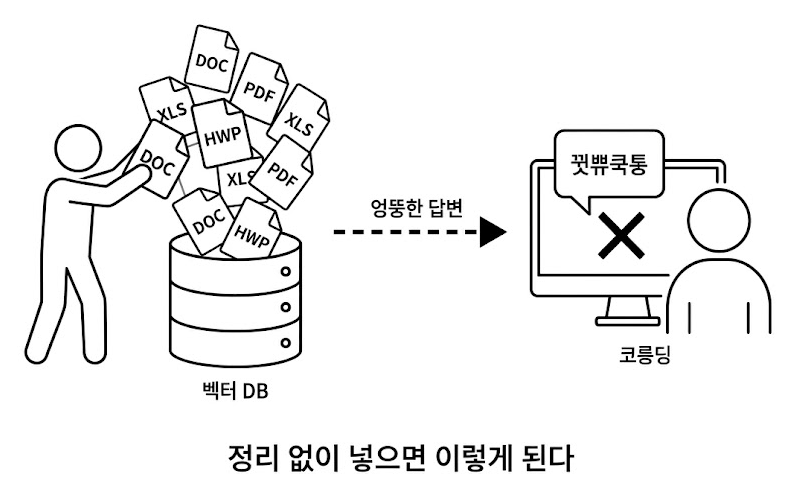

# 챕터 3. 어떤 문서를 넣을까. 문서 표준과 메타데이터

:::goal
**이번 챕터가 끝나면**

- 왜 **문서 전처리**가 RAG 품질을 결정하는지 체감합니다 *(문서 품질 = 답변 품질)*
- **PDF, DOCX, XLSX, HWP** 네 형식의 특징과 Markdown 통일 전략을 이해합니다
- **메타데이터**, **청킹**, **재인덱싱** 기본 규칙을 머릿속에 잡아 챕터 4 구현으로 넘어갑니다
:::

:::note
**이번 챕터는 코드 실습이 없습니다.** 챕터 4에서 문서를 실제로 파싱하고 벡터 DB에 저장하기 전에, "어떤 문서를 어떤 규칙으로 넣을 것인가"를 먼저 정리합니다. 규칙 없이 바로 구현하면 검색 품질이 엉망이 됩니다.
:::

## 3.1 공유 드라이브를 전부 넣었더니


*그림 3-1. 공유 드라이브의 문서 더미. 정리 없이 이걸 전부 넣으면 어떻게 될까*

수요일 오후 3시. 사무실에 커피 머신 돌아가는 소리만 낮게 깔려 있었습니다.

챕터 1 더미 문서 3개로 RAG는 이미 잘 돌았습니다. 챕터 2 사내 시스템도 켜졌으니 이제 남은 절반. **문서 검색**을 본격으로 채워 넣을 차례였습니다.

*이건 금방이겠지.*

공유 드라이브를 열고 폴더 전체를 드래그. 300여 개 파일을 파이프라인에 그대로 밀어 넣었습니다. "긁어서 넣고, 청킹하고, 임베딩"까지 30분. 커피를 한 잔 새로 내리고 자리로 돌아왔습니다.

다음 날 아침이었습니다. 옆자리 동료가 의자를 돌려 저를 봤습니다.

**동료**: "어제 비서한테 연차 물어봤다고 했잖아요."
**동료**: "15일이라고 했다면서요. 인사팀 가니까 20일이래요. 혼났어요."

손이 키보드에서 멈췄습니다.

*...어?*

검색 로그를 열어 봤습니다. 마우스 휠을 긁는 손끝에 식은 커피잔이 닿았습니다. 답변 상단 출처. `인사규정_2022_폐기본.pdf`. 2년 전 폐기된 문서였습니다. 그 밑에 `복지정책_v1.xlsx`, `업무가이드_초안.docx` 같은 이름이 줄지어 떴습니다.

*이게… 환각보다 나쁘네.*

환각은 "모르는데 지어낸" 거라 의심이라도 하지만, 이건 **출처까지 달려 있으니 사용자가 믿어 버립니다.** 동료는 폐기본을 근거로 인사팀에 가서 혼났고, 커넥트HR 에이전트가 그 과정에 공범이 된 셈이었습니다.

업계에서 이런 상황을 한 문장으로 부릅니다. **Garbage In, Garbage Out**.

:::term-box
**Garbage In, Garbage Out (GIGO)**. "쓰레기를 넣으면 쓰레기가 나온다." 입력 데이터의 품질이 그대로 출력 품질을 결정한다는 컴퓨터 과학의 오래된 원칙입니다. 1950년대 메인프레임 시대부터 쓰인 말이고, 그대로 RAG에도 적용됩니다. 폐기본, 초안, 중복본 같은 "쓰레기"가 벡터 DB에 들어가면 아무리 뛰어난 LLM이라도 그 쓰레기를 근거로 답합니다. 튜닝, 프롬프트, 리랭커 같은 고급 기법보다 **앞에 놓이는 가장 기본적인 품질 조건입니다**.
:::

그제야 공유 드라이브를 다시 들여다봤습니다. 마우스 휠이 끝없이 내려갔습니다. `취업규칙.pdf`, `보안지침_v3_최종_진짜최종.docx`, `2024년_복지정책.xlsx`, `회의록_0301.hwp`, `프로젝트_보고서.pptx`…

*300개. 이걸 하나하나 다 열어봐야 하나?*

형식이 제각각이었습니다. PDF, DOCX, XLSX, HWP에 PPT까지. 최신본 옆에 2년 전 초안이 버젓이 섞여 있었습니다. **정리하지 않고 통째로 넣은 것**이 원인이었습니다.

## 3.2 사서처럼 정리부터

자리를 지나가던 팀장이 모니터를 흘끗 보더니 한마디 던졌습니다.

**팀장**: "도서관 가면 책 아무 데나 꽂아요?"

한마디에 머리가 맑아졌습니다. 새 책이 기증되면 사서는 바로 서가에 꽂지 않습니다.

1. **먼저 분류합니다**. 이 책이 어느 분야인지, 대여 가능한지, 최신판인지 확인합니다.
2. **라벨을 붙입니다**. 청구기호(위치), 저자, 출판년도, 키워드를 기록합니다.
3. **서가에 꽂습니다**. 분류에 맞는 위치에 넣습니다.

라벨 없이 마구잡이로 꽂으면 나중에 찾을 수 없습니다. 사내 문서도 마찬가지입니다. 벡터 DB에 넣기 전에 **분류하고 라벨을 붙이고 정리하는 단계**가 필요합니다. 이 단계를 건너뛰면 검색 품질이 엉망이 됩니다.


*그림 3-2. 사내 문서를 벡터 DB에 넣기까지. 정리 없이 넣으면 검색 품질이 떨어집니다*

## 3.3 넣을 문서와 뺄 문서

모든 문서를 넣을 필요는 없습니다. 오히려 불필요한 문서가 섞이면 검색 품질이 떨어집니다. 동료가 당한 것처럼 폐기된 규정이 검색되면 곤란합니다.

**넣어야 할 것**. 현재 유효한 규정, 정책, 가이드. 자주 질문받는 내용이 담긴 문서.

**빼야 할 것**. 폐기된 문서, 개인 메모, 초안, 중복 문서(같은 내용의 v1/v2/v3).

간단한 기준 하나면 충분합니다. **"이 문서를 신입사원에게 줘도 되나?"** 된다면 넣고, 아니라면 뺍니다.

## 3.4 형식 통일: Markdown

PDF, DOCX, XLSX, HWP는 그대로 벡터 DB에 넣을 수 없습니다. 벡터 DB는 **텍스트**만 이해하기 때문입니다.

해외 지사 보고서에 비유해 보겠습니다. 미국 지사는 영어로, 일본 지사는 일본어로, 프랑스 지사는 프랑스어로 문서를 보냈습니다. 우리 팀 누구나 검색하고 읽으려면 먼저 **한국어로 번역**해 하나의 언어로 통일해야 합니다. PDF, DOCX, XLSX도 똑같습니다. 형식이 제각각이면 벡터 DB가 읽지 못합니다. 먼저 **하나의 텍스트 형태**로 바꿔야 합니다.

이 책에서는 **Markdown**으로 통일합니다. 이유는 네 가지입니다.

- LLM이 가장 잘 이해합니다. 훈련 데이터에 Markdown이 대량 포함돼 있어 `# 제목`, `- 목록` 같은 구조를 자연스럽게 인식합니다.
- 제목이 보존됩니다. PDF의 큰 글씨, DOCX의 "제목 1" 스타일이 `# 제목`으로 바뀝니다.
- 표도 보존됩니다. 엑셀 시트가 `| 열1 | 열2 |` 형태로 변환됩니다.
- 사람도 읽을 수 있습니다. 변환 결과가 제대로인지 눈으로 바로 검증할 수 있습니다.

<div class="sp-figure">
  <div class="parser-flow">
    <div class="pf-node input">
      <strong>사내 문서</strong>
      <small>.pdf · .docx · .xlsx</small>
    </div>
    <div class="pf-arrow-h">→</div>
    <div class="pf-node decision">
      <strong>파서 선택</strong>
      <small>확장자 판정</small>
    </div>
    <div class="pf-arrow-h">→</div>
    <div class="pf-branches">
      <div class="pf-branch"><span class="pf-key">PDF</span><span class="pf-value">pypdf</span></div>
      <div class="pf-branch"><span class="pf-key">DOCX</span><span class="pf-value">python-docx</span></div>
      <div class="pf-branch"><span class="pf-key">XLSX</span><span class="pf-value">openpyxl</span></div>
    </div>
    <div class="pf-arrow-h">→</div>
    <div class="pf-node merge">
      <strong>Markdown 변환</strong>
      <small>통합 텍스트</small>
    </div>
    <div class="pf-arrow-h">→</div>
    <div class="pf-node">
      <strong>청킹</strong>
      <small>의미 단위 분할</small>
    </div>
    <div class="pf-arrow-h">→</div>
    <div class="pf-node">
      <strong>벡터 DB</strong>
      <small>ChromaDB 저장</small>
    </div>
  </div>
  <div class="caption">그림 3-3. 파서가 다양한 형식을 Markdown으로 통일한 뒤 청킹·벡터화해서 검색 가능하게 만듭니다</div>
</div>

:::tip
**반드시 Markdown일 필요는 없습니다**

일반 텍스트(plain text)나 JSON으로 변환해도 벡터 DB에 넣을 수 있습니다. 다만 Markdown은 **제목, 표, 목록 같은 문서 구조를 보존하면서도 가볍다**는 점에서 RAG 파이프라인에 가장 널리 쓰입니다.
:::

## 3.5 메타데이터 태깅

도서관에서 책에 붙이는 정보(청구기호, 저자, 분야, 출판년도)를 문서 세계에서는 **메타데이터**라 부릅니다.

왜 중요할까요? 에이전트에게 "보안 관련 규정 알려줘"라고 물었을 때 메타데이터에 `file_name: SEC_보안규정`이 있으면 보안 문서를 즉시 식별합니다. 없으면 모든 문서를 처음부터 뒤져야 합니다.

어떤 메타데이터를 붙일지는 프로젝트마다 다릅니다. 우리는 최소한으로 가져갑니다. **파서가 파일명과 경로에서 자동 추출할 수 있는 것**만 사용합니다.

| 메타데이터 | 추출 방식 | 예시 |
|-----------|----------|------|
| `file_name` | 파일에서 자동 | `HR_취업규칙_v1.0.pdf` |
| `file_type` | 확장자에서 자동 | `pdf` |
| `source_path` | 폴더 구조에서 자동 | `docs/hr/HR_취업규칙_v1.0.pdf` |
| `doc_id` | 파일명에서 자동 생성 | `hr_취업규칙_v1_0` |
| `page` | 파싱 시 자동 | `1` |

사람이 직접 입력하는 항목이 하나도 없습니다. 대신 **파일명에 정보를 담는 것**이 핵심입니다. `HR_취업규칙_v1.0.pdf`처럼 분류(HR)와 버전(v1.0)을 파일명에 넣으면 파서가 알아서 메타데이터로 만들어 줍니다.

## 3.6 청킹 전략 사전 설계

챕터 1에서 이미 경험했습니다. 문서를 통째로 넣으면 검색 정확도가 떨어집니다. 적절한 크기로 **조각(chunk)** 을 내야 합니다.

조각 크기를 어떻게 정할까요? 너무 작으면 문맥이 잘립니다. "신입사원은 3년 동안 연차가 없다" 다음 줄 "대신 리프레시 데이를 제공한다"가 있는데 잘못 자르면 앞 문장만 나옵니다. 너무 크면 챕터 1의 청킹 없는 실험처럼 관련 없는 내용이 딸려옵니다.

지금은 설계만 해 두겠습니다. 실제 구현은 챕터 4에서 진행합니다.

| 전략 | 크기 | 오버랩 | 적합한 경우 |
|------|------|--------|-----------|
| 고정 크기 | 500자 | 100자 | 규정·매뉴얼 (구조화된 문서) |
| 문단 기준 | 문단 단위 | 없음 | 보고서·회의록 (자연스러운 구분) |
| 의미 기준 | 가변 | 없음 | 긴 문서·주제 전환이 잦은 문서 |

### 오버랩이 왜 필요한가

500자마다 딱 잘라 버리면 문장이 청크 경계에서 끊깁니다. 그래서 앞뒤 청크가 일정 구간(여기선 100자) 겹치게 자릅니다. 실제 사내 규정 문장으로 어떻게 잘리는지 보겠습니다.

<div class="overlap-text-demo">
  <div class="otd-row otd-original">
    <span class="otd-label">원본</span>
    <span class="otd-text">신입사원은 첫 3년간 연차가 없습니다. 대신 매월 1회 리프레시 데이를 유급으로 제공합니다. 3년 근속 시점에 30일의 연차가 일시에 발생합니다.</span>
  </div>

  <div class="otd-arrow">↓ 청크 사이즈에 맞춰 자르되, 100자씩 겹치게</div>

  <div class="otd-row">
    <span class="otd-label c1">청크 1</span>
    <span class="otd-text">신입사원은 첫 3년간 연차가 없습니다. <mark>대신 매월 1회 리프레시 데이를 유급으로 제공합니다.</mark></span>
  </div>
  <div class="otd-row">
    <span class="otd-label c2">청크 2</span>
    <span class="otd-text"><mark>대신 매월 1회 리프레시 데이를 유급으로 제공합니다.</mark> 3년 근속 시점에 <mark>30일의 연차가 일시에 발생합니다.</mark></span>
  </div>
  <div class="otd-row">
    <span class="otd-label c3">청크 3</span>
    <span class="otd-text"><mark>30일의 연차가 일시에 발생합니다.</mark> 단, 입사 후 3년이 경과하기 전 …</span>
  </div>

  <div class="otd-note">노란색이 <b>오버랩 영역</b>입니다. 같은 문장이 양쪽 청크에 모두 들어가 있어, 어느 청크가 검색돼도 경계 문장이 살아 있습니다. 오버랩이 0이라면 "리프레시 데이…"가 어느 청크에서도 온전히 나오지 않는 상황이 생깁니다.</div>
</div>

이 책에서는 챕터 4에서 **고정 크기(500자 + 100자 오버랩)** 으로 시작하고, 챕터 8에서 의미 기준 청킹과 다른 오버랩 값을 비교 실험합니다.

## 3.7 재인덱싱 전략

사내 문서는 살아 있습니다. 취업규칙이 개정되고, 새 보안지침이 나오고, 복지정책이 바뀝니다. 벡터 DB에 한 번 넣으면 끝이 아닙니다.

재인덱싱을 안 하면 어떻게 될까요? 3.1에서 동료가 당한 일이 반복됩니다. 규정이 바뀌었는데 벡터 DB에는 옛 문서가 그대로 남아 있기 때문입니다.

재인덱싱 방식은 두 가지입니다. 그림으로 한 번 보면 차이가 선명해집니다.

<div class="reindex-compare">
  <div class="rc-card rc-full">
    <div class="rc-head">
      <span class="rc-badge rc-badge-full">전체 재인덱싱</span>
      <span class="rc-subtitle">모두 지우고 처음부터</span>
    </div>
    <div class="rc-stage">
      <div class="rc-row rc-before">
        <span class="rc-stage-label">Before</span>
        <div class="rc-docs">
          <div class="rc-doc">취업규칙 v1</div>
          <div class="rc-doc">보안지침 v2</div>
          <div class="rc-doc rc-changed">연차규정 v3 ✱</div>
          <div class="rc-doc">복지정책 v1</div>
          <div class="rc-doc">출장규정 v1</div>
        </div>
      </div>
      <div class="rc-arrow">⇣ 컬렉션 전체 삭제 후 재임베딩</div>
      <div class="rc-row rc-after">
        <span class="rc-stage-label">After</span>
        <div class="rc-docs">
          <div class="rc-doc rc-new">취업규칙 v1</div>
          <div class="rc-doc rc-new">보안지침 v2</div>
          <div class="rc-doc rc-new">연차규정 v4</div>
          <div class="rc-doc rc-new">복지정책 v1</div>
          <div class="rc-doc rc-new">출장규정 v1</div>
        </div>
      </div>
    </div>
    <ul class="rc-pros-cons">
      <li class="rc-pro">구현이 단순 (삭제 → 전부 다시 넣기)</li>
      <li class="rc-pro">일관성 100%. 누락 염려 없음</li>
      <li class="rc-con">문서가 많으면 시간, 비용 많이 듦</li>
    </ul>
  </div>

  <div class="rc-card rc-inc">
    <div class="rc-head">
      <span class="rc-badge rc-badge-inc">증분 재인덱싱</span>
      <span class="rc-subtitle">바뀐 것만 갈아끼우기</span>
    </div>
    <div class="rc-stage">
      <div class="rc-row rc-before">
        <span class="rc-stage-label">Before</span>
        <div class="rc-docs">
          <div class="rc-doc rc-keep">취업규칙 v1</div>
          <div class="rc-doc rc-keep">보안지침 v2</div>
          <div class="rc-doc rc-changed">연차규정 v3 ✱</div>
          <div class="rc-doc rc-keep">복지정책 v1</div>
          <div class="rc-doc rc-keep">출장규정 v1</div>
        </div>
      </div>
      <div class="rc-arrow">⇣ 변경된 문서만 삭제·재임베딩</div>
      <div class="rc-row rc-after">
        <span class="rc-stage-label">After</span>
        <div class="rc-docs">
          <div class="rc-doc rc-keep">취업규칙 v1</div>
          <div class="rc-doc rc-keep">보안지침 v2</div>
          <div class="rc-doc rc-new">연차규정 v4</div>
          <div class="rc-doc rc-keep">복지정책 v1</div>
          <div class="rc-doc rc-keep">출장규정 v1</div>
        </div>
      </div>
    </div>
    <ul class="rc-pros-cons">
      <li class="rc-pro">빠름. 바뀐 몇 개만 처리</li>
      <li class="rc-con">"어떤 문서가 바뀌었나" 추적 필요 (해시·타임스탬프)</li>
      <li class="rc-con">삭제된 문서가 남아 있으면 오염 가능</li>
    </ul>
  </div>
  <div class="rc-caption">그림 3-4. 별표(✱)는 개정된 문서. 전체 재인덱싱은 멀쩡한 네 개까지 지웠다가 다시 넣고, 증분 재인덱싱은 바뀐 하나만 갈아 끼웁니다</div>
</div>

이 책에서는 문서 수가 적으므로 **전체 재인덱싱**으로 충분합니다. 문서가 수천 개 이상이면 증분 방식을 고려합니다.

## 3.8 docs 폴더 구조

정리해 보겠습니다. 커넥트HR 에이전트가 먹을 문서는 다음 구조로 관리합니다.

```text data/docs/ 구조
data/docs/
├── hr/
│   ├── HR_취업규칙_v1.0.pdf
│   └── HR_정보보안서약서.pdf
├── security/
│   └── SEC_보안규정_v1.0.docx
├── finance/
│   ├── FIN_2025_상반기_매출현황.xlsx
│   └── FIN_부서별_예산기안서.xlsx
└── ops/
    └── OPS_신규서비스_런칭전략.pdf
```

별도의 메타데이터 파일은 만들지 않습니다. **폴더 구조와 파일명이 곧 메타데이터**이기 때문입니다.

## 3.9 더 알아보기

**문서 품질 체크리스트**. 벡터 DB에 넣기 전에 한 번 더 점검합니다.

1. 현재 유효한 문서인가? (폐기본, 초안이 아닌가)
2. 중복 문서가 없는가? (같은 내용의 v1/v2/v3)
3. 텍스트 추출이 가능한가? (이미지만 있는 PDF는 챕터 10에서 OCR로 처리)
4. 파일명 규칙을 지켰는가? (`분류_제목_버전.확장자`)

**한국어 청킹의 특수성**. 영어는 단어 사이에 공백이 있어 토큰 수 기반 청킹이 자연스럽습니다. 한국어는 띄어쓰기 단위가 영어보다 크고 조사가 붙어 같은 500자라도 정보 밀도가 다를 수 있습니다. 챕터 8에서 의미 기반 청킹(Semantic Chunking)과 비교 실험합니다.

**메타데이터 필터링**. 벡터DB는 저장할 때 메타데이터를 함께 넣어 두고, 검색할 때 `{"file_type": "pdf"}`처럼 필터를 걸 수 있습니다. 지금은 메타데이터를 출처 표시용으로만 쓰지만, 문서가 많아지면 필터링으로 검색 범위를 좁힐 수 있습니다. 구체적인 필터 문법은 다음 챕터에서 실제로 써 보면서 익힙니다.

## 3.10 전체 구성도에서 챕터 3의 자리

챕터 3은 코드를 한 줄도 쓰지 않았습니다. 그 대신 **문서 규칙 네 장**을 정리했습니다. 파일 포맷, 청킹 전략, 메타데이터, 재인덱싱 정책. 이 네 결정이 챕터 4 파싱·벡터화 파이프라인의 **입구**에 놓입니다.

아래 카드는 이번 챕터에서 정한 규칙을 한 장으로 묶은 룩북입니다. 챕터 4부터는 이 규칙에 맞춰 문서를 파싱·청킹해서 벡터DB에 저장합니다.

<div class="ch-slot">
  <div class="ch-name"><b>CH 03</b> · 어떤 문서를 넣을까 - 문서 전략 룩북</div>
  <div class="doc-strategy-card">
    <div class="ds-header">
      <div class="ds-sub">chapter 03</div>
      <div class="ds-title">문서 전략</div>
      <div class="ds-desc">포맷 · 청킹 · 메타데이터 · 재인덱싱 규칙</div>
    </div>
    <div class="ds-grid">
      <div class="ds-section">
        <div class="label">① 파일 포맷</div>
        <div class="h">어떤 문서를 넣을까</div>
        <ul>
          <li><code>PDF</code> - 규정집·서약서 (텍스트 추출)</li>
          <li><code>DOCX</code> - 사내 보안 규정</li>
          <li><code>XLSX</code> - 매출·예산 시트</li>
          <li>스캔본 PDF는 CH10에서 Vision 파서로</li>
        </ul>
      </div>
      <div class="ds-section">
        <div class="label">② 청킹 전략</div>
        <div class="h">어떻게 쪼갤까</div>
        <ul>
          <li><code>RecursiveCharacterTextSplitter</code></li>
          <li>chunk_size=<code>1000</code> · overlap=<code>200</code></li>
          <li>한 덩어리 한 주제가 원칙</li>
          <li>CH08에서 Semantic 청킹으로 업그레이드</li>
        </ul>
      </div>
      <div class="ds-section">
        <div class="label">③ 메타데이터</div>
        <div class="h">청크에 무엇을 달까</div>
        <ul>
          <li><code>source</code> - 원본 파일명</li>
          <li><code>section</code> - 조항·절 번호</li>
          <li><code>page</code> - 페이지 번호</li>
          <li><code>version</code> - 문서 버전</li>
        </ul>
      </div>
      <div class="ds-section">
        <div class="label">④ 재인덱싱 정책</div>
        <div class="h">언제 다시 넣을까</div>
        <ul>
          <li>전체 재인덱싱: 포맷·청킹 규칙 변경 시</li>
          <li>증분: 파일 하나만 바뀐 경우</li>
          <li><code>source</code> 해시로 변경 감지</li>
          <li>버전 충돌은 version 메타로 선별</li>
        </ul>
      </div>
    </div>
    <div class="ds-footer">
      이 규칙들은 <b>CH04 임베딩·ChromaDB 저장</b>과 <b>CH05 RAG 체인</b>에서 실제 코드로 구현됩니다.
    </div>
  </div>
  <div class="ch-note">arch11 박스 없음 · CH03은 <b>규칙을 세우는 챕터</b>, 박스가 생기는 건 CH04부터</div>
</div>

*그림 3-4. 챕터 3의 결과. 코드 대신 네 가지 문서 규칙(포맷·청킹·메타데이터·재인덱싱)을 정리했습니다*

## 용어 정리

| 본문 속 표현 | 진짜 용어 | 정식 정의 |
|-------------|---------|----------|
| "같은 말로 번역" | **파싱 (Parsing)** | 다양한 형식(PDF·DOCX·XLSX)에서 텍스트를 추출해 통일된 형태로 변환하는 과정 |
| "도서관 분류 라벨" | **메타데이터 (Metadata)** | 문서 내용이 아닌, 문서에 대한 정보 (파일명·형식·경로 등) |
| "문서 조각내기" | **청킹 (Chunking)** | 긴 문서를 벡터 DB에 저장할 수 있는 크기로 분할하는 과정 |
| "조각이 겹치는 부분" | **오버랩 (Overlap)** | 청크 경계에서 문맥이 잘리지 않도록 앞뒤를 겹치게 자르는 기법 |
| "문서 다시 넣기" | **재인덱싱 (Re-indexing)** | 변경되거나 추가된 문서를 벡터 DB에 반영하는 과정 |
| "쓰레기 넣으면 쓰레기" | **GIGO (Garbage In, Garbage Out)** | 입력 데이터 품질이 출력 품질을 결정한다는 원칙 |
:::remember
**이것만은 기억하자**

- **좋은 답을 원하면 좋은 문서를 넣어야 합니다.** 쓰레기를 넣으면 쓰레기가 나옵니다. 현행 문서만 선별하고 폐기본, 초안, 중복본은 제외합니다.
- **PDF, DOCX, XLSX는 먼저 Markdown으로 통일합니다.** 형식이 다르면 청킹도 검색도 불가능합니다. 제목, 표 구조가 보존되는 Markdown이 RAG에 가장 잘 맞습니다.
- **폴더 구조와 파일명이 곧 메타데이터입니다.** `분류_제목_버전` 규칙만 지키면 파서가 자동으로 메타데이터를 뽑아 냅니다. 다음 챕터에서 이 규칙을 실제 파서로 구현합니다.
:::
