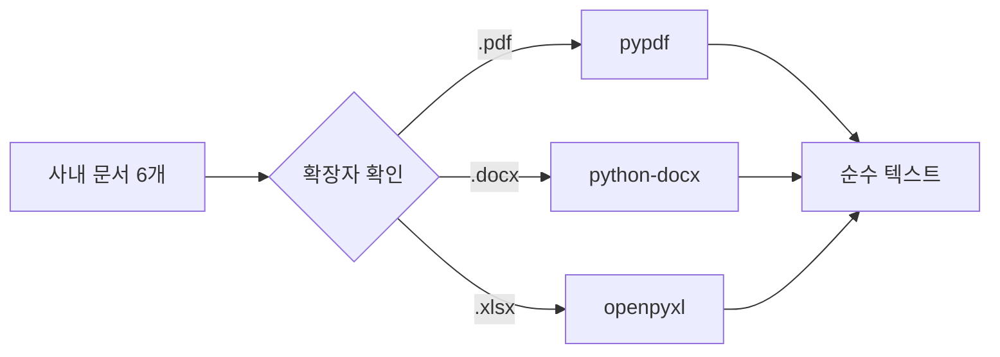

# Ch.4: "문서를 '지식'으로 바꾸다" — VectorDB 구축 (v0.4)

> 이번 버전: v0.4 → v0.4
> 한 줄 요약: 문서는 조각내야 찾는다. 손질(파싱), 다지기(청킹), 양념(임베딩), 냉장고(벡터DB).
> 핵심 개념: 문서 파싱, 청킹, 임베딩, 벡터 저장/검색, 임베딩 모델 선택 기준

---

## 이야기 파트

<!-- [GEMINI PROMPT: 04_chapter-opening]
path: assets/CH04/04_chapter-opening.png
A minimalist black and white technical diagram with a strict 16:9 aspect ratio
on a solid white background. No shading, no 3D effects, only clean thin line art.
The entire assembly of icons, lines, and text is perfectly centered globally
within the 16:9 frame, leaving generous and equal white space on all sides.

Center: a minimalist line-art person icon wearing an apron, standing between
a cutting board with neatly stacked documents on the left
and a large refrigerator icon labeled '벡터 DB' on the right.
The person holds a kitchen knife in one hand and a document page in the other.
Above the person: a thought bubble containing '어떻게 넣지?'.
Style: scene-opener
-->


### "정리는 했는데, 어떻게 넣지?"

CH03에서 사내 문서를 정리했다. 분류도 했고, 메타데이터 라벨도 붙였다. 이제 이 문서들을 벡터 DB에 넣어서 AI 비서가 검색할 수 있게 만들 차례다.

그런데 문서를 그냥 통째로 넣으면 될까? CH01에서 이미 경험했다. 더미 문서 3개는 괜찮았다. 하지만 실제 사내 문서는 다르다. 취업규칙만 해도 수십 페이지다. 이걸 통째로 넣으면 "연차 몇 일이야?"라고 물었을 때, 보안규정이랑 매출 현황까지 딸려온다.

문서를 **검색 가능한 지식**으로 바꾸려면, 몇 단계를 거쳐야 한다.

---

### 요리를 떠올려보자

냉장고에 식재료를 넣는 걸 생각해보자.

마트에서 사온 재료를 봉지째로 냉장고에 던져 넣으면 어떻게 될까? 나중에 찾을 수가 없다. 양파가 어디 있는지, 고기는 아직 쓸 수 있는지, 뒤져봐야 안다.

제대로 하려면 이런 과정을 거친다.

1. **손질한다** — 흙을 씻고, 껍질을 벗기고, 뼈를 발라낸다. 먹을 수 없는 부분을 제거한다.
2. **다진다** — 요리에 맞게 적당한 크기로 자른다. 너무 크면 익지 않고, 너무 작으면 형체가 없어진다.
3. **양념한다** — 소금에 절이거나 밑간을 한다. 나중에 바로 쓸 수 있게 맛을 입힌다.
4. **냉장고에 정리한다** — 라벨을 붙이고, 구분해서 넣는다. "닭가슴살 — 3월 5일 — 볶음용"

사내 문서도 똑같다.

| 요리 과정 | 문서 처리 | 무슨 일이 벌어지나 |
|----------|----------|--------------|
| 손질 | **파싱** (Parsing) | PDF/DOCX/XLSX에서 텍스트를 꺼낸다 |
| 다지기 | **청킹** (Chunking) | 텍스트를 적당한 크기로 조각낸다 |
| 양념 | **임베딩** (Embedding) | 텍스트 조각을 숫자 벡터로 변환한다 |
| 냉장고 정리 | **벡터 DB 저장** | 벡터를 ChromaDB에 넣고 검색 가능하게 한다 |

<!-- [GEMINI PROMPT: 04_vectordb-pipeline]
path: assets/CH04/04_vectordb-pipeline.png
A minimalist black and white technical diagram with a strict 16:9 aspect ratio
on a solid white background. No shading, no 3D effects, only clean thin line art.
The entire assembly of icons, lines, and text is perfectly centered globally
within the 16:9 frame, leaving generous and equal white space on all sides.

Four steps from left to right, connected by arrows:
Step 1 labeled '손질(파싱)': a minimalist line-art grocery bag icon with
document icons (PDF/DOCX/XLSX) being cleaned with a knife.
Step 2 labeled '다지기(청킹)': a minimalist line-art cutting board
with text blocks being sliced into small even pieces.
Step 3 labeled '양념(임베딩)': small text pieces being sprinkled with
numbers [0.12, -0.34, ...] from a minimalist spice shaker icon.
Step 4 labeled '냉장고(벡터 DB)': a minimalist line-art refrigerator
with neatly labeled containers inside.
Style: step-by-step-infographic
-->

*그림 4-1: 문서를 벡터 DB에 넣는 과정은 요리의 손질 → 다지기 → 양념 → 냉장고 정리와 같다.*

---

### 1단계: 손질 — 문서에서 텍스트 꺼내기 (파싱)

PDF 파일을 열어보자. 사람 눈에는 글자가 보이지만, 컴퓨터 입장에서는 그냥 바이너리 데이터다. "취업규칙 제1조"라는 텍스트를 꺼내려면 **파서(Parser)** 가 필요하다.

문제는 형식마다 파서가 다르다는 것이다. PDF는 PDF 파서가, DOCX는 DOCX 파서가, XLSX는 XLSX 파서가 필요하다. CH03에서 허용한 형식을 기억하는가?

| 형식 | 파서 라이브러리 | 특징 |
|------|-------------|------|
| PDF | pypdf | 텍스트 기반 PDF에서 페이지별 텍스트 추출 |
| DOCX | python-docx | 단락(Paragraph)과 표(Table) 추출, 제목을 마크다운으로 변환 |
| XLSX | openpyxl | 시트별 셀 데이터를 행 단위로 읽기 |

그런데 모든 PDF가 잘 읽히는 건 아니다. **이미지로 된 PDF** — 스캔한 문서나 캡처 화면 — 는 텍스트가 아예 추출되지 않는다. 이 문제는 CH10에서 OCR과 Vision LLM으로 해결한다. 지금은 텍스트 기반 문서만 다룬다.


*그림 4-2: 파일 확장자에 따라 적절한 파서를 선택한다. 통합 함수 하나로 자동 분기.*

실제 우리 프로젝트의 `data/docs/` 폴더에는 6개 문서가 있다.

```
data/docs/
├── hr/
│   ├── HR_취업규칙_v1.0.pdf
│   └── HR_정보보안서약서.pdf
├── security/
│   └── SEC_보안규정_v1.0.docx
├── finance/
│   ├── FIN_2025_상반기_매출현황.xlsx
│   └── FIN_부서별_예산기안서.xlsx
└── ops/
    └── OPS_신규서비스_런칭전략.pdf
```

CH03에서 설계한 분류 구조 그대로다. 이 6개 문서를 파싱하면 순수 텍스트가 추출된다.

---

### 2단계: 다지기 — 적당한 크기로 자르기 (청킹)

텍스트를 꺼냈다. 그런데 취업규칙 전문이 한 덩어리로 들어가면 안 된다. CH01에서 경험한 그 문제다 — 문서가 너무 크면 관련 없는 내용까지 딸려온다.

요리에서 재료를 다지는 것처럼, 텍스트를 **적당한 크기의 조각(chunk)** 으로 잘라야 한다.

CH03에서 설계한 대로, **고정 크기 500자 + 100자 오버랩**으로 간다.

왜 오버랩이 필요할까? "신입사원은 첫 3년간 연차가 없다" 다음에 "대신 리프레시 데이를 제공한다"가 이어지는데, 정확히 500자에서 잘리면 "연차가 없다"만 남고 뒤의 대안 정보가 사라진다. 오버랩 100자가 이 문제를 줄여준다.

```
원본 텍스트: [───────────────────────────────────────────────────]

청크 1:     [──────── 500자 ────────]
청크 2:                     [──────── 500자 ────────]
청크 3:                                     [──────── 500자 ────────]
                            ↑ 100자 겹침 ↑  ↑ 100자 겹침 ↑
```

각 조각에는 **메타데이터**도 함께 붙는다. 출처 파일명, 페이지 번호, 분류 — CH03에서 설계한 라벨이 여기서 쓰인다. 나중에 AI 비서가 "이 답변의 출처는 취업규칙 3페이지입니다"라고 말할 수 있게.

---

### 3단계: 양념 — 의미를 숫자로 바꾸기 (임베딩)

여기가 마법이 일어나는 곳이다.

"연차 사용 규정"이라는 텍스트를 컴퓨터가 이해할 수 있을까? 컴퓨터는 글자를 모른다. 숫자만 안다.

**임베딩(Embedding)** 은 텍스트의 **의미**를 숫자 벡터(768개의 숫자 리스트)로 바꾸는 과정이다. 중요한 건, 단순히 글자를 숫자로 바꾸는 게 아니라 **의미가 비슷한 텍스트는 비슷한 숫자**가 된다는 것이다.

"연차 사용 규정" → [0.12, -0.34, 0.87, ...]
"휴가 관련 정책" → [0.11, -0.33, 0.85, ...]  ← 비슷!
"매출 현황 보고서" → [-0.45, 0.22, -0.11, ...] ← 완전 다름

<!-- [GEMINI PROMPT: 04_embedding-concept]
path: assets/CH04/04_embedding-concept.png
A minimalist black and white technical diagram with a strict 16:9 aspect ratio
on a solid white background. No shading, no 3D effects, only clean thin line art.
The entire assembly of icons, lines, and text is perfectly centered globally
within the 16:9 frame, leaving generous and equal white space on all sides.

A 2D coordinate plane (x-y axes) with scattered dots representing text chunks.
Top-left cluster: three dots close together labeled '연차 사용 규정',
'휴가 관련 정책', '연차유급휴가 제5조' — grouped inside a dashed circle
labeled '의미가 비슷한 문서'.
Bottom-right: an isolated dot labeled '매출 현황 보고서' — far from the cluster.
A dotted arrow from a minimalist search icon labeled '검색: 연차' points
toward the top-left cluster.
Style: concept-diagram
-->

*그림 4-3: 임베딩은 의미가 비슷한 텍스트를 가까운 좌표에 배치한다. "연차"를 검색하면 의미상 가까운 문서들이 먼저 발견된다.*

이것이 벡터 검색의 핵심이다. "연차 사용 규정"을 검색하면, 숫자가 비슷한 "휴가 관련 정책" 청크를 찾아올 수 있다. 키워드가 정확히 일치하지 않아도.

#### 왜 ko-sroberta-multitask인가?

임베딩 모델은 여러 가지가 있다. OpenAI의 text-embedding-ada-002도 있고, 다국어 모델도 있다. 우리는 **ko-sroberta-multitask**를 선택했다.

이유는 간단하다.

1. **한국어에 특화됐다** — 한국어 문장 유사도 태스크로 파인튜닝된 모델이다. "연차"와 "휴가"가 의미상 가깝다는 걸 잘 잡아낸다.
2. **로컬에서 돌릴 수 있다** — OpenAI 임베딩은 API 호출마다 비용이 든다. ko-sroberta는 한 번 다운로드하면 로컬에서 무료로 쓸 수 있다.
3. **사내 문서에 적합하다** — 사내 정보를 외부 API에 보내지 않아도 된다. 보안 관점에서도 안전하다.

> CH08(검색 품질 튜닝)에서 다른 임베딩 모델과 비교 실험을 해본다. 지금은 ko-sroberta로 시작하고, 나중에 더 나은 선택지가 있는지 확인한다.

---

### 4단계: 냉장고 정리 — 벡터 DB에 저장

양념까지 끝난 재료를 냉장고에 정리한다. 라벨 붙이고, 구분해서, 나중에 바로 꺼낼 수 있게.

**ChromaDB**가 우리의 냉장고다. CH01에서 이미 써봤지만, 그때는 LangChain이 알아서 해줬다. 이번에는 직접 넣는다.

ChromaDB에 저장하는 건 이 네 가지다:

| 저장 항목 | 내용 | 예시 |
|----------|------|------|
| id | 청크 고유 ID | `hr_취업규칙_v1_0_text_p001_c0003` |
| document | 청크 텍스트 원문 | "제5조 연차유급휴가는..." |
| embedding | 768차원 벡터 | [0.12, -0.34, ...] |
| metadata | 출처 정보 | {file_name: "HR_취업규칙_v1.0.pdf", page: 3} |

저장할 때 **upsert**를 사용한다. 같은 ID가 이미 있으면 덮어쓰기, 없으면 새로 추가. 덕분에 파이프라인을 여러 번 실행해도 데이터가 중복되지 않는다. CH03에서 설계한 **전체 재인덱싱** 전략과 맞닿는 부분이다.

---

### 파이프라인을 돌려보자

손질(파싱) → 다지기(청킹) → 양념(임베딩) → 냉장고 정리(벡터 DB 저장). 네 단계를 알았으니, 이제 직접 돌려볼 차례다. `python src/main.py` 한 줄이면 이 과정이 한 번에 일어난다.

```
🚀 Q/A 사내 AI VectorDB 구축 파이프라인

📝 Step 1: Python 파싱 — 형식별 텍스트 추출
  📁 문서 디렉토리: data/docs/
  총 6개 문서를 발견했습니다.
    📄 HR_취업규칙_v1.0.pdf: 5페이지, 3,240자
    📄 HR_정보보안서약서.pdf: 2페이지, 1,120자
    📄 SEC_보안규정_v1.0.docx: 1페이지, 2,850자
    📄 FIN_2025_상반기_매출현황.xlsx: 1시트, 680자
    📄 FIN_부서별_예산기안서.xlsx: 2시트, 1,430자
    📄 OPS_신규서비스_런칭전략.pdf: 3페이지, 2,180자

✂️  Step 2: 청킹 + 임베딩 + ChromaDB 저장
  📐 청크 크기: 500자, 오버랩: 100자
  🧮 임베딩 모델: ko-sroberta-multitask
  전체 청크 수: 34개
  ChromaDB 저장 완료! (컬렉션 총 문서 수: 34)
```

<!-- [CAPTURE NEEDED: 04_pipeline-result
  path: assets/CH04/04_pipeline-result.png
  desc: `python src/main.py` 실행 결과 터미널 스크린샷. 6개 문서 파싱 → 34개 청크 생성 → ChromaDB 저장 완료까지 전체 출력.
] -->

*그림 4-4: 6개 사내 문서가 34개 청크로 변환되어 벡터 DB에 저장됐다.*

6개 문서가 34개 청크로 변환되어 벡터 DB에 들어갔다. 냉장고에 재료를 넣었으니, 이제 꺼내볼 차례다. "연차 사용 규정"이라고 물어보면, 34개 청크 중에서 가장 가까운 걸 찾아올까?

---

### 검색해보자 — "연차 사용 규정"

프로젝트에 포함된 CLI 검색 도구(`cli_search.py`)로 직접 확인해 보자.

```bash
python src/cli_search.py --query "연차 사용 규정" --top-k 3
```

실행하면 이런 결과가 나온다.

```
🔍 검색 쿼리: 연차 사용 규정
📊 상위 3개 결과를 검색합니다

🥇  🟢 유사도 87.3%  ████████████████░░░░
📄  출처: HR_취업규칙_v1.0.pdf  |  페이지: 3
  제5조 연차유급휴가는 근로기준법에 따라 부여하며...

🥈  🟢 유사도 82.1%  ████████████████░░░░
📄  출처: HR_취업규칙_v1.0.pdf  |  페이지: 4
  연차휴가는 1년간 80% 이상 출근한 직원에게...

🥉  🟡 유사도 71.5%  ██████████████░░░░░░
📄  출처: SEC_보안규정_v1.0.docx  |  페이지: 1
  제12조 휴가 중 보안장비 관리 규정...
```

<!-- [CAPTURE NEEDED: 04_cli-search
  path: assets/CH04/04_cli-search.png
  desc: `python src/cli_search.py --query "연차 사용 규정" --top-k 3` 실행 결과. 유사도 점수 + 프로그레스 바 + 출처 표시 포함.
] -->

*그림 4-5: "연차 사용 규정"을 검색하자 취업규칙에서 관련 내용을 정확히 찾아냈다.*

1, 2위는 취업규칙에서 연차 관련 내용을 정확히 찾아왔다. 3위는 보안규정의 "휴가 중 보안장비 관리"인데 — "휴가"라는 비슷한 의미 때문에 딸려왔다. 키워드 "연차"가 없는데도 의미상 연관된 문서를 찾아내는 게 벡터 검색의 힘이다.

---

## 기술 파트

### 용어 정리

| 이야기 속 표현 | 진짜 용어 | 정식 정의 |
|------------|----------|---------|
| "손질" | 파싱 (Parsing) | 파일 형식(PDF/DOCX/XLSX)에서 순수 텍스트를 추출하는 과정 |
| "다지기" | 청킹 (Chunking) | 긴 텍스트를 벡터 DB에 적합한 크기로 분할하는 과정. 고정 크기 500자 + 100자 오버랩 |
| "양념" | 임베딩 (Embedding) | 텍스트의 의미를 768차원 숫자 벡터로 변환하는 과정 |
| "냉장고" | 벡터 DB (Vector Database) | 벡터를 저장하고, 유사한 벡터를 빠르게 검색하는 특수 데이터베이스 |
| "의미가 비슷한 숫자" | 코사인 유사도 (Cosine Similarity) | 두 벡터 사이의 각도로 유사도를 측정. 1에 가까울수록 유사 |
| "덮어쓰기" | 업서트 (Upsert) | 같은 ID가 있으면 업데이트, 없으면 삽입하는 연산 |

---

### 실습 환경 구축

> 기본 환경(Python, Ollama, Docker)이 없다면 **부록(환경 설정)** 을 먼저 참조하세요.

**v0.4 패키지 설치:**

```bash
cd v0.4
cp .env.example .env
pip install -r requirements.txt
```

| 패키지 | 버전 | 역할 |
|--------|------|------|
| pypdf | 4.3.1 | PDF 텍스트 추출 |
| python-docx | 1.1.2 | DOCX 단락/표 추출 |
| openpyxl | 3.1.5 | XLSX 셀 데이터 추출 |
| sentence-transformers | 3.3.1 | ko-sroberta 임베딩 모델 |
| chromadb | 1.5.1 | 벡터 DB (로컬 영속) |
| python-dotenv | 1.0.1 | 환경 변수 관리 |
| tqdm | 4.67.1 | 진행률 표시 바 |

> ko-sroberta-multitask 모델은 최초 실행 시 HuggingFace에서 자동 다운로드됩니다 (약 400MB). 이후에는 로컬 캐시를 사용합니다.

---

### 파일 계층 구조

```
v0.4/
├── requirements.txt
├── data/
│   ├── docs/                    ← 사내 문서 원본
│   │   ├── hr/                  (PDF 2개)
│   │   ├── security/            (DOCX 1개)
│   │   ├── finance/             (XLSX 2개)
│   │   └── ops/                 (PDF 1개)
│   ├── markdown/                ← 파싱 결과 (마크다운 변환)
│   └── chroma_db/               ← ChromaDB 영속 저장소
└── src/
    ├── extractor.py    [설명] 형식별 텍스트 추출 통합 모듈
    ├── chunker.py      [설명] Fixed-size 청킹 + 메타데이터 부착
    ├── store.py        [설명] ko-sroberta 임베딩 + ChromaDB 저장/검색
    ├── main.py         [설명] 파이프라인 오케스트레이터
    ├── cli_search.py   [실습] 벡터 검색 CLI 검증 도구  ◀ 직접 실행해 보세요!
    ├── extract_pdf.py  [참고] PDF 파싱 → Markdown 변환
    ├── extract_docx.py [참고] DOCX 파싱 → Markdown 변환
    └── extract_xlsx.py [참고] XLSX 파싱 → Markdown 변환
```

---

### [설명] extractor.py — 형식별 텍스트 추출

파일 확장자를 보고 적절한 파서를 자동 선택하는 통합 모듈이다.

핵심은 `extract_text()` 함수다. 확장자 → 파서 함수 매핑 딕셔너리를 사용한다.

```python
# extractor.py — 핵심 구조

def extract_text(file_path: str | Path) -> dict:
    """파일 형식을 자동 감지하여 텍스트를 추출하는 통합 함수."""
    file_path = Path(file_path)
    suffix = file_path.suffix.lower()

    extractor_map = {
        ".pdf": extract_from_pdf,
        ".docx": extract_from_docx,
        ".xlsx": extract_from_xlsx,
    }

    if suffix not in extractor_map:
        raise ValueError(f"지원하지 않는 파일 형식입니다: '{suffix}'")

    return extractor_map[suffix](file_path)
```

**패턴: 전략 패턴(Strategy Pattern)**
`extractor_map` 딕셔너리가 확장자별로 다른 함수를 선택한다. if-elif-else 분기 대신 딕셔너리 매핑을 사용하면, 새 형식을 추가할 때 한 줄만 추가하면 된다.

**PDF 추출 — `extract_from_pdf()`**

```python
def extract_from_pdf(file_path: str | Path) -> dict:
    """PDF 파일에서 텍스트를 페이지별로 추출합니다."""
    file_path = Path(file_path)
    pages_data = []

    with open(file_path, "rb") as f:
        reader = pypdf.PdfReader(f)
        for page_num, page in enumerate(reader.pages, start=1):
            page_text = page.extract_text() or ""
            pages_data.append({"page": page_num, "text": page_text.strip()})

    full_text = "\n\n".join(p["text"] for p in pages_data if p["text"])

    return {
        "source_path": str(file_path.resolve()),
        "file_name": file_path.name,
        "file_type": "pdf",
        "pages": pages_data,
        "full_text": full_text,
    }
```

`pypdf.PdfReader`로 페이지를 순회하며 텍스트를 추출한다. `extract_text()`가 `None`을 반환할 수 있어서 `or ""`로 방어한다. 이미지 기반 PDF에서 텍스트가 빈 문자열로 나오는 이유다.

**DOCX 추출 — `extract_from_docx()`**

```python
def extract_from_docx(file_path: str | Path) -> dict:
    """DOCX 파일에서 단락과 표의 텍스트를 추출합니다."""
    doc = Document(str(file_path))
    text_parts = []

    # 단락 추출: 제목 스타일은 마크다운 헤더로 변환
    for para in doc.paragraphs:
        text = para.text.strip()
        if not text:
            continue
        style_name = para.style.name
        if style_name.startswith("Heading"):
            level_str = style_name.replace("Heading", "").strip()
            level = int(level_str) if level_str.isdigit() else 2
            text_parts.append(f"{'#' * level} {text}")
        else:
            text_parts.append(text)

    # 표 추출: 마크다운 표로 변환
    for table in doc.tables:
        for i, row in enumerate(table.rows):
            row_data = [cell.text.strip() for cell in row.cells]
            text_parts.append("| " + " | ".join(row_data) + " |")
            if i == 0:
                text_parts.append("| " + " | ".join(["---"] * len(row_data)) + " |")

    return {"file_name": file_path.name, "file_type": "docx",
            "pages": [{"page": 1, "text": "\n".join(text_parts)}],
            "full_text": "\n".join(text_parts), ...}
```

DOCX는 페이지 개념이 없다. 단락(Paragraph) 단위로 읽는다. 특이한 점은 **Heading 스타일을 마크다운 헤더(#, ##)로 변환**한다는 것이다. 나중에 청킹할 때 구조 정보가 보존된다.

**반환 구조** — 세 파서 모두 같은 형태의 딕셔너리를 반환한다:

```python
{
    "source_path": "절대 경로",
    "file_name": "파일명",
    "file_type": "pdf | docx | xlsx",
    "pages": [{"page": 번호, "text": "텍스트"}, ...],
    "full_text": "전체 텍스트"
}
```

---

### [설명] chunker.py — Fixed-size 청킹 + 메타데이터

추출된 텍스트를 500자 단위로 자르고, 각 조각에 메타데이터를 붙인다.

**핵심 함수: `split_text_into_chunks()`**

```python
# chunker.py — 텍스트 분할

DEFAULT_CHUNK_SIZE = 500
DEFAULT_OVERLAP = 100

def split_text_into_chunks(
    text: str,
    chunk_size: int = DEFAULT_CHUNK_SIZE,
    overlap: int = DEFAULT_OVERLAP,
) -> list[str]:
    """텍스트를 Fixed-size 방식으로 청크 리스트로 분할합니다."""
    text = text.strip()
    if not text:
        return []

    chunks = []
    step = chunk_size - overlap  # 400자씩 이동
    start = 0

    while start < len(text):
        end = start + chunk_size
        chunk = text[start:end].strip()
        if chunk:
            chunks.append(chunk)
        start += step

    return chunks
```

`step = chunk_size - overlap`이 핵심이다. 500자 청크에서 100자 오버랩이면, 다음 청크는 400자 뒤에서 시작한다. 이전 청크의 마지막 100자가 다음 청크의 처음 100자와 겹친다.

**메타데이터 부착: `build_text_chunk()`**

```python
def build_text_chunk(chunk_text, doc_id, file_name, file_type,
                     source_path, page, chunk_index, ...) -> dict:
    """텍스트 청크와 메타데이터를 결합합니다."""
    chunk_id = f"{doc_id}_text_p{page:03d}_c{chunk_index:04d}"

    return {
        "id": chunk_id,
        "text": chunk_text,
        "metadata": {
            "doc_id": doc_id,
            "file_name": file_name,
            "file_type": file_type,
            "source_path": source_path,
            "page": page,
            "chunk_index": chunk_index,
            "chunk_type": "text",
        },
        "chunk_type": "text",
    }
```

청크 ID는 `문서ID_text_p페이지_c순번` 형식이다. 예: `hr_취업규칙_v1_0_text_p003_c0005`. 이 ID가 ChromaDB에서 upsert할 때 키가 된다.

---

### [설명] store.py — 임베딩 + ChromaDB 저장/검색

이 모듈이 "양념 + 냉장고 정리"를 담당한다.

**임베딩 모델 로드:**

```python
# store.py — 임베딩 모델

DEFAULT_EMBEDDING_MODEL = "jhgan/ko-sroberta-multitask"

def load_embedding_model(model_name=DEFAULT_EMBEDDING_MODEL):
    """ko-sroberta-multitask 임베딩 모델을 로드합니다."""
    model = SentenceTransformer(model_name)
    print(f"임베딩 모델 로드 완료 (벡터 차원: {model.get_sentence_embedding_dimension()})")
    return model
```

`SentenceTransformer`가 HuggingFace에서 모델을 가져온다. 최초 실행 시 약 400MB를 다운로드하고, 이후에는 `~/.cache/huggingface/`의 캐시를 재사용한다.

**배치 임베딩:**

```python
BATCH_SIZE = 64

def embed_chunks(chunks, model):
    """청크 리스트를 배치 단위로 임베딩합니다."""
    ids = [c["id"] for c in chunks]
    documents = [c["text"] for c in chunks]

    # 메타데이터 정제 (None → "", bool → str)
    metadatas = []
    for c in chunks:
        meta = {}
        for k, v in c["metadata"].items():
            if v is None:
                meta[k] = ""
            elif isinstance(v, bool):
                meta[k] = str(v)
            else:
                meta[k] = v
        metadatas.append(meta)

    # 배치 단위 임베딩
    all_embeddings = []
    for batch_start in range(0, len(documents), BATCH_SIZE):
        batch_texts = documents[batch_start : batch_start + BATCH_SIZE]
        batch_embeddings = model.encode(
            batch_texts, show_progress_bar=False, normalize_embeddings=True
        )
        all_embeddings.extend(batch_embeddings.tolist())

    return ids, documents, all_embeddings, metadatas
```

여기서 주의할 점 두 가지:

1. **메타데이터 정제** — ChromaDB는 메타데이터에 `None`이나 `bool`을 허용하지 않는다. `None` → 빈 문자열, `bool` → 문자열로 변환해야 한다. 이걸 빠뜨리면 저장 시 에러가 난다.
2. **`normalize_embeddings=True`** — 벡터를 단위 벡터로 정규화한다. 코사인 유사도 계산에 필요하다.

**ChromaDB 저장:**

```python
def store_chunks_to_chroma(chunks, chroma_dir, collection_name, ...):
    """청크를 임베딩하여 ChromaDB에 저장합니다."""
    # 1. 임베딩 모델 로드
    model = load_embedding_model(embedding_model_name)

    # 2. ChromaDB 초기화
    client = chromadb.PersistentClient(
        path=chroma_dir,
        settings=Settings(anonymized_telemetry=False),
    )
    collection = client.get_or_create_collection(
        name=collection_name,
        metadata={"hnsw:space": "cosine"},  # 코사인 유사도
    )

    # 3. 임베딩 계산
    ids, documents, embeddings, metadatas = embed_chunks(chunks, model)

    # 4. 배치 업서트
    for batch_start in range(0, len(ids), BATCH_SIZE):
        batch_end = batch_start + BATCH_SIZE
        collection.upsert(
            ids=ids[batch_start:batch_end],
            documents=documents[batch_start:batch_end],
            embeddings=embeddings[batch_start:batch_end],
            metadatas=metadatas[batch_start:batch_end],
        )
```

`PersistentClient`가 핵심이다. 메모리가 아닌 디스크(`data/chroma_db/`)에 저장하므로, 프로그램을 종료해도 데이터가 남아있다. `hnsw:space: "cosine"`으로 코사인 유사도를 사용한다.

---

### [설명] main.py — 파이프라인 오케스트레이터

`main.py`는 위의 세 모듈(extractor → chunker → store)을 순서대로 연결한다.

```python
# main.py — 2단계 파이프라인

def main():
    args = parse_arguments()

    # Step 1: 문서 파싱
    python_results = step1_python_parsing(docs_dir=args.docs_dir)

    # Step 2: 청킹 + 임베딩 + 저장
    step2_embed_and_store(
        python_results=python_results,
        chroma_dir=args.chroma_dir,
        collection_name=args.collection,
        embedding_model_name=args.embedding_model,
    )
```

`argparse`로 문서 디렉토리, ChromaDB 경로, 임베딩 모델 등을 변경할 수 있다. 기본값만으로도 동작한다.

```bash
# 전체 파이프라인 실행
python src/main.py

# Step 1(파싱)만 테스트
python src/main.py --step 1

# 커스텀 설정
python src/main.py --chunk-size 300 --overlap 50
```

---

### [실습] cli_search.py — 벡터 검색 CLI 도구

저장된 벡터 DB에서 검색 결과를 확인하는 도구다. 유사도를 백분율과 프로그레스 바로 표시한다.

```python
# cli_search.py — 유사도 표시

def format_distance_as_similarity(distance: float) -> float:
    """코사인 거리를 백분율 유사도로 변환합니다."""
    return max(0.0, (1.0 - distance / 2.0)) * 100
```

ChromaDB는 코사인 **거리**(0~2)를 반환하므로, 직관적인 **유사도**(0~100%)로 변환한다. 거리가 0이면 유사도 100%, 거리가 2이면 유사도 0%.

```bash
# 단일 쿼리
python src/cli_search.py --query "연차 사용 규정" --top-k 3

# 대화형 모드 (반복 검색)
python src/cli_search.py
```

---

### 더 알아보기

**이미지 캡션 청킹** — `chunker.py`에는 `build_image_caption_chunk()` 함수가 있다. 문서에 포함된 이미지/표/차트의 설명을 별도 청크로 저장하는 기능이다. CH10에서 Vision LLM이 이미지를 설명하면, 그 캡션이 이 함수를 통해 벡터 DB에 들어간다. 이미지를 직접 벡터화하는 것이 아니라, **이미지의 설명 텍스트를 벡터화**하는 방식이다.

**마크다운 변환** — `extract_pdf.py`, `extract_docx.py`, `extract_xlsx.py`는 파싱 결과를 `data/markdown/`에 저장하는 유틸리티다. 사람이 파싱 결과를 눈으로 확인할 때 쓴다. 벡터 DB 파이프라인 자체에는 필요 없다.

**배치 크기 튜닝** — `BATCH_SIZE = 64`가 기본값이다. GPU 메모리가 부족하면 줄이고, 충분하면 늘릴 수 있다. ko-sroberta는 CPU에서도 동작하지만 GPU가 있으면 임베딩 속도가 크게 빨라진다.

---

### 이것만은 기억하자

- **문서는 조각내야 찾는다.** 손질(파싱) → 다지기(청킹) → 양념(임베딩) → 냉장고 정리(벡터 DB). 이 네 단계가 RAG의 기초 체력이다.
- **임베딩은 "의미를 숫자로 바꾸는 것"이다.** 키워드가 달라도 의미가 비슷하면 가까운 벡터가 된다.
- 다음 챕터에서는 이 벡터 DB를 활용해서 **진짜 질문-답변 엔진(RAG Q&A)** 을 만든다. "연차 몇 일이야?"라고 물으면, 검색한 문서를 근거로 LLM이 자연어로 답변해주는 시스템이다.
