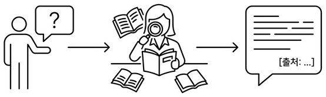
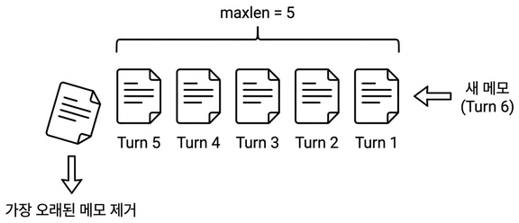

# 챕터 5. 답이 돌아온다. LCEL 파이프라인

:::goal
**이번 챕터가 끝나면**

- **LCEL**(LangChain Expression Language)의 파이프 연산자로 Retriever → Prompt → LLM → Parser를 한 줄에 조립합니다
- **출처 강제(Source Grounding)** 프롬프트로 환각을 줄이고 답변 끝에 출처를 항상 붙입니다
- **WindowMemory(k=5)** 로 최근 5턴짜리 멀티턴 대화를 유지합니다
- 채팅 UI에서 커넥트HR 비서의 전신과 직접 대화해 봅니다
:::

::::prep
**준비하기**. 실습 시작 전 한 번만 설정

### 1. 실습 폴더 이동

```bash [터미널] 폴더 이동
cd rag-start/ex05
```

파일 구조는 다음과 같습니다.

```text ex05 디렉토리
ex05/
├── run.py                  # [참고] 서버 실행 진입점
├── .env                    # [참고] 환경 변수
├── data/
│   ├── docs/               # [참고] 원본 문서 (ex04와 동일 샘플)
│   ├── markdown/           # [참고] 파싱 결과
│   └── chroma_db/          # [참고] 벡터 DB (첫 실행 시 자동 생성)
├── src/
│   ├── rag_chain.py        # [실습] LCEL 파이프라인 + 출처 강제
│   ├── conversation.py     # [실습] WindowMemory(k=5)
│   ├── llm_factory.py      # [참고] Ollama/OpenAI 분기
│   ├── vectorstore.py      # [참고] Retriever 생성
│   ├── session_manager.py  # [참고] 세션별 Memory + TTL
│   └── response_parser.py  # [설명] <think> 제거 + 출처 추출
├── templates/              # [참고] 채팅 UI HTML
├── static/                 # [참고] 채팅 UI CSS/JS
└── app/
    ├── main.py             # [참고] FastAPI 진입점
    ├── chat_api.py         # [설명] POST /api/chat
    └── session.py          # [참고] 세션 쿠키
```

### 2. 실습 환경 구축

```bash [터미널] 환경 구성. macOS / Linux
cd ex05
cp .env.example .env
python3.12 -m venv .venv
source .venv/bin/activate
ollama pull deepseek-r1:8b
pip install -r requirements.txt
```

```bash [터미널] 환경 구성. Windows
cd ex05
copy .env.example .env
py -3.12 -m venv .venv
.venv\Scripts\activate
ollama pull deepseek-r1:8b
pip install -r requirements.txt
```

`.env` 핵심 상수입니다. 코드를 보기 전에 역할부터 파악해 두면 흐름이 잘 읽힙니다.

| 상수 | 기본값 | 역할 |
|------|-------|------|
| `LLM_PROVIDER` | `ollama` | 사용할 LLM 제공자 (`ollama` 또는 `openai`) |
| `OLLAMA_MODEL` | `deepseek-r1:8b` | Ollama에서 쓸 모델 이름 |
| `EMBEDDING_MODEL` | `jhgan/ko-sroberta-multitask` | 문서 임베딩 모델. 챕터 4와 같은 값이어야 검색이 맞음 |
| `CHROMA_PERSIST_DIR` | `./data/chroma_db` | 벡터 DB 저장 경로 |
| `RETRIEVER_TOP_K` | `5` | 질문당 검색해서 가져올 관련 문서 조각 개수 |
| `CONVERSATION_WINDOW_SIZE` | `5` | 프롬프트에 포함할 최근 대화 턴 수 |

### 3. 사용할 라이브러리

| 패키지 | 역할 |
|-------|------|
| `langchain` | 체인 조립 프레임워크 |
| `langchain-community` | HuggingFaceEmbeddings 등 커뮤니티 통합 |
| `langchain-ollama` | Ollama LLM 연결 |
| `langchain-chroma` | ChromaDB Retriever 래퍼 |
| `fastapi` · `uvicorn` | 웹 API + ASGI 서버 |

### 4. 실습 순서

1. `src/rag_chain.py`. LCEL 파이프라인 + 출처 강제 프롬프트
2. `src/conversation.py`. WindowMemory(k=5)
3. `python run.py`. 서버 실행 후 브라우저 `http://localhost:8000/chat` 에서 대화
::::

## 5.1 "그냥 답을 알려줘"


*그림 5-1. 사서가 답을 돌려줍니다. 책을 찾아서 읽고, 출처와 함께 정리해 줍니다*

수요일 점심 직후. 사무실 라디에이터가 한 번 울컥 소리를 내고 다시 잠잠해졌습니다.

챕터 4에서 벡터 검색까지 돌렸고, 동료에게 CLI 사용법을 알려 줬습니다. 점심 먹고 돌아오니 그 동료가 다시 의자를 돌려 제 쪽을 봤습니다.

**동료**: "병가 쓸 때 증빙 서류 필요해요?"<br>**동료**: "연차 며칠 남았는지 어떻게 확인해요?"

CLI가 켜진 터미널을 그대로 보여 줬습니다. 검색 결과가 두 줄, 세 줄 쌓여 갑니다.

```text [터미널] 벡터 검색 결과 (요약)
[1] HR_취업규칙_v1.0 (p.3)  유사도 0.872
    "제15조(병가) 질병이나 부상으로 인하여 직무를 수행할 수 없을 때에는…"
[2] HR_취업규칙_v1.0 (p.4)  유사도 0.815
    "병가 기간이 3일 이상인 경우에는 의사의 진단서를…"
```

**동료**: "이걸 제가 읽어요? 그냥 답을 알려주세요."

*맞다. 사람들이 원하는 건 문서 조각이 아니라 답이다.*

벡터 검색은 **재료를 찾아 주는 일**이지 **요리를 해 주는 일**이 아닙니다. 이번 챕터에서는 그 "요리"를 해 주는 **RAG Q&A 엔진**을 얹습니다. 질문하면 문서를 검색하고, 읽어서, 자연어로 답해 주는 시스템입니다.

## 5.2 사서가 일하는 네 단계

지금까지 만든 벡터 검색은 **도서관의 검색 시스템**과 비슷합니다. "한국 역사"를 검색하면 관련 책이 어디 있는지 알려주지만, 책을 꺼내서 읽고 정리해 주지는 않습니다.

우리에게 필요한 건 **사서**입니다. 사서에게 "조선시대 과거 제도가 뭐예요?"라고 물으면 네 단계가 일어납니다.

1. **질문을 듣는다**. "조선 과거 제도"가 핵심이군
2. **서가에서 책을 찾는다**. 한국사 개론 3장 근처를 꺼냄
3. **읽고 답변을 정리한다**. "문과, 무과, 잡과 세 종류가 있었습니다"
4. **출처를 알려준다**. "한국사 개론 3장에 나와 있어요"

이 네 단계가 RAG Q&A 파이프라인입니다. 챕터 4가 2번까지였다면, 이번 챕터에서 **3, 4번을 추가**합니다.

<div class="sp-figure">
  <div class="sp-figure-title">그림 5-2. RAG Q&amp;A 흐름. 챕터 4까지가 1~2번, 이번 챕터에서 3~4번을 더합니다</div>
  <div class="sp-flow">
    <div class="sp-step">
      <span class="sp-step-num">STEP 01</span>
      <div class="sp-step-title">질문을 듣는다</div>
      <div class="sp-step-desc">사용자 입력을 받습니다 (챕터 4까지)</div>
    </div>
    <div class="sp-flow-arrow">→</div>
    <div class="sp-step">
      <span class="sp-step-num">STEP 02</span>
      <div class="sp-step-title">서가에서 책 찾기</div>
      <div class="sp-step-desc">Retriever로 벡터 검색 (챕터 4까지)</div>
    </div>
    <div class="sp-flow-arrow">→</div>
    <div class="sp-step accent">
      <span class="sp-step-num">STEP 03</span>
      <div class="sp-step-title">읽고 답변 정리</div>
      <div class="sp-step-desc">LLM이 문서를 읽고 답변을 생성</div>
    </div>
    <div class="sp-flow-arrow">→</div>
    <div class="sp-step accent">
      <span class="sp-step-num">STEP 04</span>
      <div class="sp-step-title">출처 알려주기</div>
      <div class="sp-step-desc">근거 문서명을 답변 끝에 첨부</div>
    </div>
  </div>
</div>

## 5.3 LCEL 조립과 출처 강제. rag_chain.py

검색 → 프롬프트 → LLM → 파싱. 각 단계를 손으로 이어 붙여도 되지만, **LangChain**이 이걸 부품화해 줍니다. 조립 방식은 **파이프 연산자(`|`)** 입니다. 이 표현 방식을 **LCEL(LangChain Expression Language)** 이라 부릅니다.

<div class="sp-figure">
  <div class="sp-figure-title">그림 5-3. LCEL 파이프라인 구조. 앞 블록의 출력이 <code>|</code>를 타고 다음 블록의 입력이 됩니다</div>
  <div class="sp-flow">
    <div class="sp-step info">
      <span class="sp-step-num">입력</span>
      <div class="sp-step-title">질문</div>
      <div class="sp-step-desc"><code>str</code> 한 줄</div>
    </div>
    <div class="sp-flow-arrow">|</div>
    <div class="sp-step">
      <span class="sp-step-num">Retriever</span>
      <div class="sp-step-title">검색</div>
      <div class="sp-step-desc">벡터 DB 조회 (top_k=5)</div>
    </div>
    <div class="sp-flow-arrow">|</div>
    <div class="sp-step">
      <span class="sp-step-num">Prompt</span>
      <div class="sp-step-title">프롬프트 조립</div>
      <div class="sp-step-desc">규칙 + 검색된 문서 주입</div>
    </div>
    <div class="sp-flow-arrow">|</div>
    <div class="sp-step accent">
      <span class="sp-step-num">LLM</span>
      <div class="sp-step-title">답변 생성</div>
      <div class="sp-step-desc">DeepSeek-R1 또는 GPT-4o</div>
    </div>
    <div class="sp-flow-arrow">|</div>
    <div class="sp-step">
      <span class="sp-step-num">Parser</span>
      <div class="sp-step-title">파싱</div>
      <div class="sp-step-desc">AIMessage → 문자열</div>
    </div>
    <div class="sp-flow-arrow">→</div>
    <div class="sp-step info">
      <span class="sp-step-num">출력</span>
      <div class="sp-step-title">답변</div>
      <div class="sp-step-desc"><code>str</code> 한 줄</div>
    </div>
  </div>
</div>

**파이프 연산자(`|`)** 는 앞 블록의 출력을 뒤 블록의 입력으로 흘려보냅니다. 유닉스 셸의 `ls | grep` 파이프와 같은 발상입니다. 덕분에 Retriever, Prompt, LLM, Parser 어느 블록이든 **같은 인터페이스만 지키면 자리 바꿔 낄 수 있습니다**. LLM을 DeepSeek에서 GPT-4o로 갈아 끼울 때도 체인 구조는 건드리지 않고 LLM 블록만 교체하면 됩니다. 챕터 8~10에서 튜닝할 때 이 구조의 힘이 본격적으로 드러납니다.

### 출처 강제 (Source Grounding)

챕터 1에서 맛본 **그라운딩**의 강한 버전입니다. 그때는 "참고 정보에서만 답하세요" 한 줄이었지만, 실서비스에서는 그걸로 부족합니다. LLM이 "문서에서 찾을 수 없으면" 외부 지식을 슬쩍 섞어 지어내는 일이 여전히 일어납니다.

이번 챕터는 규칙을 **네 개로 늘립니다**. (1) 제공된 문서에서만 답한다, (2) 없으면 "확인되지 않습니다"로 끝낸다, (3) 답변 끝에 `[출처: 파일명]`을 반드시 붙인다, (4) 추측 금지. `ex05/src/rag_chain.py` 상단에 상수 `RAG_SYSTEM_PROMPT`로 박혀 있습니다.

### 실습 (rag_chain.py)

먼저 시스템 프롬프트의 모양을 확인합니다. 이 부분은 이미 작성돼 있고, 우리가 채울 곳은 그 아래 두 함수입니다.

```python [설명] ex05/src/rag_chain.py. 출처 강제 프롬프트 (발췌)
RAG_SYSTEM_PROMPT = """당신은 커넥트HR 사내 문서 Q&A 비서입니다.
아래에 제공된 문서(Context)만 사용하여 질문에 답변하십시오.

규칙:
1. 반드시 제공된 문서에서만 근거를 찾아 답변하시오.
2. 문서에서 답을 찾을 수 없으면 "해당 내용은 제공된 문서에서 확인되지 않습니다."라고 답하시오.
3. 답변 마지막에 근거 문서명을 반드시 명시하시오. 형식: [출처: 문서명]
4. 추측이나 외부 지식을 사용하지 마시오.

Context (제공된 문서):
{context}

이전 대화:
{history}
"""
```

`{context}`에는 검색된 문서가, `{history}`에는 이전 대화가 자동으로 채워집니다. 규칙 2번이 **환각 방지**(모르면 모른다고 답하라), 규칙 3번이 **출처 명시**를 담당합니다. 같은 파일에 `RAG_HUMAN_PROMPT = "질문: {question}"` 상수도 함께 선언돼 있어, 뒤에서 `("human", RAG_HUMAN_PROMPT)` 자리에 그대로 끼워 넣습니다.

`_format_docs()`와 `build_rag_chain()` 두 함수에 TODO가 있습니다. `ex05/src/rag_chain.py`를 열고 TODO의 `pass`를 지우고 아래 코드를 작성합니다.

```python [실습 1] ex05/src/rag_chain.py. _format_docs
def _format_docs(docs):
    # TODO: 검색된 Document를 "[문서 N] 출처: ..." 텍스트로 변환
    # 1. 검색된 Document 리스트를 프롬프트에 넣을 텍스트로 변환
    parts = []
    for i, doc in enumerate(docs, start=1):
        source = doc.metadata.get("source", "알 수 없음")
        page = doc.metadata.get("page", "-")
        parts.append(f"[문서 {i}] 출처: {source} (p.{page})\n{doc.page_content}")
    return "\n\n".join(parts)
```

각 문서에 `[출처: 파일명 (p.N)]` 라벨을 붙여 한 문자열로 합칩니다. 이 결과가 프롬프트 변수 `{context}`로 들어갑니다.

이어서 본체를 조립합니다. 챕터 1에서 RetrievalQA가 내부에서 알아서 해주던 검색·프롬프트·LLM 호출을, 이번에는 Retriever부터 하나씩 꺼내서 파이프로 직접 잇습니다.

```python [실습 1] ex05/src/rag_chain.py. build_rag_chain
def build_rag_chain():
    # TODO: build_llm()으로 LLM 생성 ~ (chain, retriever) 튜플 반환
    # 1. LLM 인스턴스 생성 (llm_factory.py에서 Ollama/OpenAI 선택)
    llm = build_llm()
    # 2. ChromaDB에서 문서를 검색하는 Retriever 생성
    retriever = build_retriever()

    # 3. 시스템 프롬프트 + 사용자 프롬프트 조립
    prompt = ChatPromptTemplate.from_messages([
        ("system", RAG_SYSTEM_PROMPT),
        ("human", RAG_HUMAN_PROMPT),
    ])

    # 4. LCEL 파이프로 체인 조립. 질문→검색→포맷→프롬프트→LLM→텍스트
    chain = (
        {
            "context": itemgetter("question") | retriever | _format_docs,
            "history": itemgetter("history"),
            "question": itemgetter("question"),
        }
        | prompt
        | llm
        | StrOutputParser()
    )

    # 5. 체인과 검색기를 함께 반환
    return chain, retriever
```

파이프 연산자(`|`)가 각 단계의 출력을 다음 단계의 입력으로 넘깁니다. 위에서 본 그림 5-3 다이어그램이 그대로 코드 한 덩어리가 됐습니다. `itemgetter("question")` 은 입력 dict에서 `question` 키만 꺼내는 호출가능 객체로, 검색 단계로 흘러가는 입력을 골라 줍니다.

등장한 LangChain 부품 세 개를 한 줄씩 정리하면 다음과 같습니다.

| 부품 | 역할 |
|-----|------|
| `ChatPromptTemplate.from_messages([...])` | `system`/`human` 메시지로 프롬프트 조립. `{context}`, `{question}` 같은 변수는 체인 실행 시 자동으로 채워짐 |
| `build_llm()` | `.env`의 `LLM_PROVIDER`에 따라 `ChatOllama` 또는 `ChatOpenAI` 인스턴스를 만들어 줌 (`llm_factory.py`) |
| `StrOutputParser()` | LLM이 돌려주는 `AIMessage` 객체에서 `.content` 문자열만 꺼내는 최종 파서 |

:::term-box
**왜 chain과 retriever를 함께 반환할까요?**. 체인은 최종 답변 텍스트만 돌려주지만, 출처 표시용으로 **검색된 원본 Document** 도 따로 필요합니다. `ex05/app/chat_api.py`가 `retriever.invoke(question)`을 한 번 더 호출해 출처 목록을 만들어 응답 JSON에 붙입니다.
:::

## 5.4 메모장 다섯 장. conversation.py

도서관 방문자가 사서에게 이어서 묻는 장면을 떠올려 보세요.

**방문자**: "한국 역사 관련 책 어디 있어요?"<br>**사서**: "2층 인문학 서가에 있습니다."<br>**방문자**: "거기 세계사도 있어요?"

여기서 "거기"는 **2층 인문학 서가**입니다. 사람 사서는 당연히 기억하지만 LLM은 기본적으로 **기억력이 없습니다**. 매 요청이 독립적이라 이전 질문을 모릅니다. "거기"를 물어보면 어디인지 되묻거나 엉뚱한 곳을 답합니다.

그래서 **대화 히스토리**를 직접 관리해야 합니다. 모든 대화를 다 기억할 수는 없으니 **최근 N턴만 유지**하는 슬라이딩 윈도우 방식을 씁니다. 사서가 메모장 한 권을 들고 있다고 생각하시면 됩니다. 메모장에는 다섯 장만 있고, 새 메모가 들어오면 가장 오래된 메모를 빼냅니다.


*그림 5-4. 6번째 메모가 들어오면 가장 오래된 1번째가 빠집니다. 항상 `maxlen = 5`*

Python에서는 `collections.deque(maxlen=5)`를 쓰면 이 구조가 자동으로 구현됩니다. `append`만 하면 오래된 원소가 알아서 빠져나갑니다.

### 실습 (conversation.py)

`ex05/src/conversation.py`는 `deque(maxlen=k)` 위에 얇은 래퍼를 씌워 "이전 대화"를 프롬프트에 넣을 형태로 바꿉니다. `save_turn`, `get_history`, `clear` 세 메서드에 TODO가 있습니다. `ex05/src/conversation.py`를 열고 TODO의 `pass`를 지우고 아래 코드를 작성합니다.

```python [실습 2] ex05/src/conversation.py. WindowMemory
class WindowMemory:
    def __init__(self, k=5, human_prefix="사용자", ai_prefix="AI 비서"):
        self.k = k
        self.human_prefix = human_prefix
        self.ai_prefix = ai_prefix
        self._turns = deque(maxlen=k)

    def save_turn(self, question, answer):
        # TODO: (question, answer) 튜플을 self._turns에 추가
        # 1. 질문-답변 1턴을 메모장에 저장
        self._turns.append((question, answer))

    def get_history(self):
        # TODO: self._turns의 (question, answer) 쌍을 순회하며
        # 1. 저장된 대화를 "사용자: 질문 / AI: 답변" 텍스트로 변환
        lines = []
        for question, answer in self._turns:
            lines.append(f"{self.human_prefix}: {question}")
            lines.append(f"{self.ai_prefix}: {answer}")
        return "\n".join(lines)

    def clear(self):
        # TODO: self._turns 초기화
        # 1. 메모장 비우기
        self._turns.clear()
```

`deque(maxlen=5)`가 자동으로 오래된 턴을 제거해 주므로 우리가 할 일은 "append → 텍스트 변환 → 비우기" 셋뿐입니다. `get_history()`가 돌려주는 문자열이 실습 1의 프롬프트 변수 `{history}` 자리에 그대로 들어갑니다. 사서의 메모장이 매 질문마다 사서 머리맡으로 넘어가는 셈입니다.

`ex05/src/session_manager.py`가 세션별로 이 `WindowMemory`를 하나씩 보관하고, 일정 시간 동안 호출이 없으면 TTL로 만료시킵니다. 이 부분은 [참고] 파일이라 직접 작성하지 않습니다.

## 5.5 서버 실행 + 채팅 UI

두 파일의 TODO를 모두 채웠으면 서버를 띄워 브라우저에서 직접 대화해 봅니다.

```bash [터미널] 서버 실행
python run.py
```

터미널에 `Uvicorn running on http://0.0.0.0:8000`이 찍히면 준비 완료입니다. 브라우저에서 `http://localhost:8000/chat`을 열면 채팅 UI가 나타납니다.


*그림 5-5. 커넥트HR 비서의 전신. RAG Q&A 채팅 UI*

"병가 쓸 때 증빙 서류 필요해요?"라고 물어보면 사내 취업규칙을 근거로 답이 돌아오고, 답변 끝에 출처 파일명이 붙습니다.


*그림 5-6. 답변이 자연어로 돌아오고, 출처까지 명시됩니다*

이어서 "그럼 며칠 이상일 때 진단서가 필요해?"라고 물어보면 **이전 대화의 "병가"를 기억**해서 맥락을 이어 답합니다. WindowMemory가 동작한 결과입니다.


*그림 5-7. 멀티턴 대화. 이전 질문을 기억해 "거기", "그럼"을 해석합니다*

옆자리에서 동료가 화면을 넘겨다봤습니다.

**동료**: "아, 이제 답을 주네요. 아까는 문서 조각만 던지더니."

오프닝에서 "이걸 내가 읽어요?" 하던 바로 그 사람입니다. 이번엔 읽을 것도, 해석할 것도 없이 답이 나왔습니다.

처음으로 **사용자가 쓸 수 있는 형태**의 비서가 생겼습니다. 벡터 검색 결과가 자연어 답변으로 바뀌고, 출처가 붙고, 이어지는 질문의 맥락까지 이해합니다. 다만 "김대리 연차 며칠 남았어?" 같은 **실시간 DB 조회 질문**은 아직 못 풉니다. 챕터 6에서 문서 질문과 DB 질문을 한 에이전트가 동시에 처리하도록 **Tool Calling + ReAct 패턴**을 얹습니다.

### 이 파이프라인, 다음 챕터에서 어떻게 되는가

지금 만든 LCEL 파이프라인은 여기서 끝이 아닙니다. 다음 챕터에서 이 구조가 **그대로** **에이전트 도구 하나**(`search_documents`)로 감싸지고, 옆에 DB 조회 도구(`leave_balance`, `sales_sum`, `list_employees`) 셋이 나란히 놓입니다. 에이전트가 질문을 보고 어떤 도구를 열지 스스로 판단하게 됩니다. **파이프라인 자체는 버려지지 않습니다.**

<div class="sp-figure">
  <div class="sp-figure-title">그림 5-8. 이번 챕터의 LCEL 파이프라인은 다음 챕터에서 에이전트 도구가 됩니다</div>

  <div class="sp-compare">
    <div class="sp-compare-block">
      <div class="sp-compare-label">챕터 5. 지금</div>
      <div class="sp-compare-content">
        <div class="sp-flow">
          <div class="sp-chip">Retriever</div>
          <div class="sp-flow-arrow">→</div>
          <div class="sp-chip">Prompt</div>
          <div class="sp-flow-arrow">→</div>
          <div class="sp-chip">LLM</div>
          <div class="sp-flow-arrow">→</div>
          <div class="sp-chip">Parser</div>
        </div>
        <div class="sp-callout">LCEL 파이프라인 단독. 문서 검색·답변만 가능합니다.</div>
      </div>
    </div>

    <div class="sp-compare-block good">
      <div class="sp-compare-label">챕터 6. 에이전트 도구로 감싸짐</div>
      <div class="sp-compare-content">
        <div class="sp-row warm">
          <span class="sp-row-label">SQL 도구 셋</span>
          <span class="sp-row-value">
            <span class="sp-chip">leave_balance</span>
            <span class="sp-chip">sales_sum</span>
            <span class="sp-chip">list_employees</span>
          </span>
        </div>
        <div class="sp-row accent">
          <span class="sp-row-label">문서 도구</span>
          <span class="sp-row-value">
            <span class="sp-chip accent">search_documents</span>
            <span>= 챕터 5 엔진을 그대로 감쌈</span>
          </span>
        </div>
        <div class="sp-flow">
          <div class="sp-chip">Retriever</div>
          <div class="sp-flow-arrow">→</div>
          <div class="sp-chip">Prompt</div>
          <div class="sp-flow-arrow">→</div>
          <div class="sp-chip">LLM</div>
          <div class="sp-flow-arrow">→</div>
          <div class="sp-chip">Parser</div>
        </div>
        <div class="sp-callout warm">왼쪽 LCEL 파이프라인이 <code>search_documents</code> 도구 안으로 들어가고, 옆에 SQL 도구 셋이 붙습니다.</div>
      </div>
    </div>
  </div>
</div>

## 5.6 전체 구성도에서 챕터 5의 자리

<div class="arch-fullmap">
  <div class="arch-fullmap-title">전체 구성도. 짙은 박스가 챕터 5 범위</div>

  <div class="afm-row afm-user">
    <div class="afm-box afm-faint afm-round"><div class="afm-label">사내 직원 · 관리자</div></div>
  </div>

  <div class="afm-zone">
    <span class="afm-zone-ch">챕터 2</span>
    <span class="afm-zone-label">대시보드</span>
    <div class="afm-row">
      <div class="afm-box afm-faint"><div class="afm-label">FastAPI</div><div class="afm-sub">REST API · 관리자 웹</div></div>
    </div>
  </div>

  <div class="afm-zone">
    <span class="afm-zone-ch">챕터 6</span>
    <span class="afm-zone-label">오케스트레이션</span>
    <div class="afm-row afm-three">
      <div class="afm-box afm-faint"><div class="afm-label">Tool Calling Agent</div><div class="afm-sub">ReAct 패턴 · 사후 분류</div></div>
      <div class="afm-box afm-faint"><div class="afm-label">@tool 도구</div><div class="afm-sub">DB 조회 · 문서 검색</div></div>
    </div>
  </div>

  <div class="afm-zone">
    <span class="afm-zone-ch">챕터 5</span>
    <span class="afm-zone-label">검색 (실시간)</span>
    <div class="afm-row">
      <div class="afm-box afm-on">
        <div class="afm-tag">오늘 만든 부분</div>
        <div class="afm-label">LCEL Chain</div>
        <div class="afm-sub">검색기 → 프롬프트 → LLM · 출처 강제 · WindowMemory</div>
      </div>
    </div>
  </div>

  <div class="afm-zone">
    <span class="afm-zone-ch">챕터 4</span>
    <span class="afm-zone-label">파싱·벡터화 (오프라인)</span>
    <div class="afm-row afm-three">
      <div class="afm-box afm-faint afm-dashed"><div class="afm-label">챕터 3 문서 규칙</div><div class="afm-sub">PDF·Word·Excel·HWP</div></div>
      <div class="afm-box afm-faint"><div class="afm-label">Doc Pipeline</div><div class="afm-sub">파싱·청킹·임베딩</div></div>
      <div class="afm-box afm-faint"><div class="afm-label">ChromaDB</div><div class="afm-sub">벡터 저장소</div></div>
    </div>
  </div>

  <div class="afm-zone">
    <span class="afm-zone-ch">챕터 2</span>
    <span class="afm-zone-label">데이터</span>
    <div class="afm-row">
      <div class="afm-box afm-faint"><div class="afm-label">PostgreSQL</div><div class="afm-sub">직원·연차·매출</div></div>
    </div>
  </div>

  <div class="afm-row afm-ext">
    <div class="afm-box afm-faint afm-dashed"><div class="afm-label">Ollama LLM (외부)</div></div>
  </div>

  <div class="afm-note">
    오늘 얹은 건 <b>LCEL Chain</b> 한 박스입니다. 이제 문서 기반 질문에는 출처를 붙여 답합니다. 다만 "김대리 연차 며칠?" 같은 DB 조회 질문은 아직 못 풉니다. 챕터 6에서 <b>Tool Calling Agent + ReAct 패턴</b>을 얹어 두 종류 질문을 한 에이전트가 처리하게 만듭니다.
  </div>
</div>

## 용어 정리

| 본문 속 표현 | 진짜 용어 | 정식 정의 |
|-------------|---------|----------|
| "사서의 업무 순서" | **LCEL 파이프라인** | LangChain Expression Language. 파이프(`\|`)로 Retriever → Prompt → LLM → Parser를 연결 |
| "근거를 대" | **출처 강제(Source Grounding)** | 프롬프트로 "제공된 문서에서만 답하고 출처 명시"를 강제하는 기법 |
| "메모장 다섯 장" | **WindowMemory** | 최근 N턴 대화만 유지하는 슬라이딩 윈도우. `deque(maxlen=k)` 기반 |
| "메모장 관리인" | **ConversationManager** | 세션별 WindowMemory를 보관하고 TTL로 만료 세션을 정리하는 클래스 |
| "입력 → 출력 연결" | **파이프 연산자(`\|`)** | `A \| B`는 A의 출력을 B의 입력으로 전달. Unix 파이프와 같은 개념 |

:::remember
**이것만은 기억하자**

- **벡터 검색은 재료, LCEL은 요리입니다.** 검색 결과를 던져 주는 게 아니라 읽고 답해 주는 체인을 얹어야 사용자가 쓸 수 있는 비서가 됩니다.
- **출처 강제는 환각의 안전망입니다.** "제공된 문서에서만 답하라 + 출처를 명시하라" 한 줄이 거짓말을 크게 줄여 줍니다. 답변에 출처 파일명을 항상 붙이세요.
- **기억 없는 LLM에게 메모장을 쥐여 줍니다.** WindowMemory(k=5)면 일상 대화에 충분합니다. 챕터 6에서는 에이전트가 도구를 직접 골라 "문서 질문"과 "DB 조회 질문"을 한 번에 처리합니다.
:::
