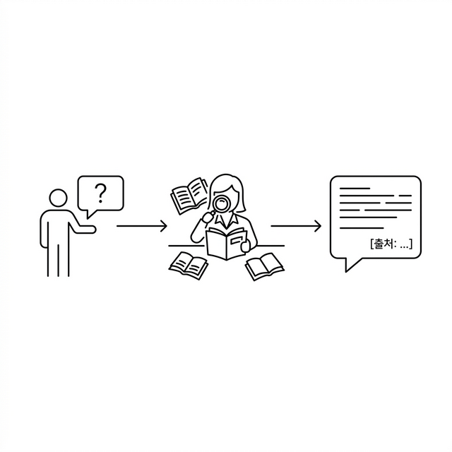
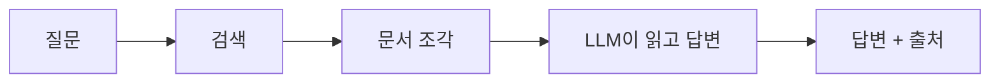
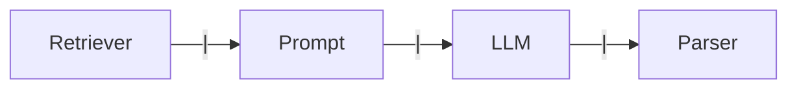
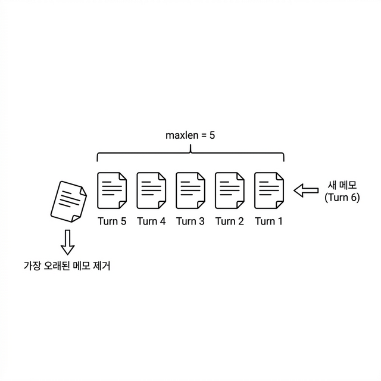

# Ch.5: "드디어 답해준다" — RAG Q&A 엔진 (v0.5)

> 이번 버전: v0.4 → v0.5
> 한 줄 요약: 검색은 재료, 답변은 요리다. LCEL 파이프라인이 이 레시피다.
> 핵심 개념: LCEL 파이프라인, 출처 강제(Source Grounding), WindowMemory 멀티턴

---

## 이야기 파트

<!-- [GEMINI PROMPT: 05_chapter-opening]
path: assets/CH05/05_chapter-opening.png
A minimalist black and white technical diagram with a strict 16:9 aspect ratio
on a solid white background. No shading, no 3D effects, only clean thin line art.
The entire assembly of icons, lines, and text is perfectly centered globally
within the 16:9 frame, leaving generous and equal white space on all sides.

Left: a minimalist line-art person icon holding out a speech bubble containing '?'.
Center: a minimalist line-art librarian icon at a desk, with open books around,
reading one book with a magnifying glass.
Right: a large speech bubble from the librarian containing text lines
and a small tag labeled '[출처: ...]' — representing an answer with source citation.
Style: scene-opener
-->


### 여기까지 왔다

- [x] v0.1: LLM 환각 체험 + RAG 맛보기
- [x] v0.2: FastAPI로 사내 시스템(직원/연차/매출) CRUD
- [x] v0.3: 사내 문서 수집 전략과 표준 설계
- [x] v0.4: 문서 파싱 → 청킹 → 임베딩 → 벡터 DB 구축
- [ ] **v0.5: RAG Q&A 엔진** ← 이번 챕터

지난 챕터에서 사내 문서를 벡터 DB에 저장하고, CLI로 검색까지 해봤다. "연차 사용 규정"을 검색하면 관련 문서 조각이 유사도 점수와 함께 나왔다.

그런데 여기서 문제가 생겼다.

### "그냥 답을 알려줘"

벡터 검색을 사내 시스템에 붙이고 나서 일주일쯤 지났을 때다.

"야, 병가 쓸 때 증빙 서류 필요해?"
"연차 몇 일 남았는지 어떻게 확인해?"
"신규 서비스 런칭 전략 문서 어디 있어?"

동료들의 질문이 하루에 서너 번씩 날아왔다. 매번 같은 유형이다. 답은 전부 사내 문서 어딘가에 있다.

처음엔 벡터 검색 결과를 공유했다.

```
[1] HR_취업규칙_v1.0 (p.3) — 유사도: 87.2%
    "제15조(병가) 질병이나 부상으로 인하여 직무를 수행할 수 없을 때에는..."

[2] HR_취업규칙_v1.0 (p.4) — 유사도: 81.5%
    "병가 기간이 3일 이상인 경우에는 의사의 진단서를..."
```

그런데 돌아오는 반응은 한결같았다.

"이걸 내가 읽어?"
"그냥 답을 알려줘."

(맞다. 사람들은 문서 조각을 원하는 게 아니라, **답변**을 원한다.)

검색 결과 5개를 받아서 직접 읽고, "아, 3일 미만이면 증빙 불필요고, 3일 이상이면 진단서가 필요하구나"라고 해석하는 건 결국 사람의 몫이었다. 벡터 검색은 **재료를 찾아주는 것**이지, **요리를 해주는 것**이 아니었다.

이번 챕터에서는 그 "요리"를 해줄 **RAG Q&A 엔진**을 만든다. 질문하면 문서를 검색하고, 검색 결과를 읽어서 자연어로 답변해주는 시스템이다.

### 도서관 사서가 필요하다

지금까지 만든 벡터 검색은 **도서관의 검색 시스템**과 비슷하다. "병가 규정"을 검색하면 관련 책이 어디 있는지 알려준다. 하지만 그 책을 직접 꺼내서 읽어보고, 핵심을 정리해서 답해주진 않는다.

우리에게 필요한 건 **사서**다.

사서에게 "병가 쓸 때 증빙 필요해?"라고 물으면 이런 일이 벌어진다:

1. **질문을 듣는다** — "병가 증빙"이 핵심이군
2. **서가에서 책을 찾는다** — 취업규칙 제15조 부근을 꺼냄
3. **읽고 답변을 정리한다** — "3일 미만은 불필요, 3일 이상은 진단서"
4. **출처를 알려준다** — "취업규칙 15조 3항에 나와 있어요"

이 네 단계가 바로 RAG Q&A 파이프라인이다.



*그림 5-1: RAG Q&A 흐름 — 질문이 들어오면 벡터 검색으로 문서 조각을 찾고, LLM이 읽어서 자연어 답변을 만든다*

벡터 검색(CH04)은 2번까지였다. 이번 챕터에서 3번과 4번을 추가한다. 사서가 책을 찾는 것뿐 아니라, **읽고 답변까지 해주는** 시스템을 만드는 거다.

### 파이프라인이라는 이름의 레시피

사서가 일하는 순서를 코드로 옮기려면 어떻게 해야 할까? LangChain은 이 순서를 **파이프(|) 연산자**로 연결한다. LCEL(LangChain Expression Language)이라고 부른다.

파이프가 뭐냐면, 주방에서 요리할 때의 레시피와 같다.

> 질문 → **검색**(벡터 DB에서 문서 조각 찾기) → **프롬프트**(찾은 문서 + 질문을 합치기) → **LLM**(읽고 답변 생성) → **파싱**(답변 텍스트 추출)

각 단계가 파이프(|)로 연결되어 있고, 앞 단계의 출력이 다음 단계의 입력이 된다. 마치 공장의 컨베이어 벨트처럼.



*그림 5-2: LCEL 파이프라인 구조 — 각 단계가 파이프 연산자로 연결된다*

이 구조의 장점은 **블록을 바꿀 수 있다**는 거다. LLM을 DeepSeek에서 GPT-4o로 바꾸고 싶으면? LLM 블록만 교체하면 된다. 검색 방식을 바꾸고 싶으면? Retriever 블록만 교체하면 된다. CH08~10에서 튜닝할 때 이 구조가 빛을 발한다.

### "출처를 대"

사서에게 한 가지 더 요구할 게 있다. **출처**.

CH01에서 LLM이 그럴듯하게 거짓말하는 걸 봤다. RAG로 문서를 넣어줬다고 해서 환각이 완전히 사라지는 건 아니다. LLM이 문서에 없는 내용을 지어낼 수도 있다.

그래서 프롬프트에 규칙을 넣는다:

> "반드시 제공된 문서에서만 답하세요. 답변 마지막에 출처를 명시하세요. 문서에서 찾을 수 없으면 '확인되지 않습니다'라고 답하세요."

이걸 **출처 강제(Source Grounding)** 라고 부른다. LLM에게 "근거 없이 답하지 마"라고 제한을 거는 거다. 출처가 붙으면 독자가 직접 확인할 수도 있으니, 신뢰도가 훨씬 올라간다.

### 사서도 기억력이 있다

동료가 이렇게 물었다고 해보자:

"병가 쓸 때 증빙 필요해?"

사서가 답한다:
"3일 미만은 불필요하고, 3일 이상은 진단서가 필요합니다. [출처: 취업규칙 제15조]"

바로 이어서:

"그러면 연차로 대체할 수 있어?"

여기서 "그러면"이 가리키는 건 뭘까? **병가**다. 이전 대화를 기억하고 있어야 "병가를 연차로 대체"라는 맥락을 이해할 수 있다.

사람 사서라면 당연히 기억한다. 하지만 LLM은 기본적으로 **기억력이 없다**. 매 요청이 독립적이다. 이전에 뭘 물어봤는지 모른다.

그래서 **대화 히스토리**를 직접 관리해야 한다. 이전 대화를 메모해뒀다가, 새 질문이 올 때마다 같이 넘겨주는 거다. 다만 모든 대화를 다 기억할 수는 없으니, **최근 5턴만 유지**하는 슬라이딩 윈도우 방식을 쓴다.

도서관 사서가 메모장을 가지고 있다고 생각하면 된다. 새 메모가 들어오면 가장 오래된 메모를 지우고, 항상 최근 5장만 남긴다.

<!-- [GEMINI PROMPT: 05_sliding-window]
path: assets/CH05/05_sliding-window.png
A minimalist black and white technical diagram with a strict 16:9 aspect ratio
on a solid white background. No shading, no 3D effects, only clean thin line art.
The entire assembly of icons, lines, and text is perfectly centered globally
within the 16:9 frame, leaving generous and equal white space on all sides.

A horizontal row of 5 minimalist line-art memo note icons
(labeled 'Turn 1' through 'Turn 5'), each containing tiny text lines.
An arrow labeled '새 메모 (Turn 6)' pushes in from the right side.
On the left, 'Turn 1' is shown falling off the row with a downward arrow,
labeled '가장 오래된 메모 제거'.
A bracket above the 5 notes reads 'maxlen = 5'.
Style: concept-diagram
-->

*그림 5-3: 메모장에 6번째 메모가 들어오면 가장 오래된 1번째가 빠진다. 항상 최근 5장만 유지.*

### 이번 버전에서 뭘 만드나

정리하면, v0.5에서는 세 가지를 추가한다:

| 기능 | 비유 | 코드 |
|------|------|------|
| LCEL 파이프라인 | 사서의 업무 순서 (검색→읽기→답변) | `rag_chain.py` |
| 출처 강제 프롬프트 | "근거 문서를 대" | `RAG_SYSTEM_PROMPT` |
| 멀티턴 대화 | 최근 5장짜리 메모장 | `conversation.py` |

추가로, FastAPI 웹 서버도 연결해서 API로 질문-답변을 주고받을 수 있게 만든다.

v0.4(벡터 검색 CLI)에서 v0.5(RAG Q&A 엔진)로 — 검색만 하던 시스템이 드디어 **답변**을 해준다.

<!-- [CAPTURE NEEDED: 05_rag-qa-result
  path: assets/CH05/05_rag-qa-result.png
  desc: v0.5 실행 결과. 질문 "병가 쓸 때 증빙 서류가 필요한가요?"에 대한 답변 + [출처: HR_취업규칙_v1.0] 표시.
] -->

*그림 5-4: 드디어 답해준다. 문서를 검색하고, 읽어서, 출처와 함께 자연어로 답변한다.*

---

## 기술 파트

### 용어 정리

| 이야기 속 표현 | 진짜 이름 | 정의 |
|---------------|----------|------|
| 사서의 업무 순서 | **LCEL 파이프라인** | LangChain Expression Language. 파이프 연산자(`\|`)로 Retriever → Prompt → LLM → Parser를 연결하는 체인 조립 방식 |
| 근거를 대 | **출처 강제(Source Grounding)** | 프롬프트에 "제공된 문서에서만 답하고 출처를 명시하라"는 제약을 거는 기법. 환각을 줄이고 답변 신뢰도를 높인다 |
| 5장짜리 메모장 | **WindowMemory** | 최근 N턴의 대화만 유지하는 슬라이딩 윈도우 방식의 대화 히스토리 관리. `deque(maxlen=k)` 기반 |
| 파이프(`\|`) | **LCEL 파이프 연산자** | `A \| B`는 A의 출력을 B의 입력으로 전달. Unix 파이프(`cat file \| grep`)와 같은 개념 |
| 메모장 관리인 | **ConversationManager** | 세션별로 WindowMemory를 관리하고, TTL 기반으로 만료된 세션을 정리하는 클래스 |

### 실습 환경 구축

> **참고: 실습 환경이 처음이라면**
> 부록의 "환경 설정" 챕터를 먼저 참고하세요. Python 가상환경, Ollama 설치, Docker 설정을 다룹니다.

이번 챕터부터 LangChain이 등장한다. v0.4에서는 ChromaDB와 sentence-transformers만 직접 사용했지만, v0.5에서는 LangChain이 Retriever, Prompt, LLM을 파이프로 연결해준다.

```bash
cd code/v0.5
python -m venv .venv
source .venv/bin/activate  # Windows: .venv\Scripts\activate
pip install -r requirements.txt
```

**v0.5에서 새로 추가된 패키지**:

| 패키지 | 버전 | 역할 |
|--------|------|------|
| `langchain` | 0.3.21 | 체인 조립 프레임워크 |
| `langchain-ollama` | 0.2.3 | Ollama LLM 연결 |
| `langchain-openai` | 0.3.7 | OpenAI LLM 연결 (선택) |
| `langchain-chroma` | 0.2.6 | ChromaDB Retriever 래퍼 |
| `fastapi` | 0.115.8 | 웹 API 서버 |
| `uvicorn` | 0.34.0 | ASGI 서버 |

> **팁: LLM 선택**
> 기본값은 Ollama + `deepseek-r1:8b`다. GPU 없이도 CPU에서 돌아간다. `.env`에서 `LLM_PROVIDER=openai`로 바꾸면 GPT-4o-mini도 쓸 수 있다.

**환경 변수 설정** — `.env.example`을 복사해서 `.env`를 만든다:

```bash
cp .env.example .env
```

핵심 설정:

```
LLM_PROVIDER=ollama
OLLAMA_MODEL=deepseek-r1:8b
EMBEDDING_MODEL=jhgan/ko-sroberta-multitask
CHROMA_PERSIST_DIR=./data/chroma_db
RETRIEVER_TOP_K=5
CONVERSATION_WINDOW_SIZE=5
```

> **참고: ChromaDB 자동 구축**
> `data/chroma_db/`가 비어 있으면, `data/docs/` 원본 문서를 자동으로 파싱→청킹→임베딩해서 벡터 DB를 생성한다. CH04에서 만든 데이터를 그대로 쓰고 싶으면 `data/chroma_db/` 폴더를 복사하면 된다.

---

### 파일 계층 구조

```
v0.5/
├── .env                    [참고] 환경 변수
├── requirements.txt        [참고] 의존성 목록
├── src/
│   ├── rag_chain.py        [실습] LCEL 파이프라인 + 출처 강제 프롬프트
│   ├── conversation.py     [실습] WindowMemory(k=5) 멀티턴 대화
│   └── response_parser.py  [설명] DeepSeek <think> 제거 + 출처 추출
└── app/
    ├── main.py             [참고] FastAPI 앱 진입점
    ├── chat_api.py         [설명] POST /api/chat 엔드포인트
    └── session.py          [참고] 세션 쿠키 관리
```

---

### [실습] rag_chain.py — LCEL 파이프라인

이 파일이 이번 챕터의 핵심이다. 사서의 업무 순서 — 질문 받기, 문서 찾기, 읽고 답변하기 — 를 코드로 옮긴 것이다.

먼저 **출처 강제 프롬프트**를 보자. LLM에게 "근거를 대"라고 제한을 거는 부분이다:

```python
RAG_SYSTEM_PROMPT = """당신은 메타코딩 사내 문서 Q&A 비서입니다.
아래에 제공된 문서(Context)만 사용하여 질문에 답변하십시오.

규칙:
1. 반드시 제공된 문서에서만 근거를 찾아 답변하시오.
2. 문서에서 답을 찾을 수 없으면 "해당 내용은 제공된 문서에서 확인되지 않습니다."라고 답하시오.
3. 답변 마지막에 근거 문서명을 반드시 명시하시오. 형식: [출처: 문서명]
4. 추측이나 외부 지식을 사용하지 마시오.

Context (제공된 문서):
{context}

이전 대화:
{history}
"""
```

규칙 1~4가 핵심이다. "제공된 문서에서만", "출처를 명시", "모르면 모른다고" — 이 세 가지가 환각을 잡는 장치다. `{context}`에는 벡터 검색으로 찾은 문서 조각이, `{history}`에는 이전 대화 내용이 들어간다.

다음은 파이프라인을 조립하는 `build_rag_chain()` 함수다:

```python
def build_rag_chain() -> tuple[Any, Any]:
    llm = _build_llm()                # ① LLM 인스턴스 생성
    retriever = _build_retriever()    # ② Retriever 생성 (ChromaDB)

    prompt = ChatPromptTemplate.from_messages(
        [
            ("system", RAG_SYSTEM_PROMPT),
            ("human", RAG_HUMAN_PROMPT),
        ]
    )

    # LCEL 파이프라인 조립
    chain = (
        {
            "context": itemgetter("question") | retriever | _format_docs,
            "history": itemgetter("history"),
            "question": itemgetter("question"),
        }
        | prompt
        | llm
        | StrOutputParser()
    )

    return chain, retriever
```

이 코드가 사서의 업무 순서 전체다. `chain` 변수를 한 줄씩 읽어보자:

- `itemgetter("question") | retriever | _format_docs` — 질문에서 키워드를 뽑아 벡터 DB를 검색하고, 찾은 문서 조각을 텍스트로 포맷한다. 사서가 서가에서 책을 꺼내는 단계.
- `itemgetter("history")` — 이전 대화 히스토리를 그대로 전달한다. 사서의 메모장.
- `itemgetter("question")` — 원래 질문도 프롬프트에 넣는다.
- `| prompt` — 검색 결과 + 히스토리 + 질문을 프롬프트 템플릿에 합친다.
- `| llm` — LLM을 호출해서 답변을 생성한다. 사서가 책을 읽고 답변을 정리하는 단계.
- `| StrOutputParser()` — LLM 응답에서 텍스트만 추출한다.

`_build_llm()` 함수는 `.env`의 `LLM_PROVIDER` 값에 따라 Ollama 또는 OpenAI를 선택한다:

```python
def _build_llm() -> Any:
    provider = os.getenv("LLM_PROVIDER", "ollama").lower()

    if provider == "ollama":
        from langchain_ollama import ChatOllama
        return ChatOllama(
            base_url=os.getenv("OLLAMA_BASE_URL", "http://localhost:11434"),
            model=os.getenv("OLLAMA_MODEL", "deepseek-r1:8b"),
            temperature=0.1,
        )
    elif provider == "openai":
        from langchain_openai import ChatOpenAI
        return ChatOpenAI(
            api_key=os.getenv("OPENAI_API_KEY"),
            model=os.getenv("OPENAI_MODEL", "gpt-4o-mini"),
            temperature=0.1,
        )
```

`temperature=0.1`로 낮춘 건 의도적이다. Q&A 비서는 창의적인 답변이 아니라 **정확한 답변**이 필요하다. temperature가 높으면 LLM이 자유롭게 답하면서 환각이 늘어난다.

> **팁: 왜 임포트를 함수 안에서 할까?**
> `from langchain_ollama import ChatOllama`가 함수 안에 있다. Ollama를 안 쓰는 사람은 `langchain-ollama` 패키지가 없어도 되게끔 **지연 임포트(lazy import)** 를 한 거다. 선택하지 않은 LLM의 패키지를 설치할 필요가 없다.

검색된 문서를 프롬프트에 넣을 형식으로 바꿔주는 `_format_docs()`도 중요하다:

```python
def _format_docs(docs: list[Document]) -> str:
    parts = []
    for i, doc in enumerate(docs, start=1):
        source = doc.metadata.get("source", "알 수 없음")
        page = doc.metadata.get("page", "-")
        parts.append(f"[문서 {i}] 출처: {source} (p.{page})\n{doc.page_content}")
    return "\n\n".join(parts)
```

`[문서 1] 출처: HR_취업규칙_v1.0 (p.3)` 형식으로 포맷한다. LLM이 이 출처 정보를 보고 답변에 `[출처: HR_취업규칙_v1.0]`을 붙이게 된다.

---

### [실습] conversation.py — 멀티턴 대화

사서의 메모장, `WindowMemory` 클래스다. 최근 N턴의 대화만 유지하는 슬라이딩 윈도우를 구현한다.

```python
class WindowMemory:
    def __init__(self, k: int = 5, human_prefix: str = "사용자",
                 ai_prefix: str = "AI 비서") -> None:
        self.k = k
        self._turns: deque[tuple[str, str]] = deque(maxlen=k)

    def get_history(self) -> str:
        lines = []
        for question, answer in self._turns:
            lines.append(f"{self.human_prefix}: {question}")
            lines.append(f"{self.ai_prefix}: {answer}")
        return "\n".join(lines)

    def save_turn(self, question: str, answer: str) -> None:
        self._turns.append((question, answer))
```

`deque(maxlen=k)`가 핵심이다. Python의 `deque`에 `maxlen`을 설정하면, 새 항목이 들어올 때 가장 오래된 항목이 자동으로 빠진다. 메모장에 6번째 메모를 붙이면 1번째가 떨어지는 거다.

`get_history()`는 저장된 대화를 텍스트로 만든다. 이 텍스트가 프롬프트의 `{history}`에 들어간다:

```
사용자: 병가 쓸 때 증빙 필요해?
AI 비서: 3일 미만은 불필요하고, 3일 이상은 진단서가 필요합니다.
사용자: 그러면 연차로 대체할 수 있어?
AI 비서: 네, 병가 대신 연차를 사용할 수 있습니다.
```

LLM이 이 히스토리를 보면 "그러면"이 병가를 가리킨다는 걸 이해할 수 있다.

`ConversationManager`는 여러 사용자(세션)의 메모장을 따로 관리한다:

```python
class ConversationManager:
    def __init__(self, window_size: int | None = None,
                 session_ttl: int | None = None) -> None:
        self.window_size = window_size or int(
            os.getenv("CONVERSATION_WINDOW_SIZE", "5")
        )
        self.session_ttl = session_ttl or int(
            os.getenv("SESSION_TTL_SECONDS", "3600")
        )
        self._sessions: dict[str, tuple[WindowMemory, float]] = {}
```

세션별로 `WindowMemory`를 하나씩 만들고, 마지막 접근 시각을 기록한다. `session_ttl`(기본 1시간)이 지나면 자동으로 정리된다. 사서가 손님이 1시간 넘게 안 오면 메모장을 치우는 거라고 생각하면 된다.

> **주의: 메모리 기반이다**
> `ConversationManager`의 세션 데이터는 서버 메모리에만 존재한다. 서버를 재시작하면 대화 히스토리가 사라진다. 운영 환경에서는 Redis 같은 외부 저장소를 쓰는데, 그건 CH07에서 다룬다.

---

### [설명] response_parser.py — 답변 정제

LLM이 내놓는 원문 응답은 깨끗하지 않을 수 있다. 특히 DeepSeek R1 모델은 `<think>...</think>` 태그로 추론 과정을 포함해서 내보낸다. 이걸 제거하고 깔끔한 답변만 뽑아내는 게 이 모듈의 역할이다.

```python
def parse_answer_text(raw_answer: str) -> str:
    text = raw_answer
    # DeepSeek R1의 <think> 추론 토큰 제거
    text = re.sub(r"<think>.*?</think>", "", text, flags=re.DOTALL)
    text = text.strip()

    if not text:
        text = "답변을 생성하지 못했습니다. 다시 시도해 주세요."
    return text
```

`re.DOTALL` 플래그는 `.`이 줄바꿈까지 매칭하게 한다. `<think>` 안에 여러 줄이 있어도 통째로 제거된다.

`build_response()` 함수는 정제된 답변과 출처를 하나의 딕셔너리로 묶는다:

```python
def build_response(raw_answer: str, docs: list[Document]) -> dict[str, Any]:
    answer = parse_answer_text(raw_answer)
    sources = parse_sources_from_docs(docs)
    return {"answer": answer, "sources": sources}
```

API 응답 형태는 이렇다:

```json
{
  "answer": "3일 미만 병가는 증빙이 불필요하고, 3일 이상은 의사 진단서가 필요합니다.",
  "sources": [
    {"doc": "HR_취업규칙_v1.0", "page": 3, "snippet": "제15조(병가) 질병이나..."}
  ]
}
```

---

### [설명] chat_api.py — POST /api/chat

이 라우터가 사서에게 질문을 전달하는 창구다. 웹 브라우저나 API 클라이언트가 여기로 질문을 보낸다.

```python
@router.post("/chat")
async def chat_endpoint(body: ChatRequest, request: Request) -> JSONResponse:
    # 1. 세션 ID 확인
    session_id = body.session_id or get_session_id(request)

    # 2. 이전 대화 히스토리 조회
    conv_manager = get_conversation_manager()
    history_text = conv_manager.get_history_text(session_id)

    # 3. RAG 체인 + Retriever 로드
    chain, retriever = get_rag_chain()

    # 4. 관련 문서 검색 (출처 표시용)
    docs = retriever.invoke(question)

    # 5. LCEL 체인 실행
    raw_answer = chain.invoke({
        "question": question,
        "history": history_text,
    })

    # 6. 응답 구조 생성 (답변 정제 + 출처 추출)
    response_data = build_response(raw_answer=raw_answer, docs=docs)

    # 7. 히스토리에 이번 대화 저장
    conv_manager.save_turn(session_id, question, response_data["answer"])
```

전체 흐름이 한 눈에 보인다. 세션 확인 → 히스토리 조회 → 문서 검색 → 체인 실행 → 응답 정제 → 히스토리 저장. 사서가 질문을 받고 → 메모장 확인하고 → 서가에서 책 꺼내고 → 읽고 답변하고 → 메모장에 기록하는 것과 같다.

---

### 실행 결과

FastAPI 서버를 실행한다:

```bash
# Ollama 실행 (터미널 1)
ollama serve

# FastAPI 서버 실행 (터미널 2)
python -m app.main
```

<!-- [CAPTURE NEEDED: 05_server-start
  path: assets/CH05/05_server-start.png
  desc: FastAPI 서버 시작 로그. `[INFO] 서버 시작: http://0.0.0.0:8000` + ChromaDB 로드 메시지.
] -->

*그림 5-5: FastAPI 서버가 시작되면 ChromaDB를 로드하고 질문을 받을 준비를 한다.*

API로 질문을 보내본다:

```bash
curl -X POST http://localhost:8000/api/chat \
  -H "Content-Type: application/json" \
  -d '{"question": "병가 쓸 때 증빙 서류가 필요한가요?"}'
```

<!-- [CAPTURE NEEDED: 05_api-response
  path: assets/CH05/05_api-response.png
  desc: curl 명령어 실행 결과. JSON 응답에 answer + sources 포함.
] -->

*그림 5-6: curl로 질문을 보내면 답변과 출처가 JSON으로 돌아온다.*

멀티턴도 테스트해본다. 같은 세션에서 이어서 질문한다:

```bash
curl -X POST http://localhost:8000/api/chat \
  -H "Content-Type: application/json" \
  -d '{"question": "그러면 연차로 대체할 수 있어?", "session_id": "이전_세션_ID"}'
```

"그러면"이 병가를 가리킨다는 걸 이해하고 답변한다. 사서가 메모장을 잘 보고 있다는 뜻이다.

---

### 더 알아보기

**LCEL vs 레거시 체인** — LangChain 초기에는 `RetrievalQA`, `ConversationalRetrievalChain` 같은 미리 만들어진 체인을 썼다. 하지만 내부가 블랙박스라서 커스터마이징이 어려웠다. LCEL은 각 단계를 파이프로 직접 조립하기 때문에, 어디에 무슨 로직이 들어가는지 명확하게 보인다. LangChain 0.2 이후부터는 LCEL이 권장 방식이다.

**temperature와 RAG** — Q&A 시스템에서 `temperature=0.1`을 쓰는 건 일반적이다. 0에 가까울수록 LLM이 가장 확률 높은 토큰을 선택하므로 일관된 답변이 나온다. 반대로 창의적 글쓰기에서는 0.7~1.0을 쓴다. RAG에서 temperature를 높이면 문서에 없는 내용을 "창작"할 위험이 커진다.

**윈도우 크기 튜닝** — `CONVERSATION_WINDOW_SIZE=5`는 최근 5턴을 기억한다는 뜻이다. 이 숫자를 키우면 맥락을 더 많이 유지할 수 있지만, 프롬프트가 길어져서 토큰 비용이 올라가고 응답 속도가 느려진다. 특히 로컬 LLM(DeepSeek 8b)은 컨텍스트 창이 제한적이므로 5가 적정선이다.

---

### 이것만은 기억하자

- **검색은 재료, 답변은 요리다.** 벡터 검색으로 재료(문서 조각)를 찾고, LLM이 재료를 요리(자연어 답변)로 만든다. LCEL 파이프라인이 이 레시피다.
- **출처 없는 답변은 근거 없는 주장이다.** 프롬프트에 출처 강제를 넣어서 환각을 잡는다.
- 다음 챕터에서는 이 Q&A 엔진과 CH02의 사내 시스템(DB)을 합쳐서, "김대리 연차 몇 개고, 사용 규정은?"이라는 **복합 질문**에 답하는 **통합 에이전트**를 만든다.
