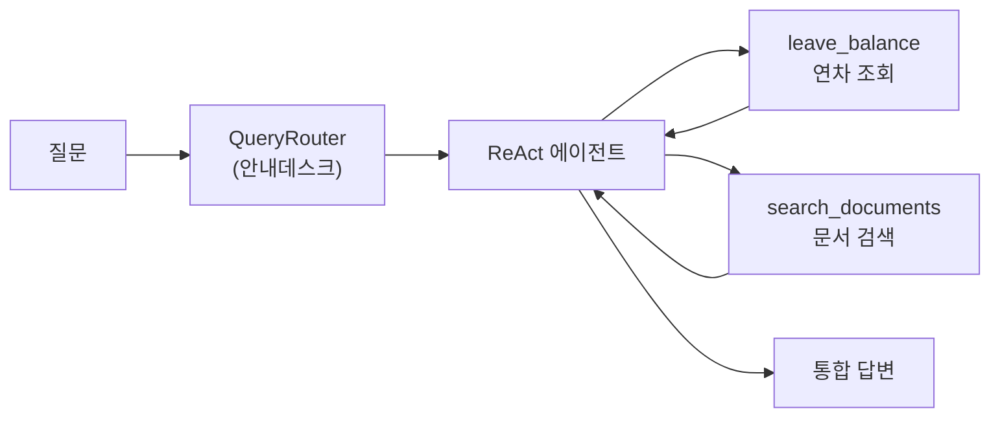

# Ch.6: "연차도, 규정도, 한번에" — 통합 에이전트 설계 (v0.6)

> 이번 버전: v0.5 → v0.6
> 한 줄 요약: AI 비서는 안내데스크다. 질문을 듣고, 맞는 담당자를 찾아 정보를 가져온다.
> 핵심 개념: QueryRouter (3단계 라우팅), MCP 도구 (@tool 데코레이터), ReAct 에이전트 (AgentExecutor)

---

## 이야기 파트

<!-- [GEMINI PROMPT: 06_chapter-opening]
path: assets/CH06/06_chapter-opening.png
A minimalist black and white technical diagram with a strict 16:9 aspect ratio
on a solid white background. No shading, no 3D effects, only clean thin line art.
The entire assembly of icons, lines, and text is perfectly centered globally
within the 16:9 frame, leaving generous and equal white space on all sides.

Center: a minimalist line-art person icon sitting at a reception desk
labeled '안내데스크'.
Left: a visitor icon with a speech bubble containing '연차 + 규정?'.
Right: two arrows from the desk — one pointing up to a minimalist line-art
cylinder database icon labeled 'DB 조회',
another pointing down to a minimalist line-art stack of papers icon
labeled '문서 검색'.
Style: scene-opener
-->


### RAG가 답 못 하는 질문

CH05에서 RAG Q&A 엔진을 완성했다.

질문을 입력하면 사내 문서에서 내용을 찾아 답해주는 엔진. 출처까지 같이 나온다. 꽤 만족스러웠다.

옆자리 이수현 씨가 다가왔다.

"이게 그 AI 비서예요? 한번 써봐도 되죠?"

"당연하죠. 뭐든 물어보세요."

이수현 씨가 채팅창에 질문을 입력했다.

"진아 씨 연차 몇 일 남았어요? 그리고 연차 신청 절차도 알려주세요."

잠시 후, AI 비서가 답했다.

```
죄송합니다. 해당 직원에 대한 정보를 찾지 못했습니다.
```

이수현 씨가 고개를 갸웃했다.

"직원 이름도 모르는 AI 비서예요?"

(아...)

RAG는 사내 문서에서 '진아'를 찾으려고 했다. 당연히 없다. 직원 연차 정보는 문서가 아니라 DB에 있다. CH02에서 PostgreSQL에 저장해둔 데이터다.

문서 검색이 아니라 DB 조회가 필요한 질문인데, AI 비서는 그 차이를 몰랐다.

---

### 두 종류의 정보

지금 만들어둔 것을 돌이켜보면:

- **v0.2**에서 직원/연차/매출 데이터를 PostgreSQL DB에 저장하는 API를 만들었다.
- **v0.4~v0.5**에서 사내 문서를 벡터DB에 넣고 검색하는 RAG 엔진을 만들었다.

두 개가 분리된 채로 존재한다. AI 비서는 RAG만 쓸 줄 알고, DB에 어떻게 접근하는지 모른다.

"진아 씨 연차 몇 개?" → PostgreSQL에서 숫자를 조회하는 질문
"연차 신청 절차?" → 취업규칙 문서를 검색하는 질문
"진아 연차 + 신청 절차?" → 둘 다 필요한 복합 질문

진짜 AI 비서가 되려면 이 두 가지를 상황에 맞게 선택하거나, 필요하면 동시에 써야 한다.

---

### 안내데스크를 떠올려보자

회사에 처음 입사한 날을 생각해보자.

낯선 건물에 들어서자마자 1층 안내데스크로 갔다.

"인사 관련 서류는 어디서 받아요?"

안내데스크 직원이 잠깐 생각하더니 답했다.

"인사팀은 3층이에요. 엘리베이터 내리셔서 오른쪽입니다."

며칠 후, 조금 복잡한 질문이 생겼다.

"신입사원 교육 신청이랑, 노트북 배정은 어디서 해요?"

"교육 신청은 3층 인사팀이고, 노트북은 2층 IT 지원팀이에요. 두 곳 다 가셔야 해요."

안내데스크는 질문을 듣고 어떤 부서의 일인지 파악해서 담당자를 연결해준다. 복합 질문이면 여러 부서로 동시에 안내한다.

AI 비서도 이렇게 되어야 한다.

질문을 보고 DB가 필요한지, 문서가 필요한지, 아니면 둘 다인지 판단한다. 판단이 끝나면 각 담당자(도구)에게 작업을 맡기고, 결과를 하나로 묶어서 답한다.

이것이 이번 챕터에서 만들 **통합 에이전트**다.

---

### 안내데스크: QueryRouter

에이전트 안에는 **QueryRouter**가 있다. 모든 질문은 이 라우터를 먼저 거친다.

라우터는 3단계로 질문을 분류한다.

**1단계 — 키워드 매칭 (빠르고 확실)**

"연차", "매출", "잔여" 같은 단어가 있으면 DB 조회 질문으로 본다.
"절차", "규정", "방법" 같은 단어가 있으면 문서 검색 질문으로 본다.
둘 다 있으면 복합 질문이다.

명확한 키워드가 없으면 2단계로 넘어간다.

**2단계 — DB 컬럼명 매칭 (기술적 표현)**

"remaining_days", "emp_no" 처럼 DB 컬럼명이 질문에 직접 들어있으면 DB 조회로 분류한다.
개발자가 직접 API를 테스트할 때 이런 표현을 쓰는 경우가 있다.

그래도 모호하면 마지막 수단을 쓴다.

**3단계 — LLM 판단 (느리지만 정확)**

LLM에게 직접 물어본다.

```
이 질문, DB 조회야 문서 검색이야? JSON으로 답해줘.
```

LLM이 `{"route": "hybrid", "reason": "연차는 DB, 규정은 문서"}` 형태로 답한다.

---

대부분의 질문은 1단계에서 끝난다. 2단계와 3단계는 폴백이다. 확실한 것부터 확인하고, 모호할 때만 더 비싼 방법을 쓰는 구조다.

<!-- [GEMINI PROMPT: 06_query-router]
path: assets/CH06/06_query-router.png
A minimalist black and white technical diagram with a strict 16:9 aspect ratio
on a solid white background. No shading, no 3D effects, only clean thin line art.
The entire assembly of icons, lines, and text is perfectly centered globally
within the 16:9 frame, leaving generous and equal white space on all sides.

A horizontal flowchart from left to right:
Start: a speech bubble icon labeled '질문 입력'.
Step 1 box labeled '1단계: 키워드 매칭' with two arrows:
  solid arrow labeled '명확' pointing to a decision box
  with three outputs: 'structured', 'unstructured', 'hybrid'.
  dashed arrow labeled '불명확' pointing to
  Step 2 box labeled '2단계: 컬럼명 매칭' with two arrows:
    solid arrow labeled '있음' pointing to 'structured'.
    dashed arrow labeled '없음' pointing to
    Step 3 box labeled '3단계: LLM 판단' pointing to '최종 결정'.
Style: architecture-flowchart
-->

*그림 6-1: 대부분의 질문은 1단계 키워드 매칭에서 끝난다. 모호할 때만 더 비싼 방법을 쓴다.*

---

### 담당자들: MCP 도구

라우터가 방향을 정하면, 에이전트가 도구 목록에서 맞는 것을 고른다.

지금 만들어둔 도구는 네 가지다.

| 도구 | 역할 | 비유 |
|------|------|------|
| `leave_balance` | 직원 연차 잔여 조회 | 인사팀 연차 담당자 |
| `sales_sum` | 부서별 매출 합계 조회 | 재무팀 집계 담당자 |
| `list_employees` | 직원 목록 조회 | 인사팀 명부 담당자 |
| `search_documents` | 문서 벡터 검색 | 문서실 사서 |

각 도구는 `@tool` 데코레이터로 선언되어 있다.

데코레이터를 붙이면 LangChain이 도구의 이름, 설명, 파라미터를 자동으로 읽는다. 에이전트는 이 정보를 보고 "이 질문에는 어떤 도구가 맞지?"를 판단한다.

독스트링이 중요한 이유가 여기 있다. 함수 설명이 불명확하면 에이전트가 엉뚱한 도구를 선택한다. 안내데스크 직원에게 각 팀이 무슨 일을 하는지 제대로 알려줘야 제대로 연결해주는 것처럼.

---

### 생각하고, 행동하고, 확인한다: ReAct

도구가 준비됐다. 이제 에이전트가 어떻게 이 도구들을 쓰는지 살펴보자.

에이전트의 두뇌는 **ReAct 패턴**으로 동작한다. Reason(추론) + Act(행동). 이름이 거창해 보이지만, 원리는 단순하다. 생각하고 행동하는 것을 반복한다.

"진아 씨 연차 얼마 남았고 연차 신청 절차는?" 이런 질문이 들어오면:

1. **생각**: "연차 잔여를 알려면 leave_balance 도구를 써야 해."
2. **행동**: `leave_balance("진아")` 호출 → DB에서 8일 반환
3. **관찰**: "8일이구나. 이제 신청 절차도 찾아야 해."
4. **생각**: "절차는 문서에 있을 거야. search_documents 써야지."
5. **행동**: `search_documents("연차 신청 절차")` 호출 → 취업규칙에서 절차 발견
6. **관찰**: "이제 다 알았다."
7. **최종 답변 생성**: "진아 씨 연차 8일 남아 있고요, 규정에 따르면 3일 전까지..."

이 과정을 최대 10회 반복할 수 있다. 한 번에 답을 못 찾으면 다시 생각하고 다시 행동한다. 도중에 오류가 나도 포기하지 않고 다른 방법을 시도한다.


*그림 6-2: 질문이 들어오면 QueryRouter가 분류하고, ReAct 에이전트가 필요한 도구를 순서대로 호출한다.*

---

### 이제 복합 질문에 답할 수 있다

동료 이수현 씨가 다시 같은 질문을 입력했다.

"진아 씨 연차 몇 일 남았어요? 그리고 연차 신청 절차도 알려주세요."

이번엔 통합 에이전트가 답했다.

```
확인해 드릴게요.

진아 씨(E003) 연차 현황:
- 총 연차: 15일  |  사용: 7일  |  잔여: 8일

연차 신청 절차 (HR_취업규칙_v1.0):
1. 그룹웨어 → 근태관리 → 연차신청
2. 사용일 3일 전까지 신청
3. 팀장 승인 후 자동 처리됩니다.

[출처: HR_취업규칙_v1.0]
```

이수현 씨가 고개를 끄덕였다.

"이제 진짜 비서 같은데요."

(드디어.)

---

### 이것만은 기억하자

- **AI 비서는 안내데스크다.** 질문을 듣고, 맞는 담당자(도구)를 찾아 정보를 가져온다.
- QueryRouter가 질문을 분류하고, `@tool` 데코레이터가 도구를 만들고, ReAct 에이전트가 반복 실행하면서 답을 완성한다.

다음 챕터(v0.7)에서는 이 에이전트를 실제로 쓰다 보면 생기는 문제를 해결한다. 같은 질문에 매번 DB를 조회하는 비용, 응답이 느려지는 문제다.

---

## 기술 파트

### 누적 구조

```
v0.1: [LLM] → [RAG]
v0.2: + [FastAPI CRUD] → [PostgreSQL]
v0.3: 문서 표준 전략 (개념)
v0.4: + [Extractor] → [Chunker] → [Embedder] → [ChromaDB]
v0.5: + [LCEL Pipeline] → [WindowMemory]
v0.6: + [QueryRouter] → [MCP Tools] → [AgentExecutor]  ← NEW
```

### 용어 정리

| 비유 | 기술 용어 | 정식 정의 |
|------|---------|----------|
| 안내데스크 전체 | **에이전트 (Agent)** | 사용자의 질문을 받아 스스로 판단하고, 필요한 도구를 선택·실행해서 최종 답변을 만들어내는 자율적 프로그램 |
| 안내데스크의 분류 기준 | **QueryRouter** | 사용자 질문을 분석해서 처리 경로(structured / unstructured / hybrid)를 결정하는 분류기 |
| 각 담당자 | **MCP 도구 (@tool)** | LangChain `@tool` 데코레이터로 선언된 함수. 에이전트가 선택해서 실행할 수 있는 원자적 작업 단위 |
| 생각→행동→관찰 반복 | **ReAct 패턴** | Reason(추론) + Act(행동)의 반복으로 복잡한 질문을 단계적으로 해결하는 에이전트 실행 전략 |
| 반복 실행기 | **AgentExecutor** | ReAct 루프를 실행하고 도구 호출을 관리하는 LangChain 컴포넌트 |

### 파일 구조

```
v0.6/
├── src/
│   ├── router.py       [실습] 3단계 QueryRouter
│   ├── mcp_tools.py    [실습] @tool 4개 (leave_balance, sales_sum, list_employees, search_documents)
│   └── agent.py        [실습] ReAct 에이전트 (IntegratedAgent)
└── app/
    ├── chat_api.py     [설명] 에이전트/RAG 모드 선택 API
    └── database.py     [참고] PostgreSQL 연결 래퍼
```

### 실습 1: QueryRouter — 3단계 질문 분류기 (router.py)

```python
# src/router.py

class QueryRouter:
    def classify_query(self, query: str) -> str:
        # 1단계: 키워드 매칭 (빠름)
        result = self._step1_rule_based(query)
        if result:
            return result

        # 2단계: DB 컬럼명 매칭 (기술적 표현)
        result = self._step2_schema_based(query)
        if result:
            return result

        # 3단계: LLM 판단 (폴백)
        if self._llm:
            result = self._step3_llm_based(query)
            if result:
                return result

        return "unstructured"  # 기본값: 문서 검색

    def _step1_rule_based(self, query: str) -> Optional[str]:
        STRUCTURED_KEYWORDS = ["잔여", "연차", "매출", "합계", "목록", "남은", ...]
        UNSTRUCTURED_KEYWORDS = ["절차", "방법", "규정", "정책", "기준", ...]

        query_lower = query.lower()
        s_hits = sum(1 for kw in STRUCTURED_KEYWORDS if kw in query_lower)
        u_hits = sum(1 for kw in UNSTRUCTURED_KEYWORDS if kw in query_lower)

        if s_hits > 0 and u_hits == 0:
            return "structured"
        if u_hits > 0 and s_hits == 0:
            return "unstructured"
        if s_hits > 0 and u_hits > 0:
            return "hybrid"
        return None  # 미결정 → 다음 단계로
```

3단계는 순서가 중요하다. 확실한 신호(키워드)를 먼저 확인하고, 모호할 때만 더 비싼 방법(LLM 호출)을 쓴다. 실전에서 대부분의 질문은 1단계에서 끝난다.

### 실습 2: @tool 데코레이터 — 에이전트용 도구 만들기 (mcp_tools.py)

```python
# src/mcp_tools.py

from langchain.tools import tool

@tool
def leave_balance(emp_no: str) -> dict:
    """직원의 연차 잔여 일수를 조회한다.

    Args:
        emp_no: 직원 번호(예: "E001") 또는 이름(예: "김민준").
    """
    rows = _run_query(
        """SELECT e.name, l.total_days, l.used_days,
                  (l.total_days - l.used_days) AS remaining_days
           FROM employees e
           JOIN leave_balance l ON e.emp_no = l.emp_no
           WHERE e.name LIKE %s""",
        (f"%{emp_no}%",),
    )
    return rows[0] if rows else {"error": f"'{emp_no}' 정보 없음"}


@tool
def search_documents(query: str, k: int = 3) -> dict:
    """사내 문서에서 관련 내용을 벡터 검색한다.

    Args:
        query: 검색 쿼리 (자연어 질문).
        k: 반환할 최대 문서 수 (기본값: 3).
    """
    collection = _get_vectorstore()
    results = collection.query(query_texts=[query], n_results=k)
    # ... 결과 가공 ...


ALL_TOOLS = [leave_balance, sales_sum, list_employees, search_documents]
```

`@tool` 데코레이터의 핵심은 **독스트링**이다. LangChain이 독스트링을 읽어서 "이 도구는 어떤 상황에 써야 하는지" LLM에게 전달한다. 독스트링이 불명확하면 에이전트가 잘못된 도구를 고른다.

### 실습 3: ReAct 에이전트 조립하기 (agent.py)

```python
# src/agent.py

from langchain.agents import AgentExecutor, create_tool_calling_agent
from langchain_core.prompts import ChatPromptTemplate, MessagesPlaceholder


class IntegratedAgent:
    def _build_agent_executor(self):
        prompt = ChatPromptTemplate.from_messages([
            ("system", SYSTEM_PROMPT),                        # 도구 사용 지침
            MessagesPlaceholder("chat_history", optional=True),
            ("human", "{input}"),
            MessagesPlaceholder("agent_scratchpad"),          # ReAct 중간 기록
        ])

        agent = create_tool_calling_agent(
            llm=self._llm,
            tools=ALL_TOOLS,   # 4개 도구 등록
            prompt=prompt,
        )

        return AgentExecutor(
            agent=agent,
            tools=ALL_TOOLS,
            return_intermediate_steps=True,  # 도구 호출 기록 반환
            max_iterations=10,               # 최대 10번 반복
        )

    def run(self, query: str) -> dict:
        query_type = self._router.classify_query(query)
        result = self._agent_executor.invoke({"input": query})

        return {
            "answer": result["output"],
            "query_type": query_type,
            "steps": result["intermediate_steps"],  # 도구 호출 로그
        }
```

`agent_scratchpad`는 ReAct 루프의 중간 기록이 쌓이는 공간이다. 에이전트가 `leave_balance 호출 → 결과 확인 → search_documents 호출 → 결과 확인` 과정을 이 공간에 적어두면서 다음 행동을 결정한다.

### 실행해보자

```bash
# PostgreSQL 실행 (Docker)
docker-compose up -d

# 의존성 설치
pip install -r requirements.txt

# 서버 실행
uvicorn app.main:app --reload
```

```bash
# 복합 질문 테스트
curl -X POST http://localhost:8000/api/chat \
  -H "Content-Type: application/json" \
  -d '{"query": "진아 연차 몇 일 남았어? 그리고 연차 신청 규정은?", "use_agent": true}'
```

<!-- [CAPTURE NEEDED: 06_api-response
  path: assets/CH06/06_api-response.png
  desc: POST /api/chat 요청 결과. structured_data(leave_balance 결과), unstructured_data(search_documents 결과), steps(도구 호출 로그 2개)가 모두 포함된 JSON 응답.
] -->

*그림 6-3: 복합 질문에 DB 조회와 문서 검색 결과가 동시에 돌아온다.*

<!-- [CAPTURE NEEDED: 06_agent-run
  path: assets/CH06/06_agent-run.png
  desc: CLI 터미널에서 IntegratedAgent.run() 실행 결과. query_type "hybrid", 답변에 연차 수치와 문서 출처가 동시에 포함된 화면.
] -->

*그림 6-4: ReAct 에이전트가 leave_balance → search_documents 순서로 도구를 호출하고 답변을 완성했다.*

### 더 알아보기

**QueryRouter 없이 에이전트만 써도 되지 않나요?**

에이전트에게 모든 판단을 맡기면 매번 LLM 호출이 발생한다. 간단한 "연차 조회" 질문도 "어떤 도구를 쓸까?" 생각하는 LLM 비용이 든다. QueryRouter가 빠른 사전 분류를 해주면 에이전트가 처음부터 방향을 잡고 시작할 수 있다.

**use_agent=false로 하면 어떻게 되나요?**

RAG 전용 모드로 동작한다. QueryRouter와 AgentExecutor를 건너뛰고 `search_documents` 도구만 직접 호출한다. DB 조회가 필요 없는 문서 검색만 할 때 응답이 더 빠르다.

**MCP(Model Context Protocol)가 뭔가요?**

AI 모델과 외부 도구를 연결하는 표준 프로토콜이다. `@tool` 데코레이터로 만드는 도구들이 이 프로토콜을 따른다. 현재 코드는 LangChain의 Tool Calling API로 동일한 원리를 구현했다. Claude, GPT-4 등 여러 LLM이 MCP를 통해 같은 도구를 사용할 수 있게 된다.
