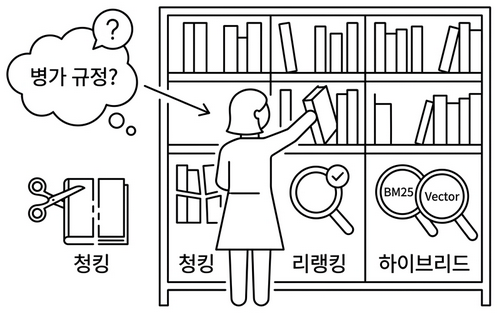

# 챕터 8. 엉뚱한 문서를 가져온다. 청킹, 리랭킹, 하이브리드

:::goal
**이번 챕터가 끝나면**

- **Fixed, Recursive, Semantic** 세 가지 청킹 전략을 비교 실험합니다
- **Cross-Encoder Reranker** 로 Top-K 검색 결과를 재정렬해 정확도를 끌어올립니다
- **BM25 + Vector** 하이브리드 검색과 **alpha 가중합** 으로 키워드와 의미 검색을 결합합니다
- "병가를 물었는데 출장이 나오는" 현상이 왜 생기는지, 어떻게 잡는지 손으로 확인합니다
:::

::::prep
**준비하기**. 실습 시작 전 한 번만 설정

### 1. 실습 폴더 이동

```bash [터미널] 폴더 이동
cd rag-start/ex08
```

파일 구조는 다음과 같습니다.

```text ex08 디렉토리
ex08/
├── docker-compose.yml
├── requirements.txt
├── data/                         # [참고] 문서·마크다운·ChromaDB
└── tuning/
    ├── step1_chunk_experiment/   # [실습] 청킹 전략 비교
    │   ├── __main__.py           # [참고] CLI 진입점
    │   ├── strategies.py         # [실습] Fixed·Recursive·Semantic 3전략
    │   ├── experiments.py        # [참고] 실험 실행기 (step 1-1~1-5)
    │   └── display.py            # [참고] Rich 출력
    ├── step2_reranker/           # [실습] Cross-Encoder 리랭커
    │   ├── __main__.py           # [참고] CLI 진입점
    │   ├── reranker.py           # [실습] CrossEncoderReranker
    │   └── experiments.py        # [참고] 리랭킹 실험 실행기
    └── step3_hybrid_search/      # [실습] BM25 + Vector 하이브리드
        ├── __main__.py           # [참고] CLI 진입점
        ├── retrievers.py         # [실습] BM25·Vector·Ensemble 검색기
        └── experiments.py        # [참고] alpha 파라미터 실험
```

### 2. 실습 환경 구축

```bash [터미널] 환경 구성. macOS / Linux
cd ex08
cp .env.example .env
python3.12 -m venv .venv
source .venv/bin/activate
docker compose up -d
pip install -r requirements.txt
```

```bash [터미널] 환경 구성. Windows
cd ex08
copy .env.example .env
py -3.12 -m venv .venv
.venv\Scripts\activate
docker compose up -d
pip install -r requirements.txt
```

### 3. 사용할 라이브러리

| 패키지 | 역할 |
|-------|------|
| `langchain-text-splitters` | Recursive·Character·Token 스플리터 |
| `langchain-experimental` | SemanticChunker (의미 기반 청킹) |
| `sentence-transformers` | 임베딩 + Cross-Encoder (BAAI/bge-reranker-v2-m3) |
| `rank-bm25` | BM25 알고리즘 (키워드 기반) |
| `chromadb` | 벡터 DB |

### 4. 실습 순서

이번 챕터는 **만들기** 가 아니라 **실험, 비교** 입니다.

1. `python -m tuning.step1_chunk_experiment --step 1-2`. 청킹 전략 비교
2. `python -m tuning.step2_reranker`. Cross-Encoder 리랭커
3. `python -m tuning.step3_hybrid_search`. BM25 + Vector 하이브리드
::::

## 8.1 "병가를 물었는데 출장 규정이 나왔다"


*그림 8-1. 같은 책장 앞에 선 사서. 가위·돋보기·면접 명단·두 권의 색인을 동시에 든 모습*

챕터 7에서 운영까지 안정화한 뒤 이틀이 지났습니다. 캐시도 돌고 토큰도 추적합니다. 슬랙 채널에 "고장났어요" 메시지가 뜸해진 걸 보며 오픈이는 커피잔에 손을 감쌌습니다. 형광등이 윙 하고 한 번 깜빡이더니 다시 안정됐습니다.

**동료**: "이거 좀 봐요."

동료가 의자를 끌고 왔습니다. 노트북 화면에 커넥트HR 채팅창이 떠 있었습니다.

**동료**: "병가 규정이 뭔지 물었는데, 출장 규정을 가져와서 답하더라고요."

*뭐라고?*

오픈이가 동료의 노트북을 당겨 봤습니다. 화면에는 "병가 신청 절차를 알려줘"라는 질문 아래 출장 규정이 장황하게 달려 있었습니다. 터미널을 열어 검색 로그를 확인했습니다.

<div class="terminal-log">
  <div class="tl-chrome">
    <div class="tl-traffic"><span></span><span></span><span></span></div>
    <div class="tl-title">ex08 — search_log · "병가 신청 절차"</div>
    <div class="tl-spacer"></div>
  </div>
  <div class="tl-body">
    <div><span class="tl-label">검색 결과</span> <span class="tl-dim">|</span> <span class="tl-str">"병가 신청 절차"</span></div>
    <div class="tl-section"><span class="tl-label">Rank 1</span>&nbsp;&nbsp;<span class="tl-key">HR_취업규칙_v1.0 (p.3)</span> <span class="tl-dim">·</span> <span class="tl-num">유사도 0.851</span></div>
    <div class="tl-kv-row">"제14조(출장) 업무상 출장 시 소요 경비는 실비로 정산하며… <span class="tl-val">제15조(병가)</span> 질병이나 부상으로"</div>
    <div class="tl-section"><span class="tl-label">Rank 2</span>&nbsp;&nbsp;<span class="tl-key">HR_취업규칙_v1.0 (p.4)</span> <span class="tl-dim">·</span> <span class="tl-num">유사도 0.823</span></div>
    <div class="tl-kv-row">"출장 기간 중 질병이 발생한 경우 해당 기간은 병가로 전환할 수 있으며…"</div>
    <div class="tl-section"><span class="tl-label">Rank 3</span>&nbsp;&nbsp;<span class="tl-key">HR_출장규정_v2.0 (p.1)</span> <span class="tl-dim">·</span> <span class="tl-num">유사도 0.798</span></div>
    <div class="tl-kv-row">"국내 출장은 당일 및 숙박 출장으로 구분하며…"</div>
    <div class="tl-divider">
      <span class="tl-val">상위 3건 중 2건이 출장 규정</span><span class="tl-cursor"></span>
    </div>
  </div>
</div>

*그림 8-2. 상위 3건 중 2건이 출장 규정입니다. 1위 청크에는 병가 뒷부분과 출장 앞부분이 한 덩어리로 섞여 있습니다*

상위 3건 중 2건이 출장 규정이었습니다. 1위 문서를 자세히 보니 이유가 보였습니다. 챕터 4에서 500자마다 기계적으로 잘라 둔 청크에서 **병가 규정 뒷부분과 출장 규정 앞부분이 한 덩어리** 로 섞여 있었습니다.

**동료**: "에이전트가 멍청한 건가요?"

**오픈이**: "아니요. LLM은 받은 문서로 성실히 답한 거예요. 엉뚱한 문서를 가져다 준 건 검색 단계입니다."

*에이전트도 다듬고 캐시도 붙이고 모니터링까지 달았는데. 검색의 뿌리가 썩어 있으면 그 위에 뭘 얹어도 소용없다.*

건너편 자리에서 팀장이 모니터에서 눈을 떼지 않은 채 한마디를 던졌습니다.

**팀장**: "사서가 책을 잘 찾아주냐, 책장을 잘 정리했냐. 뭐가 먼저예요?"

## 8.2 이 챕터의 세 실험

책장 정리. 팀장의 한마디가 머릿속에 걸렸습니다. 검색 결과 로그를 다시 열어 보니 문제가 하나가 아니었습니다. 서랍에서 수첩을 꺼내 펼쳤습니다.

:::memo
**- 문제 정리 -**

1. **자르는 방식**
   - 500자 고정이라 병가 규정 뒷부분과 출장 규정 앞부분이 한 덩어리
   - 글자 수가 아니라 의미 단위로 잘라야 함
2. **가져온 뒤 확인**
   - 유사도 순위 그대로 믿고 있음
   - 진짜 답과 먼 문서도 상위에 섞여 올라옴
3. **검색 방법 자체**
   - 벡터 검색 하나만 쓰고 있음
   - 키워드가 정확히 맞는 경우도 놓칠 수 있음
:::

수첩을 덮고 화이트보드 앞으로 걸어갔습니다. 마커 뚜껑을 딸깍 열고 세 칸을 그렸습니다. 이번 챕터는 새 기능을 만들지 않습니다. 챕터 4부터 쌓아 온 검색 파이프라인을 세 방향에서 실험하고 개선합니다.

<div class="rag-pipeline-box">
  <div class="rag-pipeline-title">그림 8-3. 챕터 8의 세 실험. 청킹 → 리랭킹 → 하이브리드 검색</div>
  <div class="rag-pipeline">
    <div class="rag-step">
      <div class="s-num">1</div>
      <div class="s-title">청킹 전략</div>
      <div class="s-desc">Fixed · Recursive · Semantic<br>세 가지 자르기 비교</div>
      <div class="s-meta">가위에서 돋보기로</div>
    </div>
    <div class="rag-arrow">→</div>
    <div class="rag-step">
      <div class="s-num">2</div>
      <div class="s-title">리랭킹</div>
      <div class="s-desc">Cross-Encoder 로<br>Top-K 재정렬</div>
      <div class="s-meta">서류 위에 면접관</div>
    </div>
    <div class="rag-arrow">→</div>
    <div class="rag-step">
      <div class="s-num">3</div>
      <div class="s-title">하이브리드</div>
      <div class="s-desc">BM25 + Vector<br>alpha 가중합</div>
      <div class="s-meta">두 사서를 합치기</div>
    </div>
  </div>
</div>

세 실험 모두 **검색 단계** 를 손봅니다. LLM 자체나 에이전트 구조는 그대로 둡니다.

이번 챕터의 도구를 모두 적용했을 때 검색 결과가 어떻게 달라지는지 미리 그려 봅니다.

<div class="sp-figure">
  <div class="sp-figure-title">그림 8-4. Before / After 미리보기. 같은 질문 "병가 신청 절차"에 대한 검색 결과</div>
  <div class="sp-compare">
    <div class="sp-compare-block bad">
      <div class="sp-compare-label">Before. 챕터 4 그대로</div>
      <div class="sp-compare-content">
        <div class="sp-row warm">
          <span class="sp-row-label">1위</span>
          <span class="sp-row-value">출장 규정 (병가 뒷부분과 한 덩어리)</span>
        </div>
        <div class="sp-row warm">
          <span class="sp-row-label">2위</span>
          <span class="sp-row-value">출장 경비 (질병 발생 시 병가 전환)</span>
        </div>
        <div class="sp-row">
          <span class="sp-row-label">3위</span>
          <span class="sp-row-value">병가 신청 (진짜 답이 3위로 밀림)</span>
        </div>
        <div class="sp-row warm">
          <span class="sp-row-label">상태</span>
          <span class="sp-row-value">상위 3건 중 2건이 출장</span>
        </div>
      </div>
    </div>
    <div class="sp-compare-block good">
      <div class="sp-compare-label">After. 청킹+리랭킹+하이브리드 적용</div>
      <div class="sp-compare-content">
        <div class="sp-row accent">
          <span class="sp-row-label">1위</span>
          <span class="sp-row-value">병가 신청 절차</span>
        </div>
        <div class="sp-row accent">
          <span class="sp-row-label">2위</span>
          <span class="sp-row-value">병가 증빙 서류</span>
        </div>
        <div class="sp-row accent">
          <span class="sp-row-label">3위</span>
          <span class="sp-row-value">병가 기간과 한도</span>
        </div>
        <div class="sp-row accent">
          <span class="sp-row-label">상태</span>
          <span class="sp-row-value">상위 3건 모두 병가</span>
        </div>
      </div>
    </div>
  </div>
  <div class="sp-callout">청킹은 자르는 법을 가위에서 돋보기로, 리랭킹은 서류 통과자에 면접관을 붙이고, 하이브리드는 의미 검색과 키워드 검색을 함께 돌립니다. 세 도구를 모두 다 쓰는 것이 아니라 문서 성격에 맞게 골라 씁니다.</div>
</div>

## 8.3 가위 대신 돋보기를 쥐어 주자 - 청킹

**오픈이**: "지금 사서는 책을 500자씩 가위로 잘라서 서랍에 넣어 둔 거거든요. 가위가 병가 조항 중간을 지나가면서 출장 규정이랑 한 조각이 된 거예요."

**팀장**: "그럼 가위 대신 뭘 쥐어 줄 수 있을까요?"

잠시 생각했습니다. 문서에는 구조가 있습니다. 빈 줄, 제목, 주제 전환. 그걸 읽을 줄 아는 사서라면 엉뚱한 곳에서 자르지 않을 겁니다.

*가위가 아니라 돋보기를 줘야 한다.*

**오픈이**: "자르는 방법부터 바꿔야 할 것 같아요. 세 가지 방법을 보여 드릴게요."

오픈이가 화이트보드에 사내 규정 텍스트를 적었습니다. "제15조 병가… 제16조 출장… 제17조 연차…" 마커 세 자루를 꺼내 놓았습니다.

:::note
**실습 흐름**

1. `tuning/step1_chunk_experiment/strategies.py` 의 TODO를 채웁니다
2. `fixed_size_chunking()` 작성 → `--step 1-1` 로 크기·오버랩 조합 실험
3. `recursive_character_chunking()` 작성
4. `semantic_chunking()` 작성
5. `--step 1-2` 로 세 전략을 같은 문서에 돌려 한 번에 비교
:::

### 8.3.1 고정 청킹(Fixed Chunking)

오픈이가 빨간 마커를 집었습니다. 자를 꺼내 화이트보드에 대고 500자마다 줄을 그었습니다. 병가 규정 뒤쪽과 출장 규정 앞쪽이 한 칸에 들어갔습니다.

**동료**: "이러니까 섞이죠."

**제목만 보고 찾는 사서**. 챕터 4에서 우리가 만든 사서입니다. 문서를 500자 단위로 기계적으로 잘라 둡니다. "병가"와 "출장"이 같은 문서에 있으면 한 청크에 두 내용이 섞입니다.

`tuning/step1_chunk_experiment/strategies.py` 를 열고 TODO의 `pass` 를 지우고 아래 코드를 작성합니다.

```python [실습 1] tuning/step1_chunk_experiment/strategies.py. 고정 크기 청킹
def fixed_size_chunking(text: str, chunk_size: int = 500, overlap: int = 100) -> list[str]:
    # TODO: text를 chunk_size 단위로 잘라 리스트에 추가합니다.
    chunks = []
    start = 0
    # 1. start부터 chunk_size만큼 잘라냄
    while start < len(text):
        end = min(start + chunk_size, len(text))
        chunk = text[start:end]
        # 2. 공백만 있는 청크는 건너뜀
        if chunk.strip():
            chunks.append(chunk.strip())
        if end >= len(text):
            break
        # 3. 다음 시작 위치는 end - overlap (겹침 구간)
        start = end - overlap
    return chunks
```

`chunk_size` 는 한 조각의 최대 글자 수, `overlap` 은 조각과 조각이 겹치는 글자 수입니다. 겹침 구간을 두는 이유는 경계에서 잘린 문장이 양쪽 조각에 모두 포함되게 하려는 것입니다. 챕터 4에서 `chunk_size=500`, `overlap=100` 으로 설정했던 함수를 크기와 오버랩을 바꿔 가며 실험합니다.

```bash [터미널] 실험 1-1. Fixed 청킹 크기 × 오버랩 조합 비교 (9개 조합)
python -m tuning.step1_chunk_experiment --step 1-1
```

:::tip
**Fixed 청킹 실험에서 생각해 볼 것들**

- **크기가 크면(1000자)**: 정보가 많아 LLM이 답하기 좋지만, 관련 없는 내용도 섞이고 토큰도 많이 씁니다.
- **크기가 작으면(300자)**: 주제가 깔끔하지만, 맥락이 잘려 "이게 무슨 말이지?" 하는 청크가 생깁니다.
- **오버랩이 크면(30%)**: 경계에서 문맥이 끊기지 않지만, 같은 내용이 여러 청크에 중복됩니다.
- **오버랩이 작으면(10%)**: 중복이 적지만, 경계에서 잘린 문장이 검색에 안 걸릴 수 있습니다.

사내 규정처럼 조항이 짧은 문서는 300~500자, 매뉴얼처럼 한 주제가 긴 문서는 800~1000자가 적합합니다.
:::

### 8.3.2 재귀 청킹(Recursive Chunking)

오픈이가 파란 마커로 바꿨습니다. 이번에는 자를 치우고, 텍스트를 읽으며 빈 줄이 있는 곳에 줄을 그었습니다. 제15조, 제16조, 제17조가 각각 한 칸씩 분리됐습니다.

**팀장**: "그런데 빈 줄이 없는 문서도 있잖아요."

**오픈이**: "그래서 빈 줄, 줄바꿈, 마침표, 공백 순서로 찾아요. 가장 자연스러운 경계부터 시도합니다."

**문단을 보고 찾는 사서**. 문서에는 보통 빈 줄이 있습니다. "제1조"와 "제2조" 사이, 단락 전환 지점입니다. 이 사서는 빈 줄이 보이면 먼저 거기서 끊습니다. 주제가 섞일 확률이 줄어듭니다.

`tuning/step1_chunk_experiment/strategies.py` 를 열고 TODO의 `pass` 를 지우고 아래 코드를 작성합니다.

```python [실습 1] tuning/step1_chunk_experiment/strategies.py. 재귀 문자 분할
def recursive_character_chunking(text: str, chunk_size: int = 500, overlap: int = 100) -> list[str]:
    # TODO: RecursiveCharacterTextSplitter로 문단·문장 경계를 우선 분할합니다.
    from langchain_text_splitters import RecursiveCharacterTextSplitter

    # 1. 분할 기준 우선순위: 빈 줄 → 줄바꿈 → 마침표 → 공백
    splitter = RecursiveCharacterTextSplitter(
        chunk_size=chunk_size,
        chunk_overlap=overlap,
        separators=["\n\n", "\n", "。", ".", " ", ""],
    )
    # 2. 가장 자연스러운 경계부터 시도하며 분할
    return splitter.split_text(text)
```

`RecursiveCharacterTextSplitter` 는 `langchain-text-splitters` 패키지가 제공하는 스플리터입니다. `separators` 가 핵심인데, "자를 수 있는 가장 자연스러운 경계"를 우선순위대로 찾습니다. 같은 500자라도 문단이나 문장 경계에서 끊기니 주제 혼입이 줄어듭니다.

<div class="sp-figure">
  <div class="sp-figure-title">그림 8-5. Recursive Separators 탐색 순서. 위에서 못 찾으면 아래로 내려갑니다</div>
  <div class="sp-flow">
    <div class="sp-step accent">
      <span class="sp-step-num">1순위</span>
      <div class="sp-step-title">\n\n</div>
      <div class="sp-step-desc">빈 줄 (문단)<br>가장 자연스러운 경계</div>
    </div>
    <div class="sp-flow-arrow">→</div>
    <div class="sp-step info">
      <span class="sp-step-num">2순위</span>
      <div class="sp-step-title">\n</div>
      <div class="sp-step-desc">줄바꿈<br>문단 내 줄 구분</div>
    </div>
    <div class="sp-flow-arrow">→</div>
    <div class="sp-step warm">
      <span class="sp-step-num">3순위</span>
      <div class="sp-step-title">.</div>
      <div class="sp-step-desc">마침표 (문장)<br>문장 단위 분할</div>
    </div>
    <div class="sp-flow-arrow">→</div>
    <div class="sp-step">
      <span class="sp-step-num">최후</span>
      <div class="sp-step-title">" "</div>
      <div class="sp-step-desc">공백 (단어)<br>경계가 전혀 없을 때</div>
    </div>
  </div>
  <div class="sp-callout">자연스러운 경계부터 먼저 시도하고, 못 찾으면 다음 단계로 내려갑니다. 같은 `chunk_size` 라도 잘린 위치는 Fixed와 다릅니다.</div>
</div>

Fixed와 같은 `chunk_size`, `overlap` 파라미터를 쓰지만 자르는 기준이 다릅니다. Fixed는 글자 수만 세지만 Recursive는 문단·문장 경계를 먼저 찾습니다.

### 8.3.3 의미 청킹(Semantic Chunking)

오픈이가 마지막으로 초록 마커를 꺼냈습니다. 이번에는 글자 수도, 빈 줄도 보지 않았습니다. 문장을 하나씩 읽으며 "여기서 주제가 바뀐다" 싶은 곳에 줄을 그었습니다.

**동료**: "사람이 읽는 것처럼 하네요."

**오픈이**: "임베딩으로 문장끼리 의미 거리를 재서, 거리가 확 벌어지는 곳에서 자르는 거예요."

**목차를 보고 찾는 사서**. 더 꼼꼼한 사서입니다. 문서를 자를 때 "여기서 주제가 바뀌네?"를 감지합니다. 연차 이야기에서 출장 이야기로 넘어가는 지점을 알아채고 거기서 끊습니다. 빈 줄이 없어도 내용 흐름을 읽습니다.

`tuning/step1_chunk_experiment/strategies.py` 를 열고 TODO의 `pass` 를 지우고 아래 코드를 작성합니다.

```python [실습 1] tuning/step1_chunk_experiment/strategies.py. 의미 기반 청킹
def semantic_chunking(
    text: str,
    embedding_model: str = "jhgan/ko-sroberta-multitask",
    percentile: int = 70,
) -> list[str]:
    # TODO: HuggingFaceEmbeddings + SemanticChunker로 의미 단위 청킹합니다.
    from langchain_community.embeddings import HuggingFaceEmbeddings
    from langchain_experimental.text_splitter import SemanticChunker

    # 1. 임베딩 모델 로드
    embeddings = HuggingFaceEmbeddings(model_name=embedding_model)
    # 2. percentile 기준선으로 의미 전환 감지
    chunker = SemanticChunker(
        embeddings,
        breakpoint_threshold_type="percentile",
        breakpoint_threshold_amount=percentile,
    )
    # 3. 의미가 크게 달라지는 곳에서 분할
    return chunker.split_text(text)
```

`HuggingFaceEmbeddings` 는 문장을 벡터로 바꿔 주는 래퍼이고, `SemanticChunker` 는 문장 벡터 사이의 거리를 계산해 분할 지점을 결정합니다. `embedding_model` 에 한국어 임베딩 모델(`jhgan/ko-sroberta-multitask`)을 넘기면 한국어 문맥을 이해합니다.

`percentile=70` 은 검문소의 민감도입니다. 문장과 문장 사이에는 "의미 거리"가 있습니다. 같은 주제를 이어가면 울타리가 낮고, 주제가 바뀌면 울타리가 높아집니다. `percentile` 은 "얼마나 높은 울타리에서 자를까"를 정하는 기준선입니다.

<div class="sp-figure">
  <div class="sp-figure-title">그림 8-6. 울타리 비유. 기준선 위로 튀어나온 곳에서 자릅니다</div>
  <div class="sp-flow">
    <div class="sp-step info">
      <span class="sp-step-num">낮은 울타리</span>
      <div class="sp-step-title">병가① ↔ 병가②</div>
      <div class="sp-step-desc">의미 거리 0.1<br>같은 주제, 안 자름</div>
    </div>
    <div class="sp-flow-arrow">·</div>
    <div class="sp-step warm">
      <span class="sp-step-num">높은 울타리</span>
      <div class="sp-step-title">병가 ↔ 출장</div>
      <div class="sp-step-desc">의미 거리 0.8<br>주제 전환, 여기서 자름</div>
    </div>
    <div class="sp-flow-arrow">·</div>
    <div class="sp-step info">
      <span class="sp-step-num">낮은 울타리</span>
      <div class="sp-step-title">출장① ↔ 출장②</div>
      <div class="sp-step-desc">의미 거리 0.2<br>같은 주제, 안 자름</div>
    </div>
    <div class="sp-flow-arrow">·</div>
    <div class="sp-step accent">
      <span class="sp-step-num">중간 울타리</span>
      <div class="sp-step-title">출장 ↔ 연차</div>
      <div class="sp-step-desc">의미 거리 0.6<br>기준선 70 위, 자름</div>
    </div>
  </div>
  <div class="sp-callout">울타리가 기준선 위로 튀어나온 곳이 "주제가 바뀌는 곳"입니다. <strong>기준선을 높이면(percentile=95)</strong> 아주 높은 울타리만 잡아서 덜 자르고, <strong>기준선을 낮추면(percentile=50)</strong> 중간 울타리도 잡아서 더 자릅니다.</div>
</div>

기준선의 높이를 바꾸면 결과가 어떻게 달라지는지 봅니다.

<div class="sp-figure">
  <div class="sp-figure-title">그림 8-7. 기준선 높이에 따른 청크 결과 비교</div>
  <div class="sp-compare">
    <div class="sp-compare-block">
      <div class="sp-compare-label">percentile 95 (둔감)</div>
      <div class="sp-compare-content">
        <div class="sp-row">
          <span class="sp-row-label">자르는 곳</span>
          <span class="sp-row-value">아주 큰 변화만</span>
        </div>
        <div class="sp-row">
          <span class="sp-row-label">결과</span>
          <span class="sp-row-value">청크 큼 · 적게 잘림</span>
        </div>
        <div class="sp-row warm">
          <span class="sp-row-label">위험</span>
          <span class="sp-row-value">병가 + 출장 같이 묶임</span>
        </div>
      </div>
    </div>
    <div class="sp-compare-block good">
      <div class="sp-compare-label">percentile 70 (권장)</div>
      <div class="sp-compare-content">
        <div class="sp-row accent">
          <span class="sp-row-label">자르는 곳</span>
          <span class="sp-row-value">주제가 바뀌는 곳</span>
        </div>
        <div class="sp-row accent">
          <span class="sp-row-label">결과</span>
          <span class="sp-row-value">조항별로 깔끔히 분리</span>
        </div>
        <div class="sp-row accent">
          <span class="sp-row-label">균형</span>
          <span class="sp-row-value">너무 잘게도, 너무 굵게도 안 됨</span>
        </div>
      </div>
    </div>
    <div class="sp-compare-block">
      <div class="sp-compare-label">percentile 50 (예민)</div>
      <div class="sp-compare-content">
        <div class="sp-row">
          <span class="sp-row-label">자르는 곳</span>
          <span class="sp-row-value">조금만 달라져도</span>
        </div>
        <div class="sp-row">
          <span class="sp-row-label">결과</span>
          <span class="sp-row-value">청크 작음 · 많이 잘림</span>
        </div>
        <div class="sp-row warm">
          <span class="sp-row-label">위험</span>
          <span class="sp-row-value">같은 조항도 토막남</span>
        </div>
      </div>
    </div>
  </div>
  <div class="sp-callout">숫자가 클수록 둔감, 작을수록 예민. 사내 규정처럼 조항 단위가 분명한 문서는 70 근처가 무난합니다.</div>
</div>

Recursive와 달리 `chunk_size` 파라미터가 없습니다. `percentile` 값 하나로 청크 크기가 자동으로 결정됩니다. 값을 낮추면 더 자주 자르고, 높이면 덜 자릅니다.

### 8.3.4 세 전략 비교

화이트보드에 빨강·파랑·초록 줄이 나란히 그어져 있습니다. 같은 텍스트인데 자르는 방법에 따라 결과가 다릅니다.

**팀장**: "어떤 게 제일 나은지 숫자로 봐야죠."

세 함수를 모두 채웠으면 한 번에 비교합니다. `--step 1-2` 가 3전략 비교 실험입니다.

```bash [터미널] 실험 1-2. Fixed vs Recursive vs Semantic
python -m tuning.step1_chunk_experiment --step 1-2
```

*그림 8-8. 같은 1098자 문서에 세 전략을 적용한 결과*

| 전략 | 청크 수 | 평균 크기 | 실행 시간 | 특징 |
|------|--------|----------|----------|------|
| Fixed (500자) | 3 | 399자 | 0.000s | 균일한 크기, 빠른 처리 |
| Recursive | 3 | 365자 | 4.4s | 문단·문장 경계 존중 |
| **Semantic (p=70)** | **7** | **155자** | 7.0s | **의미 단위 분할, 최고 품질** |

같은 문서인데 결과가 다릅니다. Fixed는 글자 수만 세서 3조각(평균 399자), Recursive는 문단 경계를 찾아서 3조각(평균 365자)으로 비슷하지만 잘린 위치가 다릅니다. Semantic은 의미 전환을 감지해 7조각(평균 155자)으로 가장 잘게 나눴습니다.

Fixed는 단순 문자열 연산이라 0초에 가깝고, Recursive와 Semantic은 임베딩 모델을 로드하느라 각각 4~7초가 걸립니다. 실서비스에서는 문서를 인덱싱할 때 한 번만 돌리므로 속도보다 품질이 중요합니다. 청크가 작아진 만큼 "병가"와 "출장"이 한 조각에 섞일 가능성이 줄어듭니다.

## 8.4 면접관을 붙여 다시 확인한다 - 리랭킹

청킹 실험 결과를 보던 오픈이가 고개를 갸웃했습니다.

**오픈이**: "Semantic으로 잘라도 상위 10개 중에 관련 없는 문서가 섞여 들어올 수 있잖아요."

**팀장**: "사람 뽑을 때 서류 심사만으로 뽑나요?"

**동료**: "면접을 보죠. 서류 통과한 후보를 다시 앉혀 놓고 하나씩 따져 보는 거잖아요."

오픈이가 화이트보드에 서류 10장을 그렸습니다. 벡터 검색이 가져온 Top-10입니다. 그중 관련 있는 건 2~3장, 나머지는 비슷해 보이지만 엉뚱한 문서입니다. 오픈이가 한 장씩 질문과 대조하며 체크 표시를 했습니다. 10장이 3장으로 줄었습니다.

**면접관을 붙이는 사서**. 벡터 검색(Bi-Encoder)은 서류 심사입니다. 질문과 문서를 따로 벡터로 만들어 거리를 잽니다. 빠르지만 대충 봅니다. 리랭커(Cross-Encoder)는 면접관입니다. 질문과 문서를 한 번에 모델에 넣어 직접 "이 문서가 이 질문에 맞나?"를 판단합니다. 느리지만 정확합니다.

**오픈이**: "서류로 10명 뽑고, 면접으로 3명 추리는 거네요."

:::note
**실습 흐름**

1. `tuning/step2_reranker/reranker.py` 의 TODO를 채웁니다
2. `python -m tuning.step2_reranker` 로 기본 실험 (fetch_k=10, top_k=5)
3. `--fetch-k`, `--top-k` 를 바꿔서 후보 수와 최종 수의 관계를 확인합니다
:::

<div class="sp-figure">
  <div class="sp-figure-title">그림 8-9. 리랭킹 2단계 전략. Bi-Encoder(서류) → Cross-Encoder(면접)</div>
  <div class="sp-flow">
    <div class="sp-step info">
      <span class="sp-step-num">1단계</span>
      <div class="sp-step-title">Bi-Encoder</div>
      <div class="sp-step-desc">서류 심사<br>빠르게 Top-20</div>
    </div>
    <div class="sp-flow-arrow">→</div>
    <div class="sp-step accent">
      <span class="sp-step-num">2단계</span>
      <div class="sp-step-title">Cross-Encoder</div>
      <div class="sp-step-desc">면접<br>정밀하게 Top-3</div>
    </div>
    <div class="sp-flow-arrow">→</div>
    <div class="sp-step">
      <span class="sp-step-num">결과</span>
      <div class="sp-step-title">LLM 입력</div>
      <div class="sp-step-desc">3개 문서가<br>답변 근거로 전달</div>
    </div>
  </div>
  <div class="sp-callout">Bi-Encoder는 질문과 문서를 따로 벡터로 만들어 거리를 잽니다(빠름·대충). Cross-Encoder는 질문과 문서를 한 번에 모델에 넣어 직접 점수를 매깁니다(느림·정확). 그래서 서류로 많이 뽑고 면접으로 추리는 2단계 전략을 씁니다.</div>
</div>

면접관이 후보를 한 명씩 앉혀 놓고 질문과 대조하는 코드를 작성합니다. `tuning/step2_reranker/reranker.py` 를 열고 TODO의 `pass` 를 지우고 아래 코드를 작성합니다.

```python [실습 2] tuning/step2_reranker/reranker.py. CrossEncoderReranker
from sentence_transformers import CrossEncoder

class CrossEncoderReranker:
    def __init__(self, model_name: str = "BAAI/bge-reranker-v2-m3"):
        self.model = CrossEncoder(model_name)

    def rerank(self, query: str, documents: list[dict], top_k: int = 5) -> list[dict]:
        # TODO: 질문과 문서를 쌍으로 만들어 관련성 점수를 매깁니다.
        # 1. (질문, 문서내용) 쌍을 만듦
        pairs = [(query, doc["content"]) for doc in documents]
        # 2. Cross-Encoder로 관련성 점수 계산
        scores = self.model.predict(pairs)
        # 3. 각 문서에 점수 추가
        for doc, score in zip(documents, scores):
            doc["cross_encoder_score"] = float(score)
        # 4. 점수 내림차순 정렬 → 상위 top_k개 반환
        ranked = sorted(documents, key=lambda x: x["cross_encoder_score"], reverse=True)
        return ranked[:top_k]
```

`documents` 는 `list[dict]` 형태입니다. 벡터 검색 결과가 `{"content": "...", "score": 0.85}` 딕셔너리로 넘어옵니다. `rerank()` 는 각 문서에 `cross_encoder_score` 키를 추가한 뒤 점수 순으로 정렬하고 상위 `top_k` 개만 반환합니다. `CrossEncoder` 는 `sentence-transformers` 패키지가 제공하는 클래스이고, `BAAI/bge-reranker-v2-m3` 는 한국어를 지원하는 Cross-Encoder 모델입니다. `predict()` 에 (질문, 문서) 쌍을 넘기면 -10~10 범위의 관련성 점수를 돌려줍니다.

```bash [터미널] 실험 2-1. 기본 실험. 10개 가져와서 5개로 추림
python -m tuning.step2_reranker
```

```bash [터미널] 실험 2-2. 넓게 가져와서 좁게 추리기. 20개 → 3개
python -m tuning.step2_reranker --fetch-k 20 --top-k 3
```

*그림 8-10. 리랭킹 전(Vector Search 순위)*

| 순위 | 문서 | 점수 |
|------|------|------|
| 1 | 연차 신청은 3일 전 서면 제출 | 0.470 |
| 2 | 연차유급휴가는 15일 부여 | 0.450 |
| 3 | 재택근무 신청 가능 | 0.400 |
| 4 | 휴가 시기 조정 가능 | 0.380 |
| 5 | 성과 평가 기준 | 0.320 |

1~5위 점수 차이가 0.15에 불과합니다. 누가 진짜 적격자인지 구분이 안 됩니다.

*그림 8-11. 리랭킹 후(Cross-Encoder 순위)*

| 순위 | 문서 | CE 점수 |
|------|------|---------|
| **1** | **연차 신청은 3일 전 서면 제출** | **0.888** |
| 2 | 연차유급휴가는 15일 부여 | 0.009 |
| 3 | 재택근무 신청 가능 | 0.001 |
| 4 | 출장비 정산 | 0.000 |
| 5 | 육아휴직 신청 | 0.000 |

면접관(Cross-Encoder)이 한 명씩 대화하자 1위(0.888)와 2위(0.009) 사이에 확연한 격차가 생겼습니다. "연차 신청"을 직접 다루는 1위 문서만 0.888로 살아남고, 비슷해 보이지만 다른 주제인 문서들은 0점대로 떨어졌습니다.

`--fetch-k 20 --top-k 3` 으로 바꿔 보면 후보를 넓게 잡을수록 면접관이 더 좋은 문서를 찾아낼 수 있지만, 처리 시간도 늘어나는 걸 확인할 수 있습니다.

:::tip
**리랭킹 실험에서 생각해 볼 것들**

- **초기 검색 범위(fetch_k)**: 10개를 가져와 5개로 추리면 후보가 적고, 50개를 가져오면 정확도는 올라가지만 Cross-Encoder 추론 시간이 늘어납니다. 문서당 약 0.1초씩 걸립니다.
- **모델 선택**: `bge-reranker-v2-m3` 는 한국어 지원이 좋지만 용량이 큽니다. 영어 위주라면 `ms-marco-MiniLM` 이 가볍습니다.
- **리랭킹 없이도 괜찮은 경우**: 문서 수가 적거나(100건 이하) 검색 품질이 이미 충분하면 리랭킹 없이 벡터 검색만으로 됩니다. 비용 대비 효과를 따져 보세요.
:::

## 8.5 두 검색을 섞는다 - 하이브리드 검색

리랭킹 결과를 확인한 팀장이 한마디를 얹었습니다.

**팀장**: "면접관도 만능은 아니에요. 벡터 검색이 애초에 놓친 문서는 면접 대상에도 못 올라오잖아요."

**오픈이**: "맞아요. 벡터 검색이 '휴가 사용' 같은 비슷한 의미는 잘 잡는데, '연차 신청'이라는 정확한 단어가 들어간 문서는 놓칠 때가 있거든요."

**팀장**: "그럼 단어로 찾는 검색을 하나 더 돌려 봐요."

**두 검색을 섞는 사서**. 벡터 검색은 "휴가 사용"처럼 의미가 비슷한 문서를 잘 찾고, BM25는 "연차 신청"이라는 단어가 정확히 들어간 문서를 잘 찾습니다. 각자의 강점이 다르니 둘을 합치면 좋겠는데, 문제가 하나 있습니다.

두 검색이 매기는 점수의 단위가 다릅니다. 시험 점수로 비유하면, 수학은 100점 만점이고 영어는 990점 만점인 셈입니다. 이걸 그냥 더하면 영어 점수가 압도적으로 커져서 수학은 의미가 없어집니다. 그래서 먼저 만점을 맞추고, 그 다음 어느 과목을 더 중요하게 볼지 정합니다.

<div class="sp-figure">
  <div class="sp-figure-title">그림 8-12. 정규화. 만점이 다른 두 점수를 0~1로 맞춰야 합칠 수 있습니다</div>
  <div class="sp-compare">
    <div class="sp-compare-block">
      <div class="sp-compare-label">정규화 전 (만점이 다름)</div>
      <div class="sp-compare-content">
        <div class="sp-row">
          <span class="sp-row-label">수학</span>
          <span class="sp-row-value">100점 만점 · A=92, B=87, C=12</span>
        </div>
        <div class="sp-row warm">
          <span class="sp-row-label">영어</span>
          <span class="sp-row-value">990점 만점 · A=880, B=450, C=990</span>
        </div>
        <div class="sp-row warm">
          <span class="sp-row-label">단순 합산</span>
          <span class="sp-row-value">C=1002로 1위 (수학 12점인데?)</span>
        </div>
      </div>
    </div>
    <div class="sp-compare-block good">
      <div class="sp-compare-label">정규화 후 (둘 다 100점 만점)</div>
      <div class="sp-compare-content">
        <div class="sp-row accent">
          <span class="sp-row-label">수학</span>
          <span class="sp-row-value">A=100, B=94, C=0</span>
        </div>
        <div class="sp-row accent">
          <span class="sp-row-label">영어</span>
          <span class="sp-row-value">A=80, B=0, C=100</span>
        </div>
        <div class="sp-row accent">
          <span class="sp-row-label">합산 결과</span>
          <span class="sp-row-value">A=180으로 1위 (둘 다 잘함)</span>
        </div>
      </div>
    </div>
  </div>
  <div class="sp-callout">검색도 똑같습니다. 수학 = Vector(만점 1.0), 영어 = BM25(만점 수십). 만점을 맞추지 않으면 BM25 점수가 압도해서 Vector는 의미가 없어집니다.</div>
</div>

만점을 맞췄으면 이제 두 점수를 합칩니다. 이때 **가중치(alpha)** 로 비중을 조절합니다. "어느 과목을 더 중요하게 볼까"를 0~1 사이 숫자로 표현한 것입니다.

<div class="sp-figure">
  <div class="sp-figure-title">그림 8-13. alpha 가중치. 의미와 키워드 중 어느 쪽을 더 믿을지</div>
  <div class="sp-flow">
    <div class="sp-step warm">
      <span class="sp-step-num">alpha=0.3</span>
      <div class="sp-step-title">키워드 중심</div>
      <div class="sp-step-desc">BM25 70% + Vector 30%<br>"제15조 병가" 정확 매칭</div>
    </div>
    <div class="sp-flow-arrow">·</div>
    <div class="sp-step accent">
      <span class="sp-step-num">alpha=0.5</span>
      <div class="sp-step-title">반반 (기본값)</div>
      <div class="sp-step-desc">BM25 50% + Vector 50%<br>어떤 유형이 많을지 모를 때</div>
    </div>
    <div class="sp-flow-arrow">·</div>
    <div class="sp-step info">
      <span class="sp-step-num">alpha=0.7</span>
      <div class="sp-step-title">의미 중심</div>
      <div class="sp-step-desc">Vector 70% + BM25 30%<br>"휴가 규정 알려줘" 의미 검색</div>
    </div>
  </div>
  <div class="sp-callout">합산 공식. <code>hybrid = alpha × vector + (1 - alpha) × bm25</code>. alpha가 클수록 의미 검색에 무게를 둡니다.</div>
</div>

<div class="sp-figure">
  <div class="sp-figure-title">그림 8-14. alpha를 바꾸면 두 검색의 비중이 이렇게 바뀝니다</div>
  <div class="sp-row warm">
    <span class="sp-row-label">alpha = 0.3</span>
    <span class="sp-row-value">BM25 70% · Vector 30%. "제15조 병가"처럼 정확한 용어 검색에 유리</span>
  </div>
  <div class="sp-row accent">
    <span class="sp-row-label">alpha = 0.5</span>
    <span class="sp-row-value">BM25 50% · Vector 50%. 어떤 유형이 많을지 모를 때 기본값</span>
  </div>
  <div class="sp-row info">
    <span class="sp-row-label">alpha = 0.7</span>
    <span class="sp-row-value">BM25 30% · Vector 70%. "휴가 규정 알려줘"처럼 의미 검색이 중요할 때</span>
  </div>
  <div class="sp-callout">학생 A(수학 100, 영어 80) 예시로 환산하면 alpha=0.3은 86점, alpha=0.5는 90점, alpha=0.7은 94점. <strong>같은 후보라도 어느 손잡이를 돌리느냐에 따라 순위가 흔들립니다.</strong></div>
</div>

**동료**: "아, 의미를 더 믿을지 단어를 더 믿을지 비율을 정하는 거네요."

이 구조를 코드로 옮깁니다. `retrievers.py` 에 세 클래스가 들어 있습니다. BM25와 Vector 각각의 검색기를 먼저 만들고, EnsembleRetriever가 둘을 합칩니다.

<div class="sp-figure">
  <div class="sp-figure-title">그림 8-15. 하이브리드 검색. 벡터(의미) + BM25(키워드) → 가중치(alpha) 합산</div>
  <div class="sp-flow">
    <div class="sp-step accent">
      <span class="sp-step-num">Vector</span>
      <div class="sp-step-title">의미 검색</div>
      <div class="sp-step-desc">1위 휴가 규정<br>2위 병가 규정<br>3위 출장 규정<br><br>"연차 신청"과 의미가 가까운 순</div>
    </div>
    <div class="sp-flow-arrow">+</div>
    <div class="sp-step info">
      <span class="sp-step-num">BM25</span>
      <div class="sp-step-title">키워드 검색</div>
      <div class="sp-step-desc">1위 "연차" 3회<br>2위 "신청" 2회<br>3위 "규정" 1회<br><br>"연차 신청" 단어가 정확히 등장한 순</div>
    </div>
    <div class="sp-flow-arrow">→</div>
    <div class="sp-step warm">
      <span class="sp-step-num">Hybrid</span>
      <div class="sp-step-title">가중합 (alpha)</div>
      <div class="sp-step-desc">1위 연차 규정<br>2위 병가 규정<br>3위 휴가 규정<br><br>의미 + 키워드 둘 다 맞는 문서가 상위</div>
    </div>
  </div>
  <div class="sp-callout">두 검색이 서로 놓친 문서를 보완합니다. 벡터만 쓰면 "연차 신청"이라는 정확한 용어가 들어간 문서를 놓치고, BM25만 쓰면 "휴가 사용" 같은 동의어 문서를 놓칩니다.</div>
</div>

### 8.5.1 BM25Retriever - 키워드 검색

```python [설명] tuning/step3_hybrid_search/retrievers.py. BM25 키워드 검색기
class BM25Retriever:
    def __init__(self, documents: list[str], metadatas: list[dict] | None = None):
        self._build_index(documents)

    def _build_index(self, documents: list[str]):
        # TODO: BM25Okapi 인덱스를 생성합니다.
        from rank_bm25 import BM25Okapi
        # 1. 각 문서를 소문자 변환 + 공백 기준 토큰화
        tokenized = [doc.lower().split() for doc in documents]
        # 2. BM25 인덱스 생성
        self.bm25 = BM25Okapi(tokenized)
```

`BM25Okapi` 는 `rank-bm25` 패키지가 제공하는 단어 빈도 기반 검색 알고리즘입니다. 각 문서를 소문자로 변환하고 공백 기준으로 잘라 토큰화한 뒤, 질문 토큰이 문서에 몇 번 등장하는지 세어 점수를 매깁니다. "연차 신청"이라는 단어가 정확히 들어간 문서를 잘 찾지만, "휴가 사용"처럼 다른 표현으로 된 문서는 놓칩니다.

### 8.5.2 EnsembleRetriever - 두 검색 합치기

`tuning/step3_hybrid_search/retrievers.py` 를 열고 TODO의 `pass` 를 지우고 아래 코드를 작성합니다.

```python [실습 3] tuning/step3_hybrid_search/retrievers.py. EnsembleRetriever
class EnsembleRetriever:
    def __init__(self, bm25_retriever, vector_retriever, alpha: float = 0.5):
        self.bm25 = bm25_retriever
        self.vector = vector_retriever
        self.alpha = alpha

    def search(self, query: str, top_k: int = 5, fetch_k: int = 10) -> list[dict]:
        # TODO: 두 검색 결과를 정규화한 뒤 alpha 가중합으로 합칩니다.
        # 1. BM25와 Vector 각각 fetch_k개씩 검색 후 0~1로 정규화
        bm25_results = self._normalize_scores(self.bm25.search(query, fetch_k))
        vector_results = self._normalize_scores(self.vector.search(query, fetch_k))

        # 2. 두 결과를 content 기준으로 합침
        scores = {}
        for doc in bm25_results:
            scores[doc["content"]] = {"bm25": doc["normalized_score"], "vector": 0.0}
        for doc in vector_results:
            scores.setdefault(doc["content"], {"bm25": 0.0, "vector": 0.0})
            scores[doc["content"]]["vector"] = doc["normalized_score"]

        # 3. alpha 가중합: hybrid = alpha × vector + (1 - alpha) × bm25
        merged = []
        for content, s in scores.items():
            hybrid = self.alpha * s["vector"] + (1 - self.alpha) * s["bm25"]
            merged.append({"content": content, "hybrid_score": hybrid})

        # 4. hybrid_score 내림차순 정렬 → 상위 top_k개
        return sorted(merged, key=lambda x: x["hybrid_score"], reverse=True)[:top_k]
```

`search()` 는 BM25와 Vector 각각에서 `fetch_k` 개를 가져온 뒤 합쳐서 `top_k` 개를 반환합니다. `_normalize_scores()` 는 점수를 0~1 범위로 맞추는 보조 함수입니다. 만점이 다른 두 검색의 점수를 합치려면 반드시 정규화가 먼저 필요합니다(그림 8-12 참조). `alpha` 는 두 검색의 비중을 조절하는 손잡이입니다. `hybrid_score = alpha × vector_score + (1 - alpha) × bm25_score` 공식으로 합산합니다.

| alpha | 의미 | 적합한 경우 |
|-------|------|-----------|
| 0.0 | BM25만 (키워드 100%) | "제15조 병가"처럼 정확한 용어를 찾을 때 |
| 0.3 | BM25 70% + Vector 30% | 한국어 특수용어, 약어가 많을 때 |
| 0.5 | 반반 (기본값) | 어떤 유형이 많을지 모를 때 |
| 0.7 | Vector 70% + BM25 30% | "휴가 규정 알려줘"처럼 의미 검색이 중요할 때 |
| 1.0 | Vector만 (의미 100%) | 키워드가 중요하지 않을 때 |

```bash [터미널] 실험 3-1. alpha 파라미터 비교 + 하이브리드 데모
python -m tuning.step3_hybrid_search
```

*그림 8-16. 하이브리드 검색 결과 (alpha=0.5, 쿼리 "연차 신청 절차와 승인 방법")*

| 순위 | BM25 | Vector | Hybrid | 내용 |
|------|------|--------|--------|------|
| **1** | 0.896 | 1.000 | **0.948** | 연차 신청은 3일 전까지 서면 제출 |
| 2 | 0.838 | 0.581 | 0.709 | 재택근무 신청 가능 |
| 3 | 1.000 | 0.000 | 0.500 | 개인 USB 사용 금지 (IT보안팀 승인) |
| 4 | 0.000 | 0.495 | 0.248 | 연차유급휴가 15일 부여 |
| 5 | 0.000 | 0.490 | 0.245 | 고충처리 서면 신청 |

1위 문서는 BM25(0.896)와 Vector(1.000) 모두 높아서 Hybrid 0.948로 확실한 1위입니다. 3위의 "USB 사용" 문서는 BM25가 1.000(키워드 "신청"이 정확히 매칭)이지만 Vector가 0.000(의미가 완전히 다름)이라 Hybrid 0.500에 머물렀습니다. BM25만 썼다면 이 문서가 1위로 올라왔을 겁니다.

:::tip
**alpha를 바꿔서 실험해 보세요**

`--alpha` 옵션으로 비중을 조절할 수 있습니다. 같은 쿼리라도 비중에 따라 1위 문서가 바뀌는 걸 결과에서 확인할 수 있습니다.

```bash
python -m tuning.step3_hybrid_search --alpha 0.7
python -m tuning.step3_hybrid_search --alpha 0.3
```
:::

## 8.6 세 실험을 마치며

오픈이가 화이트보드의 빨강·파랑·초록 줄을 바라봤습니다. 실험 결과가 나란히 적혀 있습니다.

**동료**: "그런데 세 개 다 적용해야 하는 거예요?"

**오픈이**: "아니요, 문서 성격에 따라 골라 쓰는 거예요. 사내 규정처럼 조항이 짧으면 Recursive 청킹만으로도 충분하고, 검색 결과가 애매하면 리랭커를 붙이고, 키워드와 의미 둘 다 중요하면 하이브리드를 쓰는 거죠."

**팀장**: "도구가 세 개 생긴 거죠, 세 개를 다 쓰라는 건 아니에요."

이번 챕터에서 실험한 도구는 세 가지입니다. 청킹 전략, 리랭킹, 하이브리드 검색. 아직 실제 파이프라인에 적용한 건 아닙니다. 어떤 조합이 우리 문서에 맞는지 실험으로 확인한 것입니다.

**팀장**: "검색이 단단해졌으니까 이번엔 질문 쪽도 들여다봐요."

**오픈이**: "질문이요?"

**팀장**: "사람들이 항상 깔끔하게 질문하진 않잖아요."

*그러고 보니 그렇다. "병가 어떻게 써?" 같은 질문이 들어오면 검색기가 뭘 가져와야 할지 헷갈릴 것이다.*

다음 챕터에서는 검색이 아니라 **질문 자체** 의 모호함을 다룹니다. "병가 어떻게 써?"처럼 짧고 불완전한 질문을 LLM이 이해할 수 있는 형태로 다시 쓰는 Query Rewrite와 HyDE를 살펴봅니다. 그리고 챕터 10에서 이번 챕터의 도구들 중 필요한 것만 골라 하나의 파이프라인으로 조립합니다.

## 8.7 튜닝 메뉴판

이번 챕터에서 실험한 세 가지 튜닝과, 앞으로 다룰 튜닝을 한 장으로 정리합니다. 모든 튜닝을 다 적용할 필요는 없습니다. 문서와 질문 성격에 맞춰 필요한 것만 골라 씁니다.

*그림 8-17. RAG 튜닝 메뉴판. 필요한 것만 골라 씁니다*

| 적용 | 튜닝 | 무엇을 바꾸나 | 언제 쓰나 | 챕터 |
|------|------|--------------|----------|------|
| **이번** | **청킹 전략** | 문서를 자르는 방법 (Fixed → Recursive → Semantic) | 주제가 섞이는 문제가 있을 때 | **8** |
| **이번** | **리랭킹** | 가져온 문서를 Cross-Encoder로 재정렬 | 검색 결과 상위에 엉뚱한 문서가 섞일 때 | **8** |
| **이번** | **하이브리드 검색** | 벡터 + BM25를 alpha 가중합으로 합침 | 의미 검색과 키워드 검색 둘 다 필요할 때 | **8** |
| 다음 | 쿼리 재작성 | 불완전한 질문을 LLM이 이해할 수 있는 형태로 변환 | "병가 어떻게 써?"처럼 모호한 질문이 많을 때 | 9 |
| 다음 | 파이프라인 조립 | 위 튜닝 중 필요한 것만 골라 하나의 파이프라인으로 조립 | 실서비스에 적용할 때 | 10 |

## 용어 정리

| 본문 속 표현 | 진짜 용어 | 정식 정의 |
|-------------|---------|----------|
| "제목만 보고 자르기" | **Fixed-size Chunking** | 일정 글자 수(500자)로 기계적 분할. 빠르지만 주제 혼입 위험 |
| "문단을 보고 자르기" | **Recursive Character Chunking** | 빈 줄·단락 경계를 우선 분할 기준으로 삼는 스플리터 |
| "목차를 보고 자르기" | **Semantic Chunking** | 임베딩 거리 변화로 주제 전환을 감지해 자름 |
| "다시 확인하기" | **Cross-Encoder Reranker** | 질문·문서를 한 번에 모델에 넣어 직접 관련성 점수를 매김 |
| "두 방법 섞기" | **Hybrid Search (BM25 + Vector)** | 키워드 기반 BM25와 의미 기반 벡터 검색을 병행 |
| "두 점수 합치기" | **Alpha 가중합 (Weighted Sum)** | 각 검색 점수를 0~1로 정규화한 뒤 `alpha * vector + (1-alpha) * bm25` 로 합산 |

:::remember
**이것만은 기억하자**

- **검색이 바뀌면 답이 바뀝니다.** RAG의 품질은 LLM이 아니라 Retriever가 결정합니다. 엉뚱한 문서가 들어가면 LLM은 성실히 엉뚱한 답을 합니다.
- **세 도구를 다 쓸 필요는 없습니다.** 청킹 전략, 리랭킹, 하이브리드 검색은 문서와 질문 성격에 맞춰 골라 씁니다.
- **다음 챕터에서는 질문을 다듬습니다.** 챕터 9에서 Query Rewrite와 HyDE로 모호한 질문을 검색기가 이해할 수 있게 다시 쓰고, 챕터 10에서 원하는 튜닝만 골라 하나의 파이프라인으로 조립합니다.
:::
