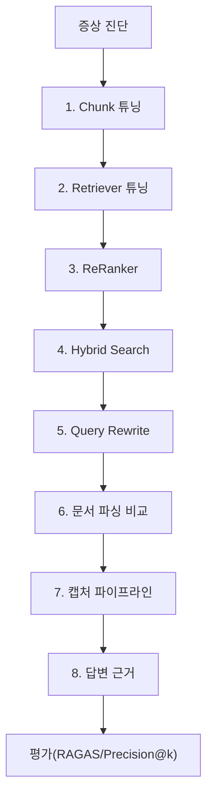

# v0.8 RAG 튜닝 — 되는 수준에서 쓸만한 수준으로

> 사내 문서 기반 AI 업무 비서 (RAG + MCP) — 10장 실습 코드

## 학습 목표

- 증상(부정확한 답변, 관련 없는 검색)에서 출발하여 원인을 진단하고 처방을 적용한다
- Fixed-size 청킹과 Semantic 청킹의 차이를 직접 실험하고 최적 설정을 찾는다
- Cross-Encoder ReRanker로 검색 결과의 정밀도를 높인다
- BM25 + Vector 하이브리드 검색으로 키워드와 의미 검색을 결합한다
- HyDE, Multi-Query로 질문의 의도를 더 잘 반영하는 검색을 구현한다
- Precision@k, Recall@k, 환각률로 before/after 성능을 측정한다
- 라이브러리 파싱과 vLLM(LLaVA) 파싱의 차이를 비교 실험한다
- 문서 → 캡처 → 메타데이터 → 벡터DB 인제스천 파이프라인을 구축한다
- 비정형(문서+캡처)/정형(DB) 답변에 근거를 첨부한다

## 실행 환경

- Python 3.10+
- Docker (인프라용 — PostgreSQL, FastAPI)
- Ollama + DeepSeek R1 모델 (LLM 기능 사용 시)
- Ollama + LLaVA 모델 (이미지 분석 사용 시)
- ChromaDB 없이 인메모리 샘플 데이터로 실행 가능

## 사전 준비 — 인프라 설정 (선택)

LLM 및 Vision 기능을 사용하려면 Ollama를 먼저 설치하십시오.

```bash
# Ollama 설치 후 모델 다운로드
ollama pull deepseek-r1:8b
ollama pull llava:7b

# Ollama 서버 실행
ollama serve
```

PostgreSQL 기반 DB 조회를 사용하려면 Docker Compose로 인프라를 시작하십시오.

```bash
docker-compose up -d
```

**참고**: PostgreSQL이 없어도 모의(mock) 데이터로 모든 기능을 테스트할 수 있습니다.

## 설치 및 실행

이 챕터의 예제 코드를 클론하십시오.

```bash
git clone https://github.com/{repo}/v0.8_RAG_튜닝
cd v0.8_RAG_튜닝
```

환경 변수를 설정하십시오.

```bash
cp .env.example .env
# .env 파일을 열고 필요한 값을 입력하십시오.
```

### macOS / Linux

```bash
python3 -m venv venv
source venv/bin/activate
pip install -r requirements.txt
```

### Windows (WSL2)

```bash
python -m venv venv
venv\Scripts\activate
pip install -r requirements.txt
```

## 실행

### 메인 메뉴 (듀얼모드)

```bash
python src/main.py
```

메인 메뉴에서 에이전트 CLI 또는 실험 메뉴를 선택할 수 있습니다.

### 에이전트 CLI 직접 실행

```bash
python src/main.py --agent          # 대화형 Q/A 비서
python src/main.py --demo           # 데모 시나리오 5개 자동 실행
```

### 실험 메뉴 직접 실행

```bash
python src/main.py --experiments    # 실험 선택 메뉴
python src/main.py --experiment 1   # 특정 실험 직접 실행
```

### 특정 실험 직접 실행

```bash
python src/main.py 1    # 청킹 전략 실험
python src/main.py 2    # Retriever 튜닝 실험
python src/main.py 3    # ReRanker 실험
python src/main.py 4    # 하이브리드 검색 실험
python src/main.py 5    # 고급 Retriever 실험
python src/main.py 6    # Query Rewrite 실험
python src/main.py 7    # 문서 파싱 비교 (라이브러리 vs vLLM)
python src/main.py 8    # 문서 캡처 파이프라인
python src/main.py 9    # 답변 근거 시스템
python src/main.py 10   # 평가 프레임워크 데모
python src/main.py all  # 전체 실험 순서 실행
```

### 개별 모듈 독립 실행

```bash
python tuning/chunk_experiment.py
python tuning/retriever_experiment.py
python tuning/reranker.py
python tuning/hybrid_search.py
python tuning/advanced_retriever.py
python tuning/query_rewrite.py
python tuning/document_parser.py
python tuning/document_capture.py
python tuning/evidence_pipeline.py
python src/eval_framework.py
```

### 웹 UI 실행

```bash
uvicorn app.main:app --reload --port 8010
```

## 예상 출력 (평가 프레임워크 데모)

```
════════════════════════════════════════════
v0.8 RAG 튜닝 평가 프레임워크 데모
════════════════════════════════════════════
테스트 질문 로드 완료: 30개
┌──────────┬──────┐
│ 카테고리 │ 개수 │
├──────────┼──────┤
│ 정형     │   10 │
│ 비정형   │   10 │
│ 복합     │   10 │
│ 전체     │   30 │
└──────────┴──────┘

1. 튜닝 전 검색 결과 평가
┌─────────────────┬────────┐
│ 지표            │ 값     │
├─────────────────┼────────┤
│ Precision@3     │ 0.0000 │
│ Recall@3        │ 0.0000 │
│ Precision@5     │ 0.0000 │
│ Recall@5        │ 0.0000 │
│ MRR             │ 0.0000 │
└─────────────────┴────────┘

2. 튜닝 후 검색 결과 평가
┌─────────────────┬────────┐
│ 지표            │ 값     │
├─────────────────┼────────┤
│ Precision@3     │ 0.3333 │
│ Recall@3        │ 1.0000 │
│ Precision@5     │ 0.2000 │
│ Recall@5        │ 1.0000 │
│ MRR             │ 1.0000 │
└─────────────────┴────────┘

5. Before/After 비교 보고서
┌───────────────┬────────┬────────┬────────┐
│ 지표          │ 튜닝 전 │ 튜닝 후 │ 개선율  │
├───────────────┼────────┼────────┼────────┤
│ precision@3   │ 0.0000 │ 0.3333 │ +∞%    │
│ recall@3      │ 0.0000 │ 1.0000 │ +∞%    │
│ mrr           │ 0.0000 │ 1.0000 │ +∞%    │
└───────────────┴────────┴────────┴────────┘
평가 보고서 저장: outputs/eval_full_comparison_20260227_120000.json
════════════════ 평가 완료 ════════════════
```

> 실제 출력은 실행 환경에 따라 다를 수 있습니다.

## 전체 구조



## 파일 구조

```
v0.8_RAG_튜닝/
├── README.md                  # 이 파일
├── requirements.txt           # 의존성 패키지
├── .env.example               # 환경 변수 템플릿
├── docker-compose.yml         # PostgreSQL 인프라
├── app/                       # 웹 UI
│   ├── main.py                # FastAPI 앱 진입점
│   ├── chat_api.py            # 채팅 API 라우터
│   └── database.py            # DB 연결 관리
├── src/
│   ├── __init__.py
│   ├── main.py                # 듀얼모드 CLI (에이전트 + 실험)
│   ├── agent_config.py        # LangChain Agent 구성
│   ├── router.py              # 3단계 QueryRouter
│   ├── cache.py               # TTL 캐시 + 임베딩 캐시
│   ├── monitoring.py          # JSON 로깅 + Langfuse
│   ├── eval_framework.py      # 평가 프레임워크 (Precision@k, RAGAS)
│   └── tools/
│       ├── leave_balance.py   # @tool: 휴가 잔여 조회
│       ├── sales_sum.py       # @tool: 매출 합계 조회
│       ├── list_employees.py  # @tool: 직원 목록 조회
│       └── search_documents.py # @tool: 사내 문서 검색
├── tuning/                    # RAG 튜닝 실험 모듈
│   ├── chunk_experiment.py    # Fixed-size vs Semantic 청킹
│   ├── retriever_experiment.py # k값, threshold, metadata filter
│   ├── reranker.py            # Cross-Encoder ReRanker
│   ├── hybrid_search.py       # BM25 + Vector 앙상블
│   ├── advanced_retriever.py  # Parent/SelfQuery/Compression
│   ├── query_rewrite.py       # HyDE, Multi-Query, 약어 확장
│   ├── document_parser.py     # 라이브러리 vs vLLM 파싱 비교
│   ├── document_capture.py    # 문서 캡처 + 인제스천 파이프라인
│   └── evidence_pipeline.py   # 답변 근거 시스템
├── templates/                 # Jinja2 HTML 템플릿
├── static/                    # CSS, JS 정적 파일
├── data/
│   ├── test_questions.json    # 테스트 질문 30개
│   ├── create_sample_docs.py  # 샘플 문서 생성 스크립트
│   ├── sample_hr_policy.pdf   # 샘플 PDF (취업규칙)
│   ├── sample_sales_report.docx # 샘플 DOCX (매출 보고서)
│   ├── sample_budget.xlsx     # 샘플 XLSX (부서별 예산)
│   ├── docs/                  # 원본 문서
│   ├── markdown/              # 변환된 마크다운
│   ├── captured/              # 캡처 이미지
│   │   ├── pdf/               # PDF 페이지별 PNG
│   │   ├── docx/              # DOCX 임베디드 이미지
│   │   └── xlsx/              # XLSX 시트 이미지
│   └── chroma_db/             # ChromaDB 벡터 저장소
├── tests/
│   └── test_scenarios.py      # 단위 테스트
└── outputs/
    ├── embedding_cache/       # 임베딩 캐시
    ├── eval_results/          # 평가 결과
    └── tuning_logs/           # 실험 로그
```

## 환경 변수 (.env) 설명

| 변수 | 설명 | 기본값 |
|------|------|--------|
| `LLM_PROVIDER` | LLM 제공자 (ollama/openai) | `ollama` |
| `OLLAMA_BASE_URL` | Ollama 서버 주소 | `http://localhost:11434` |
| `OLLAMA_MODEL` | 사용할 Ollama 모델 | `deepseek-r1:8b` |
| `OPENAI_API_KEY` | OpenAI API 키 (선택) | 비어있음 |
| `USE_SAMPLE_DATA` | 인메모리 샘플 사용 여부 | `true` |
| `USE_RAGAS` | RAGAS 평가 사용 여부 | `false` |
| `CHROMA_PERSIST_DIR` | ChromaDB 저장 경로 | `./data/chroma_db` |
| `EXPERIMENT_OUTPUT_DIR` | 실험 결과 출력 디렉토리 | `./outputs/tuning_logs` |

## 튜닝 우선순위 가이드

| 우선순위 | 기법 | 비용 | 효과 |
|---------|------|------|------|
| 1순위 | 프롬프트 튜닝 | 0 | 즉시 적용 가능 |
| 2순위 | Chunk 크기/오버랩 조정 | 낮음 | 기본 성능 향상 |
| 3순위 | ReRanker 추가 | 중간 | 정밀도 대폭 향상 |
| 4순위 | Hybrid Search | 중간 | 키워드+의미 검색 |
| 5순위 | Query Rewrite | 중간 | 의도 파악 향상 |
| 6순위 | 고급 Retriever | 높음 | 최고 성능 목표 |

## LLM 제공자 전환

`.env` 파일에서 `LLM_PROVIDER`를 변경하면 LLM을 전환할 수 있습니다.

```bash
# Ollama (기본, 무료)
LLM_PROVIDER=ollama
OLLAMA_MODEL=deepseek-r1:8b

# OpenAI (유료)
LLM_PROVIDER=openai
OPENAI_API_KEY=sk-...
OPENAI_MODEL=gpt-4o-mini
```
