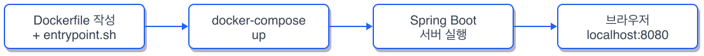
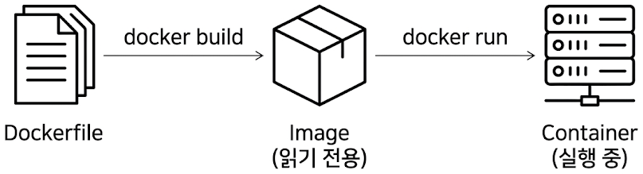
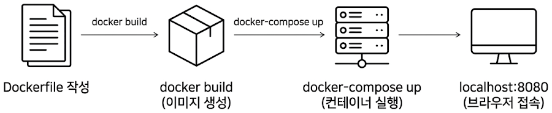

# Ch.1 Docker로 시작하는 개발 환경

## 1. Docker 개요

### 1.1 환경 설치의 문제

출근 첫날, 모니터 앞에 앉자마자 **팀장**이 다가왔습니다.

**팀장**: "환경 세팅은 Docker로 하면 돼요. README에 있으니까 보고 따라 하세요."

고개를 끄덕였지만 손이 움직이지 않았습니다. Docker. 이름은 수십 번 들었습니다. 면접 준비할 때 "컨테이너 기반 가상화 플랫폼"이라고 외운 적도 있습니다. 하지만 직접 써본 적은 한 번도 없었습니다.

*일단 자바부터 깔자. MySQL도 깔고. 그건 해봤으니까.*

익숙한 방식으로 시작했습니다. OpenJDK를 내려받고, MySQL 설치 파일을 찾고, 환경 변수를 잡았습니다. 한 시간쯤 지났을까. 빌드 버튼을 눌렀는데 에러가 터졌습니다. 자바 버전이 맞지 않았습니다. 프로젝트는 21을 쓰고 있었고, 제 컴퓨터에는 17이 깔려 있었습니다.

버전을 바꾸고 다시 빌드. 이번에는 MySQL 포트가 충돌했습니다. 예전에 깔아둔 MariaDB가 3306을 쓰고 있었습니다.

옆자리 **선배**가 슬쩍 모니터를 보더니 한마디 했습니다.

**선배**: "그래서 Docker 쓰라니까. 나도 처음에 그랬어."

---

### 1.2 컨테이너라는 상자

이사를 떠올려 보겠습니다.

새 집에 이사하면 냉장고, 세탁기, 가스레인지를 하나씩 설치합니다. 전압이 맞는지 확인하고, 수도 배관을 연결하고, 가스 밸브를 열어야 합니다. 집마다 배관 위치가 다르고, 콘센트 규격이 다르고, 가스 종류가 다릅니다. 같은 냉장고인데 이 집에서는 되고 저 집에서는 안 되는 일이 생깁니다.

그런데 만약 냉장고가 자기만의 전기, 자기만의 배관, 자기만의 공간을 통째로 가지고 다닌다면 어떨까요. 어느 집에 가져다 놓든 플러그 하나만 꽂으면 바로 돌아가는 겁니다. 집 구조를 신경 쓸 필요가 없습니다. **Docker** 가 하는 일이 그것입니다. 애플리케이션이 돌아가는 데 필요한 모든 것을 하나의 상자에 담습니다. 자바 버전, 라이브러리, 설정 파일까지 전부요. 그 상자를 어떤 컴퓨터에 올려놓든 똑같이 동작합니다.

**팀장**이 "Docker로 환경 맞추세요"라고 말한 건, "이 상자를 열어서 실행만 하세요"라는 뜻이었습니다. 제가 자바를 직접 깔고, MySQL을 직접 잡고, 포트 충돌을 직접 해결한 건 — 빈집에 배관부터 새로 놓은 셈이었습니다. **선배**가 docker compose 명령어 하나를 알려줬습니다. 터미널에 입력하자 서버가 올라왔습니다. 자바 설치도, MySQL 설치도, 포트 설정도 필요 없었습니다. 상자 안에 전부 들어 있었으니까요.

*이걸 진작 했으면 한 시간을 아꼈을 텐데.*

그날 이후로 환경 세팅에 한 시간 넘게 쓴 적이 없습니다. 이제 이 상자가 어떻게 만들어지는지 직접 살펴보겠습니다.

---

이 장의 실습 코드는 아래 레포에서 확인할 수 있습니다.

```bash
git clone https://github.com/kjh5848/spring-docker
git clone https://github.com/kjh5848/spring-app
```

| 레포 | 설명 |
|------|------|
| kjh5848/spring-docker | Dockerfile + docker-compose.yml (완성본) |
| kjh5848/spring-app | Spring Boot 서버 소스 코드 |

```
kjh5848/spring-docker/
├── Dockerfile           [설명] 이미지 빌드 설정
├── entrypoint.sh        [설명] 컨테이너 시작 시 자동 실행
└── docker-compose.yml   [실습] 서비스 정의 + 포트 매핑

kjh5848/spring-app/
└── SpringDokerController.java  [참고] health check 엔드포인트
```

챕터를 따라 하며 코드를 작성하고, 막히면 완성 코드를 참고하세요.

### 환경 준비

실습 전에 Docker가 설치되어 있는지 확인합니다.

```bash
docker --version
docker compose version
```

`Docker version 24.x` 이상, `Docker Compose version v2.x` 이상이 출력되면 준비가 된 것입니다. 설치되어 있지 않다면 Docker Desktop 공식 사이트에서 내려받아 설치합니다.

| 환경 | 확인 사항 |
|------|----------|
| Apple Silicon (M1/M2/M3) | Docker Desktop 4.25 이상 권장. Rosetta 에뮬레이션 없이 ARM 이미지를 사용합니다 |
| Intel Mac | 별도 설정 없이 동작합니다 |
| Windows | WSL 2 백엔드가 활성화되어 있어야 합니다. Docker Desktop 설치 시 자동으로 안내합니다 |

Docker Desktop이 실행 중인지도 확인합니다. 상태 표시줄(Mac) 또는 시스템 트레이(Windows)에 고래 아이콘이 보이면 실행 중입니다. 실행되어 있지 않으면 `docker ps` 명령이 `Cannot connect to the Docker daemon` 에러를 출력합니다.

[실습 순서들 다이어그램을 제거 하고 목록으로 작성하기]


*그림 1-1: 이번 챕터의 실습 흐름*

### 1.3 도커는 왜 필요한가

로컬에 자바와 MySQL을 직접 설치하면 두 가지 문제가 생깁니다. 첫째, **버전 충돌** 입니다. 프로젝트마다 요구하는 자바 버전이 다릅니다. 하나를 맞추면 다른 하나가 깨집니다. 둘째, **환경 차이** 입니다. 내 컴퓨터, 동료 컴퓨터, 서버 — 세 곳의 설정이 조금씩 다릅니다. "내 컴퓨터에서는 되는데"가 여기서 나옵니다.

**컨테이너(Container)** 는 애플리케이션과 실행 환경을 하나로 묶은 격리된 공간입니다. 컨테이너 안에서는 항상 같은 자바 버전, 같은 라이브러리, 같은 설정이 보장됩니다. Docker는 이 컨테이너를 만들고 실행하는 도구입니다.



*그림 1-1: Dockerfile에서 이미지를 만들고, 이미지에서 컨테이너를 실행하는 흐름*

| 비유 | Docker 용어 | 설명 |
|------|------------|------|
| 상자 설계도 | **이미지(Image)** | 실행에 필요한 모든 것을 담은 읽기 전용 템플릿 |
| 열어서 쓰는 상자 | **컨테이너(Container)** | 이미지를 실행한 인스턴스. 실제로 프로세스가 돌아가는 공간 |
| 설계도 작성법 | **Dockerfile** | 이미지를 만드는 스크립트 |

### 1.4 Dockerfile + entrypoint.sh

Dockerfile은 이미지를 만드는 설계도입니다. "어떤 환경 위에, 무엇을 복사하고, 무엇을 실행할지"를 순서대로 적습니다.

```dockerfile
FROM eclipse-temurin:21-jdk
RUN apt-get update && apt-get install -y git
WORKDIR /app

COPY ./entrypoint.sh ./entrypoint.sh
RUN chmod +x ./entrypoint.sh
ENTRYPOINT ["/bin/bash", "./entrypoint.sh"]
```

`FROM` 은 베이스 이미지를 지정합니다. eclipse-temurin:21-jdk를 쓰면 자바 21이 설치된 리눅스 환경이 준비됩니다. 로컬에 자바를 설치할 필요가 없는 이유입니다. `RUN` 은 이미지를 빌드할 때 실행할 명령어입니다. 여기서는 패키지 목록을 갱신하고 git을 설치합니다. 컨테이너 안에서 소스 코드를 받아오기 위해 필요합니다. `WORKDIR` 은 이후 명령어가 실행될 작업 디렉토리를 지정합니다. `COPY` 로 entrypoint.sh를 컨테이너 안으로 복사하고, `ENTRYPOINT` 로 컨테이너가 시작될 때 이 스크립트를 실행하도록 설정합니다.

entrypoint.sh는 컨테이너가 시작되면 자동으로 실행되는 스크립트입니다.

```bash
git clone "https://github.com/kjh5848/spring-app"
cd spring-app
chmod +x ./gradlew
./gradlew clean build
java -jar build/libs/*.jar
```

GitHub에서 소스를 받아오고, Gradle로 빌드하고, 결과물인 jar 파일을 실행합니다. 컨테이너를 시작하기만 하면 소스 클론부터 서버 실행까지 한 번에 일어납니다.

### 1.5 docker-compose로 Spring 서버 실행

아래 코드를 `docker-compose.yml` 에 작성합니다.

```yaml
services:
  app:
    build:
      context: .
      dockerfile: Dockerfile
    container_name: spring-docker
    ports:
      - "8080:8080"
```

`build` 는 현재 디렉토리의 Dockerfile을 사용해 이미지를 빌드하라는 뜻입니다. `ports` 의 `"8080:8080"` 은 호스트의 8080 포트를 컨테이너의 8080 포트에 연결합니다. 브라우저에서 `localhost:8080` 으로 접근하면 컨테이너 안의 Spring 서버에 도달합니다.

터미널에서 실행합니다.

```bash
docker compose up --build
```

빌드가 진행되면서 터미널에 로그가 출력됩니다. 이미지 다운로드, 의존성 설치, Gradle 빌드 과정이 순서대로 지나갑니다.


빌드가 끝나면 Spring Boot 시작 로그가 나타납니다. `Started` 메시지가 보이면 서버가 정상적으로 올라온 것입니다.


터미널을 새로 열어서 컨테이너 상태를 확인합니다.

```bash
docker ps
```

`spring-docker` 컨테이너가 `Up` 상태이고 `0.0.0.0:8080->8080/tcp` 포트 매핑이 보이면 성공입니다.

[CAPTURE NEEDED: `docker ps` 실행 결과 -- spring-docker 컨테이너가 Up 상태인 터미널 화면. 경로: assets/CH01/terminal/01_docker-ps.png]

이제 브라우저에서 `http://localhost:8080` 에 접속합니다.


`hello world!.` 텍스트가 보이면 Docker 위에서 Spring 서버가 정상 동작하는 것입니다. Spring 서버의 컨트롤러가 응답한 결과입니다.

```java
@RestController
public class SpringDokerController {
    @GetMapping("/")
    public String hello() {
        return "hello world!.";
    }
}
```

Docker Desktop에서도 컨테이너가 실행 중인 것을 확인할 수 있습니다.


자바 설치, 빌드 도구 설정, 포트 설정 — 이 모든 과정이 `docker compose up --build` 한 줄로 끝났습니다. 컨테이너를 내릴 때는 `docker compose down` 을 실행합니다.


### 1.6 Docker 전체 흐름



*그림 1-2: Dockerfile 작성부터 브라우저 접속까지의 전체 흐름*

### 1.7 도커 명령어 정리

| 명령어 | 설명 |
|--------|------|
| `docker compose up --build` | 이미지 빌드 후 컨테이너 실행 |
| `docker compose down` | 컨테이너 중지 및 삭제 |
| `docker ps` | 실행 중인 컨테이너 목록 |
| `docker logs [컨테이너명]` | 컨테이너 로그 확인 |
| `docker exec -it [컨테이너명] bash` | 실행 중인 컨테이너 안으로 진입 |
| `docker images` | 로컬에 저장된 이미지 목록 |
| `docker rmi [이미지명]` | 이미지 삭제 |

`docker compose up` 과 `docker compose down` 두 개만 기억해도 일상적인 개발에는 충분합니다.

---

## 이것만은 기억하자

환경을 코드로 관리한다는 것. Dockerfile에 자바 버전을 적고, docker-compose.yml에 포트를 적으면 누가 언제 실행해도 같은 결과가 나옵니다. "내 컴퓨터에서는 되는데"는 환경이 사람마다 다를 때 생기는 말입니다. 환경을 코드로 고정하면 그 말이 사라집니다.

다음 주, 카카오 로그인을 붙여달라는 요청이 옵니다.
