# Ch.2 OAuth 2.0 & OIDC — Kakao 소셜 로그인

## 카카오 로그인 붙여주세요

입사 2주차, 자리에 앉자마자 **팀장** 이 슬랙 메시지를 보냈습니다.

**팀장**: "이번 스프린트에 카카오 소셜 로그인 붙여주세요. OAuth 2.0 인가 코드 방식으로 하면 돼요."

(OAuth? 인가 코드? 그게 뭔데.)

검색을 시작했습니다. 화면에 화살표가 잔뜩 그려진 다이어그램이 떴습니다. Resource Owner, Authorization Server, Client, Redirect URI, Access Token, Refresh Token, ID Token, JWKS. 화살표 하나하나에 용어가 붙어 있었고 한 바퀴를 돌 때마다 새로운 단어가 나왔습니다. 스크롤을 내릴수록 머리가 멍해졌습니다.

(로그인이면 아이디 비밀번호 받아서 세션에 넣으면 되는 거 아닌가. 왜 이렇게 복잡하지.)

옆자리 **선배** 에게 물었습니다.

**오픈이**: "이거 화살표가 너무 많은데 어디서부터 봐야 돼?"

**선배**: "그 그림 전체를 이해하려고 하지 마. 우리가 하는 건 딱 하나야. 카카오한테 '이 사람 누구야?' 물어보는 거거든."

---

대사관을 떠올려 보겠습니다.

외국에 나가면 내가 누구인지 증명할 방법이 필요합니다. 그래서 대사관에 갑니다. 신청서를 내면 대사관이 여권을 발급해 줍니다. 여권에는 이름, 사진, 유효 기간이 적혀 있습니다. 이후 어느 나라에 가든 이 여권을 보여주면 됩니다. 공항 직원이 대사관에 전화해서 "이 사람 진짜 맞아요?" 확인할 필요가 없습니다. 여권 자체에 위변조 방지 장치가 들어 있으니까요.

**OAuth 2.0** 이 하는 일이 대사관과 비슷합니다. 우리 서비스는 사용자가 누구인지 직접 확인할 능력이 없습니다. 그래서 카카오라는 대사관에 "이 사람 좀 확인해 주세요"라고 요청합니다. 카카오가 사용자를 확인하고 **통행증(Access Token)** 을 발급합니다. 우리 서비스는 이 통행증을 들고 카카오에 다시 가서 "이 통행증 가진 사람 이름이 뭐예요?"라고 물어봅니다. 카카오가 이름을 알려주면 로그인이 끝납니다.

여기서 한 가지 불편한 점이 생깁니다. 통행증을 받을 때마다 카카오에 전화해서 이름을 물어봐야 합니다. 사용자가 100명이면 100번 전화합니다. 그래서 카카오가 한 가지를 더 제공합니다. 통행증과 함께 **신분증(ID Token)** 을 같이 줍니다. 신분증에는 이름이 이미 적혀 있고 위변조 방지 도장까지 찍혀 있습니다. 이 신분증만 있으면 카카오에 다시 전화할 필요가 없습니다. 도장이 진짜인지만 확인하면 됩니다. 이것이 **OIDC(OpenID Connect)** 입니다.

**선배** 가 말한 "카카오한테 '이 사람 누구야?' 물어보는 것"이 Access Token으로 사용자 정보를 조회하는 방식이었습니다. 거기에 ID Token을 더하면 전화를 한 번 줄일 수 있습니다. 두 방식을 직접 만들어 보겠습니다.

---

이 장의 실습 코드는 아래 레포에서 확인할 수 있습니다. start 레포를 클론해서 챕터를 따라 코드를 작성하고, 막히면 end 레포의 완성 코드를 참고하세요.

```bash
# SSR 방식
git clone https://github.com/metacoding-11-spring-reference/kakao-oauth-code-ssr-start
git clone https://github.com/metacoding-11-spring-reference/kakao-oauth-code-ssr-end

# OIDC 방식
git clone https://github.com/metacoding-11-spring-reference/kakao-oauth-code-oidc-start
git clone https://github.com/metacoding-11-spring-reference/kakao-oauth-code-oidc-end
```

| 레포 | 설명 |
|------|------|
| kakao-oauth-code-ssr-start / end | SSR 방식 시작 코드 / 완성 코드 |
| kakao-oauth-code-oidc-start / end | OIDC 방식 시작 코드 / 완성 코드 |

```
kakao-oauth-code-ssr-start → end/
├── UserController.java         [실습] 카카오 로그인 리다이렉트 + 세션 처리
├── KakaoApiClient.java         [실습] RestTemplate으로 카카오 API 호출
├── KakaoResponse.java          [설명] 토큰 + 사용자 정보 응답 DTO
├── UserService.java            [실습] 토큰 교환 + 회원 저장 로직
└── templates/login.mustache    [참고] 카카오 로그인 버튼 UI

kakao-oauth-code-oidc-start → end/
├── KakaoOidcUtil.java          [실습] JWKS 공개키 조회 + RSA 검증
├── JwtAuthFilter.java          [실습] JWT 인증 필터
├── JwtUtil.java                [실습] JWT 생성 + 검증
└── SecurityConfig.java         [설명] 필터 등록
```

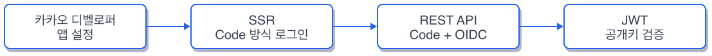

*그림 2-1: 이번 챕터의 실습 흐름*

### 2.1 준비 -- 카카오 디벨로퍼 앱 설정

카카오 소셜 로그인을 사용하려면 카카오 디벨로퍼 사이트에서 앱을 등록하고 몇 가지 설정을 마쳐야 합니다. 처음 해보면 메뉴가 많아서 헤맬 수 있으니 아래 순서대로 따라 해 보겠습니다.

#### 1단계 -- 앱 생성

카카오 디벨로퍼(https://developers.kakao.com/)에 접속해서 로그인합니다.

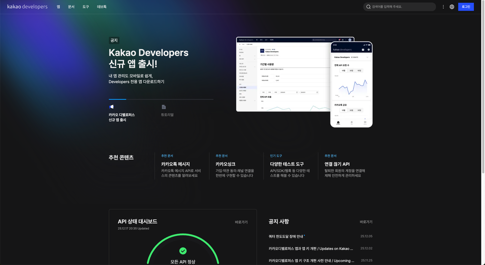

*카카오 디벨로퍼 메인 화면*

상단 네비게이션에서 **내 애플리케이션** 을 클릭하고 **앱 추가하기** 를 누릅니다.

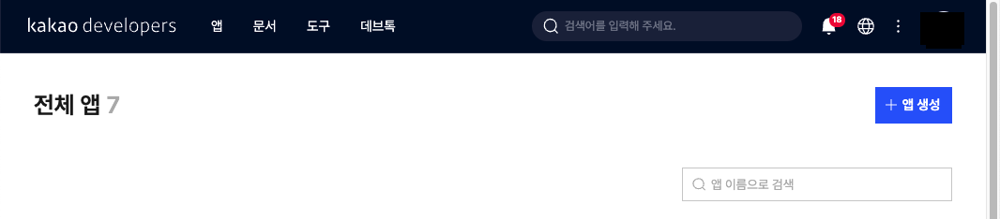

*앱 추가하기 버튼 위치*

앱 이름을 입력하고 저장합니다. 이름은 자유롭게 지으면 됩니다.

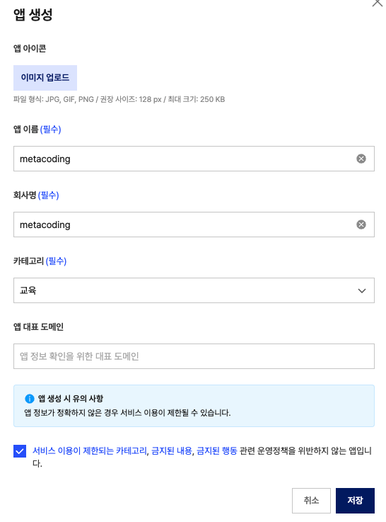

*앱 이름 입력 후 저장*

생성된 앱을 클릭해서 대시보드로 이동합니다.

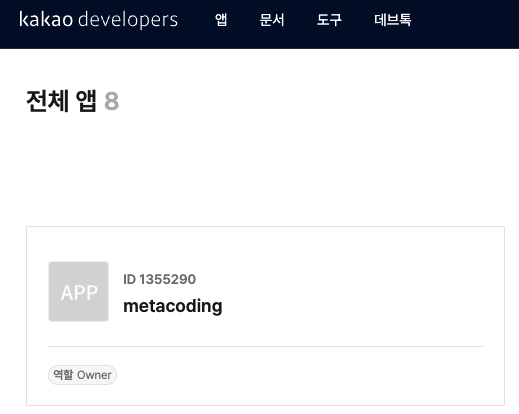

*앱 대시보드 -- 여기서부터 설정을 시작한다*

#### 2단계 -- 카카오 로그인 활성화 + OpenID Connect

왼쪽 메뉴에서 **제품설정 > 카카오 로그인 > 일반** 으로 이동합니다. **사용 설정** 을 ON으로 변경하고 **OpenID Connect** 도 ON으로 활성화합니다.

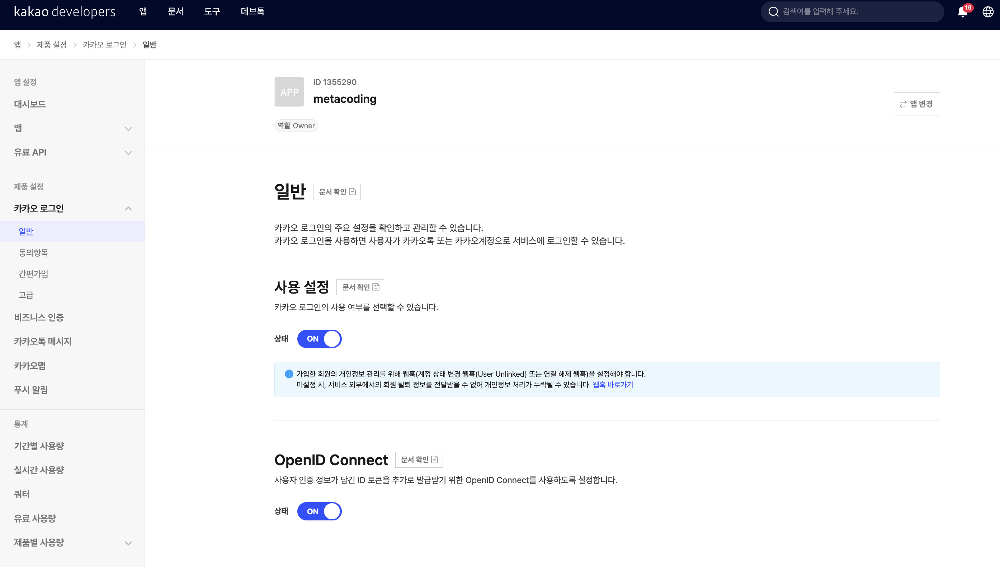

*카카오 로그인 사용 설정 ON + OpenID Connect 활성화 -- 두 항목 모두 ON이면 성공이다*

#### 3단계 -- 동의항목 설정

**제품설정 > 카카오 로그인 > 동의항목** 으로 이동합니다.

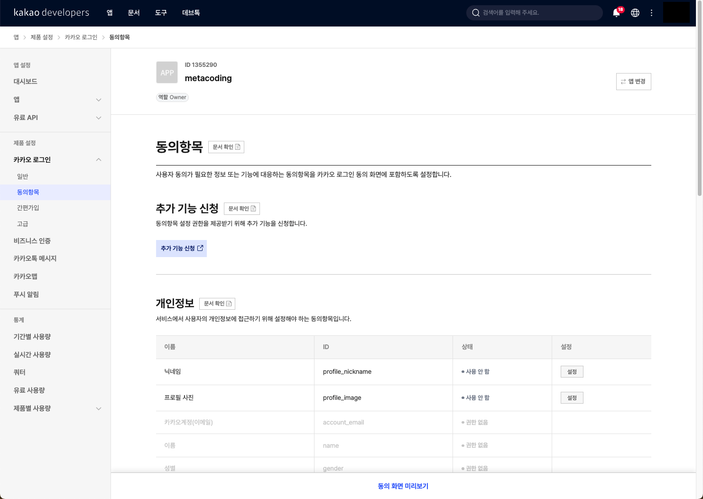

*동의항목 페이지 -- 개인정보 항목 목록이 표시된다*

**닉네임** 항목의 **설정** 을 클릭합니다. 동의 단계를 **필수 동의** 로 변경하고 저장합니다.

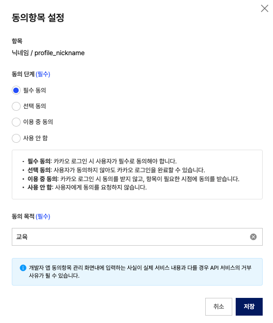

*닉네임 동의 단계를 필수 동의로 변경*

저장 후 닉네임 상태가 **필수 동의** 로 바뀌었는지 확인합니다.

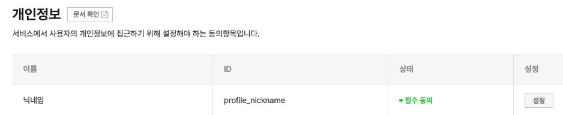

*닉네임이 필수 동의로 변경된 상태*

#### 4단계 -- Redirect URI 등록

**제품설정 > 카카오 로그인 > 일반** 에서 아래로 스크롤하면 **Redirect URI** 항목이 있습니다. 아래 주소를 등록합니다.

```
http://localhost:8080/oauth/callback
```

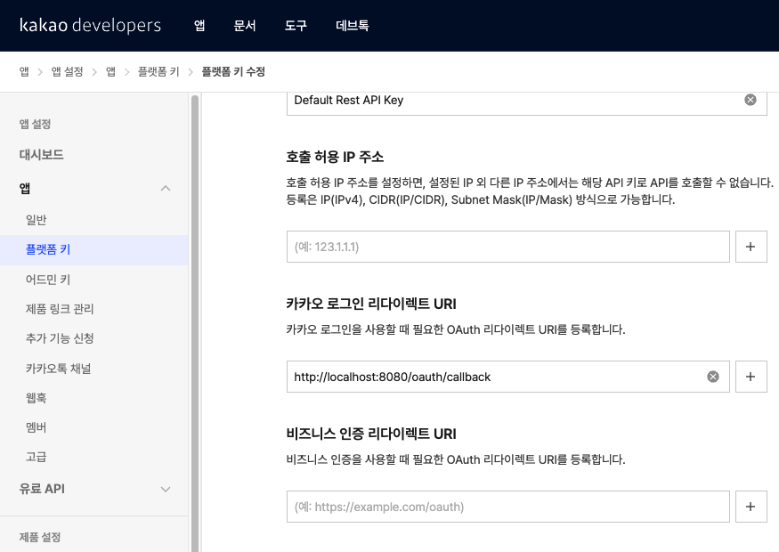

*Redirect URI 등록 -- 카카오 로그인 완료 후 되돌아올 우리 서버 주소*

#### 5단계 -- REST API 키 확인

왼쪽 메뉴에서 **앱 설정 > 앱 키** 로 이동합니다. **REST API 키** 를 복사해서 메모장에 저장합니다.

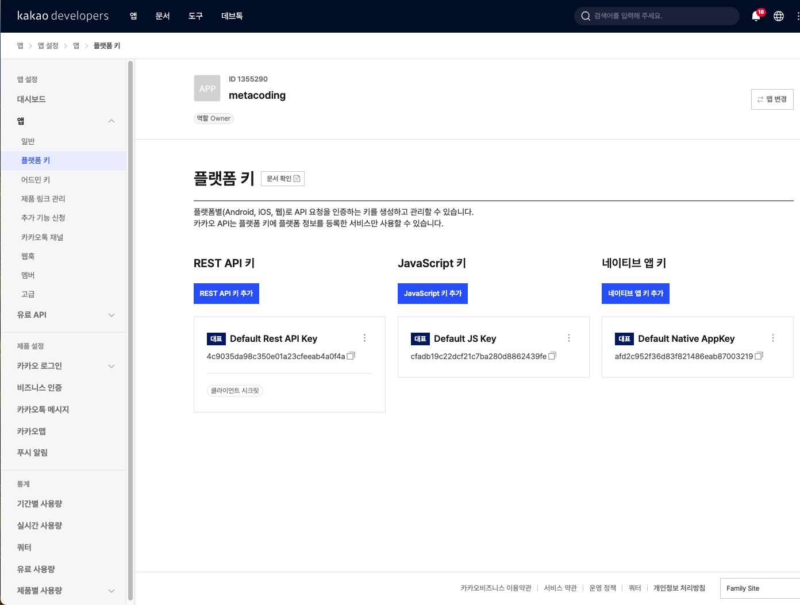

*앱 키 페이지 -- REST API 키를 복사한다*

#### 6단계 -- Client Secret 발급

**제품설정 > 카카오 로그인 > 보안** 에서 **Client Secret** 코드를 발급받습니다. 발급 후 **활성화 상태** 를 ON으로 변경합니다. 발급된 코드를 메모장에 저장합니다.

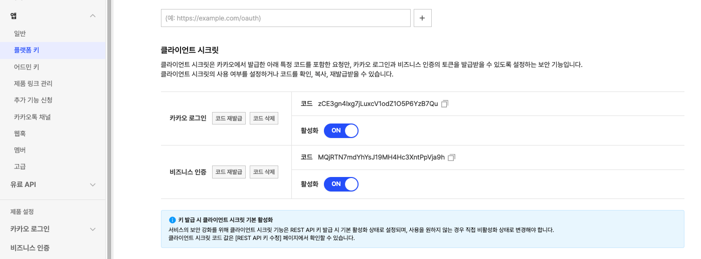

*Client Secret 발급 -- 활성화 상태가 사용함이면 성공이다*

#### 7단계 -- .env 파일에 키 등록

start 레포를 클론했으면 프로젝트 루트에 `.env` 파일을 만들고 복사해둔 키를 넣습니다.

```
KAKAO_CLIENT_ID=복사한_REST_API_키
KAKAO_CLIENT_SECRET=복사한_Client_Secret
```

여기까지 완료했으면 카카오 디벨로퍼 설정이 끝났습니다. 설정 요약입니다.

| 항목 | 값 | 확인 방법 |
|------|-----|----------|
| **REST API 키** | 앱 키 페이지에서 복사 | .env 파일에 저장됨 |
| **Client Secret** | 보안 메뉴에서 발급 + 활성화 | .env 파일에 저장됨 |
| **Redirect URI** | `http://localhost:8080/oauth/callback` | 카카오 로그인 > 일반에 등록됨 |
| **카카오 로그인** | 활성화 ON | 일반 메뉴에서 확인 |
| **OpenID Connect** | 활성화 ON | 일반 메뉴에서 확인 |
| **닉네임 동의** | 필수 동의 | 동의항목 메뉴에서 확인 |

### 2.2 SSR: Code 방식 로그인

OAuth 2.0에는 여러 인증 방식이 있지만 서버 사이드 애플리케이션에서 가장 널리 쓰이는 것은 **인가 코드 방식(Authorization Code Grant)** 입니다. 흐름을 구성 요소부터 살펴보겠습니다.

| 비유 | OAuth 2.0 용어 | 설명 |
|------|---------------|------|
| 여권을 신청하는 사람 | **리소스 오너(Resource Owner)** | 카카오 계정을 가진 사용자 |
| 대사관 | **인가 서버(Authorization Server)** | 카카오 인증 서버. 사용자를 확인하고 토큰을 발급 |
| 여행사 | **클라이언트(Client)** | 우리 Spring Boot 서버. 카카오에 사용자 정보를 요청 |
| 사진이 담긴 서류함 | **리소스 서버(Resource Server)** | 카카오 API 서버. 사용자 정보를 보관 |

인가 코드 방식의 흐름은 두 단계로 나뉩니다. 먼저 인가 코드를 발급받고, 그 코드로 토큰을 교환합니다.

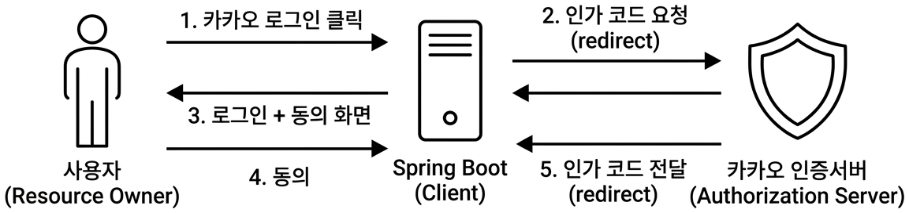

*그림 2-2a: 인가 코드 발급 — 사용자가 카카오에 동의하면 인가 코드가 서버로 전달된다*

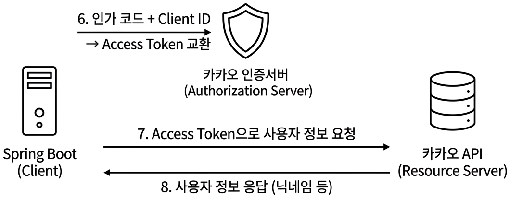

*그림 2-2b: 토큰 교환 — 인가 코드로 Access Token을 받고, 사용자 정보를 조회한다*

사용자가 "카카오 로그인" 버튼을 누르면 카카오 인증 서버로 이동합니다. 카카오가 로그인과 동의를 받으면 **인가 코드(Authorization Code)** 를 우리 서버의 Redirect URI로 보냅니다. 우리 서버는 이 인가 코드를 카카오에 다시 보내서 **액세스 토큰(Access Token)** 으로 교환합니다. 마지막으로 액세스 토큰을 들고 카카오 API에 사용자 정보를 요청합니다.

대사관 비유로 다시 정리하면 이렇습니다. 신청서(인가 코드)를 내면 대사관이 접수증(액세스 토큰)을 줍니다. 접수증을 들고 서류함(리소스 서버)에 가면 사진(사용자 정보)을 받을 수 있습니다. 신청서만으로는 서류함을 열 수 없고 접수증이 있어야 합니다.

#### 인가 코드 요청

사용자가 로그인 버튼을 누르면 카카오 인증 서버로 리다이렉트합니다. 아래 코드를 `UserController.java` 에 작성합니다.

```java
@GetMapping("/login/kakao")
public String redirectToKakao() {
    return "redirect:" + userService.카카오로그인주소();
}

@GetMapping("/oauth/callback")
public String kakaoCallback(@RequestParam("code") String code) {
    UserResponse.DTO sessionUser = userService.카카오로그인(code);
    session.setAttribute("sessionUser", sessionUser);
    return "redirect:/post/list";
}
```

`/login/kakao` 는 카카오 인증 페이지로 보내는 역할만 합니다. 사용자가 카카오에서 동의를 마치면 `/oauth/callback` 으로 인가 코드가 돌아옵니다. 이 코드를 서비스 계층에 넘겨서 토큰 교환부터 사용자 조회까지 처리합니다.

서버를 실행하고 `http://localhost:8080` 에 접속합니다. "카카오로 로그인하기" 링크를 클릭하면 카카오 로그인 화면이 나타납니다.

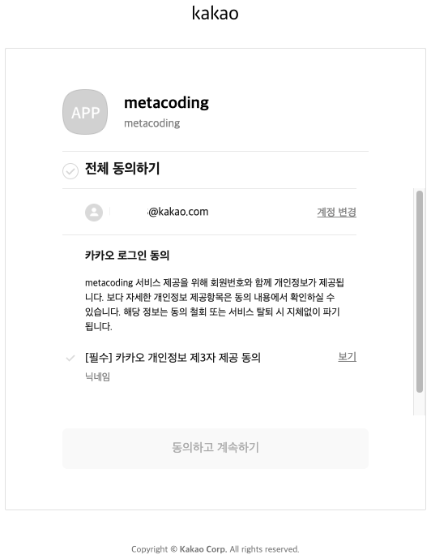

*카카오 로그인 동의 화면 -- 닉네임 제공에 동의하면 인가 코드가 발급된다. 이 화면이 보이면 리다이렉트까지 성공이다*

동의하고 나면 브라우저 주소창에 `http://localhost:8080/oauth/callback?code=xxxxx` 형태로 인가 코드가 포함된 URL이 표시됩니다. 터미널 로그에서도 code 값을 확인할 수 있습니다.

#### Access Token 교환 + 사용자 정보 조회

인가 코드를 받았으면 카카오에 보내서 Access Token으로 교환합니다. 아래 코드를 `KakaoApiClient.java` 에 작성합니다.

```java
public KakaoResponse.TokenDTO getKakaoToken(String code) {
    HttpEntity<MultiValueMap<String, String>> request = createTokenRequest(code);
    ResponseEntity<KakaoResponse.TokenDTO> response = restTemplate.exchange(
            kakaoTokenUri, HttpMethod.POST, request,
            KakaoResponse.TokenDTO.class);
    return response.getBody();
}
```

`RestTemplate` 으로 카카오 토큰 발급 API를 호출합니다. 요청 본문에는 `grant_type=authorization_code`, `client_id`, `redirect_uri`, `code`, `client_secret` 을 담습니다. 응답으로 돌아오는 `TokenDTO` 에 Access Token이 들어 있습니다.

Access Token을 받았으면 사용자 정보를 조회합니다.

```java
public KakaoResponse.KakaoUserDTO getKakaoUser(String accessToken) {
    HttpHeaders headers = new HttpHeaders();
    headers.add("Authorization", "Bearer " + accessToken);
    HttpEntity<MultiValueMap<String, String>> request = new HttpEntity<>(headers);

    ResponseEntity<KakaoResponse.KakaoUserDTO> response = restTemplate.exchange(
            kakaoUserInfoUri, HttpMethod.GET, request,
            KakaoResponse.KakaoUserDTO.class);
    return response.getBody();
}
```

`Authorization` 헤더에 `Bearer {accessToken}` 을 넣어서 카카오 사용자 정보 API를 호출합니다. 응답에서 닉네임을 꺼내 우리 서비스의 회원으로 등록하거나 기존 회원을 조회합니다.

서버를 다시 실행하고 카카오 로그인을 진행합니다. 동의까지 마치면 터미널에 TokenDTO 응답이 출력됩니다.

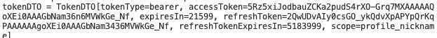

*Access Token 교환 성공 -- 터미널에 accessToken, refreshToken 등이 출력되면 토큰 교환이 정상 동작하는 것이다*

#### 세션 로그인 처리

토큰 교환과 사용자 정보 조회를 하나로 묶은 서비스 메서드입니다. `UserService.java` 의 핵심 흐름만 살펴보겠습니다.

```java
@Transactional
public UserResponse.DTO 카카오로그인(String code) {
    KakaoResponse.TokenDTO token = kakaoApiClient.getKakaoToken(code);
    KakaoResponse.KakaoUserDTO kakaoUser = kakaoApiClient.getKakaoUser(token.accessToken());
    String username = kakaoUser.properties().nickname();

    User user = userRepository.findByUsername(username)
            .orElseGet(() -> userRepository.save(
                    User.builder()
                        .username(username)
                        .password(UUID.randomUUID().toString())
                        .email("kakao" + kakaoUser.id() + "@kakao.com")
                        .provider("kakao")
                        .build()));
    return new UserResponse.DTO(user);
}
```

인가 코드로 토큰을 받고, 토큰으로 사용자 정보를 받고, 사용자를 DB에 저장하거나 기존 사용자를 찾습니다. 컨트롤러에서 반환된 `UserResponse.DTO` 를 세션에 넣으면 SSR 방식의 카카오 로그인이 완성됩니다.

대사관에 신청서를 내고(인가 코드), 접수증을 받고(Access Token), 접수증으로 서류를 조회하는(사용자 정보) 세 단계가 코드 세 줄에 대응합니다.

서버를 다시 실행하고 카카오 로그인을 진행합니다. 로그인 완료 후 게시글 목록 페이지(`/post/list`)로 이동하면서 상단에 로그인된 사용자 이름이 표시됩니다.

[CAPTURE NEEDED]

*SSR 카카오 로그인 성공 -- 게시글 목록 페이지에 로그인된 사용자 닉네임이 표시되면 세션 로그인까지 완성이다*

### 2.3 REST API: Code + OIDC 검증

SSR 방식은 잘 동작하지만 한 가지 단점이 있습니다. 사용자 정보를 얻으려면 카카오 API를 한 번 더 호출해야 합니다. 사용자가 몰리면 카카오 API 호출도 그만큼 늘어납니다.

OIDC를 사용하면 이 호출을 줄일 수 있습니다. 토큰 교환 응답에 Access Token과 함께 **ID Token** 이 포함되기 때문입니다. ID Token 안에 이미 사용자 정보가 들어 있어서 카카오 API를 다시 호출할 필요가 없습니다.

#### 대칭키와 공개키

ID Token을 검증하려면 먼저 **대칭키(Symmetric Key)** 와 **공개키(Public Key)** 의 차이를 알아야 합니다.

대칭키는 하나의 열쇠로 잠그고 여는 자물쇠입니다. 보내는 쪽과 받는 쪽이 같은 열쇠를 가지고 있어야 합니다. 우리 서비스 내부에서 JWT를 만들고 검증할 때 사용합니다. 열쇠가 유출되면 누구든 토큰을 만들 수 있으므로 서버 밖으로 나가면 안 됩니다.

공개키는 두 개의 열쇠가 한 쌍인 자물쇠입니다. 하나는 잠그는 용도(개인키), 하나는 여는 용도(공개키)입니다. 카카오가 개인키로 ID Token에 서명하면 우리는 카카오가 공개한 공개키로 서명을 확인합니다. 개인키는 카카오만 가지고 있으므로 ID Token을 위조할 수 없습니다.

| 비유 | 키 종류 | 사용 장면 |
|------|---------|----------|
| 같은 열쇠로 잠그고 여는 자물쇠 | **대칭키 (HS256)** | 우리 서비스 내부 JWT |
| 잠그는 열쇠 / 여는 열쇠가 다른 자물쇠 | **공개키 (RS256)** | 카카오 ID Token 검증 |

#### OIDC와 ID Token

**OIDC(OpenID Connect)** 는 OAuth 2.0 위에 "사용자가 누구인지"를 알려주는 계층을 얹은 표준입니다. OAuth 2.0만으로는 "이 사람이 접근 권한이 있다"는 것만 알 수 있습니다. 누구인지는 알 수 없습니다. OIDC는 **ID Token** 이라는 JWT를 추가로 발급해서 사용자의 식별 정보를 직접 전달합니다.

대사관 비유에서 Access Token이 접수증이라면 ID Token은 여권입니다. 접수증은 서류함에 접근할 권한만 증명합니다. 여권은 이름과 사진이 적혀 있어서 별도로 물어볼 필요가 없습니다. 위변조 방지 도장(공개키 서명)이 찍혀 있으니 도장만 확인하면 됩니다.

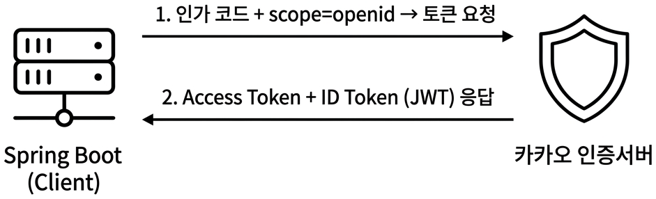

*그림 2-5a: ID Token 발급 — scope에 openid를 추가하면 ID Token이 함께 응답된다*

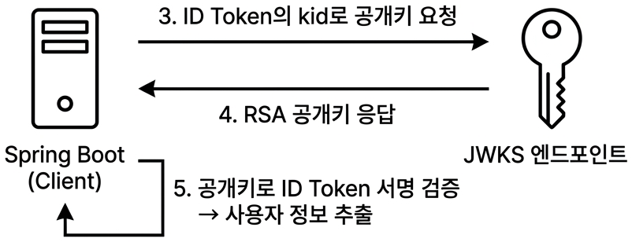

*그림 2-5b: JWKS 검증 — 공개키로 ID Token의 서명을 확인하고 사용자 정보를 추출한다*

OIDC를 사용하려면 토큰 요청 시 `scope` 에 `openid` 를 추가합니다. 그러면 응답에 `id_token` 필드가 포함됩니다. 이 ID Token은 JWT 형식이므로 Header, Payload, Signature 세 부분으로 구성됩니다. Header에는 서명 알고리즘과 `kid` (키 ID)가 들어 있습니다. 이 `kid` 를 카카오의 **JWKS(JSON Web Key Set)** 엔드포인트에 보내면 해당 공개키를 받을 수 있습니다. 받은 공개키로 서명을 검증하면 ID Token이 카카오가 발급한 진짜인지 확인됩니다.

#### JWKS 공개키 검증 구현

아래 코드를 `KakaoOidcUtil.java` 에 작성합니다.

```java
public KakaoOidcResponse verify(String idToken) {
    SignedJWT signedJWT = SignedJWT.parse(idToken);
    RSAKey rsaKey = getKeyFromJwks(signedJWT.getHeader().getKeyID());

    if (!signedJWT.verify(new RSASSAVerifier(rsaKey))) {
        throw new RuntimeException("카카오 id_token 서명 검증 실패");
    }
    JWTClaimsSet claims = signedJWT.getJWTClaimsSet();
    return new KakaoOidcResponse(
            claims.getSubject(),
            claims.getStringClaim("nickname"),
            claims.getExpirationTime().toInstant());
}
```

`SignedJWT.parse` 로 ID Token 문자열을 파싱합니다. Header에서 `kid` 를 꺼내 JWKS 엔드포인트에서 RSA 공개키를 조회합니다. `RSASSAVerifier` 로 서명을 검증하고 Payload에서 사용자 식별값(`sub`)과 닉네임을 추출합니다.

공개키를 가져오는 부분도 살펴보겠습니다.

```java
private RSAKey getKeyFromJwks(String keyId) {
    JWKSet jwkSet = JWKSet.load(URI.create(kakaoOidcJwksUri).toURL());
    JWK jwk = jwkSet.getKeyByKeyId(keyId);
    if (!(jwk instanceof RSAKey rsaKey)) {
        throw new RuntimeException("RSA 키가 아닙니다: " + keyId);
    }
    return rsaKey;
}
```

`JWKSet.load` 가 카카오의 JWKS 엔드포인트(`https://kauth.kakao.com/.well-known/jwks.json`)에 HTTP 요청을 보내 공개키 목록을 가져옵니다. `kid` 로 해당하는 키를 찾아 RSA 키로 캐스팅합니다. nimbus-jose-jwt 라이브러리가 이 과정을 처리합니다.

Postman에서 OIDC 로그인 흐름을 테스트합니다. 카카오 로그인 → 동의 → 콜백까지 진행하면 응답에 JWT와 사용자 정보가 포함됩니다.

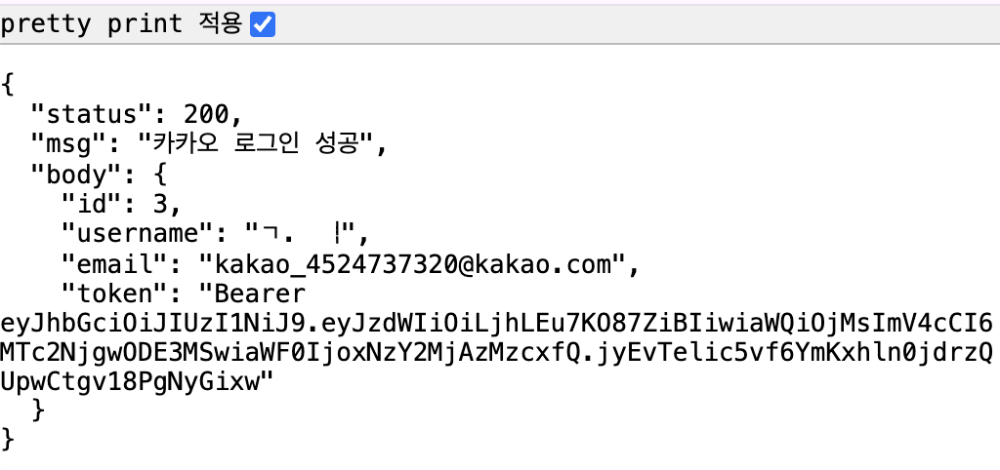

*OIDC 로그인 성공 응답 -- ID Token 검증 후 사용자 정보와 우리 서비스 JWT가 반환된다. Authorization 헤더에 Bearer {JWT}가 들어 있으면 성공이다*

#### JWT 인증 필터

OIDC로 사용자를 확인한 뒤 우리 서비스용 JWT를 발급합니다. 이후 모든 요청에서 이 JWT를 검증하는 필터가 필요합니다. 아래 코드를 `JwtAuthFilter.java` 에 작성합니다.

```java
@Override
protected void doFilterInternal(HttpServletRequest request,
        HttpServletResponse response, FilterChain filterChain)
        throws ServletException, IOException {
    try {
        jwtProvider.verifyFromHeader(request);
        filterChain.doFilter(request, response);
    } catch (Exception e) {
        response.setStatus(HttpServletResponse.SC_UNAUTHORIZED);
        response.setContentType("application/json;charset=UTF-8");
        response.getWriter().write(
                objectMapper.writeValueAsString(
                        new Resp<>(401, e.getMessage(), null)));
    }
}
```

`OncePerRequestFilter` 를 상속해서 모든 요청마다 한 번씩 실행됩니다. `Authorization` 헤더에서 JWT를 꺼내 `JwtProvider` 가 검증합니다. 검증에 실패하면 401 응답을 반환합니다. 로그인 경로(`/login/kakao`, `/oauth/callback`)는 `shouldNotFilter` 에서 제외합니다.

JWT를 만들고 검증하는 `JwtUtil` 의 핵심 흐름입니다.

```java
public static String create(User user) {
    JWTClaimsSet claims = new JWTClaimsSet.Builder()
            .subject(user.getUsername())
            .issueTime(new Date())
            .expirationTime(new Date(System.currentTimeMillis() + EXPIRATION_TIME))
            .claim("id", user.getId())
            .build();
    SignedJWT signedJWT = new SignedJWT(new JWSHeader(JWSAlgorithm.HS256), claims);
    signedJWT.sign(new MACSigner(SECRET));
    return TOKEN_PREFIX + signedJWT.serialize();
}
```

카카오 ID Token은 RSA(공개키)로 서명되어 있었지만 우리 서비스 JWT는 HS256(대칭키)으로 만듭니다. 우리 서버만 만들고 우리 서버만 검증하니까 같은 열쇠 하나면 충분합니다.

### 2.4 정리

| 항목 | Code 방식 (SSR) | Code + OIDC 방식 (REST API) |
|------|----------------|---------------------------|
| 토큰 교환 | Access Token 발급 | Access Token + ID Token 발급 |
| 사용자 정보 조회 | 카카오 API 추가 호출 필요 | ID Token 안에 포함 (추가 호출 불필요) |
| 검증 방식 | 없음 (카카오 API가 대신 검증) | JWKS 공개키로 ID Token 서명 검증 |
| 인증 유지 | 서버 세션 | JWT (Authorization 헤더) |
| 적합한 구조 | 서버 렌더링 (Mustache, Thymeleaf) | 프론트-백엔드 분리 (React, Vue) |

JWT 심화 주제인 Access Token / Refresh Token 전략은 이 책의 범위를 벗어납니다. 핵심만 정리하면 Access Token은 수명을 짧게(15분~1시간), Refresh Token은 길게(7~30일) 설정해서 Access Token이 만료되면 Refresh Token으로 재발급받는 구조입니다.

| 비유 | OAuth / OIDC 용어 | 정식 정의 |
|------|-------------------|----------|
| 대사관 | **인가 서버 (Authorization Server)** | 사용자를 인증하고 토큰을 발급하는 서버 |
| 신청서 | **인가 코드 (Authorization Code)** | 사용자 동의 후 클라이언트에 전달되는 일회용 코드 |
| 접수증 | **액세스 토큰 (Access Token)** | 리소스 서버에 접근할 권한을 증명하는 토큰 |
| 여권 | **ID 토큰 (ID Token)** | 사용자 식별 정보가 담긴 JWT. OIDC에서 발급 |
| 위변조 방지 도장 | **JWKS (JSON Web Key Set)** | 토큰 서명을 검증할 수 있는 공개키 목록 |
| 같은 열쇠 자물쇠 | **대칭키 (Symmetric Key)** | 암호화와 복호화에 같은 키를 사용하는 방식 |
| 열쇠 두 개 자물쇠 | **공개키 (Public Key)** | 서명(개인키)과 검증(공개키)에 다른 키를 사용하는 방식 |

---

## 이것만은 기억하자

소셜 로그인은 결국 토큰 교환입니다. 인가 코드를 보내면 토큰이 돌아오고 토큰으로 사용자를 확인합니다. OAuth 2.0은 "권한을 위임"하는 표준이고 OIDC는 그 위에 "누구인지"를 알려주는 계층을 얹은 것입니다. 화살표가 아무리 많아도 우리 서버가 하는 일은 "카카오한테 물어보고 답을 받는 것" 하나입니다.

다음 주, 서버가 2대가 되면서 로그인이 풀리기 시작합니다.
