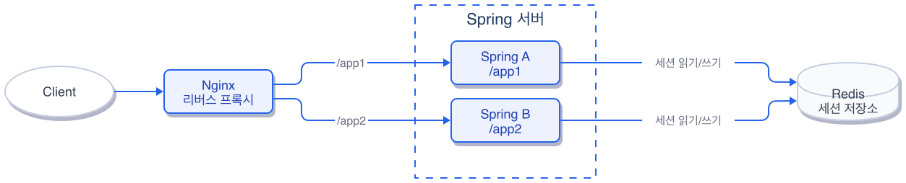
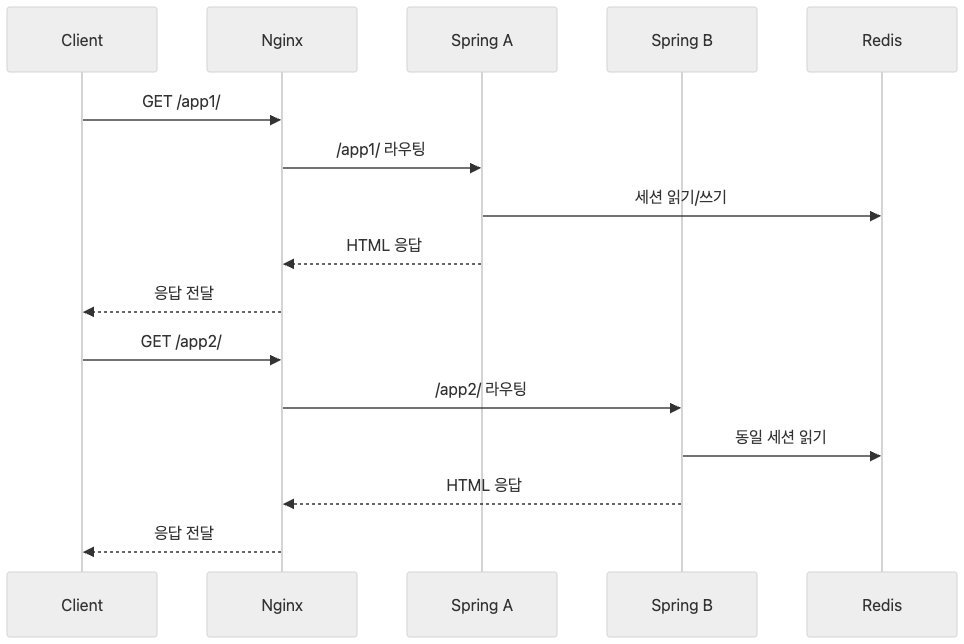
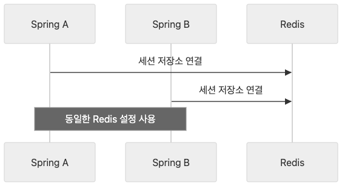
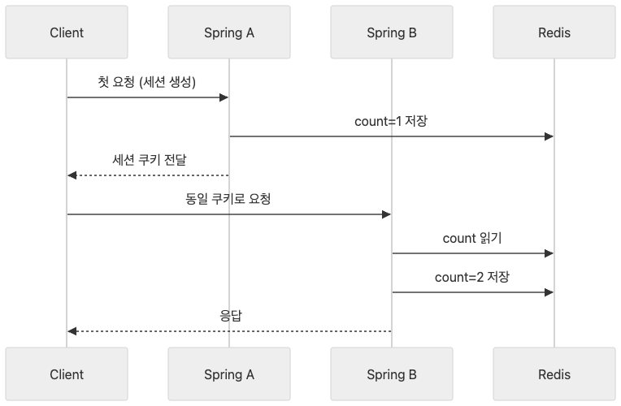
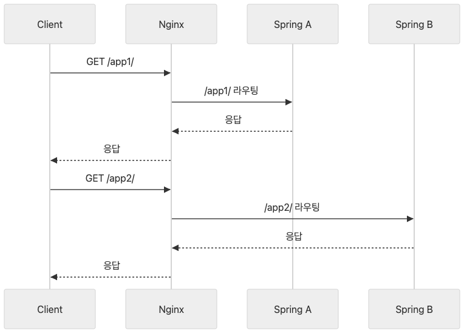
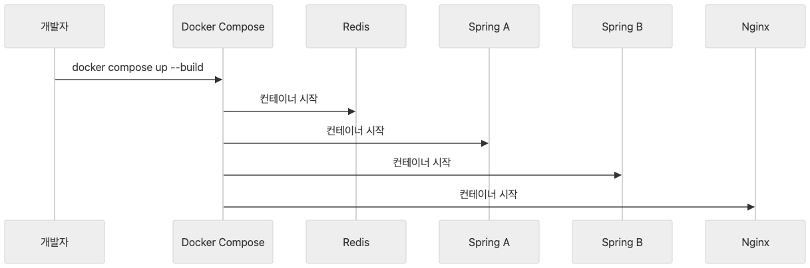
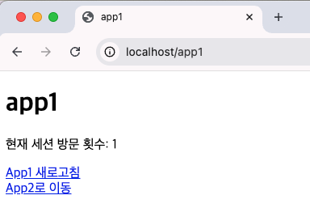
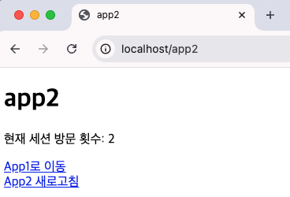
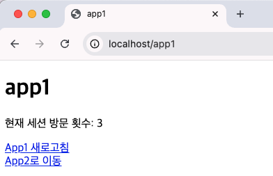
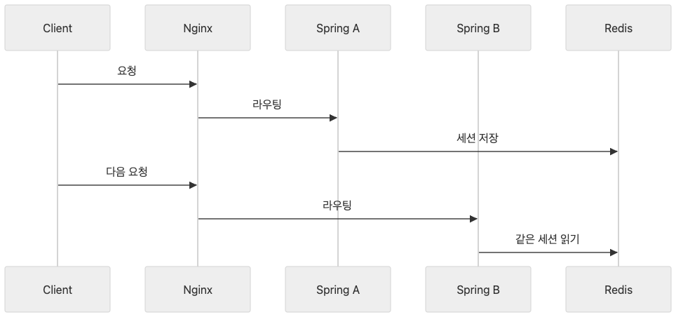

# Ch.3 Redis — 세션 공유

## 서버 2대의 배신

카카오 로그인을 붙인 서비스가 잘 돌아가고 있었습니다. 사용자가 조금씩 늘자 **팀장** 이 슬랙을 보냈습니다.

**팀장**: "트래픽이 좀 늘고 있어요. 서버 한 대 더 띄워주세요."

(서버 한 대 더? Docker Compose에 서비스 하나 복사하면 되겠지.)

어렵지 않은 일이었습니다. 서버를 2대로 늘리고 Nginx를 앞에 세워서 요청을 나눴습니다. 배포를 마치고 모니터를 바라봤습니다. 잘 돌아가는 것 같았습니다.

30분 뒤 **선배** 가 고개를 돌렸습니다.

**선배**: "나 방금 로그인했는데 페이지 새로고침하니까 다시 로그인하래."

(뭐? 방금 배포한 거밖에 없는데.)

직접 확인해 봤습니다. 로그인하고 페이지를 몇 번 왔다 갔다 하니까 갑자기 "누구세요?"라는 에러가 떴습니다. 다시 로그인하면 또 잠깐 되다가 또 풀렸습니다. 규칙도 없이 무작위로 풀리는 것 같았습니다.

(서버를 늘렸을 뿐인데 왜 로그인이 풀리지.)

---

음식점을 떠올려 보겠습니다.

단골 식당에 갔습니다. 사장님이 혼자 주문도 받고 음식도 만듭니다. "저 매운 거 빼주세요"라고 한마디 하면 사장님이 기억해 둡니다. 다음에 와도 "아 매운 거 빼는 분"이라고 알아봅니다. 손님이 한 명이든 열 명이든 사장님 머릿속에 전부 들어 있습니다.

그런데 장사가 잘 돼서 직원을 한 명 뽑았습니다. 이제 사장님과 직원이 번갈아 주문을 받습니다. 문제는 "매운 거 빼주세요"라고 한 정보가 사장님 머릿속에만 있다는 것입니다. 직원이 주문을 받으면 매운 거 빼달라는 걸 모릅니다. 손님 입장에서는 "아까 말했잖아요"인데 직원 입장에서는 처음 듣는 이야기입니다.

서버 세션이 이 사장님 머릿속과 같습니다. 서버가 1대일 때는 모든 요청이 같은 서버로 가니까 세션 정보가 항상 남아 있습니다. 서버가 2대가 되면 요청이 A로 갔다가 B로 갔다가 합니다. A 서버에서 로그인했는데 다음 요청이 B로 가면 B는 이 사용자를 모릅니다. "누구세요?"가 나옵니다.

해결 방법은 간단합니다. 주문 노트를 카운터에 올려두면 됩니다. 사장님이든 직원이든 카운터 노트를 보면 "매운 거 빼는 분"을 알 수 있습니다. 머릿속이 아니라 공용 장소에 정보를 두는 것입니다.

**Redis** 가 이 카운터 노트 역할을 합니다. 서버 A와 서버 B가 각자 세션을 들고 있는 대신 Redis라는 외부 저장소에 세션을 넣어둡니다. 어느 서버로 요청이 가든 Redis를 보면 "아 이 사람 로그인한 사람이구나"를 알 수 있습니다.

**선배** 에게 설명했습니다.

**오픈이**: "서버마다 세션이 따로 있어서 그래. Redis에 세션을 모으면 돼."

**선배**: "아 그러면 서버가 10대가 돼도 상관없겠네."

맞습니다. 서버가 몇 대든 세션이 한 곳에 있으면 로그인은 풀리지 않습니다. 이제 직접 만들어 보겠습니다.

---

이 장의 실습 코드는 아래 레포에서 확인할 수 있습니다.

```bash
git clone https://github.com/metacoding-11-spring-reference/docker-session-share
```

```
docker-session-share/
├── docker-compose.yml                    [실습] 전체 인프라 구성
├── nginx/nginx.conf                      [설명] 경로 기반 라우팅
├── app1/
│   ├── application.properties            [실습] Redis 세션 설정
│   ├── build.gradle                      [실습] 의존성 추가
│   ├── HomeController.java               [설명] 세션 카운터 로직
│   └── templates/index.mustache          [참고] 서버명 + 카운트 표시
└── app2/
    └── (app1과 동일 구조)                 [참고]
```



*그림 3-1: Redis 세션 공유 아키텍처*

### 환경 준비

이번 장의 docker-compose.yml은 4개 서비스를 정의합니다.

| 서비스 | 역할 |
|--------|------|
| **redis** | 세션 저장소. 서버 A와 B가 공유하는 외부 메모리 |
| **app1** | Spring Boot 서버 A. `SERVER_NAME=App1-Server` |
| **app2** | Spring Boot 서버 B. `SERVER_NAME=App2-Server` |
| **nginx** | 리버스 프록시. URL 경로에 따라 app1 또는 app2로 요청을 분배 |

Nginx 설정 파일은 `nginx/nginx.conf` 에 위치합니다. 이 파일이 `/app1` 경로를 서버 A로, `/app2` 경로를 서버 B로 보내는 라우팅 규칙을 담고 있습니다. docker-compose.yml의 `volumes` 설정으로 컨테이너 안의 Nginx가 이 파일을 읽습니다.

### 3.1 전체 아키텍처

클라이언트의 요청이 서비스에 도착하기까지의 흐름입니다.



*그림 3-1: 전체 아키텍처 -- 클라이언트 요청은 Nginx를 거쳐 서버 A 또는 B로 전달되고 세션은 Redis에 저장된다*

요청 흐름은 네 단계입니다.

| 순서 | 구간 | 설명 |
|------|------|------|
| 1 | Client -> Nginx | 브라우저가 `localhost`로 요청 |
| 2 | Nginx -> Spring A 또는 B | 경로(`/app1`, `/app2`)에 따라 서버 분기 |
| 3 | Spring -> Redis | 세션 조회/저장 |
| 4 | Spring -> Client | 응답 반환 |



*그림 3-2: 서버 A, B 역할 -- 두 서버는 동일한 애플리케이션이며 Redis를 통해 세션을 공유한다*

서버 A와 서버 B는 완전히 같은 코드입니다. 다른 점은 `SERVER_NAME` 환경 변수뿐입니다. 어느 서버에서 응답했는지 화면에 표시하기 위한 값입니다.

### 3.2 Spring Session + Redis 설정

Spring Boot가 세션을 Redis에 저장하도록 설정합니다. 먼저 의존성을 추가합니다. 아래 코드를 `build.gradle` 에 작성합니다.

```groovy
dependencies {
    implementation 'org.springframework.boot:spring-boot-starter-web'
    implementation 'org.springframework.boot:spring-boot-starter-mustache'
    implementation 'org.springframework.boot:spring-boot-starter-data-redis'
    implementation 'org.springframework.session:spring-session-data-redis'
}
```

`spring-boot-starter-data-redis` 는 Redis 연결을 담당하고 `spring-session-data-redis` 는 서블릿 세션을 Redis로 대체합니다. 이 두 줄만 추가하면 **Spring Session** 이 자동으로 활성화됩니다.

다음은 Redis 연결 정보입니다. 아래 내용을 `application.properties` 에 작성합니다.

```properties
spring.session.store-type=redis
spring.data.redis.host=${SPRING_REDIS_HOST:redis}
spring.data.redis.port=${SPRING_REDIS_PORT:6379}
```

`store-type=redis` 한 줄이 핵심입니다. 이 설정만으로 `HttpSession` 의 저장소가 서버 메모리에서 Redis로 바뀝니다. `SPRING_REDIS_HOST` 는 Docker 환경에서 컨테이너 이름으로 주입됩니다.



*그림 3-3: 세션 공유 코드 흐름 -- application.properties 설정만으로 세션 저장소가 Redis로 전환된다*

세션에 방문 횟수를 저장하는 컨트롤러의 핵심 흐름입니다.

```java
@GetMapping("/")
public String home(HttpServletRequest request, Model model) {
    HttpSession session = request.getSession();
    Integer count = (Integer) session.getAttribute("count");
    count = (count == null) ? 1 : count + 1;
    session.setAttribute("count", count);

    model.addAttribute("serverName", serverName);
    model.addAttribute("count", count);
    return "index";
}
```

`request.getSession()` 이 반환하는 세션 객체가 이미 Redis에 연결되어 있습니다. `getAttribute` 로 읽고 `setAttribute` 로 쓰면 Redis에 자동으로 반영됩니다. 기존 코드를 한 줄도 바꾸지 않아도 됩니다.

### 3.3 Nginx 경로 기반 라우팅

Nginx가 URL 경로를 보고 요청을 서버 A 또는 B로 보냅니다.



*그림 3-4: Nginx 라우팅 -- `/app1` 경로는 서버 A로, `/app2` 경로는 서버 B로 전달된다*

```nginx
events { worker_connections 1024; }

http {
    upstream app1_upstream { server app1:8080; }
    upstream app2_upstream { server app2:8080; }

    server {
        listen 80;
        location /app1 { proxy_pass http://app1_upstream/; }
        location /app2 { proxy_pass http://app2_upstream/; }
        location = / { return 302 /app1/; }
        proxy_redirect off;
        proxy_set_header Host $host;
        proxy_set_header X-Real-IP $remote_addr;
    }
}
```

`upstream` 은 "이 이름으로 요청하면 이 서버로 보내라"는 별칭입니다. `/app1` 으로 들어온 요청은 `app1:8080` 으로, `/app2` 는 `app2:8080` 으로 전달됩니다. 루트 경로(`/`)는 `/app1/` 으로 리다이렉트합니다. `proxy_set_header` 는 원래 요청의 호스트와 IP 정보를 뒷단 서버에 전달합니다.

### 3.4 docker-compose 구성

전체 인프라를 하나의 파일로 정의합니다. 아래 코드를 `docker-compose.yml` 에 작성합니다.



*그림 3-5: docker-compose 구성 -- Nginx, Spring A, Spring B, Redis 4개 컨테이너가 하나의 네트워크에서 동작한다*

```yaml
services:
  nginx:
    image: nginx:latest
    ports:
      - "80:80"
    volumes:
      - ./nginx/nginx.conf:/etc/nginx/nginx.conf
    depends_on:
      - app1
      - app2

  app1:
    build: ./app1
    environment:
      - SERVER_NAME=App1-Server
      - SPRING_REDIS_HOST=redis
    depends_on:
      - redis

  app2:
    build: ./app2
    environment:
      - SERVER_NAME=App2-Server
      - SPRING_REDIS_HOST=redis
    depends_on:
      - redis

  redis:
    image: redis:latest
    ports:
      - "6379:6379"
```

컨테이너는 4개입니다. Nginx가 앞에서 요청을 받고 app1과 app2가 처리하며 redis가 세션을 저장합니다. `depends_on` 으로 실행 순서를 지정합니다. Redis가 먼저 뜨고 Spring 앱이 뜨고 Nginx가 마지막에 뜹니다. `SPRING_REDIS_HOST=redis` 는 Docker 네트워크 안에서 redis 컨테이너를 호스트명으로 찾으라는 뜻입니다.

### 3.5 실행 & 세션 공유 확인

모든 파일이 준비되었으면 실행합니다.

```bash
docker-compose up --build
```

빌드가 끝나면 4개 컨테이너가 모두 올라왔는지 확인합니다. 터미널을 새로 열고 다음을 실행합니다.

```bash
docker ps
```

`redis`, `nginx`, `app1`, `app2` 4개 컨테이너가 모두 `Up` 상태이면 성공입니다.

[CAPTURE NEEDED: `docker ps` 실행 결과 -- redis, nginx, app1, app2 4개 컨테이너가 Up 상태인 터미널 화면. 경로: assets/CH03/terminal/10_docker-ps.png]

브라우저에서 확인합니다. 먼저 `localhost/app1/` 에 접속합니다.



*그림 3-6: /app1 접속 -- App1-Server에서 응답하고 count가 1이다*

화면에 **App1-Server** 와 **count: 1** 이 표시됩니다. 서버 A가 응답했고 첫 번째 방문입니다.

이번에는 `localhost/app2/` 에 접속합니다.



*그림 3-7: /app2 접속 -- App2-Server에서 응답하지만 count가 2로 이어진다*

서버가 **App2-Server** 로 바뀌었는데 count가 2입니다. 서버가 달라졌는데도 이전 방문 기록이 남아 있습니다. Redis에 세션이 저장되어 있기 때문입니다.

다시 `localhost/app1/` 에 접속합니다.



*그림 3-8: 다시 /app1 접속 -- count가 3으로 이어진다. 서버가 바뀌어도 세션이 유지된다*

count가 3입니다. 서버 A -> 서버 B -> 서버 A로 요청이 오갔지만 세션이 끊기지 않았습니다.

Redis CLI로 세션이 실제로 저장되어 있는지 직접 확인할 수 있습니다.

```bash
docker exec -it redis redis-cli keys '*'
```

`spring:session:sessions:` 로 시작하는 키가 보이면 세션이 Redis에 저장된 것입니다.

[CAPTURE NEEDED: Redis CLI에서 `keys '*'` 실행 결과 -- spring:session 키가 표시된 터미널 화면. 경로: assets/CH03/terminal/11_redis-keys.png]



*그림 3-9: Redis 세션 공유 정리 -- 서버가 여러 대여도 세션을 외부 저장소에 두면 로그인이 유지된다*

식당 비유로 돌아가면 사장님과 직원이 카운터 노트를 함께 보는 상태가 된 것입니다. 누가 주문을 받든 "매운 거 빼는 분"을 알 수 있습니다.

| 비유 | 기술 용어 | 정식 정의 |
|------|----------|----------|
| 사장님 머릿속 | **서버 메모리 세션** | 개별 서버 JVM 내부에 저장되는 HttpSession |
| 카운터 노트 | **Redis** | 인메모리 키-값 저장소. 세션, 캐시 등에 사용 |
| 노트에 적기 | **Spring Session** | HttpSession 구현체를 외부 저장소로 대체하는 프로젝트 |
| 직원 배치표 | **Nginx 리버스 프록시** | 클라이언트 요청을 뒷단 서버로 분배하는 중간 서버 |
| 가게 확장 | **스케일 아웃 (Scale-Out)** | 서버 대수를 늘려 처리 능력을 확장하는 방식 |

---

## 이것만은 기억하자

서버를 늘리면 상태를 외부로 분리해야 합니다. 세션이 서버 메모리에 있으면 요청이 다른 서버로 갈 때 로그인이 풀립니다. Redis에 세션을 저장하면 서버가 몇 대든 같은 세션을 공유할 수 있습니다. Spring Session과 Redis 의존성 두 줄, `store-type=redis` 설정 한 줄이면 기존 코드 변경 없이 전환됩니다.

다음 장에서는 프로필 사진을 넣어달라는 요청이 옵니다.
