# Ch.4 Base64 이미지 업로드

## 사진 한 장이 이렇게 어려울 줄은

서비스가 안정되자 **팀장** 이 새로운 요청을 보냈습니다.

**팀장**: "사용자 프로필에 사진 넣을 수 있게 해주세요. 간단하죠?"

(간단하다고요?)

회원가입, 로그인, 세션까지는 전부 텍스트였습니다. 이름, 이메일, 비밀번호. 전부 글자입니다. 그런데 사진은 글자가 아닙니다. 파일입니다. 서버에 글자를 보내는 건 해봤는데 파일을 보내는 건 해본 적이 없었습니다.

(JSON으로 이름이랑 이메일 보내듯이 사진도 보내면 안 되나? 근데 사진은 JSON이 아닌데.)

**선배** 에게 물어봤습니다.

**오픈이**: "이미지를 서버에 보내려면 어떻게 해?"

**선배**: "Multipart로 보내거나 Base64로 인코딩해서 보내거나."

**오픈이**: "Base64가 뭔데?"

**선배**: "사진을 글자로 바꾸는 거야."

(사진을 글자로?)

---

택배를 보내본 적 있으면 이해가 빠릅니다.

친구에게 케이크를 보내고 싶습니다. 그런데 택배 규정이 "상자 안에는 서류만 넣을 수 있습니다"라고 되어 있습니다. 케이크는 서류가 아닙니다. 그냥 넣으면 접수가 안 됩니다.

방법이 하나 있습니다. 케이크를 사진으로 찍고 레시피를 적어서 서류 형태로 만드는 것입니다. 받는 사람이 그 서류를 보고 케이크를 다시 만들면 됩니다. 원본 케이크와 똑같은 것이 도착합니다.

**Base64** 가 이 과정과 같습니다. 이미지 파일은 바이너리 데이터입니다. JSON은 텍스트만 담을 수 있습니다. 바이너리를 그냥 JSON에 넣으면 깨집니다. 그래서 이미지를 텍스트 형태로 변환(인코딩)해서 JSON에 담고 서버에 보냅니다. 서버는 받은 텍스트를 다시 이미지 파일로 변환(디코딩)해서 저장합니다.

케이크를 서류로 바꿔 보내고 받는 쪽에서 다시 케이크로 복원하는 것입니다.

**선배** 에게 다시 말했습니다.

**오픈이**: "아 그러면 프론트에서 이미지를 텍스트로 바꿔서 JSON으로 보내면 되는 거네."

**선배**: "맞아. 서버에서 다시 파일로 복원해서 저장하면 끝이야."

(텍스트로 바뀌면 지금까지 하던 것처럼 JSON으로 주고받을 수 있겠다.)

이제 직접 만들어 보겠습니다.

---

이 장의 실습 코드는 아래 레포에서 확인할 수 있습니다.

```bash
git clone https://github.com/metacoding-11-spring-reference/spring-base64
```

```
spring-base64/
├── ImageController.java      [참고] 엔드포인트 정의
├── ImageService.java         [실습] Base64 디코딩 + UUID + 저장
├── ImageEntity.java          [설명] 엔티티 구조
├── ImageRequest.java         [설명] 요청 DTO (fileName, fileData)
├── ImageResponse.java        [참고] 응답 DTO
├── ImageRepository.java      [참고] JPA Repository
├── WebConfig.java            [설명] 정적 리소스 매핑
├── CorsConfig.java           [설명] CORS 설정
└── application.properties    [참고] 정적 리소스 경로

react-base64/                 [참고] 프론트 연동 확인용
└── (React 프로젝트)
```

React 프론트엔드 코드는 별도 레포에 있습니다.

```bash
git clone https://github.com/metacoding-11-spring-reference/react-base64
```

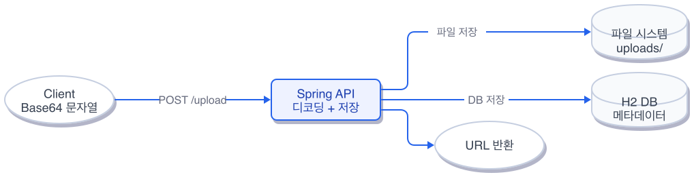

*그림 4-1: Base64 이미지 업로드 흐름*

### 4.1 전체 흐름 한눈에 보기

이미지 업로드의 전체 흐름입니다.

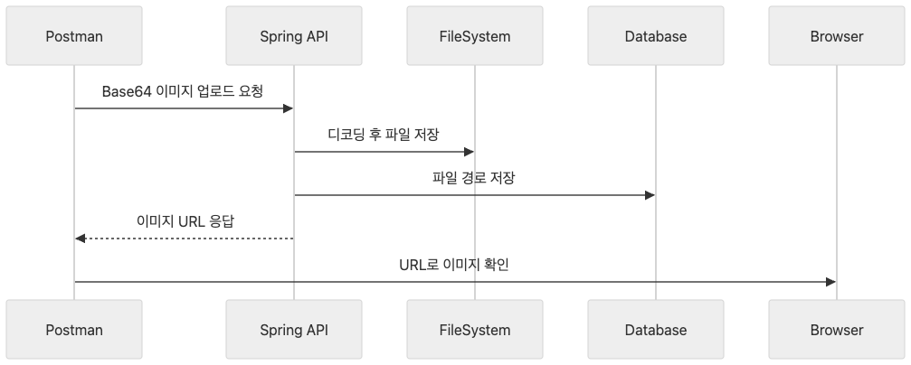

*그림 4-1: 업로드 전체 흐름 -- Postman이 Base64 문자열을 보내면 Spring이 파일로 복원하고 DB에 기록한 뒤 URL을 반환한다*

| 순서 | 구간 | 설명 |
|------|------|------|
| 1 | Postman -> Spring | Base64로 인코딩된 이미지를 JSON에 담아 전송 |
| 2 | Spring 내부 | Base64 디코딩 -> 바이트 배열 -> 파일 저장 |
| 3 | Spring -> DB | 파일 경로, UUID, 파일명을 엔티티로 저장 |
| 4 | Spring -> Postman | 저장된 이미지 정보를 JSON으로 반환 |

택배 비유로 보면 1번이 "서류로 바꿔서 보내기"이고 2번이 "받아서 케이크로 복원"입니다. 3번은 복원한 케이크가 어디에 있는지 기록하는 것이고 4번은 "잘 받았습니다" 영수증입니다.

### 4.2 엔티티 + DTO 설계

이미지 정보를 저장할 엔티티입니다.

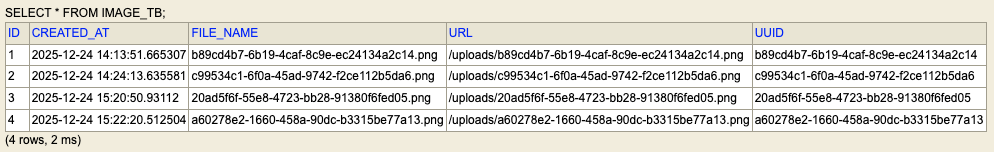

*그림 4-2: ImageEntity 구조 -- id, uuid, fileName, url, createdAt 5개 필드로 구성된다*

```java
@Entity
@Table(name = "image_tb")
public class ImageEntity {
    @Id
    @GeneratedValue(strategy = GenerationType.IDENTITY)
    private Long id;
    private String uuid;
    private String fileName;
    private String url;
    private LocalDateTime createdAt;
}
```

`uuid` 는 파일명 충돌을 방지합니다. 사용자 10명이 동시에 `profile.png` 를 올려도 서버에 저장되는 파일명은 전부 다릅니다. `url` 은 브라우저에서 이미지에 접근할 수 있는 경로입니다.

요청과 응답을 담는 DTO입니다.

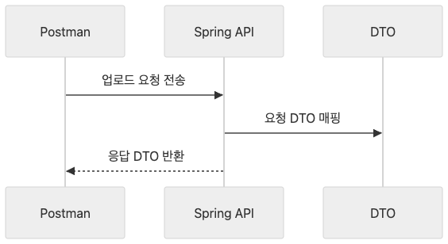

*그림 4-3: DTO 설계 -- 요청은 파일명과 Base64 문자열을 받고 응답은 저장된 이미지 정보를 반환한다*

```java
public record UploadDTO(
    String fileName,
    String fileData
){}
```

`fileName` 은 원본 파일명이고 `fileData` 는 Base64로 인코딩된 이미지 문자열입니다. 택배 비유에서 `fileName` 이 "초코 케이크"라는 이름이고 `fileData` 가 서류로 바꾼 레시피입니다.

응답 DTO는 엔티티의 정보를 그대로 돌려줍니다.

```java
public record DTO(
    Long id, String uuid, String fileName,
    String url, LocalDateTime createdAt
) {
    public static DTO fromEntity(ImageEntity imageEntity) {
        return new DTO(
            imageEntity.getId(), imageEntity.getUuid(),
            imageEntity.getFileName(), imageEntity.getUrl(),
            imageEntity.getCreatedAt()
        );
    }
}
```

`fromEntity` 는 엔티티를 DTO로 변환하는 정적 팩토리 메서드입니다. 컨트롤러가 엔티티를 직접 반환하지 않고 DTO로 감싸서 반환합니다.

### 4.3 업로드 API 구현

이 장의 핵심입니다. Base64 문자열을 받아서 파일로 복원하고 저장하는 과정입니다.

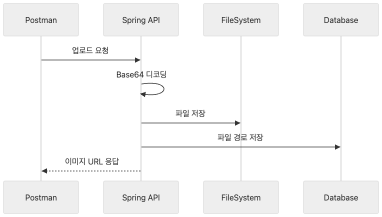

*그림 4-4: 업로드 API 흐름 -- Base64 디코딩, UUID 생성, 파일 저장, DB 기록 순서로 진행된다*

아래 코드를 `ImageService.java` 에 작성합니다.

```java
byte[] fileBytes = Base64.getDecoder().decode(uploadDTO.fileData());

String uuid = UUID.randomUUID().toString();
int dotIndex = uploadDTO.fileName().lastIndexOf('.');
String ext = uploadDTO.fileName().substring(dotIndex + 1).toLowerCase();
String savedFileName = uuid + "." + ext;

Path filePath = Paths.get("uploads").resolve(savedFileName);
Files.write(filePath, fileBytes);

String publicUrl = "/uploads/" + savedFileName;
imageRepository.save(ImageEntity.builder()
    .uuid(uuid).fileName(savedFileName)
    .url(publicUrl).createdAt(LocalDateTime.now()).build());
```

`Base64.getDecoder().decode()` 가 텍스트를 바이트 배열로 되돌립니다. 택배로 온 서류를 케이크로 복원하는 단계입니다. `UUID.randomUUID()` 로 세상에 하나뿐인 파일명을 만들고 원본 파일의 확장자를 붙입니다. `Files.write()` 로 서버 디스크에 저장하고 `imageRepository.save()` 로 어디에 저장했는지를 DB에 기록합니다.

컨트롤러는 이 서비스를 호출합니다.

```java
@PostMapping("/api/images/upload")
public ImageResponse.DTO upload(
        @RequestBody ImageRequest.UploadDTO uploadDTO) {
    return imageService.upload(uploadDTO);
}
```

`@RequestBody` 가 JSON 본문을 `UploadDTO` 로 변환합니다. 텍스트 형태로 온 이미지가 서비스 레이어에서 파일로 복원됩니다.

Postman으로 테스트해 보겠습니다. 먼저 이미지를 Base64 문자열로 변환해야 합니다.

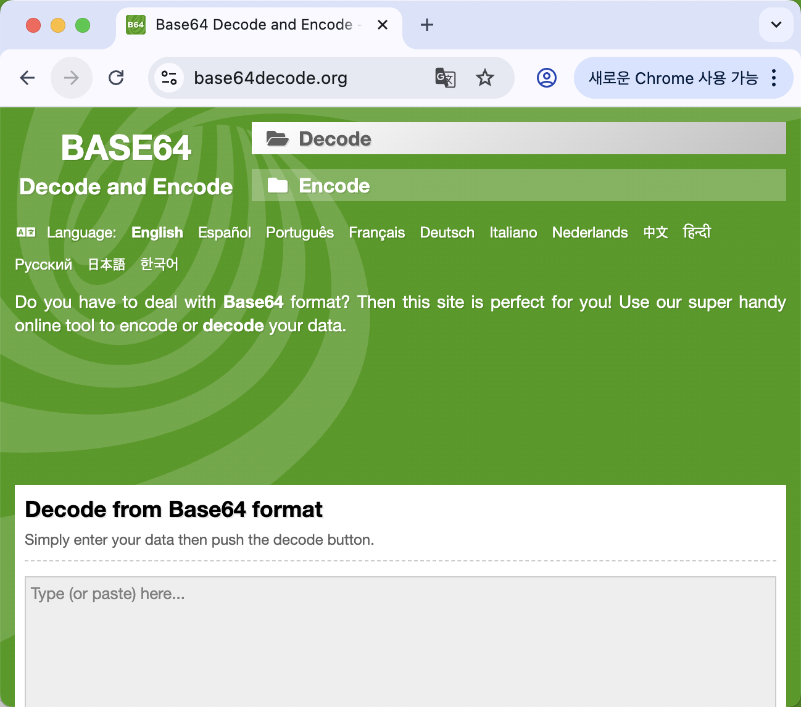

*그림 4-5: Base64 인코딩 -- 온라인 변환 사이트에서 이미지를 업로드하면 Base64 문자열이 생성된다*

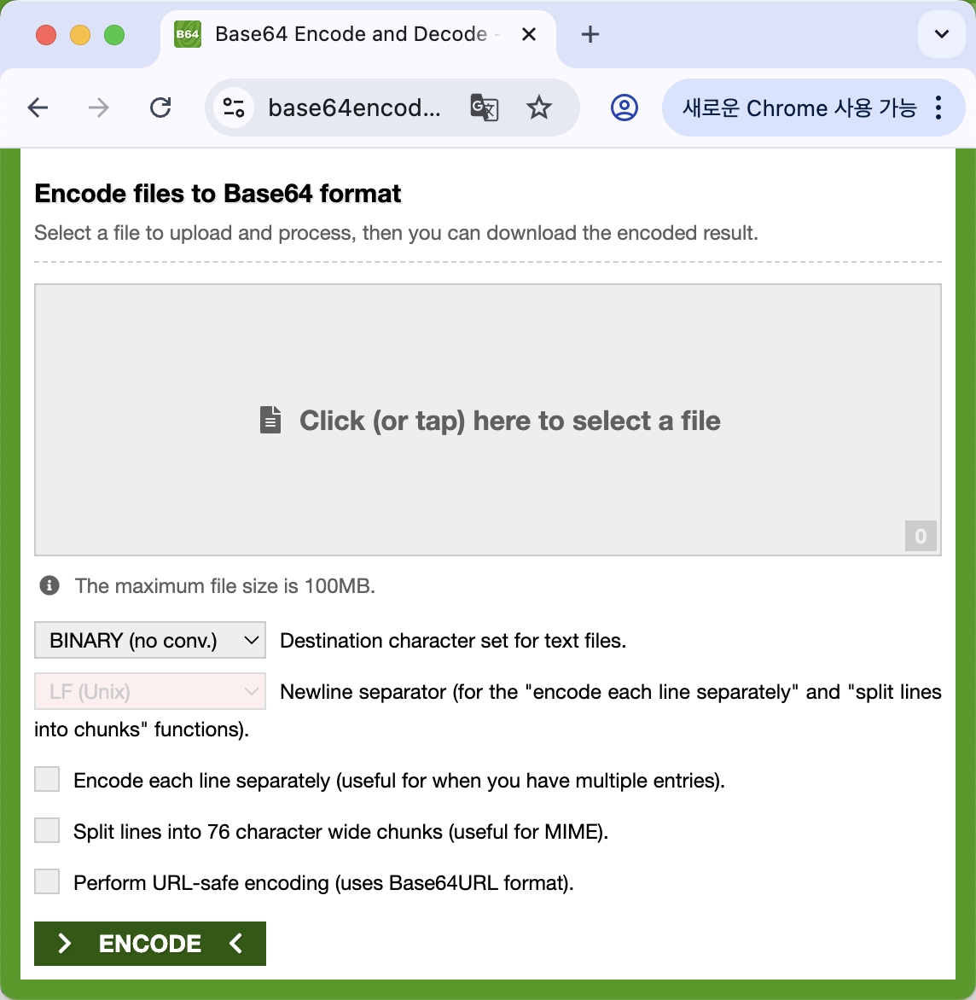

*그림 4-6: 인코딩 결과 -- 이미지가 긴 텍스트 문자열로 변환된다*

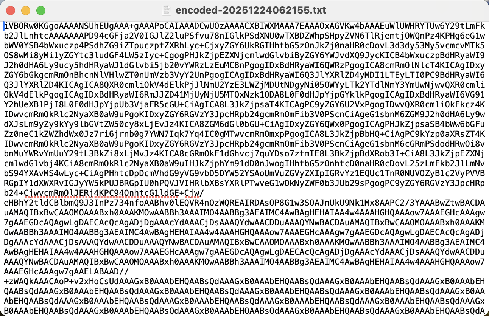

*그림 4-7: 문자열 복사 -- 이 문자열을 Postman의 JSON body에 붙여넣는다*

변환된 문자열을 Postman에서 JSON에 담아 보냅니다.

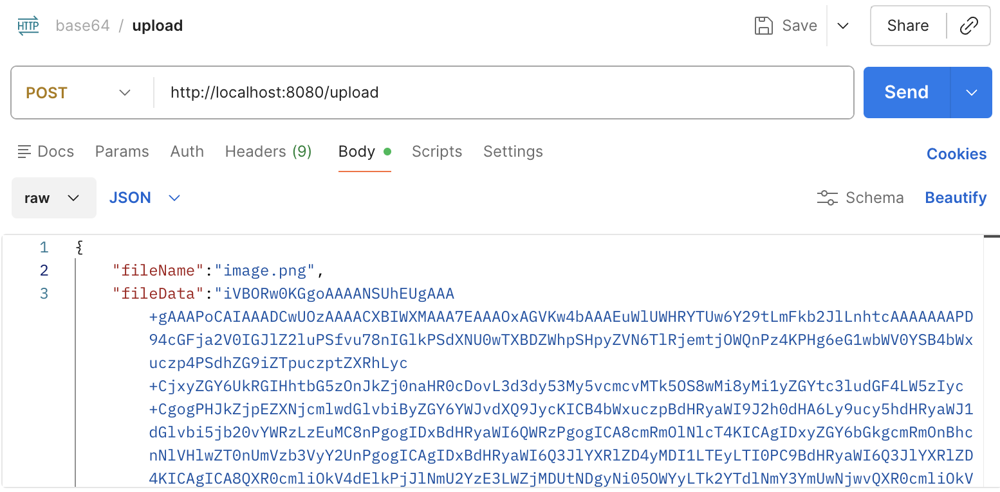

*그림 4-8: Postman 업로드 요청 -- fileName과 fileData를 JSON으로 전송한다*


*그림 4-9: 요청 Body -- fileData에 Base64 문자열이 담겨 있다*


*그림 4-10: 업로드 응답 -- id, uuid, fileName, url, createdAt이 반환된다*

응답 상태 코드가 `200 OK` 이고 본문에 `id`, `uuid`, `fileName`, `url`, `createdAt` 이 모두 보이면 성공입니다.

서버의 `uploads/` 디렉토리에 실제 파일이 생성되었는지 확인합니다.

```bash
ls uploads/
```

[CAPTURE NEEDED: 터미널에서 ls uploads/ 실행 결과 -- UUID가 붙은 이미지 파일(예: 3a7f2c1d-...-profile.png)이 한 개 표시된다]

*ls uploads/ 실행 결과 -- UUID가 붙은 파일명이 한 개 이상 보이면 파일 저장이 정상 동작한 것이다*

응답에 `url` 이 `/uploads/UUID.png` 형태로 돌아옵니다. 이 경로로 브라우저에서 이미지를 볼 수 있습니다.

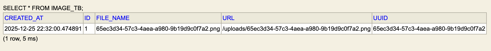

*그림 4-11: 브라우저 확인 -- 반환된 URL로 접속하면 업로드한 이미지가 표시된다*

브라우저 주소창에 `http://localhost:8080/uploads/UUID.png` (응답의 `url` 값)을 입력했을 때 업로드한 이미지가 그대로 표시되면 성공입니다. 여기까지 확인되면 Base64 디코딩, 파일 저장, 정적 리소스 제공이 모두 동작하는 것입니다.

### 4.4 정적 리소스 매핑 + 조회 API

업로드된 이미지를 브라우저에서 바로 볼 수 있으려면 Spring이 `uploads/` 폴더를 정적 리소스로 제공해야 합니다.

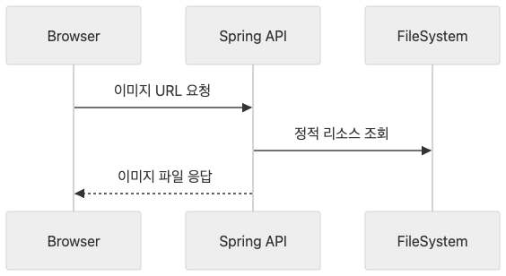

*그림 4-12: 정적 리소스 매핑 -- `/uploads/**` 요청이 서버의 uploads 폴더로 연결된다*

```java
@Override
public void addResourceHandlers(ResourceHandlerRegistry registry) {
    registry.addResourceHandler("/uploads/**")
            .addResourceLocations("file:uploads/");
}
```

`/uploads/**` 로 들어오는 요청을 프로젝트 루트의 `uploads/` 폴더에서 찾으라는 설정입니다. 브라우저가 `/uploads/abc.png` 를 요청하면 서버의 `uploads/abc.png` 파일을 반환합니다.

`application.properties` 에도 정적 리소스 위치를 지정합니다.

```properties
spring.web.resources.static-locations=file:uploads/
```

목록 조회와 단건 조회 API입니다.

```java
@GetMapping("/list")
public List<ImageResponse.DTO> getAllImages() {
    return imageService.listAll();
}

@GetMapping("/{id}")
public ImageResponse.DTO getImageDetail(
        @PathVariable Long id) {
    return imageService.findById(id);
}
```

`/list` 는 저장된 모든 이미지 정보를 반환하고 `/{id}` 는 특정 이미지 한 건을 반환합니다.

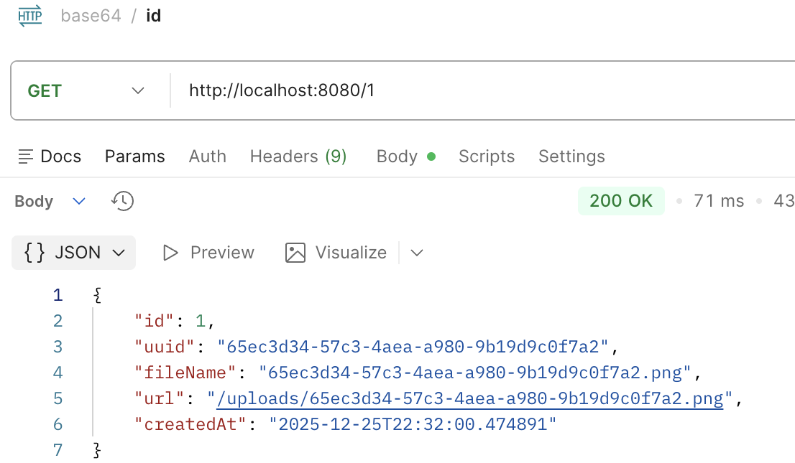

*그림 4-13: 단건 조회 -- id로 특정 이미지 정보를 조회한다*

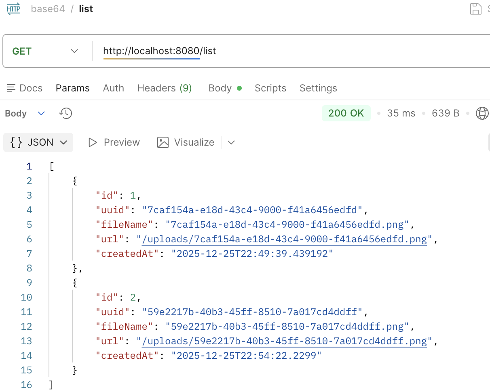

*그림 4-14: 목록 조회 -- 저장된 모든 이미지 목록이 반환된다*


*그림 4-15: 브라우저 이미지 확인 -- 정적 리소스 매핑을 통해 이미지가 브라우저에 표시된다*

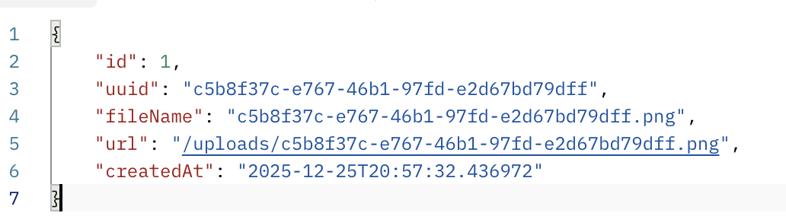

*그림 4-16: 정적 리소스 확인 -- 서버의 uploads 폴더에 저장된 파일이 브라우저에서 직접 접근 가능하다*

### 4.5 React 연동

프론트엔드에서 이미지를 업로드하려면 **CORS(Cross-Origin Resource Sharing)** 설정이 필요합니다. 브라우저는 보안상 다른 출처의 서버에 요청을 보내는 것을 기본적으로 막습니다. React 개발 서버는 `localhost:5173` 에서 돌아가고 Spring은 `localhost:8080` 에서 돌아가므로 포트가 다릅니다. 서로 다른 출처입니다.

```java
config.addAllowedOrigin("http://localhost:5173");
config.addAllowedMethod("*");
config.addAllowedHeader("*");
config.setAllowCredentials(true);
```

`addAllowedOrigin` 으로 React 개발 서버의 주소를 허용합니다. `*` 은 모든 HTTP 메서드와 헤더를 허용한다는 뜻입니다.

CORS를 설정한 뒤 React에서 이미지를 업로드하고 조회할 수 있습니다.

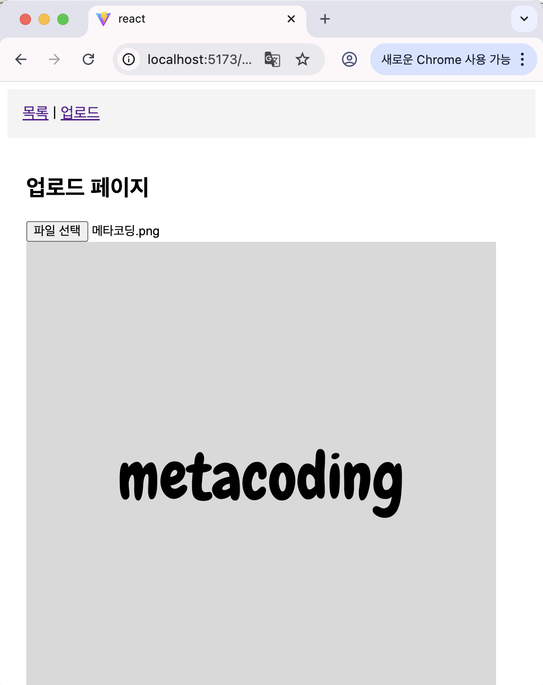

*그림 4-17: React 이미지 업로드 -- 파일을 선택하면 Base64로 변환되어 서버에 전송된다*

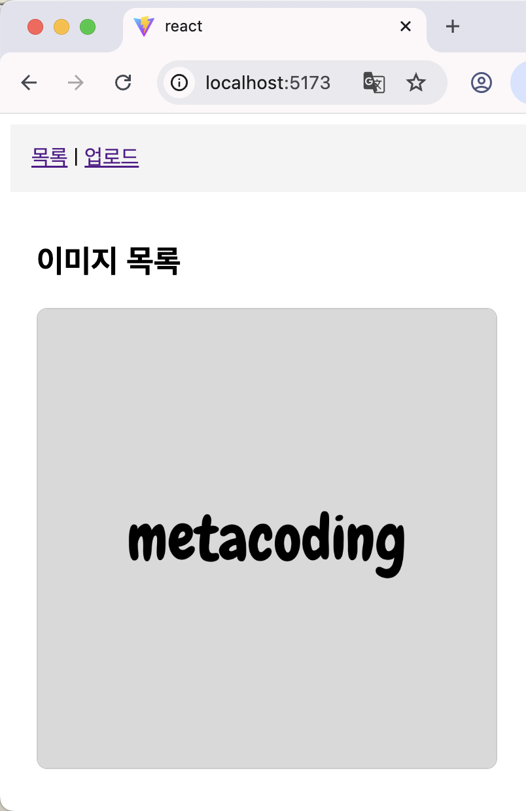

*그림 4-18: React 이미지 목록 -- 서버에 저장된 이미지들이 리스트로 표시된다*

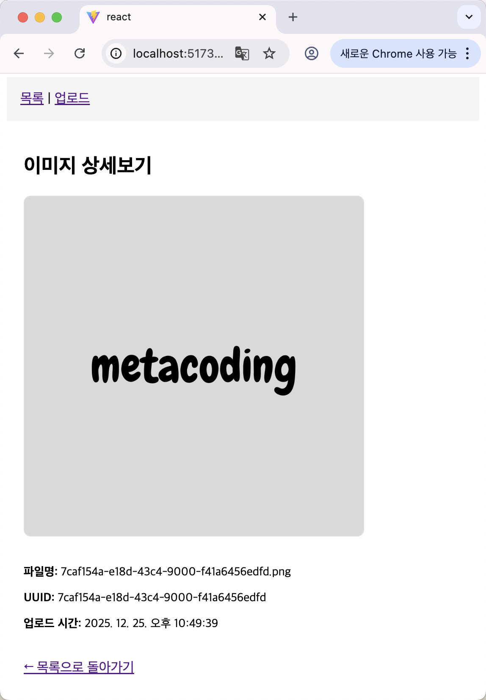

*그림 4-19: React 이미지 상세 -- 개별 이미지의 정보와 원본 이미지가 표시된다*

React 프론트엔드 코드는 `https://github.com/metacoding-11-spring-reference/react-base64` 레포에서 확인할 수 있습니다.

| 비유 | 기술 용어 | 정식 정의 |
|------|----------|----------|
| 서류만 보낼 수 있는 택배 | **JSON** | 텍스트 기반 데이터 교환 형식. 바이너리 데이터를 직접 담을 수 없다 |
| 케이크를 서류로 바꾸기 | **Base64 인코딩** | 바이너리 데이터를 ASCII 문자열로 변환하는 인코딩 방식 |
| 서류를 케이크로 복원 | **Base64 디코딩** | Base64 문자열을 원본 바이너리 데이터로 되돌리는 과정 |
| 세상에 하나뿐인 이름표 | **UUID** | Universally Unique Identifier. 충돌 확률이 극히 낮은 고유 식별자 |
| 케이크 보관 창고 | **uploads 폴더** | 서버 로컬 디스크에 파일을 저장하는 디렉토리 |
| 보관 위치 기록장 | **DB 엔티티** | 파일 메타데이터(경로, 이름, 생성일)를 데이터베이스에 저장하는 객체 |

---

## 이것만은 기억하자

이미지도 결국 문자열입니다. Base64로 인코딩하면 어떤 바이너리 파일이든 텍스트가 됩니다. 텍스트가 되면 JSON에 담을 수 있고 기존의 `@RequestBody` 방식 그대로 서버에 보낼 수 있습니다. 서버에서는 디코딩해서 파일로 복원하고 UUID로 이름을 붙여 저장합니다. 정적 리소스 매핑까지 설정하면 브라우저에서 바로 이미지를 확인할 수 있습니다.

다음 장에서는 이미지가 쌓이면서 서버 디스크가 가득 차는 문제를 만납니다.
