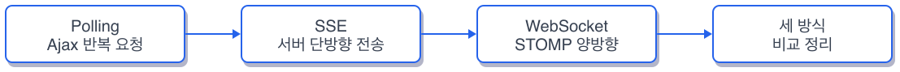
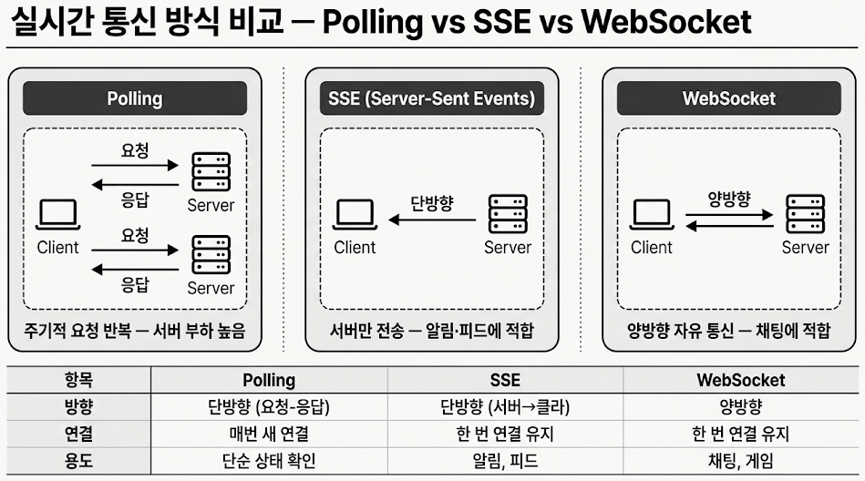
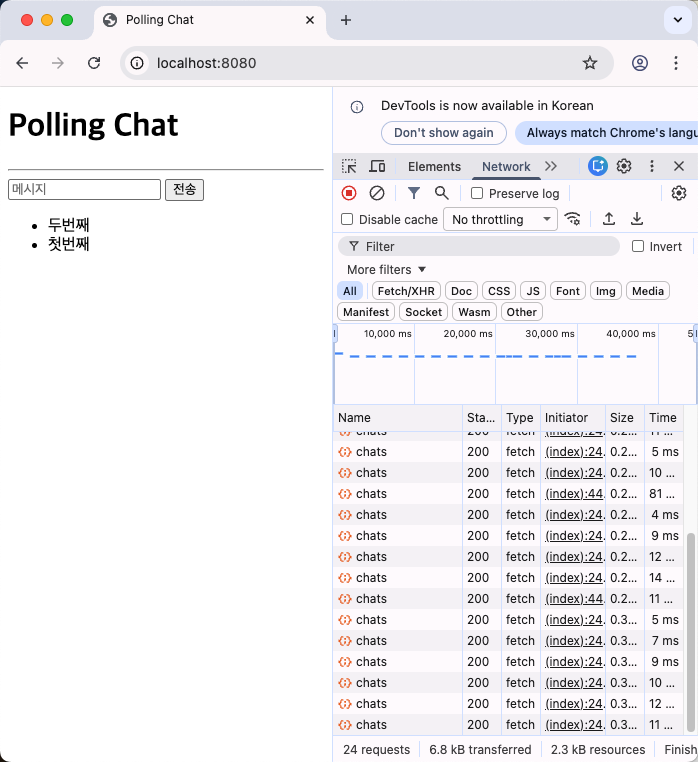
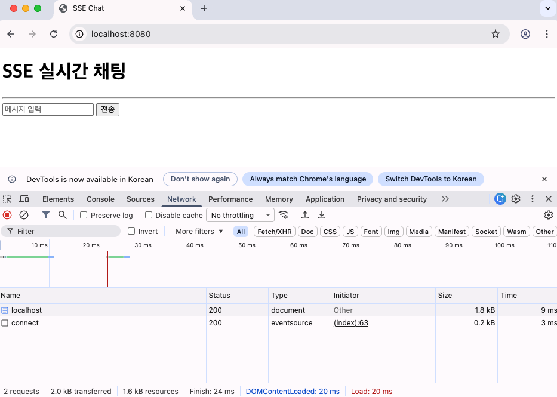
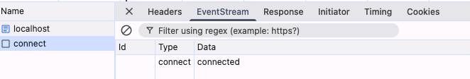
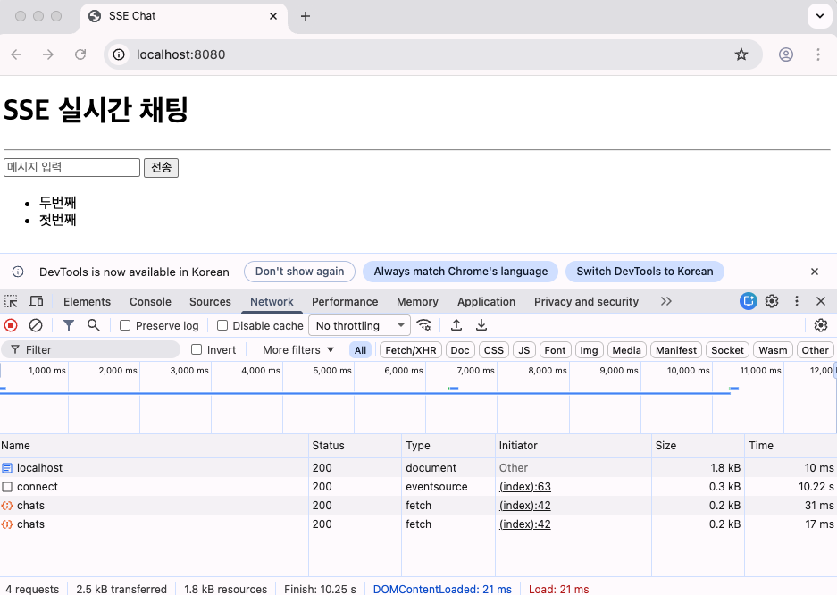
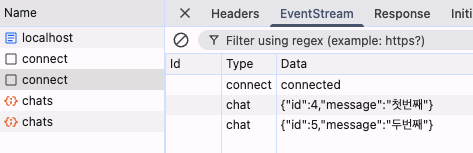
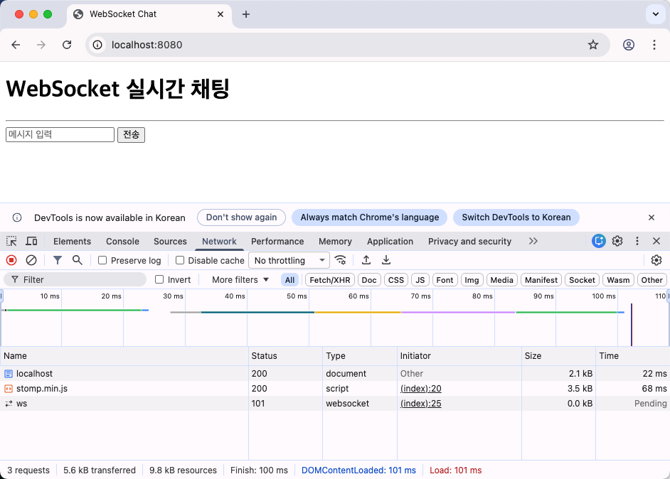
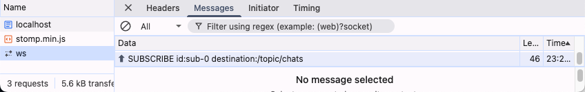
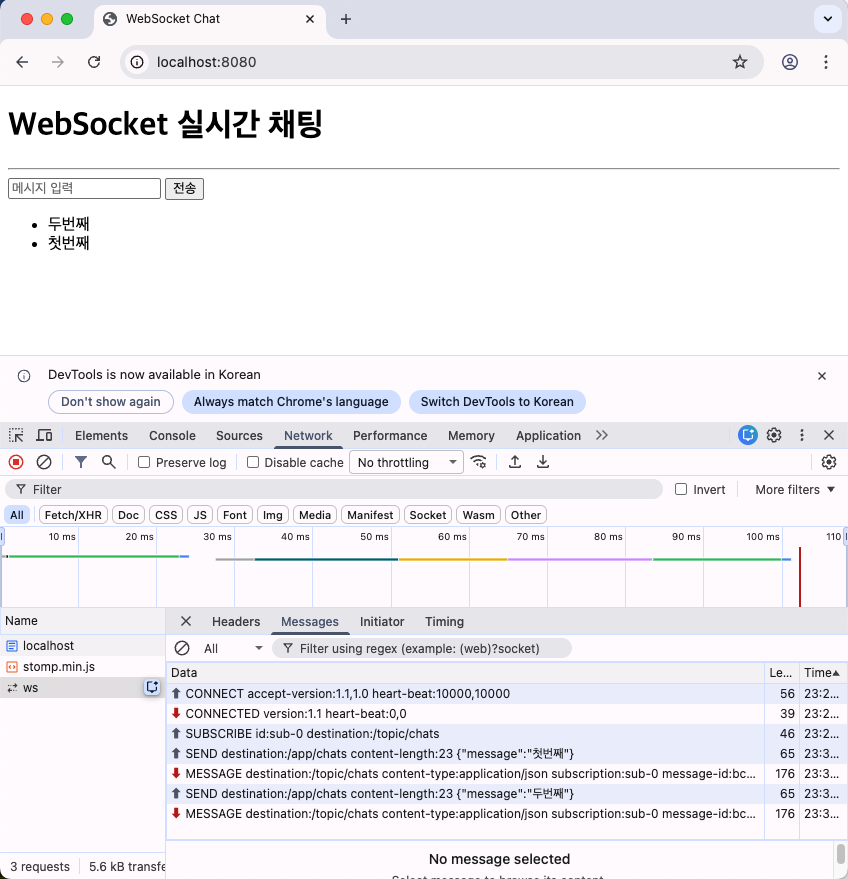

# Ch.6 Polling, SSE, WebSocket

## 알림이 안 와요

금요일 오후, 팀 내부 게시판 기능을 막 배포한 날이었습니다.

**팀장**: "게시판 댓글 알림 기능 좀 넣어줘. 댓글 달리면 바로 알림이 떠야 해."

**오픈이**: "알림이요? 지금도 새로고침하면 보이긴 하는데..."

**팀장**: "새로고침을 누가 계속 해? 카카오톡처럼 바로 떠야지."

(카카오톡처럼?)

카카오톡에서 메시지가 오면 화면을 새로고침하지 않습니다. 그냥 뜹니다. 지금 만든 게시판은 댓글이 달려도 사용자가 직접 새로고침을 눌러야 보입니다. "실시간"이라는 단어가 머릿속에서 맴돌았지만 어디서부터 시작해야 할지 감이 오지 않았습니다.

**선배** 에게 물어봤습니다.

**오픈이**: "실시간 알림을 만들어야 하는데 어떻게 해?"

**선배**: "방법이 세 가지 있어. 쉬운 것부터 말해줄게."

**선배** 가 화이트보드에 그림을 그리기 시작했습니다.

---

식당에 주문한 음식이 나왔는지 확인하는 상황을 떠올려 봅니다.

첫 번째 방법은 카운터에 직접 가서 물어보는 것입니다. "제 음식 나왔어요?" 아직이면 자리로 돌아갔다가 2분 뒤에 다시 가서 묻습니다. 또 아직이면 다시 돌아갑니다. 음식이 나올 때까지 이걸 반복합니다. 이것이 **Polling** 입니다. 단순하지만 바쁜 식당에서 손님이 열 명만 되어도 카운터 앞이 북적입니다.

두 번째 방법은 진동벨입니다. 주문할 때 진동벨을 받아서 자리에 앉습니다. 음식이 나오면 벨이 울립니다. 손님이 카운터에 갈 필요가 없습니다. 가게에서 알아서 알려줍니다. 이것이 **SSE(Server-Sent Events)** 입니다. 가게에서 손님 방향으로만 신호를 보냅니다. 손님이 벨로 가게에 뭔가를 보낼 수는 없습니다. 단방향입니다.

세 번째 방법은 전화입니다. 주문하면서 전화를 연결해 둡니다. 가게에서 "음식 나왔어요"라고 말하면 손님이 "네 갈게요"라고 대답합니다. 손님도 "혹시 반찬 추가할 수 있어요?"라고 물을 수 있습니다. 양쪽이 자유롭게 말합니다. 이것이 **WebSocket** 입니다. 양방향 통신입니다. 전화를 걸 때도 "여보세요"부터 시작하는 약속이 있듯이 WebSocket 위에도 메시지를 주고받는 약속이 있습니다. 그게 **STOMP** 입니다.

**선배**: "단순한 알림이면 진동벨이면 충분해. 근데 채팅처럼 서로 주고받아야 하면 전화가 필요하고."

**오픈이**: "세 가지를 다 만들어 보면 감이 오겠다."

**선배**: "이건 세 가지 방식을 각각 따로 만들어 볼 거야. 같은 채팅 기능인데 구현이 전부 달라."

(같은 기능을 다르게 만들어 보면 차이가 바로 보이겠지.)

이제 직접 만들어 보겠습니다.

---

이 장의 실습 코드는 아래 세 개 레포에서 확인할 수 있습니다.

```bash
git clone https://github.com/metacoding-11-spring-reference/spring-polling
git clone https://github.com/metacoding-11-spring-reference/spring-sse
git clone https://github.com/metacoding-11-spring-reference/spring-websoket
```

```
spring-polling/
├── ChatController.java          [설명] 알림 CRUD API
├── ChatService.java             [설명] 인메모리 알림 저장
└── templates/index.mustache     [설명] Ajax setInterval 폴링

spring-sse/
├── ChatController.java          [실습] SseEmitter 구독/발행
├── SseEmitters.java             [실습] Emitter 관리
└── templates/index.mustache     [설명] EventSource 클라이언트

spring-websoket/
├── WebSocketConfig.java         [설명] STOMP 설정
├── ChatController.java          [설명] @MessageMapping 핸들러
└── templates/index.mustache     [설명] SockJS + STOMP 클라이언트
```



*그림 6-1: 이번 챕터의 실습 흐름*

### 6.1 실시간 통신이란

웹에서 "실시간"을 구현하는 방식은 크게 세 가지입니다.

| 구분 | Polling | SSE | WebSocket |
|------|---------|-----|-----------|
| 통신 방향 | 요청/응답 반복 | 서버 -> 클라이언트(단방향) | 양방향 |
| 연결 | 매 요청마다 | 1회 연결 유지 | 1회 연결 유지 |
| 지연 | 폴링 주기만큼 | 거의 실시간 | 실시간 |
| 구현 난이도 | 낮음 | 중간 | 높음 |
| 적합 케이스 | 상태 확인 | 알림/진행률 | 채팅/협업 |

식당 비유로 정리하면 Polling은 카운터에 직접 물어보기, SSE는 진동벨, WebSocket은 전화입니다. 카운터에 물어보는 건 손님이 움직여야 하고 진동벨은 가게만 신호를 보내고 전화는 양쪽이 자유롭게 대화합니다.



*그림 6-1: 세 방식의 통신 방향 비교*

### 6.2 Polling 구현 (Ajax)

가장 단순한 방식부터 시작합니다. 서버에 채팅 저장과 조회 API를 만들고 클라이언트가 2초마다 조회 API를 호출합니다.

서버의 채팅 저장과 조회 API입니다.

```java
@PostMapping("/chats")
@ResponseBody
public ResponseEntity<Chat> save(@RequestBody ChatRequest req) {
    Chat saved = chatService.save(req);
    return ResponseEntity.ok(saved);
}

@GetMapping("/chats")
@ResponseBody
public ResponseEntity<List<Chat>> list() {
    return ResponseEntity.ok(chatService.findAll());
}
```

`save()` 는 채팅 메시지를 저장하고 `list()` 는 전체 메시지를 반환합니다. 일반적인 CRUD API와 다를 것이 없습니다.

클라이언트의 폴링 코드입니다.

```javascript
async function loadMessages() {
  const res = await fetch("/chats");
  const data = await res.json();
  const box = document.getElementById("chat-box");
  box.innerHTML = "";
  data.forEach(chat => {
    const li = document.createElement("li");
    li.innerText = chat.message;
    box.appendChild(li);
  });
}
loadMessages();
setInterval(loadMessages, 2000);
```

`setInterval(loadMessages, 2000)` 이 핵심입니다. 2초마다 `loadMessages()` 를 호출해서 서버에 "새 메시지 있어?"라고 물어봅니다. 새 메시지가 없어도 요청은 나갑니다. 카운터에 가서 "아직이요?"라고 물어보는 것과 같습니다.

DevTools의 Network 탭을 열면 2초 간격으로 요청이 반복되는 것을 확인할 수 있습니다.



*그림 6-2: Polling DevTools -- 2초마다 /chats 요청이 반복된다. 새 메시지가 없어도 요청은 계속 나간다*

Network 탭에서 `/chats` 요청이 2초 간격으로 반복해서 나타나면 성공입니다. 채팅을 입력하지 않았는데도 요청이 계속 쌓이는 것을 확인해 보세요. Polling의 특성이 그대로 드러납니다.

동작은 합니다. 하지만 문제가 보입니다. 새 메시지가 없는데도 매번 요청을 보냅니다. 사용자가 100명이면 2초마다 100개의 요청이 서버에 쏟아집니다. 단순하지만 비효율적입니다.

### 6.3 SSE 구현 (Server-Sent Events)

SSE는 클라이언트가 한 번 연결하면 서버가 필요할 때마다 데이터를 밀어줍니다. 진동벨을 받아 놓으면 가게에서 알아서 울려주는 것과 같습니다.

먼저 Emitter를 관리하는 클래스입니다. 아래 코드를 `SseEmitters.java` 에 작성합니다.

```java
private final Map<String, SseEmitter> emitters
    = new ConcurrentHashMap<>();

public void add(String clientId, SseEmitter emitter) {
    emitters.put(clientId, emitter);
    emitter.onCompletion(() -> emitters.remove(clientId));
    emitter.onTimeout(() -> emitters.remove(clientId));
}

public void sendAll(Chat chat) {
    emitters.forEach((id, emitter) -> {
        emitter.send(SseEmitter.event()
            .name("chat").data(chat));
    });
}
```

`ConcurrentHashMap` 으로 연결된 클라이언트들의 Emitter를 관리합니다. `add()` 는 새 클라이언트가 연결될 때 Emitter를 저장하고 연결이 끊기면 자동으로 제거합니다. `sendAll()` 은 새 채팅이 등록되면 연결된 모든 클라이언트에게 메시지를 보냅니다. 실제로는 연결이 끊긴 Emitter에 전송하면 예외가 발생하므로 try-catch로 감싸야 합니다.

SSE 연결 엔드포인트입니다. 아래 코드를 `ChatController.java` 에 작성합니다.

```java
@GetMapping(value = "/chats/connect",
    produces = MediaType.TEXT_EVENT_STREAM_VALUE)
public ResponseEntity<SseEmitter> connect() {
    String clientId = session.getId();
    SseEmitter emitter = new SseEmitter(60 * 1000L);
    sseEmitters.add(clientId, emitter);
    emitter.send(SseEmitter.event()
        .name("connect").data("connected"));
    return ResponseEntity.ok(emitter);
}
```

`produces = MediaType.TEXT_EVENT_STREAM_VALUE` 가 이 엔드포인트를 일반 API가 아닌 SSE 스트림으로 만듭니다. `SseEmitter` 를 생성하면서 타임아웃을 60초로 설정합니다. 연결 즉시 `connect` 이벤트를 보내서 클라이언트에게 "연결됐어"라고 알려줍니다.

채팅 저장 시 모든 클라이언트에게 알립니다.

```java
@PostMapping("/chats")
public ResponseEntity<Chat> save(@RequestBody ChatRequest req) {
    Chat saved = chatService.save(req);
    sseEmitters.sendAll(saved);
    return ResponseEntity.ok(saved);
}
```

`chatService.save()` 로 저장한 뒤 `sseEmitters.sendAll()` 로 연결된 모든 클라이언트에게 새 메시지를 보냅니다. Polling과 달리 클라이언트가 물어볼 필요가 없습니다. 서버가 알아서 알려줍니다.

클라이언트의 SSE 수신 코드입니다.

```javascript
const sse = new EventSource("/chats/connect");
sse.addEventListener("chat", (e) => {
  const chat = JSON.parse(e.data);
  appendChat(chat.message);
});
```

`EventSource` 가 SSE 연결을 담당합니다. 한 번 연결하면 서버에서 `chat` 이벤트가 올 때마다 자동으로 콜백이 실행됩니다. Polling의 `setInterval` 이 사라졌습니다.

DevTools에서 SSE 연결을 확인합니다.



*그림 6-3: SSE 연결 -- /chats/connect 요청이 한 번만 나가고 연결이 유지된다*



*그림 6-4: connect 이벤트 -- 연결 즉시 서버가 "connected" 메시지를 보내온다*

Network 탭에서 `/chats/connect` 요청의 Type이 `eventsource` 로 표시되고 EventStream 탭에 `connect` 이벤트가 보이면 SSE 연결이 성공한 것입니다.

이제 다른 브라우저 탭을 열고 채팅을 보내 봅니다.



*그림 6-5: chat 이벤트 -- 다른 사용자가 채팅을 보내면 서버가 자동으로 밀어준다*



*그림 6-6: 실시간 동기화 -- 두 브라우저에서 새로고침 없이 채팅이 바로 표시된다*

한쪽 브라우저에서 채팅을 입력했을 때 다른 쪽 브라우저에 새로고침 없이 메시지가 나타나면 성공입니다. Network 탭을 Polling 때와 비교해 보세요. 2초 간격 요청이 사라지고 하나의 연결만 유지되는 것을 확인할 수 있습니다.

Polling에서 2초마다 반복되던 요청이 사라졌습니다. 연결은 한 번이고 서버가 필요할 때만 데이터를 보냅니다. 알림, 진행률 표시처럼 서버에서 클라이언트 방향으로만 데이터를 보내는 경우에 적합합니다.

### 6.4 WebSocket 구현 (STOMP)

WebSocket은 클라이언트와 서버가 양방향으로 자유롭게 메시지를 주고받습니다. 전화처럼 양쪽이 동시에 말할 수 있습니다. Spring에서는 **STOMP(Simple Text Oriented Messaging Protocol)** 를 함께 사용하면 메시지 라우팅이 편해집니다.

WebSocket 설정 클래스입니다.

```java
@Override
public void registerStompEndpoints(StompEndpointRegistry registry) {
    registry.addEndpoint("/ws")
        .setAllowedOriginPatterns("*");
}

@Override
public void configureMessageBroker(MessageBrokerRegistry registry) {
    registry.setApplicationDestinationPrefixes("/app");
    registry.enableSimpleBroker("/topic");
}
```

`addEndpoint("/ws")` 로 WebSocket 연결 주소를 `/ws` 로 지정합니다. `setApplicationDestinationPrefixes("/app")` 은 클라이언트가 서버에 메시지를 보낼 때의 접두사입니다. `enableSimpleBroker("/topic")` 은 서버가 클라이언트에게 메시지를 보낼 때의 접두사입니다. `/app` 으로 보내면 서버가 처리하고 `/topic` 으로 구독하면 서버가 보내주는 메시지를 받습니다.

메시지 핸들러입니다.

```java
@MessageMapping("/chats")
public void handle(ChatRequest payload) {
    Chat saved = chatService.save(payload);
    messagingTemplate.convertAndSend("/topic/chats", saved);
}
```

`@MessageMapping("/chats")` 는 클라이언트가 `/app/chats` 로 보낸 메시지를 이 메서드가 처리한다는 뜻입니다. 저장 후 `messagingTemplate.convertAndSend()` 로 `/topic/chats` 를 구독한 모든 클라이언트에게 메시지를 보냅니다.

클라이언트의 WebSocket 연결과 구독 코드입니다.

```javascript
const stompClient = Stomp.over(new WebSocket(socketUrl));
stompClient.connect({}, () => {
  stompClient.subscribe("/topic/chats", (msg) => {
    const data = JSON.parse(msg.body);
    appendChat(data.message);
  });
});
// 전송
stompClient.send("/app/chats", {},
    JSON.stringify({ message }));
```

`Stomp.over()` 로 WebSocket 위에 STOMP 프로토콜을 올립니다. `subscribe("/topic/chats")` 로 서버의 메시지를 받고 `send("/app/chats")` 로 서버에 메시지를 보냅니다. 양방향 통신이 한 연결 안에서 이루어집니다.

DevTools에서 WebSocket 연결을 확인합니다.



*그림 6-7: WebSocket 연결 -- /ws 엔드포인트로 한 번 연결되면 끊기지 않는다*



*그림 6-8: STOMP 구독 -- /topic/chats를 구독하면 서버가 보내는 메시지를 받을 준비가 된다*

Network 탭에서 `/ws` 요청의 Status가 `101 Switching Protocols` 이고 Messages 탭에 `CONNECTED` 프레임이 보이면 WebSocket + STOMP 연결이 성공한 것입니다.

채팅을 입력해서 양방향 통신을 확인합니다.



*그림 6-9: 양방향 통신 -- 클라이언트가 보낸 메시지가 구독자 전원에게 전달된다*

Messages 탭에서 보낸 메시지(화살표 위)와 받은 메시지(화살표 아래)가 모두 표시되면 성공입니다. SSE와 달리 클라이언트도 서버에 메시지를 보낼 수 있습니다. 채팅, 실시간 협업 편집, 게임처럼 양쪽이 수시로 데이터를 주고받아야 하는 경우에 적합합니다.

### 6.5 세 방식 비교 정리

같은 채팅 기능을 세 가지 방식으로 만들어 봤습니다. 세 프로젝트를 모두 실행한 상태에서 각각의 Network 탭을 나란히 열어 보면 차이가 한눈에 들어옵니다. Polling은 요청이 끊임없이 쌓이고 SSE는 하나의 연결에서 서버 이벤트만 내려오고 WebSocket은 하나의 연결에서 양방향 메시지가 오갑니다.

| 구분 | Polling | SSE | WebSocket |
|------|---------|-----|-----------|
| 연결 방식 | 매번 새 요청 | 한 번 연결 유지 | 한 번 연결 유지 |
| 통신 방향 | 클라이언트 -> 서버 (반복) | 서버 -> 클라이언트 | 양방향 |
| 구현 핵심 | setInterval + fetch | SseEmitter + EventSource | STOMP + WebSocket |
| 적합 시나리오 | 대시보드 새로고침 | 알림, 진행률 | 채팅, 협업 |

| 비유 | 기술 용어 | 정식 정의 |
|------|----------|----------|
| 카운터에 물어보기 | **Polling** | 클라이언트가 일정 주기로 서버에 요청을 보내 새 데이터를 확인하는 방식 |
| 진동벨 | **SSE (Server-Sent Events)** | 서버가 클라이언트에게 단방향으로 이벤트 스트림을 보내는 HTTP 기반 기술 |
| 전화 | **WebSocket** | 하나의 TCP 연결 위에서 클라이언트와 서버가 양방향으로 메시지를 주고받는 프로토콜 |
| 전화 위의 약속 | **STOMP** | WebSocket 위에서 메시지 라우팅(구독/발행)을 쉽게 해주는 텍스트 기반 프로토콜 |
| 벨 보관함 | **SseEmitter** | Spring에서 SSE 연결을 관리하는 객체. 서버가 이벤트를 보내는 통로 역할을 한다 |
| 벨 수신기 | **EventSource** | 브라우저에서 SSE 서버에 연결하고 이벤트를 수신하는 JavaScript API |

---

## 이것만은 기억하자

실시간 통신은 요구사항에 따라 방식을 고릅니다. 새 데이터를 확인만 하면 되는 곳에는 Polling이 가장 빠르게 구현됩니다. 서버에서 클라이언트로 알림을 보내야 하면 SSE가 효율적입니다. 양쪽이 자유롭게 메시지를 주고받아야 하면 WebSocket을 씁니다. 세 방식의 코드를 나란히 비교해 보면 차이는 연결 방식과 데이터 전달 방향에 있습니다. 기능이 같아도 "누가 먼저 말하느냐"에 따라 구현이 달라집니다.

다음 장에서는 영상 콘텐츠 서비스를 준비합니다.
