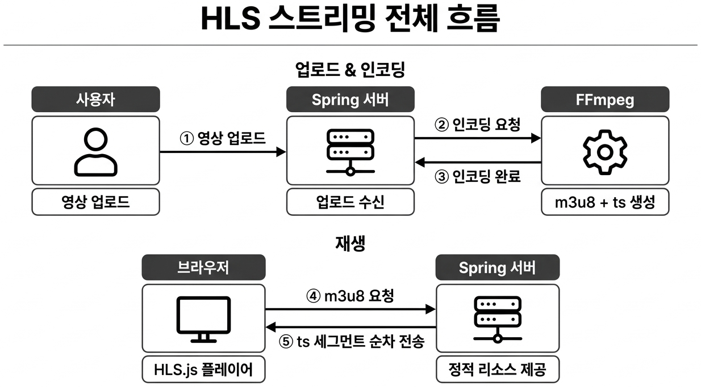
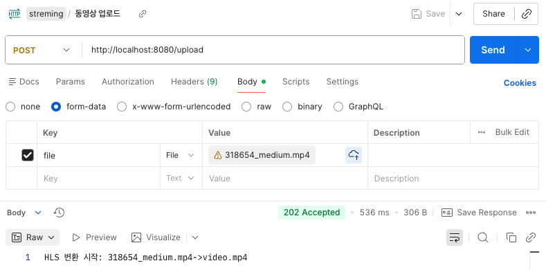
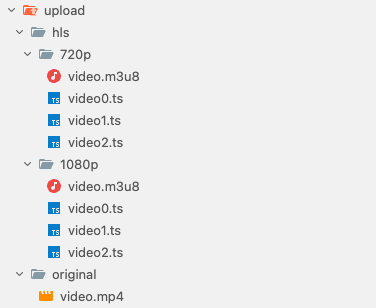
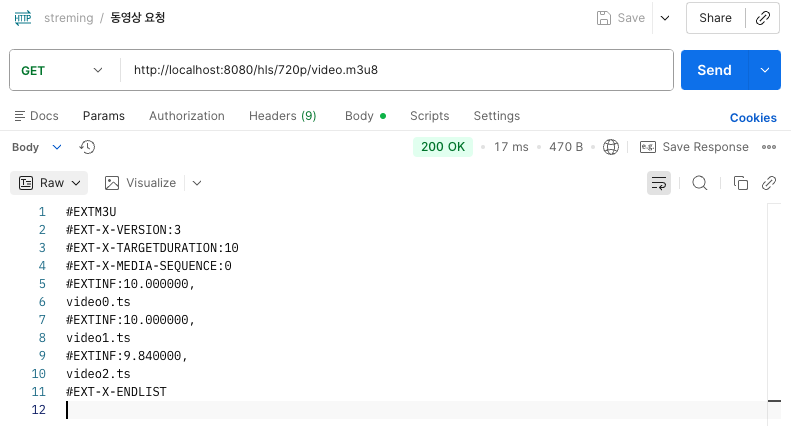
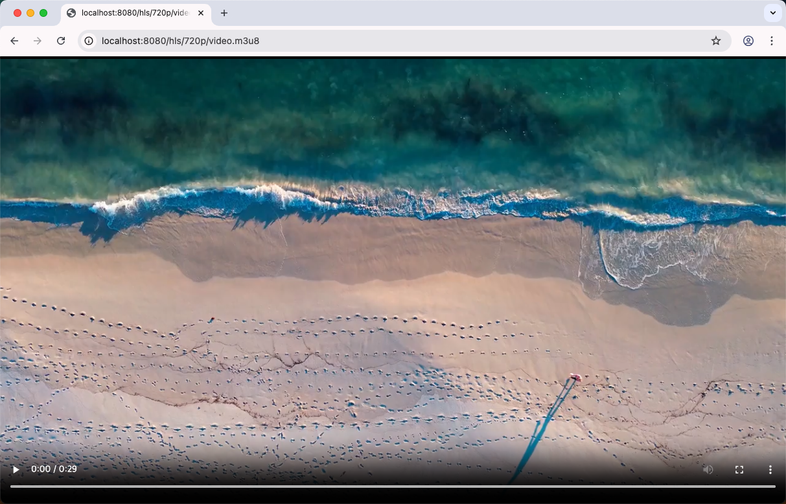
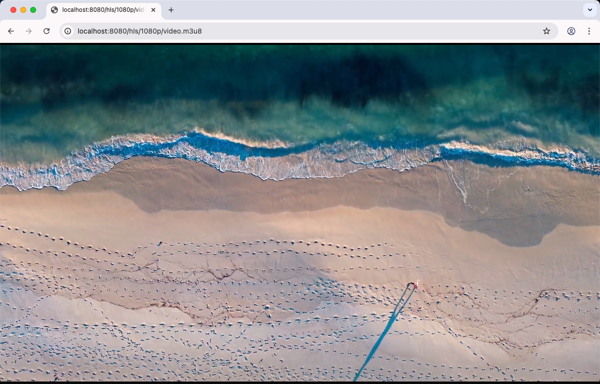
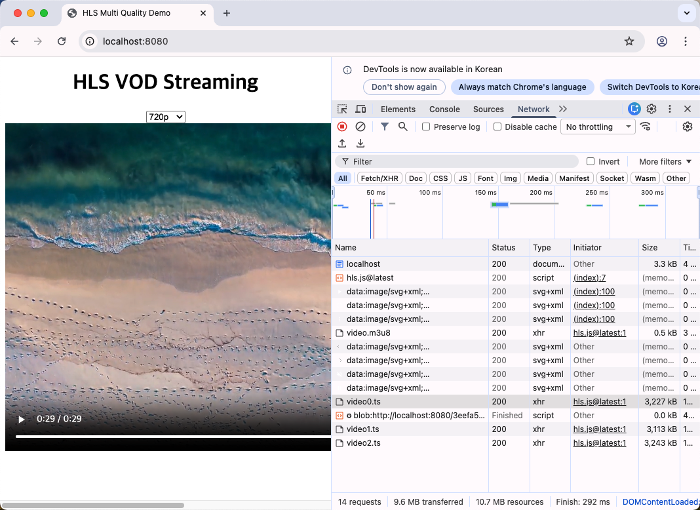

# Ch.7 HLS 스트리밍 기술 선택

## 1GB짜리 영상

사내 교육 플랫폼에 영상 강의 기능을 넣어 달라는 요청이 들어왔습니다.

**오픈이**: "영상이면 지난번에 만든 WebSocket으로 스트리밍하면 되지 않나요?"

**팀장**: "WebSocket은 채팅용이야. 영상은 차원이 다른 문제야."

(차원이 다르다고?)

직접 해봤습니다. 1GB짜리 교육 영상을 서버에 올리고 브라우저에서 재생 버튼을 눌렀습니다. 로딩 스피너가 돌기 시작했습니다. 30초가 지나도 재생이 시작되지 않았습니다. 1분이 지나자 브라우저 탭이 멈췄습니다. 파일 전체를 다운로드해야 재생이 시작되는 구조였습니다.

**선배**: "그거 통째로 보내면 안 돼. 잘게 쪼개서 보내야 해."

**오픈이**: "쪼갠다고?"

**선배**: "유튜브 생각해 봐. 영상 틀면 바로 재생되잖아. 전체를 다 받아서 트는 게 아니야."

---

택배를 보낼 때를 떠올려 봅니다.

작은 상자 하나는 일반 택배로 보내면 됩니다. 집 앞에서 받아서 바로 열어봅니다. 그런데 이삿짐처럼 짐이 트럭 한 대 분량이라면 이야기가 달라집니다. 트럭이 도착할 때까지 아무것도 못 합니다. 짐을 전부 내려야 원하는 물건을 꺼낼 수 있습니다.

이삿짐 업체는 다른 방식을 씁니다. 짐을 상자 단위로 나눠서 번호를 매깁니다. 1번 상자, 2번 상자, 3번 상자. 1번 상자가 도착하면 바로 풀기 시작합니다. 2번 상자가 오는 동안 1번 상자의 짐을 정리합니다. 전체가 도착하지 않아도 하나씩 처리할 수 있습니다.

영상 스트리밍도 같은 원리입니다. 1GB 영상을 통째로 보내면 브라우저는 전부 받을 때까지 기다립니다. 하지만 10초짜리 조각으로 잘라서 보내면 첫 번째 조각이 도착하는 순간 재생이 시작됩니다. 나머지 조각은 재생하는 동안 뒤에서 도착합니다.

상자에 번호를 매기듯 조각 파일에도 순서 목록이 필요합니다. "1번 다음은 2번, 그 다음은 3번"이라는 재생 목록이 있어야 브라우저가 순서대로 요청합니다. 이 목록이 **m3u8** 파일이고 조각 하나하나가 **ts** 파일입니다. HTTP 위에서 영상을 실시간으로 잘라 보내는 이 방식 전체를 **HLS(HTTP Live Streaming)** 라고 부릅니다.

**선배**: "이삿짐을 상자로 나눠서 번호 매기는 거랑 똑같아. 목록표 한 장이랑 상자 여러 개."

(목록표가 m3u8이고 상자가 ts 파일이구나.)

**오픈이**: "그러면 영상을 쪼개는 건 누가 해?"

**선배**: "FFmpeg이라는 도구가 해. 영상을 넣으면 알아서 잘라줘."

이제 직접 만들어 보겠습니다.

---

이 장의 실습 코드는 아래 레포에서 확인할 수 있습니다.

```bash
git clone https://github.com/metacoding-11-spring-reference/spring-hls
```

```text
spring-hls/
├── HlsController.java         [설명] 업로드 + 스트리밍 엔드포인트
├── HlsService.java            [설명] FFmpeg 인코딩 + 파일 로딩
├── HlsApplication.java        [참고] @EnableAsync 활성화
├── application.properties     [참고] 업로드 용량 설정 (2GB)
└── templates/index.mustache   [참고] HLS.js 플레이어 UI
```


*이번 챕터의 실습 흐름*

### 환경 준비

HLS 인코딩에는 **FFmpeg** 이 필요합니다. 운영체제별 설치 방법입니다.

**macOS**

```bash
brew install ffmpeg
```

**Windows**

```bash
choco install ffmpeg
```

Chocolatey가 없다면 [FFmpeg 공식 사이트](https://ffmpeg.org/download.html)에서 바이너리를 받아 시스템 PATH에 추가합니다.

**Linux (Ubuntu/Debian)**

```bash
sudo apt install ffmpeg
```

설치가 끝나면 버전을 확인합니다.

```bash
ffmpeg -version
```

`ffmpeg version` 으로 시작하는 출력이 나오면 성공입니다.

[CAPTURE NEEDED: ffmpeg -version 실행 결과 -- 버전 정보와 빌드 옵션이 출력되는 터미널 화면]

*ffmpeg -version 실행 결과*

테스트에 사용할 영상 파일도 준비합니다. 1분 이상 길이의 MP4 파일을 권장합니다. 너무 짧은 영상은 ts 조각이 하나만 생성되어 스트리밍 효과를 체감하기 어렵습니다.

### 7.1 HLS 스트리밍이란

영상을 브라우저에서 바로 재생하려면 파일을 잘게 쪼개서 순서대로 보내야 합니다. HLS는 이 과정을 HTTP 위에서 처리하는 표준 방식입니다.

구조는 두 가지 파일로 이루어집니다. **m3u8** 은 재생 목록입니다. 어떤 조각을 어떤 순서로 재생할지 적혀 있습니다. **ts** 는 실제 영상 조각입니다. 보통 10초 단위로 잘립니다. 브라우저는 m3u8 파일을 먼저 받아서 목록을 확인하고 ts 파일을 순서대로 요청합니다.

전체 흐름은 이렇습니다. 사용자가 영상을 업로드하면 서버가 FFmpeg으로 원본을 ts 조각으로 변환합니다. 변환이 끝나면 m3u8 목록 파일이 생성됩니다. 브라우저는 m3u8을 요청해서 목록을 받고 ts 조각을 하나씩 가져와 재생합니다.



*업로드부터 브라우저 재생까지의 HLS 흐름*

### 7.2 업로드 API 구현

영상 파일을 받아서 서버에 저장하고 HLS 변환을 시작하는 엔드포인트입니다.

```java
@PostMapping("/upload")
public ResponseEntity<String> uploadVideo(
        @RequestParam("file") MultipartFile file) throws IOException {
    String savedName = hlsService.saveOriginalVideo(file);
    hlsService.convertToHls(savedName);
    return ResponseEntity.ok("HLS 변환 완료: " + savedName);
}
```

`MultipartFile` 로 영상을 받아서 `saveOriginalVideo()` 로 서버에 저장합니다. 저장이 끝나면 `convertToHls()` 로 HLS 변환을 시작합니다. `convertToHls()` 는 `@Async` 가 붙어 있어서 변환이 끝나기 전에 응답이 먼저 나갑니다.

저장 로직입니다.

```java
public String saveOriginalVideo(MultipartFile file) throws IOException {
    new File(ORIGINAL_DIR).mkdirs();
    String fileName = "video.mp4";
    File saveFile = new File(ORIGINAL_DIR + fileName);
    file.transferTo(saveFile);
    return fileName;
}
```

`ORIGINAL_DIR` 디렉토리가 없으면 생성하고 업로드된 파일을 `video.mp4` 로 저장합니다. `transferTo()` 가 실제 파일 쓰기를 담당합니다.

Postman으로 영상을 업로드한 결과입니다.



*영상 업로드 -- Postman으로 파일을 보내면 HLS 변환이 시작된다*

**확인 포인트** -- 서버 콘솔에 FFmpeg 인코딩 시작 로그가 출력됩니다. `convertToHls()` 가 `@Async` 로 실행되므로 Postman 응답이 먼저 돌아오고 서버 로그에 인코딩 진행 상황이 이어서 나타나면 성공입니다.

### 7.3 FFmpeg 인코딩과 HLS 조각화

업로드된 영상을 FFmpeg으로 쪼개는 과정입니다. 720p와 1080p 두 화질로 변환합니다.

```java
FFmpegBuilder builder720 = new FFmpegBuilder()
    .setInput(inputPath)
    .addOutput(output720)
    .addExtraArgs("-b:v", "2500k")
    .addExtraArgs("-maxrate", "2500k")
    .addExtraArgs("-bufsize", "5000k")
    .addExtraArgs("-vf", "scale=-2:720")
    .addExtraArgs("-hls_time", "10")
    .addExtraArgs("-hls_list_size", "0")
    .addExtraArgs("-f", "hls")
    .done();
```

각 옵션의 역할입니다.

| 옵션 | 역할 |
|------|------|
| `-vf scale=-2:720` | 세로 720px, 가로는 비율에 맞게 자동 계산 |
| `-b:v 2500k` | 비트레이트 2500kbps |
| `-hls_time 10` | 10초 단위로 영상을 조각냄 |
| `-hls_list_size 0` | 모든 조각을 목록에 포함 |
| `-f hls` | 출력 포맷을 HLS로 지정 |

`FFmpegBuilder` 는 Java에서 FFmpeg 명령을 만들어주는 래퍼입니다. `setInput()` 으로 원본 영상 경로를 넣고 `addOutput()` 으로 출력 경로를 지정합니다. `-hls_time 10` 이 영상을 10초 단위로 자르는 핵심 옵션입니다. 같은 방식으로 1080p 빌더도 만들어서 두 화질을 동시에 생성합니다.

변환이 끝나면 서버에 파일이 생성됩니다.



*HLS 파일 생성 -- m3u8 목록 파일과 ts 조각 파일이 만들어졌다*

**확인 포인트** -- 인코딩이 끝난 뒤 출력 디렉토리에서 `ls` 를 실행합니다. `video.m3u8` 파일 1개와 `video0.ts`, `video1.ts` ... 형태의 ts 파일 여러 개가 보이면 성공입니다. 720p 폴더와 1080p 폴더에 각각 파일이 생성되어야 합니다.

```bash
ls hls-videos/720p/
ls hls-videos/1080p/
```

[CAPTURE NEEDED: 720p, 1080p 디렉토리에서 ls 실행 결과 -- m3u8 파일과 ts 조각 파일 목록이 출력되는 터미널 화면]

*인코딩 완료 후 생성된 파일 목록*

이삿짐 비유로 보면 FFmpeg이 짐을 상자에 나눠 담는 작업자입니다. 상자 크기를 10초로 정하고(`-hls_time 10`) 번호를 매겨서(`-hls_list_size 0`) 목록표(m3u8)와 함께 정리합니다.

### 7.4 HLS 스트리밍 제공

조각으로 나눈 파일을 브라우저에 전달하는 엔드포인트입니다.

```java
@GetMapping("/hls/{quality}/{fileName}.m3u8")
public ResponseEntity<Resource> getHlsPlaylist(
        @PathVariable String quality,
        @PathVariable String fileName) throws IOException {
    Resource resource = hlsService.loadHlsFile(
        quality, fileName + ".m3u8");
    HttpHeaders headers = new HttpHeaders();
    headers.setContentType(MediaType.parseMediaType(
        "application/vnd.apple.mpegurl"));
    return new ResponseEntity<>(resource, headers, HttpStatus.OK);
}
```

`{quality}` 는 `720p` 또는 `1080p` 입니다. `Content-Type` 을 `application/vnd.apple.mpegurl` 로 지정해야 브라우저가 이 응답을 HLS 재생 목록으로 인식합니다. ts 파일을 제공하는 엔드포인트도 같은 구조입니다. 경로만 `.ts` 로 바뀌고 `Content-Type` 이 `video/mp2t` 로 달라집니다.

브라우저에서 재생하려면 **HLS.js** 라이브러리가 필요합니다.

```javascript
var url = `http://localhost:8080/hls/${quality}/video.m3u8`;
if (Hls.isSupported()) {
    var hls = new Hls();
    hls.loadSource(url);
    hls.attachMedia(video);
}
```

`Hls.isSupported()` 로 브라우저가 HLS를 지원하는지 확인합니다. `loadSource()` 에 m3u8 주소를 넣으면 HLS.js가 목록을 파싱하고 ts 파일을 순서대로 요청합니다. `attachMedia()` 로 비디오 태그에 연결하면 재생이 시작됩니다.

Postman으로 m3u8 엔드포인트를 확인합니다.



*m3u8 엔드포인트 확인 -- 재생 목록이 정상적으로 반환된다*

720p와 1080p의 m3u8 응답입니다.



*720p m3u8 응답 -- ts 조각 파일 목록과 재생 시간이 기록되어 있다*



*1080p m3u8 응답 -- 같은 구조지만 해상도가 다르다*

브라우저에서 실제로 재생하면서 DevTools Network 탭을 열어 봅니다.



*브라우저 재생 -- ts 조각이 순차적으로 요청되며 영상이 끊기지 않고 재생된다*

DevTools를 보면 m3u8을 한 번 받은 뒤 ts 파일이 순서대로 요청되는 것을 확인할 수 있습니다. 목록표를 받아서 상자를 하나씩 가져오는 것과 같습니다.

**확인 포인트** -- 브라우저에서 영상이 끊기지 않고 재생되면 성공입니다. DevTools Network 탭에서 m3u8 요청 1개, 그 뒤를 따르는 ts 요청 여러 개가 보이면 HLS 스트리밍이 정상 동작하는 것입니다. 720p/1080p 화질 전환 버튼을 눌러 화질이 바뀌는지도 확인합니다.

### 7.5 스트리밍 기술 선택 가이드

HLS를 만들어 봤으니 다른 스트리밍 기술과 비교해 봅니다. 각 기술은 역할이 다릅니다.

| 기술 | 역할 | 지연 시간 | 대표 사용처 |
|------|------|-----------|------------|
| **RTMP** | 방송 송출 | 수 초 | OBS에서 서버로 송출 |
| **HLS** | HTTP 기반 배포 | 수 초 ~ 수십 초 | VOD, 라이브 시청 |
| **DASH** | 적응형 배포 | 수 초 ~ 수십 초 | 글로벌 스트리밍 서비스 |
| **WebRTC** | P2P 실시간 통신 | 수백 ms | 화상회의, 1:1 통화 |
| **RTSP** | 장비 스트림 | 수 초 | CCTV, IP 카메라 |

선택 기준은 "지연을 얼마나 허용하느냐"입니다.

수 초의 지연이 괜찮다면 **HLS** 가 가장 현실적입니다. HTTP 기반이라 CDN 캐싱이 가능하고 브라우저 호환성이 좋습니다. 유튜브, 넷플릭스 같은 VOD 서비스가 HLS를 씁니다.

1초 이하의 초저지연이 필요하면 **WebRTC** 입니다. 화상회의나 실시간 상담에서 씁니다. 6장에서 다뤘던 WebSocket이 텍스트 메시지의 양방향 통신이라면 WebRTC는 영상/음성의 P2P 통신입니다.

방송 송출 쪽에서는 **RTMP** 가 여전히 표준입니다. OBS 같은 송출 프로그램이 RTMP로 서버에 보내면 서버가 이걸 HLS로 변환해서 시청자에게 배포하는 구조가 일반적입니다.

CCTV나 IP 카메라 같은 장비 스트림은 **RTSP** 를 씁니다. 브라우저가 아니라 전용 플레이어에서 재생합니다.

이삿짐 비유로 정리하면 HLS는 상자를 번호 매겨서 택배로 보내는 방식이고 WebRTC는 이사 당일 직접 트럭으로 실어 나르는 방식입니다. 택배는 시간이 조금 걸리지만 안정적이고 직접 운반은 빠르지만 준비가 많이 필요합니다.

---

| 비유 | 기술 용어 | 정식 정의 |
|------|----------|----------|
| 이삿짐을 상자로 나누기 | **HLS (HTTP Live Streaming)** | HTTP 위에서 영상을 작은 조각(ts)으로 나누고 재생 목록(m3u8)을 통해 순차 전송하는 스트리밍 프로토콜 |
| 목록표 | **m3u8** | HLS에서 ts 조각 파일의 순서와 재생 시간을 기록한 텍스트 기반 재생 목록 파일 |
| 번호 매긴 상자 | **ts (Transport Stream)** | 영상을 일정 시간 단위로 잘라낸 조각 파일. 보통 10초 단위 |
| 짐을 상자에 나눠 담는 작업자 | **FFmpeg** | 영상/음성 변환, 인코딩, 포맷 전환을 처리하는 오픈소스 멀티미디어 프레임워크 |
| 브라우저의 목록표 해석기 | **HLS.js** | 브라우저에서 m3u8 파일을 파싱하고 ts 조각을 순차 요청해 재생하는 JavaScript 라이브러리 |
| 택배로 보내기 vs 직접 트럭 | **HLS vs WebRTC** | HLS는 HTTP 기반 순차 전송(지연 허용), WebRTC는 P2P 실시간 전송(초저지연) |

---

## 이것만은 기억하자

큰 영상 파일을 통째로 보내면 브라우저는 전부 받을 때까지 멈춥니다. HLS는 영상을 10초 조각으로 잘라서 목록과 함께 보냅니다. 브라우저는 목록을 보고 조각을 하나씩 가져오면서 재생합니다. 전체가 도착하지 않아도 첫 번째 조각이 오는 순간 재생이 시작됩니다. 이삿짐을 상자로 나눠 번호를 매기는 것과 같습니다. 스트리밍 기술을 고를 때는 "지연을 얼마나 허용하느냐"가 기준입니다. 수 초가 괜찮으면 HLS, 1초 이하가 필요하면 WebRTC입니다.

다음 장에서는 "검색이 5초 넘게 걸린다"는 버그 리포트가 올라옵니다.
