# Ch.8 Elasticsearch 키워드 검색

## 5초짜리 검색

게시판에 검색 기능이 있었습니다. 제목이나 내용에 키워드를 넣으면 결과가 나오는 단순한 구조였습니다. 데이터가 천 건일 때는 아무 문제가 없었습니다.

데이터가 십만 건을 넘기자 상황이 달라졌습니다. 버그 리포트가 올라왔습니다.

**팀장**: "검색이 5초 넘게 걸린다는 리포트 들어왔어. 확인해 봐."

SQL을 열어 봤습니다. `WHERE title LIKE '%갤럭시%'` 가 전부였습니다.

(이게 왜 느린 거지?)

**선배**: "LIKE에 앞뒤로 % 붙이면 인덱스를 못 타. 테이블 전체를 처음부터 끝까지 훑어야 해."

**오픈이**: "그러면 인덱스를 걸면 되지 않아?"

**선배**: "앞에 %가 붙으면 인덱스가 소용없어. 데이터베이스 인덱스는 앞글자 기준으로 정렬해 놓은 거거든. '갤럭시'로 시작하는 건 찾을 수 있어도 중간에 '갤럭시'가 들어간 건 못 찾아."

(그러면 어떻게 해야 하지?)

**선배**: "검색 전용 엔진을 따로 두는 거야."

---

도서관에 갔다고 생각해 봅니다.

책이 만 권 있는 도서관에서 "스프링"이라는 단어가 들어간 책을 찾아야 합니다. 도서관에 색인 카드가 없다면 책장 첫 번째 칸부터 마지막 칸까지 책을 한 권씩 꺼내서 제목을 확인해야 합니다. 만 권을 전부 훑어야 합니다. LIKE 검색이 이 방식입니다.

색인 카드함이 있는 도서관은 다릅니다. 카드함에는 키워드별로 카드가 정리되어 있습니다. "스프링" 카드를 꺼내면 "3번 책장 위에서 두 번째, 7번 책장 아래에서 세 번째"라고 적혀 있습니다. 만 권을 훑을 필요 없이 카드 한 장만 보면 됩니다.

**Elasticsearch** 가 이 색인 카드함입니다. 데이터가 저장될 때마다 단어를 쪼개서 "이 단어는 몇 번 문서에 있다"는 목록을 만들어 놓습니다. 검색할 때는 이 목록만 뒤집니다. 문서 전체를 훑지 않습니다.

데이터베이스가 책장이라면 Elasticsearch는 색인 카드함입니다. 책장에서 직접 찾는 대신 카드함에서 위치를 확인하고 책장으로 가는 겁니다.

**팀장**: "그러면 데이터를 두 군데에 저장해야 하는 거야?"

**선배**: "맞아. 데이터베이스에도 넣고 검색 엔진에도 넣어. 저장은 데이터베이스가 하고 검색은 검색 엔진이 하는 거야."

(책장에 책을 꽂으면서 동시에 색인 카드도 써넣는 거구나.)

**오픈이**: "한번 만들어 볼게요."

---

이 장의 실습 코드는 아래 레포에서 확인할 수 있습니다.

```bash
git clone https://github.com/metacoding-11-spring-reference/docker-elasticsearch
```

```text
docker-elasticsearch/
├── docker-compose.yml            [실습] ES + Kibana 구성
├── DeviceEntity.java             [설명] JPA 엔티티
├── DeviceDocument.java           [설명] ES Document 매핑
├── DeviceRepository.java         [참고] JPA Repository
├── DeviceSearchRepository.java   [참고] ES Repository
├── DeviceService.java            [실습] 이중 저장 + 검색 로직
├── DeviceController.java         [참고] 엔드포인트
├── SearchService.java            [실습] multi_match + Fuzzy 검색
└── application.properties        [실습] ES 접속 설정
```

---

이제 직접 만들어 보겠습니다.


*이번 챕터의 실습 흐름*

### 8.1 왜 Elasticsearch가 필요한가

LIKE 검색의 문제를 정리합니다.

`WHERE title LIKE '%갤럭시%'` 는 테이블의 모든 행을 처음부터 끝까지 읽습니다. 데이터가 천 건이면 천 번, 십만 건이면 십만 번 비교합니다. 앞에 `%` 가 붙으면 데이터베이스 인덱스(B-Tree)를 사용할 수 없습니다. B-Tree 인덱스는 값의 앞부분을 기준으로 정렬하기 때문입니다.

Elasticsearch는 **역인덱스(Inverted Index)** 구조를 씁니다. 문서가 저장될 때 내용을 단어 단위로 쪼개고 "이 단어가 어떤 문서에 있는지"를 기록합니다.

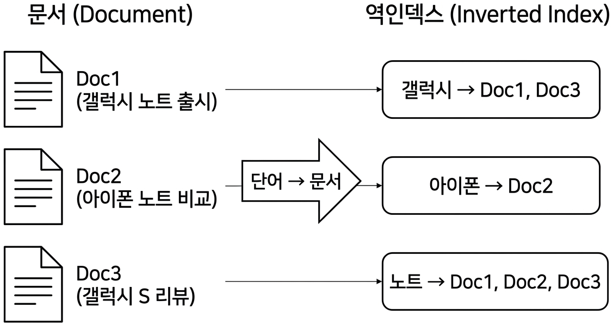

*역인덱스 구조 -- 단어 목록에서 해당 문서를 바로 찾는다*

일반 인덱스가 "문서 → 단어" 방향이라면 역인덱스는 "단어 → 문서" 방향입니다. 검색할 때 단어 목록에서 해당 키워드를 찾으면 문서 번호가 바로 나옵니다. 데이터가 백만 건이어도 키워드 목록에서 한 번 찾는 것으로 끝납니다.

### 8.2 실습 환경 준비

Elasticsearch와 Kibana를 Docker로 띄웁니다. 아래 코드를 `docker-compose.yml` 에 작성합니다.

```yaml
services:
  elasticsearch:
    image: docker.elastic.co/elasticsearch/elasticsearch:8.19.8
    container_name: elasticsearch
    ports:
      - "9200:9200"
    environment:
      - discovery.type=single-node
      - xpack.security.enabled=false
      - ES_JAVA_OPTS=-Xms1g -Xmx1g
    networks:
      - es-network
  kibana:
    image: docker.elastic.co/kibana/kibana:8.19.8
    ports:
      - "5601:5601"
    environment:
      - ELASTICSEARCH_HOSTS=http://elasticsearch:9200
    networks:
      - es-network
```

네트워크 설정과 Spring Boot 앱 컨테이너는 전체 docker-compose.yml을 참고합니다.

```bash
docker-compose up -d
```

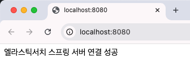

*docker-compose up -- Elasticsearch, Kibana, Spring Boot 앱이 함께 올라간다*

컨테이너가 올라오면 Elasticsearch 상태를 확인합니다.

```bash
curl localhost:9200
```

클러스터 이름과 버전 정보가 담긴 JSON 응답이 돌아오면 성공입니다.

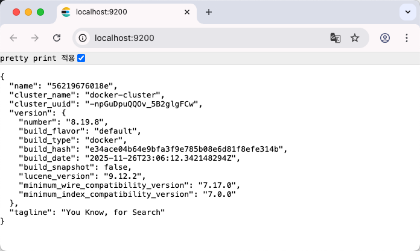

*localhost:9200 응답 -- cluster_name, version 정보가 보이면 Elasticsearch가 정상 동작하고 있다*

브라우저에서 `http://localhost:5601` 에 접속하면 Kibana 메인 화면이 나옵니다. 왼쪽 사이드바 하단의 **Management** 메뉴를 열고 **Dev Tools** 를 클릭하면 Elasticsearch에 쿼리를 직접 실행할 수 있는 콘솔이 열립니다. 8.6절에서 이 콘솔을 사용합니다.

#### nori 한국어 분석기 설치

Elasticsearch의 기본 분석기는 영어 기준으로 동작합니다. 한국어 형태소 분석이 필요하다면 nori 플러그인을 설치합니다. 실행 중인 ES 컨테이너 안에서 설치하는 방법입니다.

```bash
docker exec -it elasticsearch elasticsearch-plugin install analysis-nori
docker restart elasticsearch
```

설치 후 컨테이너를 재시작해야 적용됩니다. Dockerfile로 이미지를 만들어 두면 매번 설치할 필요가 없습니다.

```dockerfile
FROM docker.elastic.co/elasticsearch/elasticsearch:8.19.8
RUN elasticsearch-plugin install analysis-nori
```

이 실습에서는 nori 없이도 동작하므로 필수는 아닙니다. 한국어 검색 품질을 높이고 싶다면 적용합니다.

Spring Boot에서 Elasticsearch에 접속하려면 `application.properties` 에 주소를 설정합니다.

```properties
spring.datasource.url=jdbc:h2:mem:testdb;MODE=MySQL
spring.datasource.username=sa
spring.datasource.password=
spring.elasticsearch.uris=http://elasticsearch:9200
```

H2 데이터베이스와 Elasticsearch를 동시에 사용하는 구성입니다. H2는 RDB 역할을, Elasticsearch는 검색 엔진 역할을 담당합니다.

### 8.3 데이터 모델 설계: RDB + ES

하나의 데이터를 두 곳에 저장하려면 모델도 두 개가 필요합니다. RDB용 엔티티와 ES용 도큐먼트입니다.

RDB용 **JPA 엔티티** 입니다.

```java
@Entity
@Getter
@NoArgsConstructor
@AllArgsConstructor
@Builder
public class DeviceEntity {
    @Id
    @GeneratedValue(strategy = GenerationType.IDENTITY)
    private Long id;
    private String title;
    private String content;
}
```

JPA가 관리하는 테이블에 매핑됩니다. `id` , `title` , `content` 세 개의 컬럼을 가집니다.

ES용 **도큐먼트** 입니다.

```java
@Document(indexName = "devices")
public class DeviceDocument {
    private Long id;
    @Field(type = FieldType.Text)
    private String title;
    @Field(type = FieldType.Text)
    private String content;
}
```

`@Document(indexName = "devices")` 가 Elasticsearch의 인덱스 이름을 지정합니다. `@Field(type = FieldType.Text)` 는 이 필드를 역인덱스 대상으로 설정합니다. Text 타입으로 지정하면 Elasticsearch가 저장 시점에 단어를 쪼개서 역인덱스를 만듭니다.

두 모델의 필드는 같지만 역할이 다릅니다. DeviceEntity는 데이터의 원본을 보관하고 DeviceDocument는 검색용 사본을 보관합니다. 도서관 비유에서 책장에 꽂힌 책이 DeviceEntity이고 색인 카드가 DeviceDocument입니다.

### 8.4 저장 흐름: RDB + ES 이중 저장

데이터를 저장할 때 RDB와 ES에 동시에 넣습니다. 이 방식을 **이중 저장(Dual Write)** 이라고 합니다.

```java
@Transactional
public DeviceDocument saveDevices(DeviceDocument doc) {
    DeviceEntity entity = DeviceEntity.builder()
            .title(doc.getTitle())
            .content(doc.getContent())
            .build();
    DeviceEntity saved = deviceJpaRepository.save(entity);
    DeviceDocument savedDoc = new DeviceDocument(
            saved.getId(), saved.getTitle(), saved.getContent());
    deviceSearchRepository.save(savedDoc);
    return savedDoc;
}
```

흐름을 따라가 봅니다. 먼저 JPA Repository로 RDB에 저장합니다. RDB가 생성한 `id` 를 받아서 같은 데이터를 DeviceDocument에 담습니다. 그리고 ES Repository로 Elasticsearch에 저장합니다. `@Transactional` 이 걸려 있으므로 RDB 저장이 실패하면 롤백됩니다. 다만 Elasticsearch는 트랜잭션 범위 밖이므로 RDB 저장 성공 후 ES 저장이 실패하면 데이터 불일치가 생길 수 있습니다. 이 한계는 이벤트 기반 동기화 등으로 해결하지만 이 책의 범위를 넘어가므로 이중 저장의 특성으로 기억해 둡니다.

책장에 책을 꽂으면서 동시에 색인 카드를 써넣는 과정입니다. 카드에는 책 번호(id)를 적어 놓습니다.

Postman으로 데이터를 저장하고 결과를 확인합니다.

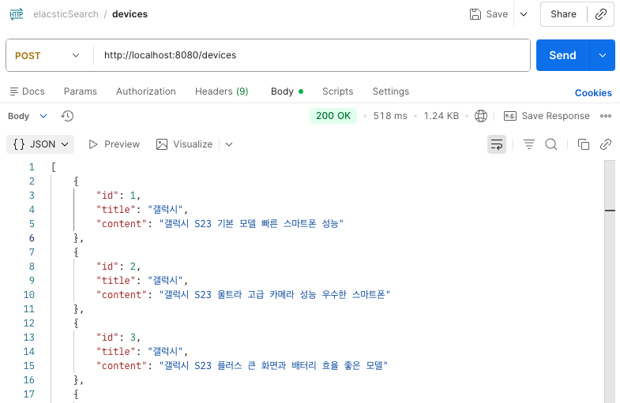

*Postman으로 데이터 저장 -- 요청이 성공하면 저장된 Document가 응답으로 온다*

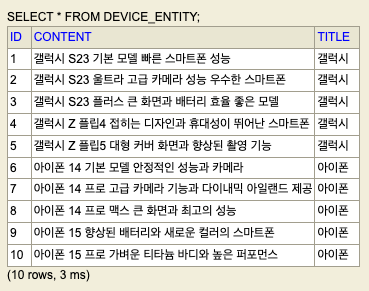

*H2 콘솔 확인 -- RDB에도 같은 데이터가 들어가 있다*

#### 중간 확인: 데이터가 제대로 들어갔는가

Kibana Dev Tools에서 인덱스를 조회합니다.

```json
GET /devices/_search
{
  "query": { "match_all": {} }
}
```

`hits.total.value` 에 저장한 건수가 표시되고 `_source` 에 title, content가 보이면 성공입니다. H2 콘솔(`localhost:8080/h2-console`)에서 `SELECT * FROM DEVICE_ENTITY` 를 실행하면 RDB 쪽 데이터도 확인할 수 있습니다. 양쪽 건수가 같으면 이중 저장이 정상 동작한 것입니다.

[CAPTURE NEEDED: Kibana Dev Tools에서 devices 인덱스 match_all 검색 결과 -- hits.total.value와 _source 확인]

### 8.5 검색 흐름: ES 검색 -> RDB 재조회

검색은 반대 방향입니다. Elasticsearch에서 키워드로 문서를 찾고 그 결과의 id로 RDB에서 원본 데이터를 가져옵니다.

```java
public List<DeviceEntity> searchAll(String keyword) {
    NativeQuery query = NativeQuery.builder()
            .withQuery(q -> q.bool(b -> b
                    .should(s -> s.multiMatch(m -> m
                            .fields("title^3", "content")
                            .query(keyword)
                            .fuzziness("AUTO")))
                    .minimumShouldMatch("1")))
            .build();
    var deviceHits = operations.search(query, DeviceDocument.class);
    List<Long> ids = deviceHits.stream()
            .map(hit -> hit.getContent().getId())
            .toList();
    return deviceJpaRepository.findAllById(ids);
}
```

`multiMatch` 는 여러 필드를 동시에 검색합니다. `"title^3"` 은 제목 필드에 3배 가중치를 준다는 뜻입니다. 제목에서 일치하면 본문에서 일치하는 것보다 점수가 높습니다. 검색 결과에서 id 목록을 뽑아낸 뒤 `findAllById` 로 RDB에서 원본 엔티티를 가져옵니다.

색인 카드함에서 "갤럭시" 카드를 찾아 "3번, 7번 책장"이라는 위치를 확인한 뒤 해당 책장에서 책을 꺼내오는 것과 같습니다.

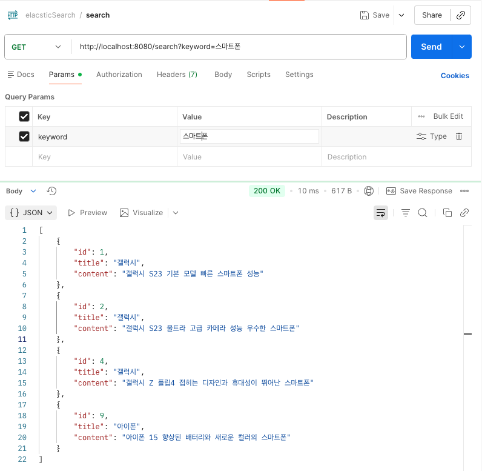

*Postman 검색 -- "갤럭시"로 검색하면 관련 데이터가 반환된다*

#### 중간 확인: 검색 API가 정상 동작하는가

Postman 응답에서 title 또는 content에 "갤럭시"가 포함된 항목이 돌아오면 성공입니다. 응답 JSON의 id 값이 H2 콘솔의 `DEVICE_ENTITY` 테이블 id와 일치하는지도 확인합니다. Kibana Dev Tools에서 같은 쿼리를 직접 실행해 봅니다.

```json
GET /devices/_search
{
  "query": {
    "multi_match": {
      "query": "갤럭시",
      "fields": ["title^3", "content"]
    }
  }
}
```

`_score` 값이 높은 순서대로 결과가 나옵니다. title에서 일치한 문서의 점수가 content에서만 일치한 문서보다 높으면 `title^3` 가중치가 동작하고 있는 것입니다.

[CAPTURE NEEDED: Kibana Dev Tools에서 multi_match 검색 실행 -- _score 기준 정렬 결과 확인]

### 8.6 Fuzzy 검색 + Kibana 실습

사용자가 "갈럭시"라고 오타를 입력해도 "갤럭시"를 찾아주는 기능이 **Fuzzy 검색** 입니다. Elasticsearch는 **편집 거리(Edit Distance)** 를 기준으로 판단합니다. 한 글자를 바꾸거나, 넣거나, 빼서 원래 단어가 되는지 계산합니다. "갈럭시"에서 "갈"을 "갤"로 바꾸면 "갤럭시"가 되므로 편집 거리는 1입니다. 한글은 완성형 문자이므로 자모 단위와 다를 수 있지만 완성형 글자 단위에서 한 글자 차이는 편집 거리 1로 처리됩니다.

위 검색 코드에서 이미 `.fuzziness("AUTO")` 를 설정해 놓았습니다. AUTO는 단어 길이에 따라 허용하는 편집 거리를 자동으로 조절합니다.

| 단어 길이 | 허용 편집 거리 | 예시 |
|-----------|--------------|------|
| 0~2자 | 0 (오타 불허) | "ab" -> 정확히 일치해야 함 |
| 3~5자 | 1 | "갈럭시" -> "갤럭시" 허용 |
| 6자 이상 | 2 | "갈럭시노트" -> "갤럭시노트" 허용 |

Kibana Dev Tools에서 직접 테스트해 봅니다. `localhost:5601` 에 접속합니다.

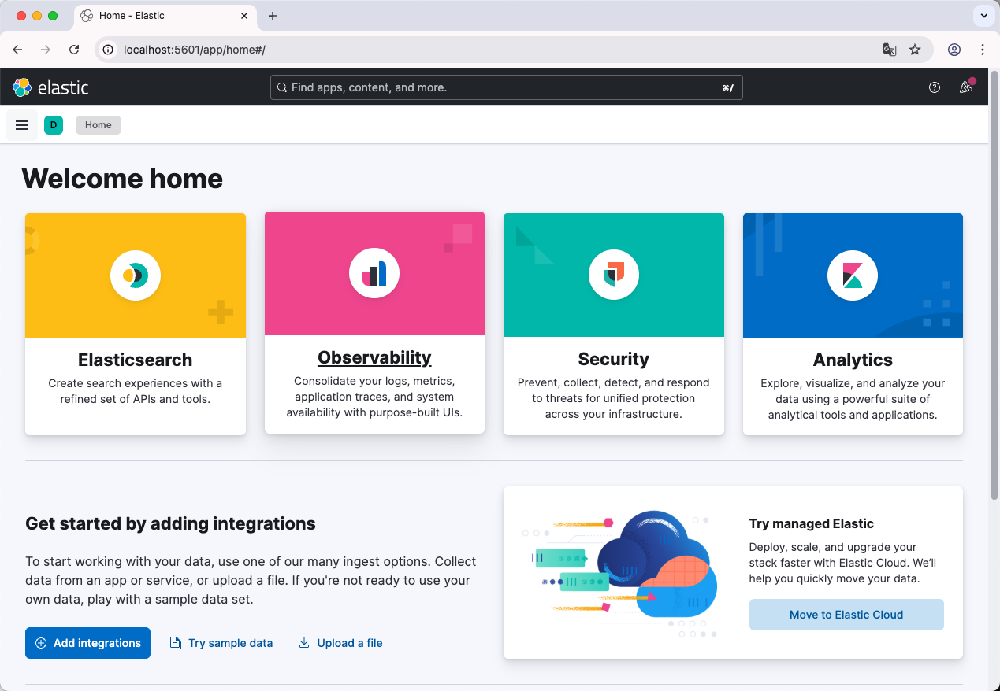

*Kibana 메인 화면 -- 왼쪽 메뉴에서 Dev Tools를 찾는다*

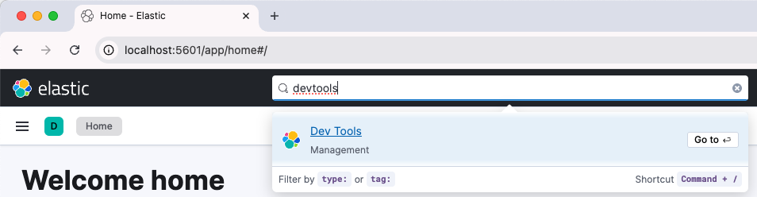

*Dev Tools 진입 -- 검색 쿼리를 직접 실행할 수 있는 콘솔이 열린다*

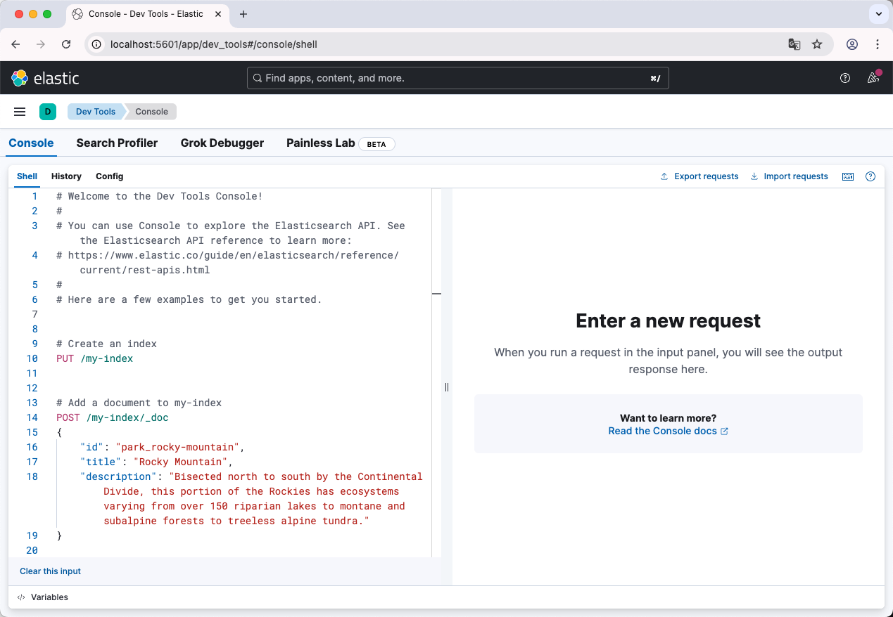

*Dev Tools 콘솔 -- 왼쪽에 쿼리를 작성하고 오른쪽에서 결과를 확인한다*

먼저 정상 검색을 실행합니다.

```json
GET /devices/_search
{
  "query": {
    "multi_match": {
      "query": "갤럭시",
      "fields": ["title^3", "content"]
    }
  }
}
```

제목이나 내용에 "갤럭시"가 포함된 문서가 검색됩니다.

이번에는 오타를 넣어서 Fuzzy 검색을 테스트합니다.

```json
GET /devices/_search
{
  "query": {
    "multi_match": {
      "query": "갈럭시",
      "fields": ["title^3", "content"],
      "fuzziness": "AUTO"
    }
  }
}
```

"갈럭시"로 검색했지만 "갤럭시"가 포함된 문서가 나옵니다. 편집 거리 1 이내이므로 AUTO가 허용한 것입니다.

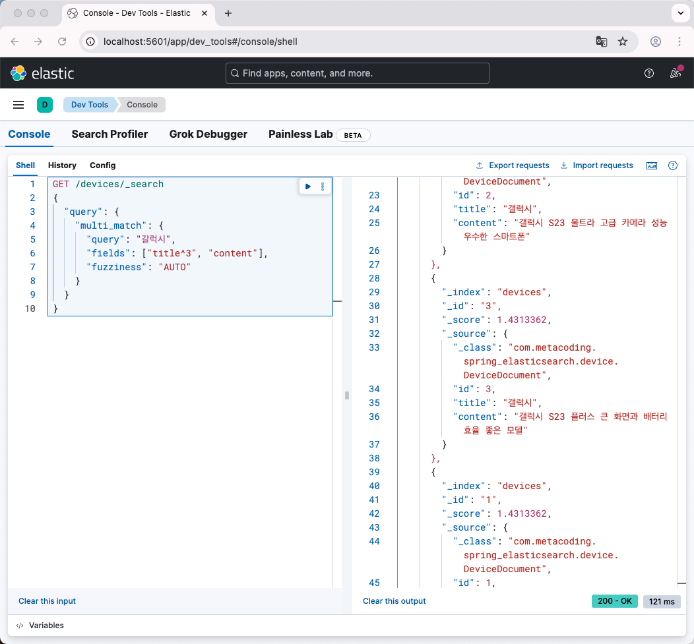

*Kibana Fuzzy 검색 -- "갈럭시"로 검색해도 "갤럭시" 문서가 나온다*

Kibana에서 직접 문서를 삽입할 수도 있습니다.

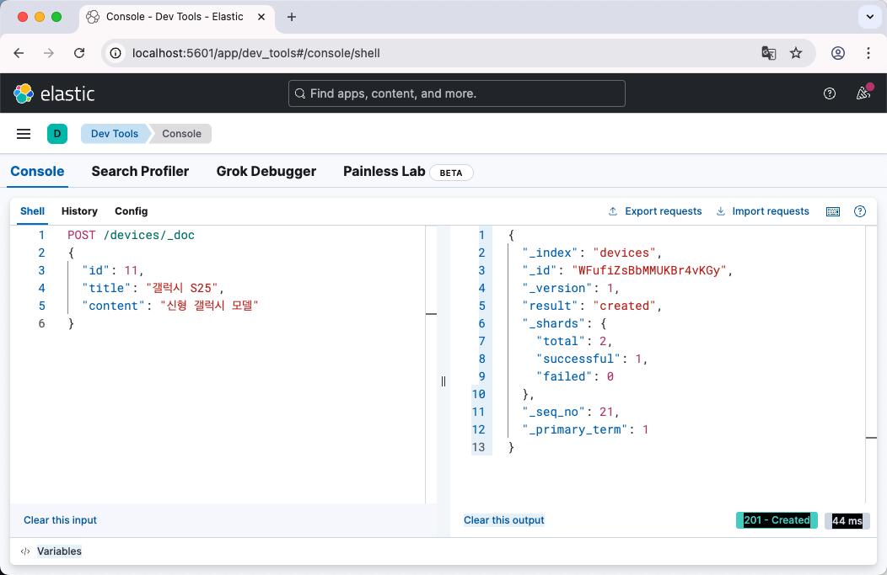

*Kibana에서 문서 직접 삽입 -- PUT 요청으로 ES에 문서를 넣을 수 있다*

한 가지 주의할 점이 있습니다. Kibana에서 ES에 직접 넣은 데이터는 RDB에 들어가지 않습니다. 이중 저장은 Spring Boot 앱을 통해서만 동작합니다. 색인 카드함에 카드만 넣고 책장에는 책을 꽂지 않은 상태입니다.

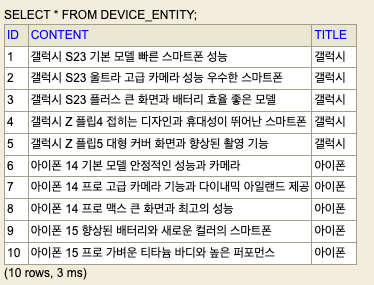

*H2 확인 -- Kibana에서 넣은 데이터는 RDB에 없다*

Postman에서 오타 검색도 확인합니다.

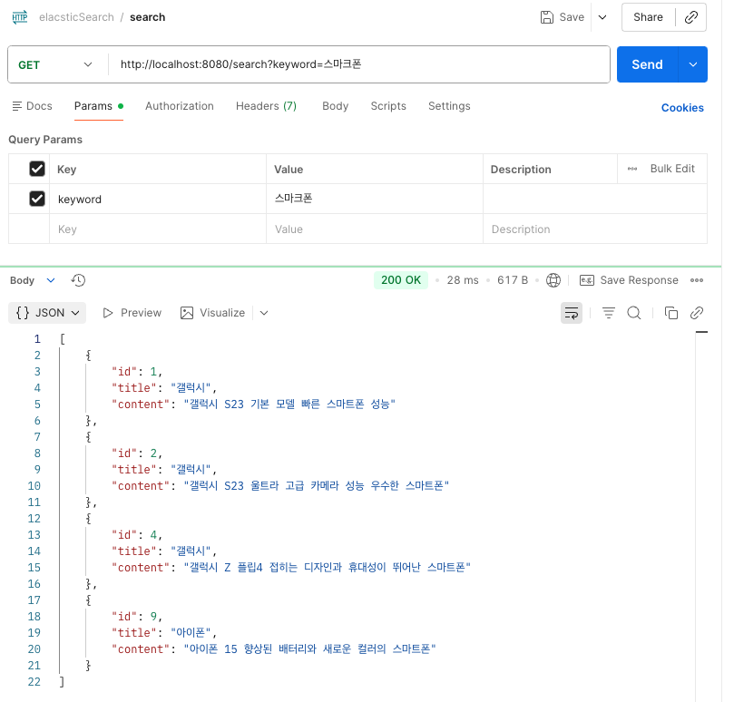

*Postman Fuzzy 검색 -- 앱을 통한 오타 검색도 정상 동작한다*

#### 중간 확인: Fuzzy 검색이 오타를 허용하는가

"갈럭시"로 검색했을 때 "갤럭시"가 포함된 문서가 반환되면 성공입니다. 정상 검색("갤럭시")과 오타 검색("갈럭시")의 결과를 비교합니다. 같은 문서가 나오되 `_score` 가 정상 검색보다 낮으면 Fuzzy 매칭이 동작한 것입니다. "갤럭시" 대신 "갤럭" 처럼 두 글자 이상 차이가 나는 단어로 검색하면 결과가 나오지 않습니다. 편집 거리 제한이 동작하고 있기 때문입니다.

---

| 비유 | 기술 용어 | 정식 정의 |
|------|----------|----------|
| 책장 첫 칸부터 끝까지 훑기 | **LIKE '%키워드%'** | 와일드카드 패턴 매칭. 앞에 %가 붙으면 인덱스를 사용할 수 없어 Full Table Scan이 발생한다 |
| 색인 카드함 | **Elasticsearch** | Apache Lucene 기반의 분산 검색 엔진. 역인덱스 구조로 대량 데이터에서 밀리초 단위 전문 검색을 제공한다 |
| 단어별 위치 목록 카드 | **역인덱스 (Inverted Index)** | 단어를 키로, 해당 단어가 포함된 문서 목록을 값으로 저장하는 자료 구조. 일반 인덱스의 반대 방향 |
| 책장에 책 꽂기 + 카드 쓰기 | **이중 저장 (Dual Write)** | 하나의 데이터를 RDB와 검색 엔진에 동시에 저장하는 패턴. 저장 일관성 관리가 필요하다 |
| 카드에서 위치 확인 후 책장에서 꺼내기 | **ES 검색 -> RDB 재조회** | 검색 엔진에서 id를 찾고 RDB에서 원본 엔티티를 조회하는 패턴. 검색 성능과 데이터 정합성을 모두 확보한다 |
| 오타를 허용하는 카드함 | **Fuzzy 검색** | 편집 거리(삽입, 삭제, 치환) 이내의 유사 단어를 매칭하는 검색 방식. fuzziness AUTO는 단어 길이에 따라 허용 거리를 자동 조절한다 |

---

## 이것만은 기억하자

LIKE 검색은 데이터가 많아지면 테이블 전체를 훑어야 하므로 느려집니다. Elasticsearch는 역인덱스라는 색인 구조를 미리 만들어 놓고 키워드로 문서 위치를 바로 찾습니다. 저장할 때 RDB와 ES에 동시에 넣고 검색할 때 ES에서 찾은 id로 RDB의 원본을 가져오는 것이 기본 패턴입니다. Fuzzy 검색을 쓰면 사용자가 오타를 내도 원래 의도한 결과를 돌려줄 수 있습니다.

다음 장에서는 시스템 간 연동을 자동화해야 하는 상황이 옵니다.
