# Ch.9 RabbitMQ 메시지 큐

## 수동 동기화의 한계

설정 파일을 GitHub에서 관리하고 있었습니다. 누군가 README를 수정하면 서버 쪽 파일도 바꿔야 했습니다. 처음에는 수동으로 했습니다. GitHub에서 파일을 열고, 복사하고, 서버에 붙여넣고. 하루에 한두 번이면 참을 만했습니다.

수정 빈도가 늘었습니다. 하루에 열 번 넘게 바뀌는 날이 생겼습니다.

**팀장**: "README 바뀔 때마다 서버 파일 수동으로 고치고 있어?"

**오픈이**: "네, 지금은 그렇게 하고 있어요."

**팀장**: "자동화해. API로 변경 감지하고 바로 반영되게."

(API로 감지까지는 되겠는데, 반영은 어떻게 하지?)

처음 떠오른 방법은 단순했습니다. 변경을 감지한 서버가 반영할 서버의 API를 직접 호출하는 것입니다.

**선배**: "그러면 반영하는 서버가 내려가 있으면 어떻게 돼?"

**오픈이**: "요청이 실패하겠지."

**선배**: "실패한 건 누가 다시 보내? 감지 서버가 재시도 로직까지 갖고 있어야 해. 반영 서버가 두 대로 늘어나면? 셋으로 늘어나면?"

(직접 호출하면 보내는 쪽이 받는 쪽 상태까지 신경 써야 하는구나.)

---

우체국을 떠올려 봅니다.

편지를 보내는 사람이 받는 사람 집까지 직접 찾아간다고 생각합니다. 받는 사람이 집에 없으면 헛걸음입니다. 받는 사람이 이사하면 새 주소를 알아내야 합니다. 받는 사람이 세 명이면 세 군데를 돌아다녀야 합니다. 보내는 사람이 할 일이 너무 많습니다.

우체국이 있으면 달라집니다. 보내는 사람은 우체국 접수대에 편지를 맡기면 끝입니다. 접수대는 우편번호를 보고 편지를 해당 사서함에 넣어 줍니다. 받는 사람은 자기 사서함을 열어 보면 됩니다. 보내는 사람은 받는 사람이 집에 있는지, 몇 명인지 알 필요가 없습니다. 받는 사람도 보내는 사람이 누구인지 신경 쓸 필요가 없습니다.

**RabbitMQ** 가 이 우체국입니다.

보내는 사람이 **Producer** 입니다. 접수대가 **Exchange** 입니다. 우편번호가 **Routing Key** 입니다. 사서함이 **Queue** 입니다. 받는 사람이 **Consumer** 입니다.

**선배**: "메시지 큐를 쓰면 보내는 쪽은 큐에 넣기만 하면 돼. 받는 쪽이 죽어 있어도 메시지는 큐에 남아 있고, 살아나면 그때 가져가."

(우체국이 중간에 편지를 보관해 주는 거구나. 받는 사람이 부재중이어도 편지가 사라지지 않는 거지.)

**오픈이**: "만들어 볼게요."

---

이 장의 실습 코드는 아래 레포에서 확인할 수 있습니다.

```bash
git clone https://github.com/metacoding-11-spring-reference/rabbitmq-docker
git clone https://github.com/metacoding-11-spring-reference/rabbitmq-producer
git clone https://github.com/metacoding-11-spring-reference/rabbitmq-consumer
```

```text
rabbitmq-docker/
└── docker-compose.yml            [실습] RabbitMQ 구성

rabbitmq-producer/
├── GitHubClient.java             [설명] GitHub API 호출 (sha 조회 + README 내용)
├── PollingScheduler.java         [설명] @Scheduled 폴링 + 변경 감지
├── RabbitProducer.java           [실습] RabbitTemplate 메시지 발행
├── RabbitDTO.java                [설명] 메시지 DTO (repo, sha, content, timestamp)
├── RabbitConfig.java             [실습] Exchange/Queue/Binding 설정
└── application.properties        [실습] RabbitMQ + GitHub 접속 정보

rabbitmq-consumer/
├── RabbitConsumer.java           [실습] @RabbitListener 수신 + 파일 반영
├── RabbitDTO.java                [설명] 메시지 DTO (Producer와 동일)
├── RabbitConfig.java             [실습] Queue 빈 + JSON 컨버터
└── application.properties        [실습] RabbitMQ 접속 정보
```

---

이제 직접 만들어 보겠습니다.


*이번 챕터의 실습 흐름*

### 9.1 시나리오와 전체 구조

전체 흐름을 정리합니다.

GitHub에 README가 수정되면 Producer가 주기적으로 폴링하여 변경을 감지합니다. 변경이 감지되면 Producer는 메시지를 RabbitMQ의 Exchange에 발행합니다. Exchange는 Routing Key를 보고 해당 Queue에 메시지를 넣습니다. Consumer는 Queue를 구독하고 있다가 메시지가 도착하면 로컬 파일에 반영합니다.

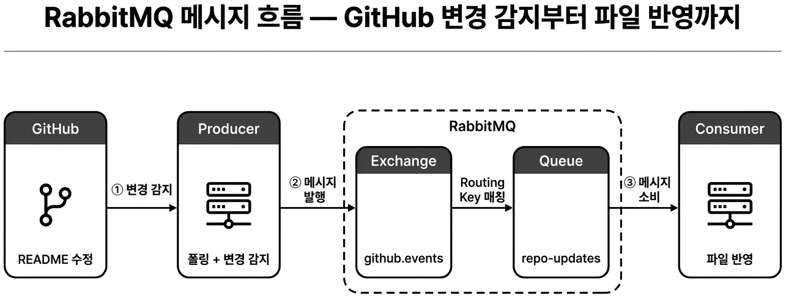

*전체 흐름 -- GitHub 변경이 Producer를 거쳐 RabbitMQ를 통해 Consumer에 전달된다*

핵심 개념 세 가지를 짚고 넘어갑니다.

**Exchange** 는 메시지를 받아서 Queue로 전달하는 분류 지점입니다. 우체국 접수대에 해당합니다. 이 실습에서는 Direct 방식을 사용합니다. Direct Exchange는 메시지의 Routing Key가 정확히 일치하는 Queue에만 메시지를 전달합니다.

**Queue** 는 메시지를 보관하는 대기열입니다. 우체국 사서함에 해당합니다. Consumer가 꺼내갈 때까지 메시지가 남아 있습니다.

**Routing Key** 는 메시지에 붙는 라벨입니다. 우편번호에 해당합니다. Exchange가 이 값을 보고 어떤 Queue로 보낼지 결정합니다. 이 실습에서는 `readme.changed` 라는 Routing Key를 사용합니다.

Exchange와 Queue를 연결하는 규칙을 **Binding** 이라고 합니다. "이 우편번호의 편지는 이 사서함에 넣어라"는 규칙을 등록하는 것입니다.

### 9.2 실습 환경

RabbitMQ를 Docker로 실행합니다. 아래 코드를 `docker-compose.yml` 에 작성합니다.

```yaml
services:
  rabbitmq:
    image: rabbitmq:3-management
    ports:
      - "5672:5672"
      - "15672:15672"
```

5672는 RabbitMQ의 메시지 통신 포트이고 15672는 관리 콘솔 웹 포트입니다. `rabbitmq:3-management` 이미지는 관리 콘솔이 포함된 버전입니다.

```bash
docker-compose up -d
```

컨테이너가 올라오면 RabbitMQ 상태를 확인합니다. Management UI가 준비되기까지 10~20초 정도 걸릴 수 있습니다.

브라우저에서 `http://localhost:15672` 에 접속합니다. 로그인 화면이 보이면 성공입니다. 기본 계정은 `guest / guest` 입니다.

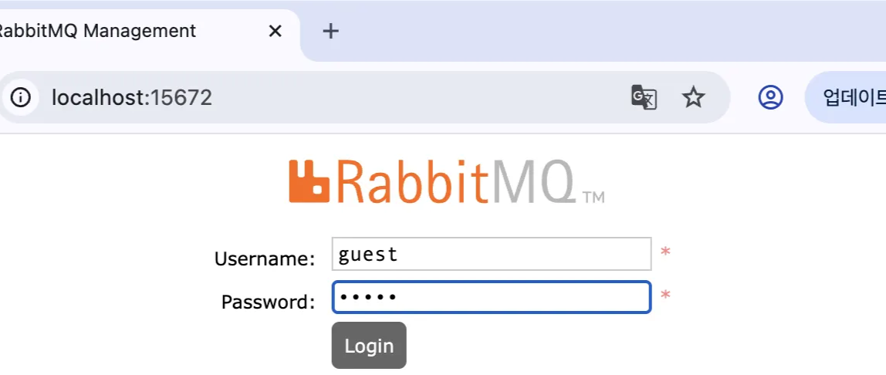

*RabbitMQ 관리 콘솔 로그인 화면 -- guest/guest로 접속한다*

로그인하면 관리 콘솔 메인 화면이 나옵니다.

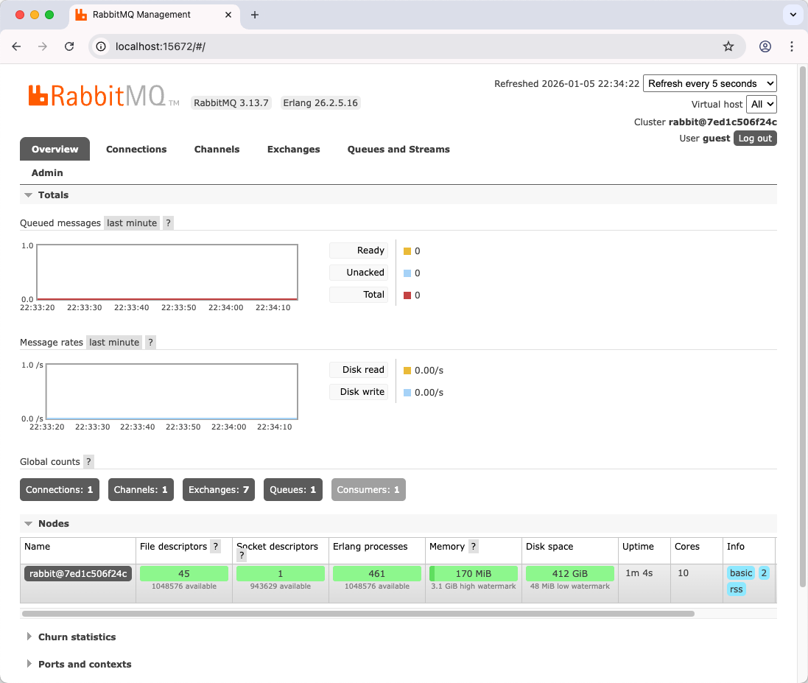

*RabbitMQ 관리 콘솔 -- 연결, 채널, Exchange, Queue 상태를 한눈에 볼 수 있다*

상단 탭을 살펴봅니다. **Overview** 는 전체 요약, **Connections** 는 현재 접속 중인 클라이언트 목록, **Channels** 는 메시지 통신 채널, **Exchanges** 는 메시지를 분류하는 접수대 목록, **Queues** 는 메시지가 대기하는 사서함 목록입니다. 실습 중에는 주로 Exchanges 탭과 Queues 탭을 확인합니다. 아직 Producer를 실행하지 않았으므로 Exchanges 탭에 기본 Exchange만 보이고 Queues 탭은 비어 있습니다.

#### GitHub Personal Access Token 발급

Producer가 GitHub API를 호출하려면 인증 토큰이 필요합니다. GitHub에서 Personal Access Token을 발급합니다.

1. GitHub에 로그인합니다.
2. 오른쪽 상단 프로필 아이콘을 클릭하고 **Settings** 를 선택합니다.
3. 왼쪽 사이드바 맨 아래 **Developer settings** 를 클릭합니다.
4. **Personal access tokens** > **Tokens (classic)** 을 선택합니다.
5. **Generate new token** > **Generate new token (classic)** 을 클릭합니다.
6. Note에 `rabbitmq-demo` 등 용도를 적고, Expiration은 실습 기간에 맞춰 설정합니다.
7. Scope는 `repo` 에 체크합니다. 공개 레포만 사용한다면 체크 없이도 됩니다.
8. **Generate token** 을 클릭하고 표시된 토큰을 복사합니다.

토큰은 이 화면을 벗어나면 다시 볼 수 없으므로 바로 복사해 둡니다. 이 토큰은 Producer의 `application.properties` 에서 사용합니다.

[CAPTURE NEEDED: GitHub Developer settings > Personal access tokens 화면 -- Generate new token 버튼 위치]

GitHub에 테스트용 레포를 하나 만들어 둡니다. 레포 이름은 `config-readme` 로 하고 README.md 파일을 생성합니다.

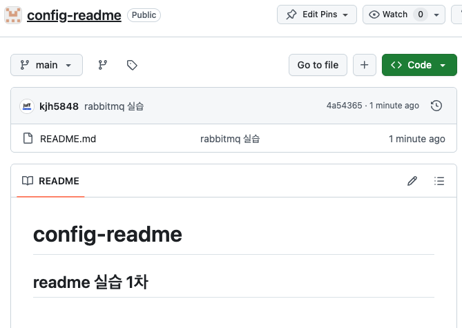

*GitHub에 config-readme 레포 생성 -- 이 레포의 README 변경을 감지할 것이다*

### 9.3 Producer 구현

Producer는 두 가지 일을 합니다. GitHub의 README 변경을 감지하는 것과 변경이 감지되면 RabbitMQ에 메시지를 발행하는 것입니다.

먼저 RabbitMQ 연결 정보와 GitHub 설정을 `application.properties` 에 작성합니다.

```properties
spring.rabbitmq.host=localhost
spring.rabbitmq.port=5672
spring.rabbitmq.username=guest
spring.rabbitmq.password=guest
rabbit.exchange=github.events
rabbit.queue=repo-updates
rabbit.routing-key=readme.changed
github.owner=자신의깃헙계정
github.repo=config-readme
github.readme-path=README.md
github.poll-interval-ms=60000
```

`github.poll-interval-ms=60000` 은 60초마다 GitHub API를 호출하겠다는 뜻입니다.

Exchange, Queue, Binding을 Spring Bean으로 등록합니다. 아래 코드를 `RabbitConfig.java` 에 작성합니다.

```java
@Bean
public DirectExchange exchange() {
    return new DirectExchange(exchangeName);
}
@Bean
public Queue queue() {
    return new Queue(queueName, true);
}
@Bean
public Binding binding(Queue queue, DirectExchange exchange) {
    return BindingBuilder.bind(queue).to(exchange).with(routingKey);
}
```

`new Queue(queueName, true)` 의 두 번째 인자 `true` 는 durable 설정입니다. RabbitMQ가 재시작되어도 Queue가 유지됩니다.

`BindingBuilder.bind(queue).to(exchange).with(routingKey)` 는 "이 Queue를 이 Exchange에 연결하되, 이 Routing Key의 메시지만 받아라"는 규칙을 등록합니다.

메시지 발행 코드를 봅니다. `RabbitProducer.java` 의 핵심은 한 줄입니다.

```java
public void send(RabbitDTO message) {
    rabbitTemplate.convertAndSend(exchange, routingKey, message);
}
```

`convertAndSend` 는 객체를 JSON으로 변환하여 지정한 Exchange에 Routing Key와 함께 발행합니다. 우체국 접수대에 "이 우편번호로 보내 주세요"라고 맡기는 것과 같습니다.

변경 감지는 `PollingScheduler.java` 가 담당합니다.

```java
private String lastSha = null;

@Scheduled(fixedRateString = "${github.poll-interval-ms}")
public void checkForReadmeChange() {
    String latestSha = gitHubClient.fetchLatestSha();
    if (latestSha.equals(lastSha)) { return; }
    lastSha = latestSha;
    String content = gitHubClient.fetchReadmeContent();
    RabbitDTO message = RabbitDTO.builder()
            .repo(gitHubClient.getRepoFullName()).sha(latestSha)
            .content(content).timestamp(LocalDateTime.now()).build();
    rabbitProducer.send(message);
}
```

`@Scheduled` 로 60초마다 GitHub API를 호출합니다. 마지막으로 확인한 커밋의 SHA 값과 현재 SHA 값을 비교해서 다르면 변경이 있다고 판단합니다. 변경이 있으면 README 내용을 가져와서 RabbitMQ에 메시지를 발행합니다.

`GitHubClient.java` 는 GitHub REST API를 호출하여 최신 커밋의 SHA를 조회합니다.

```java
public String fetchLatestSha() {
    String url = String.format(
        "https://api.github.com/repos/%s/%s/commits?path=%s&per_page=1",
        owner, repo, readmePath);
    ResponseEntity<List<Map<String, Object>>> response =
        restTemplate.exchange(url, HttpMethod.GET, ...);
    Object sha = commitObj.get("sha");
    return sha != null ? sha.toString() : null;
}
```

`per_page=1` 로 가장 최신 커밋 하나만 가져옵니다. 메시지에 담기는 DTO는 단순합니다.

```java
public class RabbitDTO {
    private String repo;
    private String sha;
    private String content;
    private LocalDateTime timestamp;
}
```

Producer를 실행합니다.

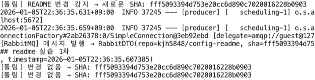

*Producer 서버 실행 -- 60초마다 GitHub을 폴링한다*

GitHub에서 README를 수정하고 커밋합니다.

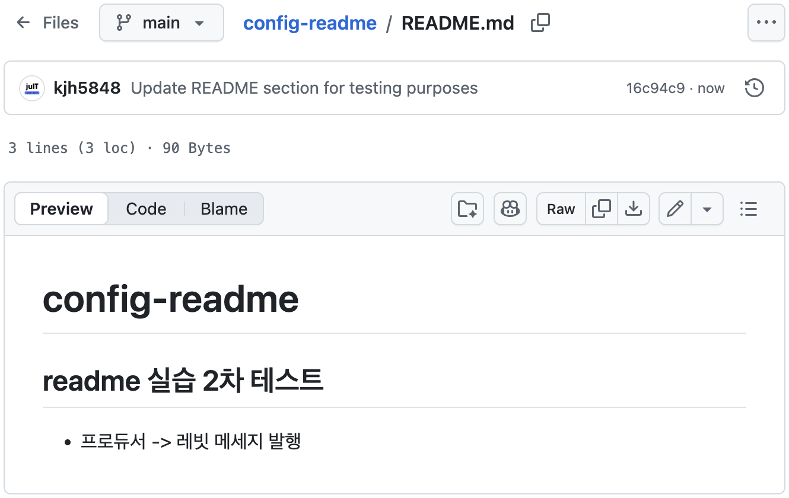

*GitHub에서 README 수정*

Producer 로그에서 변경 감지를 확인합니다.

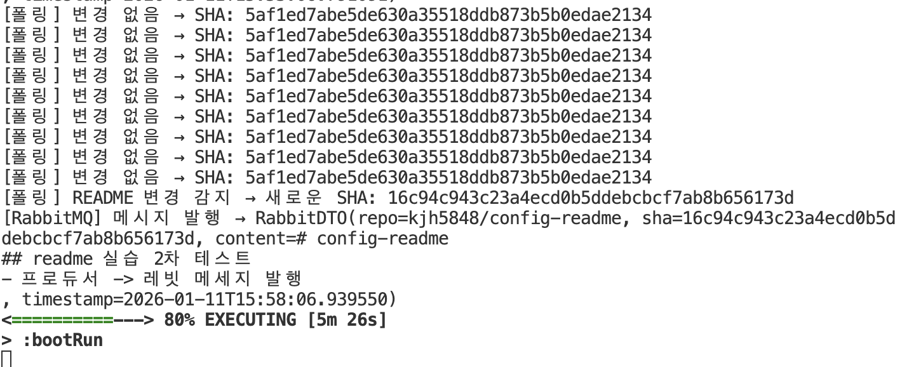

*Producer가 SHA 변경을 감지하고 메시지를 발행한 로그*

#### 중간 확인: 메시지가 Queue에 들어갔는가

RabbitMQ 관리 콘솔에서 **Queues** 탭을 클릭합니다. `repo-updates` Queue가 목록에 보이고 **Ready** 컬럼에 숫자가 1 이상이면 메시지가 정상적으로 큐잉된 것입니다. Consumer를 아직 실행하지 않았으므로 메시지가 Queue에 대기하고 있어야 합니다. Ready가 0이면 Producer 로그에서 에러가 없었는지 확인합니다.

[CAPTURE NEEDED: RabbitMQ Queues 탭 -- repo-updates Queue의 Ready 메시지 수 확인]

### 9.4 Consumer 구현

Consumer는 Queue에서 메시지를 꺼내 로컬 파일에 반영합니다. `RabbitConfig.java` 에 Queue와 JSON 컨버터를 등록합니다.

```java
@Bean
public Queue queue() {
    return new Queue(queueName, true);
}
@Bean
public MessageConverter jsonMessageConverter() {
    return new Jackson2JsonMessageConverter();
}
```

`Jackson2JsonMessageConverter` 를 Bean으로 등록하면 RabbitMQ에서 받은 JSON 메시지가 자동으로 자바 객체로 변환됩니다.

`RabbitConsumer.java` 가 메시지를 수신합니다.

```java
@RabbitListener(queues = "${rabbit.queue}")
public void receive(RabbitDTO message) {
    System.out.println("=== 메시지 수신 ===");
    System.out.println("Repository: " + message.getRepo());
    System.out.println("SHA: " + message.getSha());
    patchFile(message.getContent());
}
```

`@RabbitListener` 는 지정한 Queue를 구독합니다. 메시지가 도착하면 `receive` 메서드가 자동으로 호출됩니다. 우체국 사서함 앞에서 편지가 오기를 기다리고 있는 것과 같습니다.

`patchFile` 은 파일 내용을 비교하여 변경이 있을 때만 덮어씁니다.

```java
private void patchFile(String newContent) throws IOException {
    File file = new File(README_PATH);
    String oldContent = Files.readString(file.toPath(), StandardCharsets.UTF_8);
    if (Objects.equals(oldContent.trim(), newContent.trim())) { return; }
    Files.copy(file.toPath(), backupFile.toPath());
    writeContent(file, newContent);
}
```

기존 파일을 백업한 뒤 새 내용으로 덮어씁니다. 내용이 같으면 아무것도 하지 않습니다.

Consumer의 `application.properties` 는 간단합니다.

```properties
spring.rabbitmq.host=localhost
spring.rabbitmq.port=5672
spring.rabbitmq.username=guest
spring.rabbitmq.password=guest
rabbit.queue=repo-updates
```

Consumer는 Queue 이름만 알면 됩니다. Exchange나 Routing Key는 Producer 쪽에서 설정합니다. 받는 사람은 자기 사서함 번호만 알면 되는 것과 같습니다.

### 9.5 통합 테스트 시나리오

세 서버를 모두 실행합니다. Docker(RabbitMQ), Producer, Consumer 순서입니다.

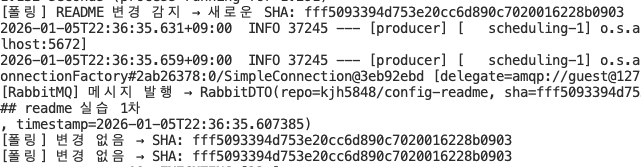

*Docker, Producer, Consumer 세 서버가 모두 실행 중이다*

RabbitMQ 관리 콘솔에서 Exchange 탭을 확인합니다.

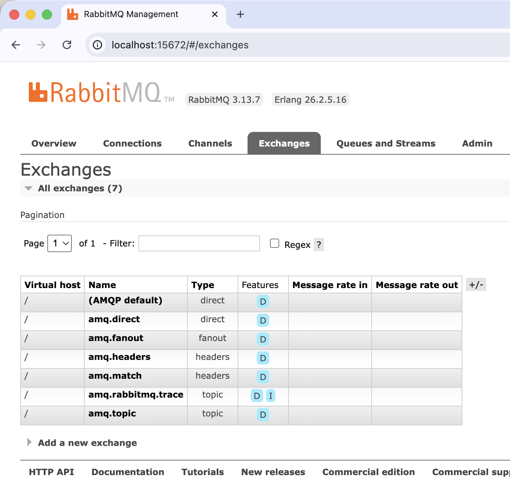

*Exchanges 탭 -- Producer가 등록한 github.events Exchange가 보인다*

Exchange 상세에서 Binding 정보를 확인합니다.

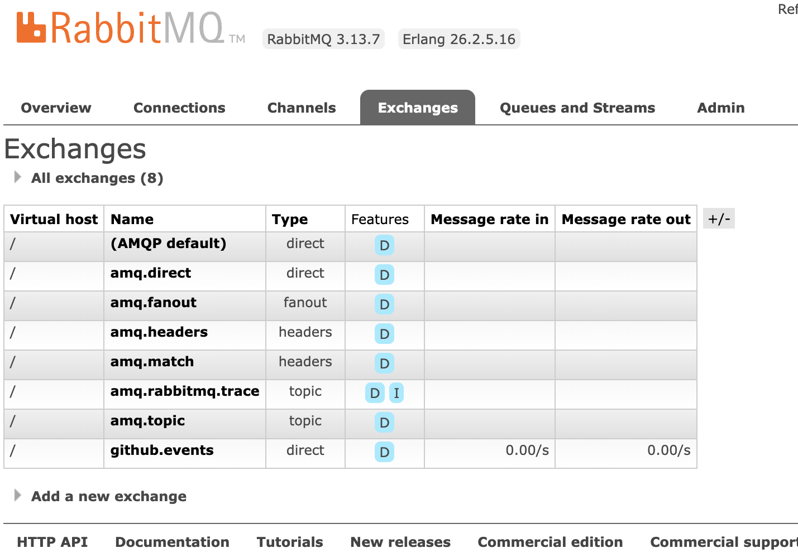

*Exchange 상세 -- repo-updates Queue에 readme.changed Routing Key로 바인딩되어 있다*

Queue 상세에서 메시지 수와 상태를 확인합니다.

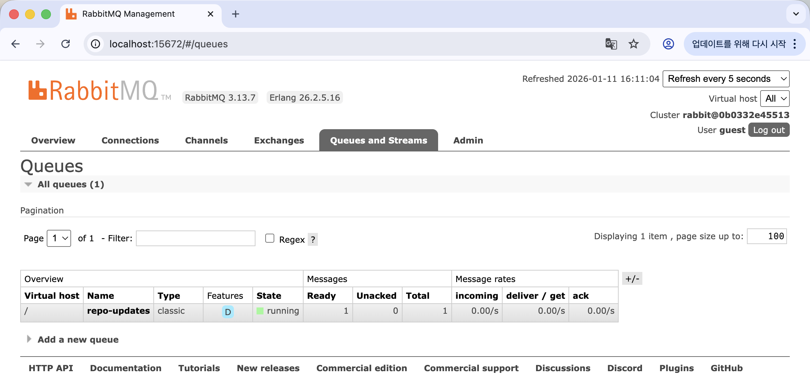

*Queue 상세 -- repo-updates Queue의 메시지 수와 소비 상태가 보인다*

Binding 정보도 확인합니다. Exchange에서 Queue로의 연결 규칙입니다.

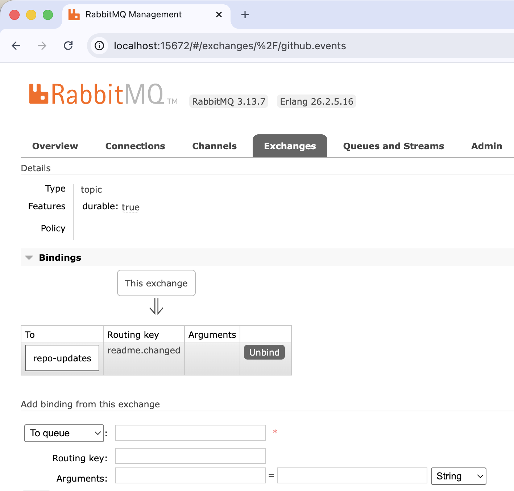

*Binding 확인 -- readme.changed Routing Key로 바인딩되어 있다*

이제 GitHub에서 README를 수정하고 커밋합니다.

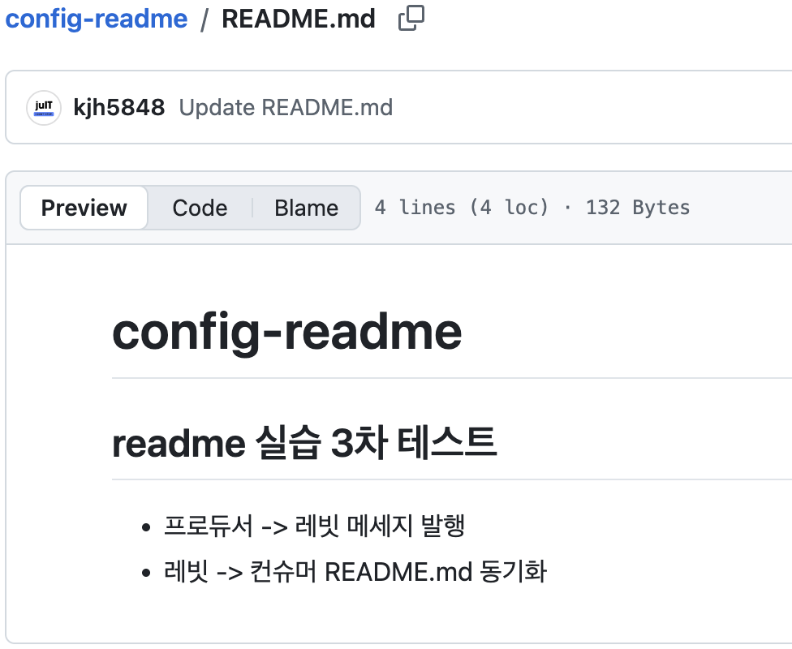

*GitHub에서 README를 수정하고 커밋한다*

Producer가 변경을 감지합니다.

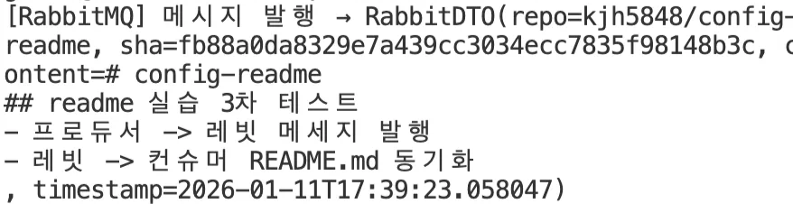

*Producer가 SHA 변경을 감지하고 메시지를 발행한다*

Consumer가 메시지를 수신합니다.

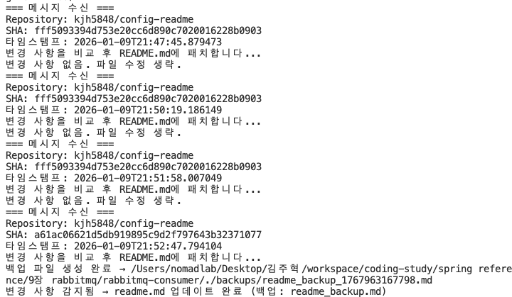

*Consumer가 메시지를 수신하고 파일 반영을 시작한다*

로컬 README 파일이 자동으로 업데이트됩니다.

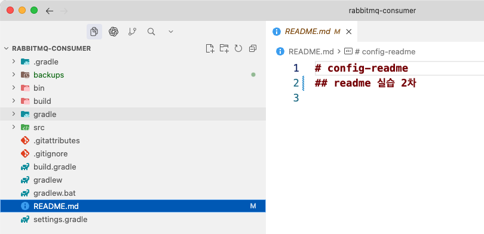

*로컬 README 파일이 GitHub의 내용으로 자동 업데이트되었다*

백업 파일도 생성되었는지 확인합니다.

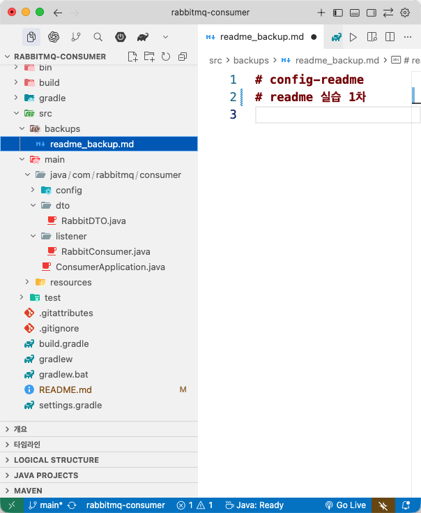

*이전 내용이 백업 파일로 저장되어 있다*

관리 콘솔에서 Queue에 들어온 메시지 내용을 직접 확인할 수도 있습니다. Queue 상세 화면에서 Get Messages를 클릭합니다.

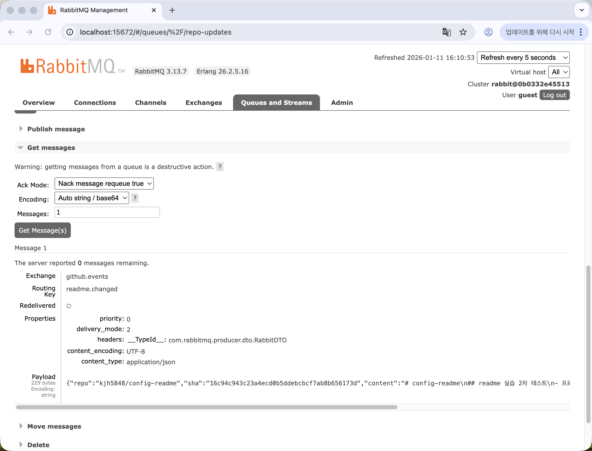

*Queue 메시지 payload -- repo, sha, content, timestamp가 JSON으로 들어 있다*

GitHub README 수정부터 로컬 파일 반영까지 사람이 개입하지 않았습니다. 편지를 우체국에 맡기면 알아서 사서함에 도착하듯이 메시지가 자동으로 흘러갔습니다.

#### 중간 확인: Consumer가 메시지를 소비했는가

RabbitMQ 관리 콘솔의 **Queues** 탭에서 `repo-updates` Queue를 확인합니다. Consumer 실행 전에 **Ready** 에 쌓여 있던 메시지 수가 Consumer 실행 후 0으로 줄어들면 성공입니다. Consumer 터미널에 "메시지 수신" 로그가 출력되고 로컬 README 파일의 내용이 GitHub에서 수정한 내용과 같으면 전체 흐름이 정상 동작한 것입니다.

전체 흐름을 다시 한번 확인합니다. GitHub에서 README를 한 번 더 수정하고 커밋합니다. 60초 이내에 Producer 로그에서 SHA 변경 감지가 출력되고, Consumer 로그에서 메시지 수신이 출력되고, 로컬 README 파일이 업데이트되면 end-to-end 동작이 검증된 것입니다.

### 9.6 실무 확장 포인트

이 실습은 가장 단순한 형태입니다. 실무에서는 몇 가지를 더 고려합니다.

**Dead Letter Queue** 는 처리에 실패한 메시지를 모아 두는 별도의 Queue입니다. Consumer가 메시지를 처리하다가 예외가 발생하면 메시지가 사라지지 않고 Dead Letter Queue로 이동합니다. 반송 편지함이라고 생각하면 됩니다. 나중에 실패 원인을 분석하거나 재처리할 수 있습니다.

**Webhook vs Polling** 도 고려 대상입니다. 이 실습에서는 60초마다 GitHub API를 호출하는 Polling 방식을 사용했습니다. GitHub Webhook을 사용하면 README가 변경되는 즉시 GitHub이 Producer에게 알려 줍니다. 우체국에 직접 가서 편지가 왔는지 확인하는 것과 우체부가 집 앞까지 와서 알려 주는 것의 차이입니다. Webhook은 실시간성이 좋지만 외부에서 접근할 수 있는 URL이 필요합니다.

**다중 Consumer** 도 가능합니다. 같은 Queue를 여러 Consumer가 구독하면 메시지가 라운드 로빈 방식으로 분배됩니다. 하나의 사서함을 여러 사람이 번갈아 확인하는 것과 같습니다. 처리량이 부족할 때 Consumer만 늘리면 됩니다. Producer는 변경할 필요가 없습니다.

---

| 비유 | 기술 용어 | 정식 정의 |
|------|----------|----------|
| 편지 보내는 사람 | **Producer** | 메시지를 생성하여 Exchange에 발행하는 주체. RabbitTemplate의 convertAndSend 메서드를 사용한다 |
| 우체국 접수대 | **Exchange** | 메시지를 받아 Routing Key를 기준으로 적절한 Queue에 라우팅하는 분류 지점. Direct, Topic, Fanout 등의 타입이 있다 |
| 우편번호 | **Routing Key** | 메시지에 붙는 라벨. Exchange가 이 값을 보고 어떤 Queue로 메시지를 전달할지 결정한다 |
| 사서함 | **Queue** | 메시지를 보관하는 대기열. Consumer가 꺼내갈 때까지 메시지가 남아 있으며 durable 설정 시 서버 재시작에도 유지된다 |
| 편지 받는 사람 | **Consumer** | Queue를 구독하여 메시지를 수신하는 주체. @RabbitListener로 특정 Queue를 구독한다 |
| 사서함과 접수대를 연결하는 규칙 | **Binding** | Exchange와 Queue를 연결하는 규칙. 특정 Routing Key의 메시지를 특정 Queue로 전달하도록 설정한다 |
| 반송 편지함 | **Dead Letter Queue** | 처리에 실패한 메시지를 모아 두는 별도의 Queue. 실패 원인 분석이나 재처리에 사용된다 |

---

## 이것만은 기억하자

시스템 간에 데이터를 전달할 때 직접 호출하면 받는 쪽의 상태에 보내는 쪽이 영향을 받습니다. RabbitMQ를 사이에 두면 보내는 쪽은 메시지를 맡기기만 하고 받는 쪽은 자기 속도에 맞춰 가져갑니다. Exchange가 Routing Key를 보고 메시지를 적절한 Queue에 넣어 주고 Consumer는 Queue를 구독하여 메시지가 도착하면 처리합니다. 받는 쪽이 잠시 내려가 있어도 메시지는 Queue에 남아 있습니다.

Docker 명령어 앞에서 얼어붙던 터미널이 떠오릅니다. 1장에서 처음 컨테이너를 띄우고 소셜 로그인을 붙이고 세션을 공유하고 파일을 올리고 실시간 통신을 구현하고 검색 엔진을 연결하고 메시지 큐까지 왔습니다. 어느 기술도 처음부터 쉽지 않았지만 한 번 만들어 보고 나면 두 번째는 덜 무서웠습니다. 에필로그에서 이 여정을 돌아봅니다.