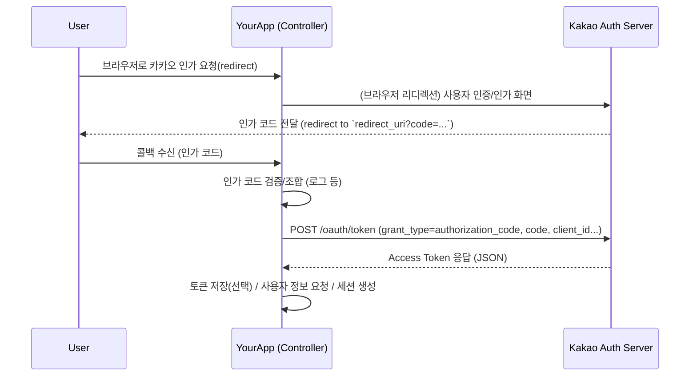

# 카카오 OAuth: 코드로 Access Token 발행하기 (실습 예제)

이 문서는 카카오 OAuth 인가 코드(authorization code)를 받아서 Access Token을 발행(exchange)하는 방법을 실습 중심으로 정리합니다.

목표
- 인가 코드 수신 후 서버에서 카카오에 토큰 요청을 보내 Access Token을 얻는 코드 예제
- 필요한 설정(`application.properties`)과 간단한 컨트롤러/서비스/DTO 예제
- 시퀀스 다이어그램으로 흐름 정리

환경 가정
- Spring Boot 애플리케이션 (Spring Web)
- `RestTemplate` 또는 `WebClient` 사용 가능 (예제에서는 `RestTemplate` 사용)

**1. application.properties (설정)**

```properties
# 카카오 앱 정보
kakao.client-id=YOUR_KAKAO_REST_API_KEY
kakao.client-secret=YOUR_KAKAO_CLIENT_SECRET # (필요한 경우)
kakao.redirect-uri=http://localhost:8080/oauth/kakao/callback
kakao.token-uri=https://kauth.kakao.com/oauth/token
```

**2. DTO (토큰 응답을 받을 클래스)**

예제 POJO (간단한 필드만 포함):

```java
package com.metacoding.spring_oauth.user; // 예시 패키지

public class KakaoTokenResponse {
    private String access_token;
    private String token_type;
    private Long expires_in;
    private String refresh_token;
    private Long refresh_token_expires_in;
    private String scope;

    // 기본 생성자, getter, setter
    public KakaoTokenResponse() {}

    // getters / setters
    public String getAccess_token() { return access_token; }
    public void setAccess_token(String access_token) { this.access_token = access_token; }
    public String getToken_type() { return token_type; }
    public void setToken_type(String token_type) { this.token_type = token_type; }
    public Long getExpires_in() { return expires_in; }
    public void setExpires_in(Long expires_in) { this.expires_in = expires_in; }
    public String getRefresh_token() { return refresh_token; }
    public void setRefresh_token(String refresh_token) { this.refresh_token = refresh_token; }
    public Long getRefresh_token_expires_in() { return refresh_token_expires_in; }
    public void setRefresh_token_expires_in(Long refresh_token_expires_in) { this.refresh_token_expires_in = refresh_token_expires_in; }
    public String getScope() { return scope; }
    public void setScope(String scope) { this.scope = scope; }
}
```

**3. 서비스: 인가 코드로 토큰 요청하기 (RestTemplate 사용 예)**

```java
package com.metacoding.spring_oauth.user;

import org.springframework.beans.factory.annotation.Value;
import org.springframework.http.HttpEntity;
import org.springframework.http.HttpHeaders;
import org.springframework.http.MediaType;
import org.springframework.http.ResponseEntity;
import org.springframework.stereotype.Service;
import org.springframework.util.LinkedMultiValueMap;
import org.springframework.util.MultiValueMap;
import org.springframework.web.client.RestTemplate;

@Service
public class KakaoOAuthService {
    private final RestTemplate restTemplate = new RestTemplate();

    @Value("${kakao.client-id}")
    private String clientId;

    @Value("${kakao.client-secret:}")
    private String clientSecret;

    @Value("${kakao.redirect-uri}")
    private String redirectUri;

    @Value("${kakao.token-uri}")
    private String tokenUri;

    public KakaoTokenResponse requestAccessToken(String code) {
        MultiValueMap<String, String> params = new LinkedMultiValueMap<>();
        params.add("grant_type", "authorization_code");
        params.add("client_id", clientId);
        if (clientSecret != null && !clientSecret.isBlank()) {
            params.add("client_secret", clientSecret);
        }
        params.add("redirect_uri", redirectUri);
        params.add("code", code);

        HttpHeaders headers = new HttpHeaders();
        headers.setContentType(MediaType.APPLICATION_FORM_URLENCODED);

        HttpEntity<MultiValueMap<String, String>> request = new HttpEntity<>(params, headers);

        ResponseEntity<KakaoTokenResponse> response = restTemplate.postForEntity(tokenUri, request, KakaoTokenResponse.class);
        return response.getBody();
    }
}
```

설명: 카카오 토큰 엔드포인트는 `application/x-www-form-urlencoded` 형태의 POST 요청을 기대합니다. `grant_type`, `client_id`, `redirect_uri`, `code`는 필수입니다. (보안설정에 따라 `client_secret`이 필요할 수 있습니다.)

**4. 컨트롤러: 콜백에서 토큰 교환 호출 예**

```java
package com.metacoding.spring_oauth.user;

import org.springframework.stereotype.Controller;
import org.springframework.web.bind.annotation.GetMapping;
import org.springframework.web.bind.annotation.RequestParam;
import org.springframework.web.servlet.mvc.support.RedirectAttributes;

@Controller
public class OAuthController {
    private final KakaoOAuthService kakaoOAuthService;

    public OAuthController(KakaoOAuthService kakaoOAuthService) {
        this.kakaoOAuthService = kakaoOAuthService;
    }

    @GetMapping("/oauth/kakao/callback")
    public String kakaoCallback(@RequestParam String code, RedirectAttributes redirectAttributes) {
        KakaoTokenResponse token = kakaoOAuthService.requestAccessToken(code);
        // 실습용으로 토큰 일부를 리디렉트 대상에 붙여 확인
        redirectAttributes.addFlashAttribute("access_token", token.getAccess_token());
        return "redirect:/login-success"; // 실제로는 DB저장 또는 세션에 보관
    }
}
```

**5. curl로 직접 토큰 요청해보기 (디버깅용)**

아래 명령으로 카카오 토큰을 직접 요청해볼 수 있습니다 (브라우저로 인가 코드를 먼저 발급받아 `AUTH_CODE` 값을 사용).

```bash
curl -X POST "https://kauth.kakao.com/oauth/token" \
  -d "grant_type=authorization_code" \
  -d "client_id=YOUR_KAKAO_REST_API_KEY" \
  -d "redirect_uri=http://localhost:8080/oauth/kakao/callback" \
  -d "code=AUTH_CODE" \
  -d "client_secret=YOUR_KAKAO_CLIENT_SECRET"
```

응답 예 (JSON):

```json
{
  "access_token": "xxxxx",
  "token_type": "bearer",
  "refresh_token": "yyyyy",
  "expires_in": 21599,
  "scope": "profile"
}
```

**6. 시퀀스 다이어그램**



**7. 실습 팁 & 보안 주의사항**
- `redirect_uri`는 카카오 개발자 콘솔에 등록된 값과 정확히 일치해야 합니다.
- `client_secret`은 노출되지 않도록 서버 측에서만 사용하세요.
- 발급된 `access_token`과 `refresh_token`은 안전하게 저장(암호화 등)하고 노출하지 않도록 합니다.
- 토큰 만료/갱신 로직을 구현해 사용자 경험을 유지하세요.
- 프로덕션에서는 `RestTemplate` 대신 `WebClient` 사용(비동기/리액티브)나 SDK 사용을 고려하세요.

**8. 테스트 절차 요약**
- 1) `application.properties`에 키/리다이렉트 URI 설정
- 2) 브라우저에서 카카오 인가 URL로 이동하여 로그인(또는 직접 링크 생성)
- 3) 콜백 엔드포인트(`/oauth/kakao/callback`)에서 `code` 파라미터 수신
- 4) 서비스가 `POST https://kauth.kakao.com/oauth/token` 호출하여 토큰 수신
- 5) 응답 확인 및 애플리케이션에서 활용

추가로, 원하시면 이 문서에 소개한 서비스/컨트롤러/DTO를 실제 소스 파일로 리포지토리에 추가하고, 간단한 통합 테스트(또는 수동 시나리오)를 구성해드리겠습니다. 어떤 방식으로 더 진행할까요?
