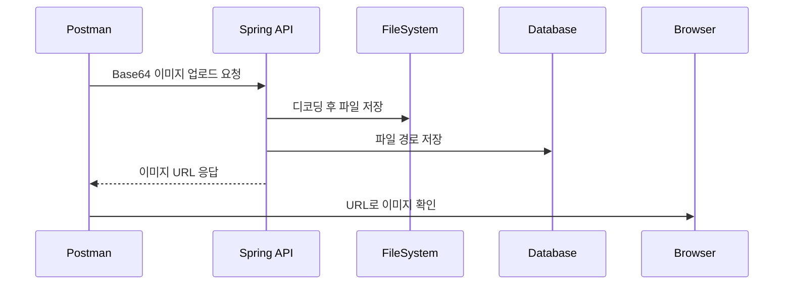

## 4.1 한눈에 보는 전체 흐름

전체 처리 흐름을 한 번에 이해하기 위한 절입니다. Base64는 바이너리 데이터를 문자열로 바꾸는 인코딩 방식이므로, 이미지 파일을 문자열로 바꿔 전송할 수 있습니다. 아래 다이어그램은 전송부터 조회까지의 흐름을 요약합니다.

시퀀스 다이어그램


### 4.1.1 Postman → Base64 전송
HTTP 요청 주소는 `POST /api/images/upload` 입니다. 이 요청은 Body에 `fileName`과 `fileData(Base64)`를 담아 서버로 전송하는 시작 단계입니다.

경로: src/main/java/com/metacoding/spring_base64/image/ImageController.java
```java
@PostMapping("/upload")
public ImageResponse.DTO uploadImage(@RequestBody ImageRequest.UploadDTO uploadDTO) throws IOException {
    return imageService.saveImage(uploadDTO);
}
```

이 코드는 업로드 요청의 시작점이며, 컨트롤러가 요청을 받아 서비스로 넘기는 구조를 이해하면 됩니다.

### 4.1.2 서버: 디코딩 → 파일 저장
HTTP 요청 주소는 `POST /api/images/upload` 입니다. 업로드 요청을 받으면 서버 내부에서 Base64를 디코딩하고 파일을 저장하는 처리가 함께 진행됩니다.

경로: src/main/java/com/metacoding/spring_base64/image/ImageService.java
```java
byte[] fileBytes = Base64.getDecoder().decode(uploadDTO.fileData());
Path uploadDir = Paths.get("uploads");
Path filePath = uploadDir.resolve(savedFileName);
Files.write(filePath, fileBytes);
```

이 코드는 문자열 데이터를 바이트로 바꾸고, 로컬 폴더에 파일을 저장하는 핵심 흐름입니다.

### 4.1.3 DB: 파일 경로 저장
HTTP 요청 주소는 `POST /api/images/upload` 입니다. 파일 저장 이후 같은 요청 흐름에서 파일 경로와 메타 정보를 DB에 기록합니다.

경로: src/main/java/com/metacoding/spring_base64/image/ImageService.java
```java
ImageEntity entity = ImageEntity.builder()
        .uuid(uuid)
        .fileName(savedFileName)
        .url(publicUrl)
        .createdAt(LocalDateTime.now())
        .build();
imageRepository.save(entity);
```

여기서는 저장된 파일의 URL과 생성 시간을 엔티티에 담아 DB에 저장합니다.

### 4.1.4 응답: 이미지 URL 반환 → 브라우저 확인
HTTP 요청 주소는 `GET /uploads/{fileName}` 입니다. 업로드 응답으로 받은 URL을 브라우저에서 호출하면 저장된 이미지가 보입니다.
