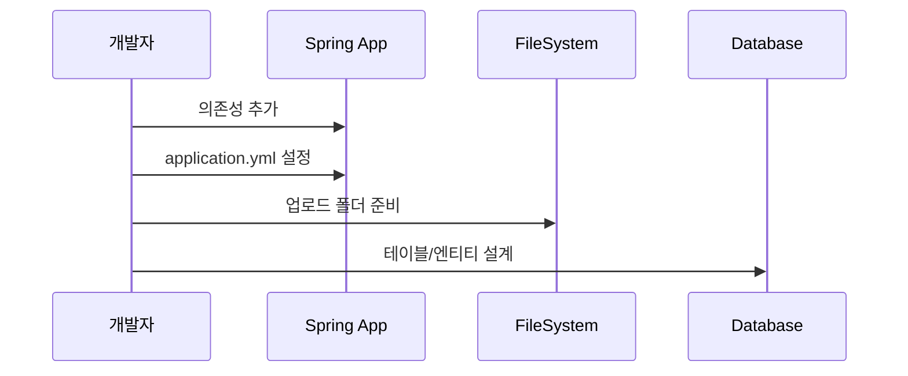

## 4.2 사전 준비 & 환경 설정

이 절은 업로드 기능을 만들기 전에 반드시 준비해야 하는 항목을 정리한 부분입니다. 의존성, 저장 경로, 설정 파일, DB 설계를 순서대로 점검합니다.

시퀀스 다이어그램


### 4.2.1 의존성 구성 (Spring Web, JPA 등)
의존성은 프로젝트가 사용하는 외부 라이브러리 목록입니다. Spring Web과 JPA가 있어야 웹 요청 처리와 DB 저장이 가능합니다.

경로: build.gradle
```gradle
dependencies {
    implementation 'org.springframework.boot:spring-boot-starter-data-jpa'
    implementation 'org.springframework.boot:spring-boot-starter-web'
    runtimeOnly 'com.h2database:h2'
}
```

### 4.2.2 업로드 저장 경로 설계
이 프로젝트는 `uploads` 폴더에 파일을 저장합니다. 실제 로컬 폴더가 존재해야 저장이 정상적으로 동작합니다.

경로: src/main/java/com/metacoding/spring_base64/image/ImageService.java
```java
Path uploadDir = Paths.get("uploads");
```

### 4.2.3 application.properties 설정
목차에는 application.yml로 적혀 있으나, 현재 프로젝트는 `application.properties`를 사용하고 있습니다. 정적 리소스 경로와 DB 설정을 함께 확인합니다.

경로: src/main/resources/application.properties
```properties
spring.datasource.url=jdbc:h2:mem:testdb
spring.jpa.hibernate.ddl-auto=update
spring.web.resources.static-locations=file:uploads/
server.port=8080
```

### 4.2.4 DB 테이블/엔티티 설계
엔티티는 DB 테이블과 매핑되는 자바 클래스입니다. 파일 경로와 생성 시각을 저장할 수 있도록 필드를 구성합니다. 업로드가 완료되면 DB에는 저장 파일명과 URL이 함께 기록되고, 이 URL은 정적 리소스 매핑 규칙(`/uploads/**`)을 그대로 따릅니다.


- 크롭: 컬럼 헤더(ID, CREATED_AT, FILE_NAME, URL, UUID)와 2~3행 정도만 보이게

URL 규칙은 다음과 같이 고정됩니다.
- 저장 파일명: UUID + 확장자
- URL: `/uploads/{savedFileName}`

이렇게 설계하는 이유는 아래와 같습니다.
- URL을 그대로 저장하면 응답에서 바로 사용할 수 있어 서비스 로직이 단순해집니다.
- 파일명 충돌을 피하기 위해 UUID를 사용하고, 원본 이름은 필요 시 별도 컬럼으로 확장할 수 있습니다.
- 정적 리소스 매핑 경로와 일치하므로 브라우저에서 즉시 확인할 수 있습니다.

경로: src/main/java/com/metacoding/spring_base64/image/ImageEntity.java
```java
@Entity
@Table(name = "image_tb")
public class ImageEntity {
    @Id
    @GeneratedValue(strategy = GenerationType.IDENTITY)
    private Long id;
    private String uuid;
    private String fileName;
    private String url;
    private LocalDateTime createdAt;
}
```

경로: src/main/java/com/metacoding/spring_base64/image/ImageRepository.java
```java
public interface ImageRepository extends JpaRepository<ImageEntity, Long> {
}
```

이 레포지토리는 기본 CRUD를 제공하므로, 별도 구현 없이 저장과 조회가 가능합니다.
