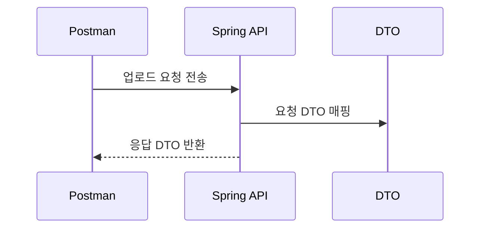

## 4.3 요청/응답 설계

이 절에서는 요청과 응답의 데이터 구조를 먼저 정의합니다. DTO를 기준으로 구조를 고정하면 이후 구현이 단순해지고 실수가 줄어듭니다.

시퀀스 다이어그램


### 4.3.1 요청 DTO: fileName, fileData(Base64)
요청 DTO는 파일 이름과 Base64 문자열을 한 묶음으로 전달하기 위한 구조입니다.

경로: src/main/java/com/metacoding/spring_base64/image/ImageRequest.java
```java
public record UploadDTO(
    String fileName,
    String fileData
){}
```

### 4.3.2 응답 DTO: id, uuid, fileName, url, createdAt
응답 DTO는 저장 결과를 사용자에게 알려주는 구조이며, 엔티티를 DTO로 변환해 응답 형식을 일정하게 유지합니다.

경로: src/main/java/com/metacoding/spring_base64/image/ImageResponse.java
```java
public record DTO(
        Long id,
        String uuid,
        String fileName,
        String url,
        LocalDateTime createdAt) {
    public static DTO fromEntity(ImageEntity imageEntity) {
        return new DTO(
                imageEntity.getId(),
                imageEntity.getUuid(),
                imageEntity.getFileName(),
                imageEntity.getUrl(),
                imageEntity.getCreatedAt());
    }
}
```

### 4.3.3 유효성 검증 포인트
초보자는 다음 항목을 기준으로 검증 조건을 먼저 정리하면 이해가 쉬워집니다. `fileName`은 확장자를 포함해야 하며, `fileData`는 Base64 형식이어야 합니다. 디코딩 실패나 빈 값은 400 오류로 처리하는 방향이 일반적입니다.
