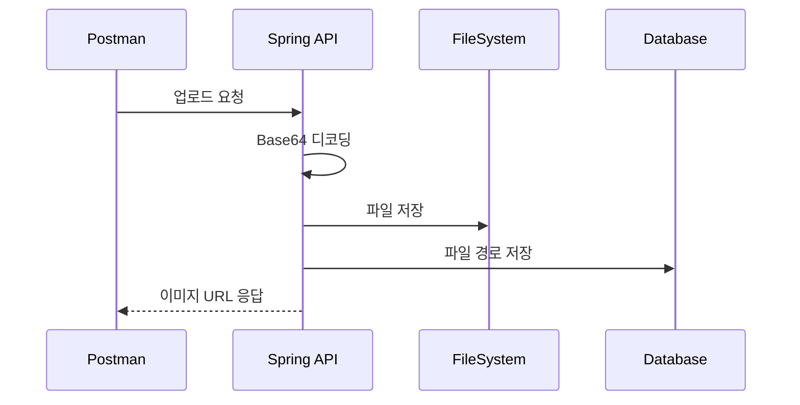

## 4.4 업로드 API 구현 (Base64 → 파일)

이 절에서는 업로드 요청을 받아 Base64를 디코딩하고 파일로 저장하는 핵심 로직을 다룹니다. 단계별로 나누어 보면 구조가 더 쉽게 이해됩니다.

시퀀스 다이어그램


### 4.4.1 Base64 디코딩 로직
디코딩은 인코딩된 문자열을 원본 바이트로 되돌리는 과정입니다.

경로: src/main/java/com/metacoding/spring_base64/image/ImageService.java
```java
byte[] fileBytes = Base64.getDecoder().decode(uploadDTO.fileData());
```

### 4.4.2 파일명/확장자 처리
파일명은 중복을 피하기 위해 UUID를 붙여 고유하게 만들고, 확장자를 함께 저장합니다.

경로: src/main/java/com/metacoding/spring_base64/image/ImageService.java
```java
String uuid = UUID.randomUUID().toString();
int dotIndex = uploadDTO.fileName().lastIndexOf('.');
String fileExtension = uploadDTO.fileName().substring(dotIndex + 1).trim().toLowerCase();
String savedFileName = uuid + "." + fileExtension;
```

### 4.4.3 로컬 디스크 저장
디코딩된 바이트 배열을 로컬 `uploads` 폴더에 파일로 저장합니다.

경로: src/main/java/com/metacoding/spring_base64/image/ImageService.java
```java
Path uploadDir = Paths.get("uploads");
Path filePath = uploadDir.resolve(savedFileName);
Files.write(filePath, fileBytes);
```

### 4.4.4 DB 저장 로직
저장된 파일의 URL을 만들고 엔티티에 담아 DB에 기록합니다.

경로: src/main/java/com/metacoding/spring_base64/image/ImageService.java
```java
String publicUrl = "/uploads/" + savedFileName;
ImageEntity entity = ImageEntity.builder()
        .uuid(uuid)
        .fileName(savedFileName)
        .url(publicUrl)
        .createdAt(LocalDateTime.now())
        .build();
imageRepository.save(entity);
```
