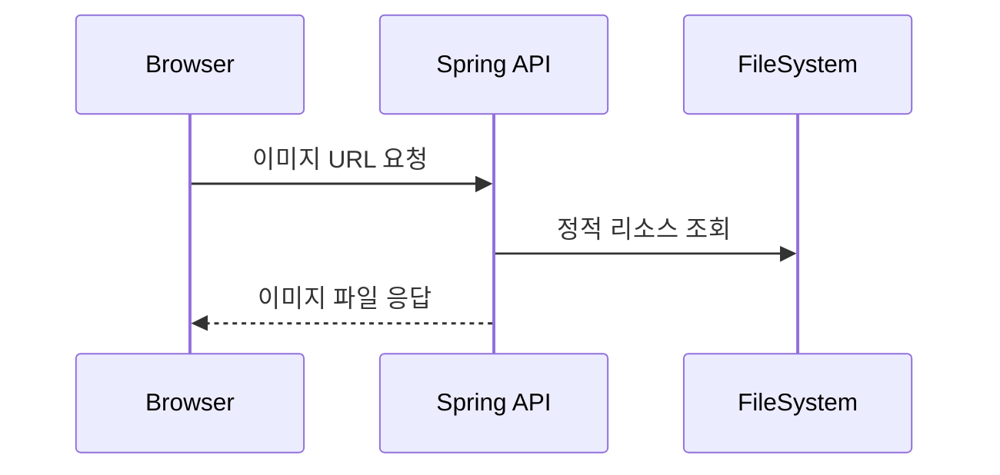

## 4.5 정적 리소스 매핑 & 조회 API

이 절에서는 저장된 파일을 URL로 바로 볼 수 있게 하는 방법을 다룹니다. 정적 리소스 매핑과 조회 API를 나누어 이해하면 구조가 명확해집니다.

시퀀스 다이어그램


### 4.5.1 정적 리소스 경로 매핑 (/uploads/**)
정적 리소스는 서버에서 그대로 반환되는 파일을 의미합니다. `/uploads/**` 요청을 로컬 `uploads` 폴더로 연결하면 브라우저에서 바로 확인할 수 있습니다.

경로: src/main/java/com/metacoding/spring_base64/_core/config/WebConfig.java
```java
@Override
public void addResourceHandlers(ResourceHandlerRegistry registry) {
    registry.addResourceHandler("/uploads/**")
            .addResourceLocations("file:uploads/");
}
```

### 4.5.2 조회 API 설계 (선택)
정적 URL 대신 조회 API로 접근을 통제할 수 있습니다. 이 프로젝트는 목록 조회와 단건 조회 엔드포인트를 제공하고 있습니다.

경로: src/main/java/com/metacoding/spring_base64/image/ImageController.java
```java
@GetMapping("/list")
public List<ImageResponse.DTO> getAllImages() {
    return imageService.listAll();
}

@GetMapping("/{id}")
public ImageResponse.DTO getImageDetail(@PathVariable Long id) {
    return imageService.findById(id);
}
```

### 4.5.3 URL로 이미지 바로 보기
브라우저에서 `GET /uploads/{fileName}`을 호출하면 저장된 이미지가 응답됩니다. 업로드 응답의 `url` 값을 그대로 사용하면 됩니다.
