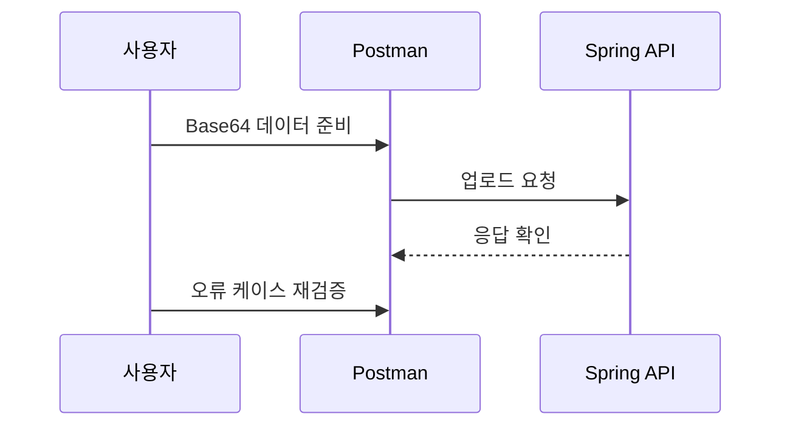

## 4.6 Postman 테스트 시나리오

이 절에서는 Postman으로 정상 케이스와 오류 케이스를 모두 확인합니다. 테스트 시나리오는 수행할 동작과 기대 결과를 정리한 목록이므로, 순서를 따라가며 검증하면 됩니다.

시퀀스 다이어그램


### 4.6.1 올바른 Base64 전송 예시
요청 주소는 `POST /api/images/upload` 입니다. Body는 JSON 형식으로 `fileName`과 `fileData`를 포함합니다.

```json
{
  "fileName": "cat.png",
  "fileData": "iVBORw0KGgoAAAANSUhEUgAA..."
}
```

### 4.6.2 오류 케이스 (빈 값, 잘못된 포맷)
`fileName`이 비어 있거나 확장자가 없으면 저장 단계에서 문제가 생깁니다. `fileData`가 Base64가 아니면 디코딩에 실패하므로 400 응답으로 처리하는 것이 일반적입니다.

```json
{
  "fileName": "",
  "fileData": "not-base64"
}
```

### 4.6.3 응답 결과 확인
정상 응답에서는 저장된 정보가 JSON으로 반환됩니다. `url` 값을 브라우저에 입력하면 실제 이미지가 보이는지 확인할 수 있습니다.

```json
{
  "id": 1,
  "uuid": "0a4c3c6e-6b7b-4d0d-9b9a-1f7d2b3c4d5e",
  "fileName": "0a4c3c6e-6b7b-4d0d-9b9a-1f7d2b3c4d5e.png",
  "url": "/uploads/0a4c3c6e-6b7b-4d0d-9b9a-1f7d2b3c4d5e.png",
  "createdAt": "2024-01-01T10:00:00"
}
```

### 4.6.4 id 조회 테스트
업로드 응답에서 받은 `id`로 상세 조회를 확인합니다. 요청 주소는 `GET /api/images/{id}` 입니다.

예시 요청:
`GET /api/images/1`

예상 응답:
```json
{
  "id": 1,
  "uuid": "0a4c3c6e-6b7b-4d0d-9b9a-1f7d2b3c4d5e",
  "fileName": "0a4c3c6e-6b7b-4d0d-9b9a-1f7d2b3c4d5e.png",
  "url": "/uploads/0a4c3c6e-6b7b-4d0d-9b9a-1f7d2b3c4d5e.png",
  "createdAt": "2024-01-01T10:00:00"
}
```

### 4.6.5 list 조회 테스트
저장된 전체 이미지 목록을 조회합니다. 요청 주소는 `GET /api/images/list` 입니다.

예시 요청:
`GET /api/images/list`

예상 응답:
```json
[
  {
    "id": 1,
    "uuid": "0a4c3c6e-6b7b-4d0d-9b9a-1f7d2b3c4d5e",
    "fileName": "0a4c3c6e-6b7b-4d0d-9b9a-1f7d2b3c4d5e.png",
    "url": "/uploads/0a4c3c6e-6b7b-4d0d-9b9a-1f7d2b3c4d5e.png",
    "createdAt": "2024-01-01T10:00:00"
  },
  {
    "id": 2,
    "uuid": "c5b8f37c-e767-46b1-97fd-e2d67bd79dff",
    "fileName": "c5b8f37c-e767-46b1-97fd-e2d67bd79dff.png",
    "url": "/uploads/c5b8f37c-e767-46b1-97fd-e2d67bd79dff.png",
    "createdAt": "2024-01-01T10:05:00"
  }
]
```
