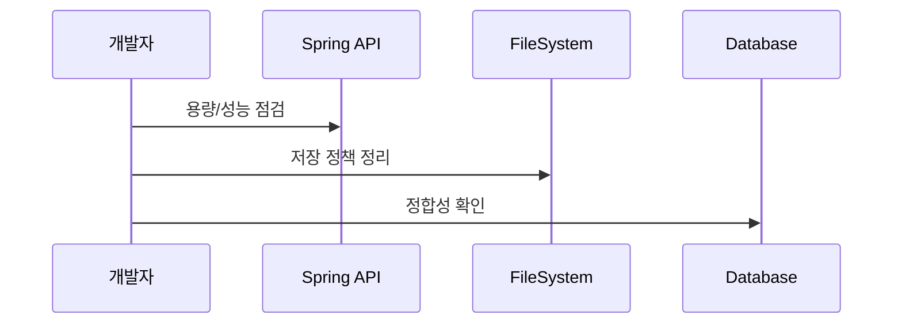

## 4.7 마무리 & 운영 팁

이 절에서는 운영 단계에서 주의해야 할 내용을 정리합니다. 성능, 보안, 확장 방향을 차근차근 점검하면 안정적인 서비스 운영에 도움이 됩니다.

시퀀스 다이어그램


### 4.7.1 성능/용량 관리
대용량 파일은 업로드 시간을 늘리고 서버 부하를 높입니다. 파일 크기 제한과 업로드 용량 정책을 미리 정해 두는 것이 안전합니다.

### 4.7.2 보안 주의사항 (파일 확장자, 크기 제한)
확장자 검증과 접근 권한 설정은 기본 보안입니다. 특히 허용 도메인을 제한하는 CORS 설정은 운영 환경에서 더 엄격하게 관리해야 합니다.

경로: src/main/java/com/metacoding/spring_base64/_core/config/CorsConfig.java
```java
config.addAllowedOrigin("http://localhost:5173");
config.addAllowedMethod("*");
config.addAllowedHeader("*");
config.setAllowCredentials(true);
```

### 4.7.3 클라우드 스토리지 연동 방향
로컬 저장은 학습용으로 충분하지만, 운영에서는 S3 같은 클라우드 스토리지를 검토하는 것이 일반적입니다. 파일 관리와 백업을 자동화할 수 있기 때문입니다.
