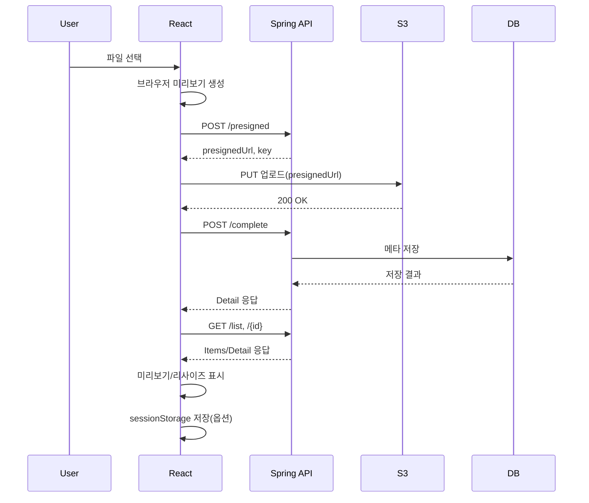

React와 Spring Presigned API를 연결해 업로드/미리보기/조회까지 흐름을 확인합니다.

## **1) React 프로젝트 사용**

```python
깃 주소
```

실행 방법은 [README.md](http://README.md) 를 확인하세요.

## **2) 미리보기**

### 2.1 업로드 페이지


---

### 2.2 목록 페이지


---

### 2.3 상세 페이지


---

## **3) CORS 설정**

### 3.1 Spring **CORS 설정**

React가 Spring에 접근할 수 있도록 CORS 허용이 필요합니다.

**(입력) 경로: src/main/java/com/metacoding/spring_presign_url/_core/config/CorsConfig.java**

```java
@Configuration
public class CorsConfig {

    @Bean
    public CorsFilter corsFilter() {
        CorsConfiguration config = new CorsConfiguration();
        config.addAllowedOrigin("http://localhost:5173"); // React 개발 서버
        config.addAllowedMethod("*"); // 모든 HTTP 메서드 허용
        config.addAllowedHeader("*"); // 모든 헤더 허용
        config.setAllowCredentials(true); // 쿠키, 인증정보 허용

        UrlBasedCorsConfigurationSource source = new UrlBasedCorsConfigurationSource();
        source.registerCorsConfiguration("/**", config);

        return new CorsFilter(source);
    }
}
```

---

### 3.2 AWS S3 CORS 설정

React가 S3에 접근할 수 있도록 CORS 허용이 필요합니다.

AWS S3 → 버킷 → 권한 탭 → CORS 설정으로 이동하여 아래 json을 입력합니다.


```python
[
  {
    "AllowedOrigins": ["http://localhost:3000", "http://localhost:5173"],
    "AllowedMethods": ["PUT", "GET", "HEAD"],
    "AllowedHeaders": ["*"]
  }
]
```

---

## **4) sessionStorage 설명**

React에서는  `sessionStorage`를 사용하여 Key 값을 저장합니다.

React에서는 업로드 직후의 **미리보기 URL과 메타 정보를 잠깐 보관**하기 위해 sessionStorage를 사용합니다. 새로고침 전까지는 서버 재요청 없이도 상세 화면에서 **즉시 미리보기/리사이즈 URL을 우선 표시**할 수 있고, 브라우저 탭(세션)이 종료되면 데이터는 사라집니다.

```jsx
sessionStorage.setItem("lastUploadKey", key);
const savedKey = sessionStorage.getItem("lastUploadKey");
sessionStorage.removeItem("lastUploadKey");

```

개발자 모드를 사용하여 업로드 후 이미지 url과 새로고침 후 url을 확인하세요.

---

## **5) 전체 흐름**



1. 사용자가 React 화면에서 파일을 선택합니다.
2. React가 브라우저에서 미리보기 URL을 생성합니다.
3. React가 Spring API에 POST /presigned로 presigned 발급을 요청합니다.
4. Spring API가 presignedUrl과 key(original/uuid.ext)를 응답합니다.
5. React가 presignedUrl로 S3에 PUT 업로드를 수행합니다.
6. S3가 업로드 성공(200 OK)을 반환합니다.
7. S3 ObjectCreated 이벤트로 Lambda가 실행됩니다(original/ 업로드 감지).
8. Lambda가 S3에서 원본을 GetObject로 읽고 리사이즈 후 resized/uuid.jpg로 PutObject 업로드합니다.
9. React가 Spring API에 POST /complete로 업로드 완료를 통지합니다(key, fileName).
10. Spring API가 key 규칙으로 resized/uuid.jpg 경로를 조합하고 원본/리사이즈 URL을 생성합니다.
11. Spring API가 메타데이터를 DB에 저장합니다(uuid, fileName, originalUrl, resizedUrl, createdAt).
12. React가 목록/상세 조회를 위해 GET /list, GET /{id}를 호출해 화면에 표시합니다.
13. (옵션) React가 미리보기/업로드 메타를 sessionStorage에 저장해 새로고침 전까지 빠르게 재사용합니다.

---

여기까지 5장 presigned Url을 마무리 하도록하겠습니다.