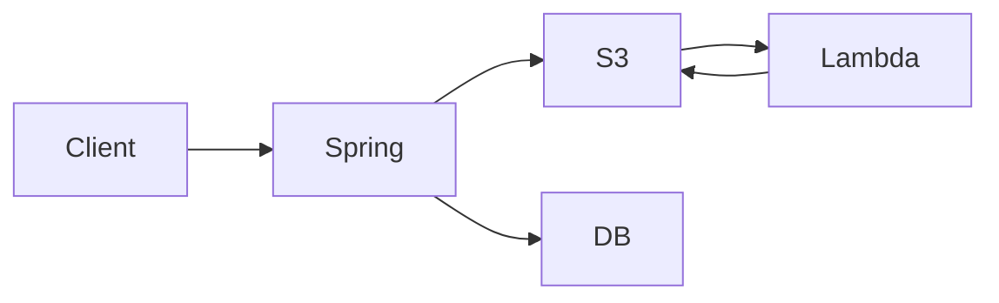
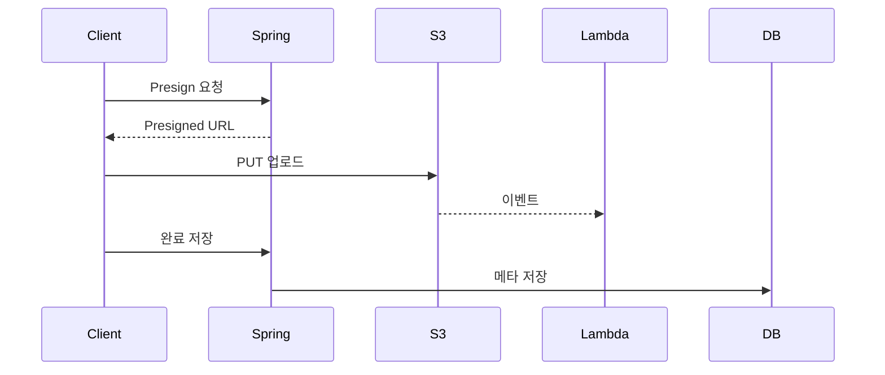

# 5.2 Architecture Rules: Presigned URL 기반 업로드 구조

> 목표: presigned 업로드 흐름의 구성요소, 데이터 흐름, 규칙을 한눈에 정리합니다.

## **1) 전체 아키텍처**

Spring API는 presigned 발급, 완료 저장, 조회 API를 담당합니다. S3는 업로드 원본과 리사이즈 결과를 저장하며, Lambda는 S3 이벤트를 받아 이미지를 처리합니다. H2는 메타 데이터를 저장하고, Postman은 전체 흐름 테스트에 사용합니다.

## **도식화(아키텍처 블록 다이어그램)**

전체 구성요소 간의 데이터 흐름을 한눈에 보여줍니다.

## **Mermaid Sequence Diagram**

요청/응답 순서와 시스템 간 상호작용을 순차적으로 표현합니다.

## **완료 저장 규칙**

- 클라이언트는 `/complete` 요청 시 리사이즈된 URL을 서버에 전달합니다.
- Lambda가 로컬 서버로 웹훅을 호출하면, AWS 환경에서는 `localhost`가 Lambda 자신을 의미하므로 로컬 서버에 도달할 수 없습니다.
- 따라서 서버가 직접 리사이즈 URL을 조합해 저장하는 구조를 사용합니다.

## **S3 Object Key 규칙**

- 원본 키는 `original/{uuid}.{ext}` 형식입니다.
- 결과 키는 `resized/{uuid}.jpg` 형식입니다.
- 파일명 규칙은 UUID로 고정하고, 사용자 입력 파일명은 DB에 저장합니다.

## **상태 모델(개념)**

- UPLOADED는 S3 업로드 완료 상태입니다.
- PROCESSED는 리사이즈 처리 완료 상태입니다.
- FAILED는 처리 실패 상태입니다.

> 실습은 최소 구현을 위해 PROCESSED 상태만 저장합니다. UPLOADED/FAILED는 확장 과제로 남깁니다.
> 

## **권한 모델**

- Presigned PUT은 Spring에서 생성한 URL만 허용합니다.
- Lambda 콜백은 사용하지 않습니다(로컬호스트 호출 불가).
- S3 접근은 Lambda와 Spring이 각자의 IAM 권한을 사용합니다.
