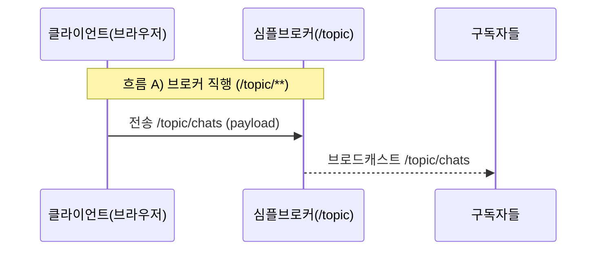
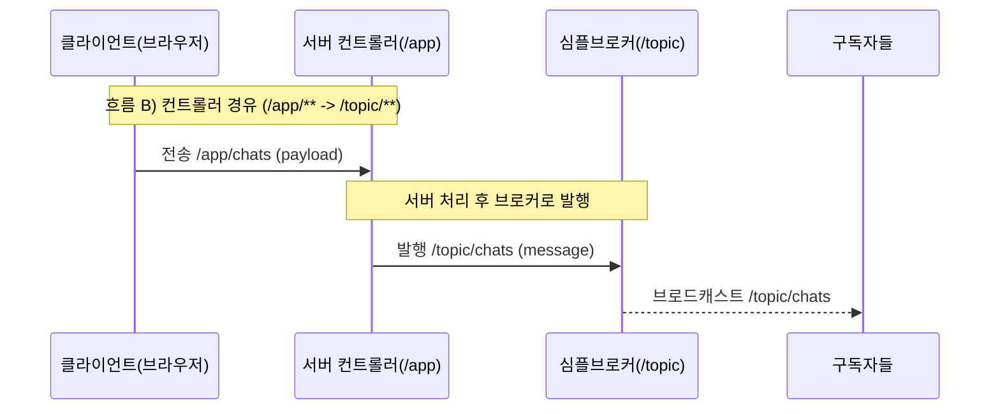

이번 실습에서는 WebSocket(STOMP)을 목적지 기반 pub/sub 구조로 이해하고, 메시지 흐름이 /topic/**로 브로커에 직접 전송되는 방식과 /app/**로 서버 컨트롤러에 전송되어 처리 후 /topic/**로 발행되는 방식 두 가지로 나뉜다는 점을 확인합니다. 실습 구현은 컨트롤러 경유(/app/chats → /topic/chats) 흐름을 사용합니다.

---

## 1) 2가지 흐름

### 1. 브로커 직행



브로커 직행 흐름은 클라이언트가 목적지(/topic/**)로 바로 메시지를 보내는 방식입니다. 이 경우 서버 컨트롤러 로직을 거치지 않고, 심플 브로커가 해당 토픽을 구독 중인 모든 클라이언트에게 즉시 브로드캐스트합니다.

---

### 2. 컨트롤러 경유



컨트롤러 경유 흐름은 클라이언트가 /app/**로 메시지를 보내 서버의 @MessageMapping 메서드가 먼저 처리하는 방식입니다. 컨트롤러는 메시지 가공이나 검증 같은 작업을 수행한 뒤, SimpMessagingTemplate을 통해 /topic/**로 발행하고, 마지막 전달은 브로커가 구독자에게 브로드캐스트합니다.

---

## 2) WebSocket 서버 구성

**(확인) 경로: src/../build.gradle**

```gradle
// Spring에서 WebSocket(STOMP 포함) 서버를 구성하고 메시지 브로커 기능을 사용하기 위한 의존성
implementation 'org.springframework.boot:spring-boot-starter-websocket'
```

WebSocket(STOMP) 실습을 위해 spring-boot-starter-websocket 의존성을 추가합니다. 이 의존성이 있어야 스프링이 WebSocket 연결과 STOMP 메시지 처리를 지원합니다.

---

**(확인) 경로: src/main/java/com/metacoding/websocket/config/WebSocketConfig.java**

```java
@Configuration
@EnableWebSocketMessageBroker
public class WebSocketConfig implements WebSocketMessageBrokerConfigurer {

    @Override
    public void registerStompEndpoints(StompEndpointRegistry registry) {
        registry.addEndpoint("/ws")
                .setAllowedOriginPatterns("*");
    }

    @Override
    public void configureMessageBroker(MessageBrokerRegistry registry) {
        registry.setApplicationDestinationPrefixes("/app");
        registry.enableSimpleBroker("/topic");
    }
}
```

WebSocket의 라우팅 규칙은 WebSocketConfig에서 결정됩니다. /ws는 브라우저가 연결을 맺는 엔드포인트이고, /app은 서버 컨트롤러로 들어가는 메시지 경로, /topic은 브로커가 중계하는 구독 채널 경로입니다. 즉 /app과 /topic을 분리해 “컨트롤러 경유”와 “브로커 전달” 흐름을 명확히 나눕니다.

---

**(확인) 경로: src/main/java/com/metacoding/websocket/chat/Chat.java**

```java
@NoArgsConstructor(access = AccessLevel.PROTECTED)
@Getter
@Table(name = "chat_tb")
@Entity
public class Chat {

    @Id
    @GeneratedValue(strategy = GenerationType.IDENTITY)
    private Integer id;
    private String message;

    @Builder
    public Chat(Integer id, String message) {
        this.id = id;
        this.message = message;
    }
}
```

채팅 메시지를 DB에 저장하기 위한 엔티티입니다. STOMP로 받은 메시지를 저장할 때 사용합니다.

---

**(확인) 경로: src/main/java/com/metacoding/websocket/chat/ChatRequest.java**

```java
public record ChatRequest(String message) {
}
```

클라이언트가 전송한 JSON 바디에서 message만 받도록 분리한 요청 모델입니다.

---

**(확인) 경로: src/main/java/com/metacoding/websocket/chat/ChatService.java**

```java
@Transactional(readOnly = true)
@RequiredArgsConstructor
@Service
public class ChatService {

    private final ChatRepository chatRepository;

    @Transactional
    public Chat save(ChatRequest req) {
        Chat chat = Chat.builder().message(req.message()).build();
        return chatRepository.save(chat);
    }

    public List<Chat> findAll() {
        Sort desc = Sort.by(Sort.Direction.DESC, "id");
        return chatRepository.findAll(desc);
    }
}
```

STOMP로 받은 메시지를 저장하고, 조회 시에는 최신 메시지가 먼저 보이도록 정렬합니다.

---

**(확인) 경로: src/main/java/com/metacoding/websocket/chat/ChatController.java**

```java
@RequiredArgsConstructor
@Controller
public class ChatController {

    private final ChatService chatService;
    private final SimpMessagingTemplate messagingTemplate;

    @MessageMapping("/chats")
    public void handle(ChatRequest payload) {
        Chat saved = chatService.save(payload);
        messagingTemplate.convertAndSend("/topic/chats", saved);
    }
}
```

컨트롤러는 /app/chats로 들어온 메시지를 저장한 뒤 /topic/chats로 발행합니다. 이 흐름이 실습의 기본 경로입니다.

---

## 6.4.2 Front 구현 (Vanilla JS)

### 1) 연결 객체 만들기 (WebSocket + STOMP)

```jsx
const socketUrl = (location.protocol === "https:" ? "wss://" : "ws://") + location.host + "/ws";
const stompClient = Stomp.over(new WebSocket(socketUrl));
```

브라우저는 /ws로 연결을 맺고, 그 위에 STOMP를 얹어 목적지 기반 전송(/app/**)과 구독(/topic/**)을 사용합니다.

---

### 2) 연결 성공 시 구독 설정

```jsx
stompClient.connect({}, () => {
  stompClient.subscribe("/topic/chats", (msg) => {
    const data = JSON.parse(msg.body);
    appendChat(data.message);
  });
});
```

연결 성공 후 /topic/chats를 구독하면 서버가 발행하는 메시지를 실시간으로 수신합니다.

---

### 3) 메시지 전송

```jsx
function sendMessage() {
  const messageInput = document.getElementById("message");
  const message = messageInput.value.trim();

  if (!stompClient.connected) {
    alert("연결 중입니다. 잠시 후 다시 시도하세요.");
    return;
  }

  stompClient.send("/app/chats", {}, JSON.stringify({ message }));
  messageInput.value = "";
  messageInput.focus();
}
```

전송은 /app/chats로 보내고, 서버 컨트롤러가 처리한 뒤 /topic/chats로 브로드캐스트합니다.

---

### 4) 화면에 메시지 추가하기

```jsx
function appendChat(message) {
  const box = document.getElementById("chat-box");
  const li = document.createElement("li");
  li.innerText = message;
  box.prepend(li);
}
```

수신한 메시지를 "<li>"로 만들어 <ul id="chat-box">에 추가합니다. prepend를 쓰기 때문에 최신 메시지가 위로 쌓입니다.

---

## 6.4.3 WebSocket 특징 정리

WebSocket은 연결을 한 번 맺으면 끊기 전까지 양방향으로 메시지를 주고받을 수 있어 실시간 UX가 가장 뛰어납니다. 대신 연결이 유지되는 동안 끊김과 재연결, 중복 구독, 인증 갱신 같은 상태 관리 문제가 생기기 쉬워 운영 관점의 처리가 필요합니다. 또한 서버를 여러 대로 확장할 경우에는 세션이 어느 서버로 붙는지(스티키)와 브로커를 어떻게 분산할지 같은 구조적 고려가 뒤따르게 됩니다.
