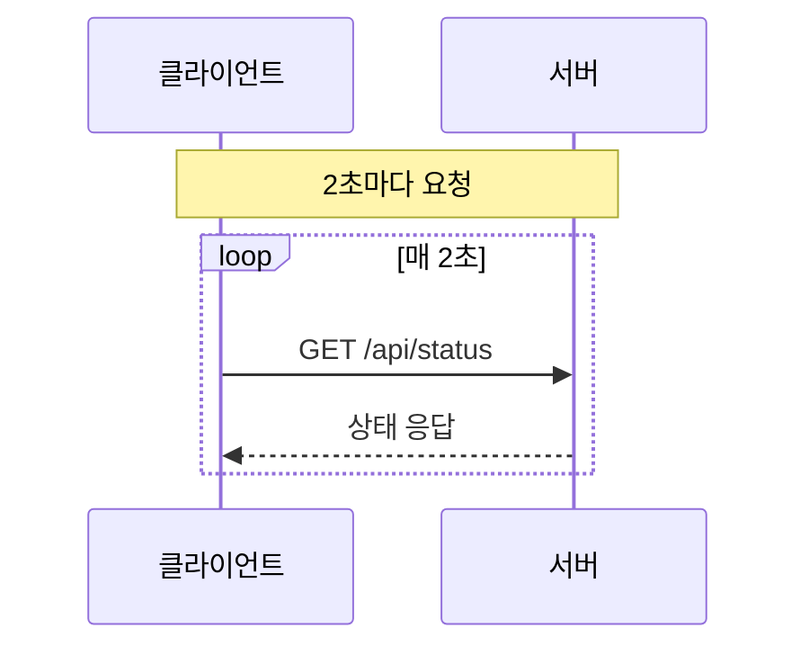
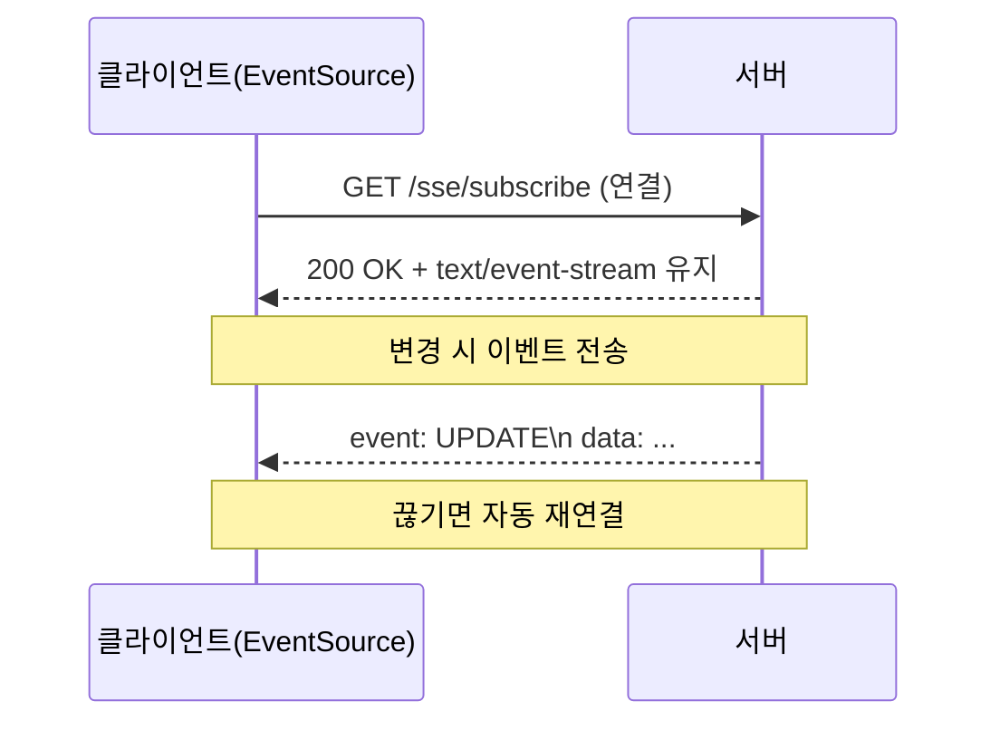
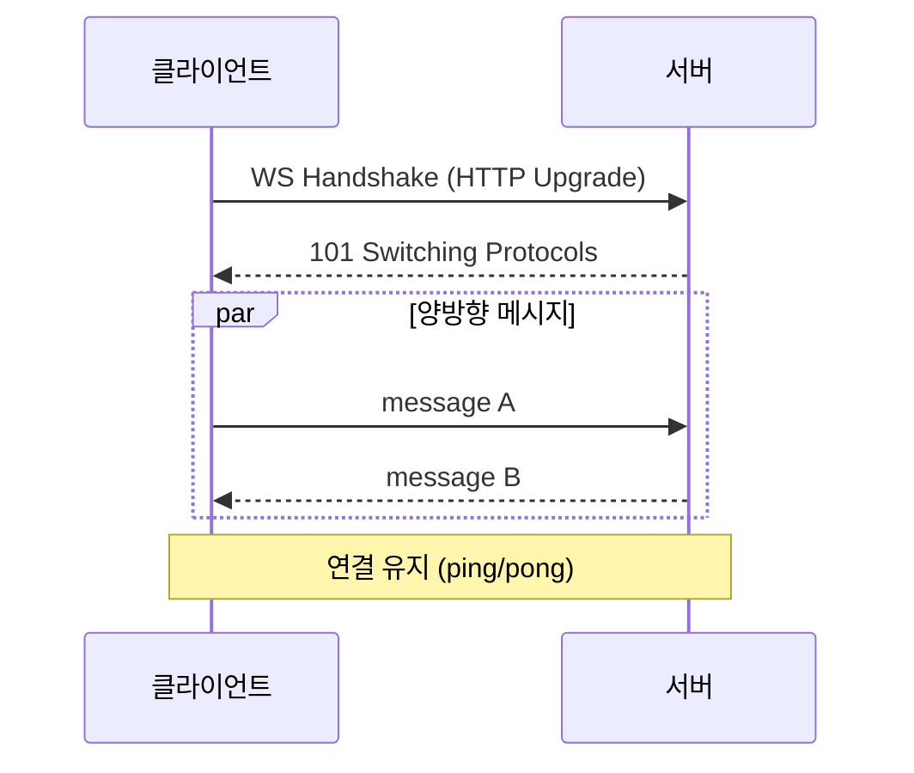

# 6장. Polling · SSE · WebSocket 실전 비교

이 장은 **Polling / SSE / WebSocket**을 각각 구현해 보고, 동작 방식과 차이를 비교하는 실습 교재입니다.
각 단계는 커밋 단위로 나눌 수 있도록 구성했습니다.

---

## 6.1 준비

### 6.1.1 Polling 개념과 특징

- 클라이언트가 **일정 주기**로 서버에 요청을 보내는 방식
- 구현은 쉽지만 **불필요한 요청**이 많아질 수 있음

### 6.1.2 SSE(Server-Sent Events) 개념과 특징

- HTTP 기반 **단방향 스트리밍(서버 → 클라이언트)**
- 브라우저가 **자동 재연결** 기능 제공

### 6.1.3 WebSocket 개념과 특징

- TCP 기반 **양방향 통신**
- 연결 유지/끊김 처리 등 **상태 관리 비용**이 존재

### 6.1.4 한눈에 보는 차이 표

| 구분 | Polling | SSE | WebSocket |
| --- | --- | --- | --- |
| 통신 방향 | 단방향(요청-응답) | 단방향(서버 → 클라) | 양방향 |
| 연결 방식 | 매 요청마다 새 연결 | HTTP 스트림 유지 | TCP 연결 유지 |
| 재연결 | 직접 구현 | 브라우저 자동 | 직접 구현 |
| 서버 부담 | 높음 | 중간 | 낮음 |
| 사용 예 | 알림 갱신 | 로그 스트림 | 채팅/게임 |

### 6.1.5 AWS 배포 체크리스트 (이미지)

[이미지]

- **Idle Timeout**: SSE는 장시간 연결이 필요하므로 60초 이상 권장
- **Sticky Session**: Simple Broker 사용 시 세션 스티키 필요
- **프록시 설정**: Nginx 사용 시 `proxy_read_timeout` 증가

---

## 6.2 Polling 구현 (Ajax)

### 6.2.1 Polling 서버 구현

#### 커밋 1. Polling - 도메인/DB 구성

**(확인) 경로: src/../build.gradle**
```gradle
dependencies {
    implementation 'org.springframework.boot:spring-boot-starter-web'
    implementation 'org.springframework.boot:spring-boot-starter-data-jpa'
    implementation 'org.springframework.boot:spring-boot-starter-mustache'

    runtimeOnly 'com.h2database:h2'
    compileOnly 'org.projectlombok:lombok'
    annotationProcessor 'org.projectlombok:lombok'
}
```
실습을 구동하는 데 필요한 최소 의존성을 준비합니다. 실제 로직은 다음 단계에서 작성합니다.
---

**(확인) 경로: src/main/resources/application.properties**
```properties
spring.application.name=polling
server.port=8080
spring.datasource.url=jdbc:h2:mem:testdb;MODE=MySQL
spring.jpa.hibernate.ddl-auto=create
```
H2 메모리 DB와 애플리케이션 포트를 설정해 실습이 바로 실행되도록 합니다.
---

**(입력) 경로: src/main/java/com/metacding/polling/chat/Chat.java**
```java
package com.metacding.polling.chat;

import jakarta.persistence.Entity;
import jakarta.persistence.GeneratedValue;
import jakarta.persistence.GenerationType;
import jakarta.persistence.Id;
import jakarta.persistence.Table;
import lombok.AccessLevel;
import lombok.Builder;
import lombok.Getter;
import lombok.NoArgsConstructor;

@NoArgsConstructor(access = AccessLevel.PROTECTED)
@Getter
@Table(name = "chat_tb")
@Entity
public class Chat {

    @Id
    @GeneratedValue(strategy = GenerationType.IDENTITY)
    private Integer id;

    private String message;

    @Builder
    public Chat(Integer id, String message) {
        this.id = id;
        this.message = message;
    }
}
```
채팅 메시지의 핵심 데이터(id, message)를 저장하는 엔티티를 정의합니다.
---

**(입력) 경로: src/main/java/com/metacding/polling/chat/ChatRepository.java**
```java
package com.metacding.polling.chat;

import org.springframework.data.jpa.repository.JpaRepository;

public interface ChatRepository extends JpaRepository<Chat, Integer> {
}
```
엔티티 저장/조회는 스프링 데이터가 처리하도록 연결합니다.
---

**(입력) 경로: src/main/java/com/metacding/polling/chat/ChatRequest.java**
```java
package com.metacding.polling.chat;

public record ChatRequest(String message) {
}
```
클라이언트가 보내는 message만 받도록 요청 모델을 분리합니다. 나머지 처리는 서비스가 담당합니다.
---

#### 커밋 2. Polling - 서비스/컨트롤러

**(입력) 경로: src/main/java/com/metacding/polling/chat/ChatService.java**
```java
package com.metacding.polling.chat;

import java.util.List;

import org.springframework.data.domain.Sort;
import org.springframework.stereotype.Service;
import org.springframework.transaction.annotation.Transactional;

import lombok.RequiredArgsConstructor;

@RequiredArgsConstructor
@Service
public class ChatService {

    private final ChatRepository chatRepository;

    @Transactional
    public Chat save(ChatRequest req) {
        Chat chat = Chat.builder()
                .message(req.message())
                .build();
        return chatRepository.save(chat);
    }

    public List<Chat> findAll() {
        Sort desc = Sort.by(Sort.Direction.DESC, "id");
        return chatRepository.findAll(desc);
    }
}
```
메시지 저장과 최신순 조회가 서비스의 핵심 로직입니다.
---

**(입력) 경로: src/main/java/com/metacding/polling/chat/ChatController.java**
```java
package com.metacding.polling.chat;

import java.util.List;

import org.springframework.http.ResponseEntity;
import org.springframework.stereotype.Controller;
import org.springframework.web.bind.annotation.GetMapping;
import org.springframework.web.bind.annotation.PostMapping;
import org.springframework.web.bind.annotation.RequestBody;
import org.springframework.web.bind.annotation.ResponseBody;

import lombok.RequiredArgsConstructor;

@RequiredArgsConstructor
@Controller
public class ChatController {

    private final ChatService chatService;

    @GetMapping("/")
    public String index() {
        return "index";
    }

    @PostMapping("/chats")
    @ResponseBody
    public ResponseEntity<Chat> save(@RequestBody ChatRequest req) {
        Chat saved = chatService.save(req);
        return ResponseEntity.ok(saved);
    }

    @GetMapping("/chats")
    @ResponseBody
    public ResponseEntity<List<Chat>> list() {
        return ResponseEntity.ok(chatService.findAll());
    }
}
```
핵심은 `/chats` 저장/조회 API입니다. `/`는 화면 진입용으로 사용합니다.
---

### 6.2.2 Front 구현 (Vanilla JS)

#### 커밋 3. Polling - 화면/스크립트

**(입력) 경로: src/main/resources/templates/index.mustache**
```html
<!doctype html>
<html lang="ko">

<head>
    <meta charset="UTF-8">
    <title>Polling Chat</title>
</head>

<body>

    <h1>Polling Chat</h1>
    <hr>

    <div>
        <input id="message" placeholder="메시지">
        <button onclick="sendMessage()">전송</button>
    </div>

    <ul id="chat-box"></ul>

    <script>
        async function loadMessages() {
            const res = await fetch("/chats");
            const data = await res.json();
            const box = document.getElementById("chat-box");

            box.innerHTML = "";
            data.forEach(chat => {
                const li = document.createElement("li");
                li.innerText = chat.message;
                box.appendChild(li);
            });
        }

        async function sendMessage() {
            const messageInput = document.getElementById("message");
            const message = messageInput.value.trim();

            await fetch("/chats", {
                method: "POST",
                headers: { "Content-Type": "application/json" },
                body: JSON.stringify({ message })
            });

            messageInput.value = "";
            messageInput.focus();
            loadMessages();
        }

        loadMessages();
        setInterval(loadMessages, 2000);
    </script>

</body>

</html>
```
2초마다 목록을 다시 요청해 화면을 갱신하는 폴링 흐름이 핵심입니다.
---

---

## 6.3 SSE 구현 (Server-Sent Events)

### 6.3.1 SSE 서버 구현

#### 커밋 1. SSE - Emitter 레지스트리

**(입력) 경로: src/main/java/com/metacoding/sse/config/SseEmitters.java**
```java
package com.metacoding.sse.config;

import java.util.Map;
import java.util.concurrent.ConcurrentHashMap;

import org.springframework.stereotype.Component;
import org.springframework.web.servlet.mvc.method.annotation.SseEmitter;

import com.metacoding.sse.chat.Chat;

import lombok.extern.slf4j.Slf4j;

@Slf4j
@Component
public class SseEmitters {

    private final Map<String, SseEmitter> emitters = new ConcurrentHashMap<>();

    public SseEmitter add(String clientId, SseEmitter emitter) {
        if (emitters.containsKey(clientId)) {
            SseEmitter prevEmitter = emitters.get(clientId);
            prevEmitter.complete();
        }

        emitters.put(clientId, emitter);

        final SseEmitter currentEmitter = emitter;
        emitter.onCompletion(() -> emitters.remove(clientId, currentEmitter));
        emitter.onTimeout(() -> emitter.complete());
        emitter.onError((e) -> emitter.complete());

        return emitter;
    }

    public void sendAll(Chat chat) {
        emitters.entrySet().forEach(entry -> {
            String clientId = entry.getKey();
            SseEmitter emitter = entry.getValue();

            try {
                emitter.send(SseEmitter.event()
                        .name("chat")
                        .data(chat));
            } catch (Exception e) {
                emitter.complete();
                emitters.remove(clientId);
            }
        });
    }
}
```
접속한 모든 클라이언트를 보관하고 `sendAll`로 한 번에 브로드캐스트하는 로직이 핵심입니다.
---

#### 커밋 2. SSE - 컨트롤러

**(입력) 경로: src/main/java/com/metacoding/sse/chat/ChatController.java**
```java
package com.metacoding.sse.chat;

import java.util.List;

import org.springframework.http.MediaType;
import org.springframework.http.ResponseEntity;
import org.springframework.stereotype.Controller;
import org.springframework.web.bind.annotation.GetMapping;
import org.springframework.web.bind.annotation.PostMapping;
import org.springframework.web.bind.annotation.RequestBody;
import org.springframework.web.bind.annotation.ResponseBody;
import org.springframework.web.servlet.mvc.method.annotation.SseEmitter;

import com.metacoding.sse.config.SseEmitters;

import jakarta.servlet.http.HttpSession;
import lombok.RequiredArgsConstructor;

@RequiredArgsConstructor
@Controller
public class ChatController {

    private final ChatService chatService;
    private final SseEmitters sseEmitters;
    private final HttpSession session;

    @GetMapping("/")
    public String index() {
        return "index";
    }

    @GetMapping(value = "/chats/connect", produces = MediaType.TEXT_EVENT_STREAM_VALUE)
    public ResponseEntity<SseEmitter> connect() {
        String clientId = session.getId();
        SseEmitter emitter = new SseEmitter(60 * 1000L);

        sseEmitters.add(clientId, emitter);

        try {
            emitter.send(SseEmitter.event().name("connect").data("connected"));
        } catch (Exception e) {
            emitter.complete();
        }

        return ResponseEntity.ok(emitter);
    }

    @PostMapping("/chats")
    @ResponseBody
    public Chat save(@RequestBody ChatRequest req) {
        Chat saved = chatService.save(req);
        sseEmitters.sendAll(saved);
        return saved;
    }

    @GetMapping("/chats")
    @ResponseBody
    public List<Chat> list() {
        return chatService.findAll();
    }
}
```
`/chats/connect`로 스트림을 열고 저장 즉시 `sendAll`로 전송하는 흐름이 핵심입니다.
---

### 6.3.2 Front 구현 (Vanilla JS)

#### 커밋 3. SSE - 화면/스크립트

**(입력) 경로: src/main/resources/templates/index.mustache**
```html
<!doctype html>
<html lang="ko">

<head>
    <meta charset="UTF-8">
    <title>SSE Chat</title>
</head>

<body>

<h1>SSE 실시간 채팅</h1>
<hr>

<div>
    <input id="message" placeholder="메시지 입력">
    <button onclick="sendMessage()">전송</button>
</div>

<ul id="chat-box" style="margin-top: 20px;"></ul>

<script>
    const sse = new EventSource("/chats/connect");

    sse.addEventListener("connect", (e) => {
        console.log("connected:", e.data);
    });

    sse.addEventListener("chat", (e) => {
        const chat = JSON.parse(e.data);
        appendChat(chat.message);
    });

    async function sendMessage() {
        const messageInput = document.getElementById("message");
        const message = messageInput.value.trim();

        await fetch("/chats", {
            method: "POST",
            headers: { "Content-Type": "application/json" },
            body: JSON.stringify({ message })
        });

        messageInput.value = "";
        messageInput.focus();
    }

    function appendChat(message) {
        const box = document.getElementById("chat-box");
        const li = document.createElement("li");
        li.innerText = message;
        box.prepend(li);
    }
</script>

</body>
</html>
```
`EventSource`로 스트림을 열고 `chat` 이벤트를 받으면 바로 화면에 반영합니다.
---

### 6.3.3 SSE 특징 정리

- 단방향 스트림(서버 → 클라이언트)
- 브라우저 기본 재연결 제공
- 다수 연결 시 서버 메모리 관리 필요

---

## 6.4 WebSocket 구현 (STOMP)

### 6.4.1 WebSocket 서버 구성

**비교 포인트**

- **Simple Broker 직행**: 클라이언트가 `/topic/**`로 전송 → 브로커가 즉시 전달
- **Controller 경유**: 클라이언트가 `/app/**`로 전송 → 서버 로직 후 브로커 전달


#### 커밋 1. WebSocket - 프로젝트 기본 설정

**(입력) 경로: src/../build.gradle**
```gradle
plugins {
    id 'java'
    id 'org.springframework.boot' version '3.5.8'
    id 'io.spring.dependency-management' version '1.1.7'
}

group = 'com.metacoding'
version = '0.0.1-SNAPSHOT'

dependencies {
    implementation 'org.springframework.boot:spring-boot-starter-web'
    implementation 'org.springframework.boot:spring-boot-starter-mustache'
    implementation 'org.springframework.boot:spring-boot-starter-websocket'

    compileOnly 'org.projectlombok:lombok'
    annotationProcessor 'org.projectlombok:lombok'
}
```
WebSocket/STOMP 동작에 필요한 최소 의존성을 준비합니다.
---

**(입력) 경로: src/main/resources/application.properties**
```properties
spring.application.name=websocket
server.port=8082
```
다른 실습과 포트가 겹치지 않도록 8082로 분리합니다.
---

**(입력) 경로: src/main/java/com/metacoding/websocket/WebsocketApplication.java**
```java
package com.metacoding.websocket;

import org.springframework.boot.SpringApplication;
import org.springframework.boot.autoconfigure.SpringBootApplication;

@SpringBootApplication
public class WebsocketApplication {

    public static void main(String[] args) {
        SpringApplication.run(WebsocketApplication.class, args);
    }
}
```
WebSocket 실습을 구동하는 애플리케이션 엔트리입니다.
---

#### 커밋 2. WebSocket - 설정/메시지 모델

**(입력) 경로: src/main/java/com/metacoding/websocket/config/WebSocketConfig.java**
```java
package com.metacoding.websocket.config;

import org.springframework.context.annotation.Configuration;
import org.springframework.messaging.simp.config.MessageBrokerRegistry;
import org.springframework.web.socket.config.annotation.EnableWebSocketMessageBroker;
import org.springframework.web.socket.config.annotation.StompEndpointRegistry;
import org.springframework.web.socket.config.annotation.WebSocketMessageBrokerConfigurer;

@Configuration
@EnableWebSocketMessageBroker
public class WebSocketConfig implements WebSocketMessageBrokerConfigurer {

    @Override
    public void registerStompEndpoints(StompEndpointRegistry registry) {
        registry.addEndpoint("/ws")
                .setAllowedOriginPatterns("*")
                .withSockJS();
    }

    @Override
    public void configureMessageBroker(MessageBrokerRegistry registry) {
        registry.setApplicationDestinationPrefixes("/app");
        registry.enableSimpleBroker("/topic");
    }
}
```
`/ws`로 연결하고 `/app`과 `/topic` 경로를 나누는 설정이 핵심입니다.
---

**(입력) 경로: src/main/java/com/metacoding/websocket/chat/ChatMessage.java**
```java
package com.metacoding.websocket.chat;

import lombok.Builder;
import lombok.Getter;

@Getter
public class ChatMessage {

    private String sender;
    private String message;
    private String serverTime;

    @Builder
    public ChatMessage(String sender, String message, String serverTime) {
        this.sender = sender;
        this.message = message;
        this.serverTime = serverTime;
    }
}
```
STOMP 메시지에서 필요한 필드만 전달하도록 모델을 정의합니다.
---

#### 커밋 3. WebSocket - 컨트롤러

**(입력) 경로: src/main/java/com/metacoding/websocket/chat/ChatController.java**
```java
package com.metacoding.websocket.chat;

import java.time.LocalDateTime;
import java.time.format.DateTimeFormatter;

import org.springframework.messaging.handler.annotation.MessageMapping;
import org.springframework.messaging.handler.annotation.SendTo;
import org.springframework.messaging.simp.SimpMessagingTemplate;
import org.springframework.stereotype.Controller;

import lombok.RequiredArgsConstructor;

@RequiredArgsConstructor
@Controller
public class ChatController {

    private final SimpMessagingTemplate messagingTemplate;

    // 1) 컨트롤러를 거치는 경로: /app/chat.send
    @MessageMapping("/chat.send")
    @SendTo("/topic/chat")
    public ChatMessage send(ChatMessage message) {
        return ChatMessage.builder()
                .sender(message.getSender())
                .message("[controller] " + message.getMessage())
                .serverTime(now())
                .build();
    }

    // 2) 작업 후 직접 브로커 전송: /app/chat.work
    @MessageMapping("/chat.work")
    public void work(ChatMessage message) {
        ChatMessage processed = ChatMessage.builder()
                .sender("SERVER")
                .message("[processed] " + message.getMessage())
                .serverTime(now())
                .build();

        messagingTemplate.convertAndSend("/topic/chat", processed);
    }

    private String now() {
        return LocalDateTime.now().format(DateTimeFormatter.ofPattern("HH:mm:ss"));
    }
}
```
`/app/chat.send`는 컨트롤러를 거쳐 `/topic`으로 전달합니다. `/app/chat.work`는 작업 후 브로커로 바로 전달합니다.
---

### 6.4.2 Front 구현 (Vanilla JS)

#### 커밋 4. WebSocket - 화면/스크립트

**(입력) 경로: src/main/resources/templates/index.mustache**
```html
<!doctype html>
<html lang="ko">

<head>
    <meta charset="UTF-8">
    <title>WebSocket Chat</title>
</head>

<body>

<h1>WebSocket(STOMP) 실습</h1>
<hr>

<div>
    <input id="sender" placeholder="닉네임" value="user1">
    <input id="message" placeholder="메시지">
</div>

<div style="margin-top: 10px;">
    <button onclick="sendToBroker()">브로커로 직접 전송</button>
    <button onclick="sendToController()">컨트롤러로 전송</button>
    <button onclick="sendToWorker()">컨트롤러 작업 후 전송</button>
</div>

<ul id="chat-box" style="margin-top: 20px;"></ul>

<script src="https://cdn.jsdelivr.net/npm/sockjs-client@1/dist/sockjs.min.js"></script>
<script src="https://cdn.jsdelivr.net/npm/stompjs@2.3.3/lib/stomp.min.js"></script>

<script>
    const socket = new SockJS("/ws");
    const stompClient = Stomp.over(socket);

    stompClient.connect({}, () => {
        stompClient.subscribe("/topic/chat", (msg) => {
            const data = JSON.parse(msg.body);
            appendChat(`[${data.serverTime}] ${data.sender} : ${data.message}`);
        });
    });

    function payload() {
        const sender = document.getElementById("sender").value.trim();
        const message = document.getElementById("message").value.trim();
        return JSON.stringify({ sender, message });
    }

    // 1) Simple Broker 직행
    function sendToBroker() {
        stompClient.send("/topic/chat", {}, payload());
    }

    // 2) Controller 경유 (SendTo)
    function sendToController() {
        stompClient.send("/app/chat.send", {}, payload());
    }

    // 3) Controller 작업 후 직접 브로커 전송
    function sendToWorker() {
        stompClient.send("/app/chat.work", {}, payload());
    }

    function appendChat(message) {
        const box = document.getElementById("chat-box");
        const li = document.createElement("li");
        li.innerText = message;
        box.prepend(li);
    }
</script>

</body>
</html>
```
세 가지 버튼으로 브로커 직행과 컨트롤러 경유 흐름을 비교하도록 구성합니다.
---

### 6.4.3 WebSocket 특징 정리

- 양방향 통신으로 실시간 UX가 가장 뛰어남
- 연결 유지/끊김 처리 로직이 필요
- 서버 확장 시 브로커 분산/세션 스티키 고려

---

## 6.5 정리 (Polling · SSE · WebSocket)

### 6.5.1 Polling 요약

- 클라이언트가 **2초마다** 서버에 요청해 상태를 확인
- 구현이 단순하지만 **불필요한 요청**이 많고 지연 = 폴링 주기
- 간단한 상태 확인/완료 체크에 적합



---

### 6.5.2 SSE 요약

- **한 번 연결 후 유지**하고 서버가 이벤트를 push
- 브라우저 기본 API(EventSource)로 **자동 재연결**
- 알림, 로그 스트림, 진행률 전송에 적합



---

### 6.5.3 WebSocket 요약

- **연결 1회**로 양방향 메시지 교환
- 지연이 가장 적고 상호작용이 많은 서비스에 적합
- 연결/재연결, 인증, 세션 관리를 직접 고려


