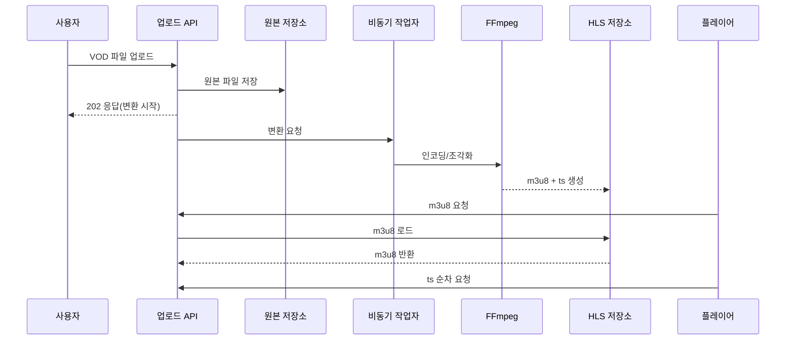

## **7.1 준비**

---

### **1. 스트리밍 방식 비교 (VOD/실시간/CCTV/WebRTC)**

| 방식 | 지연 | 특징 | 대표 사용처 |
| --- | --- | --- | --- |
| VOD | 수 초~수십 초 | 업로드 후 인코딩/조각화 | 유튜브, 넷플릭스 |
| 실시간(라이브) | 수 초 | RTMP ingest 후 HLS/DASH 배포 | 실시간 방송 |
| CCTV | 수 초 | 폐쇄망/RTSP 기반 | 내부망 모니터링 |
| WebRTC | 수백 ms | 초저지연, P2P/중계 | 화상통신/인터랙션 |

VOD는 업로드 후 처리(인코딩, 조각화)를 거치므로 지연이 크지만 대규모 배포에 적합합니다. WebRTC는 지연이 가장 낮지만 동시 접속 규모가 커질수록 인프라 비용이 증가합니다.

---

### **2. 스트리밍 파이프라인 개요 (비동기 반영)**

1) 사용자가 원본 영상을 업로드하면 서버가 파일을 저장합니다.  
2) 업로드 API는 **즉시 응답**하고, 변환 작업은 비동기로 진행됩니다.  
3) FFmpeg가 원본을 인코딩하고 HLS 조각(m3u8/ts)을 생성합니다.  
4) 플레이어는 m3u8을 요청하고, 목록에 있는 ts를 순서대로 다운로드합니다.

---
