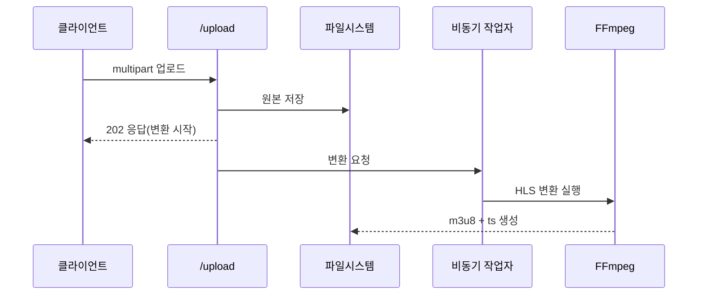

## **7.3 업로드 API 구현 (Postman 대상)**

---

**(확인) 경로: rtmp/src/main/java/com/metacoding/hls/controller/HlsController.java**

### **1. 업로드 엔드포인트 설계 (비동기 반영)**

```java
@PostMapping("/upload")
public ResponseEntity<String> uploadVideo(@RequestParam("file") MultipartFile file) throws IOException {
    String savedName = hlsService.saveOriginalVideo(file);
    hlsService.convertToHlsAsync(savedName);
    return ResponseEntity.accepted().body("HLS 변환 시작: " + file.getOriginalFilename() + "->" + savedName);
}
```

여기서 중요한 흐름은 딱 3단계입니다.

1) `@RequestParam("file")`: form-data의 **file 키**로 업로드된 파일을 받습니다.  
2) `saveOriginalVideo(...)`: 원본 파일을 디스크에 저장하고, 저장된 파일명을 반환합니다.  
3) `convertToHlsAsync(...)`: FFmpeg 변환을 **비동기로 시작**합니다.

응답은 `202 Accepted`로 반환되며, “변환이 시작되었다”는 메시지를 즉시 받습니다.

---

**(확인) 경로: rtmp/src/main/java/com/metacoding/hls/service/HlsService.java**

### **2. 업로드 파일 저장(원본 파일)**

```java
public String saveOriginalVideo(MultipartFile file) throws IOException {
    new File(ORIGINAL_DIR).mkdirs();
    String fileName = "video.mp4";
    File saveFile = new File(ORIGINAL_DIR + fileName);
    file.transferTo(saveFile);
    return fileName;
}
```

- `mkdirs()`: 폴더가 없으면 만들어줍니다. (없으면 저장 실패)
- `file.transferTo(...)`: 업로드된 파일을 **실제 디스크에 저장**합니다.
- `fileName = "video.mp4"`: 이 프로젝트는 “최신 영상 하나”만 다루므로 이름을 고정했습니다.

이 함수의 반환값(`fileName`)은 바로 다음 단계인 **HLS 변환의 기준 이름**으로 사용됩니다.
그래서 `video.mp4`로 고정하면 결과도 `video.m3u8`, `video0.ts`처럼 항상 같은 이름으로 생성됩니다.

여러 파일을 동시에 다루고 싶다면, 아래처럼 **UUID나 업로드 파일명 기반**으로 저장명을 바꾸는 방식이 필요합니다.

```java
String originalName = file.getOriginalFilename();
String ext = originalName.substring(originalName.lastIndexOf("."));
String fileName = UUID.randomUUID() + ext;
```

즉, 업로드할 때마다 기존 `video.mp4`를 덮어쓰는 구조입니다.

---

### **3. 업로드 직후 인코딩 작업 시작 트리거 (비동기)**

```java
String savedName = hlsService.saveOriginalVideo(file);
hlsService.convertToHlsAsync(savedName);
```

현재 구조는 **비동기 실행**입니다. 업로드 응답을 빠르게 반환하고, 인코딩은 백그라운드에서 진행됩니다.

**(비동기 메서드 예시)**

```java
@Async
public CompletableFuture<Void> convertToHlsAsync(String fileName) {
    convertToHls(fileName);
    return CompletableFuture.completedFuture(null);
}
```

비동기로 전환하려면 아래도 함께 필요합니다.

- `@EnableAsync` 활성화 (설정 클래스에 추가)
- 컨트롤러에서 `convertToHlsAsync(...)` 호출

---

### **4. 업로드 → 인코딩 흐름(시퀀스 다이어그램)**



1) 클라이언트가 원본 영상을 전송합니다.  
2) 서버가 `upload/original`에 저장합니다.  
3) 업로드 API는 **즉시 응답**하고, 변환은 백그라운드에서 진행합니다.  
4) FFmpeg가 HLS 조각을 생성합니다.  

**팁:** 변환 시간은 영상 길이/해상도에 비례하므로, 테스트는 짧은 영상부터 시작하는 것이 좋습니다.

---
