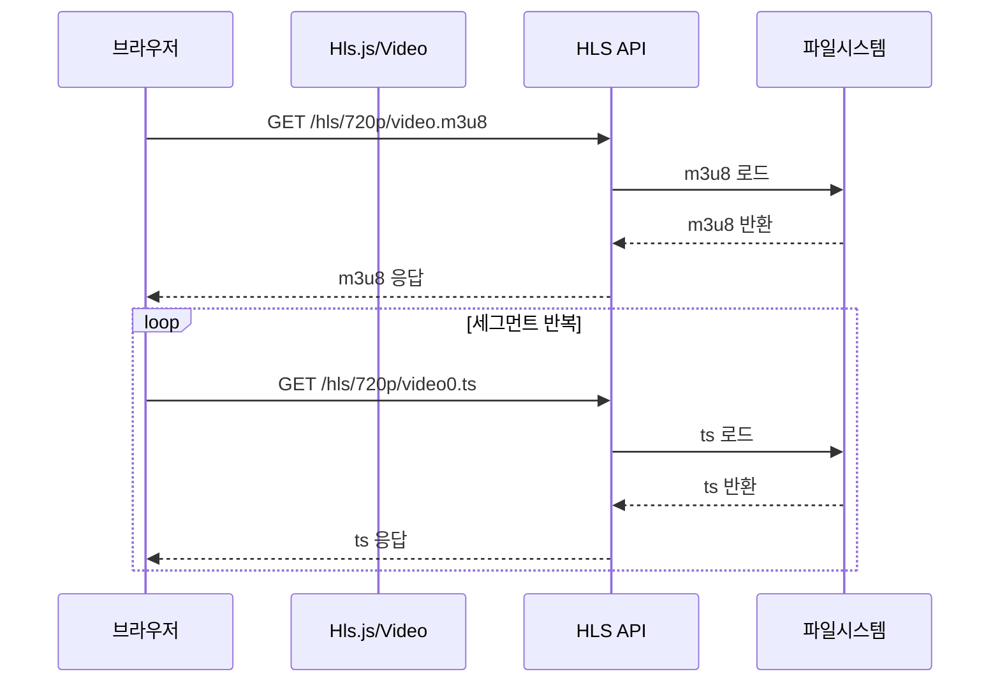

## **7.5 HLS 스트리밍 제공 API/정적 매핑**

---

**(확인) 경로: rtmp/src/main/java/com/metacoding/hls/controller/HlsController.java**

### **1. m3u8 제공 방식**

```java
@GetMapping("/hls/{quality}/{fileName}.m3u8")
public ResponseEntity<Resource> getHlsPlaylist(
        @PathVariable String quality,
        @PathVariable String fileName) throws IOException {
    Resource resource = hlsService.loadHlsFile(quality, fileName + ".m3u8");
    HttpHeaders headers = new HttpHeaders();
    headers.setContentType(MediaType.parseMediaType("application/vnd.apple.mpegurl"));
    return new ResponseEntity<>(resource, headers, HttpStatus.OK);
}
```

- `quality`: `720p` 또는 `1080p`
- `fileName`: 현재는 `video`로 고정
- 응답 MIME 타입: `application/vnd.apple.mpegurl` (m3u8 전용 타입)

플레이어는 **항상 m3u8을 먼저 요청**하고, 그 안의 ts 목록을 읽습니다.

비동기 변환 중에는 m3u8이 아직 없을 수 있으므로, 처음 요청이 실패하면 잠시 기다렸다가 다시 시도합니다.

---

### **2. ts 세그먼트 제공 방식**

```java
@GetMapping("/hls/{quality}/{tsSegment}.ts")
public ResponseEntity<Resource> getHlsTs(
        @PathVariable String quality,
        @PathVariable String tsSegment) throws IOException {
    Resource resource = hlsService.loadHlsFile(quality, tsSegment + ".ts");
    HttpHeaders headers = new HttpHeaders();
    headers.setContentType(MediaType.APPLICATION_OCTET_STREAM);
    return new ResponseEntity<>(resource, headers, HttpStatus.OK);
}
```

- `.ts`는 **영상 조각 파일**이라 일반 바이너리 타입(`application/octet-stream`)으로 내려줍니다.
- 브라우저는 m3u8에 적힌 조각들을 **순서대로 다운로드**하여 재생합니다.

---

**(확인) 경로: rtmp/src/main/java/com/metacoding/hls/service/HlsService.java**

### **3. 파일 로딩(실제 파일 경로 매핑)**

```java
public Resource loadHlsFile(String quality, String fileName) throws IOException {
    String path;
    if (quality.equals("720p")) path = CONVERT_DIR_720;
    else if (quality.equals("1080p")) path = CONVERT_DIR_1080;
    else throw new RuntimeException("지원하지 않는 해상도");
    File file = new File(path, fileName);
    if (!file.exists()) throw new IOException("파일 없음: " + file.getAbsolutePath());
    return new FileSystemResource(file.getCanonicalPath());
}
```

- `quality` 값으로 **폴더를 선택**합니다.
- 파일이 없으면 예외가 발생하므로, 변환이 완료되었는지 확인하는 용도로도 사용됩니다.

---

**(확인) 경로: rtmp/src/main/resources/templates/index.mustache**

### **4. 브라우저에서 HLS가 동작하는 이유(HTTP 기반 흐름)**

```html
var url = `http://localhost:8080/hls/${quality}/video.m3u8`;
if (Hls.isSupported()) {
    var hls = new Hls({ debug: true });
    hls.loadSource(url);
    hls.attachMedia(video);
} else if (video.canPlayType("application/vnd.apple.mpegurl")) {
    video.src = url;
}
```

- 크롬/엣지는 **Hls.js**로 재생합니다.
- 사파리는 HLS를 기본 지원하므로 `video.src`로 바로 재생합니다.

즉, HLS는 **HTTP로 파일을 순서대로 받는 방식**이라 별도 전용 프로토콜이 필요 없습니다.

---

### **5. 재생 요청 흐름(시퀀스 다이어그램)**



1) 브라우저가 m3u8을 요청합니다.  
2) 서버가 파일시스템에서 m3u8을 읽어 반환합니다.  
3) 브라우저는 m3u8에 정의된 ts를 순차 요청합니다.  
4) ts가 계속 내려오면서 재생이 유지됩니다.

---
