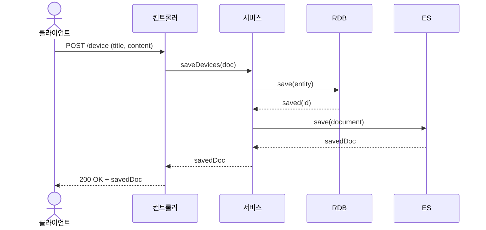

Elasticsearch 실습은 아래 깃주소를 git clone 하고 직접 서버를 실행하여 실습합니다.

**실습 코드**

```java
https://github.com/metacoding-11-spring-reference/spring-elasticsearch
```

---

## **1) 서비스 계층 설계**

---

**(확인) 경로: src/main/java/com/metacoding/spring_elasticsearch/ElasticSearch/ElasticSearchService.java**

### **1. RDB 저장 → ES 저장**

```java
@Transactional
public DeviceDocument saveDevices(DeviceDocument doc) {
    ...
    DeviceEntity entity = ...;

    DeviceEntity saved = deviceJpaRepository.save(entity);

    DeviceDocument savedDoc = new DeviceDocument(
            saved.getId(),
            saved.getTitle(),
            saved.getContent());

    deviceSearchRepository.save(savedDoc);
    return savedDoc;
}
```

RDB에 먼저 저장해 PK를 확보한 뒤, 동일한 ID로 ES 문서를 생성해 dual write를 수행합니다.

---

## **2) 트랜잭션 단위 처리 전략**

---

### **1. 단일 트랜잭션의 한계와 트레이드오프**

```java
@Transactional
public DeviceDocument saveDevices(DeviceDocument doc) { ... }
```

RDB와 ES는 서로 다른 저장소이기 때문에 하나의 트랜잭션으로 완전한 원자성을 보장할 수 없습니다. 현재 구조는 **RDB 저장 → ES 저장** 순서이며, ES 저장 실패 시 보상 처리(재시도/큐 적재 등)가 필요할 수 있습니다.

---

## **3) 저장 API 구현 (POST)**

---

**(확인) 경로: src/main/java/com/metacoding/spring_elasticsearch/ElasticSearch/ElasticSearchSearchController.java**

```java
...
@PostMapping("/device")
public DeviceDocument saveDevice(@RequestBody DeviceDocument doc) {
    return elasticSearchService.saveDevices(doc);
}
...
```

POST 요청을 받으면 서비스의 `saveDevices()`가 호출되어 RDB와 ES가 동시에 저장됩니다.

---

### **4. 저장 흐름 시퀀스 다이어그램**



요청이 들어오면 컨트롤러가 서비스에 전달하고, 서비스는 RDB 저장 후 ES에 문서를 저장한 뒤 최종 결과를 반환합니다.

---
