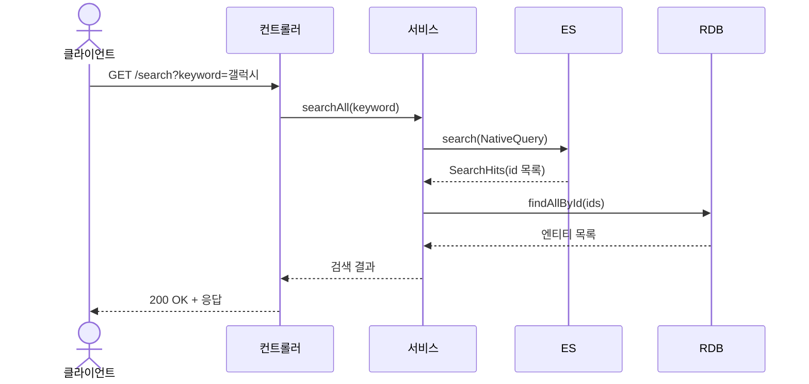

Elasticsearch 실습은 아래 깃주소를 git clone 하고 직접 서버를 실행하여 실습합니다.

**실습 코드**

```java
https://github.com/metacoding-11-spring-reference/spring-elasticsearch
```

---

## **1) 검색 API 설계 (keyword)**

---

**(확인) 경로: src/main/java/com/metacoding/spring_elasticsearch/ElasticSearch/ElasticSearchSearchController.java**

```java
...
@GetMapping("/search")
public List<DeviceEntity> search(@RequestParam("keyword") String keyword) {
    return elasticSearchService.searchAll(keyword);
}
...
```

`/search?keyword=갤럭시` 형태로 키워드를 전달하면 Elasticsearch에서 먼저 검색한 뒤 RDB에서 재조회합니다.

---

## **2) ES 검색 쿼리 선택 (match/multi_match + fuzziness)**

---

**(확인) 경로: src/main/java/com/metacoding/spring_elasticsearch/ElasticSearch/ElasticSearchService.java**

```java
public List<DeviceEntity> searchAll(String keyword) {
    NativeQuery query = NativeQuery.builder()
            .withQuery(q -> q.bool(b -> b
                    .should(s -> s.multiMatch(m -> m
                            .fields("title^3", "content")
                            .query(keyword)
                            .fuzziness("AUTO")))
                    .minimumShouldMatch("1")))
            .build();
    ...
}
```

`multi_match`는 여러 필드를 동시에 검색하고, `fuzziness("AUTO")`로 오타를 허용합니다. `title^3`으로 제목 필드의 점수를 높여 정확도를 개선합니다.

---

## **3) ES 결과에서 ID 추출 → RDB 재조회**

---

**(확인) 경로: src/main/java/com/metacoding/spring_elasticsearch/ElasticSearch/ElasticSearchService.java**

```java
public List<DeviceEntity> searchAll(String keyword) {
    ...
    var deviceHits = operations.search(query, DeviceDocument.class);

    List<Long> ids = deviceHits.stream()
            .map(hit -> hit.getContent().getId())
            .toList();

    return deviceJpaRepository.findAllById(ids);
}
```

ES는 검색에 최적화된 저장소이기 때문에, 검색 결과의 ID를 기반으로 RDB에서 최신 데이터를 재조회해 응답을 구성합니다.

---

### **4. 검색 흐름 시퀀스 다이어그램**



검색은 ES에서 수행하고, 실제 응답 데이터는 RDB에서 재조회하여 정합성을 유지합니다.

---
