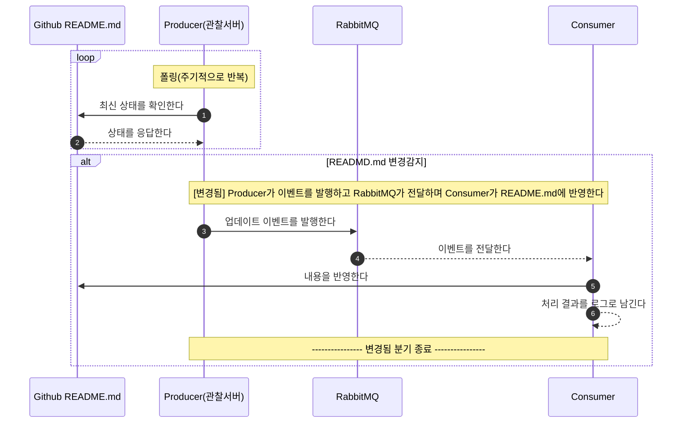

이 장은 GitHub의 README.md 변경을 감지해서 로컬 README.md에 반영하는 전체 흐름을 설명합니다. 프로듀서(관찰)와 컨슈머(반영)를 분리하고, 그 사이를 RabbitMQ가 중계하는 구조를 먼저 잡는 것이 목표입니다. 

---

## **1) 구성 요소**

### **1-1. Producer(관찰 서버)**

프로듀서는 GitHub README.md를 주기적으로 확인하고, 변경이 감지되면 메시지를 발행합니다. 입력은 GitHub README.md이며 출력은 RabbitMQ로 보내는 메시지입니다.

### **1-2. RabbitMQ(중계자)**

RabbitMQ는 프로듀서와 컨슈머 사이에서 메시지를 전달하는 중계자입니다. 프로듀서와 컨슈머를 분리해서 한쪽 장애가 다른 쪽에 직접 전파되지 않도록 완충 역할을 합니다. 또한 메시지 형식이 표준화되면 대상 파일이 README.md가 아니어도 쉽게 확장할 수 있습니다.

### **1-3. Consumer(수신 서버)**

컨슈머는 큐를 구독하고 메시지를 수신한 뒤, 로컬 README.md를 업데이트합니다. 필요하면 반영 전 백업을 만들고, 반영 결과를 로그로 남겨서 추적 가능하게 합니다.

### **1-4. README.md(최종 반영 대상)**

README.md는 최종 반영 대상 파일입니다. 프로듀서가 감지한 변경이 메시지로 전달되어, 컨슈머가 이 파일을 업데이트합니다.

---

## **2) 시나리오 흐름**

1. **Producer(관찰서버)**가 일정 주기로 Github README.md의 최신 sha를 확인합니다.
2. sha가 바뀌면 README.md의 최신 내용을 가져와 메시지를 구성합니다.
3. **Producer(관찰서버)**는 RabbitMQ의 exchange로 메시지를 발행합니다.
4. RabbitMQ는 routing-key 규칙에 따라 RabbitMQ의 exchange에 메시지를 큐로 전달합니다.
5. **Consumer(수신 서버)**는  RabbitMQ의 메시지 큐에서 메시지를 수신하고 README.md를 업데이트합니다.
6. **Consumer(수신 서버)** 로그와 파일 내용을 통해 변경 결과를 확인합니다.

---