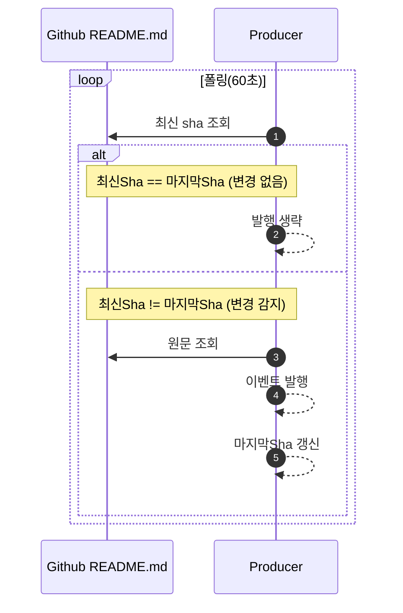

폴링 설계는 “무엇을 비교할 것인가”와 “얼마나 자주 확인할 것인가”를 먼저 고정하는 작업입니다. 

---

### **1) 어떤 값을 비교할 것인가**

| **비교 기준** | **장점** | **단점** | **추천 상황** |
| --- | --- | --- | --- |
| **sha**(커밋/파일 버전 식별자) | 가장 명확하고 재현이 쉬움(로그에 sha만 남겨도 됨) | “파일 자체”가 아니라 “Git 상태” 기준(구현에 따라 커밋 기준이 됨) | README.md처럼 Git으로 관리되는 파일 변경 감지에 기본값 |
| **ETag**(HTTP 캐시 검증자) | 네트워크/응답을 줄이기 쉬움(조건부 요청) | 서버/엔드포인트마다 동작이 다를 수 있음, 도구 이해 필요 | HTTP 기반으로 가볍게 감지하고 싶을 때 |
| **Last-Modified**(수정 시각) | 이해가 쉽고 구현이 간단 | 시간이 정확하지 않거나 갱신 규칙이 애매한 경우가 있음 | “대략적인 변경 감지”가 허용되는 경우 |
| **Content Hash**(내용 해시) | “내용이 실제로 바뀌었는지”를 최종적으로 보장 | 내용을 내려받아야 계산 가능(비용 큼) | 최종 검증용(sha/etag로 1차 감지 후 필요 시 2차 확인) |

폴링에서 비교 값은 “변경 여부를 판단하는 기준”입니다. 보통 아래 4가지 중 하나를 씁니다.

- **sha**: 가장 확실한 변경 식별자입니다. README.md처럼 Git으로 관리되는 파일은 기본 선택입니다.
- **ETag**: 변경 없으면 빠르게 건너뛰기 좋은 HTTP 검증 값입니다(조건부 요청에 유리).
- **Last-Modified**: 수정 시각으로 대략 판단합니다. 간단하지만 정확도가 떨어질 수 있습니다.
- **Content Hash**: 실제 내용이 바뀌었는지 최종 확인합니다. 정확하지만 내용을 내려받아야 해서 비용이 큽니다.

실습 기준으로는 **sha 비교**가 가장 단순하고 안정적이기에 sha를 비교하여 변경을 감지합니다.

---

### **2) Polling 주기 전략과 주의사항**

폴링 주기는 단순히 “10초,60초” 숫자 문제가 아니라, 레이트리밋과 중복 발행을 고려해 안정적으로 굴러가게 만드는 설계입니다.

### **2-1. 주기 선택 전략**

- **개발/실습**: 10~30초처럼 짧게 잡아 “동작 확인”을 빠르게 합니다. 실습은 1분 주기로 합니다.
- **운영**: 1분~5분 범위에서 시작하고, 실제 변경 빈도/레이트리밋/비용을 보고 조정합니다.
- 변경이 드문 파일(README)일수록 주기를 길게 잡는 편이 유리합니다.

### **2-2. 레이트리밋(요청 제한) 주의**

- GitHub API는 호출 제한이 있으므로, 주기가 짧아질수록 제한에 빨리 도달합니다.
- 특히 여러 저장소/여러 파일을 동시에 폴링하면 “주기 × 대상 개수”만큼 호출이 늘어납니다.
- 따라서 운영에서는 다음 중 하나를 반드시 포함하는 것이 좋습니다.
    - **조건부 요청(ETag/If-None-Match, Last-Modified/If-Modified-Since)**로 “변경 없음” 응답을 싸게 받기
    - **지수 백오프(backoff)**: 실패나 제한(429/403)이 발생하면 일정 시간 대기 후 점진적으로 간격 증가

### **2-3. 중복 발행(동일 변경을 여러 번 발행) 방지**

폴링은 같은 데이터를 여러 번 읽을 수 있기 때문에, 중복 발행 방지는 필수입니다.

- **lastSha(또는 lastEtag/lastModified)**를 저장해 비교합니다.
- 변경 감지 시에만 메시지를 발행하고, 발행 후에는 마지막 값을 갱신합니다.

<aside>
💡

운영에서는 `lastSha`를 메모리가 아니라 **Redis/DB 같은 외부 저장소**에 저장해, **재시작/다중 인스턴스에서도 마지막 상태가 유지되도록** 구성하는 방식을 고려할 수 있습니다.

</aside>

---