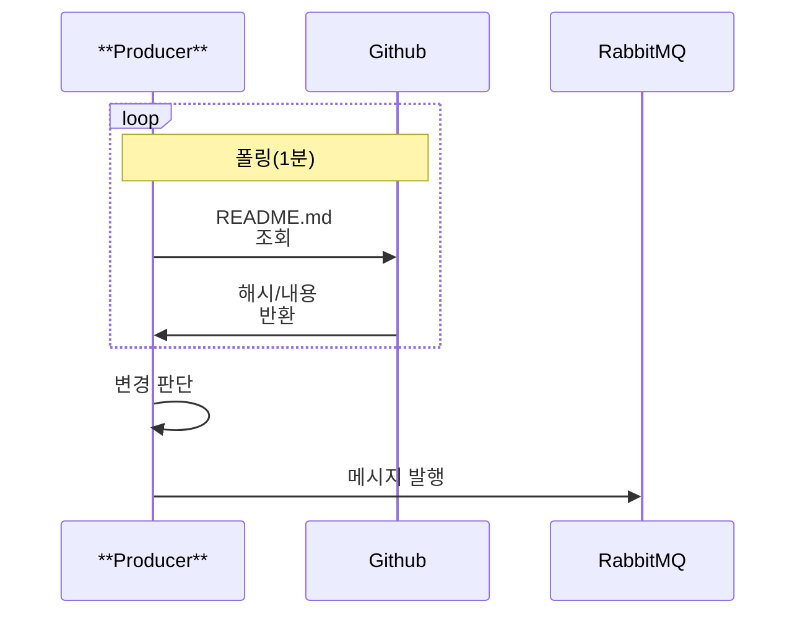

프로듀서는 변경을 감지하고 메시지를 발행하는 역할만 담당합니다. 이 장은 GitHub 조회 → 변경 감지 → 메시지 발행까지의 메서드 흐름을 순서대로 설명합니다.



---

## **1) GitHub 파일 조회 API 호출(주소 기반)**

---

**(확인) 경로: rabbitmq-producer/src/main/java/com/rabbitmq/producer/github/GitHubClient.java**

### **1-1. fetchLatestSha()**

최신 커밋 sha를 가져와 변경 기준으로 사용합니다.

```java
public String fetchLatestSha() {
    ...
    String url = String.format(
        "https://api.github.com/repos/%s/%s/commits?path=%s&per_page=1",
        owner, repo, readmePath
    );
    ...
    ResponseEntity<List<Map<String, Object>>> response =
        restTemplate.exchange(url, HttpMethod.GET, new HttpEntity<>(headers), ...);
    ...
    Object sha = commitObj.get("sha");
    return sha != null ? sha.toString() : null;
}

```

fetchLatestSha()는 owner/repo/readmePath 정보를 이용해 GitHub 커밋 조회 URL을 만들고, per_page=1 옵션으로 최신 커밋 1건만 가져옵니다. 응답 목록이 비어 있으면 null을 반환하고, 목록이 존재하면 첫 번째 커밋 객체에서 sha 값을 꺼내 문자열로 반환합니다.

---

### **1-2. fetchReadmeContent()**

README.md 원문을 raw 주소로 가져옵니다.

```java
public String fetchReadmeContent() {
    ...
    String rawUrl = String.format(
        "https://raw.githubusercontent.com/%s/%s/main/%s",
        owner, repo, readmePath
    );
    return restTemplate.getForObject(rawUrl, String.class);
}

```

fetchReadmeContent()는 [raw.githubusercontent.com](http://raw.githubusercontent.com/) 형식의 주소를 조합하여 [README.md](http://readme.md/) 원문을 문자열로 요청합니다. GitHub에서 내려받은 내용을 그대로 반환하며, 기본 브랜치가 main이 아닌 경우에는 raw URL에서 브랜치명을 실제 브랜치명으로 변경해야 정상 동작합니다.

---

### **1-3. getRepoFullName()**

메시지에 사용할 레포 식별자(owner/repo)를 반환합니다.

```java
public String getRepoFullName() {
    return owner + "/" + repo;
}

```

getRepoFullName()은 owner와 repo를 /로 연결하여 owner/repo 형태의 저장소 식별자를 만들고, 이 값을 메시지의 repo 필드에 넣기 위해 반환합니다.

---

## **2) 변경 감지 로직(이전 값 저장)**

---

**(확인) 경로: rabbitmq-producer/src/main/java/com/rabbitmq/producer/scheduler/PollingScheduler.java**

### **2-1. lastSha 필드**

이전 sha를 저장해 중복 발행을 막습니다.

```java
private String lastSha = null;

```

lastSha는 이전에 확인한 sha 값을 저장해 두는 변수로, 동일한 변경을 반복 발행하지 않기 위한 최소 장치입니다. 최초 실행 시에는 값이 null이며, 최신 sha를 확인한 뒤 lastSha에 저장합니다. 이후 폴링에서 최신 sha가 lastSha와 같으면 “변경 없음”으로 판단하고 발행을 생략합니다.

---

### **2-2. checkForReadmeChange()**

폴링 주기마다 변경 여부를 판단하고, 변경이 있으면 메시지를 발행합니다.

```java
@Scheduled(fixedRateString = "${github.poll-interval-ms}")
public void checkForReadmeChange() {
    ...      
        String latestSha = gitHubClient.fetchLatestSha();
        
       if (latestSha.equals(lastSha)) {...}
       lastSha = latestSha;
       String content = gitHubClient.fetchReadmeContent();
       RabbitDTO message = RabbitDTO.builder()
                .repo(gitHubClient.getRepoFullName())
                .sha(latestSha)
                .content(content)
                .timestamp(LocalDateTime.now())
                .build();
        rabbitProducer.send(message);

   ...
   }
```

checkForReadmeChange()는 @Scheduled로 설정된 폴링 주기마다 실행되며, 먼저 GitHub에서 최신 sha를 조회합니다. 

변경이 감지되면 lastSha를 최신 값으로 갱신한 뒤 [README.md](http://readme.md/) 원문을 조회하고, repo/sha/content/timestamp를 포함한 RabbitDTO를 생성해 RabbitMQ로 발행합니다. 

---

## **3) 변경 발생 시 RabbitMQ로 메시지 발행**

---

**(확인) 경로: rabbitmq-producer/src/main/java/com/rabbitmq/producer/dto/RabbitDTO.java**

### **3-1. RabbitDTO 필드 구성**

메시지에 들어갈 데이터를 명확히 고정합니다.

```java
public class RabbitDTO {
    private String repo;
    private String sha;
    private String content;
    private LocalDateTime timestamp;
}

```

RabbitDTO는 Producer와 Consumer 사이의 메시지 계약이며, repo에는 변경 대상 저장소 식별자를 담고, sha에는 변경 기준이 되는 커밋 해시를 담습니다. content에는 [README.md](http://readme.md/) 원문을 담고, timestamp에는 메시지를 발행한 시각을 기록해 추적과 디버깅에 활용합니다.

---

**(확인) 경로: rabbitmq-producer/src/main/java/com/rabbitmq/producer/rabbit/RabbitProducer.java**

### **3-2. send()**

교환기와 라우팅 키로 메시지를 발행합니다.

```java
public void send(RabbitDTO message) {
    ...
    rabbitTemplate.convertAndSend(exchange, routingKey, message);
    ...
}

```

send()는 application.properties에서 주입받은 exchange와 routingKey를 사용하여 RabbitTemplate.convertAndSend()로 메시지를 발행합니다. 발행이 성공하면 로그를 통해 어떤 메시지가 어떤 경로로 발행되었는지 확인할 수 있도록 구성합니다.

---

### **3-3. 필수 설정 키**

**(확인) 경로: rabbitmq-producer/src/main/resources/application.properties**

```
rabbit.exchange=github.events
rabbit.queue=repo-updates
rabbit.routing-key=readme.changed
```

메시지가 Consumer까지 전달되려면 Producer와 Consumer가 같은 토폴로지를 바라봐야 하므로, exchange, queue, routing-key의 이름이 서로 정확히 일치해야 합니다. 특히 Direct 기반에서는 routing-key의 오타나 불일치가 가장 흔한 실패 원인이므로, 설정값을 문서에서 고정하고 그대로 사용하도록 합니다.

---