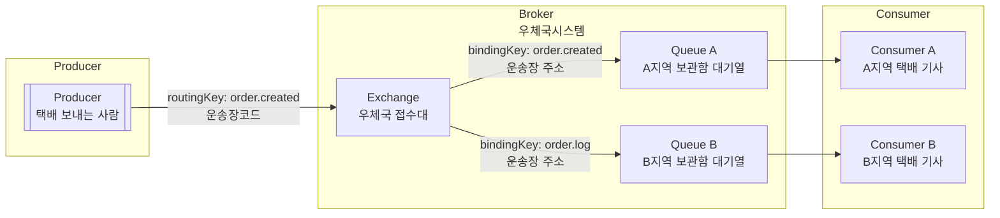

RabbitMQ 구성은 “접속 정보가 맞는가”와 “토폴로지 이름이 일치하는가”를 확인하는 작업입니다. Producer와 Consumer가 같은 Exchange, Queue, Routing Key를 바라보지 않으면 메시지는 발행되어도 도착하지 않습니다. 이 절에서는 실습에서 필요한 개념만 최소로 정리하고, 바로 따라 할 수 있는 토폴로지와 설정값을 고정합니다.

---

### **1) Exchange / Queue / Routing Key 개념**

- **Producer가 메시지를 만든 뒤 Broker로 보냅니다.** Producer는 메시지에 `routingKey`를 함께 붙여서 발행합니다. 이 `routingKey`는 택배 비유로 보면 “운송장에 적힌 분류용 코드”에 해당합니다. 예를 들어 `routingKey: order.created`는 “주문 생성 이벤트”라는 분류 라벨입니다.
- **Broker는 메시지가 들어오는 RabbitMQ 서버입니다.** Producer가 보낸 메시지는 Broker로 들어오며, Broker 내부에서 Exchange와 Queue를 통해 전달 흐름이 처리됩니다. 즉, Broker는 “택배가 들어와서 분류되고 보관되는 우체국 시스템 전체”에 해당합니다.
- **메시지는 Broker 내부의 Exchange로 전달됩니다.** Exchange는 메시지를 받아서, 어떤 Queue로 보낼지를 결정하는 “분류 지점”입니다. 택배 비유로는 “우체국 접수대(분류 입구)” 역할을 합니다.
- **Exchange는 routingKey를 보고 bindingKey 규칙과 매칭합니다.** Queue는 Exchange에 연결될 때(binding) `bindingKey`를 설정합니다. `bindingKey`는 택배 비유로 보면 “우체국이 미리 걸어둔 분류 규칙(이 라벨이면 이 보관함)”입니다. Direct 방식에서는 `routingKey`가 `bindingKey`와 **정확히 일치**할 때만 해당 Queue로 전달됩니다.
- **규칙이 일치하면 Queue에 메시지가 적재됩니다.** 예를 들어 `routingKey: order.created`로 들어온 메시지는 `bindingKey: order.created`로 연결된 **Queue A(A지역 보관함 대기열)**로 들어갑니다. 반대로 `routingKey: order.log` 라벨의 메시지는 **Queue B(B지역 보관함 대기열)**로 들어갑니다. Queue는 메시지를 잠시 쌓아두는 “대기열(버퍼)” 역할을 합니다.
- **Consumer는 Queue를 구독하여 메시지를 수신합니다.** Consumer는 Exchange가 아니라 Queue를 구독합니다. 즉, A지역 택배 기사(Consumer A)는 Queue A에서 메시지를 가져가 처리하고, B지역 택배 기사(Consumer B)는 Queue B에서 메시지를 가져가 처리합니다.

### 가장 중요한 포인트

- Producer는 **Exchange로 보내면서 routingKey를 정확히 붙이면 되고**
- Consumer는 **자신이 볼 Queue 이름만 정확히 구독하면 됩니다**
- Broker는 그 사이에서 **받고(입력) → 분류하고 → 보관하고 → 전달**하는 역할을 합니다

---

### **2) 실습용 토폴로지 설계(Direct 권장)**

실습에서는 라우팅 규칙을 단순하게 만들수록 디버깅이 쉽습니다. 따라서 Topic보다 **Direct 방식**을 권장합니다. Direct는 “routingKey가 정확히 같을 때만 전달”되기 때문에, 오타나 불일치를 즉시 발견할 수 있습니다.

### **실습 토폴로지(고정)**

- **Exchange**: github.events (Direct)
- **Queue**: repo-updates
- **Routing Key**: readme.changed

### **전달 흐름**

- Producer → github.events(Direct Exchange)로 발행(routingKey=readme.changed)
- Exchange → Binding 규칙 일치 시 repo-updates 큐로 전달
- Consumer → repo-updates 큐를 구독하여 수신

---

### **3) 메시지 포맷(JSON)**

메시지 포맷은 Producer와 Consumer가 동일하게 공유해야 합니다. 필드가 다르면 역직렬화가 실패하거나, 값이 누락된 채로 처리됩니다. 

### **권장 JSON 스키마**

- repo: 대상 저장소 식별자(예: owner/repo)
- path: 변경된 파일 경로(예: README.md)
- sha: 변경 버전 식별자
- content: 파일 원문(또는 필요한 부분)
- updatedAt: 변경 시각(UTC 또는 ISO-8601 문자열)

예시(개념용)

- repo: metacoding-11-spring-reference/config-readme
- path: README.md
- sha: abc123...
- content: # Title ...
- updatedAt: 2026-01-05T08:20:00Z

실습에서는 content를 그대로 보내는 형태가 가장 단순하지만, 운영에서는 메시지 크기 관리가 필요하므로 content 대신 URL 또는 sha만 보내고 Consumer가 다시 조회하는 구조도 고려합니다.

---