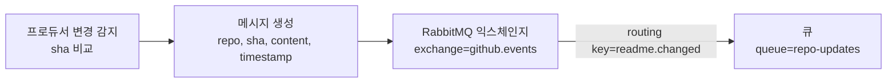

프로듀서가 변경을 감지하면 RabbitMQ로 메시지를 발행합니다. 이후 RabbitMQ Management Console에서 Exchange, Queue, Routing Key(Binding), 그리고 실제 메시지 내용(payload)을 직접 확인하여 “발행이 정상적으로 이루어졌는지”를 눈으로 검증합니다.

---

## **준비**

- RabbitMQ Management Console이 실행 중이어야 합니다.
- Producer 서버(rabbitmq-producer)가 실행 가능해야 합니다.

---

## **1) RabbitMQ 콘솔 접속 및 확인**

http://localhost:15672/ 로 이동하여 RabbitMQ 콘솔에 접속합니다.

---

Exchanges 탭을 클릭하여 기본 상태를 확인합니다.

Producer를 실행한 뒤(또는 첫 메시지 발행 이후) **Exchanges 목록에 github.events** 가 생성된 것을 확인할 수 있습니다.

---

Queues and Streams 탭을 클릭하여 큐 목록을 확인합니다.

초기에는 실습용 큐가 없거나 메시지 수가 0일 수 있습니다. 실습을 진행하면 Producer 설정의 큐 이름인 **repo-updates** 가 생성되고, 메시지가 발행될 때 Ready 카운트가 변하는 것을 확인할 수 있습니다.

아래에서 Producer 서버를 실행하여 실습을 진행합니다.

---

## **2) Producer 서버 실행**

rabbitmq-producer 서버를 실행합니다.

서버실행시에는 config-readme 레포의 최초 커밋을 확인하여 sha를 저장하고 메세지를 발행합니다.

---

## **3) 변경 감지 이벤트 발생시키기**

config-readme 레포에서 아래처럼 [README.md](http://README.md) 파일의 내용을 수정하고 커밋합니다.

프로듀서는 “README가 변경되었다”는 신호를 감지해야 RabbitMQ로 메시지를 발행합니다. 이 실습에서는 config-readme 레포의 README가 새 커밋으로 갱신되어 SHA가 바뀌는 순간을 변경으로 판단합니다. 프로듀서는 일정 주기(폴링)로 GitHub에서 최신 SHA를 조회하고, 직전에 저장해둔 SHA와 비교하여 달라졌을 때만 “변경 감지”로 처리합니다. SHA가 동일하면 “변경 없음”으로 판단하며 메시지를 발행하지 않습니다. 

위와 같이 변경 감지가 발생하면 Producer 로그에는 다음 흐름이 순서대로 찍혀야 합니다.

1. README 변경 감지
    - [폴링] README 변경 감지 → 새로운 SHA: ...
2. RabbitMQ 연결 시도 및 커넥션 생성
    - Attempting to connect to: [localhost:5672]
    - Created new connection ... delegate=amqp://guest@127.0.0.1:5672
3. 메시지 발행(payload 출력)
    - [RabbitMQ] 메시지 발행 → RabbitDTO(repo=..., sha=..., content=..., timestamp=...)

---

## **4) Exchange 생성/존재 확인**

RabbitMQ 콘솔에서 **Exchanges** 메뉴로 이동합니다. Producer 설정의 exchange 이름과 동일한 exchange가 존재하는지 확인합니다.

확인 포인트

- Exchange Name이 Producer 설정값과 일치하는지
- Type(direct)이 의도한 타입인지

---

## **5) Queue 생성/존재 확인**

**Queues and Streams** 메뉴로 이동합니다. Producer가 발행한 메시지를 받을 queue가 존재하는지 확인합니다.

확인 포인트

- Queue Name이 설정값 repo-updates와 일치하는지
- Messages Ready가 증가하는지(Consumer가 아직 안 가져갔다면 증가)

---

## **6) Routing Key(Binding) 확인**

메시지는 Exchange에서 Queue로 “연결(바인딩)”되어 있어야 들어갑니다.

Exchanges에서 해당 exchange를 클릭한 뒤, 하단의 **Bindings** 영역을 확인합니다.

**확인 포인트**

- Source(exchange) → Destination(queue) 바인딩이 존재하는지
- Binding Key(= routing key)가 Producer가 발행한 routing key와 일치하는지
    - direct/type이라면 routing key가 정확히 일치해야 합니다.
    - topic이라면 패턴이 맞아야 합니다(예: readme.*).
        
        ---
        

## **7) 메시지 내용(payload) 직접 확인**

Queue 상세로 들어가서 메시지를 직접 확인합니다.

Queues → 대상 Queue 클릭 → **Get messages** → **Messages : 1 입력 후 Get Message 클릭** 

확인 포인트

- payload(JSON)가 Producer에서 발행한 내용과 동일한지
- 변경된 대상(예: repo, sha, content, timestamp 등)이 들어 있는지

---

## **정리: 성공 기준 체크리스트**

- Producer 로그에 “변경 감지”와 “메시지 발행”이 찍힌다.
- RabbitMQ 콘솔 Exchanges에 exchange가 존재한다.
- 해당 exchange에 queue로의 binding이 걸려 있고 routing key가 맞다.
- queue에 메시지가 쌓이거나(get messages로 확인 가능) message rate 변화가 보인다.
- 메시지 payload에서 변경 대상 정보가 기대한 형태로 들어온다.

---

다음 실습에서는 Consumer(수신자) 서버를 구현하고 Consumer가 RabbitMQ의 queue(repo-updates)에 있는 메세지를 받아 README.md를 수정 및 동기화 하는 작업을 진행합니다.