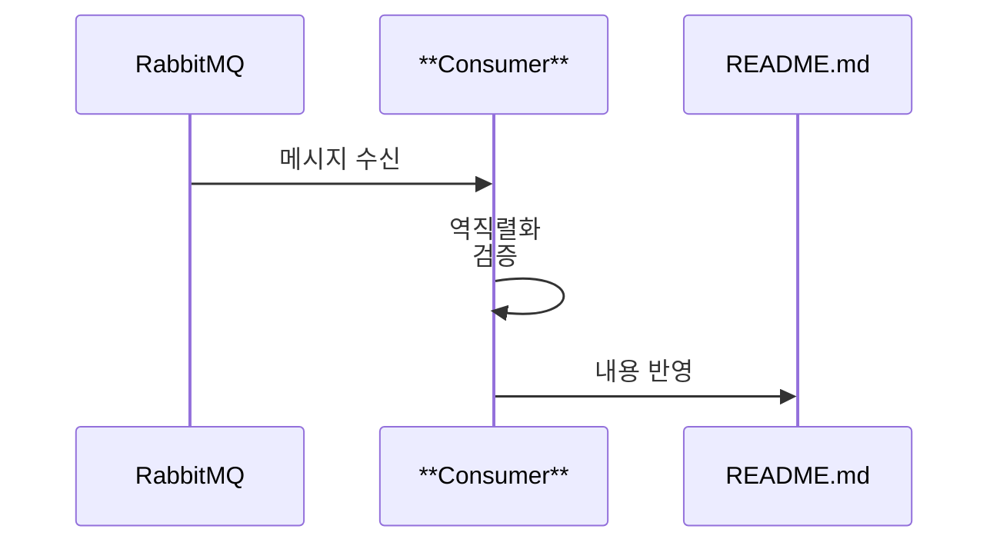

컨슈머는 메시지를 수신해 README.md에 반영하는 역할만 수행합니다.



---

## **1) Queue 구독(Listener)**

---

**(확인) 경로: rabbitmq-consumer/src/main/resources/application.properties**

### **1-1. 큐 이름 설정**

컨슈머는 rabbit.queue 값을 통해 구독할 큐를 결정합니다.

```
rabbit.queue=repo-updates

```

프로듀서와 동일한 큐 이름을 사용해야 하며, 이름이 다르면 메시지가 수신되지 않습니다.

---

**(확인) 경로: rabbitmq-consumer/src/main/java/com/rabbitmq/consumer/config/RabbitConfig.java**

### **1-2. 큐 빈 등록**

큐를 스프링 빈으로 등록해 컨슈머가 구독 가능하게 만듭니다.

```java
@Bean
public Queue queue() {
    return new Queue(queueName, true);
}

```

queueName은 rabbit.queue에서 주입됩니다. true는 durable(서버 재시작에도 큐 유지) 설정입니다.

---

**(확인) 경로: rabbitmq-consumer/src/main/java/com/rabbitmq/consumer/listener/RabbitConsumer.java**

### **1-3. @RabbitListener 수신 메서드**

메시지가 큐에 들어오면 receive()가 자동 호출됩니다.

```java
@RabbitListener(queues = "${rabbit.queue}")
public void receive(RabbitDTO message) {
    ...
}

```

스프링이 rabbit.queue 값을 읽어 해당 큐를 구독합니다. 메시지가 들어오면 RabbitDTO로 역직렬화해 전달합니다.

---

## **2) 메시지 역직렬화**

---

**(확인) 경로: rabbitmq-consumer/src/main/java/com/rabbitmq/consumer/config/RabbitConfig.java**

### **2-1. JSON 메시지 컨버터 등록**

JSON → RabbitDTO 변환을 위해 컨버터를 등록합니다.

```java
@Bean
public MessageConverter jsonMessageConverter() {
    return new Jackson2JsonMessageConverter();
}

```

프로듀서가 JSON으로 보낸 메시지를 읽을 수 있게 합니다. 컨버터가 없으면 메시지 변환 오류가 발생할 수 있습니다.

---

**(확인) 경로: rabbitmq-consumer/src/main/java/com/rabbitmq/consumer/dto/RabbitDTO.java**

### **2-2. DTO 필드 구성**

프로듀서 DTO와 동일한 필드 구조를 유지해야 합니다.

```java
public class RabbitDTO {
    private String repo;
    private String sha;
    private String content;
    private LocalDateTime timestamp;
}

```

필드명이 다르면 역직렬화가 실패합니다. Producer/Consumer DTO는 항상 동기화해야 합니다.

---

## **3) 로컬 README.md 파일 수정/반영 로직**

---

**(확인) 경로: rabbitmq-consumer/src/main/java/com/rabbitmq/consumer/listener/RabbitConsumer.java**

### **3-1. README_PATH 상수**

반영 대상 파일 위치를 고정합니다.

```java
private static final String README_PATH = "./README.md";

```

프로젝트 루트를 기준으로 README.md를 찾습니다. 경로가 다르면 파일 반영이 실패합니다.

---

### **3-2. receive() 로직**

수신한 메시지를 로그로 확인하고 patchFile()을 호출합니다.

```java
public void receive(RabbitDTO message) {
    System.out.println("=== 메시지 수신 ===");
    System.out.println("Repository: " + message.getRepo());
    System.out.println("SHA: " + message.getSha());
    System.out.println("타임스탬프: " + message.getTimestamp());
    ...
    try {
        patchFile(message.getContent());
    } catch (IOException e) {
        System.err.println("파일 업데이트 중 오류 발생: " + e.getMessage());
    }
}

```

메시지 필드를 로그로 출력하고 patchFile()로 파일 업데이트를 시도합니다. IOException은 로그로만 처리합니다.

---

### **3-3. patchFile() 로직**

README.md를 비교하고 필요 시 백업 후 업데이트합니다.

```java
private void patchFile(String newContent) throws IOException {
    File file = new File(README_PATH);
    if (!file.exists()) { ... }
    String oldContent = Files.readString(file.toPath(), StandardCharsets.UTF_8);
    if (Objects.equals(oldContent.trim(), newContent.trim())) { ... }
    File backupDir = new File(file.getParent(), "backups");
    if (!backupDir.exists()) { ... }
    String backupFileName = String.format("readme_backup_%d.md", System.currentTimeMillis());
    Files.copy(file.toPath(), backupFile.toPath(), StandardCopyOption.REPLACE_EXISTING);
    writeContent(file, newContent);
}

```

README.md가 없으면 새로 생성하고, 기존 내용과 같으면 종료합니다. backups 폴더를 만든 뒤 타임스탬프 기반 백업 파일을 저장하고 새 내용으로 덮어씁니다.

---

### **3-4. writeContent() 로직**

UTF-8로 파일 내용을 저장합니다.

```java
private void writeContent(File file, String content) throws IOException {
    try (Writer writer = new OutputStreamWriter(new FileOutputStream(file, false), StandardCharsets.UTF_8)) {
        writer.write(content);
    }
}

```

파일을 덮어쓰기 모드로 열고 UTF-8로 내용을 저장합니다. try-with-resources로 자원을 자동 종료합니다.