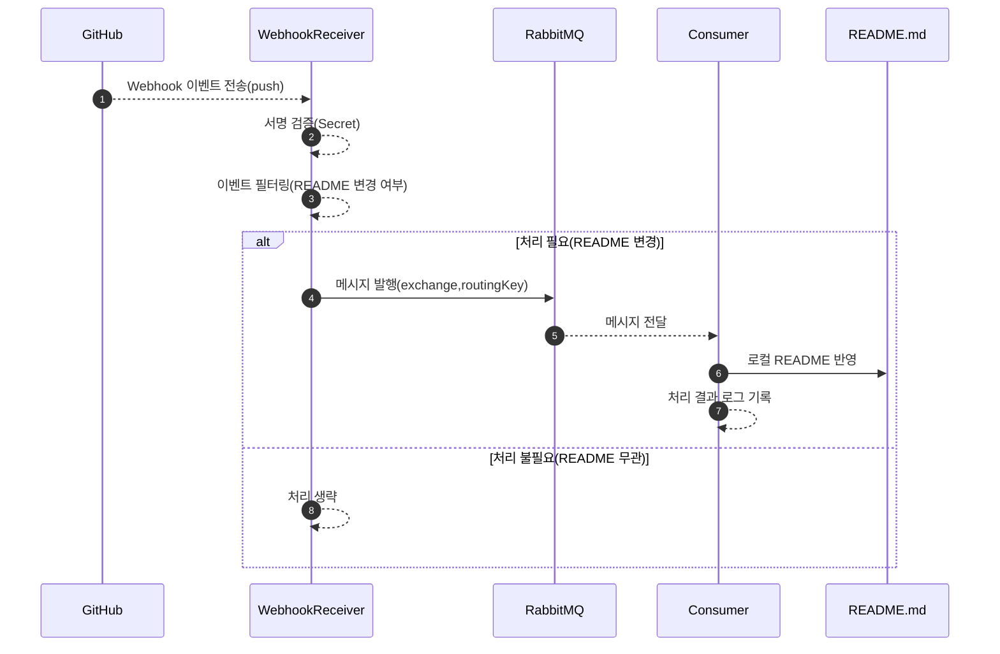
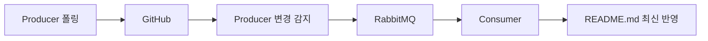
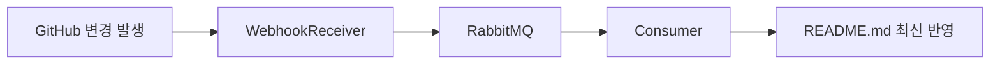

지금까지는 Polling 방식으로 README.md가 바뀌었는지 “우리가 주기적으로 확인”했습니다. 실무에서는 이걸 Webhook 방식으로 사용하는 경우가 많습니다. Webhook은 GitHub가 “바뀌면 바로 우리 서버로 알려주는 방식”이라서, 확인을 계속 하느라 생기는 불필요한 호출을 줄일 수 있습니다.

즉, Producer 관찰 서버가 불필요해집니다.

---

### **1) Webhook으로 바꿀 때 구조는 어떻게 바뀌나**

### 1.1 기존 구조(Polling)

- Producer→ RabbitMQ → Consumer

---

### 1.2 Webhook 구조(실무 확장)

- GitHub → WebhookReceiver(Producer 역할) → RabbitMQ → Consumer

즉, Producer**가 하던 ‘변경 감지’ 일을 GitHub가 대신 해주고**, 우리 쪽에는 “WebhookReceiver”라는 **받는 서버**가 추가됩니다.

---

### **2) Webhook을 쓰려면 왜 IP(또는 도메인)가 필요하나**

Webhook은 GitHub가 우리 서버로 “직접 요청을 보내는 방식”입니다. 그래서 GitHub가 접근할 수 있는 주소가 필요합니다.

- localhost:8080은 내 컴퓨터 안에서만 보입니다. GitHub는 내 컴퓨터 안으로 들어올 수 없습니다.
- 그래서 GitHub가 접근 가능한 주소가 있어야 합니다. 예를 들면:
    - 공인 IP가 있는 서버 주소
    - 도메인(예: myserver.com)
    - 개발용 임시 주소(터널링을 이용해 잠깐 공개)

정리하면, Polling은 “내가 밖으로 나가서 확인”이라 로컬에서도 되지만, Webhook은 “밖에서 내 서버로 들어옴”이라 외부에서 접근 가능한 주소가 필요합니다.

---