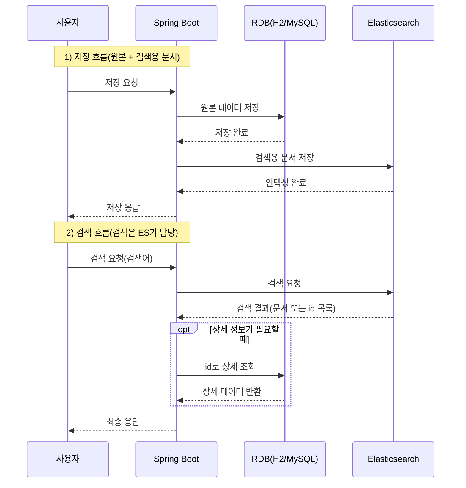

Elasticsearch 시퀸스 다이어그램



이 실습은 **RDB(H2/MySQL)** 와 **Elasticsearch** 를 함께 사용하는 기본 구조를 이해하는 것이 목표입니다. RDB는 회원/게시글 같은 업무 데이터를 안전하게 저장하는 **원본 저장소**이고, Elasticsearch는 검색을 빠르게 하기 위해 필요한 데이터를 문서로 저장하는 **검색 전용 저장소**입니다. 

---

Elasticsearch 실습은 아래 깃주소를 git clone 하고 docker compose up으로 실행하여 진행합니다.

**실습 코드**

```java
https://github.com/metacoding-11-spring-reference/docker-elasticsearch
```

---

## **1) Docker로 Elasticsearch 실행(로컬)**

Elasticsearch는 Spring Boot 안에 포함되는 기능이 아니라, **별도의 검색 서버**입니다. 따라서 실습에서는 Spring Boot를 실행하기 전에 Elasticsearch를 먼저 실행해 두어야 합니다. Kibana는 Elasticsearch 상태와 인덱스, 문서 저장 여부를 브라우저에서 확인하기 위한 도구입니다.

---

### **1-1. 무엇을 실행하나요**

이 실습에서는 Docker로 아래 3가지를 실행합니다.

- **Elasticsearch**: 검색 서버 (9200)
- **Kibana**: 확인용 화면 (5601)
- **Spring Boot 앱(app)**: 실습 API 서버 (8080)

실습 순서는 **Elasticsearch → Kibana → Spring Boot(app)** 순서로 진행합니다.

---

### **1-2. 실행 파일 위치**

**(확인) 경로: elasticsearch/docker-compose.yml**

```java
services:
  elasticsearch:
    image: docker.elastic.co/elasticsearch/elasticsearch:8.19.8
    container_name: elasticsearch
    ports:
      - "9200:9200" # ES 접속 포트
    environment:
      - discovery.type=single-node # 단일 노드
      - xpack.security.enabled=false # 보안 OFF
      - ES_JAVA_OPTS=-Xms1g -Xmx1g # 힙 1GB
    networks:
      - es-network

  kibana:
    image: docker.elastic.co/kibana/kibana:8.19.8
    ports:
      - "5601:5601" # Kibana UI
    environment:
      - ELASTICSEARCH_HOSTS=http://elasticsearch:9200 # ES 주소
    networks:
      - es-network

  app:
    build:
      context: .
      dockerfile: elasticsearch/Dockerfile
    container_name: spring-elasticsearch-app
    ports:
      - "8080:8080" # Spring Boot
    networks:
      - es-network

networks:
  es-network:
    driver: bridge
```

---

### **1-3. 왜 단일 노드와 보안 OFF가 필요한가요**

로컬 실습에서는 클러스터 구성이나 인증이 목적이 아니므로, 아래 설정으로 **연결을 단순화**합니다.

- discovery.type=single-node : 단일 노드로 실행합니다.
- xpack.security.enabled=false : 인증 없이 접속할 수 있게 합니다.

---

### **1-4. 실행 명령**

```
docker compose up -d
```

---

### **1-5. 실행 확인**

- Elasticsearch: http://localhost:9200
- Kibana: http://localhost:5601

<aside>
💡

Kibana는 Elasticsearch에 저장된 인덱스와 문서를 화면에서 확인하는 도구입니다. 실습에서는 인덱스 생성과 문서 저장 여부를 빠르게 검증하는 용도로 사용합니다.

</aside>

---

### **1-6. localhost와 elasticsearch 차이**

Spring Boot가 **로컬에서 실행되면** 도커에 노출된 포트로 접근하므로 localhost:9200을 사용합니다. Spring Boot가 **도커 컨테이너에서 실행되면** 같은 도커 네트워크 내부에서 서비스 이름으로 통신하므로 elasticsearch:9200을 사용합니다.


---

## **2) Spring Boot 프로젝트 구성**

---

**(확인) 경로: spring-elasticsearch/build.gradle**

### **의존성 추가**

```java
implementation 'org.springframework.boot:spring-boot-starter-data-elasticsearch'
```

Spring Boot에서 Elasticsearch와 연동해 인덱싱·검색 같은 기능을 쉽게 구현할 수 있도록 Spring Data Elasticsearch를 포함하는 스타터 의존성 `spring-boot-starter-data-elasticsearch`를 추가합니다.

---

## **3) RDB(H2/MySQL) + Elasticsearch 동시 연결 설정**

---

**(확인) 경로: src/main/resources/application.properties**

### **H2 + Elasticsearch 연결 설정**

```java
spring.datasource.url=jdbc:h2:mem:testdb;MODE=MySQL
spring.datasource.username=sa
spring.datasource.password=

spring.elasticsearch.uris=http://elasticsearch:9200
```

로컬 PC에서 실행 시 `http://localhost:9200`을 사용할 수 있고, 도커 네트워크 안에서는 `http://elasticsearch:9200`으로 접근해야 합니다.

- RDB(H2/MySQL)는 회원/게시글/상품 같은 업무 데이터를 트랜잭션으로 안전하게 저장하는 원본 저장소입니다.
- Elasticsearch는 그 원본 데이터 중 “검색에 필요한 부분”을 문서로 복사해 두고, 인덱스로 빠르게 검색하기 위한 검색 전용 저장소입니다.

---